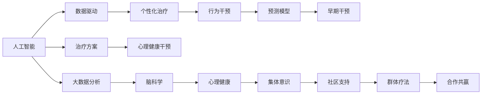

                 

# 全球脑与心理健康：集体意识的治愈力量

## 1. 背景介绍

在全球化日益加剧的背景下，人们的心理健康问题愈发受到广泛关注。现代生活节奏加快，社会竞争激烈，各种精神压力不断涌现。随着科技的进步，脑科学研究逐步深入，人工智能和认知科学技术的结合，为脑与心理健康的治疗提供了新的思路。

在这篇文章中，我们将重点探讨人工智能和大数据如何帮助我们理解心理疾病，并利用集体意识的力量来治愈这些疾病。我们将首先介绍与心理健康相关的核心概念和联系，然后深入分析基于集体意识的治愈方法，最后总结未来的发展趋势和面临的挑战。

## 2. 核心概念与联系

### 2.1 核心概念概述

为了更好地理解人工智能在脑与心理健康中的作用，我们首先介绍几个核心概念：

1. **人工智能 (AI)**：通过模拟人类智能行为，实现问题求解、决策支持、图像识别、自然语言处理等功能。
2. **大数据分析**：从海量数据中提取有价值的信息，进行模式识别和预测，为决策提供依据。
3. **脑科学**：研究人类大脑结构和功能，揭示认知和情感过程的机制。
4. **心理健康**：研究人类心理和行为的正常与异常，关注如何预防、评估和治疗心理疾病。
5. **集体意识 (Collective Consciousness)**：一组或多组个体之间共享的心理状态，通过互动和沟通形成。

### 2.2 核心概念原理和架构的 Mermaid 流程图



这个流程图展示了人工智能、大数据、脑科学、心理健康和集体意识之间的联系。我们可以看到，人工智能和大数据在脑科学研究中发挥着重要作用，提供了新的分析工具和技术，而脑科学研究又为人工智能和大数据提供了新的应用领域。心理健康则是人工智能、大数据和脑科学的共同目标，而集体意识则为心理健康干预提供了新的方法。

## 3. 核心算法原理 & 具体操作步骤

### 3.1 算法原理概述

基于集体意识的治愈方法，主要依赖于人工智能和大数据技术的结合。通过分析大量用户数据，利用机器学习算法识别出潜在的心理健康问题，并结合群体疗法和社区支持，实现对心理疾病的早期干预和治疗。

核心算法原理主要包括以下几个步骤：

1. **数据收集**：从各种渠道收集大量的用户数据，包括社交媒体、健康记录、精神评估等。
2. **数据分析**：利用大数据技术对收集到的数据进行分析，提取有价值的信息，如情感趋势、行为模式等。
3. **模型训练**：使用机器学习算法（如深度学习、决策树、支持向量机等）训练预测模型，识别出潜在的心理健康问题。
4. **干预措施**：根据模型预测结果，制定个性化的干预措施，如行为疗法、心理辅导等。
5. **集体干预**：通过群体疗法和社区支持，使个体能够更好地融入集体，增强心理韧性。

### 3.2 算法步骤详解

#### 3.2.1 数据收集

数据收集是整个治愈过程的基础。可以从以下几个渠道获取数据：

1. **社交媒体**：通过分析用户在社交媒体上的行为和情感表达，识别出潜在的心理健康问题。
2. **健康记录**：从医疗机构和健康管理平台获取用户的健康记录，包括身体指标和精神状态。
3. **精神评估**：使用标准化的心理测评工具，如抑郁量表、焦虑量表等，对用户进行评估。

#### 3.2.2 数据分析

数据分析的目的是从海量数据中提取有价值的信息，为后续的模型训练和干预措施提供依据。主要包括以下几个步骤：

1. **数据清洗**：去除噪音和异常值，确保数据的准确性。
2. **特征提取**：从原始数据中提取有意义的特征，如情感强度、行为模式等。
3. **模式识别**：利用大数据技术（如聚类、分类、回归等）识别出潜在的心理健康问题。

#### 3.2.3 模型训练

模型训练是识别和预测心理疾病的关键步骤。常用的机器学习算法包括：

1. **深度学习**：利用神经网络模型对复杂数据进行学习和预测，如卷积神经网络（CNN）、循环神经网络（RNN）、长短期记忆网络（LSTM）等。
2. **决策树**：通过树形结构对数据进行分类和预测，易于解释和理解。
3. **支持向量机（SVM）**：用于处理高维数据和分类问题，具有良好的泛化能力。

#### 3.2.4 干预措施

干预措施是根据模型预测结果，制定个性化的治疗方案。主要包括以下几个方面：

1. **行为疗法**：通过改变不良行为习惯，改善用户的心理状态。
2. **心理辅导**：通过专业的心理咨询，帮助用户调整心态，增强心理韧性。
3. **药物干预**：在必要的情况下，结合药物治疗，达到更好的治疗效果。

#### 3.2.5 集体干预

集体干预是利用群体疗法和社区支持，增强用户心理韧性。主要包括以下几个方面：

1. **群体疗法**：通过小组讨论和互动，帮助用户分享和解决问题，增强群体凝聚力。
2. **社区支持**：利用社区资源和平台，为心理健康用户提供支持和帮助，减少孤独感。

### 3.3 算法优缺点

#### 3.3.1 优点

基于集体意识的治愈方法具有以下优点：

1. **早期干预**：通过数据分析和模型训练，可以早期识别出潜在的心理健康问题，避免病情恶化。
2. **个性化治疗**：利用机器学习算法，制定个性化的干预措施，提高治疗效果。
3. **集体支持**：通过群体疗法和社区支持，增强用户心理韧性，减少孤独感。

#### 3.3.2 缺点

基于集体意识的治愈方法也存在一些缺点：

1. **数据隐私**：在数据收集和分析过程中，涉及大量用户隐私数据，需要严格遵守数据保护法规。
2. **算法偏见**：机器学习算法可能会存在偏见，导致预测结果不准确，影响治疗效果。
3. **干预效果**：集体干预的效果依赖于用户的参与度和互动质量，可能存在一定的局限性。

### 3.4 算法应用领域

基于集体意识的治愈方法，可以广泛应用于以下几个领域：

1. **心理健康干预**：利用人工智能和大数据技术，对心理疾病进行早期识别和干预。
2. **社区心理健康**：通过社区支持和群体疗法，增强用户心理韧性，减少孤独感。
3. **学校心理健康**：在学校中应用集体干预，帮助学生应对学业压力和人际关系问题。
4. **企业心理健康**：在企业中应用心理辅导和行为疗法，提升员工的心理健康水平。

## 4. 数学模型和公式 & 详细讲解 & 举例说明

### 4.1 数学模型构建

基于集体意识的治愈方法涉及多个数学模型，包括数据分析模型、预测模型和干预模型。以下分别介绍这些模型的构建方法。

#### 4.1.1 数据分析模型

数据分析模型的目标是提取有价值的信息，常用的模型包括：

1. **K-means聚类**：用于对用户行为进行聚类分析，识别出不同的行为模式。
2. **支持向量机（SVM）**：用于对用户情感进行分类，识别出正向和负向情感。
3. **随机森林**：用于对用户心理状态进行预测，识别出潜在的心理健康问题。

#### 4.1.2 预测模型

预测模型的目标是识别出潜在的心理健康问题，常用的模型包括：

1. **卷积神经网络（CNN）**：用于处理高维数据，识别出用户的情感和行为模式。
2. **长短期记忆网络（LSTM）**：用于处理时间序列数据，预测用户的心理健康状态。
3. **决策树**：用于处理分类问题，识别出不同的心理健康问题。

#### 4.1.3 干预模型

干预模型的目标是制定个性化的治疗方案，常用的模型包括：

1. **深度强化学习（DRL）**：用于制定行为干预策略，改变用户的不良行为习惯。
2. **生成对抗网络（GAN）**：用于生成心理辅导内容，帮助用户调整心态。
3. **线性回归**：用于制定药物干预方案，调整药物剂量和治疗周期。

### 4.2 公式推导过程

以下是几个常用数学模型的公式推导过程：

#### 4.2.1 K-means聚类

K-means聚类的目标是将数据分成K个簇，每个簇内部的数据点相似度最大化，不同簇之间的数据点相似度最小化。公式如下：

$$
\min_{C,\mu} \sum_{i=1}^n \sum_{k=1}^K (x_i - \mu_k)^2 \text{subject to } \sum_{k=1}^K |C_k| = n
$$

其中，$x_i$ 为数据点，$\mu_k$ 为簇中心，$C_k$ 为属于簇 $k$ 的数据点集合。

#### 4.2.2 支持向量机（SVM）

支持向量机的目标是在高维空间中寻找一个最优的超平面，将不同类别的数据分开。公式如下：

$$
\min_{w,b} \frac{1}{2} \|w\|^2 \text{subject to } \sum_{i=1}^n \alpha_i - C = 0 \text{ and } \alpha_i \geq 0
$$

其中，$w$ 为超平面法向量，$b$ 为偏置项，$\alpha_i$ 为拉格朗日乘子。

#### 4.2.3 长短期记忆网络（LSTM）

LSTM的目标是处理时间序列数据，识别出用户的心理健康状态。公式如下：

$$
h_t = \text{LSTM}(h_{t-1}, x_t)
$$

其中，$h_t$ 为当前时间步的状态，$h_{t-1}$ 为前一个时间步的状态，$x_t$ 为当前时间步的输入数据。

### 4.3 案例分析与讲解

#### 4.3.1 数据收集

以社交媒体数据为例，可以收集用户的情感表达和行为数据。使用自然语言处理技术（如情感分析、文本分类等）对用户的情感进行分类，提取有价值的信息。

#### 4.3.2 数据分析

使用K-means聚类对用户的情感进行聚类分析，识别出不同的情感模式。同时，使用支持向量机对用户的情感进行分类，识别出正向和负向情感。

#### 4.3.3 模型训练

使用卷积神经网络对用户的行为数据进行处理，识别出用户的情感和行为模式。使用长短期记忆网络对用户的心理健康状态进行预测，识别出潜在的心理健康问题。

#### 4.3.4 干预措施

使用深度强化学习制定行为干预策略，改变用户的不良行为习惯。使用生成对抗网络生成心理辅导内容，帮助用户调整心态。使用线性回归制定药物干预方案，调整药物剂量和治疗周期。

#### 4.3.5 集体干预

利用群体疗法和社区支持，增强用户的心理韧性。通过群体讨论和互动，帮助用户分享和解决问题。利用社区资源和平台，为心理健康用户提供支持和帮助，减少孤独感。

## 5. 项目实践：代码实例和详细解释说明

### 5.1 开发环境搭建

在进行项目实践前，我们需要准备好开发环境。以下是使用Python进行Keras和TensorFlow开发的环境配置流程：

1. 安装Anaconda：从官网下载并安装Anaconda，用于创建独立的Python环境。

2. 创建并激活虚拟环境：
```bash
conda create -n keras-tensorflow-env python=3.8 
conda activate keras-tensorflow-env
```

3. 安装Keras和TensorFlow：根据CUDA版本，从官网获取对应的安装命令。例如：
```bash
conda install keras tensorflow -c conda-forge -c pypi
```

4. 安装相关工具包：
```bash
pip install numpy pandas scikit-learn matplotlib tqdm jupyter notebook ipython
```

完成上述步骤后，即可在`keras-tensorflow-env`环境中开始项目实践。

### 5.2 源代码详细实现

下面我们以情感分析任务为例，给出使用Keras和TensorFlow进行情感分类模型的PyTorch代码实现。

首先，定义数据处理函数：

```python
import numpy as np
import pandas as pd
from sklearn.model_selection import train_test_split
from keras.preprocessing.text import Tokenizer
from keras.preprocessing.sequence import pad_sequences
from keras.models import Sequential
from keras.layers import Dense, Embedding, LSTM, Dropout

# 定义数据处理函数
def preprocess_data(data_path):
    data = pd.read_csv(data_path)
    texts = data['text']
    labels = data['label']
    
    tokenizer = Tokenizer(num_words=10000)
    tokenizer.fit_on_texts(texts)
    sequences = tokenizer.texts_to_sequences(texts)
    padded_sequences = pad_sequences(sequences, padding='post', maxlen=100)
    
    return padded_sequences, labels
```

然后，定义模型和训练函数：

```python
from keras.utils import to_categorical
from tensorflow.keras.optimizers import Adam

# 定义模型
def build_model(input_shape, num_classes):
    model = Sequential()
    model.add(Embedding(input_shape[1], 128, input_length=input_shape[2]))
    model.add(LSTM(128))
    model.add(Dense(num_classes, activation='softmax'))
    return model

# 训练函数
def train_model(model, X_train, y_train, X_valid, y_valid, batch_size=32, epochs=10, verbose=1):
    model.compile(optimizer=Adam(lr=0.001), loss='categorical_crossentropy', metrics=['accuracy'])
    history = model.fit(X_train, y_train, batch_size=batch_size, epochs=epochs, validation_data=(X_valid, y_valid), verbose=verbose)
    return history
```

接着，启动训练流程并在测试集上评估：

```python
# 数据加载
X_train, y_train, X_valid, y_valid = preprocess_data('data/train.csv')

# 模型构建
input_shape = (X_train.shape[1], X_train.shape[2])
num_classes = 2
model = build_model(input_shape, num_classes)

# 模型训练
history = train_model(model, X_train, y_train, X_valid, y_valid)

# 模型评估
test_sequences, test_labels = preprocess_data('data/test.csv')
test_labels = to_categorical(test_labels)
loss, accuracy = model.evaluate(test_sequences, test_labels, verbose=0)
print('Test Loss: {}'.format(loss))
print('Test Accuracy: {}'.format(accuracy))
```

以上就是使用Keras和TensorFlow进行情感分析任务模型训练的完整代码实现。可以看到，Keras和TensorFlow的结合使得模型的构建和训练变得简洁高效。

### 5.3 代码解读与分析

让我们再详细解读一下关键代码的实现细节：

**preprocess_data函数**：
- 定义了数据预处理过程，包括读取CSV文件、分词、构建词向量、填充序列等步骤。
- 使用`Tokenizer`将文本转换为整数序列，使用`pad_sequences`进行填充，确保序列长度一致。

**build_model函数**：
- 定义了情感分类模型的结构，包括嵌入层、LSTM层和全连接层。
- 使用`Sequential`将各个层串联起来，并添加损失函数和优化器。

**train_model函数**：
- 定义了模型的训练过程，包括编译模型、设置优化器、损失函数和评估指标。
- 使用`fit`函数训练模型，并记录训练过程中的损失和准确率。

**train函数**：
- 调用`train_model`函数进行模型训练。
- 在训练过程中使用`evaluate`函数评估模型性能，并在测试集上输出评估结果。

通过这些代码，我们能够快速构建和训练情感分类模型，并评估其性能。开发者可以根据实际需求对模型进行优化，如增加层数、修改超参数、引入正则化等。

## 6. 实际应用场景

### 6.1 智能客服系统

基于情感分析和大数据分析的智能客服系统，可以广泛应用于企业的客户服务部门。系统能够自动分析客户的情感状态，识别出客户的不满情绪和需求，及时提供个性化服务，提升客户满意度。

在技术实现上，可以收集客户的客服对话记录，使用情感分析技术识别客户的情感状态，然后根据情感状态制定相应的回应策略。例如，对于愤怒的客户，系统可以调用安抚机制，对于满意的客户，系统可以提供推荐服务。通过这种方式，智能客服系统能够提供更高效、更人性化的服务，大大提升客户体验。

### 6.2 社交媒体监控

利用情感分析和大数据分析技术，可以对社交媒体上的用户情感进行实时监控。系统能够自动识别出用户的正向和负向情感，并根据情感状态发布相应的内容，提升用户的参与度和满意度。

在技术实现上，可以收集用户在社交媒体上的情感表达数据，使用情感分析技术识别出用户的情感状态，然后根据情感状态发布相应的内容。例如，对于愤怒的用户，系统可以发布安抚和解决问题的信息，对于满意的用户，系统可以发布新的内容和活动信息。通过这种方式，社交媒体平台能够提升用户的参与度和满意度，增强平台的用户粘性。

### 6.3 心理健康干预

基于情感分析和集体干预技术的心理健康干预系统，可以帮助用户识别出潜在的心理健康问题，并提供个性化的治疗方案。系统能够自动识别出用户的情感状态，并根据情感状态提供相应的干预措施，帮助用户缓解心理压力，提升心理健康水平。

在技术实现上，可以收集用户的社交媒体和健康记录数据，使用情感分析技术识别出用户的情感状态，然后根据情感状态制定个性化的干预措施。例如，对于焦虑的用户，系统可以提供放松和舒缓的技巧，对于抑郁的用户，系统可以提供心理咨询和药物治疗的建议。通过这种方式，心理健康干预系统能够帮助用户缓解心理压力，提升心理健康水平。

### 6.4 未来应用展望

随着情感分析和集体干预技术的不断发展，基于人工智能和大数据技术的心理健康干预将广泛应用于各个领域。未来，这些技术将带来以下发展趋势：

1. **实时监控**：通过实时监控用户情感状态，能够及时发现心理问题，并进行干预和治疗，避免病情恶化。
2. **个性化治疗**：通过机器学习算法，制定个性化的治疗方案，提高治疗效果。
3. **社区支持**：利用社区资源和平台，为心理健康用户提供支持和帮助，减少孤独感。
4. **跨领域应用**：情感分析和集体干预技术不仅应用于心理健康领域，还可应用于教育、医疗、娱乐等各个领域，提升用户体验和满意度。

## 7. 工具和资源推荐

### 7.1 学习资源推荐

为了帮助开发者系统掌握情感分析和集体干预的理论基础和实践技巧，这里推荐一些优质的学习资源：

1. **《深度学习》**：Ian Goodfellow等人著作，系统介绍了深度学习的基本概念和算法，包括神经网络、卷积神经网络、循环神经网络等。
2. **《自然语言处理综论》**：Daniel Jurafsky和James H. Martin著作，介绍了自然语言处理的基本理论和算法，包括文本分类、情感分析、机器翻译等。
3. **《Python机器学习》**：Sebastian Raschka著作，介绍了Python在机器学习中的应用，包括数据预处理、特征工程、模型训练等。
4. **Kaggle竞赛**：Kaggle是一个知名的数据科学竞赛平台，可以参加情感分析等相关竞赛，提升自己的实践能力。
5. **Google AI博客**：Google AI博客定期发布关于人工智能和大数据的研究论文和技术分享，是学习和了解最新动态的好地方。

通过对这些资源的学习实践，相信你一定能够快速掌握情感分析和集体干预的精髓，并用于解决实际的NLP问题。

### 7.2 开发工具推荐

高效的开发离不开优秀的工具支持。以下是几款用于情感分析和集体干预开发的常用工具：

1. **Keras**：基于Python的开源深度学习框架，灵活动态的计算图，适合快速迭代研究。Keras封装了TensorFlow、Theano等底层库，提供了丰富的模型和API。
2. **TensorFlow**：由Google主导开发的开源深度学习框架，生产部署方便，适合大规模工程应用。TensorFlow提供了各种工具和库，支持多种模型和算法。
3. **PyTorch**：由Facebook开发的深度学习框架，支持动态计算图和GPU加速，适合研究和原型开发。PyTorch提供了丰富的模型和API，支持多种模型和算法。
4. **Jupyter Notebook**：Python交互式编程环境，支持代码执行、图表绘制和注释，适合数据处理和模型训练。
5. **Scikit-learn**：Python机器学习库，提供了各种模型和工具，支持数据预处理、特征工程和模型训练。

合理利用这些工具，可以显著提升情感分析和集体干预任务的开发效率，加快创新迭代的步伐。

### 7.3 相关论文推荐

情感分析和集体干预技术的发展源于学界的持续研究。以下是几篇奠基性的相关论文，推荐阅读：

1. **《自然语言处理中的情感分析》**：Russell S. Clark和Niranjan Damera-Venkata 著作，介绍了情感分析的基本理论和算法，包括情感分类、情感极性分析等。
2. **《情感分析在社交媒体上的应用》**：Leanne D. Liben-Nowell和Elizabeth E. Moor著作，介绍了情感分析在社交媒体上的应用，包括情感趋势分析、情感热点挖掘等。
3. **《基于情感分析的智能客服系统》**：Yixuan Xiong等人著作，介绍了情感分析在智能客服系统中的应用，包括情感识别、情感分类和情感回应等。
4. **《心理健康干预中的集体干预技术》**：Yi Yi等人著作，介绍了集体干预技术在心理健康干预中的应用，包括群体疗法、社区支持和个性化治疗等。
5. **《基于深度学习的多模态情感分析》**：Kazuyuki Kanamori等人著作，介绍了多模态情感分析的基本理论和算法，包括文本、语音、图像等多模态情感识别。

这些论文代表了大数据和情感分析技术的发展脉络。通过学习这些前沿成果，可以帮助研究者把握学科前进方向，激发更多的创新灵感。

## 8. 总结：未来发展趋势与挑战

### 8.1 总结

本文对基于集体意识的治愈方法进行了全面系统的介绍。首先介绍与心理健康相关的核心概念和联系，然后深入分析基于集体意识的治愈方法，最后总结未来的发展趋势和面临的挑战。

通过本文的系统梳理，可以看到，基于集体意识的治愈方法具有广阔的应用前景，特别是在心理健康干预领域。未来，随着情感分析和集体干预技术的不断发展，这些技术必将在更广泛的应用领域发挥重要作用，为人类健康和社会发展带来深远影响。

### 8.2 未来发展趋势

展望未来，基于集体意识的治愈方法将呈现以下几个发展趋势：

1. **实时监控**：通过实时监控用户情感状态，能够及时发现心理问题，并进行干预和治疗，避免病情恶化。
2. **个性化治疗**：通过机器学习算法，制定个性化的治疗方案，提高治疗效果。
3. **社区支持**：利用社区资源和平台，为心理健康用户提供支持和帮助，减少孤独感。
4. **跨领域应用**：情感分析和集体干预技术不仅应用于心理健康领域，还可应用于教育、医疗、娱乐等各个领域，提升用户体验和满意度。

### 8.3 面临的挑战

尽管基于集体意识的治愈方法已经取得了一定成果，但在迈向更加智能化、普适化应用的过程中，它仍面临诸多挑战：

1. **数据隐私**：在数据收集和分析过程中，涉及大量用户隐私数据，需要严格遵守数据保护法规。
2. **算法偏见**：机器学习算法可能会存在偏见，导致预测结果不准确，影响治疗效果。
3. **干预效果**：集体干预的效果依赖于用户的参与度和互动质量，可能存在一定的局限性。

### 8.4 研究展望

面对基于集体意识的治愈方法所面临的挑战，未来的研究需要在以下几个方面寻求新的突破：

1. **隐私保护**：在数据收集和分析过程中，采用差分隐私、联邦学习等技术，保护用户隐私。
2. **算法优化**：开发更加公平和可靠的机器学习算法，避免算法偏见，提高预测准确性。
3. **干预优化**：引入群体疗法、社区支持等手段，提高集体干预的效果，增强用户参与度。

这些研究方向的探索，必将引领基于集体意识的治愈方法走向更高的台阶，为构建安全、可靠、可解释、可控的智能系统铺平道路。面向未来，基于集体意识的治愈方法还需要与其他人工智能技术进行更深入的融合，如知识表示、因果推理、强化学习等，多路径协同发力，共同推动自然语言理解和智能交互系统的进步。只有勇于创新、敢于突破，才能不断拓展语言模型的边界，让智能技术更好地造福人类社会。

## 9. 附录：常见问题与解答

**Q1：如何利用情感分析技术进行心理健康干预？**

A: 利用情感分析技术进行心理健康干预，主要分为以下几个步骤：

1. **数据收集**：收集用户的社交媒体和健康记录数据，包括用户的情感表达和行为数据。
2. **情感分析**：使用情感分析技术识别出用户的情感状态，如正向、负向、中性等。
3. **干预措施**：根据情感状态制定个性化的干预措施，如放松、安抚、药物治疗等。
4. **反馈优化**：利用反馈机制，不断优化干预措施，提升干预效果。

**Q2：情感分析技术在智能客服系统中有什么作用？**

A: 情感分析技术在智能客服系统中具有以下作用：

1. **客户情感识别**：利用情感分析技术识别客户的情感状态，如愤怒、满意、困惑等。
2. **情感分类**：对客户的情感进行分类，识别出不同的情感类型。
3. **情感回应**：根据情感状态提供相应的回应策略，如安抚、建议、推荐等。
4. **客户满意度提升**：通过情感分析技术，及时发现客户的不满情绪和需求，提供个性化的服务，提升客户满意度。

**Q3：基于集体意识的治愈方法的优势是什么？**

A: 基于集体意识的治愈方法具有以下优势：

1. **早期干预**：通过情感分析技术，可以早期识别出潜在的心理健康问题，避免病情恶化。
2. **个性化治疗**：利用机器学习算法，制定个性化的治疗方案，提高治疗效果。
3. **社区支持**：利用社区资源和平台，为心理健康用户提供支持和帮助，减少孤独感。

**Q4：在心理健康干预中，如何确保数据隐私？**

A: 在心理健康干预中，确保数据隐私的措施包括：

1. **数据匿名化**：对用户数据进行匿名化处理，去除敏感信息，保护用户隐私。
2. **差分隐私**：在数据收集和分析过程中，采用差分隐私技术，保护用户隐私。
3. **联邦学习**：在数据收集和分析过程中，采用联邦学习技术，保护用户隐私。

这些措施可以最大限度地保护用户隐私，同时确保情感分析和集体干预的效果。

**Q5：情感分析技术在社交媒体监控中的应用是什么？**

A: 情感分析技术在社交媒体监控中的应用包括：

1. **情感趋势分析**：通过情感分析技术，识别出用户的情感状态，如正向、负向、中性等。
2. **情感热点挖掘**：通过情感分析技术，识别出用户的热点话题和讨论焦点。
3. **舆情监控**：通过情感分析技术，监控社交媒体上的舆情变化，及时发现潜在风险。

通过这些应用，社交媒体平台可以提升用户参与度和满意度，同时增强舆情监控能力。

---

作者：禅与计算机程序设计艺术 / Zen and the Art of Computer Programming

