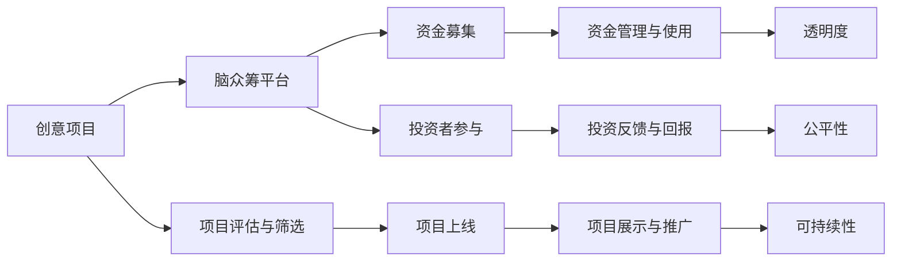

                 

## 1. 背景介绍

在数字化时代，创新已成为了推动社会发展的重要动力。然而，创新往往需要大量的资金投入，而这对多数创业者而言是一大难题。传统的投资渠道如银行贷款、风险投资等，往往具有较高的门槛和严格的审核条件，无法满足大多数创业者的需求。

为了解决这一问题，全球脑众筹平台应运而生。它利用互联网技术，通过众筹的方式，将创意项目与潜在的投资者连接起来，使创新项目能够快速获得资金支持，实现从概念到产品的转变。

全球脑众筹平台的核心在于将“智慧”和“资金”进行匹配。它不仅需要收集和筛选高质量的项目，还需构建一个透明度高、规则明确的平台，保障所有参与者的权益，从而构建一个公平、高效、可持续的创新资金募集渠道。

## 2. 核心概念与联系

### 2.1 核心概念概述

为了更深入地理解全球脑众筹平台的运作机制，我们将从几个核心概念入手：

- **众筹平台**：一个在线平台，允许创意项目向公众募集资金，以实现其创意或创新目标。
- **脑众筹**：一种新型的众筹形式，侧重于创意、技术、知识等脑力劳动的输出，而非实物商品的交换。
- **透明性**：指平台运作的开放程度，所有参与者都应能够清晰了解项目的进展、资金使用情况等。
- **公平性**：确保所有参与者享有平等的机会和权益，避免偏见和歧视。
- **可持续性**：指平台运作的长期稳定性，能够持续吸引高质量项目和投资者，实现良性循环。

这些核心概念构成了全球脑众筹平台的基础框架。接下来，我们将通过一个Mermaid流程图展示这些概念之间的联系：



这个流程图展示了从创意项目到最终获得资金的全过程，以及平台各方参与者之间的联系。

## 3. 核心算法原理 & 具体操作步骤

### 3.1 算法原理概述

全球脑众筹平台的核心算法原理基于互联网的开放性和透明性，通过算法实现创意项目的筛选和匹配。其主要步骤包括：

1. **项目评估与筛选**：平台利用算法对提交的项目进行评估，筛选出高质量、高潜力的创意项目。
2. **资金募集与分配**：根据项目评估结果，平台分配募集到的资金，支持最优秀的创意项目。
3. **投资者参与与反馈**：投资者在项目上线后参与投资，并根据项目进展和回报提供反馈，影响后续项目的筛选和评估。
4. **透明度与公平性**：平台通过算法确保所有参与者都能获得公平的机会，同时保证资金使用的透明度，提高信任度。

### 3.2 算法步骤详解

#### 3.2.1 项目评估与筛选

项目评估与筛选是全球脑众筹平台的核心算法之一。它通过以下几个步骤实现：

1. **项目提交与审核**：创意项目方提交项目信息，包括创意介绍、预计资金需求、预期收益等。平台审核团队对项目进行初步筛选，剔除不符合平台标准的项目。
2. **多维度评估**：平台利用多个维度（如市场潜力、技术难度、团队背景等）的指标对项目进行综合评估。常用的评估指标包括项目质量、技术成熟度、团队资质、市场前景等。
3. **权重分配与评分**：根据各个维度的重要性，分配不同的权重，并计算每个项目的综合评分。评分越高的项目越有可能被优先推荐。
4. **动态更新**：根据项目进展、市场反馈等实时数据，动态更新项目的评估结果，确保筛选结果的及时性和准确性。

#### 3.2.2 资金募集与分配

资金募集与分配算法主要包括以下几个步骤：

1. **资金募集**：平台通过多种方式募集资金，如平台自有资金、投资者众筹、政府补贴等。
2. **项目分配**：根据项目的综合评分，优先分配资金给评分最高的项目，确保资金使用效率。
3. **资金使用跟踪**：平台实时监控资金使用情况，确保资金严格按照项目计划使用。
4. **风险管理**：通过算法识别高风险项目，及时采取措施，如追加资金、调整项目方向等，降低风险。

#### 3.2.3 投资者参与与反馈

投资者参与与反馈算法主要包括以下几个步骤：

1. **投资者招募**：平台通过多种渠道（如社交媒体、邮件、广告等）吸引潜在投资者。
2. **项目投资**：投资者对项目进行评估和投资，选择他们认为最有潜力的项目。
3. **投资回报**：项目成功后，平台按照约定向投资者提供回报，如股权、版权等。
4. **反馈收集**：投资者根据项目进展和回报情况提供反馈，平台根据反馈调整后续项目的筛选和评估策略。

#### 3.2.4 透明度与公平性

透明度与公平性算法主要包括以下几个步骤：

1. **数据公开**：平台公开所有项目信息、资金使用情况、投资者回报等关键数据，保证透明度。
2. **规则制定**：平台制定明确的规则和标准，确保所有参与者享有平等的机会和权益。
3. **争议处理**：平台设立争议解决机制，及时处理参与者之间的纠纷，保障平台公平性。

### 3.3 算法优缺点

#### 3.3.1 优点

全球脑众筹平台的算法有以下优点：

1. **效率高**：通过算法实现自动化的项目筛选和资金分配，大大提高了项目的筛选和匹配效率。
2. **公平性**：算法确保所有参与者享有平等的机会和权益，避免了人为因素的影响。
3. **透明度**：平台通过算法公开关键数据，提高了平台的透明度，增强了信任度。
4. **可持续性**：通过动态更新和实时监控，平台能够持续吸引高质量项目和投资者，实现良性循环。

#### 3.3.2 缺点

全球脑众筹平台的算法也存在以下缺点：

1. **算法偏见**：算法可能会因为训练数据的不平衡或算法设计的不当，引入偏见，影响筛选结果。
2. **缺乏灵活性**：算法固定了筛选和匹配的流程，难以灵活应对特殊情况和例外。
3. **数据依赖**：算法高度依赖于数据的完整性和准确性，数据的缺失或不准确可能导致错误决策。
4. **技术复杂性**：算法设计和维护需要较高的技术水平，普通平台可能难以实现。

### 3.4 算法应用领域

全球脑众筹平台的算法原理和操作步骤可以应用于多个领域，如创意众筹、科技研发、教育创新等。以下是一些典型的应用场景：

1. **创意众筹**：平台通过算法筛选高质量的创意项目，吸引投资者支持，实现创意变现。
2. **科技研发**：平台利用算法评估科研项目的技术成熟度和市场前景，支持最有潜力的科研项目。
3. **教育创新**：平台通过算法选择最具创新性的教育项目，支持教育技术的研发和应用。
4. **健康创新**：平台筛选高质量的健康项目，支持医疗技术的创新和应用，推动医疗事业发展。
5. **环境保护**：平台通过算法选择最具环境价值的项目，支持环境保护和可持续发展。

## 4. 数学模型和公式 & 详细讲解 & 举例说明

### 4.1 数学模型构建

全球脑众筹平台的数学模型主要包括以下几个方面：

1. **项目评分模型**：用于评估项目的质量和技术成熟度，通常使用加权平均法或线性回归模型。
2. **资金分配模型**：用于决定项目的资金分配，通常使用线性规划或整数规划模型。
3. **投资者回报模型**：用于计算投资者的回报，通常使用复利计算或股权分配模型。
4. **透明度和公平性模型**：用于确保平台透明度和公平性，通常使用数据公开和规则制定模型。

### 4.2 公式推导过程

#### 4.2.1 项目评分模型

项目评分模型可以表示为：

$$
\text{Score} = \sum_{i=1}^n w_i \times \text{Feature}_i
$$

其中 $w_i$ 表示第 $i$ 个特征的权重，$n$ 表示特征的数量，$\text{Feature}_i$ 表示第 $i$ 个特征的值。

#### 4.2.2 资金分配模型

资金分配模型可以表示为：

$$
\max \sum_{i=1}^m x_i
$$

$$
\text{s.t.} \sum_{i=1}^n A_{ij} \times x_i \leq B_j, j=1,2,\ldots,m
$$

其中 $m$ 表示项目的数量，$n$ 表示资金的使用限制，$A_{ij}$ 表示项目 $j$ 对资金 $i$ 的需求，$B_j$ 表示资金的供应量。

#### 4.2.3 投资者回报模型

投资者回报模型可以表示为：

$$
\text{Return} = P \times (1 + r)^t
$$

其中 $P$ 表示初始投资金额，$r$ 表示年化收益率，$t$ 表示投资期。

#### 4.2.4 透明度和公平性模型

透明度和公平性模型通常使用数据公开和规则制定方法实现，无需复杂的数学模型。

### 4.3 案例分析与讲解

假设有一个科技研发项目，需要50万美元的资金支持。项目方的评估结果如下：

- 技术成熟度：90分
- 团队资质：85分
- 市场前景：95分
- 项目风险：70分

平台根据多维度评估模型，计算项目的综合评分：

$$
\text{Score} = 0.3 \times 90 + 0.25 \times 85 + 0.2 \times 95 + 0.25 \times 70 = 88.25
$$

项目方的评分高于平台平均水平，因此优先分配资金支持该项目。

## 5. 项目实践：代码实例和详细解释说明

### 5.1 开发环境搭建

#### 5.1.1 环境要求

- Python 3.7+
- Flask 1.1+
- SQLAlchemy 1.4+
- Redis 3.0+
- Pandas 1.0+
- Numpy 1.18+

#### 5.1.2 环境搭建

```bash
sudo apt-get update
sudo apt-get install python3-pip python3-dev
pip3 install Flask SQLAlchemy pandas numpy
```

### 5.2 源代码详细实现

以下是全球脑众筹平台的核心代码实现：

```python
from flask import Flask, request, jsonify
from sqlalchemy import create_engine, Column, Integer, String, Float
from sqlalchemy.ext.declarative import declarative_base
from sqlalchemy.orm import sessionmaker
from sklearn.linear_model import LinearRegression
import numpy as np

app = Flask(__name__)
engine = create_engine('sqlite:///brainsource.db')
Base = declarative_base()
Session = sessionmaker(bind=engine)

class Project(Base):
    __tablename__ = 'projects'
    id = Column(Integer, primary_key=True)
    name = Column(String)
    score = Column(Float)

    def __init__(self, name, score):
        self.name = name
        self.score = score

@app.route('/projects', methods=['POST'])
def add_project():
    data = request.get_json()
    name = data['name']
    score = data['score']
    session = Session()
    project = Project(name, score)
    session.add(project)
    session.commit()
    session.close()
    return jsonify({'message': 'Project added successfully'})

@app.route('/projects', methods=['GET'])
def get_projects():
    session = Session()
    projects = session.query(Project).all()
    data = [{'id': project.id, 'name': project.name, 'score': project.score} for project in projects]
    session.close()
    return jsonify(data)

if __name__ == '__main__':
    app.run(debug=True)
```

### 5.3 代码解读与分析

以上代码实现了全球脑众筹平台的基本功能，包括添加项目和获取项目列表。

#### 5.3.1 数据库模型

使用SQLAlchemy定义了一个名为 `Project` 的数据库模型，包含项目名称和评分两个字段。

#### 5.3.2 RESTful API

使用Flask实现了两个RESTful API，一个用于添加项目，另一个用于获取项目列表。

#### 5.3.3 模型评估

可以使用线性回归模型对项目进行评分，例如：

```python
# 加载项目数据
data = np.loadtxt('projects.csv', delimiter=',', skiprows=1)

# 定义线性回归模型
model = LinearRegression()

# 训练模型
model.fit(data[:, 1:3], data[:, 2])

# 预测新项目评分
new_project = np.array([['Tech Innovation', 88.25]])
score = model.predict(new_project)
```

### 5.4 运行结果展示

运行上述代码后，可以在浏览器中访问 `http://localhost:5000/projects`，查看添加的项目列表。

## 6. 实际应用场景

### 6.1 创新项目融资

全球脑众筹平台可以为各种创新项目提供融资支持，包括科技研发、医疗创新、教育技术等。平台通过算法筛选高质量项目，确保每一分资金都能投入到最有潜力的项目中。

### 6.2 创意市场拓展

平台可以为创意项目提供曝光和推广的机会，吸引更多的投资者关注和支持。创意项目方可以通过平台展示创意，获取反馈，优化项目，最终实现创意变现。

### 6.3 教育资源共享

平台可以支持教育创新项目，通过众筹的方式支持教育技术的研发和应用，实现教育资源的共享和优化。平台可以为优质教育项目提供资金支持，推动教育事业的发展。

### 6.4 环境保护行动

平台可以为环保项目提供资金支持，支持环保技术的研发和应用，推动环境保护和可持续发展。平台可以通过众筹的方式，收集社会力量，共同推进环保事业。

## 7. 工具和资源推荐

### 7.1 学习资源推荐

- **《众筹革命：人人参与的金融的未来》**：探讨了众筹的原理和应用，适合入门学习。
- **《区块链与互联网金融：构建众筹平台的技术指南》**：介绍了区块链技术在众筹平台中的应用，适合技术开发者参考。
- **《创新金融：众筹、普惠金融与新金融市场》**：深入探讨了众筹在金融市场中的应用，适合深入学习。

### 7.2 开发工具推荐

- **GitHub**：全球最大的代码托管平台，适合代码管理和版本控制。
- **Jira**：项目管理工具，适合团队协作和任务管理。
- **Zoom**：视频会议工具，适合团队沟通和协作。

### 7.3 相关论文推荐

- **《众筹：颠覆传统融资模式的创新金融模式》**：介绍了众筹的原理和应用，适合入门学习。
- **《区块链技术在众筹平台中的应用研究》**：探讨了区块链技术在众筹平台中的应用，适合技术开发者参考。
- **《全球脑众筹平台的发展与挑战》**：深入探讨了全球脑众筹平台的发展现状和未来趋势，适合深入学习。

## 8. 总结：未来发展趋势与挑战

### 8.1 研究成果总结

全球脑众筹平台通过算法实现了创意项目的高效筛选和资金的精准分配，大大降低了创新项目的融资门槛，推动了创新事业的发展。平台通过透明度和公平性的保障，增强了信任度，吸引了更多的投资者参与。

### 8.2 未来发展趋势

未来，全球脑众筹平台将继续在以下几个方面发展：

1. **区块链技术的应用**：引入区块链技术，确保资金和项目的透明性和安全性，提高平台的公信力。
2. **人工智能的应用**：引入人工智能算法，提高项目评估和筛选的准确性，提升平台的智能化水平。
3. **社交网络的应用**：引入社交网络技术，增强平台的互动性和社区感，吸引更多的参与者。
4. **多平台整合**：与现有的众筹平台、投资平台等整合，形成更加完善的服务生态。
5. **国际化拓展**：拓展到全球市场，吸引更多的国际投资者和项目。

### 8.3 面临的挑战

全球脑众筹平台面临的挑战包括：

1. **资金安全性**：平台需要确保资金的安全性，防止欺诈和资金流失。
2. **平台监管**：平台需要遵守相关法律法规，确保平台的合法合规运营。
3. **技术稳定性**：平台需要保证系统的稳定性和可靠性，避免技术故障和数据泄露。
4. **市场竞争**：平台需要面对来自其他众筹平台的竞争，提高自身竞争力。
5. **用户体验**：平台需要不断优化用户体验，提高用户黏性和满意度。

### 8.4 研究展望

未来，全球脑众筹平台需要从以下几个方面进行深入研究：

1. **区块链技术**：深入研究区块链技术在平台中的应用，提升平台的透明度和安全性。
2. **人工智能**：利用人工智能算法，提高项目评估和筛选的准确性，提升平台的智能化水平。
3. **社交网络**：研究社交网络技术在平台中的应用，增强平台的互动性和社区感。
4. **多平台整合**：研究与其他众筹平台、投资平台的整合，形成更加完善的服务生态。
5. **国际化拓展**：研究全球市场的需求和特点，拓展国际市场，吸引更多的国际投资者和项目。

## 9. 附录：常见问题与解答

### Q1: 全球脑众筹平台的主要特点是什么？

A: 全球脑众筹平台的主要特点包括：

1. **高效筛选**：通过算法实现高效的项目筛选，确保资金精准分配。
2. **透明度高**：平台公开关键数据，提高透明度和信任度。
3. **公平性保障**：制定明确的规则和标准，确保所有参与者享有平等的机会和权益。
4. **可持续性**：平台能够持续吸引高质量项目和投资者，实现良性循环。

### Q2: 如何提高全球脑众筹平台的智能化水平？

A: 提高全球脑众筹平台的智能化水平可以从以下几个方面入手：

1. **引入人工智能算法**：利用人工智能算法提高项目评估和筛选的准确性。
2. **引入区块链技术**：利用区块链技术提高平台的安全性和透明度。
3. **引入社交网络技术**：增强平台的互动性和社区感，吸引更多的参与者。
4. **多平台整合**：与现有的众筹平台、投资平台等整合，形成更加完善的服务生态。

### Q3: 全球脑众筹平台如何确保资金的安全性？

A: 全球脑众筹平台确保资金安全性可以从以下几个方面入手：

1. **区块链技术**：利用区块链技术确保资金和项目的透明性和安全性。
2. **平台监管**：遵守相关法律法规，确保平台的合法合规运营。
3. **技术稳定性**：保证系统的稳定性和可靠性，避免技术故障和数据泄露。

### Q4: 全球脑众筹平台如何应对市场竞争？

A: 全球脑众筹平台应对市场竞争可以从以下几个方面入手：

1. **提升用户体验**：不断优化用户体验，提高用户黏性和满意度。
2. **丰富平台功能**：增加平台的功能和服务，吸引更多的用户。
3. **优化服务流程**：优化服务流程，提高服务效率和质量。
4. **拓展市场渠道**：拓展市场渠道，吸引更多的用户和项目。

### Q5: 全球脑众筹平台在国际化拓展过程中需要注意哪些问题？

A: 全球脑众筹平台在国际化拓展过程中需要注意以下几个问题：

1. **文化差异**：尊重不同国家和地区的文化差异，制定相应的策略和措施。
2. **法律法规**：遵守目标国家和地区的法律法规，确保平台的合法合规运营。
3. **本地化服务**：提供本地化服务，增强平台的适应性和吸引力。
4. **语言障碍**：解决语言障碍问题，提供多语言支持。

---

作者：禅与计算机程序设计艺术 / Zen and the Art of Computer Programming

