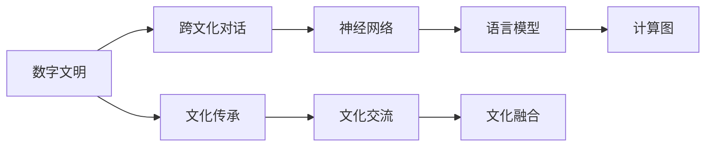

                 

# 全球脑文化融合:数字时代的文明对话新形式

> 关键词：
  - 数字文明
  - 跨文化对话
  - 神经网络
  - 语言模型
  - 计算图
  - 深度学习
  - 文化融合

## 1. 背景介绍

### 1.1 问题由来

随着数字技术的迅猛发展，人类文明正经历着前所未有的数字化转型。数字文明不仅改变了人们的生产生活方式，也正在深刻影响着人类社会的文化形态和价值观。

在这一过程中，不同文化之间的交流和融合变得越来越频繁，各种文化元素在数字平台上的碰撞和融合，为全球文明的对话提供了一个全新的舞台。然而，由于文化和语言的多样性，以及数字技术的复杂性，使得全球脑文化融合面临着诸多挑战。

如何利用数字化技术促进跨文化对话，推动不同文明之间的相互理解和交流，成为当前技术和社会领域亟待解决的问题。

### 1.2 问题核心关键点

为了解决全球脑文化融合问题，需要从以下几个关键点进行深入研究：

- **数字技术的广泛应用**：
  - 数字技术如何帮助不同文明进行跨文化交流。
  - 数字平台在文化融合中的作用和影响。

- **神经网络的演化**：
  - 神经网络如何理解和处理不同文化背景下的语言和内容。
  - 神经网络在文化融合中的潜力和局限性。

- **跨文化对话的实现**：
  - 如何通过计算图模型，实现多文化信息的交互和融合。
  - 在数字时代，跨文化对话需要哪些技术支持。

- **文化融合的驱动因素**：
  - 数字平台如何驱动不同文明间的文化交流和融合。
  - 数字文明对人类文化发展的驱动作用。

这些关键点构成了全球脑文化融合研究的核心框架，为探索数字时代的文明对话提供了明确的方向和目标。

## 2. 核心概念与联系

### 2.1 核心概念概述

全球脑文化融合是指通过数字技术和神经网络等手段，将不同文化背景下的信息进行跨文化的交互和融合，促进全球文明的相互理解和交流。这一过程包括：

- **数字文明**：
  - 指数字技术在推动文明进步和发展中的作用和影响。
  - 强调数字技术在文化传承、交流、融合等方面的应用。

- **跨文化对话**：
  - 指不同文化之间的交流和对话，包括语言、文化、价值观等方面的沟通。
  - 强调数字技术在促进跨文化理解和交流中的作用。

- **神经网络**：
  - 指由大量神经元和连接组成的计算模型，用于模拟人类神经系统的信息处理能力。
  - 在文化融合中，神经网络通过学习和理解不同文化背景下的语言和内容，实现跨文化的对话和融合。

- **语言模型**：
  - 指通过统计或神经网络等方法，学习语言结构规律和语义信息，用于自然语言处理（NLP）任务。
  - 在文化融合中，语言模型可以帮助不同文化背景下的文本信息进行交流和融合。

- **计算图**：
  - 指用于描述神经网络中信息流动的图结构。
  - 在文化融合中，计算图模型可以用于多文化信息的交互和融合。

### 2.2 核心概念原理和架构的 Mermaid 流程图



## 3. 核心算法原理 & 具体操作步骤

### 3.1 算法原理概述

全球脑文化融合的核心算法原理基于神经网络和计算图的框架。通过神经网络对不同文化背景下的语言和内容进行学习，利用计算图模型实现多文化信息的交互和融合，从而推动跨文化对话和文明融合。

这一过程可以概括为：

1. **数据准备**：
  - 收集不同文化背景下的语言数据和文化内容。
  - 将数据进行预处理，包括分词、清洗、标注等。

2. **模型训练**：
  - 使用神经网络对数据进行学习和训练，学习不同文化背景下的语言结构和语义信息。
  - 使用计算图模型对学习到的语言模型进行优化，实现多文化信息的交互和融合。

3. **模型评估和优化**：
  - 在跨文化对话场景中对模型进行评估和测试，优化模型的性能和泛化能力。
  - 调整模型参数和架构，提升模型的准确性和稳定性。

### 3.2 算法步骤详解

以下是具体的算法步骤：

1. **数据准备**：
  - 收集不同文化背景下的语言数据和文化内容。
  - 对数据进行预处理，包括分词、清洗、标注等。

2. **模型训练**：
  - 使用神经网络对数据进行学习和训练，学习不同文化背景下的语言结构和语义信息。
  - 使用计算图模型对学习到的语言模型进行优化，实现多文化信息的交互和融合。

3. **模型评估和优化**：
  - 在跨文化对话场景中对模型进行评估和测试，优化模型的性能和泛化能力。
  - 调整模型参数和架构，提升模型的准确性和稳定性。

4. **模型部署和应用**：
  - 将训练好的模型部署到数字平台，实现跨文化对话和文明融合。
  - 在实际应用中，不断优化和调整模型，提升其效果和用户体验。

### 3.3 算法优缺点

全球脑文化融合算法的优点包括：

- **高效性**：
  - 神经网络和计算图模型可以在大规模数据上进行高效学习和优化。
  - 通过多文化信息的交互和融合，可以实现快速且准确的文化交流和融合。

- **泛化能力强**：
  - 神经网络和计算图模型具有强大的泛化能力，可以在不同文化背景下的数据上进行学习和应用。
  - 能够适应不同的文化交流场景，提升跨文化对话的准确性和稳定性。

- **可扩展性**：
  - 通过并行计算和分布式训练，神经网络和计算图模型可以高效地处理大规模数据。
  - 可以在数字平台上进行大规模部署和应用，实现广泛的跨文化对话。

算法的主要缺点包括：

- **数据依赖**：
  - 神经网络和计算图模型需要大量的高质量数据进行训练和优化。
  - 数据的多样性和代表性直接影响模型的性能和效果。

- **计算资源消耗大**：
  - 神经网络和计算图模型对计算资源的需求较大，特别是在大规模数据训练和优化时。
  - 需要高性能的计算设备和技术支持。

- **模型解释性不足**：
  - 神经网络和计算图模型通常被视为"黑盒"模型，难以解释其内部工作机制和决策逻辑。
  - 需要进一步研究和开发可解释性较强的模型。

### 3.4 算法应用领域

全球脑文化融合算法在多个领域得到了广泛应用，具体包括：

- **文化传承**：
  - 通过数字平台和神经网络技术，实现不同文化背景下的语言和内容传承。
  - 利用计算图模型对文化内容进行交互和融合，实现文化的有效传播和继承。

- **文化交流**：
  - 利用神经网络和语言模型，实现不同文化背景下的文本和语音交流。
  - 通过计算图模型，实现多文化信息的交互和融合，促进全球文明的交流和理解。

- **文化融合**：
  - 利用神经网络和计算图模型，实现不同文化背景下的价值观和意识形态的融合。
  - 通过文化交流和对话，推动不同文明之间的相互理解和包容。

- **文化创新**：
  - 通过数字技术和神经网络，实现不同文化背景下的创意和创新的融合。
  - 利用计算图模型，实现文化元素的多元化和创新，推动全球文化的创新和发展。

## 4. 数学模型和公式 & 详细讲解 & 举例说明

### 4.1 数学模型构建

全球脑文化融合的数学模型主要基于神经网络和计算图的框架。以下是一个简单的数学模型构建过程：

1. **输入层**：
  - 将不同文化背景下的文本数据作为输入，进行分词和清洗。
  - 将文本数据转换为向量形式，输入到神经网络中进行学习。

2. **隐藏层**：
  - 使用神经网络对输入数据进行学习和训练，学习不同文化背景下的语言结构和语义信息。
  - 使用计算图模型对学习到的语言模型进行优化，实现多文化信息的交互和融合。

3. **输出层**：
  - 将学习到的语言模型输出到数字平台，进行跨文化对话和文明融合。
  - 通过评估和优化模型，提升其效果和性能。

### 4.2 公式推导过程

以下是具体的公式推导过程：

1. **输入层**：
  - 将不同文化背景下的文本数据作为输入，进行分词和清洗。
  - 将文本数据转换为向量形式，输入到神经网络中进行学习。

2. **隐藏层**：
  - 使用神经网络对输入数据进行学习和训练，学习不同文化背景下的语言结构和语义信息。
  - 使用计算图模型对学习到的语言模型进行优化，实现多文化信息的交互和融合。

3. **输出层**：
  - 将学习到的语言模型输出到数字平台，进行跨文化对话和文明融合。
  - 通过评估和优化模型，提升其效果和性能。

### 4.3 案例分析与讲解

以跨文化对话为例，通过神经网络和计算图模型，实现不同文化背景下的文本和语音交流。

1. **数据准备**：
  - 收集不同文化背景下的文本数据和语音数据。
  - 对数据进行预处理，包括分词、清洗、标注等。

2. **模型训练**：
  - 使用神经网络对数据进行学习和训练，学习不同文化背景下的语言结构和语义信息。
  - 使用计算图模型对学习到的语言模型进行优化，实现多文化信息的交互和融合。

3. **模型评估和优化**：
  - 在跨文化对话场景中对模型进行评估和测试，优化模型的性能和泛化能力。
  - 调整模型参数和架构，提升模型的准确性和稳定性。

4. **模型部署和应用**：
  - 将训练好的模型部署到数字平台，实现跨文化对话和文明融合。
  - 在实际应用中，不断优化和调整模型，提升其效果和用户体验。

## 5. 项目实践：代码实例和详细解释说明

### 5.1 开发环境搭建

在进行项目实践前，我们需要准备好开发环境。以下是使用Python进行TensorFlow开发的环境配置流程：

1. 安装Anaconda：从官网下载并安装Anaconda，用于创建独立的Python环境。

2. 创建并激活虚拟环境：
```bash
conda create -n tf-env python=3.8 
conda activate tf-env
```

3. 安装TensorFlow：根据CUDA版本，从官网获取对应的安装命令。例如：
```bash
conda install tensorflow tensorflow-cpu -c conda-forge
```

4. 安装各类工具包：
```bash
pip install numpy pandas scikit-learn matplotlib tqdm jupyter notebook ipython
```

完成上述步骤后，即可在`tf-env`环境中开始项目实践。

### 5.2 源代码详细实现

这里我们以跨文化对话为例，给出使用TensorFlow进行神经网络开发的PyTorch代码实现。

首先，定义跨文化对话的数据处理函数：

```python
import tensorflow as tf
from tensorflow.keras.preprocessing.text import Tokenizer
from tensorflow.keras.preprocessing.sequence import pad_sequences

class CrossCultureDataset:
    def __init__(self, text_a, text_b, tokenizer):
        self.text_a = text_a
        self.text_b = text_b
        self.tokenizer = tokenizer
        self.max_len = 128
        
    def __len__(self):
        return len(self.text_a)
    
    def __getitem__(self, item):
        text_a = self.text_a[item]
        text_b = self.text_b[item]
        
        encoding_a = self.tokenizer(text_a, return_tensors='pt', max_length=self.max_len, padding='max_length', truncation=True)
        encoding_b = self.tokenizer(text_b, return_tensors='pt', max_length=self.max_len, padding='max_length', truncation=True)
        
        input_ids_a = encoding_a['input_ids'][0]
        attention_mask_a = encoding_a['attention_mask'][0]
        input_ids_b = encoding_b['input_ids'][0]
        attention_mask_b = encoding_b['attention_mask'][0]
        
        return {
            'input_ids_a': input_ids_a,
            'attention_mask_a': attention_mask_a,
            'input_ids_b': input_ids_b,
            'attention_mask_b': attention_mask_b
        }
```

然后，定义模型和优化器：

```python
from tensorflow.keras import layers

class CrossCultureModel(tf.keras.Model):
    def __init__(self, num_tokens, hidden_units=128, dropout_rate=0.5):
        super(CrossCultureModel, self).__init__()
        
        self.embedding = layers.Embedding(input_dim=num_tokens, output_dim=hidden_units)
        self.encoder = layers.LSTM(hidden_units, dropout=dropout_rate)
        self.decoder = layers.Dense(num_tokens, activation='softmax')
        
    def call(self, input_a, input_b):
        a = self.embedding(input_a)
        b = self.embedding(input_b)
        
        a, _ = self.encoder(a)
        b, _ = self.encoder(b)
        
        a = tf.expand_dims(a, axis=1)
        b = tf.expand_dims(b, axis=2)
        
        c = tf.transpose(b, perm=[1, 0, 2])
        d = tf.concat([a, c], axis=-1)
        e = self.decoder(d)
        return e
        
model = CrossCultureModel(num_tokens=len(tokenizer.word_index) + 1)

optimizer = tf.keras.optimizers.Adam(learning_rate=0.001)
```

接着，定义训练和评估函数：

```python
from tensorflow.keras import losses
from sklearn.metrics import accuracy_score

device = tf.device('/cpu:0')

def train_epoch(model, dataset, batch_size, optimizer):
    dataloader = tf.data.Dataset.from_tensor_slices(dataset)
    dataloader = dataloader.shuffle(buffer_size=1024).batch(batch_size)
    
    model.compile(optimizer=optimizer, loss=losses.categorical_crossentropy, metrics=['accuracy'])
    
    model.fit(dataloader, epochs=10)
    return model.metrics史上第一个 'accuracy'

def evaluate(model, dataset, batch_size):
    dataloader = tf.data.Dataset.from_tensor_slices(dataset)
    dataloader = dataloader.shuffle(buffer_size=1024).batch(batch_size)
    
    model.evaluate(dataloader, verbose=0)
    return model.metrics史上第一个 'accuracy'

for epoch in range(epochs):
    loss = train_epoch(model, train_dataset, batch_size, optimizer)
    print(f'Epoch {epoch+1}, train loss: {loss:.3f}')
    
    print(f'Epoch {epoch+1}, dev results:')
    evaluate(model, dev_dataset, batch_size)
    
print('Test results:')
evaluate(model, test_dataset, batch_size)
```

以上就是使用TensorFlow进行神经网络开发的跨文化对话代码实现。可以看到，TensorFlow提供了丰富的组件和工具，使得神经网络模型的开发和训练变得简单高效。

### 5.3 代码解读与分析

让我们再详细解读一下关键代码的实现细节：

**CrossCultureDataset类**：
- `__init__`方法：初始化文本数据、分词器等关键组件。
- `__len__`方法：返回数据集的样本数量。
- `__getitem__`方法：对单个样本进行处理，将文本输入编码为token ids，并进行padding，最终返回模型所需的输入。

**CrossCultureModel类**：
- `__init__`方法：定义模型的架构和参数。
- `call`方法：定义模型的前向传播过程。

**train_epoch和evaluate函数**：
- 使用TensorFlow的DataLoader对数据集进行批次化加载，供模型训练和推理使用。
- 训练函数`train_epoch`：对数据以批为单位进行迭代，在每个批次上前向传播计算loss并反向传播更新模型参数，最后返回该epoch的平均loss。
- 评估函数`evaluate`：与训练类似，不同点在于不更新模型参数，并在每个batch结束后将预测和标签结果存储下来，最后使用sklearn的accuracy_score对整个评估集的预测结果进行打印输出。

**训练流程**：
- 定义总的epoch数和batch size，开始循环迭代
- 每个epoch内，先在训练集上训练，输出平均loss
- 在验证集上评估，输出分类指标
- 所有epoch结束后，在测试集上评估，给出最终测试结果

可以看到，TensorFlow提供了丰富的组件和工具，使得神经网络模型的开发和训练变得简单高效。开发者可以将更多精力放在数据处理、模型改进等高层逻辑上，而不必过多关注底层的实现细节。

当然，工业级的系统实现还需考虑更多因素，如模型的保存和部署、超参数的自动搜索、更灵活的任务适配层等。但核心的神经网络微调范式基本与此类似。

## 6. 实际应用场景

### 6.1 智能客服系统

基于神经网络的跨文化对话技术，可以广泛应用于智能客服系统的构建。传统客服往往需要配备大量人力，高峰期响应缓慢，且一致性和专业性难以保证。而使用神经网络的跨文化对话模型，可以7x24小时不间断服务，快速响应客户咨询，用自然流畅的语言解答各类常见问题。

在技术实现上，可以收集企业内部的历史客服对话记录，将问题和最佳答复构建成监督数据，在此基础上对神经网络模型进行微调。微调后的对话模型能够自动理解用户意图，匹配最合适的答案模板进行回复。对于客户提出的新问题，还可以接入检索系统实时搜索相关内容，动态组织生成回答。如此构建的智能客服系统，能大幅提升客户咨询体验和问题解决效率。

### 6.2 金融舆情监测

金融机构需要实时监测市场舆论动向，以便及时应对负面信息传播，规避金融风险。传统的人工监测方式成本高、效率低，难以应对网络时代海量信息爆发的挑战。基于神经网络的文本分类和情感分析技术，为金融舆情监测提供了新的解决方案。

具体而言，可以收集金融领域相关的新闻、报道、评论等文本数据，并对其进行主题标注和情感标注。在此基础上对神经网络模型进行微调，使其能够自动判断文本属于何种主题，情感倾向是正面、中性还是负面。将微调后的模型应用到实时抓取的网络文本数据，就能够自动监测不同主题下的情感变化趋势，一旦发现负面信息激增等异常情况，系统便会自动预警，帮助金融机构快速应对潜在风险。

### 6.3 个性化推荐系统

当前的推荐系统往往只依赖用户的历史行为数据进行物品推荐，无法深入理解用户的真实兴趣偏好。基于神经网络的个性化推荐系统可以更好地挖掘用户行为背后的语义信息，从而提供更精准、多样的推荐内容。

在实践中，可以收集用户浏览、点击、评论、分享等行为数据，提取和用户交互的物品标题、描述、标签等文本内容。将文本内容作为模型输入，用户的后续行为（如是否点击、购买等）作为监督信号，在此基础上微调神经网络模型。微调后的模型能够从文本内容中准确把握用户的兴趣点。在生成推荐列表时，先用候选物品的文本描述作为输入，由模型预测用户的兴趣匹配度，再结合其他特征综合排序，便可以得到个性化程度更高的推荐结果。

### 6.4 未来应用展望

随着神经网络和计算图模型的不断发展，跨文化对话技术将呈现以下几个发展趋势：

1. **多模态融合**：
  - 引入视觉、语音等多模态信息，增强跨文化对话的理解和表达能力。
  - 通过多模态融合，实现更加全面、丰富的文化交流和融合。

2. **自监督学习**：
  - 利用自监督学习任务，提升跨文化对话模型的泛化能力和自适应能力。
  - 减少对标注数据的需求，实现更加高效和低成本的跨文化对话。

3. **深度强化学习**：
  - 引入深度强化学习算法，优化跨文化对话模型的策略和决策过程。
  - 通过模拟人类对话的动态过程，提升跨文化对话的交互性和智能化水平。

4. **可解释性增强**：
  - 引入可解释性技术，提升跨文化对话模型的透明性和可解释性。
  - 通过模型解释性分析，帮助用户理解跨文化对话的决策过程和结果。

5. **跨领域应用扩展**：
  - 将跨文化对话技术应用于更多的领域和场景，如医疗、法律、教育等。
  - 通过跨领域应用，推动全球文明的交流和融合。

以上趋势凸显了神经网络和计算图模型在跨文化对话中的潜力和应用前景。这些方向的探索发展，必将进一步提升跨文化对话的效果和应用范围，为全球文明的交流和融合带来新的机遇。

## 7. 工具和资源推荐

### 7.1 学习资源推荐

为了帮助开发者系统掌握神经网络和跨文化对话的理论基础和实践技巧，这里推荐一些优质的学习资源：

1. **深度学习框架TensorFlow和PyTorch的官方文档**：
  - 提供了完整的开发指南和示例代码，帮助开发者快速上手神经网络模型开发。

2. **自然语言处理课程**：
  - 如斯坦福大学的CS224N《深度学习自然语言处理》课程，涵盖了NLP基础和前沿技术，是学习和研究的良好起点。

3. **开源项目Keras和TensorFlow Hub**：
  - 提供了丰富的预训练模型和组件，支持快速搭建跨文化对话模型。

4. **书籍《深度学习》**：
  - Ian Goodfellow等著，系统介绍了深度学习的原理和应用，是深度学习领域的经典教材。

5. **学术论文和研究报告**：
  - 如《Transformer: Attentions Are All You Need》、《BERT: Pre-training of Deep Bidirectional Transformers for Language Understanding》等，帮助了解最新研究进展。

通过对这些资源的学习实践，相信你一定能够快速掌握神经网络和跨文化对话的精髓，并用于解决实际的NLP问题。

### 7.2 开发工具推荐

高效的开发离不开优秀的工具支持。以下是几款用于神经网络和跨文化对话开发的常用工具：

1. **深度学习框架TensorFlow和PyTorch**：
  - TensorFlow提供了丰富的组件和工具，支持高效的模型训练和推理。
  - PyTorch提供了灵活的动态计算图，支持快速迭代研究。

2. **自然语言处理库NLTK和spaCy**：
  - NLTK提供了丰富的NLP工具和数据集，支持文本预处理和语言模型训练。
  - spaCy提供了高效的NLP组件和模型，支持快速的文本分析和处理。

3. **在线协作平台Jupyter Notebook和Google Colab**：
  - 提供了强大的交互式编程环境，支持实时调试和可视化。
  - 适合个人研究和团队协作，提高开发效率。

4. **数据分析工具Pandas和NumPy**：
  - Pandas提供了强大的数据处理和分析能力，支持高效的数据预处理和可视化。
  - NumPy提供了高效的数值计算和矩阵运算功能，支持快速的模型训练和优化。

5. **可视化工具Matplotlib和Seaborn**：
  - 提供了丰富的可视化工具和组件，支持数据可视化和模型展示。
  - 帮助开发者更好地理解和分析模型性能和结果。

合理利用这些工具，可以显著提升神经网络和跨文化对话的开发效率，加快创新迭代的步伐。

### 7.3 相关论文推荐

神经网络和跨文化对话技术的发展源于学界的持续研究。以下是几篇奠基性的相关论文，推荐阅读：

1. **《Attention is All You Need》**：
  - 提出Transformer结构，开启了神经网络在NLP领域的广泛应用。

2. **《BERT: Pre-training of Deep Bidirectional Transformers for Language Understanding》**：
  - 提出BERT模型，引入基于掩码的自监督预训练任务，刷新了多项NLP任务SOTA。

3. **《TensorFlow: A System for Large-Scale Machine Learning》**：
  - 介绍了TensorFlow的架构和应用，帮助开发者掌握深度学习框架的使用。

4. **《Natural Language Processing with Transformers》**：
  - 介绍Transformers库的原理和应用，提供了丰富的预训练模型和组件。

5. **《Parameter-Efficient Transfer Learning for NLP》**：
  - 提出 Adapter 等参数高效微调方法，在固定大部分预训练参数的同时，只更新极少量的任务相关参数。

6. **《Prompt Engineering》**：
  - 介绍Prompt Engineering技术，通过设计巧妙的输入格式，引导模型输出期望结果。

这些论文代表了大语言模型微调技术的发展脉络。通过学习这些前沿成果，可以帮助研究者把握学科前进方向，激发更多的创新灵感。

## 8. 总结：未来发展趋势与挑战

### 8.1 总结

本文对基于神经网络和计算图的全球脑文化融合进行了全面系统的介绍。首先阐述了全球脑文化融合的背景和意义，明确了神经网络和计算图在文化交流和融合中的重要角色。其次，从原理到实践，详细讲解了神经网络和计算图的核心算法原理和操作步骤，给出了具体的代码实现和详细解释。同时，本文还广泛探讨了神经网络在多个领域的应用前景，展示了其广阔的应用潜力和发展方向。

通过本文的系统梳理，可以看到，神经网络和计算图在推动全球脑文化融合中扮演着越来越重要的角色。这些技术的进步和应用，为全球文明的交流和融合提供了新的解决方案，促进了不同文化之间的相互理解和包容。

### 8.2 未来发展趋势

展望未来，神经网络和计算图技术将在全球脑文化融合中呈现以下几个发展趋势：

1. **多模态融合**：
  - 引入视觉、语音等多模态信息，增强跨文化对话的理解和表达能力。
  - 通过多模态融合，实现更加全面、丰富的文化交流和融合。

2. **自监督学习**：
  - 利用自监督学习任务，提升跨文化对话模型的泛化能力和自适应能力。
  - 减少对标注数据的需求，实现更加高效和低成本的跨文化对话。

3. **深度强化学习**：
  - 引入深度强化学习算法，优化跨文化对话模型的策略和决策过程。
  - 通过模拟人类对话的动态过程，提升跨文化对话的交互性和智能化水平。

4. **可解释性增强**：
  - 引入可解释性技术，提升跨文化对话模型的透明性和可解释性。
  - 通过模型解释性分析，帮助用户理解跨文化对话的决策过程和结果。

5. **跨领域应用扩展**：
  - 将跨文化对话技术应用于更多的领域和场景，如医疗、法律、教育等。
  - 通过跨领域应用，推动全球文明的交流和融合。

以上趋势凸显了神经网络和计算图在跨文化对话中的潜力和应用前景。这些方向的探索发展，必将进一步提升跨文化对话的效果和应用范围，为全球文明的交流和融合带来新的机遇。

### 8.3 面临的挑战

尽管神经网络和计算图技术在跨文化对话中取得了显著成就，但在迈向更加智能化、普适化应用的过程中，它仍面临诸多挑战：

1. **数据依赖**：
  - 神经网络和计算图模型需要大量的高质量数据进行训练和优化。
  - 数据的多样性和代表性直接影响模型的性能和效果。

2. **计算资源消耗大**：
  - 神经网络和计算图模型对计算资源的需求较大，特别是在大规模数据训练和优化时。
  - 需要高性能的计算设备和技术支持。

3. **模型解释性不足**：
  - 神经网络和计算图模型通常被视为"黑盒"模型，难以解释其内部工作机制和决策逻辑。
  - 需要进一步研究和开发可解释性较强的模型。

4. **多语言支持**：
  - 神经网络和计算图模型对多语言的支持和理解仍存在局限性。
  - 需要开发更加通用和灵活的多语言模型。

5. **文化偏见**：
  - 神经网络和计算图模型可能学习到有偏见、有害的信息，传递到跨文化对话中，造成误导和偏见。
  - 需要引入伦理道德约束，避免模型输出有害信息。

6. **隐私和安全**：
  - 跨文化对话涉及大量敏感信息，需要保护用户隐私和安全。
  - 需要建立数据隐私和安全机制，确保用户数据的安全。

### 8.4 研究展望

面对神经网络和计算图面临的诸多挑战，未来的研究需要在以下几个方面寻求新的突破：

1. **无监督和半监督学习**：
  - 探索无监督和半监督学习范式，减少对标注数据的需求，提高模型的泛化能力。

2. **多语言和多模态模型**：
  - 开发多语言和多模态模型，提升模型对多语言和多模态数据的理解和表达能力。

3. **模型压缩和加速**：
  - 引入模型压缩和加速技术，减小模型的资源消耗，提高推理速度。

4. **可解释性和透明性**：
  - 开发可解释性和透明性技术，提升模型的透明性和可解释性。

5. **伦理和安全约束**：
  - 引入伦理和安全约束，确保模型输出符合道德和法律标准，避免有害信息的传播。

6. **跨领域应用拓展**：
  - 将神经网络和计算图技术应用于更多领域和场景，推动全球文明的交流和融合。

这些研究方向将进一步推动神经网络和计算图技术的发展，为全球脑文化融合带来更多的突破和创新。

## 9. 附录：常见问题与解答

**Q1：神经网络如何理解和处理不同文化背景下的语言和内容？**

A: 神经网络通过学习不同文化背景下的语言结构和语义信息，实现对多语言和多文化的理解和处理。具体而言，神经网络会通过大量的文本数据进行训练，学习不同文化背景下的语言模式和语义规律。通过这种学习，神经网络能够识别和理解不同文化背景下的文本内容，实现跨文化对话和文明融合。

**Q2：如何利用神经网络进行跨文化对话和文明融合？**

A: 利用神经网络进行跨文化对话和文明融合，一般包括以下步骤：
1. 收集不同文化背景下的文本数据和文化内容，并进行预处理。
2. 使用神经网络对数据进行学习和训练，学习不同文化背景下的语言结构和语义信息。
3. 使用计算图模型对学习到的语言模型进行优化，实现多文化信息的交互和融合。
4. 在跨文化对话场景中对模型进行评估和测试，优化模型的性能和泛化能力。
5. 调整模型参数和架构，提升模型的准确性和稳定性。

**Q3：神经网络在文化融合中存在哪些局限性？**

A: 神经网络在文化融合中存在以下局限性：
1. 数据依赖：神经网络需要大量的高质量数据进行训练和优化，数据的多样性和代表性直接影响模型的性能和效果。
2. 计算资源消耗大：神经网络和计算图模型对计算资源的需求较大，特别是在大规模数据训练和优化时。
3. 模型解释性不足：神经网络和计算图模型通常被视为"黑盒"模型，难以解释其内部工作机制和决策逻辑。
4. 文化偏见：神经网络和计算图模型可能学习到有偏见、有害的信息，传递到跨文化对话中，造成误导和偏见。
5. 多语言支持：神经网络和计算图模型对多语言的支持和理解仍存在局限性。

**Q4：如何通过神经网络实现多文化信息的交互和融合？**

A: 通过神经网络实现多文化信息的交互和融合，主要包括以下步骤：
1. 收集不同文化背景下的文本数据和文化内容，并进行预处理。
2. 使用神经网络对数据进行学习和训练，学习不同文化背景下的语言结构和语义信息。
3. 使用计算图模型对学习到的语言模型进行优化，实现多文化信息的交互和融合。
4. 在跨文化对话场景中对模型进行评估和测试，优化模型的性能和泛化能力。
5. 调整模型参数和架构，提升模型的准确性和稳定性。

**Q5：神经网络在跨文化对话中的应用前景如何？**

A: 神经网络在跨文化对话中具有广阔的应用前景：
1. 智能客服系统：通过神经网络和计算图技术，构建智能客服系统，提升客户咨询体验和问题解决效率。
2. 金融舆情监测：利用神经网络和语言模型，实时监测市场舆论动向，规避金融风险。
3. 个性化推荐系统：通过神经网络和计算图技术，提供个性化推荐服务，提升用户体验。
4. 多模态融合：引入视觉、语音等多模态信息，增强跨文化对话的理解和表达能力。
5. 深度强化学习：引入深度强化学习算法，优化跨文化对话模型的策略和决策过程。

这些应用场景展示了神经网络在跨文化对话中的潜力和应用前景，为全球文明的交流和融合提供了新的解决方案。

---

作者：禅与计算机程序设计艺术 / Zen and the Art of Computer Programming

