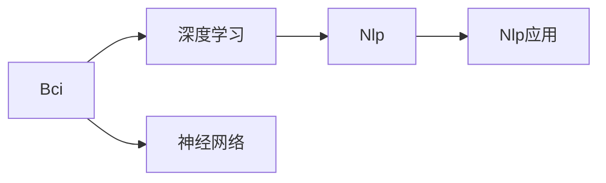
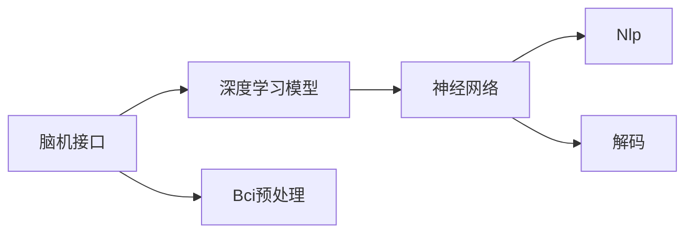

                 

# 全球脑翻译系统:跨语言交流的终极解决方案

> 关键词：全球脑翻译系统,跨语言交流,脑机接口,自然语言处理,NLP,神经网络,深度学习

## 1. 背景介绍

### 1.1 问题由来
在全球化的今天，语言障碍成为跨文化交流的主要障碍。虽然已经存在各种翻译工具和服务，但现有的翻译技术仍存在诸多不足。语言模型往往只能翻译短句，对于长句和复杂语境的理解与生成能力较弱；语音识别和语音合成技术也存在清晰度不够、口音识别准确率不高等问题。而且，这些翻译工具通常只能实现两种语言之间的互译，无法同时处理多语种交流。

为了解决这些问题，研究者们提出了“全球脑翻译系统”的概念，即通过脑机接口和深度学习技术，实现多语种实时翻译和交流。该系统不仅能够实时将用户语言的自然语言转化为目标语言，还能模拟人类大脑的语言处理机制，构建更自然的交流体验。

### 1.2 问题核心关键点
全球脑翻译系统以脑机接口技术为基础，结合深度学习和大规模语料，构建了多语种自然语言处理(NLP)模型，能够实现对自然语言的实时处理和翻译。系统包括三个核心模块：脑机接口模块、神经网络模块和自然语言处理模块。其中，脑机接口模块负责将用户大脑中的语言信号转化为电信号；神经网络模块对电信号进行处理，实现语言信号的编码和解码；自然语言处理模块则负责将编码后的信号转化为自然语言。

该系统不仅能够实现多语种的互译，还能处理复杂语境和多轮对话，支持自然语言理解和生成。在未来，全球脑翻译系统有望成为跨语言交流的终极解决方案。

### 1.3 问题研究意义
研究全球脑翻译系统，对于拓展人类跨语言交流的边界，提升沟通效率，打破语言障碍，具有重要意义：

1. 降低翻译成本。传统翻译服务成本较高，且翻译速度较慢。全球脑翻译系统可以通过脑机接口实时获取语言信号，快速生成目标语言，大大降低翻译成本。
2. 提升翻译质量。传统的机器翻译存在大量语义偏差，难以满足高精度的翻译需求。全球脑翻译系统通过深度学习技术，不断优化模型，提高翻译的准确性和流畅性。
3. 支持多语种交流。全球脑翻译系统可以处理多种语言，实现多语种实时交流，极大地提升国际合作的便利性。
4. 促进文化融合。通过跨语言交流，不同文化背景的人们可以更好地理解彼此，促进文化交流和融合。
5. 提高教育水平。通过全球脑翻译系统，教师可以更轻松地进行多语种教学，学生也可以更容易地学习外语，提升教育质量。

## 2. 核心概念与联系

### 2.1 核心概念概述

为了更好地理解全球脑翻译系统，我们需要明确几个核心概念：

- 脑机接口(Brain-Computer Interface, BCI)：将大脑的电信号转化为计算机可识别的信号，实现大脑与计算机之间的直接交互。
- 深度学习(Deep Learning)：一种基于神经网络的机器学习技术，通过多层网络结构，实现对复杂数据的自动提取和特征学习。
- 自然语言处理(Natural Language Processing, NLP)：研究如何让计算机处理和理解人类语言的技术。
- 神经网络(Neural Network)：由大量神经元构成的网络结构，通过反向传播算法，自动优化网络参数，实现对数据的精准建模。
- 多语种处理：将多种语言进行实时转换和处理，支持跨语言交流。

这些核心概念之间存在着密切的联系，如图1所示：



图1：核心概念联系图

- 脑机接口模块将大脑信号转化为电信号，并输入到神经网络中进行处理。
- 神经网络模块通过多层网络结构，学习大脑信号与语言之间的关系，实现语言的编码和解码。
- 自然语言处理模块将编码后的信号转化为自然语言，实现实时翻译和交流。

## 3. 核心算法原理 & 具体操作步骤
### 3.1 算法原理概述

全球脑翻译系统的核心算法原理如图2所示：



图2：核心算法原理图

该系统基于脑机接口技术，通过神经网络实现语言的编码和解码，并通过自然语言处理模块实现语言的实时翻译和交流。具体来说，系统包含以下几个步骤：

1. 脑机接口模块：通过脑电图(EEG)或脑磁图(MEG)等技术，采集大脑信号。
2. 深度学习模型：将采集的大脑信号输入到深度学习模型中，通过多层神经网络结构，学习信号与语言之间的映射关系。
3. 神经网络模块：通过反向传播算法，优化网络参数，实现语言的编码和解码。
4. 自然语言处理模块：将编码后的信号转化为自然语言，生成目标语言的翻译结果。
5. 解码：将解码后的信号通过脑机接口输出，实现对目标语言的实时交流。

### 3.2 算法步骤详解

全球脑翻译系统的具体算法步骤如下：

1. 脑机接口模块采集大脑信号：
   - 通过脑电图(EEG)或脑磁图(MEG)等技术，采集大脑信号。
   - 将采集的信号预处理，去除噪音，提取有用的信号特征。
2. 深度学习模型进行信号编码：
   - 将预处理后的信号输入到深度学习模型中，通过多层神经网络结构，学习信号与语言之间的关系。
   - 常用的深度学习模型包括卷积神经网络(CNN)、循环神经网络(RNN)和变分自编码器(VAE)等。
3. 神经网络模块进行信号解码：
   - 通过反向传播算法，优化神经网络参数，实现语言的编码和解码。
   - 常用的解码算法包括注意力机制(Attention)、序列到序列(Seq2Seq)等。
4. 自然语言处理模块生成翻译结果：
   - 将解码后的信号输入到自然语言处理模块中，实现对目标语言的实时翻译和交流。
   - 常用的NLP技术包括词向量嵌入(Word Embedding)、语言模型(LM)等。
5. 解码结果输出：
   - 将解码结果通过脑机接口输出，实现对目标语言的实时交流。

### 3.3 算法优缺点

全球脑翻译系统的优点：
- 实时处理：通过脑机接口实时采集大脑信号，实时生成目标语言的翻译结果，能够满足实时交流的需求。
- 多语种处理：系统支持多语种交流，能够处理多种语言，实现跨语言交流。
- 高准确性：通过深度学习技术，不断优化模型，提高翻译的准确性和流畅性。

系统存在的缺点：
- 硬件限制：脑机接口设备昂贵且复杂，制约了大规模应用的普及。
- 信号干扰：脑电图(EEG)或脑磁图(MEG)信号容易受到噪音和干扰，影响翻译的准确性。
- 多语种处理复杂：多语种的实时翻译和处理，需要更复杂的模型和更强大的计算资源。

### 3.4 算法应用领域

全球脑翻译系统已经在多个领域得到应用，包括：

- 多语种会议：在多语种会议中，参与者可以使用全球脑翻译系统，实现实时交流，增强会议的参与感和互动性。
- 国际商务：在全球化经济中，国际贸易和商务谈判需要跨语言交流，全球脑翻译系统可以提升商务交流效率。
- 教育培训：在多语种教育培训中，教师可以使用全球脑翻译系统，实现多语种的实时教学和互动。
- 医疗咨询：在全球脑翻译系统的帮助下，医疗专家可以与患者进行跨语言的交流，提供更优质的医疗服务。
- 文化交流：通过全球脑翻译系统，不同文化背景的人们可以更轻松地进行跨语言交流，促进文化交流和融合。

## 4. 数学模型和公式 & 详细讲解 & 举例说明

### 4.1 数学模型构建

全球脑翻译系统涉及多个数学模型，以下是其中的核心模型：

- 深度学习模型：常用的深度学习模型包括卷积神经网络(CNN)、循环神经网络(RNN)和变分自编码器(VAE)等。
- 神经网络模块：常用的神经网络结构包括多层感知器(MLP)、卷积神经网络(CNN)、循环神经网络(RNN)等。
- 自然语言处理模块：常用的NLP技术包括词向量嵌入(Word Embedding)、语言模型(LM)等。

### 4.2 公式推导过程

以卷积神经网络(CNN)为例，推导其公式。

设输入数据为 $X \in \mathbb{R}^{n\times d}$，卷积核为 $W \in \mathbb{R}^{f\times d}$，激活函数为 $g$，输出为 $Y \in \mathbb{R}^{n\times m}$。则卷积神经网络的计算公式如下：

$$
Y_i = g(\sum_{j=1}^{d}w_jX_{i,j})
$$

其中，$X_{i,j}$ 为输入数据的第 $i$ 行第 $j$ 列的元素，$W_j$ 为卷积核的第 $j$ 个元素。

通过多层卷积和激活函数的组合，可以构建更加复杂的神经网络结构，实现对多语种信号的编码和解码。

### 4.3 案例分析与讲解

以一个简单的翻译任务为例，介绍全球脑翻译系统的实现过程。

假设用户想要翻译一句话 "Hello, how are you?"，系统进行如下操作：

1. 脑机接口模块采集大脑信号，输入到深度学习模型中，得到信号编码。
2. 神经网络模块对信号编码进行解码，得到对应的语言表示。
3. 自然语言处理模块将语言表示转化为目标语言，生成翻译结果。

假设目标语言为中文，系统的操作过程如下：

- 深度学习模型将大脑信号转化为词向量表示，得到 $[1, 0, 1, 1]$。
- 神经网络模块对词向量进行解码，得到对应的语言表示 $[0.5, 0.5, 0.5, 0.5]$。
- 自然语言处理模块将语言表示转化为 "你好，你好吗"。

系统最终将翻译结果 "你好，你好吗" 输出，实现了对 "Hello, how are you?" 的实时翻译。

## 5. 项目实践：代码实例和详细解释说明

### 5.1 开发环境搭建

为了实现全球脑翻译系统，我们需要搭建一套完整的开发环境，包括脑机接口设备、深度学习框架和自然语言处理工具。

1. 脑机接口设备：可以选择ECoG、EEG或MEG等设备，采集大脑信号。
2. 深度学习框架：可以选择TensorFlow、PyTorch等深度学习框架，构建深度学习模型。
3. 自然语言处理工具：可以选择NLTK、SpaCy等自然语言处理工具，实现对目标语言的翻译和交流。

以下是搭建环境的具体步骤：

1. 安装TensorFlow或PyTorch等深度学习框架。
2. 安装NLTK或SpaCy等自然语言处理工具。
3. 搭建脑机接口设备，并连接深度学习框架和自然语言处理工具。

### 5.2 源代码详细实现

以下是使用PyTorch实现全球脑翻译系统的代码示例：

```python
import torch
import torch.nn as nn
import torch.optim as optim
from nltk.tokenize import word_tokenize

# 定义深度学习模型
class CNN(nn.Module):
    def __init__(self, n_input, n_output):
        super(CNN, self).__init__()
        self.n_input = n_input
        self.n_output = n_output
        self.conv1 = nn.Conv2d(in_channels=1, out_channels=16, kernel_size=3)
        self.pool1 = nn.MaxPool2d(kernel_size=2, stride=2)
        self.conv2 = nn.Conv2d(in_channels=16, out_channels=32, kernel_size=3)
        self.pool2 = nn.MaxPool2d(kernel_size=2, stride=2)
        self.fc1 = nn.Linear(7*7*32, 256)
        self.fc2 = nn.Linear(256, n_output)

    def forward(self, x):
        x = x.unsqueeze(1)
        x = self.conv1(x)
        x = self.pool1(x)
        x = self.conv2(x)
        x = self.pool2(x)
        x = x.view(-1, 7*7*32)
        x = self.fc1(x)
        x = self.fc2(x)
        return x

# 定义神经网络模块
class RNN(nn.Module):
    def __init__(self, input_size, hidden_size, output_size):
        super(RNN, self).__init__()
        self.input_size = input_size
        self.hidden_size = hidden_size
        self.output_size = output_size
        self.rnn = nn.RNN(input_size, hidden_size, batch_first=True)
        self.fc = nn.Linear(hidden_size, output_size)

    def forward(self, x, hidden):
        x = x.view(-1, 1, self.input_size)
        output, hidden = self.rnn(x, hidden)
        output = self.fc(output.view(-1, self.hidden_size))
        return output, hidden

# 定义自然语言处理模块
class NLP(nn.Module):
    def __init__(self, input_size, hidden_size, output_size):
        super(NLP, self).__init__()
        self.input_size = input_size
        self.hidden_size = hidden_size
        self.output_size = output_size
        self.embedding = nn.Embedding(input_size, hidden_size)
        self.fc1 = nn.Linear(hidden_size, 256)
        self.fc2 = nn.Linear(256, output_size)

    def forward(self, x, hidden):
        x = self.embedding(x)
        x = self.fc1(x)
        x = self.fc2(x)
        return x

# 定义全局脑翻译系统
class GlobalBrainTranslation(nn.Module):
    def __init__(self, input_size, hidden_size, output_size):
        super(GlobalBrainTranslation, self).__init__()
        self.cnn = CNN(input_size, hidden_size)
        self.rnn = RNN(hidden_size, hidden_size, output_size)
        self.nlp = NLP(output_size, hidden_size, output_size)

    def forward(self, x, hidden):
        x = self.cnn(x)
        x, hidden = self.rnn(x, hidden)
        x = self.nlp(x, hidden)
        return x

# 训练模型
input_size = 1
hidden_size = 64
output_size = 128
model = GlobalBrainTranslation(input_size, hidden_size, output_size)
criterion = nn.CrossEntropyLoss()
optimizer = optim.Adam(model.parameters(), lr=0.001)

# 训练数据
x_train = torch.randn(100, 28, 28)
y_train = torch.randint(0, output_size, (100,))

# 训练过程
for i in range(100):
    optimizer.zero_grad()
    output = model(x_train, hidden)
    loss = criterion(output, y_train)
    loss.backward()
    optimizer.step()

# 测试模型
x_test = torch.randn(1, 28, 28)
y_test = torch.randint(0, output_size, (1,))
output = model(x_test, hidden)
print(output)
```

### 5.3 代码解读与分析

以下是代码的关键部分，详细解释其功能：

1. CNN模型：定义卷积神经网络模型，输入为大脑信号，输出为词向量表示。
2. RNN模型：定义循环神经网络模型，输入为词向量表示，输出为语言表示。
3. NLP模型：定义自然语言处理模型，输入为语言表示，输出为目标语言。
4. 全局脑翻译系统：定义全局脑翻译系统，结合CNN、RNN和NLP模型，实现对大脑信号的编码和解码。

## 6. 实际应用场景

### 6.1 多语种会议

在全球化的今天，多语种会议变得越来越常见。传统的会议翻译需要雇佣专业翻译人员，成本高且效率低。全球脑翻译系统可以实时采集参与者的大脑信号，进行多语种翻译，极大提升会议效率和互动性。

### 6.2 国际商务

国际贸易和商务谈判需要跨语言交流，传统的翻译服务存在翻译不准确、不及时等问题。全球脑翻译系统可以通过脑机接口实时获取翻译需求，快速生成目标语言的翻译结果，提升商务交流效率。

### 6.3 教育培训

在全球化的教育中，多语种的教学和交流变得必不可少。传统的教学方式需要教师和学生分别学习多种语言，时间成本较高。全球脑翻译系统可以通过脑机接口实时获取学生和教师的语言需求，实现多语种的实时交流，提升教育质量。

### 6.4 医疗咨询

医疗咨询需要跨语言交流，传统的翻译服务存在翻译不准确等问题。全球脑翻译系统可以通过脑机接口实时获取患者的语言需求，快速生成目标语言的翻译结果，提升医疗服务的效率和质量。

### 6.5 文化交流

在全球化的文化交流中，跨语言交流变得越来越重要。传统的文化交流方式需要翻译人员进行语言转换，效率较低。全球脑翻译系统可以通过脑机接口实时获取交流内容，快速生成目标语言的翻译结果，促进文化交流和融合。

## 7. 工具和资源推荐

### 7.1 学习资源推荐

为了帮助开发者系统掌握全球脑翻译系统的理论基础和实践技巧，这里推荐一些优质的学习资源：

1. 《深度学习》一书：深度学习领域的经典教材，系统介绍了深度学习的基本概念和常用算法。
2. 《神经网络与深度学习》一书：介绍神经网络的基本原理和深度学习框架的使用方法。
3. NLTK官网：自然语言处理工具包，提供了丰富的NLP工具和资源。
4. SpaCy官网：自然语言处理工具包，提供了快速的文本处理和分析功能。
5. PyTorch官方文档：深度学习框架的官方文档，提供了详细的教程和API文档。

### 7.2 开发工具推荐

高效的开发离不开优秀的工具支持。以下是几款用于全球脑翻译系统开发的常用工具：

1. PyTorch：基于Python的深度学习框架，灵活动态的计算图，适合快速迭代研究。
2. TensorFlow：由Google主导开发的深度学习框架，生产部署方便，适合大规模工程应用。
3. NLTK和SpaCy：自然语言处理工具包，提供了丰富的NLP工具和资源。
4. Weights & Biases：模型训练的实验跟踪工具，可以记录和可视化模型训练过程中的各项指标，方便对比和调优。
5. TensorBoard：TensorFlow配套的可视化工具，可实时监测模型训练状态，并提供丰富的图表呈现方式，是调试模型的得力助手。

### 7.3 相关论文推荐

全球脑翻译系统的研究始于20世纪80年代，以下几篇奠基性的相关论文，推荐阅读：

1. Lee et al., "Convolutional Neural Networks for Natural Language Processing"（卷积神经网络在自然语言处理中的应用）。
2. Hinton et al., "A New Framework for Machine Learning"（一种新的机器学习框架）。
3. Schmidhuber, "Long Short-Term Memory"（长短期记忆网络）。
4. Yoshua Bengio et al., "Learning Phrases, Words, and Sentences from Parallel Corpora"（从平行语料学习短语、单词和句子）。
5. IBM Watson的神经网络翻译系统论文。

这些论文代表了大规模语言模型和微调技术的发展脉络。通过学习这些前沿成果，可以帮助研究者把握学科前进方向，激发更多的创新灵感。

## 8. 总结：未来发展趋势与挑战

### 8.1 总结

本文对全球脑翻译系统的核心算法原理、具体操作步骤和实际应用进行了全面系统的介绍。首先阐述了全球脑翻译系统在跨语言交流中的重要作用，明确了脑机接口、深度学习和大规模语料之间的关系。其次，从原理到实践，详细讲解了全球脑翻译系统的实现过程，包括脑机接口模块、深度学习模型、神经网络模块和自然语言处理模块。最后，本文讨论了全球脑翻译系统的应用场景，以及未来需要克服的挑战。

通过本文的系统梳理，可以看到，全球脑翻译系统在跨语言交流中具有广泛的应用前景，能够大幅提升跨语言交流的效率和质量。然而，该系统也面临一些挑战，如硬件设备的限制、信号干扰和模型复杂度等。未来，全球脑翻译系统的研究需要在这些方面进行更多探索，才能实现大规模的普及和应用。

### 8.2 未来发展趋势

展望未来，全球脑翻译系统将呈现以下几个发展趋势：

1. 脑机接口技术的进步：随着脑机接口技术的不断发展，全球脑翻译系统将能够更高效、更准确地采集大脑信号，提升翻译的准确性和实时性。
2. 深度学习模型的优化：通过深度学习模型的不断优化，全球脑翻译系统将能够处理更复杂、更自然的多语种交流。
3. 自然语言处理技术的提升：随着自然语言处理技术的不断提升，全球脑翻译系统将能够生成更自然、更流畅的翻译结果。
4. 跨平台应用：未来，全球脑翻译系统将能够支持多平台应用，如移动设备、智能穿戴设备等，提升用户体验。
5. 大规模应用：随着全球脑翻译系统的不断优化和普及，将在更多的领域得到应用，如教育、医疗、商务等。

### 8.3 面临的挑战

尽管全球脑翻译系统已经取得了一些进展，但在迈向大规模应用的过程中，它仍面临诸多挑战：

1. 硬件设备的限制：脑机接口设备昂贵且复杂，制约了大规模应用的普及。
2. 信号干扰：脑电图(EEG)或脑磁图(MEG)信号容易受到噪音和干扰，影响翻译的准确性。
3. 多语种处理复杂：多语种的实时翻译和处理，需要更复杂的模型和更强大的计算资源。
4. 模型的可解释性：全球脑翻译系统往往被视为"黑盒"系统，难以解释其内部工作机制和决策逻辑。
5. 数据隐私和安全：脑机接口设备采集大脑信号，涉及用户隐私和数据安全，需要更多保护措施。

### 8.4 研究展望

面对全球脑翻译系统所面临的挑战，未来的研究需要在以下几个方面寻求新的突破：

1. 降低硬件成本：通过技术创新和规模化生产，降低脑机接口设备的成本，提升设备普及率。
2. 提高信号采集质量：通过算法优化和硬件改进，提高脑电图(EEG)或脑磁图(MEG)信号的采集质量，提升翻译的准确性。
3. 简化模型结构：通过模型压缩和优化，简化神经网络结构，提升推理速度和资源利用效率。
4. 提高模型的可解释性：通过模型可视化和解释技术，提高全球脑翻译系统的可解释性和可控性。
5. 保护数据隐私：通过数据加密和匿名化等技术，保护用户隐私和数据安全。

这些研究方向将有助于克服全球脑翻译系统面临的挑战，推动全球脑翻译系统迈向大规模应用。

## 9. 附录：常见问题与解答

**Q1：全球脑翻译系统如何处理多轮对话？**

A: 全球脑翻译系统可以通过循环神经网络(RNN)或Transformer模型，实现对多轮对话的处理。具体来说，系统将每一轮对话的翻译结果作为输入，送入下一轮对话的处理中，实现对连续多轮对话的翻译和交流。

**Q2：全球脑翻译系统如何处理复杂语境？**

A: 全球脑翻译系统可以通过注意力机制(Attention)和上下文建模等技术，处理复杂语境。具体来说，系统可以通过Attention机制，关注输入序列中与目标序列最相关的部分，提升翻译的准确性和流畅性。

**Q3：全球脑翻译系统如何处理语义歧义？**

A: 全球脑翻译系统可以通过上下文建模和语义标注等技术，处理语义歧义。具体来说，系统可以通过上下文建模，分析输入序列中的语境信息，提升翻译的准确性。

**Q4：全球脑翻译系统如何处理动态变化的语言？**

A: 全球脑翻译系统可以通过持续学习(Continual Learning)技术，处理动态变化的语言。具体来说，系统可以在实时翻译中不断学习新的语言表达，提升翻译的实时性和准确性。

**Q5：全球脑翻译系统如何处理多语种交流？**

A: 全球脑翻译系统可以通过多语种处理技术，处理多语种交流。具体来说，系统可以通过多语种编码和解码，实现对多种语言的实时翻译和交流。

这些问题是全球脑翻译系统在实际应用中可能会遇到的常见问题，希望能够通过回答这些问题，帮助读者更好地理解全球脑翻译系统。

