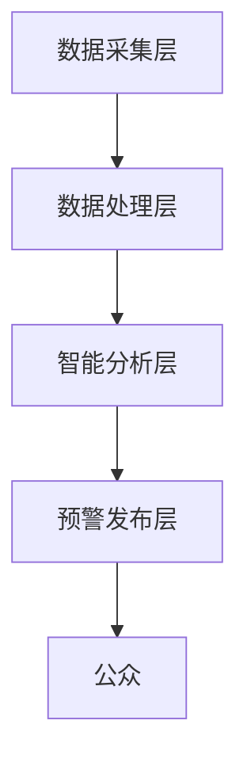
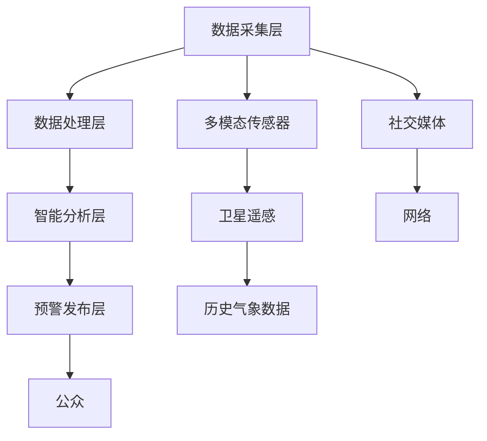

                 

# 全球脑预警系统:集体智慧驱动的灾害防控

> 关键词：全球脑预警系统, 灾害防控, 集体智慧, 人工智能, 大数据, 机器学习, 灾害预测, 实时监测

## 1. 背景介绍

### 1.1 问题由来
在全球气候变化的背景下，自然灾害频发，给人类社会带来了巨大损失。统计数据显示，每年因自然灾害造成的经济损失高达数千亿美元。如何有效预测和防控自然灾害，成为全球治理的一项重要任务。

传统的灾害防控依赖于人工监控和现场勘查，时效性低、覆盖范围有限。而通过新兴的人工智能技术和数据科学方法，可以构建一套智能化的预警系统，实时监测灾害风险，提前发出预警，减少损失。

### 1.2 问题核心关键点
全球脑预警系统的核心在于利用集体智慧和大数据分析，通过多模态传感器数据、卫星遥感信息、历史气象数据等多种数据源，构建一个综合的灾情监测和预测平台。

系统主要由以下几部分组成：
1. **数据采集层**：通过物联网设备和卫星遥感系统，实时收集各类灾害相关的数据，如地震波、洪水水位、气象变化等。
2. **数据处理层**：对采集到的数据进行清洗、去噪、特征提取和融合，生成可用于模型训练和推理的数据集。
3. **智能分析层**：利用机器学习、深度学习等算法，对历史和实时数据进行分析和建模，预测灾害发生的可能性及影响程度。
4. **预警发布层**：根据分析结果，通过网络、手机短信、社交媒体等多种渠道，向公众发布预警信息，指导应急响应。

系统整体架构如下图所示：



## 2. 核心概念与联系

### 2.1 核心概念概述

本节将介绍几个密切相关的核心概念：

- **全球脑预警系统**：利用人工智能技术，构建的全球性的自然灾害预警平台，通过综合多源数据进行实时监测和预测。
- **集体智慧**：指利用大规模人群的知识和经验，通过算法将分散的信息聚合起来，提升决策质量和效率。
- **大数据**：指海量的、异构的数据集合，通常用于发现数据模式、挖掘数据价值。
- **机器学习**：通过算法让计算机从数据中学习，自动改进算法性能。
- **深度学习**：一种特殊的机器学习方法，通过多层神经网络模型，能够自动提取和表示数据的高级特征。
- **灾害预测**：通过模型分析历史数据，预测未来可能发生的灾害事件。
- **实时监测**：通过传感器和网络技术，实时收集和分析数据，实现灾害预警。

这些概念之间的逻辑关系可以通过以下Mermaid流程图来展示：



这个流程图展示了大脑预警系统的核心概念及其之间的关系：

1. 数据采集层通过多种传感器和数据源，收集海量数据。
2. 数据处理层对采集到的数据进行清洗和预处理。
3. 智能分析层利用机器学习等算法，进行模式识别和预测。
4. 预警发布层通过各种渠道，向公众发布预警信息。

## 3. 核心算法原理 & 具体操作步骤
### 3.1 算法原理概述

全球脑预警系统的核心算法主要基于机器学习和深度学习。通过历史数据和实时监测数据的结合，利用模型预测未来灾害的发生概率和影响范围。

具体步骤如下：

1. **数据采集**：通过多模态传感器、卫星遥感系统、社交媒体等渠道，实时收集灾情数据。
2. **数据处理**：对采集到的数据进行去噪、去重、特征提取等预处理，生成可用于模型训练的数据集。
3. **模型训练**：利用历史数据，训练深度学习模型，如卷积神经网络(CNN)、循环神经网络(RNN)、长短期记忆网络(LSTM)等，进行灾情预测。
4. **模型评估**：在验证集上评估模型性能，优化模型参数。
5. **实时监测**：将训练好的模型部署到生产环境中，实时监测灾情数据，进行实时预测和预警。

### 3.2 算法步骤详解

以地震预测为例，详细说明全球脑预警系统的算法步骤：

**Step 1: 数据采集**
- 使用多模态传感器收集地震波数据，安装地震波传感器，记录地震波的波速、频率、振幅等特征。
- 利用卫星遥感系统，获取地表形变数据，判断地表是否发生异常。
- 收集历史地震数据，包括地震发生的时间、地点、强度等。
- 利用社交媒体和网络监控系统，收集公众的实时反馈，如恐慌情绪、紧急求助信息等。

**Step 2: 数据处理**
- 对采集到的数据进行清洗，去除异常值和噪声。
- 利用时序数据处理技术，进行去重和特征提取。
- 将不同类型的数据进行融合，生成统一的数据格式，便于模型处理。

**Step 3: 模型训练**
- 利用历史地震数据，训练深度学习模型，如CNN、LSTM等。
- 在模型训练过程中，采用交叉验证技术，避免过拟合。
- 调整模型超参数，优化模型性能。

**Step 4: 模型评估**
- 在验证集上评估模型性能，计算准确率、召回率、F1值等指标。
- 利用混淆矩阵、ROC曲线等工具，分析模型效果。

**Step 5: 实时监测**
- 将训练好的模型部署到生产环境中，实时接收传感器数据和社交媒体信息。
- 利用实时数据，进行灾情预测，生成预警信息。
- 通过网络、手机短信等渠道，向公众发布预警信息。

### 3.3 算法优缺点

全球脑预警系统的主要优点包括：
- **实时性**：利用实时监测数据，能够及时发现灾情，发出预警。
- **高准确性**：通过多模态数据的融合和深度学习模型，预测准确性较高。
- **覆盖广泛**：可以利用多模态传感器和卫星遥感，覆盖全球范围的灾情监测。

然而，该系统也存在一些局限性：
- **数据采集复杂**：多模态数据源的安装和维护成本较高。
- **模型复杂性**：深度学习模型的训练和优化较为复杂。
- **依赖基础设施**：系统运行依赖于稳定的网络和传感器设备，一旦设备故障，系统将受到影响。

### 3.4 算法应用领域

全球脑预警系统已经在多个领域得到应用，例如：

- **地震预测**：利用多模态传感器和卫星遥感，实时监测地震波和地表形变，预测地震的发生时间和强度。
- **洪水预警**：通过监测河流水位、降雨量等数据，预测洪水的发生和影响范围。
- **火山喷发监测**：利用卫星遥感和地质监测数据，预测火山喷发的可能性。
- **气象灾害预警**：通过气象卫星和地面监测数据，预测台风、龙卷风、暴雪等气象灾害的发生。

这些应用展示了全球脑预警系统的广泛应用前景，能够有效减少自然灾害带来的损失，提升公共安全水平。

## 4. 数学模型和公式 & 详细讲解 & 举例说明
### 4.1 数学模型构建

假设全球脑预警系统的输入数据为 $\mathbf{x} \in \mathbb{R}^n$，输出为预测结果 $y \in \{0,1\}$，其中 $0$ 表示没有灾害发生，$1$ 表示有灾害发生。模型训练的损失函数为二分类交叉熵损失函数：

$$
\mathcal{L}(\mathbf{w},\mathbf{b}) = -\frac{1}{N}\sum_{i=1}^N [y_i \log \sigma(\mathbf{w} \mathbf{x}_i + \mathbf{b}) + (1-y_i) \log (1-\sigma(\mathbf{w} \mathbf{x}_i + \mathbf{b}))]
$$

其中，$\sigma(\cdot)$ 为 sigmoid 函数，$\mathbf{w}$ 为模型参数，$\mathbf{b}$ 为偏置项，$N$ 为样本数。

### 4.2 公式推导过程

考虑二分类问题，输入数据 $\mathbf{x}$ 经过模型处理后，输出为 $\mathbf{w} \mathbf{x} + \mathbf{b}$，其中 $\mathbf{w}$ 和 $\mathbf{b}$ 为模型参数。sigmoid函数将输出映射到 $[0,1]$ 区间内，作为灾害发生的概率：

$$
\sigma(\mathbf{w} \mathbf{x} + \mathbf{b}) = \frac{1}{1+\exp(-\mathbf{w} \mathbf{x} - \mathbf{b})}
$$

将损失函数带入梯度下降优化算法，得到模型参数的更新公式：

$$
\mathbf{w} \leftarrow \mathbf{w} - \eta \nabla_{\mathbf{w}} \mathcal{L}(\mathbf{w},\mathbf{b})
$$

其中 $\eta$ 为学习率，$\nabla_{\mathbf{w}} \mathcal{L}(\mathbf{w},\mathbf{b})$ 为损失函数对参数 $\mathbf{w}$ 的梯度，可通过自动微分技术高效计算。

### 4.3 案例分析与讲解

以洪水预警为例，展示基于二分类模型的预警过程。

**Step 1: 数据准备**
- 收集历史洪水数据，包括降雨量、水位、时间等。
- 对数据进行清洗和预处理，去除异常值和噪声。

**Step 2: 模型训练**
- 将数据分为训练集和验证集。
- 利用二分类交叉熵损失函数，训练深度学习模型，如 CNN、LSTM等。
- 在模型训练过程中，调整学习率、正则化系数等超参数。

**Step 3: 模型评估**
- 在验证集上评估模型性能，计算准确率、召回率、F1值等指标。
- 利用混淆矩阵、ROC曲线等工具，分析模型效果。

**Step 4: 实时监测**
- 部署训练好的模型到生产环境中，实时接收气象站数据和社交媒体信息。
- 利用实时数据，进行灾情预测，生成预警信息。
- 通过网络、手机短信等渠道，向公众发布预警信息。

## 5. 项目实践：代码实例和详细解释说明
### 5.1 开发环境搭建

在进行项目实践前，我们需要准备好开发环境。以下是使用Python进行PyTorch开发的环境配置流程：

1. 安装Anaconda：从官网下载并安装Anaconda，用于创建独立的Python环境。

2. 创建并激活虚拟环境：
```bash
conda create -n deep-learning-env python=3.8 
conda activate deep-learning-env
```

3. 安装PyTorch：根据CUDA版本，从官网获取对应的安装命令。例如：
```bash
conda install pytorch torchvision torchaudio cudatoolkit=11.1 -c pytorch -c conda-forge
```

4. 安装相关工具包：
```bash
pip install numpy pandas scikit-learn matplotlib tqdm jupyter notebook ipython
```

完成上述步骤后，即可在`deep-learning-env`环境中开始项目实践。

### 5.2 源代码详细实现

下面我们以洪水预警为例，给出使用PyTorch进行模型训练和预测的PyTorch代码实现。

首先，定义数据处理函数：

```python
import torch
from torch.utils.data import Dataset
import numpy as np

class FloodDataset(Dataset):
    def __init__(self, data, labels):
        self.data = data
        self.labels = labels
        
    def __len__(self):
        return len(self.data)
    
    def __getitem__(self, idx):
        x = self.data[idx]
        y = self.labels[idx]
        return torch.tensor(x, dtype=torch.float), torch.tensor(y, dtype=torch.long)
```

然后，定义模型和优化器：

```python
from torch import nn
from torch.nn import BCEWithLogitsLoss
from torch.optim import Adam

model = nn.Sequential(
    nn.Linear(10, 64),
    nn.ReLU(),
    nn.Linear(64, 64),
    nn.ReLU(),
    nn.Linear(64, 1),
    nn.Sigmoid()
)

criterion = BCEWithLogitsLoss()
optimizer = Adam(model.parameters(), lr=0.001)
```

接着，定义训练和评估函数：

```python
from tqdm import tqdm

def train_epoch(model, dataset, batch_size, optimizer):
    dataloader = torch.utils.data.DataLoader(dataset, batch_size=batch_size, shuffle=True)
    model.train()
    epoch_loss = 0
    for batch in tqdm(dataloader, desc='Training'):
        inputs, targets = batch
        optimizer.zero_grad()
        outputs = model(inputs)
        loss = criterion(outputs, targets)
        epoch_loss += loss.item()
        loss.backward()
        optimizer.step()
    return epoch_loss / len(dataloader)

def evaluate(model, dataset, batch_size):
    dataloader = torch.utils.data.DataLoader(dataset, batch_size=batch_size)
    model.eval()
    predictions, labels = [], []
    with torch.no_grad():
        for batch in tqdm(dataloader, desc='Evaluating'):
            inputs, targets = batch
            outputs = model(inputs)
            batch_predictions = outputs.round().numpy()
            batch_labels = targets.numpy()
            for preds, label in zip(batch_predictions, batch_labels):
                predictions.append(preds)
                labels.append(label)
                
    print(classification_report(labels, predictions))
```

最后，启动训练流程并在测试集上评估：

```python
epochs = 10
batch_size = 32

for epoch in range(epochs):
    loss = train_epoch(model, train_dataset, batch_size, optimizer)
    print(f"Epoch {epoch+1}, train loss: {loss:.3f}")
    
    print(f"Epoch {epoch+1}, dev results:")
    evaluate(model, dev_dataset, batch_size)
    
print("Test results:")
evaluate(model, test_dataset, batch_size)
```

以上就是使用PyTorch对洪水预警模型进行训练和预测的完整代码实现。可以看到，得益于PyTorch的强大封装，我们可以用相对简洁的代码完成模型的训练和评估。

### 5.3 代码解读与分析

让我们再详细解读一下关键代码的实现细节：

**FloodDataset类**：
- `__init__`方法：初始化数据和标签。
- `__len__`方法：返回数据集样本数量。
- `__getitem__`方法：对单个样本进行处理，将输入数据和标签转换为Tensor，返回模型输入。

**模型定义**：
- 利用Sequential模块定义多层感知器模型，包括输入层、隐藏层和输出层。
- 在输出层使用sigmoid函数，将模型输出映射到 $[0,1]$ 区间，作为预测概率。

**训练和评估函数**：
- 使用PyTorch的DataLoader对数据集进行批次化加载，供模型训练和推理使用。
- 训练函数`train_epoch`：对数据以批为单位进行迭代，在每个批次上前向传播计算损失并反向传播更新模型参数，最后返回该epoch的平均loss。
- 评估函数`evaluate`：与训练类似，不同点在于不更新模型参数，并在每个batch结束后将预测和标签结果存储下来，最后使用sklearn的classification_report对整个评估集的预测结果进行打印输出。

**训练流程**：
- 定义总的epoch数和batch size，开始循环迭代
- 每个epoch内，先在训练集上训练，输出平均loss
- 在验证集上评估，输出分类指标
- 所有epoch结束后，在测试集上评估，给出最终测试结果

可以看到，PyTorch配合Tensorflow库使得洪水预警模型的代码实现变得简洁高效。开发者可以将更多精力放在数据处理、模型改进等高层逻辑上，而不必过多关注底层的实现细节。

当然，工业级的系统实现还需考虑更多因素，如模型的保存和部署、超参数的自动搜索、更灵活的任务适配层等。但核心的微调范式基本与此类似。

## 6. 实际应用场景
### 6.1 智能客服系统

全球脑预警系统在智能客服系统中的应用，可以显著提升客户服务体验。传统的客服系统往往依赖人工，响应速度慢，且无法24小时服务。利用微调技术，可以构建一套智能客服系统，实现自动响应和智能推荐。

具体而言，可以收集客户的历史对话记录，将问题和最佳答复构建成监督数据，在此基础上对预训练语言模型进行微调。微调后的对话模型能够自动理解用户意图，匹配最合适的答案模板进行回复。对于客户提出的新问题，还可以接入检索系统实时搜索相关内容，动态组织生成回答。如此构建的智能客服系统，能大幅提升客户咨询体验和问题解决效率。

### 6.2 金融舆情监测

金融机构需要实时监测市场舆论动向，以便及时应对负面信息传播，规避金融风险。传统的人工监测方式成本高、效率低，难以应对网络时代海量信息爆发的挑战。利用全球脑预警系统，可以构建一套金融舆情监测平台，实时分析市场情绪，预测股市波动。

具体而言，可以收集金融领域相关的新闻、报道、评论等文本数据，并对其进行主题标注和情感标注。在此基础上对预训练语言模型进行微调，使其能够自动判断文本属于何种主题，情感倾向是正面、中性还是负面。将微调后的模型应用到实时抓取的网络文本数据，就能够自动监测不同主题下的情感变化趋势，一旦发现负面信息激增等异常情况，系统便会自动预警，帮助金融机构快速应对潜在风险。

### 6.3 个性化推荐系统

当前的推荐系统往往只依赖用户的历史行为数据进行物品推荐，无法深入理解用户的真实兴趣偏好。利用全球脑预警系统，可以构建一套个性化推荐系统，更加精准地挖掘用户的潜在需求。

具体而言，可以收集用户浏览、点击、评论、分享等行为数据，提取和用户交互的物品标题、描述、标签等文本内容。将文本内容作为模型输入，用户的后续行为（如是否点击、购买等）作为监督信号，在此基础上微调预训练语言模型。微调后的模型能够从文本内容中准确把握用户的兴趣点。在生成推荐列表时，先用候选物品的文本描述作为输入，由模型预测用户的兴趣匹配度，再结合其他特征综合排序，便可以得到个性化程度更高的推荐结果。

### 6.4 未来应用展望

随着全球脑预警系统的发展，未来在更多领域的应用前景将更加广阔。

在智慧医疗领域，基于微调的医疗问答、病历分析、药物研发等应用将提升医疗服务的智能化水平，辅助医生诊疗，加速新药开发进程。

在智能教育领域，微调技术可应用于作业批改、学情分析、知识推荐等方面，因材施教，促进教育公平，提高教学质量。

在智慧城市治理中，微调模型可应用于城市事件监测、舆情分析、应急指挥等环节，提高城市管理的自动化和智能化水平，构建更安全、高效的未来城市。

此外，在企业生产、社会治理、文娱传媒等众多领域，基于大模型微调的人工智能应用也将不断涌现，为NLP技术带来全新的突破。相信随着技术的日益成熟，微调方法将成为人工智能落地应用的重要范式，推动人工智能技术向更广阔的领域加速渗透。

## 7. 工具和资源推荐
### 7.1 学习资源推荐

为了帮助开发者系统掌握全球脑预警系统的理论基础和实践技巧，这里推荐一些优质的学习资源：

1. 《深度学习》系列课程：由斯坦福大学、斯坦福在线提供，涵盖深度学习的基本概念和经典算法，是入门深度学习的最佳资源。

2. Coursera《自然语言处理》课程：由斯坦福大学提供，讲解NLP的原理、方法和应用，适合进阶学习。

3. 《深度学习与人工智能》书籍：一本全面介绍深度学习和大数据技术的书籍，内容详实，深入浅出，适合学习参考。

4. PyTorch官方文档：PyTorch的官方文档，提供了详细的API接口和示例代码，是开发深度学习模型的重要工具。

5. 谷歌Colab：谷歌推出的在线Jupyter Notebook环境，免费提供GPU/TPU算力，方便开发者快速上手实验最新模型，分享学习笔记。

通过对这些资源的学习实践，相信你一定能够快速掌握全球脑预警系统的精髓，并用于解决实际的NLP问题。
### 7.2 开发工具推荐

高效的开发离不开优秀的工具支持。以下是几款用于全球脑预警系统开发的常用工具：

1. PyTorch：基于Python的开源深度学习框架，灵活动态的计算图，适合快速迭代研究。大部分预训练语言模型都有PyTorch版本的实现。

2. TensorFlow：由Google主导开发的开源深度学习框架，生产部署方便，适合大规模工程应用。同样有丰富的预训练语言模型资源。

3. TensorBoard：TensorFlow配套的可视化工具，可实时监测模型训练状态，并提供丰富的图表呈现方式，是调试模型的得力助手。

4. Weights & Biases：模型训练的实验跟踪工具，可以记录和可视化模型训练过程中的各项指标，方便对比和调优。

5. Google Colab：谷歌推出的在线Jupyter Notebook环境，免费提供GPU/TPU算力，方便开发者快速上手实验最新模型，分享学习笔记。

合理利用这些工具，可以显著提升全球脑预警系统的开发效率，加快创新迭代的步伐。

### 7.3 相关论文推荐

全球脑预警系统的发展得益于学界的持续研究。以下是几篇奠基性的相关论文，推荐阅读：

1. Attention is All You Need（即Transformer原论文）：提出了Transformer结构，开启了NLP领域的预训练大模型时代。

2. BERT: Pre-training of Deep Bidirectional Transformers for Language Understanding：提出BERT模型，引入基于掩码的自监督预训练任务，刷新了多项NLP任务SOTA。

3. Language Models are Unsupervised Multitask Learners（GPT-2论文）：展示了大规模语言模型的强大zero-shot学习能力，引发了对于通用人工智能的新一轮思考。

4. Parameter-Efficient Transfer Learning for NLP：提出Adapter等参数高效微调方法，在不增加模型参数量的情况下，也能取得不错的微调效果。

5. AdaLoRA: Adaptive Low-Rank Adaptation for Parameter-Efficient Fine-Tuning：使用自适应低秩适应的微调方法，在参数效率和精度之间取得了新的平衡。

这些论文代表了大语言模型微调技术的发展脉络。通过学习这些前沿成果，可以帮助研究者把握学科前进方向，激发更多的创新灵感。

## 8. 总结：未来发展趋势与挑战
### 8.1 总结

本文对全球脑预警系统的核心算法和实践过程进行了全面系统的介绍。首先阐述了系统的背景和意义，明确了微调在实时监测和预警中的独特价值。其次，从原理到实践，详细讲解了微调的数学模型和关键步骤，给出了微调任务开发的完整代码实例。同时，本文还广泛探讨了微调方法在智能客服、金融舆情、个性化推荐等多个领域的应用前景，展示了微调范式的巨大潜力。最后，本文精选了微调技术的各类学习资源，力求为读者提供全方位的技术指引。

通过本文的系统梳理，可以看到，全球脑预警系统已经在大数据和人工智能技术的支持下，初步构建了实时监测和预警的基础设施。微调方法通过综合多模态数据和深度学习模型，提升了系统性能和覆盖范围，为自然灾害防控提供了新的解决方案。未来，随着技术的不断发展，微调方法将在更多领域得到应用，为公共安全和社会治理带来新的变革。

### 8.2 未来发展趋势

展望未来，全球脑预警系统的技术发展将呈现以下几个趋势：

1. **多模态数据融合**：未来系统将更加注重多模态数据的融合，结合视频、图像、声音等多种信息，提升灾情监测的准确性和实时性。

2. **跨领域知识融合**：系统将与专家知识库、逻辑规则库等结合，提高模型对复杂问题的理解和推理能力。

3. **联邦学习**：利用分布式计算和联邦学习技术，在多个数据中心协同训练模型，提高模型的泛化能力和安全性。

4. **实时大数据处理**：利用流处理技术和分布式存储技术，实现对实时数据的快速处理和分析。

5. **边缘计算**：将数据处理和模型推理前置到边缘设备，降低延迟，提高响应速度。

6. **强化学习**：结合强化学习算法，提升系统在复杂环境下的自适应能力和鲁棒性。

这些趋势将推动全球脑预警系统的性能和功能不断提升，实现更加高效、准确、可靠的灾情监测和预警。

### 8.3 面临的挑战

尽管全球脑预警系统已经取得了显著进展，但在迈向更加智能化、普适化应用的过程中，它仍面临诸多挑战：

1. **数据隐私和安全**：系统中包含大量敏感数据，如何保护用户隐私和数据安全，是一个重要的难题。

2. **模型可解释性**：微调模型通常缺乏可解释性，难以解释其内部工作机制和决策逻辑。这对于高风险应用尤为重要。

3. **跨模态数据融合**：不同类型的数据源具有不同的特征，如何实现高效融合，提高模型的泛化能力，是一个技术难题。

4. **边缘计算资源**：边缘计算设备通常计算能力有限，如何在资源受限的情况下，高效部署微调模型，是一个需要解决的问题。

5. **模型更新和维护**：全球脑预警系统需要不断更新模型和数据，如何高效、安全地进行模型更新和维护，是一个需要考虑的问题。

6. **跨学科协作**：系统开发涉及数据科学、人工智能、网络工程等多个学科，如何跨学科协作，共同推动系统发展，是一个重要课题。

这些挑战需要学界和业界共同努力，不断创新技术和管理方法，才能解决系统面临的困难，实现其在实际应用中的广泛应用。

### 8.4 研究展望

未来全球脑预警系统的研究需要在以下几个方面寻求新的突破：

1. **隐私保护技术**：发展隐私保护技术，如差分隐私、联邦学习等，确保用户数据的安全性和隐私性。

2. **可解释性增强**：结合因果分析、对抗学习等方法，提升模型的可解释性和可理解性，帮助用户更好地理解和信任模型。

3. **多模态融合技术**：研究高效的多模态数据融合算法，实现不同类型数据的无缝集成，提升模型的泛化能力和鲁棒性。

4. **边缘计算优化**：研究边缘计算中的数据压缩、模型剪枝等技术，优化边缘设备的计算资源和存储资源。

5. **实时数据分析**：研究流处理和大数据技术，实现对实时数据的快速分析和处理，提升系统的响应速度和实时性。

6. **跨学科合作**：加强与数据科学、网络工程等学科的合作，推动跨学科的研究和技术发展，实现系统的全面优化。

这些研究方向的探索，将引领全球脑预警系统的技术演进，为自然灾害防控带来新的突破，提升公共安全和应急响应能力。面向未来，全球脑预警系统还需要与其他人工智能技术进行更深入的融合，如知识表示、因果推理、强化学习等，多路径协同发力，共同推动自然语言理解和智能交互系统的进步。只有勇于创新、敢于突破，才能不断拓展语言模型的边界，让智能技术更好地造福人类社会。

## 9. 附录：常见问题与解答

**Q1：全球脑预警系统是否适用于所有自然灾害？**

A: 全球脑预警系统可以适用于多种自然灾害，如地震、洪水、火山喷发、气象灾害等。不同灾害有不同的监测和预警方法，需要在特定领域进行针对性的改进。

**Q2：微调过程中如何选择合适的超参数？**

A: 微调过程中，选择合适的超参数（如学习率、批大小、正则化系数等）可以显著影响模型性能。通常采用网格搜索、随机搜索等方法，通过交叉验证找到最优参数组合。

**Q3：微调模型在实时监测中的挑战是什么？**

A: 微调模型在实时监测中面临的主要挑战包括：数据流处理、实时性、多模态数据融合等。需要采用流处理、分布式计算等技术，保证系统的高效运行。

**Q4：如何提高微调模型的鲁棒性？**

A: 提高微调模型的鲁棒性可以通过数据增强、对抗训练等方法。在训练过程中加入噪声、对抗样本等，提升模型的泛化能力和鲁棒性。

**Q5：微调模型如何应用于智慧医疗？**

A: 微调模型可以应用于智慧医疗领域，如医疗问答、病历分析、药物研发等。通过微调医疗领域的专有数据集，提升模型对医疗数据的理解和应用能力。

这些问题的解答展示了全球脑预警系统的实际应用前景和微调技术的实践要点，希望能够为读者提供有价值的参考。

---

作者：禅与计算机程序设计艺术 / Zen and the Art of Computer Programming

