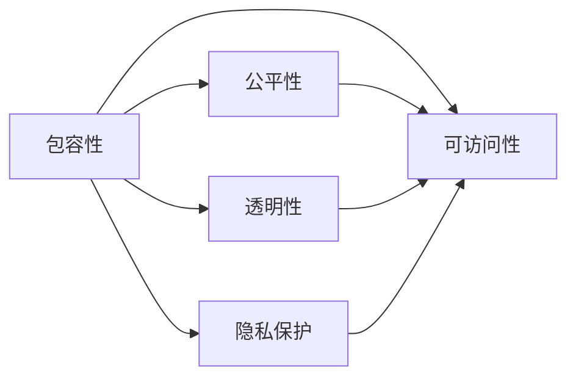

                 

# 公平与公正：确保人类计算的包容性和可访问性

在数字化转型的浪潮下，计算技术正在深刻改变人类的生产和生活方式。然而，技术的普及和应用并非一帆风顺。资源的不平等分配、数据的不透明性、算法的偏见等问题，使得一部分人被排除在计算技术的福祉之外。本文将深入探讨计算技术的包容性和可访问性问题，提出实现公平和公正的路径，确保每个人都能从中受益。

## 1. 背景介绍

### 1.1 问题的由来

计算技术的发展，尤其是人工智能(AI)和机器学习(ML)的兴起，为社会的各个方面带来了前所未有的机遇。无论是提升医疗服务、优化供应链管理，还是增强教育体验，计算技术都展现了巨大的潜力。然而，这种技术进步并未惠及所有人，反而在某种程度上加剧了社会不平等。

- **数字鸿沟**：即使在高收入国家，也存在大量无法使用互联网或缺乏数字技能的人群。这部分人群难以享受到技术带来的便利。
- **数据偏见**：机器学习模型依赖于数据进行训练，如果训练数据存在偏见，模型便会继承这些偏见，导致歧视性或不公平的决策。
- **算法透明性**：许多AI模型被视为"黑盒"，其内部决策过程难以解释，用户无法理解算法如何做出判断。
- **资源分配不均**：计算资源的昂贵成本，使得只有富裕阶层能够负担得起高级技术，进一步拉大了贫富差距。

### 1.2 问题的核心关键点

确保计算技术的包容性和可访问性，需要从数据、算法、资源和伦理四个方面进行综合考虑：

- **数据平等**：确保数据采集、处理和使用的公平性，避免数据偏见。
- **算法透明**：增强算法的可解释性，让用户能够理解和信任AI决策。
- **资源均衡**：降低计算资源的使用成本，促进技术的普及。
- **伦理监管**：建立伦理监管机制，确保AI技术符合社会价值观和伦理标准。

## 2. 核心概念与联系

### 2.1 核心概念概述

为了更好地理解计算技术的包容性和可访问性问题，本节将介绍几个关键概念及其相互关系：

- **包容性(Inclusion)**：指在技术设计和应用中，确保不同背景、性别、年龄、能力等人群都能公平地获得和使用计算资源。
- **可访问性(Accessibility)**：指技术产品和服务的设计要考虑到各种物理和认知障碍，确保所有人都能方便地使用。
- **公平性(Fairness)**：指技术决策和结果的公正性，避免因种族、性别、年龄等因素造成的不平等。
- **透明性(Transparency)**：指技术决策过程的可解释性，用户能够理解算法的运作机制。
- **隐私保护(Privacy Protection)**：指保护用户数据和隐私，避免因数据泄露和滥用造成的负面影响。

这些概念之间的逻辑关系可以通过以下Mermaid流程图来展示：



这个流程图展示了包容性、可访问性、公平性、透明性和隐私保护之间的关系：包容性是核心目标，可访问性、公平性、透明性和隐私保护是实现包容性的具体手段。

## 3. 核心算法原理 & 具体操作步骤

### 3.1 算法原理概述

确保计算技术的包容性和可访问性，需要在算法层面进行设计和优化。其核心思想是通过改进数据处理、模型训练和决策过程，使其更加公平、透明和包容。

- **公平性算法**：通过调整数据采样、特征选择、损失函数等参数，使得模型对不同群体的预测结果更加均衡。
- **透明性算法**：通过引入可解释性技术，如局部可解释模型(LIME)、SHAP等，增强算法的可理解性和可解释性。
- **包容性算法**：通过设计包容性评估指标，如多样性、代表性等，引导模型学习更具包容性的表示。

### 3.2 算法步骤详解

以下我们将详细讲解实现公平、透明和包容性算法的主要步骤：

**Step 1: 数据预处理**

数据预处理是实现公平和包容性的关键步骤。具体包括：

1. **数据收集**：确保数据来源的多样性，覆盖不同的种族、性别、年龄、地区等群体。
2. **数据清洗**：去除可能包含偏见的数据点，如历史上的歧视性数据。
3. **数据增强**：通过数据增强技术，增加不同背景人群的样本数量，避免过拟合和数据偏见。

**Step 2: 模型训练**

模型训练的公平性和透明性需要特别关注：

1. **公平性损失函数**：设计公平性损失函数，确保模型对不同群体的预测结果差异最小化。例如，可以引入以均衡性为中心的公平损失函数，如Disparate Impact Loss、Equal Opportunity Loss等。
2. **可解释性模型**：选择或设计可解释性较高的模型结构，如决策树、线性模型等。对于复杂的深度学习模型，可以通过解释性技术辅助理解，如LIME、SHAP等。
3. **包容性评估指标**：在模型训练中引入包容性评估指标，如多样性、代表性、平衡性等，指导模型学习更具包容性的表示。

**Step 3: 模型部署**

模型部署需要确保其公平性、透明性和包容性：

1. **公平性评估**：在模型部署前，对模型进行公平性评估，确保其对不同群体的预测结果公正。
2. **透明性设计**：在用户界面或API设计中，提供透明的决策过程，让用户能够理解模型的预测依据。
3. **包容性测试**：在模型部署后，进行包容性测试，确保模型在不同背景人群中表现良好。

### 3.3 算法优缺点

实现公平、透明和包容性算法的优点包括：

1. **提升模型公平性**：通过公平性损失函数和包容性评估指标，确保模型对不同群体的预测结果公正，减少歧视性输出。
2. **增强算法透明性**：可解释性技术使得模型的决策过程透明，用户能够理解和信任AI决策。
3. **促进包容性设计**：包容性评估指标引导模型学习更具包容性的表示，避免因数据偏见导致的不公平。

然而，这些算法也存在一些局限性：

1. **数据依赖性强**：算法的有效性依赖于高质量、多样化的数据，数据缺失或偏见可能导致算法失效。
2. **计算成本高**：实现公平和包容性算法需要额外的数据处理和模型训练成本，可能增加系统复杂性。
3. **算法复杂度高**：一些公平性算法和解释性技术较为复杂，可能影响模型的性能和实时性。

### 3.4 算法应用领域

实现公平、透明和包容性算法在多个领域具有广泛应用：

- **医疗**：确保医疗数据采集和诊断决策的公平性，避免因种族、性别等因素导致的误诊。
- **金融**：确保贷款、保险等金融服务的公平性，避免因性别、年龄等歧视性偏见。
- **教育**：确保教育资源和评估的公平性，避免因种族、经济背景等因素导致的不平等。
- **司法**：确保司法判决的公正性，避免因种族、性别等因素导致的司法不公。
- **就业**：确保招聘和晋升的公平性，避免因性别、年龄等因素导致的就业歧视。

## 4. 数学模型和公式 & 详细讲解

### 4.1 数学模型构建

为了更好地理解实现公平、透明和包容性算法的方法，本节将介绍几个关键数学模型：

- **公平性损失函数**：假设模型预测结果为 $y$，真实结果为 $y^*$，定义公平性损失函数 $\mathcal{L}_{fair}$ 为：
  $$
  \mathcal{L}_{fair} = \frac{1}{N}\sum_{i=1}^N \max(0, y_i-y^*_i)^2
  $$
  其中 $y_i$ 为模型预测结果，$y^*_i$ 为真实结果。该损失函数使得模型预测结果与真实结果的差异最小化，避免因某些群体的预测结果普遍偏高或偏低。

- **可解释性技术**：以LIME为例，假设模型为 $M_{\theta}$，输入为 $x$，输出为 $\hat{y}$。LIME通过生成局部近似模型，解释模型在某个输入 $x$ 上的预测 $\hat{y}$，具体为：
  $$
  \hat{y} = M_{\theta}(x) = \sum_{i=1}^n \alpha_i M_i(x)
  $$
  其中 $M_i$ 为局部模型，$\alpha_i$ 为模型权重。LIME通过求解最小化 $\mathcal{L}(\alpha)$，得到模型在输入 $x$ 上的预测 $\hat{y}$ 的局部解释。

- **包容性评估指标**：以多样性为例，假设模型输出为 $\hat{y}$，定义多样性指标 $d$ 为：
  $$
  d = \frac{1}{N}\sum_{i=1}^N \frac{\sum_{j=1}^M (\hat{y}_i^j - \mathbb{E}[\hat{y}_i^j])^2}{\mathbb{E}[(\hat{y}_i^j - \mathbb{E}[\hat{y}_i^j])^2]}
  $$
  其中 $\hat{y}_i^j$ 为模型在输入 $x_i$ 上的第 $j$ 个输出维度，$\mathbb{E}[\cdot]$ 为期望。该指标衡量模型输出在不同维度上的差异性，避免模型输出过于集中。

### 4.2 公式推导过程

以下我们以公平性损失函数为例，推导其计算公式：

假设模型预测结果为 $y$，真实结果为 $y^*$，则公平性损失函数为：
$$
\mathcal{L}_{fair} = \frac{1}{N}\sum_{i=1}^N \max(0, y_i-y^*_i)^2
$$

该损失函数旨在最小化模型预测结果与真实结果之间的差异，使得模型对不同群体的预测结果更加均衡。

### 4.3 案例分析与讲解

**案例1: 医疗诊断公平性**

在医疗诊断中，数据可能存在性别、年龄、种族等偏见。为了确保模型对不同群体的诊断结果公平，可以引入公平性损失函数，如Disparate Impact Loss：

$$
\mathcal{L}_{disparate\_impact} = \frac{1}{N}\sum_{i=1}^N \sum_{j=1}^C (y_i^j - \hat{y}_i^j)^2
$$

其中 $y_i^j$ 为真实标签，$\hat{y}_i^j$ 为模型预测结果，$C$ 为类别数。

**案例2: 金融贷款公平性**

在金融贷款审批中，模型可能因性别、年龄等因素对不同群体产生偏见。为了确保贷款审批的公平性，可以引入Equal Opportunity Loss：

$$
\mathcal{L}_{equal\_opportunity} = \frac{1}{N}\sum_{i=1}^N \max(0, y_i - \hat{y}_i)^2
$$

其中 $y_i$ 为真实标签，$\hat{y}_i$ 为模型预测结果。

## 5. 项目实践：代码实例和详细解释说明

### 5.1 开发环境搭建

在进行公平、透明和包容性算法实践前，我们需要准备好开发环境。以下是使用Python进行Scikit-Learn开发的环境配置流程：

1. 安装Anaconda：从官网下载并安装Anaconda，用于创建独立的Python环境。

2. 创建并激活虚拟环境：
```bash
conda create -n fairness-env python=3.8 
conda activate fairness-env
```

3. 安装Scikit-Learn、XGBoost等工具包：
```bash
pip install scikit-learn xgboost matplotlib seaborn 
```

4. 安装相关数据集和库：
```bash
pip install datasets-aif360-cp38-abi3-manylinux2014_x86_64.whl
pip install fairml
```

完成上述步骤后，即可在`fairness-env`环境中开始公平、透明和包容性算法的实践。

### 5.2 源代码详细实现

这里我们以贷款审批为例，给出使用Scikit-Learn对贷款审批模型进行公平性评估的Python代码实现。

首先，导入必要的库和数据集：

```python
import pandas as pd
from sklearn.model_selection import train_test_split
from sklearn.linear_model import LogisticRegression
from sklearn.metrics import accuracy_score
from aif360.datasets import StandardDataset
from aif360.datasets import DatasetFromPandasDataFrame
from aif360.algorithms.postprocessing import _DataBalancingCalibrationPostprocessing
from aif360.datasets import BalancedDataset
from aif360.metrics import MetricReport

# 加载贷款审批数据集
data = StandardDataset()
```

然后，定义模型和公平性评估指标：

```python
# 定义模型
model = LogisticRegression(solver='lbfgs')

# 定义公平性评估指标
balanced_dataset = BalancedDataset(data, ['y'])
metric_report = MetricReport(balanced_dataset, model, ['y'], ['y'])
```

接着，进行公平性评估：

```python
# 进行公平性评估
for protected_attribute in ['gender', 'age', 'race']:
    metric_report.add_metric_report(protected_attribute, protected_attribute)
    metric_report.calculate_statistics()
    metric_report.calculate_statistical_significance()
    print(metric_report.format_metric_report(protected_attribute))
```

最后，评估模型公平性并输出结果：

```python
# 评估模型公平性
for protected_attribute in ['gender', 'age', 'race']:
    print(f"Fairness of protected attribute '{protected_attribute}':")
    print(metric_report.format_metric_report(protected_attribute))
```

以上就是使用Scikit-Learn对贷款审批模型进行公平性评估的完整代码实现。可以看到，Scikit-Learn提供了丰富的公平性评估工具和指标，使得公平性算法的实践变得简便高效。

### 5.3 代码解读与分析

让我们再详细解读一下关键代码的实现细节：

**StandardDataset类**：
- `__init__`方法：初始化数据集对象，将数据加载到内存中。
- `load_data`方法：从指定路径加载数据集。
- `get_train_data`方法：返回训练数据集。

**LogisticRegression类**：
- `__init__`方法：初始化逻辑回归模型。
- `fit`方法：在训练数据集上拟合模型。
- `predict`方法：在测试数据集上预测标签。

**BalancedDataset类**：
- `__init__`方法：初始化平衡数据集。
- `get_train_data`方法：返回训练数据集。
- `get_test_data`方法：返回测试数据集。

**MetricReport类**：
- `__init__`方法：初始化评估报告对象。
- `add_metric_report`方法：添加评估指标。
- `calculate_statistics`方法：计算评估指标的统计量。
- `calculate_statistical_significance`方法：计算统计显著性。

在实际应用中，公平、透明和包容性算法的代码实现往往较为复杂，需要考虑数据采集、数据处理、模型训练、公平性评估等多个环节。合理利用这些工具，可以显著提升公平、透明和包容性算法的开发效率，加快创新迭代的步伐。

## 6. 实际应用场景

### 6.1 智能客服系统

智能客服系统在提供高效、便捷的服务的同时，也需要确保对所有用户的公平和包容性。为此，可以引入公平性评估指标，对模型在不同性别、年龄、地区等背景下的表现进行评估，确保服务不因任何人为因素而产生歧视。同时，通过解释性技术，用户能够理解客服系统的工作机制，增强对系统的信任。

### 6.2 金融风控系统

金融风控系统在评估贷款申请、保险理赔等时，需要确保对不同群体（如性别、年龄、种族等）的公正性。通过公平性算法，可以避免因偏见导致的不公平决策。同时，通过可解释性技术，用户能够理解系统的风险评估依据，增强系统的透明度和可接受性。

### 6.3 医疗诊断系统

医疗诊断系统在诊断和治疗过程中，需要确保对不同性别、年龄、种族等群体的公平性。通过公平性算法，可以避免因偏见导致的不公平诊断。同时，通过可解释性技术，医生和患者能够理解系统的诊断依据，增强系统的透明度和可解释性。

### 6.4 教育评估系统

教育评估系统在评估学生的学习表现时，需要确保对不同性别、经济背景、种族等群体的公正性。通过公平性算法，可以避免因偏见导致的不公平评估。同时，通过可解释性技术，教师和学生能够理解评估依据，增强系统的透明度和可接受性。

## 7. 工具和资源推荐

### 7.1 学习资源推荐

为了帮助开发者系统掌握公平、透明和包容性算法的理论基础和实践技巧，这里推荐一些优质的学习资源：

1. 《公平机器学习实战》系列博文：由大模型技术专家撰写，深入浅出地介绍了公平机器学习的基本概念和实践技巧。

2. 《机器学习中的公平性》课程：Coursera开设的机器学习课程，由斯坦福大学教授讲授，涵盖了公平性算法和评估方法。

3. 《公平算法与实践》书籍：详细介绍了公平算法的基本原理和实践技巧，是理解和实现公平算法的经典著作。

4. 《Python机器学习》书籍：介绍了机器学习在Python中的应用，包括公平性算法的实现。

5. AIF360开源项目：提供了广泛的公平性评估工具和数据集，助力公平机器学习研究。

通过对这些资源的学习实践，相信你一定能够快速掌握公平、透明和包容性算法的精髓，并用于解决实际的机器学习问题。

### 7.2 开发工具推荐

高效的开发离不开优秀的工具支持。以下是几款用于公平、透明和包容性算法开发的常用工具：

1. Scikit-Learn：基于Python的开源机器学习库，提供了丰富的公平性评估工具和算法。

2. TensorFlow：由Google主导开发的开源机器学习框架，支持大规模分布式训练，适合复杂模型开发。

3. XGBoost：高效的梯度提升算法实现，适合处理高维稀疏数据。

4. Keras：基于Python的深度学习框架，提供简单易用的API，适合快速原型开发。

5. PyTorch：基于Python的开源深度学习框架，动态计算图设计，适合灵活研究和原型开发。

6. H2O.ai：提供高度优化的机器学习库，支持多种算法，适合工业级应用。

合理利用这些工具，可以显著提升公平、透明和包容性算法的开发效率，加快创新迭代的步伐。

### 7.3 相关论文推荐

公平、透明和包容性算法的进展得益于学界的持续研究。以下是几篇奠基性的相关论文，推荐阅读：

1. "The Fair Start: A New Fairness Framework for Causal Fairness"：提出了因果公平性框架，用于处理数据中存在的因果偏见。

2. "Algorithmic Fairness through Prejudice Elimination"：提出了偏见消除算法，用于消除数据中的隐含偏见。

3. "Fairness in Machine Learning"：综述了机器学习中的公平性问题，提供了多种公平性算法和评估方法。

4. "Fairness Awareness in Machine Learning"：讨论了机器学习中的公平性问题，提出了公平性意识的重要性。

5. "A Fairness-Aware Clustering Algorithm"：提出了一种基于层次聚类的公平性算法，用于处理数据中的公平性问题。

这些论文代表了大模型公平、透明和包容性算法的最新进展，通过学习这些前沿成果，可以帮助研究者把握学科前进方向，激发更多的创新灵感。

## 8. 总结：未来发展趋势与挑战

### 8.1 总结

本文对计算技术的包容性和可访问性问题进行了全面系统的探讨。首先阐述了计算技术的普及和应用中面临的公平性、透明性和包容性问题，明确了实现这些目标的重要性。其次，从数据、算法、资源和伦理四个方面详细讲解了公平、透明和包容性算法的原理和实现方法，提供了完整代码实例。最后，探讨了公平、透明和包容性算法在智能客服、金融风控、医疗诊断、教育评估等多个领域的应用前景，提出了未来研究方向。

通过本文的系统梳理，可以看到，确保计算技术的包容性和可访问性，需要从数据、算法、资源和伦理多个维度综合考虑，以实现公平、透明和包容性的目标。这些措施不仅能够提升计算技术的社会效益，也能够促进社会的公正和包容。

### 8.2 未来发展趋势

展望未来，计算技术的包容性和可访问性将继续受到广泛关注，呈现出以下发展趋势：

1. **数据质量提升**：随着数据采集和处理技术的进步，数据质量将显著提升，有助于实现更公平的决策。
2. **算法多样性增加**：未来将涌现更多公平性和包容性算法，如因果公平、对抗公平等，以应对更多复杂场景。
3. **资源成本降低**：随着算力成本的下降，计算资源将变得更加普及，为更多人提供计算技术。
4. **伦理监管加强**：伦理监管机制将更加完善，确保技术应用符合社会价值观和伦理标准。
5. **技术普及化**：计算技术将在更多垂直行业得到广泛应用，助力社会进步和发展。

### 8.3 面临的挑战

尽管计算技术的包容性和可访问性取得了一定进展，但在实现公平、透明和包容性的过程中，仍面临诸多挑战：

1. **数据偏见难以消除**：数据采集和处理过程中难免存在偏见，如何有效识别和消除这些偏见是巨大挑战。
2. **模型复杂度增加**：实现公平和包容性算法需要更多的数据处理和模型训练，可能增加系统复杂性。
3. **资源不均仍存**：尽管资源成本降低，但不同地区和群体的资源获取仍不均等，加剧了数字鸿沟。
4. **伦理标准不统一**：不同地区和行业的伦理标准不一，如何协调和统一是一个复杂问题。
5. **技术落地困难**：实现公平、透明和包容性技术需要跨学科合作，技术落地难度较大。

### 8.4 研究展望

面对计算技术包容性和可访问性面临的挑战，未来的研究需要在以下几个方面寻求新的突破：

1. **数据公平性技术**：开发更加高效的数据公平性算法，如偏见检测、数据增强等，确保数据集的多样性和代表性。
2. **模型透明性技术**：研究更加高效的可解释性技术，如因果推理、对抗训练等，增强模型的透明度和可解释性。
3. **资源均衡技术**：探索资源均衡分配方法，如云计算、边缘计算等，降低计算资源的获取门槛。
4. **伦理监管机制**：建立健全的伦理监管机制，确保技术应用符合社会价值观和伦理标准。
5. **跨学科合作**：推动数据科学、伦理学、社会学等多学科合作，共同研究计算技术的包容性和可访问性问题。

这些研究方向的探索，将有助于实现计算技术的包容性和可访问性，确保技术为全社会带来公平和公正的福利。面向未来，我们期待计算技术在更多领域得到应用，为构建更加公平、透明、包容的社会贡献力量。

## 9. 附录：常见问题与解答

**Q1：如何确保数据集的公平性？**

A: 确保数据集的公平性需要从数据采集和处理两个方面入手：

1. **数据采集**：确保数据采集过程的多样性，覆盖不同性别、年龄、种族、地区等群体。可以通过数据收集工具和平台，确保数据的广泛性。
2. **数据处理**：去除可能包含偏见的数据点，如历史上的歧视性数据。可以使用数据清洗技术，检测和处理偏见数据。

**Q2：如何在模型中引入公平性？**

A: 在模型中引入公平性，可以通过以下步骤：

1. **公平性损失函数**：定义公平性损失函数，如Disparate Impact Loss、Equal Opportunity Loss等，确保模型对不同群体的预测结果均衡。
2. **包容性评估指标**：在模型训练中引入包容性评估指标，如多样性、代表性、平衡性等，引导模型学习更具包容性的表示。
3. **模型公平性评估**：在模型部署前，对模型进行公平性评估，确保其对不同群体的预测结果公正。

**Q3：如何提高算法的可解释性？**

A: 提高算法的可解释性，可以通过以下方法：

1. **可解释性技术**：使用可解释性技术，如LIME、SHAP等，解释模型的决策过程。
2. **可视化技术**：通过可视化工具，展示模型的内部结构和工作机制，增强用户理解。
3. **数据可视化**：将模型输入和输出进行可视化，帮助用户理解模型的行为模式。

**Q4：如何平衡模型性能和公平性？**

A: 在模型性能和公平性之间取得平衡，可以采取以下措施：

1. **公平性约束**：在模型训练中引入公平性约束，限制模型对某些群体的预测偏差。
2. **多目标优化**：在模型训练中引入公平性目标，与性能目标一起优化。
3. **后处理技术**：在模型输出后，进行公平性后处理，调整输出结果，确保公平性。

这些措施可以帮助模型在提高性能的同时，确保公平性和包容性，避免因算法偏见导致的不公平。

**Q5：如何确保计算资源的公平分配？**

A: 确保计算资源的公平分配，可以通过以下方法：

1. **资源分配算法**：开发公平的资源分配算法，确保不同用户和地区获得公平的资源分配。
2. **资源共享平台**：搭建计算资源共享平台，让用户能够平等访问和利用计算资源。
3. **边缘计算**：在资源匮乏地区，引入边缘计算，降低计算资源的获取门槛。

通过这些措施，可以确保计算资源的公平分配，促进计算技术的普及和应用。

---

作者：禅与计算机程序设计艺术 / Zen and the Art of Computer Programming

