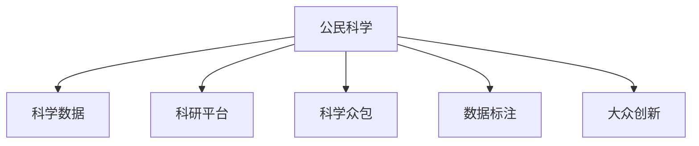

                 

# 公民科学：公众参与科学研究的新模式

## 1. 背景介绍

### 1.1 问题由来
公民科学(Citizen Science)是一种新型的科学研究模式，旨在通过非专业公众参与科学实验和数据收集，拓宽科学研究的广度和深度。随着互联网技术的普及和科学技术的进步，公民科学项目在环保、天文学、生物学等领域得到广泛应用，极大地推动了科学知识的普及和科研实力的提升。

### 1.2 问题核心关键点
公民科学的核心理念在于将公众与科研机构紧密结合，利用大众的智慧和力量，提高科研效率和科学发现的质量。以下是公民科学中的几个关键点：

1. **数据收集**：通过广泛的公众参与，收集海量数据，弥补专业研究不足。
2. **科学实验**：借助公民科学平台，进行小规模科学实验，验证科研假设。
3. **公众教育**：通过参与科研活动，提升公众科学素养和科研兴趣。
4. **数据共享**：平台化的数据共享机制，促进科研成果的传播和利用。
5. **多样性优势**：非专业背景的参与者可以提供独特视角，激发新的研究思路。

### 1.3 问题研究意义
公民科学的兴起，为科学研究带来了新的生命力，也为公众参与科研提供了新的途径。其研究意义主要体现在：

1. **拓宽科研范围**：利用大众力量，拓展科研的广度和深度，尤其是在资源有限的偏远地区。
2. **提高科研效率**：通过大规模数据收集和实验，加速科研进程。
3. **增强科学教育**：通过参与科研，提升公众科学素养，培养科研兴趣。
4. **促进数据共享**：推动科研成果的共享和传播，促进科学知识的普及。
5. **激发创新思维**：非专业背景的参与者可以提供不同视角的洞察，激发新的科研思路。

## 2. 核心概念与联系

### 2.1 核心概念概述

为更好地理解公民科学，本节将介绍几个密切相关的核心概念：

- **公民科学**：通过非专业公众参与科学实验和数据收集，拓宽科学研究的广度和深度。
- **科学数据**：科研活动过程中产生的数据集，是科学研究的重要基础。
- **科研平台**：支持公众参与科研活动和数据共享的平台，如Zooniverse、Citizen Science Gateway等。
- **科学众包**：利用网络平台将科研任务分包给公众，完成数据收集、实验设计等任务。
- **数据标注**：非专业公众参与标注数据，提供高质量的数据集。
- **大众创新**：非专业背景的参与者通过科学实验，提出创新的研究思路和解决方案。

这些核心概念之间的逻辑关系可以通过以下Mermaid流程图来展示：



这个流程图展示了这个概念之间的相互联系：

1. 公民科学活动主要依赖于科学数据。
2. 科学数据通过科研平台和科学众包获取和共享。
3. 数据标注和大众创新进一步提高了数据质量和实验多样性。

这些概念共同构成了公民科学的完整框架，使其能够在各种场景下发挥作用。通过理解这些核心概念，我们可以更好地把握公民科学的工作原理和优化方向。

## 3. 核心算法原理 & 具体操作步骤
### 3.1 算法原理概述

公民科学的核心理算原理在于，利用大规模数据和公众参与的实验，通过数据分析和模型训练，得出科学结论。其核心步骤如下：

1. **数据收集**：通过公民科学平台，广泛收集科学数据，包括图像、声音、文本等。
2. **数据标注**：非专业公众参与数据标注，提供高质量的数据集。
3. **数据预处理**：对收集的数据进行清洗、归一化、特征提取等预处理。
4. **模型训练**：在预处理后的数据上，通过机器学习算法进行模型训练，如分类、回归、聚类等。
5. **结果验证**：在训练好的模型上，进行交叉验证和模型评估，确保模型泛化能力。
6. **结果传播**：通过科研平台，传播科学发现，促进科研成果的共享和利用。

### 3.2 算法步骤详解

以下是公民科学项目的详细操作步骤：

**Step 1: 平台搭建与宣传**
- 搭建公民科学平台，设计用户界面和数据管理机制。
- 制定详细的使用指南和教程，引导公众参与。
- 通过社交媒体、科研机构等渠道宣传，吸引公众参与。

**Step 2: 设计科学实验**
- 设计适合非专业公众参与的科学实验，如鸟类观测、水质监测等。
- 确定实验目标和标准，提供实验指导和工具。
- 将实验任务分成多个子任务，分配给不同参与者。

**Step 3: 数据收集与标注**
- 用户上传实验数据，如图片、录音、文本等。
- 用户参与数据标注，如标注鸟类种类、水质指标等。
- 平台对数据进行初步审核，确保数据质量。

**Step 4: 数据分析与模型训练**
- 对标注数据进行清洗和预处理，如去噪、归一化等。
- 选择合适的机器学习算法，如随机森林、支持向量机等。
- 在处理后的数据上训练模型，并进行交叉验证和评估。

**Step 5: 结果传播与共享**
- 将训练好的模型和科学发现，发布到科研平台和数据库。
- 在学术期刊、科研会议上分享成果，促进科研成果的传播。
- 建立数据共享机制，供其他科研机构和公众使用。

**Step 6: 反馈与优化**
- 收集公众反馈，改进平台功能和实验设计。
- 优化数据处理和模型训练流程，提升实验效率和数据质量。
- 定期更新数据集和模型，确保科学研究的持续进步。

### 3.3 算法优缺点

公民科学的核心理算具有以下优点：

1. **数据量丰富**：通过大规模公众参与，收集海量数据，提高数据多样性和代表性。
2. **实验成本低**：利用非专业公众参与实验，减少实验成本和资源消耗。
3. **数据质量高**：公众的广泛参与，提供高质量的数据标注，提高数据准确性。
4. **科研效率高**：利用现代信息技术，加速数据处理和模型训练，提升科研效率。
5. **多样性视角**：非专业背景的参与者提供多样化的视角和实验设计，激发新的研究思路。

同时，公民科学也存在一些局限性：

1. **数据质量不稳定**：公众参与的数据标注质量参差不齐，需要平台进行审核和处理。
2. **实验设计复杂**：需要精心设计实验任务和用户界面，确保用户参与的便利性和准确性。
3. **科研协作困难**：不同用户和机构之间的协作和数据共享，需要建立有效的沟通机制。
4. **模型解释性不足**：复杂机器学习模型的解释性较差，难以向公众解释科学发现。
5. **隐私与安全问题**：平台需要保障用户数据隐私，防止数据泄露和滥用。

尽管存在这些局限性，但公民科学在科学研究中的应用前景依然广阔。未来相关研究的重点在于如何进一步提升数据质量，简化实验设计，加强用户协作，提高模型的解释性和隐私保护。

### 3.4 算法应用领域

公民科学已经广泛应用于多个领域，其应用主要包括以下几个方面：

1. **环保监测**：利用公众参与，进行大气、水质、噪声等环境监测，评估环境质量。
2. **天文学观测**：通过公众参与，收集和分析天文图像，发现新的天体和现象。
3. **生物多样性调查**：通过公众观测和数据标注，进行动植物种群调查，保护生物多样性。
4. **农业研究**：利用公众参与，进行作物生长监测和病虫害防治，提高农业生产效率。
5. **城市规划**：通过公众参与，收集城市数据，评估城市发展状况，优化城市规划。
6. **公共健康**：利用公众参与，进行疾病监测和健康调查，提高公共卫生水平。

这些应用领域展示了公民科学的多样性和广泛性，其潜力将在未来得到进一步挖掘和发挥。

## 4. 数学模型和公式 & 详细讲解 & 举例说明

### 4.1 数学模型构建

公民科学中的数据标注任务可以建模为一个二分类问题。假设数据集 $D=\{(x_i, y_i)\}_{i=1}^N$，其中 $x_i$ 为输入样本，$y_i$ 为标注标签。参与者通过标注每个样本，生成标注集 $\hat{y}=\{\hat{y}_i\}_{i=1}^N$。平台通过统计标注结果的准确性和一致性，生成数据标注质量 $Q$。数学模型构建如下：

1. 假设标注结果 $\hat{y}_i$ 服从伯努利分布，模型对每个样本的标注结果的概率分布为 $P(y_i|x_i)$。
2. 数据标注质量 $Q$ 可以表示为标注结果的准确性和一致性的函数，即 $Q=f(Q_1, Q_2)$，其中 $Q_1$ 为标注准确性，$Q_2$ 为标注一致性。
3. 平台通过最大化 $Q$，优化数据标注任务，提升数据质量。

### 4.2 公式推导过程

根据伯努利分布，模型的对数似然函数可以表示为：

$$
\ell(Q_1, Q_2) = \sum_{i=1}^N y_i \log P(y_i|x_i) + (1-y_i) \log (1-P(y_i|x_i))
$$

其中 $P(y_i|x_i)$ 为模型对每个样本的标注结果的概率分布。

数据标注质量的评估指标可以包括准确率、召回率、F1分数等。设准确率为 $Q_1$，一致性为 $Q_2$，则数据标注质量 $Q$ 可以表示为：

$$
Q = \frac{Q_1 \times Q_2}{Q_1 + Q_2}
$$

平台通过最大化 $Q$，优化标注任务，确保数据质量。平台对参与者标注结果进行审核和反馈，确保数据一致性和准确性。

### 4.3 案例分析与讲解

以Zooniverse平台为例，该平台主要用于生物多样性调查。平台设计了多个科学实验，如鸟类观测、植物分类等，通过公众参与收集大量数据。数据标注任务包括识别鸟类种类、测量植物特征等。平台对标注结果进行审核和反馈，确保数据质量。通过训练支持向量机(SVM)模型，平台可以自动分类和识别不同物种，提升科学研究的效率和准确性。

## 5. 项目实践：代码实例和详细解释说明
### 5.1 开发环境搭建

在进行公民科学项目开发前，我们需要准备好开发环境。以下是使用Python进行Zooniverse开发的环境配置流程：

1. 安装Anaconda：从官网下载并安装Anaconda，用于创建独立的Python环境。

2. 创建并激活虚拟环境：
```bash
conda create -n citizen-science python=3.8 
conda activate citizen-science
```

3. 安装Zooniverse库：
```bash
pip install zooniverse-py
```

4. 安装各类工具包：
```bash
pip install numpy pandas scikit-learn matplotlib tqdm jupyter notebook ipython
```

完成上述步骤后，即可在`citizen-science`环境中开始公民科学项目的开发。

### 5.2 源代码详细实现

下面以鸟类观测任务为例，给出使用Zooniverse库进行数据收集和标注的Python代码实现。

```python
import zooniverse
from zooniverse import data
import os
import sys

# 连接Zooniverse平台
zooniverse.connect()

# 创建数据集
data_id = data.create_collection('Birds', 'Observation')

# 添加数据到数据集中
for i in range(1, 100):
    file_name = f'birds_{i}.jpg'
    file_path = os.path.join('data', file_name)
    data.add_file(file_path, data_id)

# 分配标注任务
tasks = data.create_task('Birds', 'Identification')
data.add_task_to_collection(tasks, data_id)

# 运行标注任务
zooniverse.run_task(tasks)
```

这段代码主要实现以下几个步骤：

1. 连接Zooniverse平台。
2. 创建数据集，定义数据类型和属性。
3. 添加数据到数据集中，包括图像文件和任务。
4. 分配标注任务，供公众参与。
5. 运行标注任务，等待公众完成标注。

### 5.3 代码解读与分析

让我们再详细解读一下关键代码的实现细节：

**Zooniverse库**：
- `zooniverse.connect()`：连接Zooniverse平台。
- `data.create_collection()`：创建数据集，包括数据类型和属性。
- `data.add_file()`：添加数据文件到数据集中。
- `data.create_task()`：创建标注任务，指定任务类型和属性。
- `data.add_task_to_collection()`：将标注任务分配到数据集中。
- `zooniverse.run_task()`：运行标注任务，等待公众完成标注。

这些函数提供了Zooniverse平台的数据管理和标注任务的封装，简化了公民科学项目的开发流程。

通过上述代码，我们可以实现从数据集创建到标注任务分配的整个过程，而公众参与的部分则由Zooniverse平台自动处理。这极大地简化了公民科学项目的开发和维护。

## 6. 实际应用场景
### 6.1 智能交通系统

智能交通系统可以利用公民科学项目，进行实时交通流量监测和数据收集。通过公众参与，收集道路交通状况、车辆速度等数据，分析交通模式，优化交通管理策略，提升交通效率和安全性。

具体而言，可以在城市道路的关键节点安装传感器和相机，引导公众进行交通观测和数据标注。通过训练机器学习模型，实时分析交通数据，生成交通流量报告，为交通管理提供决策依据。同时，公众参与的实时数据，可以及时反馈交通状况，动态调整交通信号，保障道路通畅。

### 6.2 环境保护

环境保护领域可以利用公民科学项目，进行自然生态监测和环境污染调查。通过公众参与，收集水质、空气质量、噪声等环境数据，评估环境质量，制定环境保护策略。

具体而言，可以在河流、湖泊等水域安装传感器和监测设备，引导公众进行水质观测和数据标注。通过训练机器学习模型，实时分析环境数据，生成环境质量报告，为环境保护提供科学依据。同时，公众参与的实时数据，可以及时反馈环境变化，调整环境保护措施，保护生态环境。

### 6.3 农业生产

农业生产领域可以利用公民科学项目，进行农作物生长监测和病虫害防治。通过公众参与，收集农作物生长状态、病虫害信息等数据，优化农业生产策略，提高农作物产量和质量。

具体而言，可以在农田安装摄像头和传感器，引导公众进行农作物生长观测和数据标注。通过训练机器学习模型，实时分析农作物生长状态和病虫害信息，生成农作物生长报告，为农业生产提供科学依据。同时，公众参与的实时数据，可以及时反馈农作物生长状况，调整农业生产策略，提高农作物产量和质量。

### 6.4 未来应用展望

随着公民科学项目的不断发展和普及，其应用前景将更加广阔，未来应用场景可能包括：

1. **公共健康**：利用公民科学项目，进行疾病监测和健康调查，提升公共卫生水平。公众参与的数据可以用于流行病学研究和公共卫生决策。
2. **天文学**：通过公众参与，收集天文图像和观测数据，进行天文学研究，发现新的天体和现象。
3. **城市规划**：利用公民科学项目，收集城市数据，评估城市发展状况，优化城市规划。公众参与的数据可以用于城市建设和规划决策。
4. **生物多样性调查**：通过公众参与，进行动植物种群调查，保护生物多样性。公众参与的数据可以用于生态研究和生物多样性保护。
5. **环境保护**：利用公民科学项目，进行环境监测和污染调查，评估环境质量，制定环境保护策略。公众参与的数据可以用于环境保护和政策制定。

这些应用场景展示了公民科学的多样性和广泛性，其潜力将在未来得到进一步挖掘和发挥。

## 7. 工具和资源推荐
### 7.1 学习资源推荐

为了帮助开发者系统掌握公民科学项目的技术基础和实践技巧，这里推荐一些优质的学习资源：

1. **Zooniverse官方文档**：详细介绍了Zooniverse平台的使用方法和API接口，是公民科学项目开发的重要参考。
2. **Citizen Science Gateway**：提供多个公民科学项目，包括分类任务、数据分析等，有助于了解不同类型公民科学项目的特点和实施方法。
3. **数据科学公开课**：Coursera、edX等在线平台提供的公开课，涵盖数据科学和机器学习的多个主题，为公民科学项目提供了理论支持。
4. **Zooniverse社区论坛**：Zooniverse社区的讨论区，汇集了众多用户和开发者的经验分享，是获取最新技术和项目想法的好去处。
5. **科学数据共享平台**：如Figshare、ORCID等，提供科学数据共享和访问服务，促进科研成果的传播和利用。

通过对这些资源的学习实践，相信你一定能够快速掌握公民科学项目的技术细节和实施方法，并用于解决实际的科学问题。

### 7.2 开发工具推荐

高效的开发离不开优秀的工具支持。以下是几款用于公民科学项目开发的常用工具：

1. **Jupyter Notebook**：支持多种编程语言，包括Python、R等，提供交互式编程环境，适合科研和开发使用。
2. **JupyterLab**：基于Jupyter Notebook的Web界面，支持多种插件和扩展，适合团队协作和远程开发。
3. **Zooniverse Py API**：Zooniverse平台的Python API，提供数据管理和任务分配的封装，简化了公民科学项目的开发流程。
4. **Citizen Science Gateway**：提供多种公民科学项目的可视化工具，支持数据管理和标注任务的展示，方便公众参与。
5. **Git版本控制**：如GitHub、GitLab等，提供版本控制和协作功能，方便团队管理和项目开发。

合理利用这些工具，可以显著提升公民科学项目的开发效率，加快创新迭代的步伐。

### 7.3 相关论文推荐

公民科学的发展源于学界的持续研究。以下是几篇奠基性的相关论文，推荐阅读：

1. **Citizen Science in Environmental Research**：提出公民科学在环境保护中的应用，展示了多个实际案例和成功经验。
2. **Crowdsourcing Classification of Short Audio Clips**：利用公民科学项目，进行音频分类任务，探讨不同参与者对数据标注质量的影响。
3. **Quantitative Analysis of Biological Image Data via Crowdsourcing**：利用公民科学项目，进行生物图像数据标注，探讨数据标注质量评估和优化方法。
4. **Zooniverse: A Web Platform for Large-Scale Science Research**：介绍Zooniverse平台的设计和功能，展示了平台在科学研究和公众参与中的应用。
5. **Crowdsourcing Astronomy Image Labeling**：利用公民科学项目，进行天文图像分类任务，探讨不同参与者对数据标注质量的影响。

这些论文代表了大规模公民科学项目的发展脉络。通过学习这些前沿成果，可以帮助研究者把握学科前进方向，激发更多的创新灵感。

## 8. 总结：未来发展趋势与挑战
### 8.1 总结

本文对公民科学项目进行了全面系统的介绍。首先阐述了公民科学的背景和意义，明确了公众参与科学实验和数据收集的重要性。其次，从原理到实践，详细讲解了公民科学的数学模型和操作步骤，给出了实际应用的代码实现。同时，本文还广泛探讨了公民科学在多个领域的应用前景，展示了公民科学的多样性和广泛性。

通过本文的系统梳理，可以看到，公民科学项目正在成为科学研究的重要模式，极大地拓展了科学研究的广度和深度。得益于大规模公众参与，公民科学项目在多个领域取得了显著的成果，为科学知识的普及和科研实力的提升提供了新的途径。

### 8.2 未来发展趋势

展望未来，公民科学项目将呈现以下几个发展趋势：

1. **数据质量提升**：通过改进数据标注任务和审核机制，提升数据标注质量，确保数据准确性和一致性。
2. **模型优化**：开发更加高效和鲁棒的机器学习模型，提高科学研究的精度和可靠性。
3. **平台智能化**：利用人工智能技术，优化公民科学平台的设计和功能，提升用户体验和数据管理能力。
4. **多样性视角**：鼓励更多非专业背景的参与者参与科学实验，提供多样化的视角和实验设计。
5. **国际化合作**：建立国际化的公民科学合作网络，促进全球科研资源的共享和利用。
6. **普及化和常态化**：推动公民科学项目的普及和常态化，提升公众的科学素养和科研兴趣。

这些趋势展示了公民科学项目的发展前景，必将进一步提升科学研究的效率和质量，促进科学知识的普及和传播。

### 8.3 面临的挑战

尽管公民科学项目已经取得了显著成果，但在迈向更加智能化、普适化应用的过程中，仍面临诸多挑战：

1. **数据标注质量不稳定**：不同参与者对数据标注质量的影响，需要通过平台审核和反馈机制进行优化。
2. **实验设计复杂**：需要精心设计公民科学实验，确保用户参与的便利性和准确性。
3. **科研协作困难**：不同用户和机构之间的协作和数据共享，需要建立有效的沟通机制。
4. **模型解释性不足**：复杂机器学习模型的解释性较差，难以向公众解释科学发现。
5. **隐私与安全问题**：平台需要保障用户数据隐私，防止数据泄露和滥用。

尽管存在这些挑战，但公民科学项目在科学研究中的应用前景依然广阔。未来相关研究的重点在于如何进一步提升数据质量，简化实验设计，加强用户协作，提高模型的解释性和隐私保护。

### 8.4 研究展望

面对公民科学项目面临的种种挑战，未来的研究需要在以下几个方面寻求新的突破：

1. **数据标注质量优化**：通过改进数据标注任务和审核机制，提升数据标注质量，确保数据准确性和一致性。
2. **实验设计简化**：开发更加简便和直观的公民科学实验设计工具，提升用户参与的便利性和准确性。
3. **模型解释性增强**：开发可解释性更强的机器学习模型，提高科学发现的解释性和可信度。
4. **隐私与安全保护**：建立有效的隐私保护机制，确保用户数据的安全性和匿名性。
5. **国际合作拓展**：建立国际化的公民科学合作网络，促进全球科研资源的共享和利用。

这些研究方向的探索，必将引领公民科学项目向更高的台阶，为科学研究的普及和提升做出更大的贡献。

## 9. 附录：常见问题与解答

**Q1: 什么是公民科学？**

A: 公民科学是一种新型的科学研究模式，通过非专业公众参与科学实验和数据收集，拓宽科学研究的广度和深度。

**Q2: 公民科学项目有哪些实际应用？**

A: 公民科学项目在环境保护、天文学、农业生产等领域有广泛应用，如水质监测、鸟类观测、农作物生长监测等。

**Q3: 参与公民科学项目有哪些优势？**

A: 参与公民科学项目可以提升科学素养，增加科研兴趣，为科学研究提供数据支持，同时也有机会获得科学发现的荣誉和奖励。

**Q4: 参与公民科学项目有哪些注意事项？**

A: 参与公民科学项目需要注意数据标注的质量，遵循平台规定，确保标注数据的准确性和一致性。同时注意保护个人隐私，防止数据泄露。

**Q5: 如何选择合适的公民科学项目？**

A: 选择合适的公民科学项目需要考虑个人兴趣和技能，选择与自己专业领域相关的项目，同时关注项目的科学价值和平台声誉。

---

作者：禅与计算机程序设计艺术 / Zen and the Art of Computer Programming

