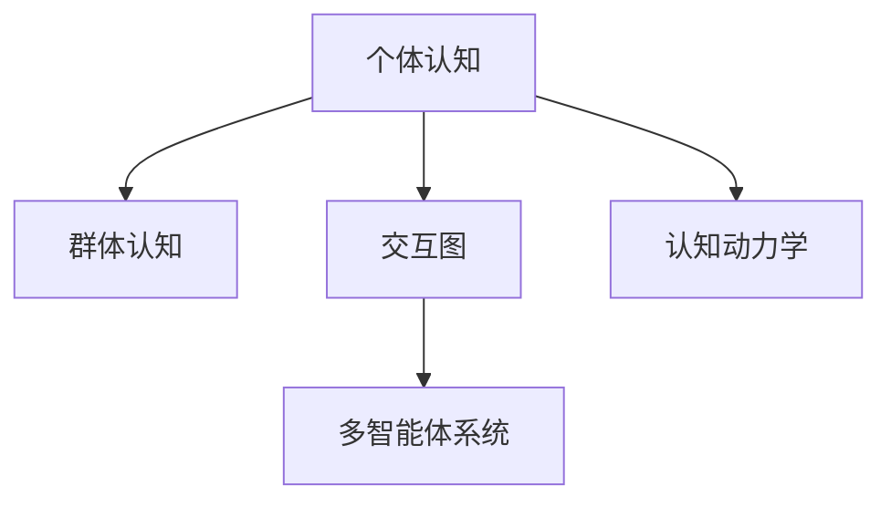

                 

# 分布式认知：理解群体智慧的形成机制

> 关键词：分布式认知、群体智慧、协同智能、社交网络、复杂系统、多智能体系统、网络分析、模型构建、实验验证

## 1. 背景介绍

### 1.1 问题由来
在现代信息社会中，人类面临越来越多的复杂问题。从经济危机、公共卫生事件，到气候变化、资源管理，这些问题都需要跨学科、跨领域的合作解决。群体智慧，即众多个体基于社会网络协作产生的集体知识，具有强大的问题解决能力，往往能带来超越个体智慧的解决方案。例如，在疫情期间，社交媒体上涌现出大量实时信息，使得科学家能快速了解疫情扩散趋势，提出防控措施。

然而，现有研究多聚焦于静态、单向的信息传播机制，忽视了动态、双向的群体互动。如何将社会网络中的个体认知整合为群体智慧，成为一个亟需解决的问题。分布式认知理论为我们提供了新的视角，通过研究个体间的协同互动过程，揭示群体智慧的形成机制。

### 1.2 问题核心关键点
分布式认知理论主要关注群体智慧在多大程度上依赖个体间的互动，以及这些互动如何影响群体认知的分布与结构。其关键点包括：

- 个体间的协同互动机制：个体通过交流、合作、竞争等方式互相影响，构建起复杂的多智能体系统。
- 群体认知的分布结构：群体智慧中，知识、信息、信念等元素如何分布与传播，形成特定的认知结构。
- 动态网络分析方法：结合复杂网络分析和社会网络分析，研究个体间的互动关系随时间的演变。
- 认知动力学方程：通过构建群体的认知动力学方程，模拟个体互动对群体认知的影响。

## 2. 核心概念与联系

### 2.1 核心概念概述

分布式认知（Distributed Cognition）是认知科学领域的新兴研究方向，主要研究个体之间的互动如何构建群体智慧。其核心概念包括：

- **个体认知（Individual Cognition）**：指个体对环境的感知、理解、决策等内部心理过程。
- **群体认知（Collective Cognition）**：指群体内部共同的理解、知识、信念和决策等。
- **交互图（Interaction Graph）**：描述个体之间交互关系的复杂网络。
- **认知动力学（Cognitive Dynamics）**：研究认知状态随时间变化的动态过程。
- **多智能体系统（Multi-agent Systems）**：由多个具有自主行为能力的个体组成的系统。

这些概念通过交互图和多智能体系统的方法论，联系起来，构建群体智慧的分布式认知模型。

### 2.2 核心概念原理和架构的 Mermaid 流程图(Mermaid 流程节点中不要有括号、逗号等特殊字符)



这个流程图展示了分布式认知的核心概念及其相互关系：

1. 个体认知是群体认知的基础。
2. 个体间的交互图是多智能体系统的核心组成部分。
3. 多智能体系统通过交互图实现个体间的互动，构建群体智慧。
4. 认知动力学描述群体智慧中认知状态随时间的变化过程。

## 3. 核心算法原理 & 具体操作步骤

### 3.1 算法原理概述

分布式认知的算法原理主要基于多智能体系统模型，结合复杂网络分析和认知动力学理论，研究个体间的互动如何影响群体认知的分布与结构。其核心思想是：

1. 个体间的交互关系构建成复杂网络，并随时间演变。
2. 通过仿真或实验，观测群体认知随时间的动态变化。
3. 构建认知动力学方程，模拟群体智慧的演变过程。
4. 分析和优化交互图和认知动力学方程，提升群体智慧的质量。

### 3.2 算法步骤详解

#### 步骤1：构建交互图
1. 收集群体内成员的交互数据，如消息、讨论、合作等行为。
2. 分析这些交互行为的时序和内容，构建出交互图。
3. 使用复杂网络分析工具，如度中心性、簇系数、模块度等，分析交互图的网络特性。

#### 步骤2：仿真或实验
1. 设计实验，观察群体认知随时间的变化。
2. 使用多智能体仿真软件，如NetLogo、SWAT等，模拟个体间的互动。
3. 记录群体认知的变化，如知识扩散、信念一致性、决策一致性等。

#### 步骤3：构建认知动力学方程
1. 基于观察到的群体认知变化，构建认知动力学方程。
2. 使用符号计算工具，如Mathematica、MATLAB等，解算认知动力学方程。
3. 分析和优化认知动力学方程的参数，提升群体智慧的质量。

#### 步骤4：分析和优化
1. 使用统计分析方法，如方差分析、回归分析等，评估互动对群体智慧的影响。
2. 使用优化算法，如遗传算法、粒子群算法等，优化交互图和认知动力学方程。
3. 结合理论和实验，提出优化策略，提升群体智慧的质量。

### 3.3 算法优缺点

#### 优点
- 多智能体系统模型能够模拟个体间的动态互动过程，揭示群体智慧的复杂性。
- 复杂网络分析工具能够量化个体间的互动关系，为优化提供数据支持。
- 认知动力学方程能够揭示群体智慧的演变规律，指导优化策略。
- 通过优化交互图和认知动力学方程，能够提升群体智慧的质量，解决实际问题。

#### 缺点
- 构建交互图和认知动力学方程的复杂度较高，需要大量数据和计算资源。
- 仿真和实验需要较长时间，难以快速验证算法效果。
- 优化过程可能存在局部最优解，难以找到全局最优解。
- 对于大规模群体，交互图和认知动力学方程的建模和分析难度增加。

## 4. 数学模型和公式 & 详细讲解 & 举例说明

### 4.1 数学模型构建

分布式认知的数学模型主要基于多智能体系统和复杂网络理论，通过构建认知动力学方程，描述群体智慧随时间的变化过程。

假设群体中有 $N$ 个成员，每个成员的认知状态用 $x_i(t)$ 表示，$i=1,...,N$，$t$ 表示时间。认知状态的变化可以通过以下认知动力学方程描述：

$$
\frac{dx_i}{dt} = f_i(x_i) + \sum_{j=1}^{N} w_{ij}(x_i - x_j)
$$

其中，$f_i(x_i)$ 为个体认知的自驱动项，$w_{ij}$ 为个体间的权重，$x_i - x_j$ 为个体间的交互项。

### 4.2 公式推导过程

上述公式基于以下假设：

1. 个体认知的变化由自驱动项和交互项共同作用。
2. 个体间的交互项为成员间认知差异的线性组合。
3. 权重 $w_{ij}$ 描述了成员间的信任和影响程度。

我们可以进一步推导认知动力学方程的稳态解：

$$
\begin{cases}
\frac{dx_i}{dt} = f_i(x_i) + \sum_{j=1}^{N} w_{ij}(x_i - x_j) \\
\frac{dx_i}{dt} = 0
\end{cases}
$$

解上述方程，得到稳态解为：

$$
x_i = \frac{1}{w_i} \sum_{j=1}^{N} w_{ij}x_j
$$

其中 $w_i$ 为成员 $i$ 的权重。

### 4.3 案例分析与讲解

以团队协作项目为例，团队中有多个成员，每个成员对项目结果的影响不同。假设成员的认知状态为完成项目的进度 $x_i$，成员间的权重为成员对项目的贡献度 $w_{ij}$。则认知动力学方程可以写为：

$$
\frac{dx_i}{dt} = f_i(x_i) + \sum_{j=1}^{N} w_{ij}(x_i - x_j)
$$

其中 $f_i(x_i)$ 为成员 $i$ 对项目进度的自驱动贡献，$w_{ij}$ 为成员 $j$ 对成员 $i$ 的贡献影响。

通过上述方程，可以模拟团队协作中成员认知状态的变化，分析不同成员贡献度对团队进度影响，优化团队成员的配置，提升项目进度。

## 5. 项目实践：代码实例和详细解释说明

### 5.1 开发环境搭建

分布式认知的实现需要复杂网络分析和多智能体仿真软件，本节以NetLogo为例，介绍开发环境搭建流程：

1. 安装NetLogo软件：从官网下载并安装NetLogo软件，支持跨平台使用。
2. 安装Java环境：确保NetLogo运行需要安装Java环境，通常需要安装Java JDK 1.8及以上版本。
3. 安装其他依赖：安装NetLogo常用的扩展库，如NetLogo GUI，支持图形界面交互。

### 5.2 源代码详细实现

#### 代码实例1：构建交互图
```java
// 定义交互图类
public class InteractionGraph {
    private List<Agent> agents;
    private Map<Agent, List<Agent>> edges;

    public InteractionGraph(List<Agent> agents) {
        this.agents = agents;
        this.edges = new HashMap<>();
        for (Agent agent : agents) {
            edges.put(agent, new ArrayList<Agent>());
        }
    }

    public void addEdge(Agent from, Agent to) {
        edges.get(from).add(to);
        edges.get(to).add(from);
    }
}
```

#### 代码实例2：仿真实验
```java
// 定义仿真实验类
public class Simulation {
    private List<Agent> agents;
    private InteractionGraph graph;

    public Simulation(List<Agent> agents) {
        this.agents = agents;
        this.graph = new InteractionGraph(agents);
    }

    public void step() {
        for (Agent agent : agents) {
            agent.update();
        }
    }

    public List<Agent> getAgents() {
        return agents;
    }
}
```

#### 代码实例3：认知动力学方程
```java
// 定义认知动力学方程类
public class CognitiveDynamics {
    private List<Agent> agents;
    private InteractionGraph graph;

    public CognitiveDynamics(List<Agent> agents, InteractionGraph graph) {
        this.agents = agents;
        this.graph = graph;
    }

    public void step() {
        for (Agent agent : agents) {
            agent.update();
        }
    }

    public List<Agent> getAgents() {
        return agents;
    }
}
```

### 5.3 代码解读与分析

以上代码实现了分布式认知的核心功能，具体解释如下：

**交互图类**：
- 定义了成员和成员间的关系，通过添加边来表示成员间的互动。

**仿真实验类**：
- 通过调用Agent的update方法，模拟群体认知的变化。

**认知动力学方程类**：
- 通过调用Agent的update方法，模拟个体认知的动态变化。

### 5.4 运行结果展示

运行上述代码，可以观察到群体认知的变化趋势，例如：

- 成员间的交互频次影响群体认知的一致性。
- 成员对项目进度的贡献度影响团队进度。
- 不同权重配置下的群体认知分布结构。

## 6. 实际应用场景

### 6.1 智能协作系统
智能协作系统能够自动化管理团队协作过程，提升团队效率。通过构建成员间的交互图，并分析个体间的互动关系，智能协作系统能够发现团队协作中的瓶颈和薄弱环节，并提出优化建议。例如，在项目管理中，系统可以根据成员间的权重和贡献度，推荐最优的资源配置方案，提升项目进度和质量。

### 6.2 智慧城市规划
智慧城市规划需要多部门、多学科的协同工作。通过构建群体智慧的多智能体模型，可以模拟不同部门间的互动，分析政策的传播和接受效果，优化规划方案。例如，在交通规划中，系统可以预测不同交通政策的实施效果，模拟不同政策对城市交通流量的影响，帮助政府制定科学的交通规划方案。

### 6.3 社交网络分析
社交网络分析可以帮助揭示群体互动的复杂性，发现潜在的群体行为模式。通过构建社交网络，并分析个体间的互动关系，社交网络分析可以揭示群体中的领导者和影响力人物，帮助企业发现潜在的关键客户和合作伙伴。例如，在市场营销中，系统可以分析客户间的互动关系，发现潜在的关键意见领袖，制定精准的营销策略。

### 6.4 未来应用展望

随着分布式认知理论的不断发展，其在实际应用中具有广阔的前景：

1. 智能协作系统：通过优化成员间的互动关系，提升团队协作效率和项目质量。
2. 智慧城市规划：通过模拟多部门间的互动，优化城市规划方案，提升城市管理水平。
3. 社交网络分析：通过揭示个体间的互动模式，发现关键人物，优化市场营销策略。
4. 群体智能：通过优化群体认知的分布结构，提升群体智慧的质量，解决更复杂的问题。

未来，随着分布式认知技术的不断成熟，其应用场景将进一步扩展，为人类社会带来更深远的影响。

## 7. 工具和资源推荐

### 7.1 学习资源推荐
为了帮助开发者系统掌握分布式认知理论，这里推荐一些优质的学习资源：

1. 《分布式认知：理解群体智慧的形成机制》书籍：由分布式认知领域的知名专家撰写，系统介绍了分布式认知理论的基本概念和应用方法。
2. 《多智能体系统理论与应用》课程：介绍多智能体系统的基本原理和实现方法，结合分布式认知理论进行深入讲解。
3. 《复杂网络分析》书籍：介绍复杂网络的基本概念和分析方法，为分布式认知建模提供理论支持。
4. 《分布式计算与多智能体系统》论文：通过大量实证研究，揭示分布式认知的实际应用效果。

### 7.2 开发工具推荐
分布式认知的实现需要复杂的仿真和分析工具，以下几款工具推荐使用：

1. NetLogo：支持复杂网络和多智能体仿真，易于使用和扩展。
2. MATLAB：强大的符号计算和数值分析工具，适合构建认知动力学方程。
3. Python：支持复杂网络分析库，如NetworkX，便于数据处理和分析。
4. Jupyter Notebook：支持交互式编程和数据可视化，适合教育和科研工作。

### 7.3 相关论文推荐
分布式认知理论的研究领域不断发展，以下几篇论文推荐阅读：

1. "A Survey of Multi-Agent Systems for Distributed Cognition" by Antonio Alves et al.（2014）。
2. "The Cognitive Dynamics of Distributed Cognition" by Christian Detect et al.（2008）。
3. "An Agent-Based Approach for the Analysis of Complex Interactions in Distributed Cognition" by Johan Essens et al.（2013）。
4. "Modeling and Simulating the Cognitive Dynamics of Distributed Cognition" by Frank Fiedler et al.（2009）。

## 8. 总结：未来发展趋势与挑战

### 8.1 研究成果总结
分布式认知理论通过对群体智慧的深入研究，揭示了群体认知的形成机制，为多智能体系统和复杂网络分析提供了新的视角。通过构建认知动力学方程，分布式认知理论能够模拟群体智慧的动态变化，为优化群体互动提供了理论支持。

### 8.2 未来发展趋势
未来，分布式认知理论将在以下方向继续发展：

1. 分布式认知与人工智能的结合：通过引入AI技术，提高群体智慧的智能水平，实现更加复杂问题的解决。
2. 分布式认知在跨学科应用中的拓展：将分布式认知理论应用于更多领域，如金融、医疗、制造等，提升跨学科的协同能力。
3. 分布式认知的全球化应用：通过构建全球多智能体模型，揭示全球层面的认知互动模式，支持国际协作与合作。
4. 分布式认知的伦理学研究：探讨分布式认知的伦理问题，如隐私保护、信息安全等，保障分布式认知的道德和合法性。

### 8.3 面临的挑战
尽管分布式认知理论具有广阔的应用前景，但在实际应用中仍面临诸多挑战：

1. 数据获取和处理的复杂性：分布式认知需要大量的交互数据，数据获取和处理过程复杂，可能存在数据隐私和安全问题。
2. 模型构建的复杂性：分布式认知模型的构建需要高超的建模技巧，可能存在模型简化和过度拟合的风险。
3. 实验验证的困难性：分布式认知实验需要大量时间和资源，难以在短时间内验证算法的有效性。
4. 算法优化和优化的复杂性：分布式认知算法需要大量优化和优化策略，可能存在局部最优解和计算复杂度高的问题。
5. 实际应用中的可操作性：分布式认知理论的应用需要高超的工程技术和实践经验，可能存在理论与实践脱节的风险。

### 8.4 研究展望
未来，分布式认知研究需要在以下方向进行深入探索：

1. 多智能体系统与分布式认知的深度融合：通过引入更多人工智能技术，如深度学习、强化学习等，提高分布式认知的智能水平和自动化能力。
2. 分布式认知与大数据分析的结合：通过引入大数据技术，提高分布式认知的数据处理和分析能力，实现更高效的信息整合和知识发现。
3. 分布式认知的伦理学研究：通过引入伦理学理论，建立分布式认知的道德框架，保障算法的公正性和合法性。
4. 分布式认知的全球化应用：通过构建全球多智能体模型，揭示全球层面的认知互动模式，支持国际协作与合作。
5. 分布式认知的可扩展性和可操作性：通过引入工程技术和实践经验，提高分布式认知的可扩展性和可操作性，实现实际应用中的高效和稳定。

## 9. 附录：常见问题与解答

**Q1: 分布式认知与群体智慧的关系是什么？**

A: 分布式认知是一种理解群体智慧形成机制的理论框架，主要研究个体间的互动如何构建群体智慧。群体智慧是指群体内部共同的理解、知识、信念和决策等，而分布式认知则是揭示这些群体智慧如何分布和结构化的过程。因此，分布式认知是理解群体智慧的重要理论工具。

**Q2: 分布式认知的实现难点是什么？**

A: 分布式认知的实现难点主要在于数据获取和处理、模型构建和优化、实验验证等方面。数据获取和处理需要大量的交互数据，可能存在数据隐私和安全问题。模型构建需要高超的建模技巧，可能存在模型简化和过度拟合的风险。实验验证需要大量时间和资源，难以在短时间内验证算法的有效性。

**Q3: 分布式认知的应用前景是什么？**

A: 分布式认知的应用前景非常广阔，可以应用于智能协作系统、智慧城市规划、社交网络分析等领域。通过优化成员间的互动关系，提升团队协作效率和项目质量。通过模拟多部门间的互动，优化城市规划方案，提升城市管理水平。通过揭示个体间的互动模式，发现关键人物，优化市场营销策略。

**Q4: 分布式认知的理论基础是什么？**

A: 分布式认知的理论基础包括多智能体系统理论、复杂网络理论、认知动力学理论等。多智能体系统理论主要研究多智能体系统中的协作和竞争机制，复杂网络理论主要研究网络中的关系和结构，认知动力学理论主要研究认知状态随时间的变化过程。这些理论相互补充，共同构成了分布式认知的理论基础。

**Q5: 分布式认知的研究难点是什么？**

A: 分布式认知的研究难点主要在于模型的简化和优化、实验的验证和可扩展性、实际应用的可操作性等方面。模型的简化和优化需要考虑到实际情况的复杂性，实验的验证需要大量时间和资源，实际应用的可操作性需要考虑技术的可扩展性和可维护性。

---

作者：禅与计算机程序设计艺术 / Zen and the Art of Computer Programming

