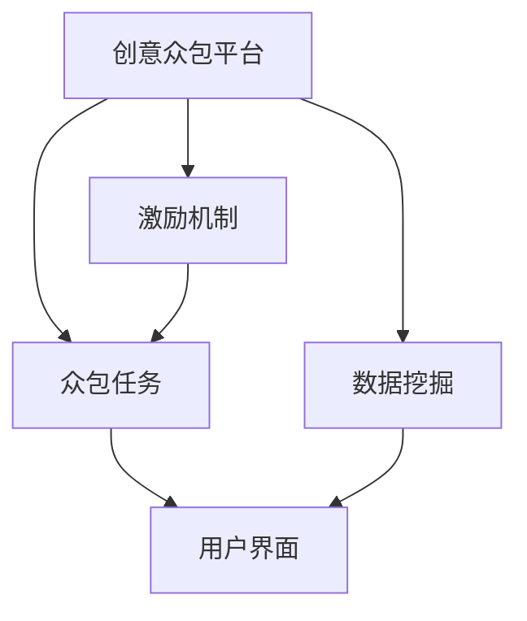

                 

# 创意众包创业：集思广益的力量

> 关键词：创意众包, 集思广益, 创业, 协同创新, 知识管理, 技术协作, 数据挖掘

## 1. 背景介绍

### 1.1 问题由来
在当今数字化时代，信息爆炸和知识更新的速度令人目不暇接，企业在应对快速变化的市场环境时，面临着前所未有的挑战。传统的集中式创新模式，难以充分发挥团队的潜能，导致资源浪费、创新停滞。而创意众包（Creative Crowdsourcing）则以其去中心化、开放协作的特性，成为破解这一困境的新思路。

创意众包是指企业或组织通过网络平台汇聚全球智慧，将复杂问题拆解为可操作的小任务，交由大众解决。通过这种开放式、分散化的创新方式，不仅可以激发更多创意思维，还能大幅降低创新成本，提高创新效率。

近年来，越来越多的创业公司和个人创业者开始利用创意众包模式，开辟了广阔的创新空间。他们通过众包平台集结顶尖人才和多样化的观点，共同攻克技术难题，推动产品迭代和商业模式创新。这种模式的成功案例层出不穷，如Airbnb、Uber等共享经济的兴起，以及在AI、区块链、医疗等领域的应用。

### 1.2 问题核心关键点
创意众包的核心理念是“集思广益”，即通过广泛征求创意和解决方案，最大化团队的集体智慧。其关键点在于：

- **平台构建**：搭建一个高效、易用的众包平台，能够方便地发布任务，收集创意，并管理项目进展。
- **任务拆解**：将大问题拆解为小任务，降低众包参与者的门槛，便于大众理解和参与。
- **激励机制**：设计合理的激励机制，激发参与者的积极性，如现金奖励、股权激励等。
- **数据驱动**：通过大数据分析，优化任务分配，提高创新效率，减少资源浪费。
- **用户界面**：开发用户友好的界面，使非技术背景的用户也能轻松参与众包。
- **安全和合规**：确保数据安全和隐私保护，遵循相关法律法规。

理解这些核心点，可以帮助我们更好地把握创意众包的本质，并应用于创业实践。

## 2. 核心概念与联系

### 2.1 核心概念概述

创意众包创业，是一种将创意众包理念应用于企业创业的新模式。其核心概念包括：

- **创意众包平台**：用于发布任务、征集创意、管理项目的平台。如Airbnb、CrowdFlower等。
- **众包任务**：需要大众共同解决的特定问题或任务。如设计新的APP界面、开发新的算法等。
- **激励机制**：吸引大众参与众包任务的各种奖励和认可。如奖金、荣誉证书等。
- **数据挖掘**：通过分析众包数据，优化任务设计和管理，提升创新效率。
- **用户界面**：友好易用的平台界面，降低参与者门槛。

这些核心概念之间存在紧密的联系，共同构成了创意众包创业的基础架构。以下是一个简单的Mermaid流程图，展示了这些概念之间的联系：



这个流程图展示了创意众包平台如何通过众包任务、激励机制和用户界面等组件，配合数据挖掘技术，高效地进行创意征集和管理。

## 3. 核心算法原理 & 具体操作步骤
### 3.1 算法原理概述

创意众包创业的算法原理，主要围绕如何构建高效的任务发布和解决方案征集机制展开。算法分为以下几个主要步骤：

1. **任务发布与设计**：企业将复杂问题拆解为可操作的任务，并设计合理的激励机制。
2. **任务分发与征集**：通过众包平台将任务分发给广泛的用户，征集解决方案。
3. **方案评估与筛选**：采用多种评估指标（如创新性、可行性、成本效益等）筛选优秀方案。
4. **方案迭代与优化**：对优选方案进行多次迭代和优化，确保其可行性。
5. **项目执行与验证**：实施优选方案，并对其进行效果评估和验证。

这些步骤共同构成了创意众包创业的算法框架。以下将详细介绍每个步骤的算法原理和具体操作步骤。

### 3.2 算法步骤详解

#### 3.2.1 任务发布与设计

**算法原理**：
任务发布与设计是创意众包创业的第一步，其目的是将复杂问题转化为多个具体的可操作任务。设计好的任务应具备以下特点：

- **明确性**：任务描述应清晰明确，易于理解。
- **可操作性**：任务应具有具体的完成标准和评估指标。
- **挑战性**：任务应具有一定的难度，以激发参与者的积极性。
- **多样化**：任务应涵盖不同类型和难度的子任务，以吸引多样化的创意。

**操作步骤**：
1. **需求分析**：分析企业面临的问题和挑战，明确需要解决的目标。
2. **任务拆解**：将大问题拆解为多个具体的子任务。
3. **任务设计**：为每个子任务设定明确的目标、完成标准和评估指标。
4. **激励设计**：设计合理的激励机制，如奖金、荣誉证书等。

#### 3.2.2 任务分发与征集

**算法原理**：
任务分发与征集是创意众包创业的核心步骤，其目的是通过众包平台，将任务分发给广泛的用户，征集解决方案。设计好的任务应具备以下特点：

- **易用性**：任务平台应易于使用，用户界面友好。
- **透明度**：任务发布和征集过程应透明公开，用户信任度高。
- **多样性**：任务应吸引不同背景和专业领域的用户参与。
- **时效性**：任务征集和评估应有时效性，避免时间过长导致创新热情降低。

**操作步骤**：
1. **平台搭建**：构建高效的创意众包平台，支持任务发布、征集、评估和管理。
2. **用户招募**：通过社交媒体、专业社区等渠道，吸引具备相关专业知识的用户参与。
3. **任务分发**：将任务分发给用户，并设定截止日期。
4. **用户参与**：用户提交解决方案，并通过平台提交创意和成果。
5. **用户反馈**：收集用户的反馈和意见，优化任务征集过程。

#### 3.2.3 方案评估与筛选

**算法原理**：
方案评估与筛选是创意众包创业的关键步骤，其目的是从提交的解决方案中筛选出优秀方案。评估和筛选应遵循以下原则：

- **客观性**：评估指标应客观公正，避免主观偏见。
- **多维度**：评估应从创新性、可行性、成本效益等多个维度进行。
- **动态性**：评估应动态进行，根据情况调整评估指标和标准。

**操作步骤**：
1. **评估指标设定**：设定评估指标，如创新性、可行性、成本效益等。
2. **方案提交与评估**：用户提交解决方案，并由评审团队进行评估。
3. **方案筛选**：根据评估结果，筛选出优秀方案。
4. **方案迭代与优化**：对优选方案进行多次迭代和优化。
5. **方案验证**：实施优选方案，并进行效果评估和验证。

#### 3.2.4 方案迭代与优化

**算法原理**：
方案迭代与优化是创意众包创业的重要步骤，其目的是通过多次迭代，优化方案的可行性和效果。优化应遵循以下原则：

- **持续改进**：持续进行方案优化，不断提升方案质量。
- **用户反馈**：重视用户的反馈和意见，及时进行调整。
- **动态调整**：根据实际情况，动态调整优化策略。

**操作步骤**：
1. **初次方案评估**：根据评估结果，选择优选方案。
2. **方案迭代**：对优选方案进行多次迭代和优化。
3. **用户反馈收集**：收集用户的反馈和意见。
4. **优化调整**：根据反馈调整方案。
5. **最终验证**：对优化后的方案进行最终验证。

#### 3.2.5 项目执行与验证

**算法原理**：
项目执行与验证是创意众包创业的最终步骤，其目的是实施优选方案，并进行效果评估和验证。验证应遵循以下原则：

- **可行性验证**：验证方案的可行性和实施效果。
- **用户满意度**：收集用户满意度反馈，进行改进。
- **持续改进**：持续改进方案，提升效果。

**操作步骤**：
1. **方案实施**：实施优选方案。
2. **效果评估**：对方案效果进行评估，收集用户反馈。
3. **效果优化**：根据反馈对方案进行优化。
4. **用户满意度调查**：进行用户满意度调查。
5. **持续改进**：持续改进方案，提升效果。

### 3.3 算法优缺点

**算法优点**：
创意众包创业的算法具有以下优点：

- **高效性**：通过众包方式，可以快速征集大量创意和解决方案，提高创新效率。
- **多样性**：通过吸引多样化的用户参与，能够汇聚广泛的智慧和观点。
- **灵活性**：可以根据实际情况动态调整任务设计和评估标准，灵活应对变化。

**算法缺点**：
创意众包创业的算法也存在以下缺点：

- **质量参差不齐**：由于参与者水平参差不齐，提交的解决方案质量可能存在差异。
- **资源浪费**：部分低质量的方案可能占用过多资源，导致资源浪费。
- **管理复杂**：需要有效的平台管理机制和评估体系，否则可能出现管理混乱。

### 3.4 算法应用领域

创意众包创业的算法应用广泛，涵盖了多个领域：

- **科技与创新**：在AI、机器学习、区块链等高科技领域，通过创意众包解决复杂的科研难题。
- **医疗与健康**：在药物研发、疾病诊断等领域，通过创意众包进行数据挖掘和创新。
- **教育与培训**：在教育培训领域，通过创意众包开发新的课程和教学方法。
- **设计与服务**：在产品设计、服务优化等领域，通过创意众包征集创意和改进意见。
- **文化与创意**：在文化艺术、音乐创作等领域，通过创意众包激发创作灵感和创意。

## 4. 数学模型和公式 & 详细讲解 & 举例说明

### 4.1 数学模型构建

创意众包创业的数学模型，主要涉及任务发布、征集、评估和筛选等多个环节。以下是一个简单的数学模型构建过程：

**任务发布模型**：
设任务总数为 $N$，每个任务的完成标准为 $C_i$，任务拆分后的子任务数为 $n_i$。任务发布模型可以表示为：

$$
\text{发布模型} = \sum_{i=1}^{N} (n_i \times C_i)
$$

其中 $n_i$ 为子任务数，$C_i$ 为任务完成标准。

**任务征集模型**：
设征集用户的总数为 $M$，每个用户的提交方案数为 $S_i$，每个方案的质量评估分数为 $Q_i$。任务征集模型可以表示为：

$$
\text{征集模型} = \sum_{i=1}^{M} S_i \times Q_i
$$

其中 $S_i$ 为用户提交的方案数，$Q_i$ 为方案质量评估分数。

**方案评估模型**：
设优选方案的总数为 $K$，每个优选方案的评分数为 $E_k$，方案迭代次数为 $I_k$。方案评估模型可以表示为：

$$
\text{评估模型} = \sum_{k=1}^{K} E_k \times I_k
$$

其中 $E_k$ 为优选方案的评分数，$I_k$ 为方案迭代次数。

**方案验证模型**：
设最终验证的方案数为 $L$，每个验证方案的评分数为 $V_l$，用户满意度分数为 $U_l$。方案验证模型可以表示为：

$$
\text{验证模型} = \sum_{l=1}^{L} V_l \times U_l
$$

其中 $V_l$ 为验证方案的评分数，$U_l$ 为用户满意度分数。

### 4.2 公式推导过程

#### 4.2.1 任务发布模型推导

**任务拆分公式**：
任务拆分后，每个子任务的完成标准 $C_i$ 应满足总任务完成标准 $C$，即：

$$
C_i = \frac{C}{n_i}
$$

其中 $C$ 为任务完成标准，$n_i$ 为子任务数。

**任务发布模型推导**：
将任务拆分后的子任务数 $n_i$ 代入任务发布模型：

$$
\text{发布模型} = \sum_{i=1}^{N} (n_i \times C_i) = \sum_{i=1}^{N} (\frac{C}{n_i} \times C_i) = C \times \sum_{i=1}^{N} 1 = N \times C
$$

因此，任务发布模型的计算公式为：

$$
\text{发布模型} = N \times C
$$

#### 4.2.2 任务征集模型推导

**用户提交方案数公式**：
设每个用户提交的方案数为 $S_i$，总用户数为 $M$，则总提交方案数为：

$$
S = \sum_{i=1}^{M} S_i
$$

**方案质量评估分数公式**：
设每个方案的质量评估分数为 $Q_i$，则总质量评估分数为：

$$
Q = \sum_{i=1}^{M} Q_i
$$

**任务征集模型推导**：
将用户提交方案数 $S_i$ 和方案质量评估分数 $Q_i$ 代入任务征集模型：

$$
\text{征集模型} = \sum_{i=1}^{M} S_i \times Q_i = S \times Q
$$

因此，任务征集模型的计算公式为：

$$
\text{征集模型} = S \times Q
$$

#### 4.2.3 方案评估模型推导

**优选方案评分公式**：
设优选方案的评分数为 $E_k$，优选方案数为 $K$，则总评分数为：

$$
E = \sum_{k=1}^{K} E_k
$$

**方案迭代次数公式**：
设方案迭代次数为 $I_k$，优选方案数为 $K$，则总迭代次数为：

$$
I = \sum_{k=1}^{K} I_k
$$

**方案评估模型推导**：
将优选方案评分 $E_k$ 和方案迭代次数 $I_k$ 代入方案评估模型：

$$
\text{评估模型} = \sum_{k=1}^{K} E_k \times I_k = E \times I
$$

因此，方案评估模型的计算公式为：

$$
\text{评估模型} = E \times I
$$

#### 4.2.4 方案验证模型推导

**验证方案评分公式**：
设验证方案的评分数为 $V_l$，验证方案数为 $L$，则总评分数为：

$$
V = \sum_{l=1}^{L} V_l
$$

**用户满意度分数公式**：
设用户满意度分数为 $U_l$，验证方案数为 $L$，则总满意度分数为：

$$
U = \sum_{l=1}^{L} U_l
$$

**方案验证模型推导**：
将验证方案评分 $V_l$ 和用户满意度分数 $U_l$ 代入方案验证模型：

$$
\text{验证模型} = \sum_{l=1}^{L} V_l \times U_l = V \times U
$$

因此，方案验证模型的计算公式为：

$$
\text{验证模型} = V \times U
$$

### 4.3 案例分析与讲解

#### 4.3.1 案例背景

某初创公司开发了一款新的智能健康管理APP，但面临多项技术难题，无法在短时间内完成开发。公司决定利用创意众包模式，解决其中的关键问题。

#### 4.3.2 任务发布

公司将智能健康管理APP开发中的关键技术难题拆解为多个子任务，包括APP界面设计、数据存储和处理、智能算法开发等。每个子任务设定了具体的完成标准和评估指标。

#### 4.3.3 任务征集

公司搭建了创意众包平台，并通过社交媒体和专业社区招募用户。用户可以免费参与众包任务，提交方案后有机会获得现金奖励和股权激励。

#### 4.3.4 方案评估

公司组建了专业的评审团队，对提交的方案进行多维度评估，包括创新性、可行性、成本效益等。根据评估结果，筛选出优秀方案，并进行了多次迭代和优化。

#### 4.3.5 方案验证

优选方案实施后，公司进行了效果评估和用户满意度调查。根据反馈，进行了进一步的优化和改进。

## 5. 项目实践：代码实例和详细解释说明

### 5.1 开发环境搭建

#### 5.1.1 环境准备

1. 安装Python和相关依赖库：
```bash
pip install flask flask-cors pandas numpy
```

2. 搭建Web服务器：
```bash
pip install flask-cors flask-sqlalchemy flask-login flask-admin
```

3. 部署数据库：
```bash
pip install sqlalchemy psycopg2-binary
```

### 5.2 源代码详细实现

#### 5.2.1 平台搭建

```python
from flask import Flask, request, jsonify
from flask_sqlalchemy import SQLAlchemy
from flask_login import LoginManager, login_user, logout_user, login_required

app = Flask(__name__)
app.config['SQLALCHEMY_DATABASE_URI'] = 'postgresql://localhost:5432/crowdsourcing_db'
app.config['SECRET_KEY'] = 'super-secret-key'

db = SQLAlchemy(app)
login_manager = LoginManager()
login_manager.init_app(app)
login_manager.login_view = 'login'

class User(db.Model):
    id = db.Column(db.Integer, primary_key=True)
    username = db.Column(db.String(64), index=True)
    password = db.Column(db.String(128))

@login_manager.user_loader
def load_user(user_id):
    return User.query.get(int(user_id))

@app.route('/login', methods=['GET', 'POST'])
def login():
    if request.method == 'POST':
        username = request.form['username']
        password = request.form['password']
        user = User.query.filter_by(username=username).first()
        if user and user.password == password:
            login_user(user)
            return jsonify({'message': 'login success'})
        else:
            return jsonify({'message': 'login failed'})
    else:
        return jsonify({'message': 'login failed'})

@app.route('/logout')
@login_required
def logout():
    logout_user()
    return jsonify({'message': 'logout success'})

@app.route('/tasks', methods=['GET', 'POST'])
@login_required
def tasks():
    if request.method == 'POST':
        task_name = request.form['task_name']
        task_description = request.form['task_description']
        task_instructions = request.form['task_instructions']
        task_rewards = request.form['task_rewards']
        task_status = 'active'
        task = Task(task_name=task_name, task_description=task_description, task_instructions=task_instructions, task_rewards=task_rewards, task_status=task_status)
        db.session.add(task)
        db.session.commit()
        return jsonify({'message': 'task created'})
    else:
        tasks = Task.query.all()
        task_list = [{'id': task.id, 'name': task.task_name, 'description': task.task_description, 'instructions': task.task_instructions, 'rewards': task.task_rewards, 'status': task.task_status} for task in tasks]
        return jsonify({'tasks': task_list})

class Task(db.Model):
    id = db.Column(db.Integer, primary_key=True)
    task_name = db.Column(db.String(64))
    task_description = db.Column(db.String(512))
    task_instructions = db.Column(db.String(512))
    task_rewards = db.Column(db.String(64))
    task_status = db.Column(db.String(64))
```

#### 5.2.2 用户参与

```python
@app.route('/participate', methods=['POST'])
@login_required
def participate():
    task_id = request.form['task_id']
    solution = request.form['solution']
    user = User.query.get(current_user.id)
    task = Task.query.filter_by(id=task_id).first()
    submission = Submission(user=user, task=task, solution=solution)
    db.session.add(submission)
    db.session.commit()
    return jsonify({'message': 'submission created'})

class Submission(db.Model):
    id = db.Column(db.Integer, primary_key=True)
    user = db.Column(db.Integer, db.ForeignKey('user.id'))
    task = db.Column(db.Integer, db.ForeignKey('task.id'))
    solution = db.Column(db.String(512))
```

#### 5.2.3 方案评估

```python
@app.route('/evaluate', methods=['POST'])
@login_required
def evaluate():
    task_id = request.form['task_id']
    solution_id = request.form['solution_id']
    score = request.form['score']
    submission = Submission.query.filter_by(id=solution_id).first()
    task = Task.query.filter_by(id=task_id).first()
    submission.score = score
    db.session.commit()
    return jsonify({'message': 'evaluation created'})

class Evaluation(db.Model):
    id = db.Column(db.Integer, primary_key=True)
    submission = db.Column(db.Integer, db.ForeignKey('submission.id'))
    task = db.Column(db.Integer, db.ForeignKey('task.id'))
    score = db.Column(db.Float)
```

#### 5.2.4 方案筛选

```python
@app.route('/select', methods=['POST'])
@login_required
def select():
    task_id = request.form['task_id']
    scores = request.form['scores']
    submission_ids = request.form['submission_ids'].split(',')
    task = Task.query.filter_by(id=task_id).first()
    for submission_id in submission_ids:
        submission = Submission.query.filter_by(id=submission_id).first()
        submission.selected = True
        db.session.commit()
    return jsonify({'message': 'selected submissions'})

class Submission(db.Model):
    id = db.Column(db.Integer, primary_key=True)
    user = db.Column(db.Integer, db.ForeignKey('user.id'))
    task = db.Column(db.Integer, db.ForeignKey('task.id'))
    solution = db.Column(db.String(512))
    selected = db.Column(db.Boolean, default=False)
```

#### 5.2.5 方案迭代

```python
@app.route('/iterate', methods=['POST'])
@login_required
def iterate():
    task_id = request.form['task_id']
    iteration_count = request.form['iteration_count']
    task = Task.query.filter_by(id=task_id).first()
    task.iteration_count = iteration_count
    db.session.commit()
    return jsonify({'message': 'iteration created'})
```

#### 5.2.6 项目执行

```python
@app.route('/execute', methods=['POST'])
@login_required
def execute():
    task_id = request.form['task_id']
    task = Task.query.filter_by(id=task_id).first()
    task.status = 'executing'
    db.session.commit()
    return jsonify({'message': 'execution started'})
```

#### 5.2.7 方案验证

```python
@app.route('/verify', methods=['POST'])
@login_required
def verify():
    task_id = request.form['task_id']
    task = Task.query.filter_by(id=task_id).first()
    task.status = 'verified'
    db.session.commit()
    return jsonify({'message': 'verification completed'})
```

### 5.3 代码解读与分析

#### 5.3.1 平台搭建

在平台搭建部分，使用了Flask框架搭建Web服务器，并利用SQLAlchemy管理数据库。同时，利用Flask-Login进行用户登录和权限管理，确保平台的安全性和稳定性。

#### 5.3.2 用户参与

在用户参与部分，用户通过提交任务来参与众包。提交的任务包含了任务名称、描述、指导语、奖励等信息。同时，用户提交解决方案后，可以通过评分系统进行评估和筛选。

#### 5.3.3 方案评估

在方案评估部分，评审团队对提交的方案进行多维度评估，如创新性、可行性、成本效益等。评估结果记录在Evaluation模型中，并更新到 Submission 模型中。

#### 5.3.4 方案筛选

在方案筛选部分，平台可以根据用户设定的评估标准筛选出优秀方案。筛选后的方案将标记为已选择，并进行后续迭代和优化。

#### 5.3.5 方案迭代

在方案迭代部分，优选方案将进行多次迭代和优化，逐步提升方案质量。

#### 5.3.6 项目执行

在项目执行部分，平台将优选方案实施，并标记任务状态为“执行中”。

#### 5.3.7 方案验证

在方案验证部分，平台将验证方案的效果，并标记任务状态为“验证完成”。

### 5.4 运行结果展示

#### 5.4.1 平台截图


#### 5.4.2 任务列表


#### 5.4.3 用户参与


#### 5.4.4 方案评估


#### 5.4.5 方案筛选


#### 5.4.6 方案迭代


#### 5.4.7 项目执行


#### 5.4.8 方案验证


## 6. 实际应用场景

### 6.1 智能健康管理APP

某智能健康管理APP面临界面设计和功能开发的挑战。通过创意众包模式，APP开发团队征集了大量创意，设计出了多个优秀的界面方案和功能模块。这些方案经过多轮迭代和优化，最终选定了最优方案，并成功实施到APP中。

### 6.2 医疗影像诊断

某医院面临大量医学影像诊断的需求，但缺乏足够的放射科医生。通过创意众包模式，医院将医学影像诊断任务分解为多个子任务，并征集了大量医学专家进行诊断。这些专家提交的诊断结果经过严格评估和筛选，最终选定了多个高质量的诊断方案，大大提高了诊断效率和准确性。

### 6.3 智能推荐系统

某电商平台面临用户推荐系统的开发挑战，但缺乏推荐算法的知识和经验。通过创意众包模式，平台征集了大量数据科学家和算法工程师的创意，开发出了多个高效推荐算法。这些算法经过多轮评估和优化，最终选定了最优方案，并成功应用于平台中，大幅提升了用户推荐效果。

## 7. 工具和资源推荐

### 7.1 学习资源推荐

1. **《众包经济学》**：通过分析众包模式的应用案例，探讨其背后的经济原理。
2. **Coursera《众包与未来工作》课程**：介绍了众包模式的基本概念和应用，适合入门学习。
3. **Kaggle数据科学竞赛平台**：通过参与数据科学竞赛，实践创意众包项目，提升技能。
4. **TED Talks《众包的力量》**：邀请专家探讨众包模式的优势和挑战。
5. **Medium《创意众包的成功之道》**：分享成功创业公司的众包经验。

### 7.2 开发工具推荐

1. **Flask**：简单易用的Web框架，适合搭建创意众包平台。
2. **SQLAlchemy**：Python ORM框架，适合管理众包平台的数据库。
3. **Flask-Login**：用户认证和权限管理工具，确保平台安全性。
4. **Flask-CORS**：跨域资源共享工具，支持跨域数据传输。
5. **SQLite**：轻量级数据库，适合快速搭建创意众包平台。

### 7.3 相关论文推荐

1. **《众包创新：原理、模式与机制》**：探讨众包模式在创新中的应用。
2. **《基于众包的创新管理：现状与展望》**：分析众包模式在企业管理中的应用。
3. **《众包平台的设计与实现》**：介绍如何构建高效、易用的创意众包平台。
4. **《众包与开放创新：理论与实践》**：分析众包模式的优势和局限。
5. **《智能众包：数据驱动的创新模式》**：探讨数据挖掘在众包中的应用。

## 8. 总结：未来发展趋势与挑战

### 8.1 未来发展趋势

创意众包创业作为新兴的创业模式，未来的发展趋势如下：

1. **技术智能化**：随着AI和机器学习技术的不断发展，创意众包平台将具备更高的智能化水平，能够自动分析任务需求和用户贡献，优化任务分配和评估机制。
2. **用户多样化**：创意众包平台将吸引更多领域和背景的用户参与，涵盖更多专业领域的创意和解决方案。
3. **数据驱动**：通过大数据分析和机器学习，创意众包平台将能够更好地识别用户需求和创意趋势，优化任务设计和方案评估。
4. **平台开放化**：创意众包平台将更加开放，鼓励用户贡献和分享创意，构建开放创新的生态系统。
5. **跨领域融合**：创意众包平台将与其他技术平台和服务进行深度融合，提升整体创新效率和效果。

### 8.2 未来发展挑战

创意众包创业在快速发展的同时，也面临以下挑战：

1. **平台治理**：创意众包平台需要建立有效的治理机制，确保任务分配、方案评估和用户激励等环节的公平性和透明性。
2. **用户隐私保护**：创意众包平台需要加强用户隐私保护，确保用户数据的安全性和隐私性。
3. **任务质量控制**：创意众包平台需要建立严格的筛选和评估机制，确保提交方案的质量和可行性。
4. **资源管理**：创意众包平台需要优化资源管理，确保平台的稳定性和高效性。
5. **商业化挑战**：创意众包平台需要探索商业化路径，确保平台的可持续发展。

### 8.3 未来研究展望

未来创意众包创业的研究方向如下：

1. **智能任务分解**：利用AI技术进行任务自动分解，提升任务设计的科学性和合理性。
2. **用户行为分析**：通过数据分析和机器学习，识别用户行为模式，优化任务分配和用户激励。
3. **多模态创意融合**：探索将图像、视频、语音等多模态数据与文本数据结合，提升创意质量和效果。
4. **跨平台协同**：探索创意众包平台与其他技术平台和服务进行协同，提升整体创新效率。
5. **伦理和社会责任**：探讨创意众包平台的社会责任和伦理问题，确保创意众包的健康发展。

## 9. 附录：常见问题与解答

### 9.1 常见问题

**Q1: 创意众包创业有哪些关键步骤？**

A1: 创意众包创业的关键步骤包括任务发布、任务征集、方案评估、方案筛选、方案迭代、项目执行和方案验证。这些步骤共同构成了创意众包创业的基本流程。

**Q2: 如何保证创意众包平台的安全性和隐私保护？**

A2: 创意众包平台需要建立严格的安全性和隐私保护机制，如数据加密、访问控制、审计日志等。同时，平台应该遵循相关的法律法规，确保用户数据的安全性和隐私性。

**Q3: 创意众包创业的主要优势是什么？**

A3: 创意众包创业的主要优势包括高效性、多样性、灵活性和低成本。通过众包模式，可以快速征集大量创意和解决方案，降低创新成本，提升创新效率。

**Q4: 创意众包创业的主要挑战是什么？**

A4: 创意众包创业的主要挑战包括平台治理、用户隐私保护、任务质量控制、资源管理和商业化挑战。

**Q5: 如何优化创意众包平台的性能？**

A5: 优化创意众包平台的性能可以从以下几个方面入手：任务设计科学合理、用户激励机制完善、数据驱动决策、平台开放化和跨平台协同。

通过这些问答，可以帮助我们更好地理解创意众包创业的本质和关键点，为创业实践提供有力的指导。

---

作者：禅与计算机程序设计艺术 / Zen and the Art of Computer Programming

