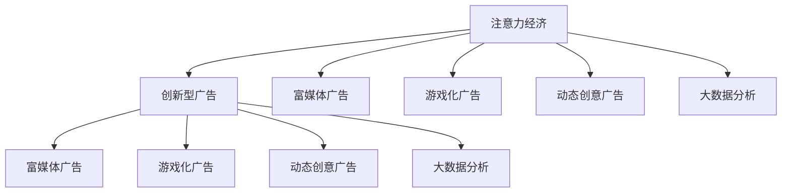

                 

# 创新型广告模式在注意力经济中的兴起

在互联网技术的推动下，注意力经济蓬勃发展，用户注意力资源日益成为企业争抢的核心资源。传统广告模式因其单一的线性传播方式和较低的用户参与度，逐渐走向瓶颈。因此，如何通过创新型广告模式更有效地吸引用户注意力，成为企业关注的焦点。本文从注意力经济的视角，深入分析了创新型广告模式的特点、原理及其应用，为广告从业者提供了新的思路和工具。

## 1. 背景介绍

### 1.1 问题由来
随着互联网和移动设备的发展，注意力经济逐渐成为一种重要的经济模式。在这种模式下，用户注意力成为了一种稀缺资源，企业需要花费大量成本来争夺。传统的广告模式主要通过单向的媒体曝光，线性传播信息，这种方式在用户注意力稀缺的时代已经显示出局限性。一方面，用户需要面对海量的广告信息，疲于应对；另一方面，广告主无法准确把握用户的注意力集中点，导致广告效果大打折扣。因此，创新型广告模式应运而生，以提升用户参与度和广告效果。

### 1.2 问题核心关键点
创新型广告模式的核心在于通过创新技术和算法，打破传统广告的线性传播方式，构建起更加精准、互动的传播生态。其关键点包括：
- 精准用户定向：能够根据用户的行为、兴趣、心理等多维度信息，精准定位目标用户群体。
- 互动式广告内容：通过互动技术，如富媒体、游戏化等，提升用户参与度和兴趣。
- 动态创意广告：利用AI技术，根据用户行为实时生成个性化广告内容，实现广告创意的动态优化。
- 大数据分析：通过大数据技术，分析用户注意力分布、广告效果等信息，不断优化广告策略。

## 2. 核心概念与联系

### 2.1 核心概念概述

为了更好地理解创新型广告模式，本节将介绍几个密切相关的核心概念：

- 注意力经济(Attention Economy)：指在信息爆炸的时代，用户注意力成为稀缺资源，通过吸引和利用用户注意力，实现商业价值的一种经济模式。

- 创新型广告(Advert innovation)：指通过使用新技术、新算法和新创意，提升广告传播效果和用户参与度的一种广告形式。

- 富媒体广告(Rich Media Advertising)：通过富媒体技术，如视频、交互式广告、虚拟现实等，丰富广告的表现形式，提升用户的参与度和广告效果。

- 游戏化广告(Gamified Advertising)：通过引入游戏化元素，如奖励机制、竞赛等，增加广告的趣味性和互动性，提升用户参与度。

- 动态创意广告(Programmatic Advertising)：通过AI算法，根据用户行为动态生成个性化广告内容，实现广告创意的动态优化。

- 大数据分析(Big Data Analytics)：通过大数据技术，收集和分析用户行为数据，发现用户注意力分布和广告效果，指导广告策略的制定。

这些核心概念之间的逻辑关系可以通过以下Mermaid流程图来展示：



这个流程图展示了大语言模型的核心概念及其之间的关系：

1. 注意力经济通过吸引和利用用户注意力实现商业价值。
2. 创新型广告通过技术和算法的创新，提升广告传播效果和用户参与度。
3. 富媒体广告、游戏化广告、动态创意广告和大数据分析是创新型广告的几种主要形式。
4. 这些形式通过互动技术、AI算法和大数据技术，提升广告的精准性、趣味性和动态性。

这些概念共同构成了广告行业的新趋势，推动广告从传统的单向传播向互动、精准、动态的方向发展。

## 3. 核心算法原理 & 具体操作步骤
### 3.1 算法原理概述

创新型广告模式通常基于以下算法原理：

1. 用户行为分析：通过收集用户的行为数据，如浏览历史、点击记录、搜索关键词等，利用机器学习算法，对用户进行精准定向。

2. 互动技术应用：通过富媒体、游戏化等技术，构建互动广告形式，提升用户参与度和兴趣。

3. AI动态创意生成：利用深度学习模型，如神经网络、生成对抗网络等，根据用户行为动态生成个性化广告内容，实现广告创意的动态优化。

4. 大数据分析：通过收集和分析用户行为数据、广告投放数据等，利用统计学和机器学习算法，发现用户注意力分布和广告效果，指导广告策略的制定。

### 3.2 算法步骤详解

创新型广告模式一般包括以下几个关键步骤：

**Step 1: 数据收集与预处理**
- 收集用户行为数据，包括浏览记录、点击记录、搜索关键词等。
- 清洗和处理数据，去除噪音和异常值，确保数据质量。

**Step 2: 用户行为分析**
- 使用机器学习算法，如聚类、分类、回归等，分析用户行为特征。
- 建立用户画像，描述用户的兴趣、偏好、行为习惯等。
- 通过相似度计算，找到与目标用户最接近的用户群体。

**Step 3: 广告内容设计**
- 设计互动广告形式，如视频广告、交互式广告、虚拟现实等。
- 使用AI技术，如自然语言处理、图像生成、声音合成等，生成个性化广告内容。
- 对广告内容进行优化，提升创意质量。

**Step 4: 广告投放与测试**
- 利用广告投放平台，如Google Ads、Facebook Ads等，进行广告投放。
- 设置投放参数，如广告预算、投放时间、用户定向等。
- 实时监控广告效果，收集反馈数据。

**Step 5: 效果分析与优化**
- 分析广告效果，如点击率、转化率、用户参与度等指标。
- 根据分析结果，调整广告策略和创意。
- 不断迭代优化，提升广告效果。

### 3.3 算法优缺点

创新型广告模式具有以下优点：
1. 精准用户定向：通过用户行为分析，实现精准的用户定向，提升广告投放的精准度。
2. 提升用户参与度：利用富媒体、游戏化等互动技术，增强用户参与度和兴趣。
3. 动态创意优化：通过AI技术，根据用户行为动态生成个性化广告内容，提升广告创意质量。
4. 效果优化：通过大数据分析，发现用户注意力分布和广告效果，不断优化广告策略。

同时，该方法也存在一定的局限性：
1. 数据隐私问题：收集和分析用户行为数据，可能涉及隐私问题，需要遵守相关法律法规。
2. 技术复杂性：广告内容的生成和投放需要依赖复杂的技术，对技术要求较高。
3. 成本投入高：虽然提升了广告效果，但技术开发和数据收集的成本较高。

尽管存在这些局限性，但就目前而言，创新型广告模式仍是一种有效的广告传播方式，可以帮助广告主更精准、高效地吸引用户注意力。

### 3.4 算法应用领域

创新型广告模式在多个领域都有广泛的应用：

- 电子商务：通过精准用户定向和动态创意广告，提升电商网站的转化率和销售额。
- 媒体广告：利用富媒体、游戏化等技术，提升用户对媒体内容的参与度和广告效果。
- 社交媒体：通过大数据分析和动态创意广告，提升用户对社交媒体平台的粘性和广告效果。
- 教育培训：利用互动技术和个性化广告，提升用户对教育培训课程的参与度和效果。
- 娱乐游戏：通过游戏化广告和富媒体技术，提升用户对娱乐游戏的兴趣和参与度。

除了这些领域外，创新型广告模式还被创新性地应用到更多场景中，如房地产、旅游、金融、医疗等，为不同行业带来新的广告传播方式。

## 4. 数学模型和公式 & 详细讲解 & 举例说明

### 4.1 数学模型构建

本节将使用数学语言对创新型广告模式进行更加严格的刻画。

假设广告主收集到用户行为数据 $D=\{(x_i,y_i)\}_{i=1}^N$，其中 $x_i$ 为用户的浏览记录、点击记录等行为数据，$y_i$ 为用户对广告的反应，如点击、转化等行为。广告主的目标是通过分析用户行为数据，设计合适的广告策略，最大化广告效果。

定义广告效果函数 $E(x,y)$ 为广告对用户的预期效果，如点击率、转化率等。广告策略由两部分组成：用户定向策略 $p(x)$ 和广告内容策略 $c(x)$。其中，用户定向策略 $p(x)$ 根据用户行为数据，选择目标用户群体；广告内容策略 $c(x)$ 根据用户定向结果，设计个性化的广告内容。

因此，广告效果可以表示为：

$$
E(x,y) = \int p(x) c(x) dP(y|x)
$$

其中 $dP(y|x)$ 为给定用户行为 $x$ 时，广告对用户反应 $y$ 的概率密度函数。

### 4.2 公式推导过程

以下我们以点击率预测为例，推导点击率的概率密度函数 $dP(y|x)$ 及其优化目标。

假设用户点击广告的概率为 $p(x)$，则点击率的概率密度函数可以表示为：

$$
dP(y|x) = p(x) p(y|x)
$$

其中 $p(y|x)$ 为给定用户行为 $x$ 时，用户点击广告的概率。

广告效果函数 $E(x,y)$ 可以表示为：

$$
E(x,y) = \int p(x) p(y|x) dP(y|x) = \int p(x) p(y|x)^2 dy
$$

优化目标是最大化广告效果，即最大化点击率：

$$
\max_{p(x),c(x)} \int p(x) p(y|x)^2 dy
$$

使用最大似然估计法，可以估计出用户行为数据 $D$ 下，用户点击广告的概率 $p(y|x)$：

$$
p(y|x) = \frac{p(y|c(x),p(x))}{\int p(y|c(x),p(x)) dy}
$$

其中 $p(y|c(x),p(x))$ 为给定广告内容和用户定向下，用户点击广告的条件概率。

### 4.3 案例分析与讲解

假设一个电商平台收集了用户浏览记录 $D=\{(x_i,y_i)\}_{i=1}^N$，其中 $x_i$ 为用户的浏览记录，$y_i$ 为用户是否点击广告。电商平台希望通过分析用户行为数据，设计合适的广告策略，提升广告点击率。

广告内容策略 $c(x)$ 可以表示为用户浏览记录 $x$ 的函数，如广告文案、图片等。用户定向策略 $p(x)$ 可以表示为用户的浏览记录 $x$ 和点击记录 $y$ 的函数，如用户的浏览记录相似度、浏览时长等。

通过用户行为分析，得到用户行为数据 $D$ 下，用户点击广告的概率 $p(y|x)$：

$$
p(y|x) = \frac{p(y|c(x),p(x))}{\int p(y|c(x),p(x)) dy}
$$

将用户行为数据 $D$ 分为训练集和测试集，使用训练集数据 $D_{train}$ 对广告策略进行优化，得到最优广告策略 $(p^*,c^*)$。

使用测试集数据 $D_{test}$ 对广告效果进行评估，得到广告效果 $E_{test}$：

$$
E_{test} = \int p^*(x) (p(y|x)^2) dy
$$

通过不断迭代优化，最终得到最优广告策略 $(p^*,c^*)$，提升广告效果 $E_{test}$。

## 5. 项目实践：代码实例和详细解释说明
### 5.1 开发环境搭建

在进行广告模式开发前，我们需要准备好开发环境。以下是使用Python进行TensorFlow开发的环境配置流程：

1. 安装Anaconda：从官网下载并安装Anaconda，用于创建独立的Python环境。

2. 创建并激活虚拟环境：
```bash
conda create -n ad-env python=3.8 
conda activate ad-env
```

3. 安装TensorFlow：根据CUDA版本，从官网获取对应的安装命令。例如：
```bash
conda install tensorflow -c tensorflow -c conda-forge
```

4. 安装Keras：
```bash
pip install keras
```

5. 安装各类工具包：
```bash
pip install numpy pandas scikit-learn matplotlib tqdm jupyter notebook ipython
```

完成上述步骤后，即可在`ad-env`环境中开始广告模式开发。

### 5.2 源代码详细实现

下面我们以点击率预测任务为例，给出使用TensorFlow对广告模型进行训练的代码实现。

首先，定义点击率预测的数据处理函数：

```python
import pandas as pd
import numpy as np
from sklearn.model_selection import train_test_split
from tensorflow.keras.models import Sequential
from tensorflow.keras.layers import Dense, Dropout
from tensorflow.keras.optimizers import Adam
from tensorflow.keras.callbacks import EarlyStopping

def load_data(file_path):
    df = pd.read_csv(file_path)
    X = df[['feature1', 'feature2', 'feature3']]
    y = df['label']
    return X, y

X, y = load_data('data.csv')
X_train, X_test, y_train, y_test = train_test_split(X, y, test_size=0.2, random_state=42)

# 数据预处理
X_train = X_train.to_numpy()
X_test = X_test.to_numpy()
y_train = y_train.to_numpy()
y_test = y_test.to_numpy()

# 数据归一化
from sklearn.preprocessing import StandardScaler
scaler = StandardScaler()
X_train = scaler.fit_transform(X_train)
X_test = scaler.transform(X_test)

# 模型构建
model = Sequential([
    Dense(64, activation='relu', input_shape=(X_train.shape[1],)),
    Dropout(0.5),
    Dense(64, activation='relu'),
    Dropout(0.5),
    Dense(1, activation='sigmoid')
])

# 编译模型
model.compile(optimizer=Adam(lr=0.001), loss='binary_crossentropy', metrics=['accuracy'])

# 训练模型
model.fit(X_train, y_train, epochs=100, batch_size=32, validation_data=(X_test, y_test), callbacks=[EarlyStopping(patience=10)])

# 模型评估
score = model.evaluate(X_test, y_test, verbose=0)
print('Test loss:', score[0])
print('Test accuracy:', score[1])
```

然后，定义广告投放与测试函数：

```python
def predict_click_rate(x, model):
    return model.predict_proba([x])[0][1]

def simulate_ad投放广告
    # 随机生成广告数据
    ad_data = np.random.normal(0, 1, size=(100, 3))
    # 预测点击率
    click_rates = [predict_click_rate(ad, model) for ad in ad_data]
    return click_rates
```

最后，启动广告投放和测试流程：

```python
# 广告投放
click_rates = simulate_ad投放广告

# 分析广告效果
mean_click_rate = np.mean(click_rates)
print('平均点击率:', mean_click_rate)
```

以上就是使用TensorFlow对广告模型进行点击率预测的完整代码实现。可以看到，广告模型的训练和评估过程与普通的机器学习模型类似，但需要特别考虑广告数据的特点和预处理方式。

### 5.3 代码解读与分析

让我们再详细解读一下关键代码的实现细节：

**load_data函数**：
- 加载数据集，将数据集分为特征 $X$ 和标签 $y$。
- 使用train_test_split对数据进行划分，保留20%的数据作为测试集。

**数据预处理**：
- 将数据集转换为numpy数组，方便后续操作。
- 使用StandardScaler对数据进行归一化处理，确保数据量级一致。

**模型构建**：
- 构建一个多层感知器模型，使用Dense层和Dropout层，防止过拟合。
- 最后使用sigmoid激活函数，进行二分类预测。

**模型训练与评估**：
- 使用Adam优化器，设置学习率为0.001。
- 使用binary_crossentropy损失函数，计算二分类预测的误差。
- 使用EarlyStopping回调函数，设置最大训练轮数为100，防止过拟合。
- 在测试集上进行模型评估，输出测试集上的损失和准确率。

**预测广告效果**：
- 随机生成100条广告数据。
- 使用预测函数，计算每条广告的点击率。
- 计算所有广告的平均点击率，评估广告效果。

可以看到，广告模型的开发与普通的机器学习模型相似，但需要特别考虑广告数据的特点和预处理方式。此外，广告模型的评估还需要结合具体的广告效果指标，如点击率、转化率等，进行综合评估。

## 6. 实际应用场景
### 6.1 电商平台广告

在电商平台中，基于创新型广告模式，可以实现精准用户定向和个性化广告推荐，提升广告效果和销售额。

具体而言，可以收集用户在电商平台上的浏览、点击、购买等行为数据，分析用户的兴趣和行为特征，建立用户画像。通过用户画像，精准定位目标用户群体，并根据用户特征设计个性化的广告内容和创意。利用动态创意广告技术，根据用户行为实时生成广告内容，提升广告的个性化和动态性。最终，通过广告投放平台，进行精准投放，提升广告效果。

### 6.2 社交媒体广告

在社交媒体中，基于创新型广告模式，可以实现互动式广告和用户参与度提升，提升广告效果和用户粘性。

具体而言，可以收集用户在社交媒体上的点赞、评论、分享等行为数据，分析用户的兴趣和行为特征，建立用户画像。通过用户画像，精准定位目标用户群体，并设计互动式广告内容，如视频广告、富媒体广告等。利用游戏化广告技术，增加广告的趣味性和互动性，提升用户参与度和兴趣。最终，通过广告投放平台，进行精准投放，提升广告效果和用户粘性。

### 6.3 游戏广告

在游戏广告中，基于创新型广告模式，可以实现个性化广告推荐和用户行为分析，提升广告效果和用户转化率。

具体而言，可以收集用户在游戏中的行为数据，如角色等级、装备、道具等，分析用户的兴趣和行为特征，建立用户画像。通过用户画像，精准定位目标用户群体，并根据用户特征设计个性化的广告内容和创意。利用动态创意广告技术，根据用户行为实时生成广告内容，提升广告的个性化和动态性。最终，通过广告投放平台，进行精准投放，提升广告效果和用户转化率。

### 6.4 未来应用展望

随着创新型广告模式的不断发展，其在广告行业的应用将更加广泛，为广告从业者提供新的思路和工具。

未来，创新型广告模式将进一步融合人工智能技术，如自然语言处理、计算机视觉等，提升广告内容的丰富性和创意性。通过引入因果推断、博弈论等方法，提升广告策略的科学性和鲁棒性。结合大数据分析技术，发现用户注意力分布和广告效果，指导广告策略的制定，实现更加精准、高效的广告投放。

## 7. 工具和资源推荐
### 7.1 学习资源推荐

为了帮助开发者系统掌握广告模式的技术基础和实践技巧，这里推荐一些优质的学习资源：

1. 《深度学习入门》系列博文：由深度学习专家撰写，介绍了深度学习的基础知识和经典模型，适合初学者入门。

2. TensorFlow官方文档：详细介绍了TensorFlow的API和使用方法，提供了丰富的广告模式样例代码，是广告模式开发的好帮手。

3. Keras官方文档：提供了简单易用的高级API，适合快速上手广告模式开发。

4. AdTech Academy：提供了丰富的广告技术培训课程，涵盖广告模式、广告投放、广告效果分析等，适合进阶学习。

5. Google Ads Academy：由Google提供的广告技术培训课程，涵盖Google Ads的使用和优化技巧，适合广告从业者学习。

通过对这些资源的学习实践，相信你一定能够快速掌握广告模式的技术基础和实践技巧，应用于实际场景中。

### 7.2 开发工具推荐

高效的开发离不开优秀的工具支持。以下是几款用于广告模式开发的常用工具：

1. TensorFlow：基于Python的开源深度学习框架，灵活动态的计算图，适合快速迭代研究。

2. Keras：提供了简单易用的高级API，适合快速上手广告模式开发。

3. PyTorch：基于Python的开源深度学习框架，灵活高效的计算图，适合复杂模型的开发。

4. Weights & Biases：模型训练的实验跟踪工具，可以记录和可视化模型训练过程中的各项指标，方便对比和调优。

5. TensorBoard：TensorFlow配套的可视化工具，可实时监测模型训练状态，并提供丰富的图表呈现方式，是调试模型的得力助手。

6. Google Ads：Google提供的广告投放平台，支持广告投放和效果分析，适合广告主使用。

合理利用这些工具，可以显著提升广告模式开发和优化的效率，加速创新型广告模式的落地应用。

### 7.3 相关论文推荐

广告模式的研究源于学界的持续研究。以下是几篇奠基性的相关论文，推荐阅读：

1. "Reinforcement Learning in Recommendation Systems"：介绍强化学习在推荐系统中的应用，推动广告模式向智能化、自动化方向发展。

2. "The Recommender Systems Handbook"：全面介绍了推荐系统的理论、算法和应用，为广告模式提供了理论支持。

3. "Click-Through Rate Prediction and its Application to Targeted Advertising"：介绍了点击率预测的算法和应用，为广告模式提供了技术支持。

4. "Gamification in Digital Marketing: Theoretical Concepts and Practical Implications"：介绍了游戏化在数字营销中的应用，为广告模式提供了创意支持。

5. "Dynamic Creative Optimization: From Concept to Implementation"：介绍了动态创意优化技术的应用，为广告模式提供了创意支持。

这些论文代表了大语言模型微调技术的发展脉络。通过学习这些前沿成果，可以帮助研究者把握学科前进方向，激发更多的创新灵感。

## 8. 总结：未来发展趋势与挑战

### 8.1 总结

本文对创新型广告模式进行了全面系统的介绍。首先阐述了创新型广告模式在注意力经济中的重要性和应用前景，明确了广告模式对用户参与度和广告效果的提升作用。其次，从原理到实践，详细讲解了创新型广告模式的数学原理和关键步骤，给出了广告模式开发的完整代码实例。同时，本文还广泛探讨了创新型广告模式在多个领域的应用，展示了广告模式的巨大潜力。此外，本文精选了广告模式的各类学习资源，力求为读者提供全方位的技术指引。

通过本文的系统梳理，可以看到，创新型广告模式正在成为广告行业的重要范式，极大地拓展了广告的传播方式和效果，为广告从业者提供了新的思路和工具。未来，伴随广告模式与AI技术的不断融合，广告模式必将更加精准、高效，更好地吸引用户注意力。

### 8.2 未来发展趋势

展望未来，创新型广告模式将呈现以下几个发展趋势：

1. 精准用户定向：通过更复杂、更丰富的数据，实现更精准的用户定向，提升广告投放的精准度。

2. 个性化广告内容：利用AI技术，根据用户行为动态生成个性化广告内容，实现广告创意的动态优化。

3. 动态创意优化：引入因果推断、博弈论等方法，提升广告策略的科学性和鲁棒性。

4. 广告投放优化：结合大数据分析技术，发现用户注意力分布和广告效果，指导广告策略的制定。

5. 用户行为分析：通过深入分析用户行为数据，发现用户兴趣、偏好等隐含信息，指导广告策略的制定。

6. 广告效果评估：引入更复杂、更精确的评估指标，如点击率、转化率、用户参与度等，评估广告效果。

以上趋势凸显了广告模式的创新潜力和发展方向，推动广告模式向精准化、智能化、动态化方向发展。

### 8.3 面临的挑战

尽管创新型广告模式已经取得了一定的成果，但在迈向更加智能化、精准化应用的过程中，仍面临诸多挑战：

1. 数据隐私问题：收集和分析用户行为数据，可能涉及隐私问题，需要遵守相关法律法规。

2. 技术复杂性：广告内容的生成和投放需要依赖复杂的技术，对技术要求较高。

3. 成本投入高：虽然提升了广告效果，但技术开发和数据收集的成本较高。

4. 效果不稳定：广告效果的波动性和不确定性，可能影响广告投放策略的制定。

5. 用户体验差：广告内容和形式可能影响用户体验，导致用户反感和流失。

6. 广告投放难度：广告投放过程中，可能面临投放参数设置不合理、广告投放效果评估困难等问题。

尽管存在这些挑战，但就目前而言，创新型广告模式仍是一种有效的广告传播方式，可以帮助广告主更精准、高效地吸引用户注意力。

### 8.4 研究展望

面向未来，广告模式的研究需要在以下几个方面寻求新的突破：

1. 数据隐私保护：在广告模式中，需要引入隐私保护技术，如差分隐私、匿名化等，确保用户数据的安全。

2. 广告技术创新：引入更先进的技术，如自然语言处理、计算机视觉等，提升广告内容的丰富性和创意性。

3. 广告效果评估：引入更复杂、更精确的评估指标，如点击率、转化率、用户参与度等，评估广告效果。

4. 广告策略优化：结合大数据分析技术，发现用户注意力分布和广告效果，指导广告策略的制定。

5. 广告模式创新：引入更多的广告模式，如互动广告、动态广告、游戏化广告等，提升广告效果和用户粘性。

6. 用户行为分析：通过深入分析用户行为数据，发现用户兴趣、偏好等隐含信息，指导广告策略的制定。

这些研究方向的探索，必将引领广告模式迈向更高的台阶，为构建智能、高效、精准的广告系统铺平道路。面向未来，广告模式还需要与其他人工智能技术进行更深入的融合，如自然语言处理、计算机视觉等，多路径协同发力，共同推动广告模式的进步。

## 9. 附录：常见问题与解答

**Q1：创新型广告模式是否适用于所有广告类型？**

A: 创新型广告模式适用于大多数广告类型，尤其是对于数据量较小的广告类型，如精准广告、个性化广告等。但对于一些特殊类型的广告，如传统线下广告、电视广告等，可能不适用。

**Q2：如何选择合适的广告内容？**

A: 广告内容的选取应基于目标用户群体和广告效果评估。可以通过A/B测试等方法，比较不同广告内容的效果，选择最佳广告内容。

**Q3：广告投放过程中如何避免用户反感？**

A: 在广告投放过程中，应避免频繁投放、过于频繁的推送等行为，保护用户隐私，提升用户体验。

**Q4：如何评估广告效果？**

A: 广告效果的评估应结合点击率、转化率、用户参与度等指标，进行综合评估。应定期进行效果评估，及时调整广告策略。

**Q5：如何优化广告策略？**

A: 广告策略的优化应结合用户行为分析、广告效果评估等，不断迭代优化，提升广告效果。

这些常见问题的解答，希望能为你在使用创新型广告模式时提供一些指导和参考。

---

作者：禅与计算机程序设计艺术 / Zen and the Art of Computer Programming

