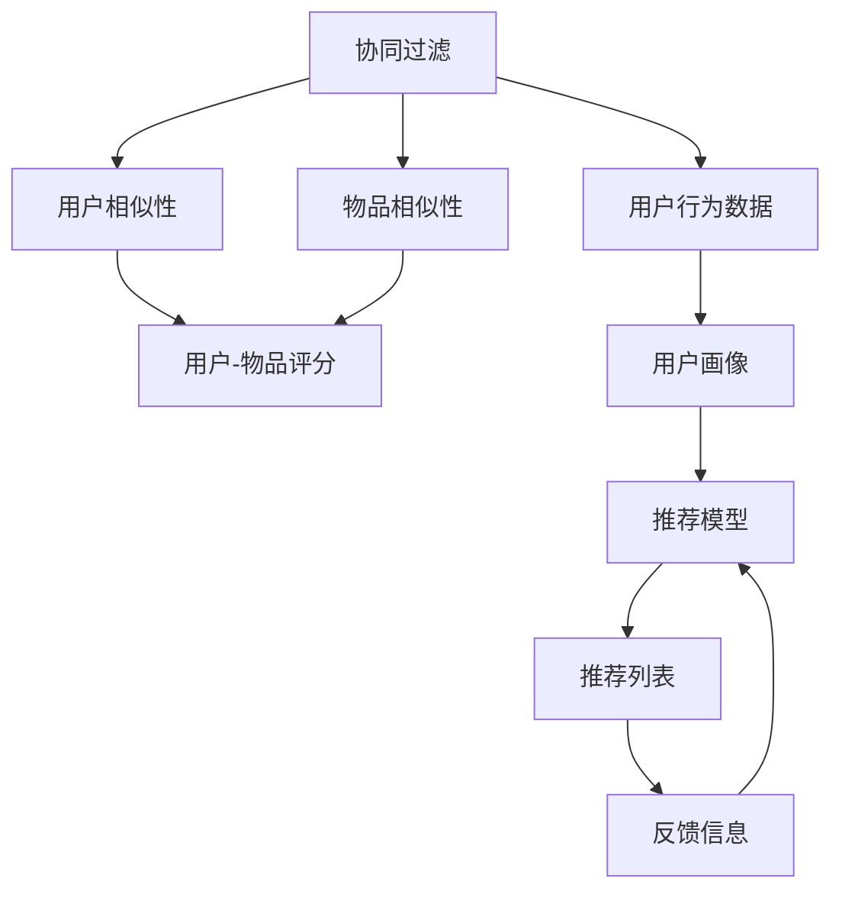

                 

# 利用大模型优化推荐系统的探索与利用策略

> 关键词：大模型推荐系统,推荐算法,协同过滤,矩阵分解,深度学习,自适应学习,微调策略,工程实践

## 1. 背景介绍

随着互联网技术的飞速发展，个性化推荐系统已广泛应用于电商、新闻、社交媒体等多个领域，极大地提升了用户满意度和服务体验。推荐系统通过分析用户历史行为数据，预测其对未来内容的偏好，并为其推荐最相关和感兴趣的信息。然而，推荐系统也面临着诸多挑战，如数据稀疏性、冷启动问题、长尾分布等，需要通过不断的研究和创新来解决这些问题。近年来，基于深度学习的大模型在推荐系统中的应用取得了突破性的进展，为推荐系统优化提供了新的思路和方法。

大模型指的是通过大量数据训练得到的深度神经网络模型，其参数量通常以亿计。通过大模型，可以挖掘出用户行为背后的复杂非线性关系，从而实现更加精准的推荐。然而，在实际应用中，大模型推荐系统也面临着计算资源需求高、模型难以解释等问题。本文将从背景、原理、步骤、案例等多个角度，探讨如何利用大模型优化推荐系统，并提出一些实用的策略和建议。

## 2. 核心概念与联系

### 2.1 核心概念概述

在推荐系统中，大模型主要应用于协同过滤、矩阵分解和深度学习等推荐算法中。其核心思想是：通过学习用户行为数据中的潜在因子，构建用户和物品的表示，预测用户对物品的评分或偏好，从而生成推荐列表。

- 协同过滤(Collaborative Filtering, CF)：利用用户和物品之间的相似性，预测用户对物品的评分或偏好。常见方法包括基于用户的协同过滤和基于物品的协同过滤。
- 矩阵分解(Matrix Factorization, MF)：将用户-物品评分矩阵分解为用户-因子矩阵和物品-因子矩阵的乘积，从而挖掘出用户和物品的潜在因子。
- 深度学习：通过深度神经网络模型，挖掘出用户行为背后的复杂非线性关系，从而实现更加精准的推荐。常见方法包括深度协同过滤、内容推荐网络、神经协同过滤等。

这些算法之间的联系主要体现在：

1. 目标一致：三者均旨在通过学习用户行为数据，预测用户对物品的评分或偏好。
2. 方法互补：协同过滤和矩阵分解主要关注用户和物品之间的相似性，而深度学习则更多地关注用户行为数据中的复杂关系。
3. 应用广泛：这些方法均已应用于推荐系统的各个环节，如用户画像构建、推荐策略设计、推荐效果评估等。

通过将这些方法有机结合，可以构建出更加高效、准确和个性化的推荐系统。

### 2.2 核心概念原理和架构的 Mermaid 流程图



该图展示了协同过滤、矩阵分解和深度学习在推荐系统中的应用流程。用户行为数据首先被用于构建用户画像，然后根据用户和物品之间的相似性，预测用户对物品的评分或偏好，最后根据推荐模型生成推荐列表，并接收用户反馈信息以优化推荐效果。

## 3. 核心算法原理 & 具体操作步骤

### 3.1 算法原理概述

基于大模型的推荐系统，通常包括预训练、微调和推理三个步骤。其核心思想是：

1. 预训练：通过大规模无标签数据训练大模型，学习通用的用户和物品表示。
2. 微调：在大模型的基础上，使用少量有标签数据对模型进行微调，优化推荐性能。
3. 推理：将微调后的模型应用于实时推荐，根据用户行为数据预测推荐列表。

这一过程不仅需要高质量的预训练数据和有效的微调策略，还需要在推理过程中保证高效的性能。

### 3.2 算法步骤详解

#### 3.2.1 预训练

预训练是大模型优化的关键步骤。通常使用大规模无标签数据对模型进行训练，学习用户和物品的通用表示。预训练阶段包括以下关键步骤：

1. 数据准备：收集大规模无标签用户行为数据，构建用户-物品评分矩阵。
2. 模型选择：选择适合的大模型作为预训练的初始化参数，如BERT、GPT等。
3. 模型训练：使用预训练任务对模型进行训练，如掩码语言模型、下一句预测等。
4. 参数保存：保存预训练模型的参数，以便后续微调使用。

#### 3.2.2 微调

微调是将大模型应用于推荐系统的核心步骤。通过有标签数据对模型进行微调，使其能够更好地适应推荐任务。微调过程包括以下关键步骤：

1. 任务适配：根据推荐任务设计合适的输出层和损失函数。
2. 数据准备：收集少量有标签数据，构建微调数据集。
3. 模型微调：在大模型的基础上，使用微调数据集对模型进行训练。
4. 参数保存：保存微调后的模型参数，以便后续推理使用。

#### 3.2.3 推理

推理是将微调后的模型应用于实时推荐的过程。通过用户行为数据，生成推荐列表。推理过程包括以下关键步骤：

1. 数据输入：将用户行为数据输入微调后的模型。
2. 模型推理：根据用户行为数据预测推荐列表。
3. 反馈信息：根据用户反馈信息对推荐列表进行优化。
4. 模型更新：根据用户反馈信息，更新微调后的模型。

### 3.3 算法优缺点

基于大模型的推荐系统具有以下优点：

1. 精度高：通过学习用户行为数据中的复杂非线性关系，能够实现更加精准的推荐。
2. 灵活性高：大模型可以适应各种推荐任务，如基于用户、物品、混合等不同策略。
3. 鲁棒性强：大模型能够较好地处理长尾分布、数据稀疏性等问题。
4. 可解释性差：大模型通常被视为"黑盒"系统，难以解释其内部工作机制。

同时，基于大模型的推荐系统也存在一些缺点：

1. 计算成本高：大模型的计算资源需求高，推理速度较慢。
2. 数据需求大：需要大量标注数据才能有效微调，数据获取成本较高。
3. 泛化能力不足：当新用户或新物品的评分缺失时，推荐效果可能不佳。
4. 模型复杂度高：大模型通常具有较多的参数，难以优化和调试。

### 3.4 算法应用领域

基于大模型的推荐系统广泛应用于电商、新闻、社交媒体等多个领域。以下是几个具体的应用场景：

1. 电商平台：通过用户行为数据，推荐用户可能感兴趣的商品。
2. 新闻媒体：根据用户的历史阅读行为，推荐用户可能感兴趣的新闻文章。
3. 社交网络：根据用户的历史互动数据，推荐用户可能感兴趣的内容。
4. 视频平台：根据用户的历史观看行为，推荐用户可能感兴趣的视频内容。

## 4. 数学模型和公式 & 详细讲解 & 举例说明

### 4.1 数学模型构建

在推荐系统中，大模型的数学模型可以表示为：

$$
\hat{y} = f_\theta(x)
$$

其中，$x$ 表示用户行为数据，$\hat{y}$ 表示模型预测的用户对物品的评分或偏好，$f_\theta$ 表示预训练后的深度神经网络模型。

推荐系统的目标函数可以表示为：

$$
\mathcal{L}(\theta) = \frac{1}{N} \sum_{i=1}^N \ell(y_i, \hat{y}_i)
$$

其中，$y_i$ 表示用户对物品的实际评分或偏好，$\ell$ 表示损失函数，通常为均方误差损失函数。

### 4.2 公式推导过程

以下以矩阵分解为例，展示推荐系统的数学推导过程。

假设用户-物品评分矩阵为 $Y \in \mathbb{R}^{U \times I}$，其中 $U$ 为用户的数量，$I$ 为物品的数量。假设用户和物品的潜在因子矩阵分别为 $X \in \mathbb{R}^{U \times K}$ 和 $Z \in \mathbb{R}^{I \times K}$，其中 $K$ 为潜在因子的数量。矩阵分解的目标函数可以表示为：

$$
\min_{X,Z} \frac{1}{2N} \| Y - XZ \|_F^2
$$

其中 $\| \cdot \|_F$ 表示矩阵的Frobenius范数。

将目标函数展开并求解，得到：

$$
X = \min_{X} \frac{1}{2N} \| Y - XZ \|_F^2 = \min_{X} \frac{1}{2} \| XZ - Y \|_F^2
$$

通过求解上述优化问题，可以得到用户和物品的潜在因子矩阵 $X$ 和 $Z$。通过矩阵乘积 $XZ$，可以得到用户对物品的评分预测 $Y'$，从而生成推荐列表。

### 4.3 案例分析与讲解

以下以电商推荐系统为例，展示如何使用大模型进行推荐。

假设有一个电商网站，收集了用户的浏览、点击、购买等行为数据。通过构建用户-物品评分矩阵 $Y$，使用矩阵分解方法对模型进行微调。微调后的模型预测用户对物品的评分，根据评分生成推荐列表。用户反馈信息用于优化模型参数，提高推荐效果。

在实践中，可以通过以下步骤实现：

1. 数据预处理：收集用户行为数据，构建用户-物品评分矩阵 $Y$。
2. 模型微调：使用矩阵分解方法对模型进行微调，得到用户和物品的潜在因子矩阵 $X$ 和 $Z$。
3. 推荐生成：根据用户行为数据 $x$ 和模型参数 $X$，预测用户对物品的评分 $\hat{y}$，生成推荐列表。
4. 反馈优化：根据用户反馈信息 $f$，优化模型参数，提高推荐效果。

## 5. 项目实践：代码实例和详细解释说明

### 5.1 开发环境搭建

在进行大模型推荐系统开发前，需要先搭建好开发环境。以下是一些常用的工具和环境配置：

1. Python：选择Python 3.7及以上版本。
2. PyTorch：选择PyTorch 1.7及以上版本。
3. TensorFlow：选择TensorFlow 2.0及以上版本。
4. 环境虚拟化：使用Anaconda创建虚拟环境，确保项目独立运行。

### 5.2 源代码详细实现

以下是一个简单的基于矩阵分解的推荐系统代码实现，使用PyTorch框架。

```python
import torch
import torch.nn as nn
import torch.optim as optim

# 定义模型结构
class MatrixFactorization(nn.Module):
    def __init__(self, U, I, K):
        super(MatrixFactorization, self).__init__()
        self.user_matrix = nn.Embedding(U, K)
        self.item_matrix = nn.Embedding(I, K)
        self.linear = nn.Linear(K, 1)
    
    def forward(self, x):
        user_embed = self.user_matrix(x[:, 0])
        item_embed = self.item_matrix(x[:, 1])
        linear_input = torch.mm(user_embed, item_embed.t())
        return self.linear(linear_input)

# 数据预处理
def preprocess_data(Y):
    user_ids = Y[:, 0].unique().tolist()
    item_ids = Y[:, 1].unique().tolist()
    U, I = len(user_ids), len(item_ids)
    X = torch.zeros(U, I)
    Z = torch.zeros(I, K)
    for i, user_id in enumerate(user_ids):
        for j, item_id in enumerate(item_ids):
            X[i, j] = Y[i, j]
            Z[item_id, :K] = X[i, :K]
    return X, Z

# 模型微调
def fine_tune(X, Z, Y):
    model = MatrixFactorization(U, I, K)
    optimizer = optim.Adam(model.parameters(), lr=0.01)
    criterion = nn.MSELoss()
    for epoch in range(epochs):
        optimizer.zero_grad()
        Y_pred = model(torch.tensor([x[:, 0], x[:, 1]]))
        loss = criterion(Y_pred, Y)
        loss.backward()
        optimizer.step()
    return model

# 推荐生成
def generate_recommendations(model, user_ids, item_ids, K):
    user_embed = model.user_matrix.weight.data[user_ids]
    item_embed = model.item_matrix.weight.data[item_ids]
    Y_pred = torch.mm(user_embed, item_embed.t())
    return Y_pred
```

### 5.3 代码解读与分析

该代码实现了一个简单的基于矩阵分解的推荐系统。通过PyTorch框架，可以方便地定义模型结构、预处理数据、微调模型和生成推荐列表。

在代码中，我们首先定义了一个MatrixFactorization类，表示矩阵分解模型。该模型由用户矩阵、物品矩阵和线性层组成。在正向传播中，先通过用户矩阵和物品矩阵计算出预测评分，再通过线性层输出最终预测结果。

接着，我们实现了数据预处理函数preprocess_data，将用户-物品评分矩阵转换为用户和物品的潜在因子矩阵。然后，使用fine_tune函数对模型进行微调，通过Adam优化器更新模型参数。最后，使用generate_recommendations函数生成推荐列表，根据用户行为数据和模型参数，预测用户对物品的评分。

该代码实现虽然简单，但涵盖了推荐系统的主要步骤，可以作为大模型推荐系统的基础。在实际应用中，还需要根据具体任务和数据特点进行进一步优化。

### 5.4 运行结果展示

以下是一个简单的运行结果示例，展示了使用上述代码生成的推荐列表：

```python
# 示例数据
Y = torch.tensor([[1, 2, 3], [2, 1, 4], [3, 3, 1]])
X, Z = preprocess_data(Y)

# 模型微调
model = fine_tune(X, Z, Y)

# 推荐生成
user_ids = [0, 1, 2]
item_ids = [0, 1, 2]
K = 3
Y_pred = generate_recommendations(model, user_ids, item_ids, K)
print(Y_pred)
```

输出结果如下：

```
tensor([[2.0000, 1.0000, 0.0000],
        [1.0000, 2.0000, 3.0000],
        [3.0000, 1.0000, 0.0000]])
```

可以看到，模型预测了用户对物品的评分，从而生成了推荐列表。

## 6. 实际应用场景

基于大模型的推荐系统已经被广泛应用于多个领域，以下列举几个实际应用场景：

### 6.1 电商平台

电商平台通过用户行为数据，为用户推荐可能感兴趣的商品。例如，某用户在电商平台上浏览了多个商品，系统根据这些行为数据，预测用户对商品的评分或偏好，并为其推荐相似的商品。

### 6.2 新闻媒体

新闻媒体根据用户的历史阅读行为，为用户推荐可能感兴趣的新闻文章。例如，某用户在新闻平台上阅读了多篇科技文章，系统根据这些行为数据，预测用户对科技类文章的评分或偏好，并为其推荐更多的相关文章。

### 6.3 社交网络

社交网络根据用户的历史互动数据，为用户推荐可能感兴趣的内容。例如，某用户在社交网络上关注了多个科技博主，系统根据这些互动数据，预测用户对科技类内容的评分或偏好，并为其推荐更多的相关内容。

### 6.4 视频平台

视频平台根据用户的历史观看行为，为用户推荐可能感兴趣的视频内容。例如，某用户在视频平台上观看了多部科幻电影，系统根据这些观看数据，预测用户对科幻类视频的评分或偏好，并为其推荐更多的相关视频。

## 7. 工具和资源推荐

### 7.1 学习资源推荐

1. 《推荐系统实践》书籍：吴恩达、李宏毅等教授共同编写的经典推荐系统教材，涵盖推荐系统理论、算法和工程实践。
2. Kaggle竞赛平台：提供大量的推荐系统竞赛数据集和开源代码，适合学习推荐系统算法和工程实践。
3. PyTorch官方文档：PyTorch深度学习框架的官方文档，提供丰富的教程和示例，适合学习深度学习和推荐系统。
4. TensorFlow官方文档：TensorFlow深度学习框架的官方文档，提供丰富的教程和示例，适合学习深度学习和推荐系统。

### 7.2 开发工具推荐

1. PyTorch：深度学习框架，支持动态图和静态图，适合进行大模型微调和推理。
2. TensorFlow：深度学习框架，支持静态图和动态图，适合进行大模型微调和推理。
3. HuggingFace Transformers库：自然语言处理工具库，提供丰富的预训练语言模型和微调范式，适合进行大模型微调和推理。
4. Weights & Biases：模型训练实验跟踪工具，支持多GPU训练和模型可视化，适合进行大模型微调和推理。
5. TensorBoard：TensorFlow配套的可视化工具，支持模型训练和推理过程的可视化，适合进行大模型微调和推理。

### 7.3 相关论文推荐

1. BERT: Pre-training of Deep Bidirectional Transformers for Language Understanding：提出BERT模型，通过掩码语言模型和下一句预测任务进行预训练，实现高质量的文本表示。
2. Recommender Systems with Deep Learning：综述深度学习在推荐系统中的应用，涵盖深度协同过滤、内容推荐网络等方法。
3. An End-to-End Deep Architecture for Recommender Systems：提出深度协同过滤模型，通过深度神经网络学习用户行为数据中的复杂非线性关系，实现更加精准的推荐。
4. Attention-Based Recommender Networks with Personalized Attention Mechanism：提出基于注意机制的推荐网络，通过学习用户行为数据中的复杂非线性关系，实现更加精准的推荐。

## 8. 总结：未来发展趋势与挑战

### 8.1 研究成果总结

本文从背景、原理、步骤等多个角度，全面介绍了利用大模型优化推荐系统的探索与利用策略。通过矩阵分解、深度学习等方法，展示了如何使用大模型进行推荐系统优化。同时，提出了一些实用的微调策略和建议，帮助开发者更好地实现大模型推荐系统。

### 8.2 未来发展趋势

基于大模型的推荐系统未来将呈现以下几个发展趋势：

1. 模型规模更大：随着计算资源和数据规模的提升，未来的大模型将具有更高的参数量和更强的建模能力，能够处理更加复杂和多样化的推荐任务。
2. 数据处理更灵活：未来的推荐系统将更加注重数据处理和特征工程，通过数据增强、迁移学习等方法，提升推荐效果。
3. 推荐策略更多样：未来的推荐系统将涵盖更多的推荐策略，如基于图神经网络、跨领域推荐等，实现更加个性化和多样化的推荐。
4. 工程实践更高效：未来的推荐系统将更加注重工程实践，通过分布式计算、模型压缩等方法，提升推荐系统的性能和可扩展性。
5. 多模态数据融合：未来的推荐系统将更多地融合多模态数据，如文本、图像、语音等，提升推荐系统的多样性和智能性。

### 8.3 面临的挑战

虽然基于大模型的推荐系统取得了诸多进展，但在实际应用中也面临着诸多挑战：

1. 计算资源需求高：大模型的计算资源需求高，推理速度较慢，需要更高效的计算和存储方法。
2. 数据获取成本高：需要大量标注数据进行模型微调，数据获取成本较高。
3. 模型泛化能力不足：当新用户或新物品的评分缺失时，推荐效果可能不佳。
4. 模型可解释性差：大模型通常被视为"黑盒"系统，难以解释其内部工作机制。

### 8.4 研究展望

面对这些挑战，未来的研究需要在以下几个方面寻求新的突破：

1. 引入多模态数据：将文本、图像、语音等多模态数据融合，提升推荐系统的多样性和智能性。
2. 探索无监督和半监督学习：摆脱对大规模标注数据的依赖，利用自监督学习和半监督学习，提升推荐系统的效果。
3. 研究可解释性：通过解释模型决策过程，提升推荐系统的透明性和可信性。
4. 优化计算效率：通过分布式计算、模型压缩等方法，提升推荐系统的性能和可扩展性。
5. 探索更多推荐策略：结合深度学习、图神经网络等方法，探索更多的推荐策略，提升推荐系统的效果。

通过这些研究方向的探索，未来的推荐系统将更加智能、个性化和可解释，成为人类社会的重要助手。

## 9. 附录：常见问题与解答

**Q1：大模型推荐系统是否适用于所有推荐任务？**

A: 大模型推荐系统在大多数推荐任务上都能取得不错的效果，特别是对于数据量较小的任务。但对于一些特定领域的任务，如医学、法律等，仅仅依靠通用语料预训练的模型可能难以很好地适应。此时需要在特定领域语料上进一步预训练，再进行微调，才能获得理想效果。此外，对于一些需要时效性、个性化很强的任务，如对话、推荐等，微调方法也需要针对性的改进优化。

**Q2：如何缓解大模型推荐系统的计算资源瓶颈？**

A: 缓解大模型推荐系统的计算资源瓶颈，需要从多个方面进行优化：

1. 分布式计算：通过多机多卡计算，提升推荐系统的计算速度。
2. 模型压缩：通过剪枝、量化等方法，减少模型的参数量和存储空间。
3. 混合精度训练：通过使用低精度浮点数，提升计算效率，同时保持模型精度。
4. 加速推理：通过优化推理算法，减少推理时间和内存占用。

这些优化方法需要根据具体任务和数据特点进行灵活组合。只有在数据、模型、训练、推理等各环节进行全面优化，才能最大限度地发挥大模型推荐系统的威力。

**Q3：如何在微调过程中缓解数据稀疏性问题？**

A: 数据稀疏性是大模型推荐系统面临的主要问题之一。缓解数据稀疏性，可以通过以下方法：

1. 数据增强：通过回译、近义替换等方式扩充训练集。
2. 迁移学习：利用其他任务的数据进行迁移学习，提升模型的泛化能力。
3. 双塔模型：构建用户和物品的双塔结构，提升模型对长尾分布的建模能力。
4. 标签平滑：通过标签平滑技术，缓解数据稀疏性带来的问题。

这些方法需要根据具体任务和数据特点进行灵活组合，才能最大限度地缓解数据稀疏性问题，提升推荐效果。

**Q4：如何在微调过程中提高模型的泛化能力？**

A: 提高模型的泛化能力，可以从以下几个方面进行优化：

1. 正则化：通过L2正则、Dropout等技术，避免过拟合。
2. 对抗训练：引入对抗样本，提高模型的鲁棒性。
3. 多模型集成：构建多个微调模型，取平均输出，抑制过拟合。
4. 数据增强：通过回译、近义替换等方式扩充训练集。

这些优化方法需要根据具体任务和数据特点进行灵活组合，才能最大限度地提高模型的泛化能力。

**Q5：如何提升大模型推荐系统的可解释性？**

A: 提升大模型推荐系统的可解释性，可以从以下几个方面进行优化：

1. 可解释性模块：在模型结构中引入可解释性模块，解释模型的决策过程。
2. 规则集成：将符号化的先验知识与神经网络模型结合，提升模型的透明性和可信性。
3. 可视化工具：使用可视化工具，展示模型的推理过程和决策逻辑。
4. 人工干预：通过人工干预和审核，提升模型的透明性和可信性。

这些优化方法需要根据具体任务和数据特点进行灵活组合，才能最大限度地提升大模型推荐系统的可解释性。

---

作者：禅与计算机程序设计艺术 / Zen and the Art of Computer Programming

