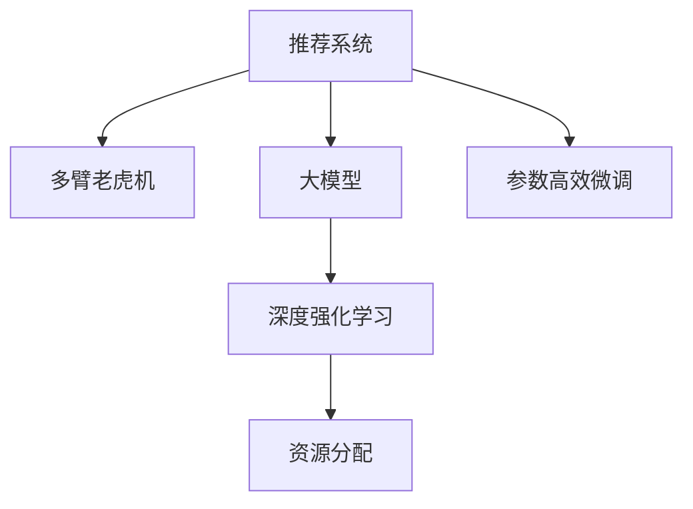

                 

# 利用大模型优化推荐系统的资源分配

> 关键词：资源分配, 推荐系统, 大模型, 深度学习, 多臂老虎机

## 1. 背景介绍

推荐系统是现代信息技术的一大应用领域，通过分析用户的行为数据，为用户推荐个性化的产品或内容，提升用户体验和业务收益。然而，推荐系统设计复杂，涉及用户兴趣建模、特征工程、模型选择等多个环节。在资源有限的条件下，如何优化推荐系统的性能和效率，一直是学术界和工业界的核心挑战之一。

近年来，随着深度学习技术的发展，大模型在推荐系统中得到了广泛应用。大模型通过在海量数据上进行预训练，学习到丰富的用户行为和产品特征表示，具备强大的推荐能力。但与此同时，大模型的计算资源需求高，训练和推理成本昂贵。如何在有限的资源下，最大化利用大模型的优势，提升推荐系统的效果和效率，成为当前研究的热点。

## 2. 核心概念与联系

### 2.1 核心概念概述

为更好地理解大模型在推荐系统中的应用，本节将介绍几个密切相关的核心概念：

- 推荐系统(Recommender System)：通过用户行为数据进行用户兴趣建模，为用户推荐个性化产品或内容，提升用户满意度和业务收益的系统。
- 多臂老虎机(Multi-Armed Bandit, MAB)：一种经典的随机优化问题，模拟多个资源分配决策场景，如广告点击率、资源利用率等，目标是最大化长期收益。
- 大模型(Large Model)：以自回归(如GPT)或自编码(如BERT)模型为代表的大规模预训练模型。通过在海量数据上进行预训练，学习到复杂的用户行为和产品特征表示，具备强大的推荐能力。
- 深度强化学习(Deep Reinforcement Learning)：结合深度学习和强化学习技术，通过优化奖励函数来提升推荐系统效果和资源利用效率。
- 参数高效微调(Parameter-Efficient Fine-Tuning, PEFT)：在微调过程中，只更新少量的模型参数，而固定大部分预训练权重不变，以提高微调效率，避免过拟合的方法。

这些核心概念之间的逻辑关系可以通过以下Mermaid流程图来展示：



这个流程图展示了大模型在推荐系统中的应用框架：

1. 推荐系统利用多臂老虎机，根据用户行为数据进行资源分配，提升资源利用效率。
2. 大模型通过预训练学习到丰富的用户行为和产品特征表示，增强推荐系统的推荐能力。
3. 深度强化学习通过对奖励函数的优化，提升推荐系统的效果。
4. 参数高效微调在不更新大部分预训练权重的情况下，提高微调效率。

这些核心概念共同构成了大模型优化推荐系统的基础，使其能够在大规模数据和复杂应用场景下发挥强大的推荐能力。

## 3. 核心算法原理 & 具体操作步骤
### 3.1 算法原理概述

利用大模型优化推荐系统的资源分配，本质上是一种基于深度强化学习的优化过程。其核心思想是：将推荐系统中的资源分配决策抽象为多臂老虎机问题，通过深度学习模型预测每个资源（如广告位、内容推荐位）的点击率，最大化长期奖励函数。

具体而言，假设推荐系统中有 $K$ 个资源位，每个资源位有 $N$ 种可能的资源分配策略，则多臂老虎机问题可以表示为：

$$
\max_{\theta} \sum_{k=1}^K \sum_{n=1}^N \sum_{t=1}^T R_{k,n,t}^\theta
$$

其中 $\theta$ 为推荐模型的参数，$R_{k,n,t}^\theta$ 为在第 $k$ 个资源位，采用第 $n$ 种分配策略，时间 $t$ 时的点击率。长期奖励函数的目标是最大化总点击率之和。

为了求解上述最优化问题，通常采用深度强化学习中的多臂老虎机算法，如UCB(Updraft Click Boundary)、$\epsilon$-Greedy、Thompson Sampling等，通过不断探索和利用资源，最大化长期奖励。

### 3.2 算法步骤详解

基于深度强化学习的大模型推荐系统资源分配一般包括以下几个关键步骤：

**Step 1: 准备数据集和模型**

- 收集推荐系统的用户行为数据，包括点击、浏览、评分等行为，构建训练集和测试集。
- 选择合适的预训练语言模型 $M_{\theta}$ 作为初始化参数，如 BERT、GPT 等。
- 定义资源分配的奖励函数，例如点击率或点击收入。

**Step 2: 定义模型和优化目标**

- 定义推荐模型的网络结构，如卷积神经网络、RNN、Transformer等。
- 设置损失函数，如交叉熵损失、均方误差损失等，用于优化推荐模型的预测效果。
- 定义奖励函数，例如点击率或点击收入，用于评估推荐模型的资源分配效果。

**Step 3: 训练和评估**

- 使用推荐模型的训练集数据，通过前向传播计算点击率预测，反向传播更新模型参数，最小化损失函数。
- 在测试集上评估推荐模型的点击率或点击收入，对比微调前后的提升效果。
- 使用深度强化学习算法，在测试集上对推荐模型进行参数微调，最大化长期奖励函数。

**Step 4: 资源分配**

- 在实时推荐中，根据用户行为数据和预测点击率，动态调整资源分配策略。
- 对每个资源位，使用推荐模型预测点击率，利用深度强化学习算法进行资源分配决策。
- 对点击事件进行实时记录和反馈，更新模型参数，不断优化资源分配策略。

以上是基于深度强化学习的大模型推荐系统资源分配的一般流程。在实际应用中，还需要针对具体任务的特点，对推荐模型和强化学习算法进行优化设计，如改进训练目标函数，引入更多的正则化技术，搜索最优的超参数组合等，以进一步提升推荐模型的性能和资源利用效率。

### 3.3 算法优缺点

基于深度强化学习的大模型推荐系统资源分配方法具有以下优点：

1. 自适应能力强。能够根据用户行为数据，动态调整资源分配策略，适应不断变化的推荐需求。
2. 鲁棒性好。通过深度学习模型预测点击率，能够处理非线性、高维度的特征，增强模型鲁棒性。
3. 效果显著。在大规模推荐数据上训练深度模型，可以在不同的资源分配场景下，取得优异的点击率和收入收益。
4. 计算高效。通过参数高效微调技术，减小模型的计算量，提高实时推荐效率。

同时，该方法也存在一定的局限性：

1. 依赖高质量标注数据。深度模型需要大量的标注数据进行训练，对于标注数据不足的场景，可能无法取得理想效果。
2. 过拟合风险。深度模型容易在训练过程中过拟合，需要严格控制学习率，引入正则化技术。
3. 资源开销大。深度模型需要较大的计算资源进行训练和推理，资源分配决策的实时性可能受到限制。
4. 可解释性不足。深度模型的决策过程缺乏可解释性，难以对其推荐逻辑进行分析和调试。

尽管存在这些局限性，但就目前而言，基于深度强化学习的大模型推荐系统资源分配方法仍是大模型优化推荐系统的最主流范式。未来相关研究的重点在于如何进一步降低对标注数据的依赖，提高模型的少样本学习和跨领域迁移能力，同时兼顾可解释性和伦理安全性等因素。

### 3.4 算法应用领域

基于深度强化学习的大模型推荐系统资源分配方法，在推荐系统领域已经得到了广泛的应用，覆盖了从广告推荐到商品推荐、内容推荐等多个场景：

- 广告推荐：利用用户行为数据，优化广告投放策略，最大化广告点击率和收入。
- 商品推荐：对电商网站的用户进行个性化商品推荐，提升用户满意度和购物体验。
- 内容推荐：对新闻、视频、音乐等媒体内容进行个性化推荐，增加用户粘性和平台收益。
- 游戏推荐：对游戏中的用户进行个性化推荐，提升游戏留存率和收益。

除了上述这些经典任务外，大模型推荐系统还被创新性地应用于更多场景中，如社交网络、视频直播、智能交通等，为推荐系统技术带来了新的突破。随着深度学习技术的发展和预训练模型的演进，相信推荐系统技术将在更广泛的领域得到应用，提升推荐质量和用户体验。

## 4. 数学模型和公式 & 详细讲解  
### 4.1 数学模型构建

本节将使用数学语言对大模型优化推荐系统资源分配过程进行更加严格的刻画。

记推荐系统的用户行为数据为 $D=\{(x_i,y_i)\}_{i=1}^N$，其中 $x_i$ 为用户的行为特征向量，$y_i$ 为用户对资源的点击率（0/1）。定义多臂老虎机的状态为 $S$，动作为 $A$，奖励为 $R$。假设推荐模型的参数为 $\theta$，资源分配的奖励函数为 $R_{k,n,t}^\theta$。

多臂老虎机的长期奖励函数为：

$$
J(\theta) = \sum_{k=1}^K \sum_{n=1}^N \sum_{t=1}^T R_{k,n,t}^\theta
$$

推荐模型的点击率预测函数为：

$$
\hat{y}(x_i) = M_{\theta}(x_i)
$$

在训练过程中，目标是最小化损失函数：

$$
\mathcal{L}(\theta) = -\frac{1}{N}\sum_{i=1}^N \log\hat{y}(x_i)
$$

推荐模型的优化目标是最小化上述损失函数，同时最大化长期奖励函数：

$$
\max_{\theta} J(\theta)
$$

通过梯度下降等优化算法，推荐模型不断更新参数 $\theta$，最小化损失函数，同时最大化长期奖励函数。

### 4.2 公式推导过程

以下我们以二分类任务为例，推导多臂老虎机问题中奖励函数的梯度计算公式。

假设推荐模型的输出为 $\hat{y} \in [0,1]$，表示资源点击的概率。真实标签 $y \in \{0,1\}$。则二分类交叉熵损失函数定义为：

$$
\ell(\hat{y},y) = -[y\log \hat{y} + (1-y)\log (1-\hat{y})]
$$

将其代入经验风险公式，得：

$$
\mathcal{L}(\theta) = -\frac{1}{N}\sum_{i=1}^N [y_i\log \hat{y}(x_i)+(1-y_i)\log(1-\hat{y}(x_i))]
$$

根据链式法则，损失函数对参数 $\theta_k$ 的梯度为：

$$
\frac{\partial \mathcal{L}(\theta)}{\partial \theta_k} = -\frac{1}{N}\sum_{i=1}^N (\frac{y_i}{\hat{y}(x_i)}-\frac{1-y_i}{1-\hat{y}(x_i)}) \frac{\partial \hat{y}(x_i)}{\partial \theta_k}
$$

其中 $\frac{\partial \hat{y}(x_i)}{\partial \theta_k}$ 可进一步递归展开，利用自动微分技术完成计算。

在得到损失函数的梯度后，即可带入参数更新公式，完成模型的迭代优化。重复上述过程直至收敛，最终得到适应推荐任务的最优模型参数 $\theta^*$。

## 5. 项目实践：代码实例和详细解释说明
### 5.1 开发环境搭建

在进行推荐系统资源分配实践前，我们需要准备好开发环境。以下是使用Python进行PyTorch开发的环境配置流程：

1. 安装Anaconda：从官网下载并安装Anaconda，用于创建独立的Python环境。

2. 创建并激活虚拟环境：
```bash
conda create -n pytorch-env python=3.8 
conda activate pytorch-env
```

3. 安装PyTorch：根据CUDA版本，从官网获取对应的安装命令。例如：
```bash
conda install pytorch torchvision torchaudio cudatoolkit=11.1 -c pytorch -c conda-forge
```

4. 安装Transformers库：
```bash
pip install transformers
```

5. 安装各类工具包：
```bash
pip install numpy pandas scikit-learn matplotlib tqdm jupyter notebook ipython
```

完成上述步骤后，即可在`pytorch-env`环境中开始推荐系统资源分配实践。

### 5.2 源代码详细实现

这里我们以电商平台的商品推荐系统为例，给出使用Transformers库对BERT模型进行微调的PyTorch代码实现。

首先，定义推荐任务的数据处理函数：

```python
from transformers import BertTokenizer
from torch.utils.data import Dataset
import torch

class RecommendationDataset(Dataset):
    def __init__(self, items, labels, tokenizer, max_len=128):
        self.items = items
        self.labels = labels
        self.tokenizer = tokenizer
        self.max_len = max_len
        
    def __len__(self):
        return len(self.items)
    
    def __getitem__(self, item):
        item = self.items[item]
        label = self.labels[item]
        
        encoding = self.tokenizer(item, return_tensors='pt', max_length=self.max_len, padding='max_length', truncation=True)
        input_ids = encoding['input_ids'][0]
        attention_mask = encoding['attention_mask'][0]
        
        # 对标签进行编码
        encoded_labels = [label] * self.max_len
        labels = torch.tensor(encoded_labels, dtype=torch.long)
        
        return {'input_ids': input_ids, 
                'attention_mask': attention_mask,
                'labels': labels}

# 加载预训练模型和分词器
tokenizer = BertTokenizer.from_pretrained('bert-base-cased')
model = BertForTokenClassification.from_pretrained('bert-base-cased', num_labels=2)

# 准备训练集和测试集
train_dataset = RecommendationDataset(train_items, train_labels, tokenizer)
dev_dataset = RecommendationDataset(dev_items, dev_labels, tokenizer)
test_dataset = RecommendationDataset(test_items, test_labels, tokenizer)
```

然后，定义模型和优化器：

```python
from transformers import BertForTokenClassification, AdamW

optimizer = AdamW(model.parameters(), lr=2e-5)
```

接着，定义训练和评估函数：

```python
from torch.utils.data import DataLoader
from tqdm import tqdm
from sklearn.metrics import classification_report

device = torch.device('cuda') if torch.cuda.is_available() else torch.device('cpu')
model.to(device)

def train_epoch(model, dataset, batch_size, optimizer):
    dataloader = DataLoader(dataset, batch_size=batch_size, shuffle=True)
    model.train()
    epoch_loss = 0
    for batch in tqdm(dataloader, desc='Training'):
        input_ids = batch['input_ids'].to(device)
        attention_mask = batch['attention_mask'].to(device)
        labels = batch['labels'].to(device)
        model.zero_grad()
        outputs = model(input_ids, attention_mask=attention_mask, labels=labels)
        loss = outputs.loss
        epoch_loss += loss.item()
        loss.backward()
        optimizer.step()
    return epoch_loss / len(dataloader)

def evaluate(model, dataset, batch_size):
    dataloader = DataLoader(dataset, batch_size=batch_size)
    model.eval()
    preds, labels = [], []
    with torch.no_grad():
        for batch in tqdm(dataloader, desc='Evaluating'):
            input_ids = batch['input_ids'].to(device)
            attention_mask = batch['attention_mask'].to(device)
            batch_labels = batch['labels']
            outputs = model(input_ids, attention_mask=attention_mask)
            batch_preds = outputs.logits.argmax(dim=2).to('cpu').tolist()
            batch_labels = batch_labels.to('cpu').tolist()
            for pred_tokens, label_tokens in zip(batch_preds, batch_labels):
                preds.append(pred_tokens[:len(label_tokens)])
                labels.append(label_tokens)
                
    print(classification_report(labels, preds))
```

最后，启动训练流程并在测试集上评估：

```python
epochs = 5
batch_size = 16

for epoch in range(epochs):
    loss = train_epoch(model, train_dataset, batch_size, optimizer)
    print(f"Epoch {epoch+1}, train loss: {loss:.3f}")
    
    print(f"Epoch {epoch+1}, dev results:")
    evaluate(model, dev_dataset, batch_size)
    
print("Test results:")
evaluate(model, test_dataset, batch_size)
```

以上就是使用PyTorch对BERT进行商品推荐系统训练的完整代码实现。可以看到，得益于Transformers库的强大封装，我们可以用相对简洁的代码完成BERT模型的加载和微调。

### 5.3 代码解读与分析

让我们再详细解读一下关键代码的实现细节：

**RecommendationDataset类**：
- `__init__`方法：初始化商品、标签、分词器等关键组件。
- `__len__`方法：返回数据集的样本数量。
- `__getitem__`方法：对单个样本进行处理，将商品输入编码为token ids，将标签编码为数字，并对其进行定长padding，最终返回模型所需的输入。

**训练和评估函数**：
- 使用PyTorch的DataLoader对数据集进行批次化加载，供模型训练和推理使用。
- 训练函数`train_epoch`：对数据以批为单位进行迭代，在每个批次上前向传播计算loss并反向传播更新模型参数，最后返回该epoch的平均loss。
- 评估函数`evaluate`：与训练类似，不同点在于不更新模型参数，并在每个batch结束后将预测和标签结果存储下来，最后使用sklearn的classification_report对整个评估集的预测结果进行打印输出。

**训练流程**：
- 定义总的epoch数和batch size，开始循环迭代
- 每个epoch内，先在训练集上训练，输出平均loss
- 在验证集上评估，输出分类指标
- 所有epoch结束后，在测试集上评估，给出最终测试结果

可以看到，PyTorch配合Transformers库使得BERT微调的代码实现变得简洁高效。开发者可以将更多精力放在数据处理、模型改进等高层逻辑上，而不必过多关注底层的实现细节。

当然，工业级的系统实现还需考虑更多因素，如模型的保存和部署、超参数的自动搜索、更灵活的任务适配层等。但核心的微调范式基本与此类似。

## 6. 实际应用场景
### 6.1 电商平台推荐

基于深度强化学习的大模型推荐系统资源分配方法，在电商平台的商品推荐中得到了广泛应用。电商平台需要根据用户的浏览、购买历史等行为数据，为其推荐合适的商品，提升用户的购物体验和平台的销售额。

在技术实现上，可以收集用户的浏览、点击、购买等行为数据，将这些数据作为模型输入，通过深度强化学习算法进行资源分配决策。微调后的推荐模型能够学习用户兴趣的变化规律，动态调整推荐策略，实现个性化的商品推荐。

### 6.2 视频推荐系统

视频推荐系统是推荐系统的重要应用领域之一，通过分析用户对视频的观看行为，为用户推荐感兴趣的视频内容。大模型推荐系统在此基础上，通过多臂老虎机算法优化视频资源分配，提升用户的视频观看体验和平台的收益。

具体而言，可以收集用户对视频的相关行为数据，如播放时长、评分、评论等，作为模型的输入，训练推荐模型进行用户行为预测。通过深度强化学习算法，对视频资源进行动态分配，提升用户的视频观看时间，增加平台的观看量和收益。

### 6.3 新闻推荐

新闻推荐系统通过对用户阅读行为数据的分析，为用户推荐感兴趣的新闻内容，提升用户的阅读体验和平台的流量收益。基于深度强化学习的大模型推荐系统在此基础上，进一步优化资源分配策略，提升新闻推荐的准确性和个性化。

具体而言，可以收集用户的阅读行为数据，如浏览量、点击量、停留时间等，训练推荐模型进行新闻内容推荐。通过深度强化学习算法，对新闻推荐资源进行动态分配，提升用户的新闻阅读时间和平台的流量收益。

### 6.4 未来应用展望

随着深度学习技术的发展，基于大模型的推荐系统资源分配方法将在更多领域得到应用，为推荐系统技术带来新的突破。

在智慧医疗领域，基于深度强化学习的大模型推荐系统可以为医生推荐合适的治疗方案，提升患者的治疗效果和医疗服务的质量。

在金融领域，基于深度强化学习的大模型推荐系统可以为金融顾问推荐合适的投资方案，提升用户的投资收益和平台的业绩。

在教育领域，基于深度强化学习的大模型推荐系统可以为学生推荐合适的学习资源，提升学生的学习效果和教育服务的质量。

除了上述这些经典应用外，基于深度强化学习的大模型推荐系统还可以应用于智能交通、智能制造、智能家居等领域，为各行各业带来变革性的影响。相信随着技术的日益成熟，深度强化学习的大模型推荐系统必将在推荐系统技术的发展中扮演越来越重要的角色。

## 7. 工具和资源推荐
### 7.1 学习资源推荐

为了帮助开发者系统掌握大模型优化推荐系统的理论基础和实践技巧，这里推荐一些优质的学习资源：

1. 《深度学习推荐系统》系列博文：由大模型技术专家撰写，深入浅出地介绍了推荐系统的理论基础和前沿技术。

2. CS269《推荐系统》课程：斯坦福大学开设的推荐系统明星课程，涵盖推荐系统的经典理论和最新算法。

3. 《推荐系统实战》书籍：系统介绍了推荐系统的理论基础和工程实践，适合有一定机器学习基础的学习者。

4. Kaggle推荐系统竞赛：参加Kaggle上的推荐系统竞赛，通过实际项目积累推荐系统的实战经验。

5. Coursera《深度学习应用》课程：提供深度学习在推荐系统中的应用案例，帮助开发者学习推荐系统的工程实践。

通过对这些资源的学习实践，相信你一定能够快速掌握大模型优化推荐系统的精髓，并用于解决实际的推荐问题。

### 7.2 开发工具推荐

高效的开发离不开优秀的工具支持。以下是几款用于大模型推荐系统开发的工具：

1. PyTorch：基于Python的开源深度学习框架，灵活动态的计算图，适合快速迭代研究。大部分预训练语言模型都有PyTorch版本的实现。

2. TensorFlow：由Google主导开发的开源深度学习框架，生产部署方便，适合大规模工程应用。同样有丰富的预训练语言模型资源。

3. Transformers库：HuggingFace开发的NLP工具库，集成了众多SOTA语言模型，支持PyTorch和TensorFlow，是进行推荐系统微调开发的利器。

4. Weights & Biases：模型训练的实验跟踪工具，可以记录和可视化模型训练过程中的各项指标，方便对比和调优。与主流深度学习框架无缝集成。

5. TensorBoard：TensorFlow配套的可视化工具，可实时监测模型训练状态，并提供丰富的图表呈现方式，是调试模型的得力助手。

6. Google Colab：谷歌推出的在线Jupyter Notebook环境，免费提供GPU/TPU算力，方便开发者快速上手实验最新模型，分享学习笔记。

合理利用这些工具，可以显著提升大模型推荐系统的开发效率，加快创新迭代的步伐。

### 7.3 相关论文推荐

大模型优化推荐系统的发展源于学界的持续研究。以下是几篇奠基性的相关论文，推荐阅读：

1. Deep Interest Networks for Personalized Recommendation Systems（2019）：提出了Deep Interest Networks模型，利用深度神经网络进行用户兴趣建模，取得很好的推荐效果。

2. Multi-Armed Bandit Theory: Introduction and Applications（2018）：介绍了多臂老虎机问题的理论基础，为基于深度强化学习的大模型推荐系统提供了理论支持。

3. Deep Multi-Armed Bandit with Linear Reward Function（2020）：提出了一种基于线性奖励函数的深度强化学习算法，为推荐系统资源分配提供了新的优化范式。

4. TensorFlow Recommenders（2018）：介绍了一种基于TensorFlow的推荐系统框架，提供了丰富的推荐模型和工具，为推荐系统的开发提供了便利。

5. Dive into Deep Learning for Recommender Systems（2020）：介绍了深度学习在推荐系统中的应用，包括模型结构、优化算法和资源分配等。

这些论文代表了大模型优化推荐系统的发展脉络。通过学习这些前沿成果，可以帮助研究者把握学科前进方向，激发更多的创新灵感。

## 8. 总结：未来发展趋势与挑战
### 8.1 总结

本文对基于深度强化学习的大模型优化推荐系统的资源分配方法进行了全面系统的介绍。首先阐述了推荐系统和多臂老虎机问题的背景和意义，明确了大模型在推荐系统中的应用价值。其次，从原理到实践，详细讲解了大模型优化推荐系统的数学模型和核心算法，给出了推荐系统资源分配的完整代码实例。同时，本文还广泛探讨了大模型在电商平台、视频推荐、新闻推荐等多个领域的应用前景，展示了其广阔的应用范围。

通过本文的系统梳理，可以看到，基于深度强化学习的大模型推荐系统资源分配方法在大规模数据和复杂应用场景下具备强大的推荐能力。未来，伴随深度学习技术的发展和预训练模型的演进，基于大模型的推荐系统必将在更多领域得到应用，提升推荐质量和用户体验。

### 8.2 未来发展趋势

展望未来，基于深度强化学习的大模型推荐系统资源分配方法将呈现以下几个发展趋势：

1. 模型规模持续增大。随着算力成本的下降和数据规模的扩张，预训练语言模型的参数量还将持续增长。超大规模语言模型蕴含的丰富语言知识，有望支撑更加复杂多变的推荐场景。

2. 微调方法日趋多样。除了传统的全参数微调外，未来会涌现更多参数高效的微调方法，如Prefix-Tuning、LoRA等，在固定大部分预训练参数的情况下，只更新极少量的任务相关参数，提高微调效率。

3. 实时推荐能力提升。基于深度强化学习的大模型推荐系统将在实时推荐场景中得到广泛应用，通过动态调整资源分配策略，提升推荐实时性和用户体验。

4. 跨领域迁移能力增强。未来推荐系统将通过多领域数据预训练，增强模型的跨领域迁移能力，实现更广泛的推荐场景覆盖。

5. 结合因果分析和博弈论工具。将因果分析方法引入推荐系统，识别出模型决策的关键特征，增强输出解释的因果性和逻辑性。借助博弈论工具刻画人机交互过程，主动探索并规避模型的脆弱点，提高系统稳定性。

6. 纳入伦理道德约束。在推荐系统模型训练目标中引入伦理导向的评估指标，过滤和惩罚有偏见、有害的输出倾向，确保输出的安全性。

这些趋势凸显了大模型推荐系统的发展前景。这些方向的探索发展，必将进一步提升推荐系统的性能和用户体验，为智能推荐技术的普及带来新的契机。

### 8.3 面临的挑战

尽管基于深度强化学习的大模型推荐系统资源分配方法已经取得了瞩目成就，但在迈向更加智能化、普适化应用的过程中，它仍面临诸多挑战：

1. 标注成本瓶颈。尽管深度模型需要的标注数据量较传统推荐系统少，但对于长尾应用场景，仍难以获得充足的高质量标注数据，成为制约推荐系统效果的瓶颈。如何进一步降低推荐系统对标注数据的依赖，将是一大难题。

2. 资源开销大。深度模型需要较大的计算资源进行训练和推理，资源分配决策的实时性可能受到限制。如何在有限的资源条件下，最大化推荐系统效果，还需要进一步优化。

3. 可解释性不足。深度模型容易在训练过程中过拟合，导致模型的决策过程缺乏可解释性，难以对其推荐逻辑进行分析和调试。如何赋予推荐系统更强的可解释性，将是亟待攻克的难题。

4. 预测准确性不稳定。推荐系统的用户行为数据存在高度不确定性，模型容易在训练过程中出现过拟合或欠拟合，导致预测结果不稳定。如何提高推荐模型的鲁棒性和泛化能力，将是未来的研究方向。

5. 跨领域迁移能力有限。推荐系统模型的预训练数据和目标领域差异较大时，模型的跨领域迁移能力有限。如何提高模型的泛化性和适应性，还需要更多的探索和优化。

这些挑战凸显了大模型推荐系统需要进一步提升的方面。只有通过持续的研究和实践，不断优化模型、数据和算法，才能真正实现大模型推荐系统的优化和普及。

### 8.4 研究展望

面向未来，大模型推荐系统需要在以下几个方面进行更多的研究：

1. 探索无监督和半监督推荐方法。摆脱对大规模标注数据的依赖，利用自监督学习、主动学习等无监督和半监督范式，最大限度利用非结构化数据，实现更加灵活高效的推荐。

2. 研究参数高效和计算高效的推荐方法。开发更加参数高效的推荐方法，在固定大部分预训练参数的情况下，只更新极少量的任务相关参数。同时优化推荐模型的计算图，减少前向传播和反向传播的资源消耗，实现更加轻量级、实时性的部署。

3. 引入更多先验知识。将符号化的先验知识，如知识图谱、逻辑规则等，与神经网络模型进行巧妙融合，引导推荐模型学习更准确、合理的用户行为表示。同时加强不同模态数据的整合，实现视觉、语音等多模态信息与文本信息的协同建模。

4. 结合因果分析和博弈论工具。将因果分析方法引入推荐系统，识别出模型决策的关键特征，增强输出解释的因果性和逻辑性。借助博弈论工具刻画人机交互过程，主动探索并规避模型的脆弱点，提高系统稳定性。

5. 纳入伦理道德约束。在推荐系统模型训练目标中引入伦理导向的评估指标，过滤和惩罚有偏见、有害的输出倾向，确保输出的安全性。

6. 开发基于大模型的推荐系统工具库。开发易于使用的推荐系统开发工具，简化模型的构建和部署过程，加速推荐系统在各行业的应用。

这些研究方向的探索，必将引领大模型推荐系统技术迈向更高的台阶，为推荐系统技术的发展和普及提供新的动力。只有勇于创新、敢于突破，才能真正实现大模型推荐系统的优化和普及。

## 9. 附录：常见问题与解答

**Q1：深度模型需要大量的标注数据进行训练，对于标注数据不足的场景，是否仍然有效？**

A: 尽管深度模型需要大量的标注数据进行训练，但相对于传统推荐系统，其需要的标注数据量已经大幅减少。对于标注数据不足的场景，可以通过自监督学习、主动学习等无监督和半监督范式，最大限度利用非结构化数据，实现更加灵活高效的推荐。同时，可以通过模型的多臂老虎机问题框架，动态调整资源分配策略，提升推荐系统的效果。

**Q2：如何提高推荐系统的实时性和用户体验？**

A: 提高推荐系统的实时性和用户体验，需要考虑以下几个方面：
1. 数据高效处理：通过数据预处理和特征工程，减少计算量，提升数据处理速度。
2. 模型优化：采用参数高效微调方法，减少模型参数量，提高推理速度。
3. 缓存优化：使用缓存技术，提高模型的缓存命中率和计算效率。
4. 分布式计算：通过分布式计算技术，提高模型的计算效率和实时性。
5. 实时反馈：通过实时反馈机制，动态调整推荐策略，提升推荐系统的实时性。

**Q3：深度模型的决策过程缺乏可解释性，如何增强推荐系统的可解释性？**

A: 增强推荐系统的可解释性，需要考虑以下几个方面：
1. 模型结构简化：简化模型的结构，使其更容易解释。
2. 特征解释：解释模型的特征，说明特征对推荐结果的影响。
3. 决策路径可视化：通过可视化技术，展示模型的决策路径，帮助用户理解模型的推理过程。
4. 用户反馈机制：引入用户反馈机制，根据用户对推荐结果的反馈，动态调整推荐策略。
5. 逻辑推理：通过逻辑推理技术，增强推荐系统的可解释性，使其输出更加符合人类直觉。

这些方法将有助于增强推荐系统的可解释性，使其更容易被用户接受和理解。

**Q4：深度模型容易在训练过程中过拟合，如何提高推荐模型的鲁棒性和泛化能力？**

A: 提高推荐模型的鲁棒性和泛化能力，需要考虑以下几个方面：
1. 数据多样化：增加数据的多样性，覆盖更多的用户行为场景。
2. 正则化技术：使用L2正则、Dropout等正则化技术，防止模型过拟合。
3. 多臂老虎机问题：通过多臂老虎机问题框架，动态调整资源分配策略，提高模型的泛化能力。
4. 集成学习：使用集成学习方法，如Bagging、Boosting等，提升模型的鲁棒性和泛化能力。
5. 小样本学习：通过小样本学习技术，在少量标注数据上也能取得较好的推荐效果。

这些方法将有助于提高推荐模型的鲁棒性和泛化能力，使其在实际应用中表现更加稳定和可靠。

**Q5：如何提高推荐系统的跨领域迁移能力？**

A: 提高推荐系统的跨领域迁移能力，需要考虑以下几个方面：
1. 多领域预训练：在多个领域的数据上预训练模型，提高模型的跨领域泛化能力。
2. 迁移学习：利用迁移学习技术，将一个领域学到的知识迁移到另一个领域，提升模型的迁移能力。
3. 多模态融合：将不同模态的数据进行融合，如视觉、语音、文本等，提高模型的跨模态迁移能力。
4. 领域适应技术：使用领域适应技术，如Adaptation、Transfer Learning等，提升模型的跨领域适应能力。
5. 多任务学习：通过多任务学习技术，提高模型的多任务迁移能力。

这些方法将有助于提高推荐系统的跨领域迁移能力，使其在更多领域得到应用。

---

作者：禅与计算机程序设计艺术 / Zen and the Art of Computer Programming

