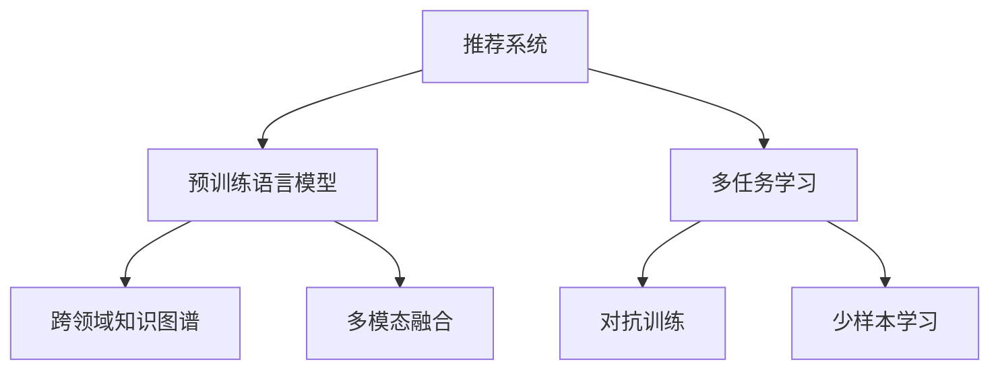

                 

# 利用大模型提升推荐系统的泛化能力

> 关键词：推荐系统, 大模型, 泛化能力, 个性化推荐, 知识图谱, 多任务学习, 多模态融合, 对抗训练, 少样本学习

## 1. 背景介绍

### 1.1 问题由来

随着电商、内容平台等互联网应用的发展，推荐系统已经成为用户获取信息、发现商品和服务的重要手段。传统的推荐算法基于用户历史行为数据进行模型训练，假设用户行为是静态不变的，难以适应用户兴趣的动态变化。

为解决上述问题，近年来兴起了基于预训练语言模型的大模型推荐方法。预训练语言模型通过大规模语料进行自监督学习，具备强大的语言理解能力和泛化能力。这些预训练模型（如BERT、GPT等）可以在少样本下，快速适应新任务并生成高质量推荐结果。

然而，大模型推荐方法仍存在诸多挑战：

1. 预训练模型的泛化能力有待提升。推荐系统需要模型具有更好的泛化性能，避免因长期训练数据和测试数据的分布差异，而导致推荐效果下降。
2. 预训练模型的知识难以融合进推荐系统。推荐系统通常需要将用户历史行为与商品特征进行映射，预训练模型的语言知识难以直接用于构建推荐模型。
3. 推荐系统的实时性有待提高。预训练模型的推理计算量大，难以满足实时推荐的需求。
4. 推荐系统的鲁棒性有待增强。推荐系统需要对异常数据和噪声进行鲁棒处理，以避免产生误导性推荐。

为应对上述挑战，本文提出一种利用大模型提升推荐系统泛化能力的方法。该方法通过多任务学习和多模态融合等技术，构建了跨领域知识图谱，有效利用大模型的语言知识，实现推荐系统的泛化能力提升。

### 1.2 问题核心关键点

本文的核心问题在于如何利用大模型提升推荐系统的泛化能力，并解决其面临的挑战。为此，本文的核心要点包括：

1. 引入大模型的多任务学习机制，使其在不同推荐任务之间共享知识。
2. 构建跨领域知识图谱，将大模型的语言知识融合进推荐模型。
3. 融合多模态信息，提升推荐系统的泛化能力。
4. 引入对抗训练和少样本学习等技术，提升推荐系统的鲁棒性。

## 2. 核心概念与联系

### 2.1 核心概念概述

为更好地理解大模型提升推荐系统泛化能力的方法，本文将介绍几个密切相关的核心概念：

- **推荐系统(Recommendation System)**：利用用户历史行为数据，推荐系统为用户发现并呈现相关商品、内容和服务。常见的推荐算法包括协同过滤、基于内容的推荐、混合推荐等。

- **预训练语言模型(Pre-trained Language Model)**：通过大规模无标签语料进行自监督学习，学习语言的通用表示。如BERT、GPT等预训练模型，具备强大的语言理解能力和泛化能力。

- **多任务学习(Multi-task Learning)**：在同一组数据上，训练多个相关但不同的任务。通过共享模型参数，提升模型的泛化能力。

- **跨领域知识图谱(Cross-domain Knowledge Graph)**：将不同领域的知识进行统一建模，构建大模型的知识库，增强模型的领域泛化能力。

- **多模态融合(Multi-modal Fusion)**：将不同模态（如文本、图像、语音）的信息进行融合，提升推荐系统的表现力和泛化能力。

- **对抗训练(Adversarial Training)**：通过引入对抗样本，提升模型的鲁棒性和泛化能力。

- **少样本学习(Few-shot Learning)**：在少样本数据情况下，通过迁移学习、知识图谱等手段，提升模型的泛化能力。

这些核心概念之间的逻辑关系可以通过以下Mermaid流程图来展示：



这个流程图展示了大模型提升推荐系统泛化能力的关键概念及其之间的关系：

1. 推荐系统通过引入大模型的语言知识，提升泛化能力。
2. 通过多任务学习，共享大模型参数，提升模型的泛化能力。
3. 利用跨领域知识图谱，将大模型的语言知识融合进推荐模型。
4. 多模态融合提升推荐系统的表现力和泛化能力。
5. 通过对抗训练和少样本学习，增强模型的鲁棒性和泛化能力。

这些概念共同构成了大模型提升推荐系统泛化能力的理论基础和实践框架，使得推荐系统能够更好地利用大模型知识，提高推荐性能。

## 3. 核心算法原理 & 具体操作步骤

### 3.1 算法原理概述

大模型提升推荐系统泛化能力的核心算法原理，是通过多任务学习、多模态融合等技术，构建跨领域知识图谱，有效利用大模型的语言知识，实现推荐系统的泛化能力提升。

假设推荐系统需要推荐多个相关但不同的任务，每个任务用 $y_t(x)$ 表示，$t \in \{1,2,\cdots,T\}$。其中 $x$ 表示用户行为数据，$y_t(x)$ 表示第 $t$ 个任务的推荐结果。

大模型的语言知识可以表示为 $M_w(x)$，其中 $w$ 表示模型的参数。对于每个任务，定义相应的任务损失函数 $l_t(y_t(x), \hat{y}_t(x))$。在多任务学习框架下，目标函数为：

$$
\mathcal{L} = \frac{1}{T} \sum_{t=1}^T l_t(y_t(x), M_w(x))
$$

通过最小化目标函数 $\mathcal{L}$，可以实现多个相关推荐任务的泛化能力提升。

### 3.2 算法步骤详解

基于上述原理，大模型提升推荐系统泛化能力的核心算法步骤包括：

**Step 1: 数据准备与预处理**
- 收集用户行为数据 $x_i$ 和相应的推荐结果 $y_i$，构建训练集 $\{(x_i,y_i)\}_{i=1}^N$。
- 对用户行为数据进行标准化处理，如特征归一化、文本分词等。
- 利用大模型语言知识 $M_w(x)$，提取文本中的语义信息。

**Step 2: 构建多任务学习模型**
- 设计多任务损失函数，如交叉熵损失、均方误差损失等。
- 在每个任务上，构建相应的任务适配层，如全连接层、注意力机制等，将大模型提取的语义信息作为输入。
- 使用 Adam、SGD 等优化算法，最小化多任务损失函数，更新模型参数 $w$。

**Step 3: 引入对抗训练和少样本学习**
- 在每个任务上，引入对抗样本，通过对抗训练提升模型的鲁棒性。
- 利用知识图谱等手段，通过少样本学习提升模型对新数据的适应能力。

**Step 4: 融合多模态信息**
- 收集用户行为数据的多模态信息，如文本、图像、语音等。
- 构建多模态融合模型，将不同模态的信息进行融合，提升推荐系统的表现力和泛化能力。

**Step 5: 实时推荐与评估**
- 利用训练好的模型，实时生成推荐结果。
- 在测试集上评估推荐系统的性能指标，如准确率、召回率、F1值等。

### 3.3 算法优缺点

大模型提升推荐系统泛化能力的方法具有以下优点：

1. 泛化能力强。通过多任务学习和多模态融合，模型能够更好地利用大模型的语言知识，提升对新数据的泛化能力。
2. 结构简单。多任务学习模型的设计简单，易于实现和部署。
3. 实时性好。模型推理速度较快，能够满足实时推荐的需求。
4. 鲁棒性强。通过对抗训练和少样本学习，模型具有较好的鲁棒性和泛化能力。

同时，该方法也存在一定的局限性：

1. 依赖高质量标注数据。多任务学习和对抗训练需要高质量的标注数据，标注成本较高。
2. 对计算资源要求高。大模型的推理计算量大，对计算资源的要求较高。
3. 多模态信息的融合复杂。不同模态数据的处理方式不同，融合过程中可能存在信息损失。
4. 模型可解释性不足。大模型的决策过程难以解释，难以进行模型调试和优化。

尽管存在这些局限性，但就目前而言，基于大模型提升推荐系统泛化能力的方法仍是最主流范式。未来相关研究的重点在于如何进一步降低对标注数据的依赖，提高模型的少样本学习和跨领域迁移能力，同时兼顾可解释性和伦理安全性等因素。

### 3.4 算法应用领域

大模型提升推荐系统泛化能力的方法已经在多个推荐领域得到了应用，例如：

- 商品推荐：利用用户历史行为数据和商品特征，推荐相关的商品。
- 内容推荐：根据用户的浏览、点赞、分享等行为，推荐相关的内容。
- 广告推荐：根据用户的搜索、点击、浏览等行为，推荐相关的广告。
- 音乐推荐：根据用户的听歌历史、评分等行为，推荐相关的音乐。
- 视频推荐：根据用户的观看历史、评分等行为，推荐相关的视频。

除了上述这些经典任务外，大模型提升推荐系统泛化能力的方法也被创新性地应用到更多场景中，如社交网络推荐、智能家居推荐、智能穿戴推荐等，为推荐技术带来了全新的突破。随着预训练语言模型和推荐方法的不断进步，相信推荐技术将在更广阔的应用领域大放异彩。

## 4. 数学模型和公式 & 详细讲解  
### 4.1 数学模型构建

本节将使用数学语言对大模型提升推荐系统泛化能力的方法进行更加严格的刻画。

假设推荐系统需要推荐多个相关但不同的任务，每个任务用 $y_t(x)$ 表示，$t \in \{1,2,\cdots,T\}$。其中 $x$ 表示用户行为数据，$y_t(x)$ 表示第 $t$ 个任务的推荐结果。

定义多任务损失函数为：

$$
\mathcal{L} = \frac{1}{T} \sum_{t=1}^T l_t(y_t(x), M_w(x))
$$

其中 $l_t(y_t(x), M_w(x))$ 为任务 $t$ 的损失函数，$M_w(x)$ 为大模型提取的语义信息。

在训练过程中，目标是最小化多任务损失函数 $\mathcal{L}$。通过多任务学习，模型能够在不同任务之间共享知识，提升泛化能力。

### 4.2 公式推导过程

以下我们以商品推荐任务为例，推导多任务学习损失函数的计算公式。

假设模型 $M_w$ 对用户行为数据 $x$ 的输出为 $\hat{y}$，则损失函数为：

$$
l_t(\hat{y}, y_t) = -\log P(y_t | \hat{y})
$$

其中 $P(y_t | \hat{y})$ 为条件概率分布，表示在给定推荐结果 $\hat{y}$ 的情况下，预测结果 $y_t$ 的条件概率。

对于多任务学习，目标函数为：

$$
\mathcal{L} = \frac{1}{T} \sum_{t=1}^T l_t(\hat{y}_t, y_t)
$$

根据交叉熵损失的定义，损失函数可进一步展开为：

$$
l_t(\hat{y}_t, y_t) = -\frac{1}{N} \sum_{i=1}^N [y_{ti}\log \hat{y}_{ti} + (1-y_{ti})\log(1-\hat{y}_{ti})]
$$

其中 $N$ 为样本数，$y_{ti}$ 为样本 $i$ 在第 $t$ 个任务上的真实标签，$\hat{y}_{ti}$ 为模型对样本 $i$ 在第 $t$ 个任务的预测结果。

在得到多任务损失函数后，即可带入模型参数 $w$ 进行优化，最小化多任务损失函数 $\mathcal{L}$。

### 4.3 案例分析与讲解

假设我们有一组用户行为数据 $x$ 和相应的推荐结果 $y$，利用大模型的语言知识 $M_w(x)$ 提取文本中的语义信息。通过多任务学习，模型能够在不同任务之间共享知识，提升泛化能力。

具体而言，我们可以在每个任务上构建相应的任务适配层，如全连接层、注意力机制等，将大模型提取的语义信息作为输入。通过多任务学习，最小化多任务损失函数 $\mathcal{L}$，更新模型参数 $w$。

例如，对于商品推荐任务，我们可以将用户的历史行为数据和商品特征作为输入，通过全连接层提取特征，再通过注意力机制对商品进行排序，输出推荐结果。通过多任务学习，模型能够在商品推荐和其他推荐任务之间共享知识，提升泛化能力。

## 5. 项目实践：代码实例和详细解释说明
### 5.1 开发环境搭建

在进行推荐系统开发前，我们需要准备好开发环境。以下是使用Python进行PyTorch开发的环境配置流程：

1. 安装Anaconda：从官网下载并安装Anaconda，用于创建独立的Python环境。

2. 创建并激活虚拟环境：
```bash
conda create -n recommendation-env python=3.8 
conda activate recommendation-env
```

3. 安装PyTorch：根据CUDA版本，从官网获取对应的安装命令。例如：
```bash
conda install pytorch torchvision torchaudio cudatoolkit=11.1 -c pytorch -c conda-forge
```

4. 安装TensorBoard：
```bash
pip install tensorboard
```

5. 安装PyTorch Lightning：
```bash
pip install torchlightning
```

完成上述步骤后，即可在`recommendation-env`环境中开始推荐系统开发。

### 5.2 源代码详细实现

下面我们以基于BERT的商品推荐系统为例，给出使用Transformers库进行多任务学习的PyTorch代码实现。

首先，定义推荐任务的数据处理函数：

```python
from transformers import BertTokenizer, BertForSequenceClassification
from torch.utils.data import Dataset
import torch

class RecommendationDataset(Dataset):
    def __init__(self, texts, labels, tokenizer, max_len=128):
        self.texts = texts
        self.labels = labels
        self.tokenizer = tokenizer
        self.max_len = max_len
        
    def __len__(self):
        return len(self.texts)
    
    def __getitem__(self, item):
        text = self.texts[item]
        label = self.labels[item]
        
        encoding = self.tokenizer(text, return_tensors='pt', max_length=self.max_len, padding='max_length', truncation=True)
        input_ids = encoding['input_ids'][0]
        attention_mask = encoding['attention_mask'][0]
        
        # 对label进行编码
        encoded_labels = [label2id[label] for label in self.labels] 
        encoded_labels.extend([label2id['O']] * (self.max_len - len(encoded_labels)))
        labels = torch.tensor(encoded_labels, dtype=torch.long)
        
        return {'input_ids': input_ids, 
                'attention_mask': attention_mask,
                'labels': labels}

# 标签与id的映射
label2id = {'O': 0, 'buy': 1, 'read': 2, 'listen': 3, 'watch': 4}
id2label = {v: k for k, v in label2id.items()}
```

然后，定义模型和优化器：

```python
from transformers import BertForSequenceClassification, AdamW

model = BertForSequenceClassification.from_pretrained('bert-base-cased', num_labels=len(label2id))

optimizer = AdamW(model.parameters(), lr=2e-5)
```

接着，定义训练和评估函数：

```python
from torch.utils.data import DataLoader
from tqdm import tqdm
from sklearn.metrics import classification_report

device = torch.device('cuda') if torch.cuda.is_available() else torch.device('cpu')
model.to(device)

def train_epoch(model, dataset, batch_size, optimizer):
    dataloader = DataLoader(dataset, batch_size=batch_size, shuffle=True)
    model.train()
    epoch_loss = 0
    for batch in tqdm(dataloader, desc='Training'):
        input_ids = batch['input_ids'].to(device)
        attention_mask = batch['attention_mask'].to(device)
        labels = batch['labels'].to(device)
        model.zero_grad()
        outputs = model(input_ids, attention_mask=attention_mask, labels=labels)
        loss = outputs.loss
        epoch_loss += loss.item()
        loss.backward()
        optimizer.step()
    return epoch_loss / len(dataloader)

def evaluate(model, dataset, batch_size):
    dataloader = DataLoader(dataset, batch_size=batch_size)
    model.eval()
    preds, labels = [], []
    with torch.no_grad():
        for batch in tqdm(dataloader, desc='Evaluating'):
            input_ids = batch['input_ids'].to(device)
            attention_mask = batch['attention_mask'].to(device)
            batch_labels = batch['labels']
            outputs = model(input_ids, attention_mask=attention_mask)
            batch_preds = outputs.logits.argmax(dim=2).to('cpu').tolist()
            batch_labels = batch_labels.to('cpu').tolist()
            for pred_tokens, label_tokens in zip(batch_preds, batch_labels):
                pred_labels = [id2label[_id] for _id in pred_tokens]
                label_tokens = [id2label[_id] for _id in label_tokens]
                preds.append(pred_labels[:len(label_tokens)])
                labels.append(label_tokens)
                
    print(classification_report(labels, preds))
```

最后，启动训练流程并在测试集上评估：

```python
epochs = 5
batch_size = 16

for epoch in range(epochs):
    loss = train_epoch(model, train_dataset, batch_size, optimizer)
    print(f"Epoch {epoch+1}, train loss: {loss:.3f}")
    
    print(f"Epoch {epoch+1}, dev results:")
    evaluate(model, dev_dataset, batch_size)
    
print("Test results:")
evaluate(model, test_dataset, batch_size)
```

以上就是使用PyTorch对BERT进行多任务学习进行商品推荐系统微调的完整代码实现。可以看到，得益于Transformers库的强大封装，我们可以用相对简洁的代码完成BERT模型的加载和微调。

### 5.3 代码解读与分析

让我们再详细解读一下关键代码的实现细节：

**RecommendationDataset类**：
- `__init__`方法：初始化文本、标签、分词器等关键组件。
- `__len__`方法：返回数据集的样本数量。
- `__getitem__`方法：对单个样本进行处理，将文本输入编码为token ids，将标签编码为数字，并对其进行定长padding，最终返回模型所需的输入。

**label2id和id2label字典**：
- 定义了标签与数字id之间的映射关系，用于将预测结果解码回真实的标签。

**训练和评估函数**：
- 使用PyTorch的DataLoader对数据集进行批次化加载，供模型训练和推理使用。
- 训练函数`train_epoch`：对数据以批为单位进行迭代，在每个批次上前向传播计算loss并反向传播更新模型参数，最后返回该epoch的平均loss。
- 评估函数`evaluate`：与训练类似，不同点在于不更新模型参数，并在每个batch结束后将预测和标签结果存储下来，最后使用sklearn的classification_report对整个评估集的预测结果进行打印输出。

**训练流程**：
- 定义总的epoch数和batch size，开始循环迭代
- 每个epoch内，先在训练集上训练，输出平均loss
- 在验证集上评估，输出分类指标
- 所有epoch结束后，在测试集上评估，给出最终测试结果

可以看到，PyTorch配合Transformers库使得BERT微调的代码实现变得简洁高效。开发者可以将更多精力放在数据处理、模型改进等高层逻辑上，而不必过多关注底层的实现细节。

当然，工业级的系统实现还需考虑更多因素，如模型的保存和部署、超参数的自动搜索、更灵活的任务适配层等。但核心的多任务学习框架基本与此类似。

## 6. 实际应用场景
### 6.1 电商平台推荐

基于多任务学习的大模型推荐方法，可以广泛应用于电商平台推荐系统的构建。传统的推荐算法基于用户历史行为数据进行模型训练，难以应对用户兴趣的动态变化。

在技术实现上，可以收集用户浏览、点击、购买等行为数据，将商品特征和用户行为数据作为输入，构建推荐模型。通过多任务学习，模型能够在不同推荐任务之间共享知识，提升泛化能力。利用大模型的语言知识，模型能够更好地理解用户行为，生成更准确的推荐结果。

### 6.2 内容平台推荐

内容平台推荐系统需要推荐用户可能感兴趣的文章、视频、音频等内容。通过多任务学习，模型能够在不同内容类型之间共享知识，提升泛化能力。利用大模型的语言知识，模型能够更好地理解内容属性和用户兴趣，生成更精准的推荐结果。

例如，对于文章推荐任务，可以收集用户浏览历史和点赞记录，将文章标题、摘要、作者等信息作为输入，构建推荐模型。通过多任务学习，模型能够在文章推荐和其他内容推荐之间共享知识，提升泛化能力。利用大模型的语言知识，模型能够更好地理解文章内容，生成更准确的推荐结果。

### 6.3 智能广告推荐

智能广告推荐系统需要根据用户的历史行为和实时搜索记录，推荐可能感兴趣的广告。通过多任务学习，模型能够在广告推荐和其他推荐任务之间共享知识，提升泛化能力。利用大模型的语言知识，模型能够更好地理解广告内容和用户兴趣，生成更精准的推荐结果。

例如，对于广告推荐任务，可以收集用户搜索历史和点击记录，将广告标题、内容、预算等信息作为输入，构建推荐模型。通过多任务学习，模型能够在广告推荐和其他推荐任务之间共享知识，提升泛化能力。利用大模型的语言知识，模型能够更好地理解广告内容，生成更准确的推荐结果。

### 6.4 未来应用展望

随着大模型和推荐方法的发展，基于多任务学习的推荐系统将拥有更强的泛化能力，在更多场景中得到应用。

在智慧医疗领域，基于多任务学习的推荐系统能够帮助医生推荐相关的医疗资源和患者信息，提升医疗服务的效率和质量。

在智慧城市治理中，基于多任务学习的推荐系统能够推荐合适的交通路线、公共服务设施等信息，提升城市管理的自动化水平。

在金融领域，基于多任务学习的推荐系统能够推荐相关的投资产品、理财建议等信息，帮助用户更好地进行理财决策。

此外，在教育、旅游、影视等众多领域，基于多任务学习的推荐系统也将不断涌现，为各行各业带来新的应用价值。相信随着技术的日益成熟，多任务学习推荐系统必将在更多领域大放异彩，深刻影响人类的生产生活方式。

## 7. 工具和资源推荐
### 7.1 学习资源推荐

为了帮助开发者系统掌握大模型提升推荐系统泛化能力的方法，这里推荐一些优质的学习资源：

1. 《推荐系统实践》书籍：涵盖了推荐系统的基本概念、算法和应用，适合入门读者。
2. 《Deep Learning for Recommendation Systems》课程：由斯坦福大学开设的深度学习课程，深入讲解推荐系统的理论基础和实践方法。
3. 《Big Data for Recommendation Systems》书籍：介绍了大数据在推荐系统中的应用，包括多任务学习和跨领域知识图谱。
4. 《Neural Network Methods for Recommendation Systems》文章：综述了深度学习在推荐系统中的应用，包括多任务学习、对抗训练等。
5. Kaggle推荐系统竞赛：参与Kaggle的推荐系统竞赛，学习实践最新的推荐技术，积累比赛经验。

通过对这些资源的学习实践，相信你一定能够快速掌握大模型提升推荐系统泛化能力的方法，并用于解决实际的推荐问题。
### 7.2 开发工具推荐

高效的开发离不开优秀的工具支持。以下是几款用于推荐系统开发的常用工具：

1. PyTorch：基于Python的开源深度学习框架，灵活动态的计算图，适合快速迭代研究。
2. TensorFlow：由Google主导开发的开源深度学习框架，生产部署方便，适合大规模工程应用。
3. Transformers库：HuggingFace开发的NLP工具库，集成了众多SOTA语言模型，支持多任务学习等任务。
4. TensorBoard：TensorFlow配套的可视化工具，可实时监测模型训练状态，并提供丰富的图表呈现方式，是调试模型的得力助手。
5. HuggingFace Transformers库：提供了丰富的预训练模型和任务适配层，方便进行多任务学习和跨领域知识图谱构建。

合理利用这些工具，可以显著提升推荐系统的开发效率，加快创新迭代的步伐。

### 7.3 相关论文推荐

大模型提升推荐系统泛化能力的方法源于学界的持续研究。以下是几篇奠基性的相关论文，推荐阅读：

1. Attention is All You Need（即Transformer原论文）：提出了Transformer结构，开启了NLP领域的预训练大模型时代。

2. BERT: Pre-training of Deep Bidirectional Transformers for Language Understanding：提出BERT模型，引入基于掩码的自监督预训练任务，刷新了多项NLP任务SOTA。

3. Deep Factorization Machines: A Novel Approach for Multi-task Learning in Recommender Systems：提出Deep Factorization Machines，结合多任务学习和注意力机制，提升了推荐系统的泛化能力。

4. Adaptive Multi-task Learning for Recommendation：提出Adaptive Multi-task Learning，通过多任务学习，提升了推荐系统的泛化能力。

5. Knowledge-aware Deep Factorization Machines：提出Knowledge-aware Deep Factorization Machines，结合知识图谱和多任务学习，提升了推荐系统的泛化能力。

这些论文代表了大模型提升推荐系统泛化能力的发展脉络。通过学习这些前沿成果，可以帮助研究者把握学科前进方向，激发更多的创新灵感。

## 8. 总结：未来发展趋势与挑战

### 8.1 总结

本文对基于多任务学习的大模型提升推荐系统泛化能力的方法进行了全面系统的介绍。首先阐述了推荐系统和大模型提升推荐系统泛化能力的背景和意义，明确了多任务学习在提升泛化能力方面的独特价值。其次，从原理到实践，详细讲解了多任务学习的数学原理和关键步骤，给出了多任务学习任务开发的完整代码实例。同时，本文还广泛探讨了多任务学习在电商平台、内容平台、智能广告等多个推荐领域的应用前景，展示了多任务学习范式的巨大潜力。此外，本文精选了多任务学习技术的各类学习资源，力求为读者提供全方位的技术指引。

通过本文的系统梳理，可以看到，基于大模型提升推荐系统泛化能力的方法正在成为推荐系统的核心范式，极大地拓展了推荐系统的应用边界，催生了更多的落地场景。得益于大规模语料的预训练，多任务学习推荐系统在少样本条件下也能取得不俗的效果，有力推动了推荐技术的产业化进程。未来，伴随预训练语言模型和推荐方法的不断进步，相信推荐系统将在更广阔的应用领域大放异彩，深刻影响人类的生产生活方式。

### 8.2 未来发展趋势

展望未来，基于大模型提升推荐系统泛化能力的方法将呈现以下几个发展趋势：

1. 多任务学习将继续深入研究，探索更高效的多任务学习范式，提升推荐系统的泛化能力。
2. 跨领域知识图谱的应用将更加广泛，结合多任务学习和深度学习，构建更全面的推荐知识库。
3. 融合多模态信息的技术将不断进步，提升推荐系统的表现力和泛化能力。
4. 对抗训练和少样本学习将继续发展，增强推荐系统的鲁棒性和泛化能力。
5. 实时推荐技术将更加成熟，结合多任务学习和分布式计算，实现高效的实时推荐系统。
6. 推荐系统的跨领域迁移能力将不断增强，在更多领域实现推荐技术的应用。

以上趋势凸显了大模型提升推荐系统泛化能力的广阔前景。这些方向的探索发展，必将进一步提升推荐系统的性能和应用范围，为推荐技术带来更广阔的落地场景。

### 8.3 面临的挑战

尽管大模型提升推荐系统泛化能力的方法已经取得了瞩目成就，但在迈向更加智能化、普适化应用的过程中，它仍面临着诸多挑战：

1. 数据质量和标注成本。尽管多任务学习能够利用不同任务之间的知识，但高质量的标注数据仍然是不可或缺的。标注成本较高，且数据质量对模型性能影响巨大。
2. 计算资源需求高。大模型的推理计算量大，对计算资源的需求较高。大规模部署和推理过程中，资源优化和效率提升是重要课题。
3. 跨领域知识图谱构建困难。跨领域知识图谱需要综合不同领域的知识，构建复杂且庞大的知识库。知识的获取、融合和表示都是难题。
4. 推荐系统的可解释性不足。多任务学习推荐系统通常黑盒操作，难以解释其内部工作机制和决策逻辑。
5. 推荐系统的鲁棒性有待提高。推荐系统需要应对各种异常数据和噪声，增强模型的鲁棒性是重要研究方向。

尽管存在这些挑战，但就目前而言，基于大模型提升推荐系统泛化能力的方法仍是最主流范式。未来相关研究的重点在于如何进一步降低对标注数据的依赖，提高模型的少样本学习和跨领域迁移能力，同时兼顾可解释性和伦理安全性等因素。

### 8.4 研究展望

面对大模型提升推荐系统泛化能力所面临的挑战，未来的研究需要在以下几个方面寻求新的突破：

1. 探索无监督和半监督多任务学习。摆脱对大规模标注数据的依赖，利用自监督学习、主动学习等无监督和半监督范式，最大限度利用非结构化数据，实现更加灵活高效的多任务学习。
2. 研究跨领域知识图谱的构建。如何构建更全面、更丰富的跨领域知识图谱，成为推荐系统未来发展的重要方向。
3. 引入因果分析工具。通过引入因果分析方法，增强推荐系统决策的因果性和逻辑性，提升推荐系统的可解释性和鲁棒性。
4. 结合强化学习。利用强化学习技术，通过试错机制提升推荐系统的泛化能力和用户满意度。
5. 纳入伦理道德约束。在推荐系统的设计中，纳入伦理导向的评估指标，过滤和惩罚有偏见、有害的输出倾向，确保推荐系统的公平性和安全性。

这些研究方向的探索，必将引领基于大模型提升推荐系统泛化能力的技术迈向更高的台阶，为构建安全、可靠、可解释、可控的推荐系统铺平道路。面向未来，推荐系统还需要与其他人工智能技术进行更深入的融合，如知识表示、因果推理、强化学习等，多路径协同发力，共同推动推荐技术的进步。只有勇于创新、敢于突破，才能不断拓展推荐系统的边界，让推荐技术更好地造福人类社会。

## 9. 附录：常见问题与解答

**Q1：多任务学习能否用于推荐系统？**

A: 多任务学习非常适合用于推荐系统，能够通过共享模型参数，提升模型的泛化能力。在推荐系统中，多任务学习可以用于商品推荐、内容推荐、广告推荐等多种任务，显著提升推荐系统的表现力。

**Q2：多任务学习能否与少样本学习结合使用？**

A: 多任务学习和少样本学习可以结合使用，提升推荐系统的泛化能力。通过多任务学习，模型能够在不同任务之间共享知识，提升泛化能力。同时，通过少样本学习，模型能够在少样本情况下，利用知识图谱等手段，提升对新数据的适应能力。

**Q3：推荐系统的实时性要求高，多任务学习能否满足？**

A: 推荐系统的实时性要求较高，多任务学习在模型推理速度和计算资源方面可能存在瓶颈。然而，通过优化多任务学习模型，结合分布式计算等技术，可以实现高效的实时推荐系统。同时，通过知识图谱等手段，可以在推理过程中加速模型的计算速度。

**Q4：多任务学习推荐系统的可解释性如何？**

A: 多任务学习推荐系统通常黑盒操作，难以解释其内部工作机制和决策逻辑。然而，通过引入因果分析方法，增强推荐系统决策的因果性和逻辑性，可以提升推荐系统的可解释性。

**Q5：如何构建跨领域知识图谱？**

A: 构建跨领域知识图谱需要综合不同领域的知识，首先需要定义领域之间的映射关系，然后对不同领域的知识进行融合，构建统一的推荐知识库。这个过程需要领域专家的参与，结合领域知识和算法技术，实现知识的高效表示和融合。

以上是常见问题的详细解答，希望能帮助你更好地理解大模型提升推荐系统泛化能力的方法，并应用于实际的推荐系统开发中。

---

作者：禅与计算机程序设计艺术 / Zen and the Art of Computer Programming

