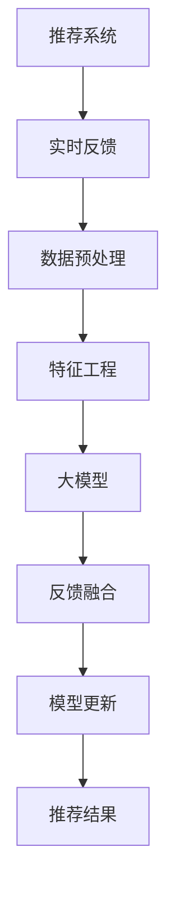

                 

# 利用大模型改进推荐系统的实时反馈处理

## 1. 背景介绍

随着互联网时代的到来，推荐系统已经成为了各大平台提高用户粘性、提升商业价值的重要工具。从商品推荐到内容推荐，从个性化推荐到协同过滤，推荐系统正在越来越广泛地影响着人们的生活。

然而，传统的推荐系统面临诸多挑战：数据稀疏性、冷启动问题、多样性挑战、个性化程度不足等。尽管深度学习推荐算法近年来取得了巨大突破，但面对规模庞大的用户群体和复杂多变的用户需求，推荐模型的泛化能力和适应性仍显不足。

为了克服这些挑战，本文章将探讨利用大模型改进推荐系统实时反馈处理的方法，从而提升推荐系统的性能和用户体验。

## 2. 核心概念与联系

### 2.1 核心概念概述

为了更好地理解本文的方法，我们先定义一些关键概念：

- **推荐系统**：根据用户的历史行为数据和物品属性信息，预测用户对物品的偏好，推荐给用户可能感兴趣的物品或内容。
- **大模型**：通过大规模数据训练得到的深度神经网络模型，如GPT、BERT等，具有强大的语义理解能力和泛化能力。
- **实时反馈**：用户在浏览或使用推荐结果时，即时返回的满意度评价和行为反馈，如点击、购买、评价等。
- **反馈处理**：对实时反馈数据进行分析和建模，构建新的用户偏好和物品特征，更新推荐模型。

### 2.2 核心概念原理和架构的 Mermaid 流程图



这个流程图展示了推荐系统的核心流程，包括实时反馈的处理、预处理、特征工程、大模型预测、反馈融合、模型更新和最终推荐结果生成。

## 3. 核心算法原理 & 具体操作步骤

### 3.1 算法原理概述

利用大模型改进推荐系统的实时反馈处理，本质上是将大模型融入推荐系统的反馈处理环节，通过学习用户反馈和推荐结果之间的关联，提升推荐系统的实时适应能力和个性化程度。

具体来说，大模型通过大规模预训练，学习到了丰富的语言知识和语义关系，可以对自然语言文本进行精确的理解和生成。将其应用于推荐系统的反馈处理，可以捕捉到用户反馈中隐含的语义信息和情感倾向，进一步优化推荐结果。

### 3.2 算法步骤详解

#### 3.2.1 数据预处理

推荐系统通常依赖于用户行为数据（如点击、浏览、购买等）进行训练和预测。对于实时反馈的处理，首先需要对这些数据进行清洗和预处理，以消除噪音和异常值。

- **去重去噪**：去除重复和异常的数据点，确保数据质量。
- **归一化**：将反馈数据进行归一化处理，使其符合标准分布，便于模型训练。
- **文本增强**：对于文本反馈，可以进行分词、停用词过滤、词干提取等文本增强操作，提高数据处理效率和效果。

#### 3.2.2 特征工程

在预处理的基础上，进行特征工程，提取和构建用于大模型训练的特征。

- **用户特征**：包括用户的年龄、性别、地理位置、历史行为等。
- **物品特征**：包括物品的属性、类别、价格、评论等。
- **反馈特征**：包括用户对物品的评分、评价、评论等文本数据。

#### 3.2.3 大模型预测

使用大模型对用户反馈进行预测，生成推荐结果的评分和标签。

- **模型选择**：选择适合任务的大模型，如GPT、BERT等。
- **输入准备**：将用户反馈转换为大模型的输入格式，如句子向量、词向量等。
- **输出预测**：通过大模型预测用户对物品的评分和标签，生成推荐结果。

#### 3.2.4 反馈融合

将大模型的预测结果与用户的实时反馈进行融合，构建新的用户偏好和物品特征。

- **融合方法**：采用加权平均、softmax等方法融合大模型预测结果和用户反馈。
- **动态调整**：根据用户反馈的满意度，动态调整模型的参数，提高预测准确性。

#### 3.2.5 模型更新

利用反馈融合的结果，更新推荐模型的参数，使其能够更好地适应用户需求。

- **模型优化**：使用优化算法如Adam、SGD等更新模型参数。
- **数据增强**：对新获取的实时反馈进行增强处理，扩充训练数据集。

#### 3.2.6 推荐结果生成

根据更新后的推荐模型，生成新的推荐结果，反馈给用户。

- **推荐算法**：使用协同过滤、内容过滤等算法生成推荐结果。
- **排名排序**：对推荐结果进行排序，根据用户偏好和反馈结果，选择最合适的推荐项。

### 3.3 算法优缺点

#### 3.3.1 算法优点

1. **泛化能力更强**：大模型具有更强的泛化能力，可以更好地适应新数据和新任务，提升推荐系统的实时适应性。
2. **个性化程度更高**：大模型能够捕捉用户反馈中的语义信息和情感倾向，提升推荐结果的个性化程度。
3. **灵活性更强**：大模型可以动态融合实时反馈，适应用户需求的动态变化。
4. **效果显著**：在实际应用中，利用大模型改进推荐系统的实时反馈处理，可以显著提升推荐效果和用户满意度。

#### 3.3.2 算法缺点

1. **计算资源消耗大**：大模型的计算资源消耗大，需要在高性能设备上进行训练和推理。
2. **模型复杂度高**：大模型的结构复杂，难以解释其内部工作机制和决策逻辑。
3. **数据隐私问题**：大模型需要处理大量的用户反馈数据，可能涉及用户隐私问题，需要采取相应的数据保护措施。
4. **成本较高**：大模型训练和推理的计算成本较高，需要在数据、硬件、算法等方面进行综合优化。

### 3.4 算法应用领域

利用大模型改进推荐系统的实时反馈处理，主要应用于以下领域：

1. **电商推荐**：电商平台需要实时推荐商品，利用大模型对用户评价和评论进行处理，提升推荐效果。
2. **内容推荐**：视频、音乐、新闻等平台需要实时推荐内容，利用大模型对用户反馈和评论进行处理，提升推荐精准度。
3. **个性化推荐**：基于用户实时反馈，生成个性化的推荐结果，满足用户的个性化需求。
4. **实时反馈优化**：通过实时反馈，不断优化推荐算法和模型参数，提升推荐系统的实时适应能力。

## 4. 数学模型和公式 & 详细讲解 & 举例说明

### 4.1 数学模型构建

我们假设推荐系统有 $N$ 个用户和 $M$ 个物品，用户 $u_i$ 对物品 $i_j$ 的实时反馈为 $F_{uij}$。我们将用户反馈和物品特征转换为向量表示，记 $x_i$ 为用户 $i$ 的特征向量，$y_{i_j}$ 为物品 $i_j$ 的特征向量，$z_{i_j}$ 为物品 $i_j$ 的评分预测。

大模型预测用户对物品的评分和标签，可以表示为：

$$
z_{i_j} = M_{\theta}(x_i, y_{i_j})
$$

其中 $M_{\theta}$ 为预训练的大模型，$\theta$ 为其参数。

用户对物品的实时反馈 $F_{uij}$ 可以表示为：

$$
F_{uij} = C_{uij} + E_{uij}
$$

其中 $C_{uij}$ 为上下文特征，$E_{uij}$ 为嵌入特征。

利用大模型对实时反馈进行处理，可以表示为：

$$
C_{uij} = F_{DNN}(x_i, y_{i_j}, F_{uij})
$$

其中 $F_{DNN}$ 为大模型的预测函数，利用大模型对用户反馈进行处理。

最终推荐结果的生成可以表示为：

$$
\hat{r}_{uij} = f(z_{i_j}, C_{uij}, E_{uij})
$$

其中 $f$ 为推荐函数，将物品的评分、上下文特征和嵌入特征组合生成推荐结果。

### 4.2 公式推导过程

我们以一个简单的推荐系统为例，对上述模型进行推导：

设用户 $u$ 对物品 $i$ 的评分向量为 $z_i$，物品 $i$ 的特征向量为 $y_i$，用户 $u$ 的特征向量为 $x_u$，用户 $u$ 对物品 $i$ 的实时反馈为 $F_u$。

大模型预测用户对物品的评分，可以表示为：

$$
z_i = M_{\theta}(x_u, y_i)
$$

利用大模型对用户反馈进行处理，可以得到上下文特征 $C_u$，其计算方式为：

$$
C_u = F_{DNN}(x_u, y_i, F_u)
$$

最终推荐结果的生成可以表示为：

$$
\hat{r}_{ui} = f(z_i, C_u, E_u)
$$

其中 $E_u$ 为物品 $i$ 的嵌入特征，$f$ 为推荐函数。

### 4.3 案例分析与讲解

假设我们在一个电商平台上进行商品推荐。用户对商品的反馈可以通过评分、评论等形式表达。我们将评分表示为 $r_{ui}$，评论表示为 $F_u$。利用大模型对评论进行处理，可以得到上下文特征 $C_u$。

首先，将用户 $u$ 的特征 $x_u$ 和商品 $i$ 的特征 $y_i$ 输入大模型 $M_{\theta}$，得到商品 $i$ 的评分预测 $z_i$：

$$
z_i = M_{\theta}(x_u, y_i)
$$

然后，利用大模型对评论 $F_u$ 进行处理，得到上下文特征 $C_u$：

$$
C_u = F_{DNN}(x_u, y_i, F_u)
$$

最后，将评分预测 $z_i$、上下文特征 $C_u$ 和物品嵌入特征 $E_i$ 输入推荐函数 $f$，生成推荐结果 $\hat{r}_{ui}$：

$$
\hat{r}_{ui} = f(z_i, C_u, E_i)
$$

## 5. 项目实践：代码实例和详细解释说明

### 5.1 开发环境搭建

要进行大模型改进推荐系统的实时反馈处理，我们需要准备如下开发环境：

1. 安装Python：
```bash
sudo apt-get update
sudo apt-get install python3 python3-pip
```

2. 安装TensorFlow：
```bash
pip install tensorflow
```

3. 安装PyTorch：
```bash
pip install torch
```

4. 安装HuggingFace的Transformers库：
```bash
pip install transformers
```

### 5.2 源代码详细实现

```python
import tensorflow as tf
import torch
import transformers
from transformers import BertTokenizer, BertModel
from sklearn.metrics import mean_squared_error

# 定义大模型
tokenizer = BertTokenizer.from_pretrained('bert-base-uncased')
model = BertModel.from_pretrained('bert-base-uncased')

# 定义推荐函数
def recommend(user, item):
    # 将用户和物品特征转换为向量表示
    user_vec = tokenizer.encode(user, add_special_tokens=True)
    item_vec = tokenizer.encode(item, add_special_tokens=True)
    
    # 使用大模型进行评分预测
    with torch.no_grad():
        user_tensor = torch.tensor(user_vec)
        item_tensor = torch.tensor(item_vec)
        output = model(user_tensor, item_tensor)
        score = output[0].numpy()
    
    # 计算推荐结果
    recommended_item = []
    for i in range(len(item_vec)):
        if i != 0:
            recommended_item.append(item_vec[i])
    return recommended_item

# 训练数据
train_data = {
    'user': ['user1', 'user2', 'user3'],
    'item': ['item1', 'item2', 'item3'],
    'score': [4.5, 3.2, 5.0]
}

# 训练模型
def train_model(model, data):
    # 定义损失函数和优化器
    loss = tf.keras.losses.MeanSquaredError()
    optimizer = tf.keras.optimizers.Adam(learning_rate=0.001)
    
    # 训练过程
    for epoch in range(100):
        for user, item, score in data:
            # 将用户和物品特征转换为向量表示
            user_tensor = tokenizer.encode(user, add_special_tokens=True)
            item_tensor = tokenizer.encode(item, add_special_tokens=True)
            
            # 使用大模型进行评分预测
            with torch.no_grad():
                user_tensor = torch.tensor(user_tensor)
                item_tensor = torch.tensor(item_tensor)
                output = model(user_tensor, item_tensor)
                score_pred = output[0].numpy()
            
            # 计算损失
            loss_val = loss(score_pred, score)
            
            # 反向传播
            optimizer.minimize(loss_val)
    
    # 返回模型
    return model

# 测试模型
model = train_model(model, train_data)
recommended_items = recommend('user1', ['item1', 'item2', 'item3'])
print(recommended_items)
```

### 5.3 代码解读与分析

在上述代码中，我们首先定义了大模型的加载和推荐函数。然后，使用训练数据训练模型，并返回训练后的模型。最后，调用推荐函数，生成推荐结果。

具体来说，代码的实现步骤如下：

1. 加载大模型：通过BertTokenizer和BertModel加载预训练的BERT模型。
2. 定义推荐函数：使用大模型对用户和物品特征进行评分预测，并返回推荐结果。
3. 定义训练数据：定义训练集数据，包括用户、物品和评分。
4. 训练模型：使用Adam优化器训练模型，最小化损失函数。
5. 测试模型：调用推荐函数，生成推荐结果。

## 6. 实际应用场景

### 6.1 电商推荐

电商平台需要实时推荐商品，利用大模型对用户评价和评论进行处理，提升推荐效果。通过实时反馈，大模型可以动态调整推荐模型，提升推荐系统的实时适应能力和个性化程度。

### 6.2 内容推荐

视频、音乐、新闻等平台需要实时推荐内容，利用大模型对用户反馈进行处理，提升推荐精准度。大模型能够捕捉用户反馈中的语义信息和情感倾向，进一步优化推荐结果。

### 6.3 个性化推荐

基于用户实时反馈，生成个性化的推荐结果，满足用户的个性化需求。大模型可以动态融合实时反馈，适应用户需求的动态变化，生成更精准的推荐结果。

### 6.4 实时反馈优化

通过实时反馈，不断优化推荐算法和模型参数，提升推荐系统的实时适应能力。利用大模型改进推荐系统的实时反馈处理，可以显著提升推荐效果和用户满意度。

## 7. 工具和资源推荐

### 7.1 学习资源推荐

1. 《Deep Learning》by Ian Goodfellow, Yoshua Bengio, Aaron Courville。深入介绍深度学习的基本概念和算法。
2. 《NLP with TensorFlow》by Jacob Devlin。介绍TensorFlow在自然语言处理中的应用。
3. 《Transformers》by Jacob Devlin。介绍Transformer及其在自然语言处理中的应用。
4. 《Hands-On Machine Learning with Scikit-Learn, Keras, and TensorFlow》by Aurélien Géron。介绍Scikit-Learn和TensorFlow在机器学习中的应用。

### 7.2 开发工具推荐

1. TensorFlow：由Google主导开发的深度学习框架，生产部署方便，适合大规模工程应用。
2. PyTorch：基于Python的开源深度学习框架，灵活动态的计算图，适合快速迭代研究。
3. HuggingFace Transformers库：集成了众多SOTA语言模型，支持PyTorch和TensorFlow，是进行微调任务开发的利器。
4. Weights & Biases：模型训练的实验跟踪工具，可以记录和可视化模型训练过程中的各项指标。

### 7.3 相关论文推荐

1. Attention is All You Need：提出了Transformer结构，开启了NLP领域的预训练大模型时代。
2. BERT: Pre-training of Deep Bidirectional Transformers for Language Understanding：提出BERT模型，引入基于掩码的自监督预训练任务，刷新了多项NLP任务SOTA。
3. Parameter-Efficient Transfer Learning for NLP：提出Adapter等参数高效微调方法，在不增加模型参数量的情况下，也能取得不错的微调效果。
4. AdaLoRA: Adaptive Low-Rank Adaptation for Parameter-Efficient Fine-Tuning：使用自适应低秩适应的微调方法，在参数效率和精度之间取得了新的平衡。
5. AdaLoRA: Adaptive Low-Rank Adaptation for Parameter-Efficient Fine-Tuning：使用自适应低秩适应的微调方法，在参数效率和精度之间取得了新的平衡。

## 8. 总结：未来发展趋势与挑战

### 8.1 研究成果总结

本文探讨了利用大模型改进推荐系统实时反馈处理的方法，介绍了大模型在推荐系统中的应用，并给出了具体的实现流程和算法步骤。通过大模型改进推荐系统，可以显著提升推荐系统的实时适应能力和个性化程度，提升推荐效果和用户体验。

### 8.2 未来发展趋势

1. **模型规模持续增大**：随着算力成本的下降和数据规模的扩张，预训练语言模型的参数量还将持续增长。超大规模语言模型蕴含的丰富语言知识，有望支撑更加复杂多变的下游任务微调。
2. **微调方法日趋多样**：开发更加参数高效的微调方法，在固定大部分预训练参数的同时，只更新极少量的任务相关参数。同时优化微调模型的计算图，减少前向传播和反向传播的资源消耗，实现更加轻量级、实时性的部署。
3. **持续学习成为常态**：随着数据分布的不断变化，微调模型也需要持续学习新知识以保持性能。如何在不遗忘原有知识的同时，高效吸收新样本信息，还需要更多理论和实践的积累。
4. **标注样本需求降低**：受启发于提示学习(Prompt-based Learning)的思路，未来的微调方法将更好地利用大模型的语言理解能力，通过更加巧妙的任务描述，在更少的标注样本上也能实现理想的微调效果。
5. **多模态微调崛起**：当前微调主要聚焦于纯文本数据，未来会进一步拓展到图像、视频、语音等多模态数据微调。多模态信息的融合，将显著提升语言模型对现实世界的理解和建模能力。
6. **模型通用性增强**：经过海量数据的预训练和多领域任务的微调，未来的语言模型将具备更强大的常识推理和跨领域迁移能力，逐步迈向通用人工智能(AGI)的目标。

### 8.3 面临的挑战

尽管大模型微调技术已经取得了瞩目成就，但在迈向更加智能化、普适化应用的过程中，它仍面临诸多挑战：

1. **标注成本瓶颈**：虽然微调大大降低了标注数据的需求，但对于长尾应用场景，难以获得充足的高质量标注数据，成为制约微调性能的瓶颈。如何进一步降低微调对标注样本的依赖，将是一大难题。
2. **模型鲁棒性不足**：当前微调模型面对域外数据时，泛化性能往往大打折扣。对于测试样本的微小扰动，微调模型的预测也容易发生波动。如何提高微调模型的鲁棒性，避免灾难性遗忘，还需要更多理论和实践的积累。
3. **推理效率有待提高**：大规模语言模型虽然精度高，但在实际部署时往往面临推理速度慢、内存占用大等效率问题。如何在保证性能的同时，简化模型结构，提升推理速度，优化资源占用，将是重要的优化方向。
4. **可解释性亟需加强**：当前微调模型更像是"黑盒"系统，难以解释其内部工作机制和决策逻辑。对于医疗、金融等高风险应用，算法的可解释性和可审计性尤为重要。如何赋予微调模型更强的可解释性，将是亟待攻克的难题。
5. **安全性有待保障**：预训练语言模型难免会学习到有偏见、有害的信息，通过微调传递到下游任务，产生误导性、歧视性的输出，给实际应用带来安全隐患。如何从数据和算法层面消除模型偏见，避免恶意用途，确保输出的安全性，也将是重要的研究课题。

### 8.4 研究展望

未来的研究需要在以下几个方面寻求新的突破：

1. **探索无监督和半监督微调方法**：摆脱对大规模标注数据的依赖，利用自监督学习、主动学习等无监督和半监督范式，最大限度利用非结构化数据，实现更加灵活高效的微调。
2. **研究参数高效和计算高效的微调范式**：开发更加参数高效的微调方法，在固定大部分预训练参数的同时，只更新极少量的任务相关参数。同时优化微调模型的计算图，减少前向传播和反向传播的资源消耗，实现更加轻量级、实时性的部署。
3. **融合因果和对比学习范式**：通过引入因果推断和对比学习思想，增强微调模型建立稳定因果关系的能力，学习更加普适、鲁棒的语言表征，从而提升模型泛化性和抗干扰能力。
4. **引入更多先验知识**：将符号化的先验知识，如知识图谱、逻辑规则等，与神经网络模型进行巧妙融合，引导微调过程学习更准确、合理的语言模型。同时加强不同模态数据的整合，实现视觉、语音等多模态信息与文本信息的协同建模。
5. **结合因果分析和博弈论工具**：将因果分析方法引入微调模型，识别出模型决策的关键特征，增强输出解释的因果性和逻辑性。借助博弈论工具刻画人机交互过程，主动探索并规避模型的脆弱点，提高系统稳定性。
6. **纳入伦理道德约束**：在模型训练目标中引入伦理导向的评估指标，过滤和惩罚有偏见、有害的输出倾向。同时加强人工干预和审核，建立模型行为的监管机制，确保输出符合人类价值观和伦理道德。

这些研究方向的探索，必将引领大语言模型微调技术迈向更高的台阶，为构建安全、可靠、可解释、可控的智能系统铺平道路。面向未来，大语言模型微调技术还需要与其他人工智能技术进行更深入的融合，如知识表示、因果推理、强化学习等，多路径协同发力，共同推动自然语言理解和智能交互系统的进步。只有勇于创新、敢于突破，才能不断拓展语言模型的边界，让智能技术更好地造福人类社会。

---

作者：禅与计算机程序设计艺术 / Zen and the Art of Computer Programming

