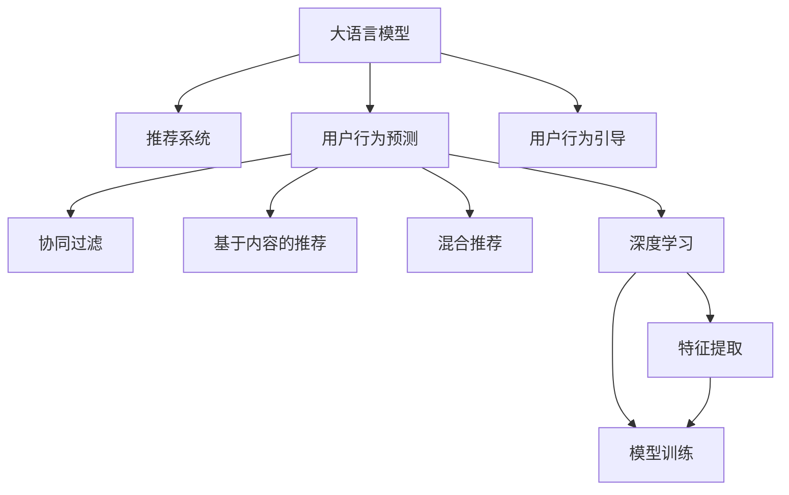

                 

# 利用大模型进行推荐场景的用户行为预测与引导

> 关键词：大语言模型,推荐系统,用户行为预测,用户行为引导,自然语言处理,深度学习

## 1. 背景介绍

在当前数字化时代的背景下，推荐系统已成为各大互联网平台提供个性化服务的关键技术。从电商的购物推荐、视频网站的影片推荐到新闻网站的资讯推荐，推荐系统通过深入分析用户行为数据，帮助用户发现潜在的兴趣点，提升用户体验，提高转化率和留存率。然而，推荐系统也面临着诸如用户行为多样性、数据稀疏性、长尾效应、多维度数据协同等挑战。为此，本文将探讨利用大语言模型进行推荐场景的用户行为预测与引导，以期为推荐系统提供更高效、更智能的解决方案。

## 2. 核心概念与联系

### 2.1 核心概念概述

为更好地理解利用大模型进行推荐系统用户行为预测与引导的方法，本节将介绍几个核心概念及其相互联系：

- 大语言模型(Large Language Model, LLM)：以自回归(如GPT)或自编码(如BERT)模型为代表的大规模预训练语言模型。通过在大规模无标签文本语料上进行预训练，学习通用的语言表示，具备强大的语言理解和生成能力。

- 推荐系统(Recommendation System)：通过分析用户行为数据，推荐符合用户兴趣的产品、内容等服务的系统。主要包括协同过滤、基于内容的推荐、混合推荐等。

- 用户行为预测(User Behavior Prediction)：利用用户历史数据和行为特征，预测用户未来可能采取的行动，如点击、购买、分享等。

- 用户行为引导(User Behavior Guidance)：通过干预用户行为，促使其采取预期的行动，如购买推荐产品、参与互动活动等。

- 自然语言处理(Natural Language Processing, NLP)：利用大语言模型处理文本数据，提取语义信息，进行文本分类、情感分析、实体识别等任务。

- 深度学习(Deep Learning)：通过深度神经网络模型，自动学习数据特征，提升推荐系统性能。

这些概念之间的逻辑关系可以通过以下Mermaid流程图来展示：



这个流程图展示了核心概念的相互关系：

1. 大语言模型通过预训练获得语言理解能力。
2. 推荐系统利用用户行为数据推荐服务。
3. 用户行为预测和引导帮助推荐系统更精准地匹配用户需求。
4. 协同过滤、内容推荐等推荐算法提供具体的推荐策略。
5. 深度学习提供数据自动特征提取和模型训练的支持。

## 3. 核心算法原理 & 具体操作步骤
### 3.1 算法原理概述

利用大语言模型进行推荐场景的用户行为预测与引导，本质上是将用户行为数据转化为自然语言描述，通过大语言模型的预训练和微调，实现对用户未来行为的预测和引导。具体流程包括：

1. 用户行为数据收集：从推荐系统日志、用户浏览记录、购买记录等数据源收集用户行为数据。
2. 数据预处理：对行为数据进行清洗、归一化等预处理，以便大语言模型能够理解。
3. 行为描述生成：将用户行为数据转化为自然语言描述，如“该用户最近浏览了XX商品”、“该用户购买了XX商品”等。
4. 大语言模型微调：利用微调技术，训练大语言模型对行为描述进行理解，预测用户未来行为。
5. 行为引导干预：根据预测结果，设计适当的干预策略，如个性化推荐、广告投放等，引导用户采取预期行为。

### 3.2 算法步骤详解

#### 3.2.1 数据预处理

数据预处理是确保大语言模型有效工作的关键步骤。以下是一个简化的数据预处理流程：

1. **数据清洗**：去除噪音数据、不完整记录等，保留有用信息。
2. **特征提取**：对行为数据进行特征提取，如商品ID、类别、价格等，以便转化为自然语言描述。
3. **归一化**：对特征进行归一化处理，确保数据格式一致。
4. **分词与编码**：将文本数据进行分词，转化为模型能够理解的格式，如Token ID。

#### 3.2.2 行为描述生成

行为描述生成是将用户行为数据转化为自然语言的过程。这一过程需要考虑用户行为的多样性和复杂性，以确保描述的准确性和可理解性。以下是一个行为描述生成的示例：

1. **行为合并**：将同一用户在一段时间内的多个行为合并为一个描述，如将“浏览商品X”和“查看商品Y”合并为“用户X浏览了商品X和Y”。
2. **时序处理**：考虑行为发生的时序关系，如“先浏览商品X，后购买商品Y”。
3. **上下文信息**：结合用户其他行为数据，提供上下文信息，如“该用户经常购买XX商品”。

#### 3.2.3 大语言模型微调

大语言模型微调是利用模型理解行为描述，预测用户未来行为的过程。以下是一个简化的微调流程：

1. **选择合适的预训练模型**：选择如GPT-3、BERT等预训练语言模型，作为微调的基础模型。
2. **设计任务适配层**：根据预测任务设计任务适配层，如分类任务使用线性分类器，生成任务使用解码器。
3. **选择优化器及超参数**：选择合适的优化算法和超参数，如AdamW、L2正则等。
4. **训练模型**：利用标注数据对模型进行微调，最小化预测误差。
5. **评估模型**：在验证集上评估模型性能，调整超参数，直到达到最佳效果。

#### 3.2.4 行为引导干预

行为引导干预是根据预测结果，设计适当的干预策略，引导用户采取预期行为。以下是一个简化的干预策略：

1. **个性化推荐**：根据预测结果，推荐符合用户兴趣的商品或内容。
2. **广告投放**：在用户可能感兴趣的商品或内容上投放广告。
3. **用户互动**：设计互动活动，如问卷调查、话题讨论等，引导用户参与。

### 3.3 算法优缺点

利用大语言模型进行推荐场景的用户行为预测与引导具有以下优点：

1. **灵活性高**：大语言模型具备强大的自然语言处理能力，可以处理多种类型的数据。
2. **数据利用率高**：通过行为描述生成，可以有效利用行为数据，减少数据稀疏性的影响。
3. **可解释性强**：大语言模型可以生成自然语言描述，增强模型的可解释性。
4. **易于集成**：大语言模型与推荐系统、广告投放等系统可以无缝集成。

同时，该方法也存在一定的局限性：

1. **数据质量要求高**：行为描述生成的准确性依赖于数据质量，低质量的数据会导致预测结果不准确。
2. **计算资源消耗大**：大语言模型需要大量计算资源进行训练和推理。
3. **对抗攻击风险**：用户可能生成虚假行为描述，影响模型的预测结果。
4. **用户隐私保护**：行为描述生成和微调涉及用户行为数据，需要考虑隐私保护问题。

### 3.4 算法应用领域

利用大语言模型进行推荐场景的用户行为预测与引导，已经在多个领域得到应用，如：

- 电商推荐：对用户浏览记录进行行为描述，利用大语言模型预测购买意愿，进行个性化推荐。
- 视频推荐：结合用户观看历史，生成行为描述，预测观影行为，进行推荐。
- 新闻推荐：分析用户阅读记录，生成行为描述，预测阅读兴趣，进行内容推荐。
- 社交媒体推荐：结合用户互动数据，生成行为描述，预测用户参与活动的行为，进行推荐。

## 4. 数学模型和公式 & 详细讲解  
### 4.1 数学模型构建

本节将使用数学语言对利用大语言模型进行推荐场景的用户行为预测与引导的数学模型进行详细构建。

记用户行为数据为 $\{x_i, y_i\}_{i=1}^N$，其中 $x_i$ 为行为描述，$y_i$ 为对应行为标签。定义大语言模型为 $M_{\theta}$，其中 $\theta$ 为模型参数。微调的目标是最小化损失函数：

$$
\min_{\theta} \frac{1}{N}\sum_{i=1}^N \ell(M_{\theta}(x_i), y_i)
$$

其中 $\ell$ 为损失函数，如交叉熵损失函数。

### 4.2 公式推导过程

以下我们以二分类任务为例，推导交叉熵损失函数及其梯度的计算公式。

假设模型 $M_{\theta}$ 在输入 $x$ 上的输出为 $\hat{y}=M_{\theta}(x)$，表示用户采取预期行为的概率。真实标签 $y \in \{0,1\}$。则二分类交叉熵损失函数定义为：

$$
\ell(M_{\theta}(x),y) = -[y\log \hat{y} + (1-y)\log (1-\hat{y})]
$$

将其代入损失函数公式，得：

$$
\mathcal{L}(\theta) = -\frac{1}{N}\sum_{i=1}^N [y_i\log M_{\theta}(x_i)+(1-y_i)\log(1-M_{\theta}(x_i))]
$$

根据链式法则，损失函数对参数 $\theta_k$ 的梯度为：

$$
\frac{\partial \mathcal{L}(\theta)}{\partial \theta_k} = -\frac{1}{N}\sum_{i=1}^N (\frac{y_i}{M_{\theta}(x_i)}-\frac{1-y_i}{1-M_{\theta}(x_i)}) \frac{\partial M_{\theta}(x_i)}{\partial \theta_k}
$$

其中 $\frac{\partial M_{\theta}(x_i)}{\partial \theta_k}$ 可进一步递归展开，利用自动微分技术完成计算。

### 4.3 案例分析与讲解

假设某电商网站收集了用户的浏览记录和购买记录，目标是预测用户未来是否会购买某商品。

1. **数据预处理**：收集用户的浏览商品ID、浏览时间、浏览时长、购买商品ID、购买时间、购买价格等数据，清洗并归一化数据。
2. **行为描述生成**：将用户的浏览和购买行为转化为自然语言描述，如“该用户最近浏览了XX商品”、“该用户购买了XX商品”。
3. **大语言模型微调**：选择BERT模型，设计分类任务适配层，以用户行为描述为输入，以购买与否为输出标签，进行微调训练。
4. **行为引导干预**：根据微调后的模型预测结果，推荐符合用户兴趣的商品，或针对未购买的商品投放广告，引导用户购买。

## 5. 项目实践：代码实例和详细解释说明
### 5.1 开发环境搭建

在进行项目实践前，我们需要准备好开发环境。以下是使用Python进行PyTorch开发的环境配置流程：

1. 安装Anaconda：从官网下载并安装Anaconda，用于创建独立的Python环境。

2. 创建并激活虚拟环境：
```bash
conda create -n pytorch-env python=3.8 
conda activate pytorch-env
```

3. 安装PyTorch：根据CUDA版本，从官网获取对应的安装命令。例如：
```bash
conda install pytorch torchvision torchaudio cudatoolkit=11.1 -c pytorch -c conda-forge
```

4. 安装Transformers库：
```bash
pip install transformers
```

5. 安装各类工具包：
```bash
pip install numpy pandas scikit-learn matplotlib tqdm jupyter notebook ipython
```

完成上述步骤后，即可在`pytorch-env`环境中开始项目实践。

### 5.2 源代码详细实现

下面我们以电商推荐为例，给出使用Transformers库对BERT模型进行行为预测与引导的PyTorch代码实现。

首先，定义行为预测任务的数据处理函数：

```python
from transformers import BertTokenizer
from torch.utils.data import Dataset
import torch

class BehaviourDataset(Dataset):
    def __init__(self, behaviours, labels, tokenizer, max_len=128):
        self.behaviours = behaviours
        self.labels = labels
        self.tokenizer = tokenizer
        self.max_len = max_len
        
    def __len__(self):
        return len(self.behaviours)
    
    def __getitem__(self, item):
        behaviour = self.behaviours[item]
        label = self.labels[item]
        
        encoding = self.tokenizer(behaviour, return_tensors='pt', max_length=self.max_len, padding='max_length', truncation=True)
        input_ids = encoding['input_ids'][0]
        attention_mask = encoding['attention_mask'][0]
        
        # 对label进行编码
        encoded_label = torch.tensor([label], dtype=torch.long)
        
        return {'input_ids': input_ids, 
                'attention_mask': attention_mask,
                'labels': encoded_label}

# 标签与id的映射
label2id = {'buy': 0, 'not_buy': 1}
id2label = {v: k for k, v in label2id.items()}

# 创建dataset
tokenizer = BertTokenizer.from_pretrained('bert-base-cased')

train_dataset = BehaviourDataset(train_behaviours, train_labels, tokenizer)
dev_dataset = BehaviourDataset(dev_behaviours, dev_labels, tokenizer)
test_dataset = BehaviourDataset(test_behaviours, test_labels, tokenizer)
```

然后，定义模型和优化器：

```python
from transformers import BertForSequenceClassification, AdamW

model = BertForSequenceClassification.from_pretrained('bert-base-cased', num_labels=len(label2id))

optimizer = AdamW(model.parameters(), lr=2e-5)
```

接着，定义训练和评估函数：

```python
from torch.utils.data import DataLoader
from tqdm import tqdm
from sklearn.metrics import accuracy_score

device = torch.device('cuda') if torch.cuda.is_available() else torch.device('cpu')
model.to(device)

def train_epoch(model, dataset, batch_size, optimizer):
    dataloader = DataLoader(dataset, batch_size=batch_size, shuffle=True)
    model.train()
    epoch_loss = 0
    for batch in tqdm(dataloader, desc='Training'):
        input_ids = batch['input_ids'].to(device)
        attention_mask = batch['attention_mask'].to(device)
        labels = batch['labels'].to(device)
        model.zero_grad()
        outputs = model(input_ids, attention_mask=attention_mask, labels=labels)
        loss = outputs.loss
        epoch_loss += loss.item()
        loss.backward()
        optimizer.step()
    return epoch_loss / len(dataloader)

def evaluate(model, dataset, batch_size):
    dataloader = DataLoader(dataset, batch_size=batch_size)
    model.eval()
    preds, labels = [], []
    with torch.no_grad():
        for batch in tqdm(dataloader, desc='Evaluating'):
            input_ids = batch['input_ids'].to(device)
            attention_mask = batch['attention_mask'].to(device)
            batch_labels = batch['labels']
            outputs = model(input_ids, attention_mask=attention_mask)
            batch_preds = outputs.logits.argmax(dim=2).to('cpu').tolist()
            batch_labels = batch_labels.to('cpu').tolist()
            for pred, label in zip(batch_preds, batch_labels):
                preds.append(pred[0])
                labels.append(label[0])
                
    print(f"Accuracy: {accuracy_score(labels, preds):.2f}")
```

最后，启动训练流程并在测试集上评估：

```python
epochs = 5
batch_size = 16

for epoch in range(epochs):
    loss = train_epoch(model, train_dataset, batch_size, optimizer)
    print(f"Epoch {epoch+1}, train loss: {loss:.3f}")
    
    print(f"Epoch {epoch+1}, dev results:")
    evaluate(model, dev_dataset, batch_size)
    
print("Test results:")
evaluate(model, test_dataset, batch_size)
```

以上就是使用PyTorch对BERT进行电商推荐任务行为预测与引导的完整代码实现。可以看到，得益于Transformers库的强大封装，我们可以用相对简洁的代码完成BERT模型的加载和微调。

### 5.3 代码解读与分析

让我们再详细解读一下关键代码的实现细节：

**BehaviourDataset类**：
- `__init__`方法：初始化行为数据、标签、分词器等关键组件。
- `__len__`方法：返回数据集的样本数量。
- `__getitem__`方法：对单个样本进行处理，将行为描述输入编码为token ids，将标签编码为数字，并对其进行定长padding，最终返回模型所需的输入。

**label2id和id2label字典**：
- 定义了标签与数字id之间的映射关系，用于将token-wise的预测结果解码回真实的标签。

**训练和评估函数**：
- 使用PyTorch的DataLoader对数据集进行批次化加载，供模型训练和推理使用。
- 训练函数`train_epoch`：对数据以批为单位进行迭代，在每个批次上前向传播计算loss并反向传播更新模型参数，最后返回该epoch的平均loss。
- 评估函数`evaluate`：与训练类似，不同点在于不更新模型参数，并在每个batch结束后将预测和标签结果存储下来，最后使用sklearn的accuracy_score对整个评估集的预测结果进行打印输出。

**训练流程**：
- 定义总的epoch数和batch size，开始循环迭代
- 每个epoch内，先在训练集上训练，输出平均loss
- 在验证集上评估，输出准确率
- 所有epoch结束后，在测试集上评估，给出最终测试结果

可以看到，PyTorch配合Transformers库使得BERT微调的代码实现变得简洁高效。开发者可以将更多精力放在数据处理、模型改进等高层逻辑上，而不必过多关注底层的实现细节。

当然，工业级的系统实现还需考虑更多因素，如模型的保存和部署、超参数的自动搜索、更灵活的任务适配层等。但核心的微调范式基本与此类似。

## 6. 实际应用场景
### 6.1 电商推荐

电商推荐系统通过分析用户行为数据，预测用户未来可能购买的产品，进行个性化推荐。基于大语言模型微调的行为预测与引导技术，可以显著提升推荐系统的精准度和用户满意度。

在技术实现上，可以收集用户浏览、点击、购买等行为数据，结合用户画像、商品标签等信息，生成行为描述，利用微调后的BERT模型预测用户是否购买。根据预测结果，进行个性化推荐或投放广告，引导用户购买。如此构建的电商推荐系统，能大幅提升用户购买率和转化率，增加销售额。

### 6.2 视频推荐

视频推荐系统通过分析用户观看历史，预测用户未来可能观看的视频，进行内容推荐。利用大语言模型微调的行为预测与引导技术，可以优化视频推荐效果，提升用户观看体验。

在技术实现上，可以收集用户观看记录、评分、评论等数据，生成行为描述，利用微调后的BERT模型预测用户是否观看某视频。根据预测结果，进行内容推荐或投放广告，引导用户观看。如此构建的视频推荐系统，能提升用户留存率和观看时长，增加平台广告收益。

### 6.3 新闻推荐

新闻推荐系统通过分析用户阅读历史，预测用户未来可能阅读的资讯，进行内容推荐。利用大语言模型微调的行为预测与引导技术，可以提升新闻推荐系统的精准度和用户体验。

在技术实现上，可以收集用户阅读记录、点击量、阅读时长等数据，生成行为描述，利用微调后的BERT模型预测用户是否阅读某新闻。根据预测结果，进行内容推荐或投放广告，引导用户阅读。如此构建的新闻推荐系统，能提升用户阅读量和留存率，增加平台流量和广告收益。

### 6.4 未来应用展望

随着大语言模型和微调方法的不断发展，利用大模型进行推荐场景的用户行为预测与引导技术将呈现以下几个发展趋势：

1. **多模态融合**：未来的推荐系统将更加注重多模态数据的融合，结合文本、图像、音频等多种信息，提升推荐精度和用户体验。

2. **跨领域迁移**：大语言模型具备较强的跨领域迁移能力，未来的推荐系统可以利用这一优势，在不同的应用场景中进行无缝迁移和优化。

3. **实时性提升**：通过边缘计算和模型压缩技术，提升推荐系统的实时性，实现动态推荐和实时干预。

4. **个性化增强**：利用大语言模型的自然语言处理能力，设计更加个性化、多样化的推荐策略，满足用户多样化需求。

5. **算法透明化**：提升推荐算法的透明性和可解释性，增强用户信任和满意度。

6. **隐私保护**：在推荐算法中引入隐私保护机制，确保用户行为数据的隐私安全。

这些趋势凸显了利用大语言模型进行推荐系统用户行为预测与引导技术的广阔前景。未来的研究将更加注重数据的多样性和质量，算法的复杂度和可解释性，以及用户体验的提升和隐私保护。

## 7. 工具和资源推荐
### 7.1 学习资源推荐

为了帮助开发者系统掌握利用大模型进行推荐场景的用户行为预测与引导的理论基础和实践技巧，这里推荐一些优质的学习资源：

1. 《Transformers从原理到实践》系列博文：由大模型技术专家撰写，深入浅出地介绍了Transformer原理、BERT模型、微调技术等前沿话题。

2. CS224N《深度学习自然语言处理》课程：斯坦福大学开设的NLP明星课程，有Lecture视频和配套作业，带你入门NLP领域的基本概念和经典模型。

3. 《Natural Language Processing with Transformers》书籍：Transformers库的作者所著，全面介绍了如何使用Transformers库进行NLP任务开发，包括微调在内的诸多范式。

4. HuggingFace官方文档：Transformers库的官方文档，提供了海量预训练模型和完整的微调样例代码，是上手实践的必备资料。

5. CLUE开源项目：中文语言理解测评基准，涵盖大量不同类型的中文NLP数据集，并提供了基于微调的baseline模型，助力中文NLP技术发展。

通过对这些资源的学习实践，相信你一定能够快速掌握利用大模型进行推荐系统用户行为预测与引导的精髓，并用于解决实际的NLP问题。
### 7.2 开发工具推荐

高效的开发离不开优秀的工具支持。以下是几款用于大语言模型微调开发的常用工具：

1. PyTorch：基于Python的开源深度学习框架，灵活动态的计算图，适合快速迭代研究。大部分预训练语言模型都有PyTorch版本的实现。

2. TensorFlow：由Google主导开发的开源深度学习框架，生产部署方便，适合大规模工程应用。同样有丰富的预训练语言模型资源。

3. Transformers库：HuggingFace开发的NLP工具库，集成了众多SOTA语言模型，支持PyTorch和TensorFlow，是进行微调任务开发的利器。

4. Weights & Biases：模型训练的实验跟踪工具，可以记录和可视化模型训练过程中的各项指标，方便对比和调优。与主流深度学习框架无缝集成。

5. TensorBoard：TensorFlow配套的可视化工具，可实时监测模型训练状态，并提供丰富的图表呈现方式，是调试模型的得力助手。

6. Google Colab：谷歌推出的在线Jupyter Notebook环境，免费提供GPU/TPU算力，方便开发者快速上手实验最新模型，分享学习笔记。

合理利用这些工具，可以显著提升利用大语言模型进行推荐系统用户行为预测与引导的开发效率，加快创新迭代的步伐。

### 7.3 相关论文推荐

利用大语言模型进行推荐场景的用户行为预测与引导技术的发展源于学界的持续研究。以下是几篇奠基性的相关论文，推荐阅读：

1. Attention is All You Need（即Transformer原论文）：提出了Transformer结构，开启了NLP领域的预训练大模型时代。

2. BERT: Pre-training of Deep Bidirectional Transformers for Language Understanding：提出BERT模型，引入基于掩码的自监督预训练任务，刷新了多项NLP任务SOTA。

3. Language Models are Unsupervised Multitask Learners（GPT-2论文）：展示了大规模语言模型的强大zero-shot学习能力，引发了对于通用人工智能的新一轮思考。

4. Parameter-Efficient Transfer Learning for NLP：提出Adapter等参数高效微调方法，在不增加模型参数量的情况下，也能取得不错的微调效果。

5. Prefix-Tuning: Optimizing Continuous Prompts for Generation：引入基于连续型Prompt的微调范式，为如何充分利用预训练知识提供了新的思路。

6. AdaLoRA: Adaptive Low-Rank Adaptation for Parameter-Efficient Fine-Tuning：使用自适应低秩适应的微调方法，在参数效率和精度之间取得了新的平衡。

这些论文代表了大语言模型微调技术的发展脉络。通过学习这些前沿成果，可以帮助研究者把握学科前进方向，激发更多的创新灵感。

## 8. 总结：未来发展趋势与挑战
### 8.1 研究成果总结

本文对利用大模型进行推荐场景的用户行为预测与引导方法进行了全面系统的介绍。首先阐述了推荐系统和大语言模型的背景和意义，明确了利用大语言模型进行用户行为预测与引导的重要价值。其次，从原理到实践，详细讲解了推荐场景下的行为描述生成、大语言模型微调等关键步骤，给出了完整的代码实现。同时，本文还广泛探讨了利用大语言模型进行推荐系统用户行为预测与引导在电商、视频、新闻等领域的实际应用，展示了其广泛的适用性。

通过本文的系统梳理，可以看到，利用大语言模型进行推荐系统用户行为预测与引导技术已经展现出巨大的潜力，能够显著提升推荐系统的精准度和用户体验，推动NLP技术的产业化进程。未来，随着大语言模型和微调方法的持续演进，这一技术将更加成熟，为推荐系统带来更加智能、个性化的解决方案。

### 8.2 未来发展趋势

展望未来，利用大语言模型进行推荐场景的用户行为预测与引导技术将呈现以下几个发展趋势：

1. **多模态融合**：结合文本、图像、音频等多种信息，提升推荐精度和用户体验。
2. **跨领域迁移**：利用大语言模型的跨领域迁移能力，在不同应用场景中进行无缝迁移和优化。
3. **实时性提升**：通过边缘计算和模型压缩技术，提升推荐系统的实时性，实现动态推荐和实时干预。
4. **个性化增强**：利用大语言模型的自然语言处理能力，设计更加个性化、多样化的推荐策略，满足用户多样化需求。
5. **算法透明化**：提升推荐算法的透明性和可解释性，增强用户信任和满意度。
6. **隐私保护**：在推荐算法中引入隐私保护机制，确保用户行为数据的隐私安全。

这些趋势凸显了利用大语言模型进行推荐系统用户行为预测与引导技术的广阔前景。未来的研究将更加注重数据的多样性和质量，算法的复杂度和可解释性，以及用户体验的提升和隐私保护。

### 8.3 面临的挑战

尽管利用大语言模型进行推荐场景的用户行为预测与引导技术已经取得了显著进展，但在迈向更加智能化、普适化应用的过程中，它仍面临着诸多挑战：

1. **数据质量要求高**：行为描述生成的准确性依赖于数据质量，低质量的数据会导致预测结果不准确。
2. **计算资源消耗大**：大语言模型需要大量计算资源进行训练和推理。
3. **对抗攻击风险**：用户可能生成虚假行为描述，影响模型的预测结果。
4. **用户隐私保护**：行为描述生成和微调涉及用户行为数据的隐私保护问题。

### 8.4 研究展望

面对利用大语言模型进行推荐系统用户行为预测与引导所面临的挑战，未来的研究需要在以下几个方面寻求新的突破：

1. **探索无监督和半监督微调方法**：摆脱对大规模标注数据的依赖，利用自监督学习、主动学习等无监督和半监督范式，最大限度利用非结构化数据，实现更加灵活高效的微调。
2. **研究参数高效和计算高效的微调范式**：开发更加参数高效的微调方法，在固定大部分预训练参数的同时，只更新极少量的任务相关参数。同时优化微调模型的计算图，减少前向传播和反向传播的资源消耗，实现更加轻量级、实时性的部署。
3. **引入因果分析和博弈论工具**：将因果分析方法引入微调模型，识别出模型决策的关键特征，增强输出解释的因果性和逻辑性。借助博弈论工具刻画人机交互过程，主动探索并规避模型的脆弱点，提高系统稳定性。
4. **纳入伦理道德约束**：在模型训练目标中引入伦理导向的评估指标，过滤和惩罚有偏见、有害的输出倾向。同时加强人工干预和审核，建立模型行为的监管机制，确保输出符合人类价值观和伦理道德。

这些研究方向凸显了利用大语言模型进行推荐系统用户行为预测与引导技术的广阔前景。这些方向的探索发展，必将进一步提升推荐系统的性能和应用范围，为人类认知智能的进化带来深远影响。

## 9. 附录：常见问题与解答

**Q1：利用大语言模型进行推荐场景的用户行为预测与引导是否适用于所有推荐系统？**

A: 利用大语言模型进行推荐场景的用户行为预测与引导，在大多数推荐系统中都能取得不错的效果，特别是对于数据量较小的任务。但对于一些特定领域的推荐系统，如医学、法律等，仅仅依靠通用语料预训练的模型可能难以很好地适应。此时需要在特定领域语料上进一步预训练，再进行微调，才能获得理想效果。

**Q2：行为描述生成的准确性如何影响模型预测结果？**

A: 行为描述生成的准确性直接影响大语言模型对用户行为的理解和预测。低质量的行为描述可能导致模型理解错误，预测结果不准确。因此，行为描述的生成需要结合用户行为的多样性和复杂性，尽量保证描述的准确性和可理解性。

**Q3：大语言模型在推荐系统中的应用是否需要考虑隐私保护？**

A: 大语言模型在推荐系统中的应用需要考虑隐私保护。用户的行为数据通常包含敏感信息，如浏览记录、购买记录等，因此在使用行为描述生成和微调模型时，需要采取隐私保护措施，如数据匿名化、差分隐私等，确保用户隐私安全。

**Q4：如何提升推荐系统的实时性？**

A: 提升推荐系统的实时性可以通过以下方法：
1. 模型压缩：利用模型压缩技术，如知识蒸馏、剪枝等，减小模型大小，提升推理速度。
2. 边缘计算：将推荐模型部署在用户设备端，利用本地算力进行推理，减少网络延迟。
3. 增量学习：利用增量学习技术，实时更新模型参数，适应新的行为数据。

**Q5：如何评估推荐系统用户行为预测与引导的效果？**

A: 评估推荐系统用户行为预测与引导的效果可以从以下方面进行：
1. 精确度：预测结果与实际行为的一致性，如准确率、召回率等。
2. 覆盖率：推荐结果与用户行为的相关性，如覆盖面、多样性等。
3. 用户满意度：用户对推荐结果的满意度，如评分、反馈等。

通过综合评估以上指标，可以全面了解推荐系统的效果和用户体验，进行持续优化。

---

作者：禅与计算机程序设计艺术 / Zen and the Art of Computer Programming

