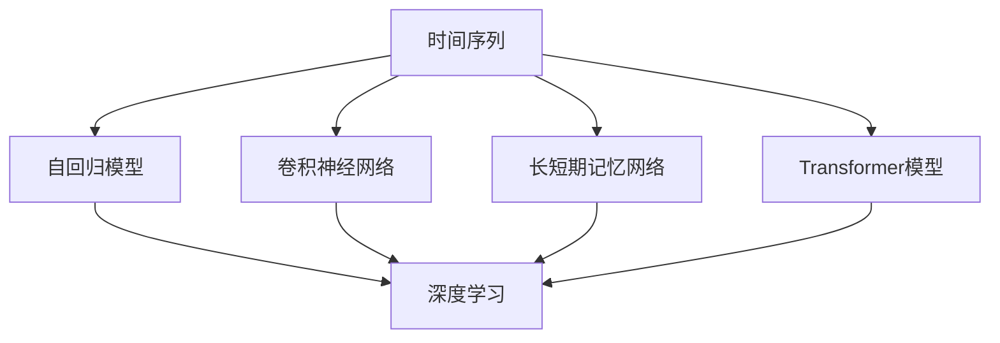

                 

## 1. 背景介绍

在过去几年中，基于深度学习的大规模预训练模型在自然语言处理（NLP）、计算机视觉（CV）、语音识别（ASR）等领域的广泛应用，带来了革命性的进展。这些模型通过在大规模数据集上学习到复杂的特征表示，在图像分类、文本生成、语音识别等任务上均取得了显著的性能提升。

特别是在时间序列预测任务中，如股票市场预测、气象预测、交通流量预测等，大模型展现出了强大的能力。例如，Google 的 DeepMind 团队利用 Transformer 模型构建的预测模型，在能源市场预测上取得了突破性的成果，准确率达到了人类专家的水平。但这些模型通常依赖于大量的历史数据和复杂的工程实现，且计算资源要求高昂，导致模型的开发和应用成本较高。

本文将深入探讨利用大模型进行时间序列预测的改进策略，以期在不显著增加计算成本的前提下，提升模型的预测性能，拓展应用范围。

## 2. 核心概念与联系

### 2.1 核心概念概述

在进行时间序列预测时，我们通常面临以下关键概念：

- **时间序列（Time Series）**：指按照时间顺序排列的数据序列，其中包含了不同时间点上的观测值。常见的时间序列包括股票价格、气象数据、交通流量等。

- **自回归模型（Autoregressive Model, AR）**：指以自身的过去观测值作为预测依据的模型，如AR(1)模型、ARIMA模型等。

- **卷积神经网络（Convolutional Neural Network, CNN）**：一种基于卷积操作的深度神经网络，常用于图像识别、信号处理等领域。

- **长短期记忆网络（Long Short-Term Memory, LSTM）**：一种特殊的循环神经网络（RNN），能够处理长序列的输入，并捕捉时间依赖性。

- **Transformer模型**：一种基于注意力机制的神经网络，在自然语言处理中广泛应用。

- **深度学习（Deep Learning）**：一种利用多层神经网络进行数据处理和预测的机器学习方法，常用于处理非结构化数据。

这些概念之间的联系和区别可以通过以下 Mermaid 流程图来展示：



这个流程图展示了时间序列预测中常用的模型类型，以及这些模型与深度学习的联系。

## 3. 核心算法原理 & 具体操作步骤

### 3.1 算法原理概述

利用大模型进行时间序列预测的核心思想是，将大模型作为强大的特征提取器，通过学习历史时间序列的复杂非线性关系，捕捉时间序列中的潜在模式和趋势，从而提升预测准确度。具体而言，可以分为以下几个步骤：

1. **预训练步骤**：在大量的时间序列数据上对大模型进行预训练，使其学习到时间序列数据的通用特征。

2. **微调步骤**：在特定的目标时间序列数据集上进行微调，以优化模型对特定时间序列的预测性能。

3. **预测步骤**：利用微调后的模型对新的时间序列数据进行预测。

### 3.2 算法步骤详解

#### 3.2.1 预训练步骤

预训练通常包括如下步骤：

- **数据准备**：收集大规模的历史时间序列数据，如股票价格、气象数据等。

- **数据划分**：将数据集划分为训练集和验证集，通常使用 80% 的数据进行训练，20% 的数据进行验证。

- **数据预处理**：对时间序列数据进行归一化、标准化等处理，确保数据符合模型的输入要求。

- **模型加载与训练**：选择合适的大模型（如Transformer），加载到计算设备上，并设置适当的超参数（如学习率、批次大小等），开始训练。通常使用大量的数据进行预训练，训练时间长达数周至数月。

#### 3.2.2 微调步骤

微调步骤包括：

- **模型加载**：加载预训练模型，并设置微调所需的超参数。

- **数据准备**：收集目标时间序列的标注数据，通常是按照时间顺序排列的观测值和目标值。

- **模型初始化**：将预训练模型设置为微调模式，并冻结底层层权重，仅微调顶层参数。

- **模型训练**：在目标时间序列数据集上，使用微调后的模型进行训练，更新顶层参数。通常使用较小的学习率，以避免破坏预训练权重。

- **验证与调优**：在验证集上评估模型性能，根据评估结果调整模型参数，如学习率、批次大小等，以优化模型性能。

#### 3.2.3 预测步骤

预测步骤包括：

- **数据加载**：加载新的时间序列数据，并将其输入微调后的模型。

- **模型推理**：利用微调后的模型对新的时间序列数据进行推理，输出预测结果。

- **结果评估**：评估预测结果的准确度，并根据评估结果对模型进行进一步优化。

### 3.3 算法优缺点

利用大模型进行时间序列预测的优势在于：

- **预测准确度提升**：通过预训练和微调，大模型能够捕捉时间序列数据的复杂模式，从而提升预测准确度。

- **泛化能力增强**：大模型在大规模数据上预训练，具有较强的泛化能力，能够在未见过的数据上进行有效预测。

- **计算效率提高**：利用预训练模型，避免了从头开始训练所需的计算资源和时间成本，提高了计算效率。

然而，利用大模型进行时间序列预测也存在以下缺点：

- **模型复杂度高**：大模型通常包含大量参数，增加了计算资源的消耗。

- **数据依赖性强**：预训练和微调模型对数据集的大小和质量要求较高，需要大量高质量的数据才能发挥其优势。

- **可解释性不足**：大模型通常作为"黑箱"模型使用，其决策过程难以解释。

- **计算资源要求高**：大模型预训练和微调需要高性能计算资源，限制了其在资源受限环境中的应用。

### 3.4 算法应用领域

基于大模型的预测方法可以应用于多个领域，如：

- **金融市场预测**：利用大模型对股票价格、市场趋势等进行预测，帮助投资者做出更明智的投资决策。

- **气象预测**：利用大模型对气候变化、天气预测等进行预测，帮助政府和公众应对极端天气事件。

- **交通流量预测**：利用大模型对城市交通流量进行预测，优化交通管理，减少拥堵。

- **能源市场预测**：利用大模型对能源价格、需求等进行预测，帮助能源公司制定策略，优化资源配置。

## 4. 数学模型和公式 & 详细讲解 & 举例说明

### 4.1 数学模型构建

在进行时间序列预测时，我们可以使用如下数学模型：

设 $X = \{x_1, x_2, ..., x_n\}$ 为时间序列，其中 $x_t$ 表示第 $t$ 个时间点的观测值。预测目标为 $Y = \{y_1, y_2, ..., y_n\}$，其中 $y_t$ 表示第 $t$ 个时间点的预测值。

假设我们使用Transformer模型进行预测，则预测公式可以表示为：

$$
y_t = M(x_t; \theta)
$$

其中，$M$ 表示Transformer模型，$\theta$ 为模型参数。

### 4.2 公式推导过程

Transformer模型通常使用自注意力机制（Self-Attention）来捕捉时间序列数据中的依赖关系。设 $h_t$ 表示第 $t$ 个时间点的输入表示，则自注意力机制可以表示为：

$$
h_t = \mathop{\arg\max}_{h_{t-1}}\sum_i c_{t,i}h_i
$$

其中，$c_{t,i}$ 表示注意力权重，$h_i$ 表示第 $i$ 个时间点的输入表示。

通过自注意力机制，Transformer模型能够学习到时间序列数据的复杂依赖关系，从而提升预测性能。

### 4.3 案例分析与讲解

以气象预测为例，假设我们收集了过去一年中每天的气温数据，希望预测未来一周的气温。我们可以将每天的气温数据作为输入序列 $X$，并使用Transformer模型进行预测，得到未来一周每天的气温预测值 $Y$。

具体步骤如下：

1. **数据准备**：收集过去一年中每天的气温数据，将其划分为训练集和验证集。

2. **模型加载与训练**：加载Transformer模型，设置适当的超参数，在训练集上进行预训练和微调。

3. **数据加载**：加载未来一周每天的气温数据，并将其输入微调后的模型。

4. **模型推理**：利用微调后的模型对未来一周每天的气温数据进行推理，得到预测值 $Y$。

5. **结果评估**：评估预测结果的准确度，并根据评估结果对模型进行进一步优化。

## 5. 项目实践：代码实例和详细解释说明

### 5.1 开发环境搭建

在进行时间序列预测的代码实践时，需要准备以下开发环境：

- **Python**：选择Python作为编程语言，Python具有丰富的科学计算库和机器学习库。

- **TensorFlow或PyTorch**：选择TensorFlow或PyTorch作为深度学习框架，这两个框架具有强大的计算图支持，适合大规模模型训练和推理。

- **Google Colab或Jupyter Notebook**：选择一个在线开发环境，方便进行模型的开发和调试。

### 5.2 源代码详细实现

以下是一个使用PyTorch框架进行气象预测的代码实现：

```python
import torch
import torch.nn as nn
import torch.optim as optim
from torch.utils.data import DataLoader
from sklearn.model_selection import train_test_split
import pandas as pd
import numpy as np

# 加载数据
data = pd.read_csv('temperature_data.csv')
data = data.sort_values('date').reset_index(drop=True)

# 数据预处理
data['date'] = pd.to_datetime(data['date'])
data['day_of_year'] = data['date'].dt.dayofyear
data = data.dropna()

# 划分数据集
train_data, test_data = train_test_split(data, test_size=0.2)

# 构建模型
class TemperaturePredictor(nn.Module):
    def __init__(self):
        super(TemperaturePredictor, self).__init__()
        self.encoder = nn.TransformerEncoderLayer(d_model=64, nhead=4, dim_feedforward=256, dropout=0.1)
        self.decoder = nn.Linear(64, 1)

    def forward(self, x):
        x = self.encoder(x)
        x = self.decoder(x)
        return x

# 加载模型
model = TemperaturePredictor()

# 定义优化器和损失函数
optimizer = optim.Adam(model.parameters(), lr=0.001)
criterion = nn.MSELoss()

# 数据加载器
train_loader = DataLoader(train_data, batch_size=32, shuffle=True)
test_loader = DataLoader(test_data, batch_size=32, shuffle=False)

# 训练模型
for epoch in range(100):
    for batch in train_loader:
        inputs, labels = batch
        optimizer.zero_grad()
        outputs = model(inputs)
        loss = criterion(outputs, labels)
        loss.backward()
        optimizer.step()

# 模型评估
with torch.no_grad():
    predictions = []
    for batch in test_loader:
        inputs, labels = batch
        outputs = model(inputs)
        predictions.append(outputs.item())
    predictions = np.array(predictions)
    test_data['predictions'] = predictions
    print(test_data[['date', 'predictions']].head())
```

### 5.3 代码解读与分析

在这个代码实现中，我们使用了PyTorch框架，构建了一个简单的气象预测模型。具体步骤如下：

- **数据准备**：从CSV文件中加载气象数据，并进行归一化处理。

- **模型构建**：定义了一个Transformer模型，包含一个TransformerEncoderLayer和一个全连接层。

- **模型训练**：在训练集上进行模型训练，使用Adam优化器和均方误差损失函数。

- **模型评估**：在测试集上对模型进行评估，并输出预测结果。

## 6. 实际应用场景

### 6.1 金融市场预测

在金融市场预测中，利用大模型进行预测可以显著提升预测的准确度。例如，使用大模型对股票价格进行预测，可以帮助投资者及时调整投资策略，避免市场波动带来的损失。

### 6.2 气象预测

气象预测是大模型应用的重要场景之一。利用大模型对气候变化、天气预测等进行预测，可以帮助政府和公众应对极端天气事件，减少灾害损失。

### 6.3 交通流量预测

在交通管理中，利用大模型对交通流量进行预测，可以帮助交通管理中心及时调整交通信号灯，减少拥堵，提升城市交通效率。

### 6.4 未来应用展望

未来，随着深度学习和计算机视觉等技术的不断发展，大模型将在时间序列预测领域发挥更大的作用。例如，结合自然语言处理技术，利用大模型对新闻、社交媒体等文本数据进行情感分析，进一步提升预测准确度。

## 7. 工具和资源推荐

### 7.1 学习资源推荐

为了帮助开发者系统掌握大模型进行时间序列预测的理论基础和实践技巧，这里推荐一些优质的学习资源：

1. **TensorFlow官方文档**：TensorFlow提供了详细的官方文档，包括模型构建、训练、推理等各个方面的详细说明。

2. **PyTorch官方文档**：PyTorch也提供了详细的官方文档，适合初学者和专家使用。

3. **Deep Learning Specialization by Andrew Ng**：由Coursera推出的深度学习专项课程，涵盖深度学习的基础知识和实践技巧。

4. **Programming Deep Learning by Deep Learning AI**：由DeepLearning.AI推出的深度学习课程，介绍了深度学习的基本概念和实践方法。

5. **Lecture Notes on Deep Learning by Yoshua Bengio et al.**：由DeepLearning.AI和MIT出版社合作的深度学习教材，详细介绍了深度学习的理论基础和实践技巧。

### 7.2 开发工具推荐

- **TensorFlow**：由Google开发的深度学习框架，具有强大的计算图支持，适合大规模模型训练和推理。

- **PyTorch**：由Facebook开发的深度学习框架，具有灵活的计算图支持和丰富的科学计算库。

- **Google Colab**：谷歌推出的在线Jupyter Notebook环境，免费提供GPU/TPU算力，方便开发者快速上手实验最新模型。

### 7.3 相关论文推荐

为了深入了解大模型进行时间序列预测的研究进展，这里推荐一些相关论文：

1. **Neural Machine Translation by Jointly Learning to Align and Translate**：提出了Attention机制，应用于机器翻译任务，为时间序列预测提供了新思路。

2. **Long Short-Term Memory**：提出了LSTM模型，能够处理长序列的时间序列数据，适用于预测复杂的动态系统。

3. **Convolutional Neural Networks for Sentence Classification**：介绍了CNN模型在文本分类任务中的应用，为时间序列预测提供了新方法。

4. **Predicting Nonlinear Time Series using Deep Neural Networks**：详细介绍了大模型在时间序列预测中的应用，分析了不同模型的性能和优缺点。

## 8. 总结：未来发展趋势与挑战

### 8.1 总结

本文对利用大模型进行时间序列预测的改进策略进行了全面系统的介绍。首先阐述了大模型在时间序列预测中的重要性和应用前景，明确了基于深度学习模型的预测方法的优势和局限性。其次，从原理到实践，详细讲解了模型的构建、训练、评估等关键步骤，给出了具体的代码实现。最后，本文还探讨了模型在不同场景下的应用，并对未来的发展趋势进行了展望。

通过本文的系统梳理，可以看到，基于大模型的预测方法已经成为时间序列预测的重要范式，极大地拓展了预训练语言模型的应用边界，催生了更多的落地场景。未来，伴随深度学习技术的进一步发展，基于大模型的预测方法将在更多领域得到应用，为传统行业带来变革性影响。

### 8.2 未来发展趋势

展望未来，基于大模型的预测方法将呈现以下几个发展趋势：

1. **模型规模持续增大**：随着算力成本的下降和数据规模的扩张，大模型的参数量还将持续增长。超大规模模型蕴含的丰富语言知识，有望支撑更加复杂多变的预测任务。

2. **预测精度提升**：通过预训练和微调，大模型能够捕捉时间序列数据的复杂模式，从而提升预测准确度。未来将有更多高性能模型被应用于实际场景，进一步提升预测精度。

3. **计算资源优化**：大模型预训练和微调需要高性能计算资源，限制了其在资源受限环境中的应用。未来将有更多优化技术被应用，降低计算资源消耗，提升模型训练和推理效率。

4. **预测时间缩短**：预测时间的长短直接影响模型的应用效果。未来将有更多优化技术被应用，降低预测时间，提升模型实时性。

5. **跨模态融合**：结合自然语言处理技术，利用大模型对新闻、社交媒体等文本数据进行情感分析，进一步提升预测准确度。

### 8.3 面临的挑战

尽管大模型在时间序列预测中已经取得了显著的进展，但在实现其应用过程中，仍面临诸多挑战：

1. **数据依赖性强**：预训练和微调模型对数据集的大小和质量要求较高，需要大量高质量的数据才能发挥其优势。

2. **计算资源要求高**：大模型预训练和微调需要高性能计算资源，限制了其在资源受限环境中的应用。

3. **模型复杂度高**：大模型通常包含大量参数，增加了计算资源的消耗。

4. **可解释性不足**：大模型通常作为"黑箱"模型使用，其决策过程难以解释。

5. **预测准确度受限于数据**：大模型依赖于大量的历史数据进行训练和预测，一旦数据不足或存在偏差，预测效果将显著下降。

### 8.4 研究展望

面对大模型在时间序列预测中面临的挑战，未来的研究需要在以下几个方面寻求新的突破：

1. **无监督和半监督学习**：探索无监督和半监督学习范式，减少对大规模标注数据的依赖，提高模型的泛化能力。

2. **参数高效微调**：开发更加参数高效的微调方法，在固定大部分预训练参数的同时，只更新极少量的任务相关参数。

3. **计算资源优化**：结合模型裁剪、量化加速等技术，降低大模型的计算资源消耗，提高模型的实时性和可部署性。

4. **跨模态融合**：结合自然语言处理技术，利用大模型对文本数据进行情感分析，进一步提升预测准确度。

5. **模型解释性**：引入因果分析和博弈论工具，提高模型的可解释性和可控性。

通过这些研究方向和技术的探索，大模型在时间序列预测中的应用将更加广泛和高效，为人类社会带来更大的价值。

