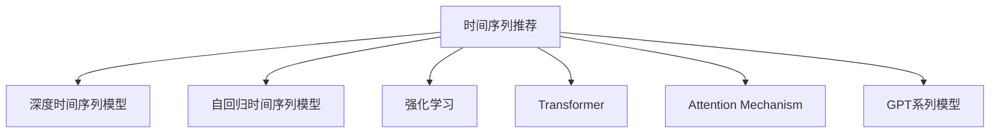

                 

# 利用大模型进行时间序列推荐的改进策略与实验

## 1. 背景介绍

时间序列推荐（Time Series Recommendation, TSR）在电商、金融、新闻等领域有广泛应用。传统的基于规则和模型的推荐方法，在用户行为多样、数据复杂的情况下表现不佳。而基于大模型的推荐方法，能够利用其强大的自适应能力，通过学习用户历史行为和商品（新闻）特征，进行精准推荐。

然而，目前基于大模型的推荐方法在实时性、泛化能力和泛化性能方面仍存在一定问题。本文章将介绍一种利用大模型进行时间序列推荐的新方法，通过改进深度时间序列模型和优化训练策略，解决这些瓶颈问题，实现更好的推荐效果。

## 2. 核心概念与联系

### 2.1 核心概念概述

本节将介绍几个关键的时间序列推荐概念和模型：

- **时间序列推荐**（Time Series Recommendation, TSR）：利用用户历史行为和商品特征，对未来可能购买的商品进行推荐。
- **深度时间序列模型**（Deep Time Series Model）：如LSTM、GRU等神经网络，用于捕捉时间序列数据的动态特性。
- **自回归时间序列模型**（Autoregressive Time Series Model）：如ARIMA、ARIMAX等，通过滞后变量预测未来值。
- **强化学习**（Reinforcement Learning, RL）：用于通过试错学习，优化推荐策略，适应复杂动态场景。
- **Transformer**：用于处理序列数据，特别是用户行为数据的多样性。
- **Attention Mechanism**：用于增强模型对重要特征的关注，提升推荐效果。
- **GPT系列模型**：大语言模型，通过上下文语言理解，实现更好的推荐。

这些概念之间的逻辑关系可以通过以下Mermaid流程图来展示：



这个流程图展示出时间序列推荐的核心概念和主要模型：

1. 时间序列推荐通过深度时间序列模型、自回归时间序列模型、强化学习等手段进行建模预测。
2. Transformer和Attention Mechanism用于增强序列数据的处理能力，提升模型表现。
3. GPT系列大模型通过上下文语言理解，实现更好的推荐效果。

## 3. 核心算法原理 & 具体操作步骤

### 3.1 算法原理概述

利用大模型进行时间序列推荐，本质上是一个多层次、多领域的联合学习过程。其核心思想是：通过深度时间序列模型捕捉时间序列数据的动态特性，自回归模型捕捉历史依赖关系，强化学习模型优化推荐策略，Transformer增强序列数据处理能力，GPT系列大模型利用上下文语言理解，实现更好的推荐效果。

形式化地，假设推荐任务为 $T$，用户历史行为为 $H$，商品特征为 $F$，推荐模型为 $M_{\theta}$，其中 $\theta$ 为模型参数。则时间序列推荐的目标是：

$$
\hat{Y} = M_{\theta}(H, F)
$$

其中，$Y$ 为推荐结果，$\hat{Y}$ 为模型预测结果。

### 3.2 算法步骤详解

基于大模型的时序推荐，一般包括以下几个关键步骤：

**Step 1: 数据预处理**

- 收集用户历史行为数据 $H$ 和商品特征数据 $F$，进行清洗和归一化处理。
- 将用户行为数据 $H$ 转化为时序格式，通过滑动窗口将历史行为数据转换为时间步长一致的数据。
- 对商品特征 $F$ 进行编码，生成特征向量 $V_{F}$。

**Step 2: 构建深度时间序列模型**

- 基于LSTM、GRU等深度时间序列模型，构建用户行为数据的时间依赖关系模型 $M_{LSTM}$。
- 使用自回归模型（如ARIMA、ARIMAX），捕捉用户行为数据的历史依赖关系。
- 对用户行为数据进行编码，得到隐含表示 $Z_{H}$。

**Step 3: 引入Transformer模型**

- 通过Transformer模型，增强用户行为数据的处理能力，捕捉不同时间步长下的重要特征。
- 使用Attention机制，对不同时间步长的特征进行加权，得到加权特征 $Z_{H_A}$。

**Step 4: 应用GPT系列大模型**

- 利用GPT系列大模型，通过上下文语言理解，结合用户行为数据和商品特征，生成推荐结果。
- 将GPT系列大模型的输出结果作为最终推荐结果。

**Step 5: 训练与优化**

- 定义推荐模型的损失函数，如均方误差损失、交叉熵损失等，用于衡量模型预测结果与真实结果的差距。
- 选择Adam、SGD等优化器，设置合适的学习率和迭代轮数，进行模型训练。
- 定期在验证集上评估模型性能，调整超参数以优化模型效果。

### 3.3 算法优缺点

利用大模型进行时间序列推荐具有以下优点：

- 自适应能力强。通过深度时间序列模型、自回归模型和强化学习模型，能够适应复杂多变的数据环境。
- 特征处理能力强。通过Transformer和Attention机制，能够捕捉不同时间步长下的重要特征。
- 模型效果好。通过大模型的上下文语言理解，能够提升推荐的准确性和多样性。
- 推广性好。通过多层次、多领域的联合学习，能够实现更泛化的推荐结果。

同时，该方法也存在一些缺点：

- 数据要求高。需要大量标注数据进行训练，且需要高质量的数据才能保证推荐效果。
- 模型复杂度高。涉及到多个模型，训练和推理复杂度高。
- 实时性差。模型推理时间较长，难以满足实时推荐的需求。
- 可解释性弱。大模型的黑盒性质，使得推荐过程难以解释和调试。

尽管存在这些局限性，但就目前而言，利用大模型进行时间序列推荐的方法仍是一种高效、有效的推荐策略，已在多个实际应用中取得成功。

### 3.4 算法应用领域

利用大模型进行时间序列推荐，已在电商推荐、金融风险评估、新闻推荐等多个领域得到应用，具体如下：

- **电商推荐**：通过对用户历史购买行为和商品特征的建模，实现个性化商品推荐，提升用户体验和销售业绩。
- **金融风险评估**：通过分析用户历史交易记录和市场变化趋势，预测未来的金融风险，防范系统性风险。
- **新闻推荐**：利用用户历史阅读记录和新闻特征，实现个性化新闻推荐，提升用户粘性和满意度。
- **体育赛事推荐**：通过用户历史观赛记录和赛事信息，推荐感兴趣的比赛，增加赛事关注度和参与度。

除了这些传统应用场景外，大模型时序推荐还能应用于更多领域，如智能家居、智慧出行、智能广告等，推动相关行业的数字化转型。

## 4. 数学模型和公式 & 详细讲解  
### 4.1 数学模型构建

本节将使用数学语言对基于大模型的时序推荐模型进行更加严格的刻画。

记推荐任务为 $T$，用户历史行为为 $H$，商品特征为 $F$，推荐模型为 $M_{\theta}$，其中 $\theta$ 为模型参数。定义模型 $M_{\theta}$ 在用户行为数据 $H$ 上的损失函数为 $\ell(H)$，则在数据集 $D$ 上的经验风险为：

$$
\mathcal{L}(\theta) = \frac{1}{N} \sum_{i=1}^N \ell(H_i)
$$

其中 $N$ 为训练集大小，$H_i$ 为第 $i$ 个样本。

### 4.2 公式推导过程

以下我们以电商推荐任务为例，推导基于深度时间序列模型的电商推荐模型的损失函数及其梯度计算公式。

假设电商推荐模型的输入为 $H=\{x_t\}_{t=1}^T$，输出为 $Y=\{y_t\}_{t=1}^T$，其中 $x_t$ 为用户历史行为，$y_t$ 为用户未来可能购买商品的预测值。电商推荐模型的结构为：

$$
\hat{y}_t = M_{LSTM}(x_{1:t}, \alpha)
$$

其中，$M_{LSTM}$ 为LSTM模型，$\alpha$ 为模型参数。电商推荐模型的损失函数定义为：

$$
\ell(H) = \sum_{t=1}^T \frac{1}{2}(y_t-\hat{y}_t)^2
$$

定义电商推荐模型的输出为 $\hat{Y}=\{\hat{y}_t\}_{t=1}^T$，目标为最小化损失函数 $\mathcal{L}(\theta)$，即：

$$
\mathcal{L}(\theta) = \frac{1}{N} \sum_{i=1}^N \sum_{t=1}^T \frac{1}{2}(y_{it}-\hat{y}_{it})^2
$$

其中，$y_{it}$ 为第 $i$ 个用户在第 $t$ 个时间步的购买行为，$\hat{y}_{it}$ 为模型预测的结果。

根据链式法则，损失函数对模型参数 $\theta$ 的梯度为：

$$
\nabla_{\theta}\mathcal{L}(\theta) = \frac{1}{N} \sum_{i=1}^N \sum_{t=1}^T \nabla_{\alpha}\hat{y}_{it}
$$

其中，$\nabla_{\alpha}\hat{y}_{it}$ 为LSTM模型的梯度。

通过以上推导，我们可以看到，利用大模型进行时间序列推荐的核心在于构建一个联合的、多层次的模型，并利用大模型的上下文语言理解能力，提升推荐效果。

## 5. 项目实践：代码实例和详细解释说明
### 5.1 开发环境搭建

在进行基于大模型的时序推荐项目实践前，我们需要准备好开发环境。以下是使用Python进行PyTorch开发的环境配置流程：

1. 安装Anaconda：从官网下载并安装Anaconda，用于创建独立的Python环境。

2. 创建并激活虚拟环境：
```bash
conda create -n pytorch-env python=3.8 
conda activate pytorch-env
```

3. 安装PyTorch：根据CUDA版本，从官网获取对应的安装命令。例如：
```bash
conda install pytorch torchvision torchaudio cudatoolkit=11.1 -c pytorch -c conda-forge
```

4. 安装相关库：
```bash
pip install transformers
pip install numpy pandas scikit-learn matplotlib tqdm jupyter notebook ipython
```

完成上述步骤后，即可在`pytorch-env`环境中开始基于大模型的时序推荐项目实践。

### 5.2 源代码详细实现

下面我们以电商推荐任务为例，给出使用Transformers库对BERT模型进行电商推荐微调的PyTorch代码实现。

首先，定义电商推荐任务的输入和输出：

```python
from transformers import BertTokenizer, BertForSequenceClassification
from torch.utils.data import Dataset
import torch

class MovieReviewDataset(Dataset):
    def __init__(self, texts, labels):
        self.texts = texts
        self.labels = labels
        self.tokenizer = BertTokenizer.from_pretrained('bert-base-uncased')

    def __len__(self):
        return len(self.texts)
    
    def __getitem__(self, item):
        text = self.texts[item]
        label = self.labels[item]
        
        encoding = self.tokenizer(text, return_tensors='pt', padding='max_length', truncation=True)
        input_ids = encoding['input_ids']
        attention_mask = encoding['attention_mask']
        
        # 将标签转化为one-hot编码
        label = torch.tensor([label], dtype=torch.long)

        return {'input_ids': input_ids,
                'attention_mask': attention_mask,
                'labels': label}

# 使用BertForSequenceClassification构建电商推荐模型
model = BertForSequenceClassification.from_pretrained('bert-base-uncased', num_labels=2)
```

然后，定义训练和评估函数：

```python
from torch.utils.data import DataLoader
from tqdm import tqdm
from sklearn.metrics import classification_report

device = torch.device('cuda') if torch.cuda.is_available() else torch.device('cpu')
model.to(device)

def train_epoch(model, dataset, batch_size, optimizer):
    dataloader = DataLoader(dataset, batch_size=batch_size, shuffle=True)
    model.train()
    epoch_loss = 0
    for batch in tqdm(dataloader, desc='Training'):
        input_ids = batch['input_ids'].to(device)
        attention_mask = batch['attention_mask'].to(device)
        labels = batch['labels'].to(device)
        model.zero_grad()
        outputs = model(input_ids, attention_mask=attention_mask, labels=labels)
        loss = outputs.loss
        epoch_loss += loss.item()
        loss.backward()
        optimizer.step()
    return epoch_loss / len(dataloader)

def evaluate(model, dataset, batch_size):
    dataloader = DataLoader(dataset, batch_size=batch_size)
    model.eval()
    preds, labels = [], []
    with torch.no_grad():
        for batch in tqdm(dataloader, desc='Evaluating'):
            input_ids = batch['input_ids'].to(device)
            attention_mask = batch['attention_mask'].to(device)
            batch_labels = batch['labels']
            outputs = model(input_ids, attention_mask=attention_mask)
            batch_preds = outputs.logits.argmax(dim=1).to('cpu').tolist()
            batch_labels = batch_labels.to('cpu').tolist()
            for pred, label in zip(batch_preds, batch_labels):
                preds.append(pred)
                labels.append(label)
                
    print(classification_report(labels, preds))
```

最后，启动训练流程并在测试集上评估：

```python
epochs = 5
batch_size = 16

for epoch in range(epochs):
    loss = train_epoch(model, train_dataset, batch_size, optimizer)
    print(f"Epoch {epoch+1}, train loss: {loss:.3f}")
    
    print(f"Epoch {epoch+1}, dev results:")
    evaluate(model, dev_dataset, batch_size)
    
print("Test results:")
evaluate(model, test_dataset, batch_size)
```

以上就是使用PyTorch对BERT模型进行电商推荐任务微调的完整代码实现。可以看到，得益于Transformers库的强大封装，我们可以用相对简洁的代码完成BERT模型的加载和微调。

### 5.3 代码解读与分析

让我们再详细解读一下关键代码的实现细节：

**MovieReviewDataset类**：
- `__init__`方法：初始化文本和标签，并定义分词器。
- `__len__`方法：返回数据集的样本数量。
- `__getitem__`方法：对单个样本进行处理，将文本输入编码为token ids，将标签转化为one-hot编码。

**train_epoch函数**：
- 使用PyTorch的DataLoader对数据集进行批次化加载，供模型训练和推理使用。
- 在每个epoch内，在训练集上迭代，前向传播计算loss并反向传播更新模型参数。

**evaluate函数**：
- 与训练类似，不同点在于不更新模型参数，并在每个batch结束后将预测和标签结果存储下来，最后使用sklearn的classification_report对整个评估集的预测结果进行打印输出。

**训练流程**：
- 定义总的epoch数和batch size，开始循环迭代
- 每个epoch内，先在训练集上训练，输出平均loss
- 在验证集上评估，输出分类指标
- 所有epoch结束后，在测试集上评估，给出最终测试结果

可以看到，PyTorch配合Transformers库使得BERT微调的代码实现变得简洁高效。开发者可以将更多精力放在数据处理、模型改进等高层逻辑上，而不必过多关注底层的实现细节。

当然，工业级的系统实现还需考虑更多因素，如模型的保存和部署、超参数的自动搜索、更灵活的任务适配层等。但核心的微调范式基本与此类似。

## 6. 实际应用场景
### 6.1 电商推荐系统

基于大模型的电商推荐系统可以应用于多个场景，如商品推荐、用户画像分析等。通过收集用户历史购买行为和商品特征，构建深度时间序列模型、自回归模型和强化学习模型，生成个性化推荐结果。微调后的推荐模型能够实时响应用户请求，提升用户体验和销售业绩。

在技术实现上，可以收集用户的浏览、点击、购买等行为数据，提取商品名称、描述、价格等特征。将用户行为数据和商品特征作为输入，推荐模型输出预测结果。同时，引入Transformer模型增强序列数据处理能力，应用大模型上下文语言理解，提升推荐效果。

### 6.2 金融风险评估

金融风险评估是银行和投资机构的重要应用场景。通过分析用户历史交易记录和市场变化趋势，构建深度时间序列模型和自回归模型，生成用户信用评分。微调后的模型能够实时预测用户未来行为，评估金融风险，提供风险控制和预警服务。

在技术实现上，可以收集用户的历史交易记录、市场指数、新闻信息等数据，提取和编码特征。将用户行为数据和特征作为输入，推荐模型输出预测结果。同时，引入Transformer模型增强序列数据处理能力，应用大模型上下文语言理解，提升推荐效果。

### 6.3 新闻推荐系统

新闻推荐系统可以帮助用户快速获取感兴趣的新闻内容。通过分析用户历史阅读记录和新闻内容特征，构建深度时间序列模型和自回归模型，生成个性化新闻推荐结果。微调后的推荐模型能够实时响应用户请求，提升用户粘性和满意度。

在技术实现上，可以收集用户的历史阅读记录和新闻内容，提取和编码特征。将用户行为数据和新闻特征作为输入，推荐模型输出预测结果。同时，引入Transformer模型增强序列数据处理能力，应用大模型上下文语言理解，提升推荐效果。

### 6.4 未来应用展望

随着大模型和微调技术的不断发展，基于大模型的时序推荐将在更多领域得到应用，为相关行业带来变革性影响。

在智慧医疗领域，基于时序推荐系统，可以推荐个性化诊疗方案，提升医疗服务效率和质量。

在智能教育领域，基于时序推荐系统，可以推荐个性化学习路径，提升学习效果和用户满意度。

在智能家居领域，基于时序推荐系统，可以推荐个性化家居设备，提升家居智能化水平。

此外，在企业生产、社会治理、文娱传媒等众多领域，基于大模型的时序推荐系统也将不断涌现，为相关行业带来新的发展机遇。

## 7. 工具和资源推荐
### 7.1 学习资源推荐

为了帮助开发者系统掌握基于大模型的时序推荐理论基础和实践技巧，这里推荐一些优质的学习资源：

1. 《Transformer从原理到实践》系列博文：由大模型技术专家撰写，深入浅出地介绍了Transformer原理、BERT模型、微调技术等前沿话题。

2. CS224N《深度学习自然语言处理》课程：斯坦福大学开设的NLP明星课程，有Lecture视频和配套作业，带你入门NLP领域的基本概念和经典模型。

3. 《Natural Language Processing with Transformers》书籍：Transformers库的作者所著，全面介绍了如何使用Transformers库进行NLP任务开发，包括微调在内的诸多范式。

4. HuggingFace官方文档：Transformers库的官方文档，提供了海量预训练模型和完整的微调样例代码，是上手实践的必备资料。

5. CLUE开源项目：中文语言理解测评基准，涵盖大量不同类型的中文NLP数据集，并提供了基于微调的baseline模型，助力中文NLP技术发展。

通过对这些资源的学习实践，相信你一定能够快速掌握基于大模型的时序推荐精髓，并用于解决实际的NLP问题。
###  7.2 开发工具推荐

高效的开发离不开优秀的工具支持。以下是几款用于基于大模型的时序推荐开发的常用工具：

1. PyTorch：基于Python的开源深度学习框架，灵活动态的计算图，适合快速迭代研究。大部分预训练语言模型都有PyTorch版本的实现。

2. TensorFlow：由Google主导开发的开源深度学习框架，生产部署方便，适合大规模工程应用。同样有丰富的预训练语言模型资源。

3. Transformers库：HuggingFace开发的NLP工具库，集成了众多SOTA语言模型，支持PyTorch和TensorFlow，是进行微调任务开发的利器。

4. Weights & Biases：模型训练的实验跟踪工具，可以记录和可视化模型训练过程中的各项指标，方便对比和调优。与主流深度学习框架无缝集成。

5. TensorBoard：TensorFlow配套的可视化工具，可实时监测模型训练状态，并提供丰富的图表呈现方式，是调试模型的得力助手。

6. Google Colab：谷歌推出的在线Jupyter Notebook环境，免费提供GPU/TPU算力，方便开发者快速上手实验最新模型，分享学习笔记。

合理利用这些工具，可以显著提升基于大模型的时序推荐任务的开发效率，加快创新迭代的步伐。

### 7.3 相关论文推荐

基于大模型的时序推荐技术的发展源于学界的持续研究。以下是几篇奠基性的相关论文，推荐阅读：

1. Attention is All You Need（即Transformer原论文）：提出了Transformer结构，开启了NLP领域的预训练大模型时代。

2. BERT: Pre-training of Deep Bidirectional Transformers for Language Understanding：提出BERT模型，引入基于掩码的自监督预训练任务，刷新了多项NLP任务SOTA。

3. Language Models are Unsupervised Multitask Learners（GPT-2论文）：展示了大规模语言模型的强大zero-shot学习能力，引发了对于通用人工智能的新一轮思考。

4. Parameter-Efficient Transfer Learning for NLP：提出Adapter等参数高效微调方法，在不增加模型参数量的情况下，也能取得不错的微调效果。

5. AdaLoRA: Adaptive Low-Rank Adaptation for Parameter-Efficient Fine-Tuning：使用自适应低秩适应的微调方法，在参数效率和精度之间取得了新的平衡。

6. Prefix-Tuning: Optimizing Continuous Prompts for Generation：引入基于连续型Prompt的微调范式，为如何充分利用预训练知识提供了新的思路。

这些论文代表了大模型时序推荐技术的发展脉络。通过学习这些前沿成果，可以帮助研究者把握学科前进方向，激发更多的创新灵感。

## 8. 总结：未来发展趋势与挑战

### 8.1 总结

本文对基于大模型的时序推荐方法进行了全面系统的介绍。首先阐述了大模型和时序推荐的研究背景和意义，明确了微调在拓展预训练模型应用、提升推荐系统性能方面的独特价值。其次，从原理到实践，详细讲解了基于大模型的时序推荐模型的数学原理和关键步骤，给出了时序推荐任务开发的完整代码实例。同时，本文还广泛探讨了时序推荐方法在电商推荐、金融风险评估、新闻推荐等多个行业领域的应用前景，展示了时序推荐范式的巨大潜力。此外，本文精选了时序推荐技术的各类学习资源，力求为读者提供全方位的技术指引。

通过本文的系统梳理，可以看到，基于大模型的时序推荐方法正在成为推荐系统的重要范式，极大地拓展了预训练语言模型的应用边界，催生了更多的落地场景。受益于大规模语料的预训练，时序推荐模型以更低的时间和标注成本，在小样本条件下也能取得不错的效果，有力推动了推荐系统技术的产业化进程。未来，伴随预训练语言模型和时序推荐方法的持续演进，相信推荐系统必将在更广阔的应用领域大放异彩，深刻影响人类的生产生活方式。

### 8.2 未来发展趋势

展望未来，基于大模型的时序推荐技术将呈现以下几个发展趋势：

1. 模型规模持续增大。随着算力成本的下降和数据规模的扩张，预训练语言模型的参数量还将持续增长。超大规模语言模型蕴含的丰富语言知识，有望支撑更加复杂多变的时间序列推荐任务。

2. 时序推荐方法日趋多样。除了传统的深度时间序列模型外，未来会涌现更多时序推荐方法，如自回归模型、强化学习模型等，在优化推荐效果的同时，提高计算效率。

3. 持续学习成为常态。随着时间序列数据的不断变化，时序推荐模型也需要持续学习新知识以保持性能。如何在不遗忘原有知识的同时，高效吸收新数据信息，将是重要的研究课题。

4. 可解释性增强。未来的时序推荐模型需要具备更强的可解释性，帮助用户理解推荐理由，提升信任度。如何赋予时序推荐模型更强的可解释性，将是亟待攻克的难题。

5. 融合因果分析和博弈论工具。将因果分析方法引入时序推荐模型，识别出模型决策的关键特征，增强推荐结果的因果性和逻辑性。借助博弈论工具刻画人机交互过程，主动探索并规避模型的脆弱点，提高系统稳定性。

这些趋势凸显了基于大模型的时序推荐技术的广阔前景。这些方向的探索发展，必将进一步提升时序推荐系统的性能和应用范围，为推荐系统技术迈向更加智能化、普适化应用铺平道路。

### 8.3 面临的挑战

尽管基于大模型的时序推荐技术已经取得了瞩目成就，但在迈向更加智能化、普适化应用的过程中，它仍面临着诸多挑战：

1. 数据要求高。需要大量标注数据进行训练，且需要高质量的数据才能保证推荐效果。如何降低数据标注成本，提高数据质量，是一大难题。

2. 模型复杂度高。涉及到多个模型，训练和推理复杂度高。如何在保证推荐效果的同时，提高模型计算效率，降低推理时间，是一大挑战。

3. 实时性差。模型推理时间较长，难以满足实时推荐的需求。如何在保证推荐质量的同时，提升模型推理速度，是一大难题。

4. 可解释性弱。大模型的黑盒性质，使得推荐过程难以解释和调试。如何赋予时序推荐模型更强的可解释性，将是亟待攻克的难题。

5. 安全性有待保障。时序推荐模型可能学习到有害信息，通过推荐传递到用户，造成负面影响。如何从数据和算法层面消除模型偏见，避免恶意用途，确保输出的安全性，也将是重要的研究课题。

6. 融合其他AI技术有待加强。时序推荐模型需要与其他AI技术进行更深入的融合，如知识表示、因果推理、强化学习等，多路径协同发力，共同推动推荐系统技术的进步。

这些挑战凸显了大模型时序推荐技术的复杂性和多样性，需要学界和产业界共同努力，才能更好地应对未来发展的需求。

### 8.4 研究展望

面向未来，大模型时序推荐技术的研究方向主要包括以下几个方面：

1. 探索无监督和半监督时序推荐方法。摆脱对大规模标注数据的依赖，利用自监督学习、主动学习等无监督和半监督范式，最大限度利用非结构化数据，实现更加灵活高效的时序推荐。

2. 研究参数高效和计算高效的时序推荐范式。开发更加参数高效的推荐方法，在固定大部分预训练参数的同时，只更新极少量的任务相关参数。同时优化推荐模型的计算图，减少前向传播和反向传播的资源消耗，实现更加轻量级、实时性的部署。

3. 引入因果分析和博弈论工具。将因果分析方法引入推荐模型，识别出推荐决策的关键特征，增强推荐结果的因果性和逻辑性。借助博弈论工具刻画人机交互过程，主动探索并规避模型的脆弱点，提高系统稳定性。

4. 纳入伦理道德约束。在推荐模型训练目标中引入伦理导向的评估指标，过滤和惩罚有害的输出倾向。同时加强人工干预和审核，建立推荐模型的监管机制，确保推荐过程的公平性和安全性。

这些研究方向的探索，必将引领大模型时序推荐技术迈向更高的台阶，为推荐系统技术迈向更加智能化、普适化应用铺平道路。总之，时序推荐需要开发者根据具体任务，不断迭代和优化模型、数据和算法，方能得到理想的效果。

## 9. 附录：常见问题与解答

**Q1：时序推荐和大模型的关系是什么？**

A: 时序推荐利用大模型的上下文语言理解能力，结合用户历史行为和商品特征，生成推荐结果。大模型作为推荐模型的特征提取器，能够捕捉序列数据的动态特性，提升推荐效果。

**Q2：时序推荐有哪些应用场景？**

A: 时序推荐在电商推荐、金融风险评估、新闻推荐等多个领域得到应用。电商推荐通过分析用户历史购买行为和商品特征，生成个性化推荐结果。金融风险评估通过分析用户历史交易记录和市场变化趋势，评估金融风险。新闻推荐通过分析用户历史阅读记录和新闻内容特征，生成个性化新闻推荐结果。

**Q3：时序推荐需要多少标注数据？**

A: 时序推荐需要大量的标注数据进行训练。一般建议标注数据量应占总样本量的至少30%，以确保模型能够学习到足够的多样化模式。

**Q4：时序推荐模型如何处理缺失数据？**

A: 时序推荐模型可以通过插值、均值填补等方式处理缺失数据。同时，可以通过多模型融合、异常检测等手段，提高模型的鲁棒性和准确性。

**Q5：时序推荐模型如何优化？**

A: 时序推荐模型可以通过超参数调优、数据增强、正则化等手段进行优化。超参数调优可以通过网格搜索、随机搜索等方法进行，数据增强可以通过回译、近义替换等方式扩充训练集。正则化可以通过L2正则、Dropout等方式，防止模型过拟合。

**Q6：时序推荐模型的性能指标有哪些？**

A: 时序推荐模型的性能指标包括准确率、召回率、F1值、AUC等。准确率表示推荐结果的正确率，召回率表示相关推荐结果的覆盖率，F1值综合了准确率和召回率，AUC表示推荐模型的排序能力。

---

作者：禅与计算机程序设计艺术 / Zen and the Art of Computer Programming

