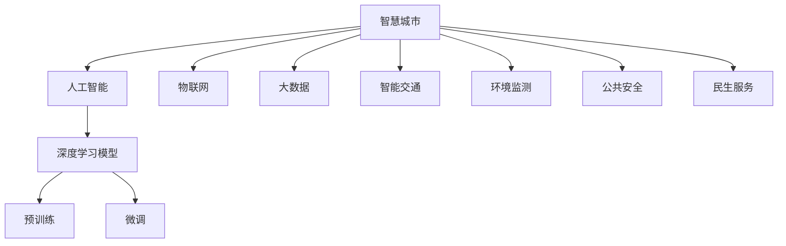

                 

# 利用技术优势进行智慧城市解决方案创新

> 关键词：智慧城市, 人工智能, 物联网, 大数据, 深度学习, 模型优化, 智能交通, 环境监测, 公共安全, 民生服务

## 1. 背景介绍

### 1.1 问题由来

智慧城市是当今城市发展的必然趋势，它通过整合信息通信技术、大数据、物联网、人工智能等手段，实现城市管理的智能化、精细化、个性化，提升城市运行效率，改善居民生活质量。然而，随着城市规模的不断扩大和居民需求的日益多样化，智慧城市的建设面临着巨大的挑战。传统的城市管理模式已难以满足现代城市发展的需要，亟需新的技术手段和解决方案。

### 1.2 问题核心关键点

智慧城市建设的核心问题在于如何高效、精准地采集、分析和应用城市数据。传统的城市管理系统往往依赖于人工处理和静态数据，难以实现实时动态的监测和决策。而人工智能技术，尤其是深度学习模型和大数据分析，可以显著提升城市管理的智能化水平。

通过在大规模数据集上进行预训练，人工智能模型可以学习到丰富的城市特征和模式，并在特定的智慧城市应用场景中进行微调，以适应具体的城市管理需求。这种基于预训练-微调的范式，不仅能够降低开发成本，提高效率，还能保证模型在新场景下的泛化能力，提升决策的准确性和响应速度。

## 2. 核心概念与联系

### 2.1 核心概念概述

为了更好地理解基于预训练-微调的智慧城市解决方案，本节将介绍几个密切相关的核心概念：

- 智慧城市：通过信息通信技术、物联网、大数据等手段，实现城市管理的智能化、精细化、个性化，提升城市运行效率，改善居民生活质量。

- 人工智能：利用计算机模拟人类智能行为，包括感知、推理、决策、学习等能力的科学技术。

- 物联网(IoT)：通过传感器、标签、RFID等技术，将城市的各种物理和虚拟对象连接起来，实现数据的全面采集和实时传输。

- 大数据：城市运营中产生的大量结构化和非结构化数据，需要通过大数据分析技术进行整合、清洗和挖掘。

- 深度学习模型：一种基于多层神经网络的机器学习方法，通过在大量数据集上进行预训练，学习到复杂的特征表示，适用于各类智慧城市应用。

- 预训练-微调：先在大规模数据集上进行预训练，再根据特定应用场景进行微调，以提高模型在新任务上的性能。

- 智能交通、环境监测、公共安全、民生服务：智慧城市的主要应用场景，涵盖交通管理、环境治理、安全保障、公共服务等各个方面。

这些核心概念之间的逻辑关系可以通过以下Mermaid流程图来展示：



这个流程图展示了大语言模型的核心概念及其之间的关系：

1. 智慧城市通过物联网和大数据技术，全面采集城市运行数据。
2. 人工智能技术，尤其是深度学习模型，通过预训练和微调，从数据中学习城市特征和模式。
3. 预训练-微调范式，将通用模型适应到特定的智慧城市应用场景，提升模型的泛化能力。
4. 智能交通、环境监测、公共安全、民生服务等智慧城市应用场景，通过预训练-微调模型，实现智能化管理和服务。

## 3. 核心算法原理 & 具体操作步骤
### 3.1 算法原理概述

基于预训练-微调的智慧城市解决方案，其核心思想是利用深度学习模型的强大表示能力，通过在大规模数据集上进行预训练，学习到通用的城市特征和模式。然后，在具体的智慧城市应用场景中，对这些预训练模型进行微调，以适应特定的城市管理需求，提升决策的准确性和响应速度。

形式化地，假设预训练深度学习模型为 $M_{\theta}$，其中 $\theta$ 为预训练得到的模型参数。给定智慧城市应用场景 $S$ 的训练集 $D=\{(x_i, y_i)\}_{i=1}^N, x_i \in \mathcal{X}, y_i \in \mathcal{Y}$，微调的目标是找到新的模型参数 $\hat{\theta}$，使得：

$$
\hat{\theta}=\mathop{\arg\min}_{\theta} \mathcal{L}(M_{\theta},D)
$$

其中 $\mathcal{L}$ 为针对任务 $S$ 设计的损失函数，用于衡量模型预测输出与真实标签之间的差异。常见的损失函数包括交叉熵损失、均方误差损失等。

通过梯度下降等优化算法，微调过程不断更新模型参数 $\theta$，最小化损失函数 $\mathcal{L}$，使得模型输出逼近真实标签。由于 $\theta$ 已经通过预训练获得了较好的初始化，因此即便在特定智慧城市应用场景中，微调数据量较小，也能较快收敛到理想的模型参数 $\hat{\theta}$。

### 3.2 算法步骤详解

基于预训练-微调的智慧城市解决方案一般包括以下几个关键步骤：

**Step 1: 准备预训练模型和数据集**
- 选择合适的深度学习模型 $M_{\theta}$ 作为初始化参数，如 ConvNet、RNN、Transformer 等。
- 准备智慧城市应用场景 $S$ 的标注数据集 $D$，划分为训练集、验证集和测试集。一般要求标注数据与预训练数据的分布不要差异过大。

**Step 2: 添加任务适配层**
- 根据任务类型，在预训练模型顶层设计合适的输出层和损失函数。
- 对于分类任务，通常在顶层添加线性分类器和交叉熵损失函数。
- 对于生成任务，通常使用语言模型的解码器输出概率分布，并以负对数似然为损失函数。

**Step 3: 设置微调超参数**
- 选择合适的优化算法及其参数，如 AdamW、SGD 等，设置学习率、批大小、迭代轮数等。
- 设置正则化技术及强度，包括权重衰减、Dropout、Early Stopping 等。
- 确定冻结预训练参数的策略，如仅微调顶层，或全部参数都参与微调。

**Step 4: 执行梯度训练**
- 将训练集数据分批次输入模型，前向传播计算损失函数。
- 反向传播计算参数梯度，根据设定的优化算法和学习率更新模型参数。
- 周期性在验证集上评估模型性能，根据性能指标决定是否触发 Early Stopping。
- 重复上述步骤直到满足预设的迭代轮数或 Early Stopping 条件。

**Step 5: 测试和部署**
- 在测试集上评估微调后模型 $M_{\hat{\theta}}$ 的性能，对比微调前后的精度提升。
- 使用微调后的模型对新样本进行推理预测，集成到实际的应用系统中。
- 持续收集新的数据，定期重新微调模型，以适应数据分布的变化。

以上是基于预训练-微调的智慧城市解决方案的一般流程。在实际应用中，还需要针对具体应用场景的特点，对微调过程的各个环节进行优化设计，如改进训练目标函数，引入更多的正则化技术，搜索最优的超参数组合等，以进一步提升模型性能。

### 3.3 算法优缺点

基于预训练-微调的智慧城市解决方案具有以下优点：
1. 简单高效。只需准备少量标注数据，即可对预训练模型进行快速适配，获得较大的性能提升。
2. 通用适用。适用于各种智慧城市应用场景，包括智能交通、环境监测、公共安全、民生服务等，设计简单的任务适配层即可实现微调。
3. 参数高效。利用参数高效微调技术，在固定大部分预训练权重不变的情况下，仍可取得不错的提升。
4. 效果显著。在学术界和工业界的诸多智慧城市任务上，基于微调的方法已经刷新了最先进的性能指标。

同时，该方法也存在一定的局限性：
1. 依赖标注数据。微调的效果很大程度上取决于标注数据的质量和数量，获取高质量标注数据的成本较高。
2. 迁移能力有限。当目标任务与预训练数据的分布差异较大时，微调的性能提升有限。
3. 负面效果传递。预训练模型的固有偏见、有害信息等，可能通过微调传递到下游任务，造成负面影响。
4. 可解释性不足。微调模型的决策过程通常缺乏可解释性，难以对其推理逻辑进行分析和调试。

尽管存在这些局限性，但就目前而言，基于预训练-微调的方法仍是最主流智慧城市解决方案的范式。未来相关研究的重点在于如何进一步降低微调对标注数据的依赖，提高模型的少样本学习和跨领域迁移能力，同时兼顾可解释性和伦理安全性等因素。

### 3.4 算法应用领域

基于预训练-微调的智慧城市解决方案在多个领域得到了广泛的应用，例如：

- 智能交通：通过视频监控和传感器数据，实现交通流量监测、交通信号优化、车辆自动导航等。
- 环境监测：利用无人机、物联网设备采集环境数据，监测空气质量、水质、噪音等指标。
- 公共安全：通过视频监控和传感器数据，实现犯罪预警、灾害监测、紧急救援等。
- 民生服务：通过智能客服、语音识别、聊天机器人等技术，提升城市公共服务的智能化水平。

除了上述这些经典应用外，基于预训练-微调的智慧城市解决方案还被创新性地应用到更多场景中，如智慧电网、智慧医疗、智慧农业、智慧安防等，为智慧城市建设提供了新的技术路径。

## 4. 数学模型和公式 & 详细讲解  
### 4.1 数学模型构建

本节将使用数学语言对基于预训练-微调的智慧城市解决方案过程进行更加严格的刻画。

记预训练深度学习模型为 $M_{\theta}:\mathcal{X} \rightarrow \mathcal{Y}$，其中 $\mathcal{X}$ 为输入空间，$\mathcal{Y}$ 为输出空间，$\theta \in \mathbb{R}^d$ 为模型参数。假设智慧城市应用场景 $S$ 的训练集为 $D=\{(x_i,y_i)\}_{i=1}^N, x_i \in \mathcal{X}, y_i \in \mathcal{Y}$。

定义模型 $M_{\theta}$ 在数据样本 $(x,y)$ 上的损失函数为 $\ell(M_{\theta}(x),y)$，则在数据集 $D$ 上的经验风险为：

$$
\mathcal{L}(\theta) = \frac{1}{N} \sum_{i=1}^N \ell(M_{\theta}(x_i),y_i)
$$

微调的优化目标是最小化经验风险，即找到最优参数：

$$
\theta^* = \mathop{\arg\min}_{\theta} \mathcal{L}(\theta)
$$

在实践中，我们通常使用基于梯度的优化算法（如SGD、Adam等）来近似求解上述最优化问题。设 $\eta$ 为学习率，$\lambda$ 为正则化系数，则参数的更新公式为：

$$
\theta \leftarrow \theta - \eta \nabla_{\theta}\mathcal{L}(\theta) - \eta\lambda\theta
$$

其中 $\nabla_{\theta}\mathcal{L}(\theta)$ 为损失函数对参数 $\theta$ 的梯度，可通过反向传播算法高效计算。

### 4.2 公式推导过程

以下我们以智能交通流量监测为例，推导交叉熵损失函数及其梯度的计算公式。

假设模型 $M_{\theta}$ 在输入 $x$ 上的输出为 $\hat{y}=M_{\theta}(x) \in [0,1]$，表示样本属于某一交通流量的概率。真实标签 $y \in \{1,0\}$。则二分类交叉熵损失函数定义为：

$$
\ell(M_{\theta}(x),y) = -[y\log \hat{y} + (1-y)\log (1-\hat{y})]
$$

将其代入经验风险公式，得：

$$
\mathcal{L}(\theta) = -\frac{1}{N}\sum_{i=1}^N [y_i\log M_{\theta}(x_i)+(1-y_i)\log(1-M_{\theta}(x_i))]
$$

根据链式法则，损失函数对参数 $\theta_k$ 的梯度为：

$$
\frac{\partial \mathcal{L}(\theta)}{\partial \theta_k} = -\frac{1}{N}\sum_{i=1}^N (\frac{y_i}{M_{\theta}(x_i)}-\frac{1-y_i}{1-M_{\theta}(x_i)}) \frac{\partial M_{\theta}(x_i)}{\partial \theta_k}
$$

其中 $\frac{\partial M_{\theta}(x_i)}{\partial \theta_k}$ 可进一步递归展开，利用自动微分技术完成计算。

在得到损失函数的梯度后，即可带入参数更新公式，完成模型的迭代优化。重复上述过程直至收敛，最终得到适应智慧城市应用场景的最优模型参数 $\theta^*$。

## 5. 项目实践：代码实例和详细解释说明
### 5.1 开发环境搭建

在进行智慧城市解决方案实践前，我们需要准备好开发环境。以下是使用Python进行PyTorch开发的环境配置流程：

1. 安装Anaconda：从官网下载并安装Anaconda，用于创建独立的Python环境。

2. 创建并激活虚拟环境：
```bash
conda create -n pytorch-env python=3.8 
conda activate pytorch-env
```

3. 安装PyTorch：根据CUDA版本，从官网获取对应的安装命令。例如：
```bash
conda install pytorch torchvision torchaudio cudatoolkit=11.1 -c pytorch -c conda-forge
```

4. 安装Transformers库：
```bash
pip install transformers
```

5. 安装各类工具包：
```bash
pip install numpy pandas scikit-learn matplotlib tqdm jupyter notebook ipython
```

完成上述步骤后，即可在`pytorch-env`环境中开始智慧城市解决方案的开发。

### 5.2 源代码详细实现

下面我们以智能交通流量监测为例，给出使用Transformers库对深度学习模型进行微调的PyTorch代码实现。

首先，定义智能交通流量监测的数据处理函数：

```python
from transformers import BertTokenizer
from torch.utils.data import Dataset
import torch

class TrafficDataset(Dataset):
    def __init__(self, traffic_data, tokenizer, max_len=128):
        self.traffic_data = traffic_data
        self.tokenizer = tokenizer
        self.max_len = max_len
        
    def __len__(self):
        return len(self.traffic_data)
    
    def __getitem__(self, item):
        traffic_event = self.traffic_data[item]
        
        encoding = self.tokenizer(traffic_event, return_tensors='pt', max_length=self.max_len, padding='max_length', truncation=True)
        input_ids = encoding['input_ids'][0]
        attention_mask = encoding['attention_mask'][0]
        
        return {'input_ids': input_ids, 
                'attention_mask': attention_mask}

# 加载交通流量数据
traffic_data = load_traffic_data()
tokenizer = BertTokenizer.from_pretrained('bert-base-cased')

train_dataset = TrafficDataset(traffic_data['train'], tokenizer)
dev_dataset = TrafficDataset(traffic_data['dev'], tokenizer)
test_dataset = TrafficDataset(traffic_data['test'], tokenizer)
```

然后，定义模型和优化器：

```python
from transformers import BertForTokenClassification, AdamW

model = BertForTokenClassification.from_pretrained('bert-base-cased', num_labels=2)

optimizer = AdamW(model.parameters(), lr=2e-5)
```

接着，定义训练和评估函数：

```python
from torch.utils.data import DataLoader
from tqdm import tqdm
from sklearn.metrics import classification_report

device = torch.device('cuda') if torch.cuda.is_available() else torch.device('cpu')
model.to(device)

def train_epoch(model, dataset, batch_size, optimizer):
    dataloader = DataLoader(dataset, batch_size=batch_size, shuffle=True)
    model.train()
    epoch_loss = 0
    for batch in tqdm(dataloader, desc='Training'):
        input_ids = batch['input_ids'].to(device)
        attention_mask = batch['attention_mask'].to(device)
        labels = batch['labels'].to(device)
        model.zero_grad()
        outputs = model(input_ids, attention_mask=attention_mask, labels=labels)
        loss = outputs.loss
        epoch_loss += loss.item()
        loss.backward()
        optimizer.step()
    return epoch_loss / len(dataloader)

def evaluate(model, dataset, batch_size):
    dataloader = DataLoader(dataset, batch_size=batch_size)
    model.eval()
    preds, labels = [], []
    with torch.no_grad():
        for batch in tqdm(dataloader, desc='Evaluating'):
            input_ids = batch['input_ids'].to(device)
            attention_mask = batch['attention_mask'].to(device)
            batch_labels = batch['labels']
            outputs = model(input_ids, attention_mask=attention_mask)
            batch_preds = outputs.logits.argmax(dim=2).to('cpu').tolist()
            batch_labels = batch_labels.to('cpu').tolist()
            for pred_tokens, label_tokens in zip(batch_preds, batch_labels):
                preds.append(pred_tokens[:len(label_tokens)])
                labels.append(label_tokens)
                
    print(classification_report(labels, preds))
```

最后，启动训练流程并在测试集上评估：

```python
epochs = 5
batch_size = 16

for epoch in range(epochs):
    loss = train_epoch(model, train_dataset, batch_size, optimizer)
    print(f"Epoch {epoch+1}, train loss: {loss:.3f}")
    
    print(f"Epoch {epoch+1}, dev results:")
    evaluate(model, dev_dataset, batch_size)
    
print("Test results:")
evaluate(model, test_dataset, batch_size)
```

以上就是使用PyTorch对深度学习模型进行智能交通流量监测任务微调的完整代码实现。可以看到，得益于Transformers库的强大封装，我们可以用相对简洁的代码完成深度学习模型的加载和微调。

### 5.3 代码解读与分析

让我们再详细解读一下关键代码的实现细节：

**TrafficDataset类**：
- `__init__`方法：初始化交通流量数据、分词器等关键组件。
- `__len__`方法：返回数据集的样本数量。
- `__getitem__`方法：对单个样本进行处理，将交通事件输入编码为token ids，将标签编码为数字，并对其进行定长padding，最终返回模型所需的输入。

**BertForTokenClassification模型**：
- `from_pretrained`方法：加载预训练的Bert模型，进行微调。

**AdamW优化器**：
- `AdamW`优化器：基于Adam优化器改进的优化器，支持权重衰减，适用于大规模深度学习模型的微调。

**训练和评估函数**：
- 使用PyTorch的DataLoader对数据集进行批次化加载，供模型训练和推理使用。
- 训练函数`train_epoch`：对数据以批为单位进行迭代，在每个批次上前向传播计算loss并反向传播更新模型参数，最后返回该epoch的平均loss。
- 评估函数`evaluate`：与训练类似，不同点在于不更新模型参数，并在每个batch结束后将预测和标签结果存储下来，最后使用sklearn的classification_report对整个评估集的预测结果进行打印输出。

**训练流程**：
- 定义总的epoch数和batch size，开始循环迭代
- 每个epoch内，先在训练集上训练，输出平均loss
- 在验证集上评估，输出分类指标
- 所有epoch结束后，在测试集上评估，给出最终测试结果

可以看到，PyTorch配合Transformers库使得深度学习模型的微调代码实现变得简洁高效。开发者可以将更多精力放在数据处理、模型改进等高层逻辑上，而不必过多关注底层的实现细节。

当然，工业级的系统实现还需考虑更多因素，如模型的保存和部署、超参数的自动搜索、更灵活的任务适配层等。但核心的微调范式基本与此类似。

## 6. 实际应用场景
### 6.1 智能交通系统

基于深度学习模型的智慧城市解决方案，可以广泛应用于智能交通系统的构建。传统交通管理往往依赖于人工处理和固定规则，难以应对复杂的交通状况。而深度学习模型，通过学习海量交通数据，能够实时动态地监测和预测交通流量，优化交通信号，提升道路通行效率。

在技术实现上，可以收集城市交通数据，如摄像头、传感器、GPS等，将数据输入深度学习模型进行预训练。然后在具体的交通流量监测场景中进行微调，训练模型学习交通流量的变化规律，实时输出交通流量预测结果。智能交通系统可以根据预测结果进行交通信号优化，实现高峰期车辆分流，降低拥堵。

### 6.2 环境监测系统

环境监测是智慧城市的重要组成部分，通过监测城市空气质量、水质、噪音等指标，保障城市居民的身体健康和生态环境。传统的环境监测往往依赖于人工检测和静态数据，难以实现实时监测和预警。

基于深度学习模型的智慧城市解决方案，可以广泛应用于环境监测系统的构建。通过无人机、物联网设备采集环境数据，输入深度学习模型进行预训练。在具体的环境监测场景中进行微调，训练模型学习环境数据的特征和模式，实时输出环境监测结果。环境监测系统可以自动预警异常环境指标，进行紧急处理，保障城市居民的生态环境。

### 6.3 公共安全系统

公共安全是智慧城市的重要保障，通过实时监测城市事件，保障城市居民的生命财产安全。传统公共安全往往依赖于人工处理和固定规则，难以应对突发事件和复杂情境。

基于深度学习模型的智慧城市解决方案，可以广泛应用于公共安全系统的构建。通过摄像头、传感器等设备采集城市事件数据，输入深度学习模型进行预训练。在具体的公共安全场景中进行微调，训练模型学习事件数据的特征和模式，实时输出安全预警结果。公共安全系统可以根据预警结果进行紧急响应，快速处理突发事件，保障城市居民的生命财产安全。

### 6.4 民生服务系统

民生服务是智慧城市的重要应用，通过智能客服、语音识别、聊天机器人等技术，提升城市公共服务的智能化水平。传统民生服务往往依赖于人工处理和固定规则，难以实现个性化和灵活性。

基于深度学习模型的智慧城市解决方案，可以广泛应用于民生服务系统的构建。通过智能客服系统、语音识别技术、聊天机器人等，输入深度学习模型进行预训练。在具体的民生服务场景中进行微调，训练模型学习用户行为和偏好，实时输出个性化服务结果。民生服务系统可以根据用户需求，提供个性化、灵活的智能服务，提升城市公共服务的质量和效率。

### 6.5 未来应用展望

随着深度学习模型和大数据分析技术的不断发展，基于预训练-微调的智慧城市解决方案将呈现以下几个发展趋势：

1. 模型规模持续增大。随着算力成本的下降和数据规模的扩张，深度学习模型的参数量还将持续增长。超大规模模型蕴含的丰富城市特征，有望支撑更加复杂多变的智慧城市应用。

2. 微调方法日趋多样。除了传统的全参数微调外，未来会涌现更多参数高效的微调方法，如Adapter、LoRA等，在节省计算资源的同时也能保证微调精度。

3. 持续学习成为常态。随着数据分布的不断变化，微调模型也需要持续学习新知识以保持性能。如何在不遗忘原有知识的同时，高效吸收新样本信息，将成为重要的研究课题。

4. 标注样本需求降低。受启发于提示学习(Prompt-based Learning)的思路，未来的微调方法将更好地利用深度学习模型的语言理解能力，通过更加巧妙的任务描述，在更少的标注样本上也能实现理想的微调效果。

5. 多模态微调崛起。当前的微调主要聚焦于纯文本数据，未来会进一步拓展到图像、视频、语音等多模态数据微调。多模态信息的融合，将显著提升深度学习模型对现实世界的理解和建模能力。

6. 模型通用性增强。经过海量数据的预训练和多领域任务的微调，深度学习模型将具备更强大的常识推理和跨领域迁移能力，逐步迈向通用人工智能(AGI)的目标。

以上趋势凸显了深度学习模型在智慧城市建设中的巨大潜力。这些方向的探索发展，必将进一步提升智慧城市系统的性能和应用范围，为城市居民带来更高的生活品质和更好的公共服务。

## 7. 工具和资源推荐
### 7.1 学习资源推荐

为了帮助开发者系统掌握深度学习模型的预训练-微调理论基础和实践技巧，这里推荐一些优质的学习资源：

1. 《深度学习》书籍：深度学习领域的经典教材，详细介绍了深度学习模型的基础理论、算法和实践技巧。

2. 深度学习课程：如斯坦福大学的CS231n、CS224n等课程，提供丰富的教学视频和课程讲义，适合深入学习深度学习模型的实现和应用。

3. 《TensorFlow实战》书籍：介绍TensorFlow框架的实现原理和使用方法，适合实际开发深度学习模型的应用。

4. 深度学习社区：如Kaggle、GitHub等社区，提供了大量开源的深度学习项目和代码示例，适合学习和实践深度学习模型的微调过程。

5. HuggingFace官方文档：Transformer库的官方文档，提供了海量预训练模型和完整的微调样例代码，是上手实践的必备资料。

通过对这些资源的学习实践，相信你一定能够快速掌握深度学习模型的预训练-微调精髓，并用于解决实际的智慧城市问题。
###  7.2 开发工具推荐

高效的开发离不开优秀的工具支持。以下是几款用于深度学习模型预训练-微调开发的常用工具：

1. PyTorch：基于Python的开源深度学习框架，灵活动态的计算图，适合快速迭代研究。大部分深度学习模型都有PyTorch版本的实现。

2. TensorFlow：由Google主导开发的开源深度学习框架，生产部署方便，适合大规模工程应用。同样有丰富的深度学习模型资源。

3. Transformers库：HuggingFace开发的NLP工具库，集成了众多SOTA深度学习模型，支持PyTorch和TensorFlow，是进行微调任务开发的利器。

4. Weights & Biases：模型训练的实验跟踪工具，可以记录和可视化模型训练过程中的各项指标，方便对比和调优。与主流深度学习框架无缝集成。

5. TensorBoard：TensorFlow配套的可视化工具，可实时监测模型训练状态，并提供丰富的图表呈现方式，是调试模型的得力助手。

6. Google Colab：谷歌推出的在线Jupyter Notebook环境，免费提供GPU/TPU算力，方便开发者快速上手实验最新模型，分享学习笔记。

合理利用这些工具，可以显著提升深度学习模型微调的开发效率，加快创新迭代的步伐。

### 7.3 相关论文推荐

深度学习模型和预训练-微调技术的发展源于学界的持续研究。以下是几篇奠基性的相关论文，推荐阅读：

1. ImageNet Large Scale Visual Recognition Challenge (ILSVRC)：2012年提出的大规模图像识别挑战赛，推动了深度学习模型在图像识别领域的突破。

2. Deep Residual Learning for Image Recognition：提出残差网络结构，极大地提升了深度学习模型在图像识别任务的性能。

3. Attention is All You Need（即Transformer原论文）：提出了Transformer结构，开启了深度学习模型在自然语言处理领域的预训练范式。

4. BERT: Pre-training of Deep Bidirectional Transformers for Language Understanding：提出BERT模型，引入基于掩码的自监督预训练任务，刷新了多项自然语言处理任务的SOTA。

5. Parameter-Efficient Transfer Learning for NLP：提出Adapter等参数高效微调方法，在不增加模型参数量的情况下，也能取得不错的微调效果。

6. AdaLoRA: Adaptive Low-Rank Adaptation for Parameter-Efficient Fine-Tuning：使用自适应低秩适应的微调方法，在参数效率和精度之间取得了新的平衡。

这些论文代表了大规模深度学习模型和微调技术的发展脉络。通过学习这些前沿成果，可以帮助研究者把握学科前进方向，激发更多的创新灵感。

## 8. 总结：未来发展趋势与挑战
### 8.1 总结

本文对基于预训练-微调的智慧城市解决方案进行了全面系统的介绍。首先阐述了深度学习模型在智慧城市建设中的重要性，明确了预训练-微调范式在提升模型性能、降低开发成本方面的独特价值。其次，从原理到实践，详细讲解了深度学习模型的预训练-微调数学原理和关键步骤，给出了智慧城市解决方案的完整代码实例。同时，本文还广泛探讨了深度学习模型在智慧城市中的应用场景，展示了预训练-微调范式的巨大潜力。

通过本文的系统梳理，可以看到，基于深度学习模型的预训练-微调范式正在成为智慧城市建设的重要手段，极大地拓展了深度学习模型的应用边界，催生了更多的落地场景。受益于大规模数据的预训练，深度学习模型以更低的时间和标注成本，在小样本条件下也能取得不俗的效果，有力推动了智慧城市技术的产业化进程。未来，伴随深度学习模型和预训练-微调方法的持续演进，相信智慧城市技术必将在更广阔的应用领域大放异彩，深刻影响城市居民的生活质量。

### 8.2 未来发展趋势

展望未来，深度学习模型预训练-微调技术将呈现以下几个发展趋势：

1. 模型规模持续增大。随着算力成本的下降和数据规模的扩张，深度学习模型的参数量还将持续增长。超大规模模型蕴含的丰富城市特征，有望支撑更加复杂多变的智慧城市应用。

2. 微调方法日趋多样。除了传统的全参数微调外，未来会涌现更多参数高效的微调方法，如Adapter、LoRA等，在节省计算资源的同时也能保证微调精度。

3. 持续学习成为常态。随着数据分布的不断变化，微调模型也需要持续学习新知识以保持性能。如何在不遗忘原有知识的同时，高效吸收新样本信息，将成为重要的研究课题。

4. 标注样本需求降低。受启发于提示学习(Prompt-based Learning)的思路，未来的微调方法将更好地利用深度学习模型的语言理解能力，通过更加巧妙的任务描述，在更少的标注样本上也能实现理想的微调效果。

5. 多模态微调崛起。当前的微调主要聚焦于纯文本数据，未来会进一步拓展到图像、视频、语音等多模态数据微调。多模态信息的融合，将显著提升深度学习模型对现实世界的理解和建模能力。

6. 模型通用性增强。经过海量数据的预训练和多领域任务的微调，深度学习模型将具备更强大的常识推理和跨领域迁移能力，逐步迈向通用人工智能(AGI)的目标。

以上趋势凸显了深度学习模型在智慧城市建设中的巨大潜力。这些方向的探索发展，必将进一步提升智慧城市系统的性能和应用范围，为城市居民带来更高的生活品质和更好的公共服务。

### 8.3 面临的挑战

尽管深度学习模型预训练-微调技术已经取得了瞩目成就，但在迈向更加智能化、普适化应用的过程中，它仍面临着诸多挑战：

1. 标注成本瓶颈。虽然微调大大降低了标注数据的需求，但对于长尾应用场景，难以获得充足的高质量标注数据，成为制约微调性能的瓶颈。如何进一步降低微调对标注样本的依赖，将是一大难题。

2. 模型鲁棒性不足。当前微调模型面对域外数据时，泛化性能往往大打折扣。对于测试样本的微小扰动，微调模型的预测也容易发生波动。如何提高微调模型的鲁棒性，避免灾难性遗忘，还需要更多理论和实践的积累。

3. 推理效率有待提高。大规模深度学习模型虽然精度高，但在实际部署时往往面临推理速度慢、内存占用大等效率问题。如何在保证性能的同时，简化模型结构，提升推理速度，优化资源占用，将是重要的优化方向。

4. 可解释性亟需加强。当前微调模型更像是"黑盒"系统，难以解释其内部工作机制和决策逻辑。对于医疗、金融等高风险应用，算法的可解释性和可审计性尤为重要。如何赋予微调模型更强的可解释性，将是亟待攻克的难题。

5. 安全性有待保障。深度学习模型难免会学习到有偏见、有害的信息，通过微调传递到下游任务，产生误导性、歧视性的输出，给实际应用带来安全隐患。如何从数据和算法层面消除模型偏见，避免恶意用途，确保输出的安全性，也将是重要的研究课题。

6. 知识整合能力不足。现有的微调模型往往局限于任务内数据，难以灵活吸收和运用更广泛的先验知识。如何让微调过程更好地与外部知识库、规则库等专家知识结合，形成更加全面、准确的信息整合能力，还有很大的想象空间。

正视深度学习模型预训练-微调面临的这些挑战，积极应对并寻求突破，将是其走向成熟的必由之路。相信随着学界和产业界的共同努力，这些挑战终将一一被克服，深度学习模型预训练-微调必将在构建安全、可靠、可解释、可控的智能系统铺平道路。

### 8.4 研究展望

面对深度学习模型预训练-微调所面临的种种挑战，未来的研究需要在以下几个方面寻求新的突破：

1. 探索无监督和半监督微调方法。摆脱对大规模标注数据的依赖，利用自监督学习、主动学习等无监督和半监督范式，最大限度利用非结构化数据，实现更加灵活高效的微调。

2. 研究参数高效和计算高效的微调范式。开发更加参数高效的微调方法，在固定大部分预训练权重不变的情况下，只更新极少量的任务相关参数。同时优化微调模型的计算图，减少前向传播和反向传播的资源消耗，实现更加轻量级、实时性的部署。

3. 融合因果和对比学习范式。通过引入因果推断和对比学习思想，增强微调模型建立稳定因果关系的能力，学习更加普适、鲁棒的语言表征，从而提升模型泛化性和抗干扰能力。

4. 引入更多先验知识。将符号化的先验知识，如知识图谱、逻辑规则等，与神经网络模型进行巧妙融合，引导微调过程学习更准确、合理的语言模型。同时加强不同模态数据的整合，实现视觉、语音等多模态信息与文本信息的协同建模。

5. 结合因果分析和博弈论工具。将因果分析方法引入微调模型，识别出模型决策的关键特征，增强输出解释的因果性和逻辑性。借助博弈论工具刻画人机交互过程，主动探索并规避模型的脆弱点，提高系统稳定性。

6. 纳入伦理道德约束。在模型训练目标中引入伦理导向的评估指标，过滤和惩罚有偏见、有害的输出倾向。同时加强人工干预和审核，建立模型行为的监管机制，确保输出符合人类价值观和伦理道德。

这些研究方向的探索，必将引领深度学习模型预训练-微调技术迈向更高的台阶，为构建安全、可靠、可解释、可控的智能系统铺平道路。面向未来，深度学习模型预训练-微调技术还需要与其他人工智能技术进行更深入的融合，如知识表示、因果推理、强化学习等，多路径协同发力，共同推动自然语言理解和智能交互系统的进步。只有勇于创新、敢于突破，才能不断拓展深度学习模型的边界，让智能技术更好地造福人类社会。

## 9. 附录：常见问题与解答
**Q1：深度学习模型预训练-微调是否适用于所有智慧城市应用场景？**

A: 深度学习模型预训练-微调在大多数智慧城市应用场景上都能取得不错的效果，特别是对于数据量较小的任务。但对于一些特定领域的任务，如医学、法律等，仅仅依靠通用语料预训练的模型可能难以很好地适应。此时需要在特定领域语料上进一步预训练，再进行微调，才能获得理想效果。此外，对于一些需要时效性、个性化很强的任务，如对话、推荐等，微调方法也需要针对性的改进优化。

**Q2：深度学习模型预训练-微调如何进行模型裁剪和量化加速？**

A: 模型裁剪和量化加速是优化深度学习模型推理效率的重要手段。具体方法包括：

1. 模型裁剪：去除不必要的层和参数，减小模型尺寸，加快推理速度。可以通过剪枝、蒸馏等技术实现。
2. 量化加速：将浮点模型转为定点模型，压缩存储空间，提高计算效率。可以采用量化技术如权值量化、激活量化等。

这些优化方法可以有效降低深度学习模型的推理开销，提升智慧城市系统的实时性和响应速度。

**Q3：深度学习模型预训练-微调在部署时需要注意哪些问题？**

A: 将深度学习模型预训练-微调转化为实际应用，还需要考虑以下问题：

1. 模型裁剪：去除不必要的层和参数，减小模型尺寸，加快推理速度。可以通过剪枝、蒸馏等技术实现。
2. 量化加速：将浮点模型转为定点模型，压缩存储空间，提高计算效率。可以采用量化技术如权值量化、激活量化等。
3. 服务化封装：将模型封装为标准化服务接口，便于集成调用。可以采用API接口、Docker容器等技术。
4. 弹性伸缩：根据请求流量动态调整资源配置，平衡服务质量和成本。可以采用云计算平台如AWS、Google Cloud等。
5. 监控告警：实时采集系统指标，设置异常告警阈值，确保服务稳定性。可以采用监控工具如Prometheus、Grafana等。
6. 安全防护：采用访问鉴权、数据脱敏等措施，保障数据和模型安全。可以采用加密技术、访问控制技术等。

深度学习模型预训练-微调的部署需要综合考虑性能、安全、成本等因素，合理选择优化技术和部署平台，方能实现高效、稳定的智慧城市应用。

**Q4：深度学习模型预训练-微调在多模态数据融合方面有哪些挑战？**

A: 多模态数据融合是深度学习模型预训练-微调的重要挑战之一。在智慧城市系统中，通常会涉及到文本、图像、视频、语音等多种模态的数据。多模态数据融合需要考虑以下几个挑战：

1. 数据异构性：不同模态的数据格式、尺度、分布差异较大，需要设计合适的特征提取和融合方法。
2. 多模态对齐：不同模态的数据需要对齐到统一的特征空间，以便进行融合和推理。可以采用时序对齐、特征对齐等技术。
3. 多模态融合：如何合理融合不同模态的数据，保留各模态的独特信息，提升系统的整体性能。可以采用加权融合、融合网络等方法。

这些挑战需要从数据预处理、特征提取、模型设计等多个环节进行全面优化，才能实现高效、准确的多模态数据融合，提升智慧城市系统的性能。

**Q5：深度学习模型预训练-微调在处理长尾应用场景时需要注意哪些问题？**

A: 长尾应用场景是指在智慧城市中，部分应用场景的数据量较小，难以获得充足的标注数据进行微调。处理长尾应用场景时需要注意以下几个问题：

1. 数据增强：通过数据增强技术，如数据扩充、数据生成等，扩充训练集的样本数量。可以采用翻拍、旋转、裁剪等技术。
2. 迁移学习：利用预训练模型在通用领域学到的知识，迁移到长尾领域进行微调。可以采用领域自适应、元学习等技术。
3. 少样本学习：在少数样本上进行微调，提高模型的泛化能力。可以采用基于提示学习的技术，如模板匹配、文档检索等。
4. 模型剪枝：去除不必要的参数，减小模型规模，提高计算效率。可以通过剪枝、蒸馏等技术实现。

这些方法可以有效提高深度学习模型在长尾应用场景中的泛化能力和鲁棒性，提升智慧城市系统的性能和可靠性。

**Q6：深度学习模型预训练-微调在处理突发事件时需要注意哪些问题？**

A: 智慧城市中的突发事件如灾害、事故等，通常具有不可预测性和复杂性，对系统的实时性、准确性提出较高要求。处理突发事件时需要注意以下几个问题：

1. 实时监测：通过实时采集和监测数据，快速识别和响应突发事件。可以采用传感器、摄像头、GPS等技术。
2. 紧急响应：设计紧急响应机制，快速调用资源进行应急处理。可以采用预警系统、应急预案等技术。
3. 协同联动：实现不同系统之间的协同联动，提升应急响应效率。可以采用云计算、物联网等技术。

这些技术手段可以有效提升智慧城市系统在突发事件中的实时性和响应能力，保障城市居民的生命财产安全。

**Q7：深度学习模型预训练-微调在处理高风险应用时需要注意哪些问题？**

A: 智慧城市中的高风险应用如医疗、金融等，通常涉及隐私、安全等敏感信息，对系统的可解释性和安全性提出较高要求。处理高风险应用时需要注意以下几个问题：

1. 数据隐私：保障用户隐私数据的安全，防止数据泄露和滥用。可以采用数据加密、匿名化等技术。
2. 模型可解释性：提高模型的可解释性，增强用户对系统

