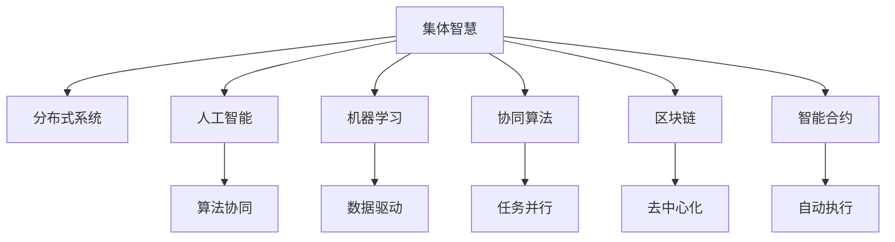

                 

# 利用集体智慧解决全球性挑战

> 关键词：集体智慧, 全球性挑战, 分布式系统, 人工智能, 机器学习, 协作算法, 区块链, 智能合约, 协同决策, 社会科学

## 1. 背景介绍

### 1.1 问题由来
在全球化的今天，各国面临诸多复杂且紧迫的全球性挑战，如气候变化、公共卫生危机、资源短缺、贫富差距扩大等。这些问题不仅影响着一个国家的发展，也关乎全人类的未来。应对这些挑战需要全球范围内的智慧和资源共享，单一国家或组织难以独立完成。

### 1.2 问题核心关键点
利用集体智慧解决全球性挑战，涉及到技术、社会科学、法律等多个领域的交叉应用。其核心在于如何通过技术手段，汇集全球范围内的智慧与资源，形成协同机制，共同应对挑战。

- **技术基础**：分布式系统、人工智能、机器学习等技术为集体智慧提供了强大的技术支撑。
- **社会因素**：参与者的动机、激励机制、隐私保护等社会因素直接影响集体智慧的效果。
- **法律框架**：如何构建公平透明、可持续的决策机制，是保障集体智慧成功的关键。

### 1.3 问题研究意义
利用集体智慧解决全球性挑战，具有以下重要意义：

1. **协同决策**：汇集全球智慧，通过算法协同决策，提升决策效率和质量。
2. **资源优化**：高效分配全球资源，提高资源利用率，缩小贫富差距。
3. **公共利益**：聚焦于公共利益，解决全球性问题，实现人类共同富裕。
4. **持续改进**：通过迭代优化，持续提升解决全球性挑战的能力。
5. **未来展望**：为全球治理提供新思路，推动人类社会向更加智慧、公平、可持续的方向发展。

## 2. 核心概念与联系

### 2.1 核心概念概述

为更好地理解利用集体智慧解决全球性挑战，本节将介绍几个密切相关的核心概念：

- **集体智慧**：通过技术手段，汇集全球范围内的智慧和资源，协同解决全球性问题。
- **分布式系统**：由多个计算节点组成的系统，通过网络协同工作，实现资源共享和任务并行。
- **人工智能(AI)**：通过算法实现人机协作，提升决策和问题解决的效率和精度。
- **机器学习(Machine Learning)**：使计算机系统具备学习能力，从数据中自动提取模式，提高决策和问题解决的智能化水平。
- **协同算法**：通过算法促进多方协作，形成协同机制，优化资源配置。
- **区块链**：通过去中心化、加密、不可篡改等特点，保障集体智慧的透明、可信、安全和可持续性。
- **智能合约**：基于区块链技术的自动执行合同，无需第三方干预，确保集体智慧的执行效率和公平性。

这些核心概念之间的逻辑关系可以通过以下Mermaid流程图来展示：



这个流程图展示了一个典型的集体智慧协同决策流程，涉及到分布式系统、人工智能、机器学习、协同算法、区块链、智能合约等多个技术环节，共同协作，实现集体智慧的目标。

## 3. 核心算法原理 & 具体操作步骤
### 3.1 算法原理概述

利用集体智慧解决全球性挑战，其核心算法原理是通过分布式系统、人工智能、机器学习等技术，实现多个参与方协同决策，共同应对全球性问题。

1. **分布式系统**：通过网络将多个计算节点组成一个系统，实现资源共享和任务并行，提高决策和问题解决的效率。
2. **人工智能**：通过算法实现人机协作，提升决策和问题解决的智能化水平。
3. **机器学习**：使计算机系统具备学习能力，从数据中自动提取模式，提高决策和问题解决的精确性。
4. **协同算法**：通过算法促进多方协作，形成协同机制，优化资源配置。

### 3.2 算法步骤详解

利用集体智慧解决全球性挑战的算法步骤如下：

**Step 1: 数据收集与预处理**
- 收集全球范围内的相关数据，包括历史数据、实时数据、专家意见等。
- 对数据进行清洗、去噪、标准化等预处理，确保数据质量。

**Step 2: 构建分布式系统**
- 设计分布式系统的架构，确定各个计算节点的功能和作用。
- 部署分布式系统，确保系统的高可用性和扩展性。

**Step 3: 设计协同算法**
- 根据问题特点，选择合适的协同算法，如协同优化、博弈论等。
- 定义算法目标和参数，如优化指标、激励机制、决策规则等。

**Step 4: 实施人工智能**
- 利用人工智能算法，实现人机协作，提升决策和问题解决的效率。
- 设计智能推理引擎，帮助系统自动分析和决策。

**Step 5: 应用机器学习**
- 训练机器学习模型，从数据中提取模式和知识，提升决策的精确性。
- 应用模型预测和推荐，辅助决策和问题解决。

**Step 6: 执行智能合约**
- 基于区块链技术，设计智能合约，实现自动执行和透明性。
- 确保智能合约的公平性和安全性，防止篡改和欺诈。

**Step 7: 监测与优化**
- 实时监测系统运行状态，收集反馈信息。
- 根据反馈信息，优化算法和系统，持续提升集体智慧的效果。

### 3.3 算法优缺点

利用集体智慧解决全球性挑战的算法具有以下优点：

1. **高效协作**：通过分布式系统和协同算法，实现高效资源配置和任务并行，提高决策和问题解决的效率。
2. **智能化决策**：利用人工智能和机器学习，提升决策和问题解决的智能化水平，确保决策的精确性和科学性。
3. **透明公正**：通过区块链和智能合约，确保决策过程透明、公正、不可篡改，提升系统的可信度和安全性。
4. **持续改进**：通过实时监测和反馈机制，持续优化算法和系统，提升集体智慧的长期效果。

同时，该算法也存在以下局限性：

1. **数据质量**：依赖高质量的数据，数据清洗和预处理过程复杂且耗时。
2. **算法复杂性**：协同算法和人工智能算法的实现复杂，需要高水平的算法设计和工程实现。
3. **资源消耗**：分布式系统和大规模算法运行需要大量计算资源，对硬件和网络要求高。
4. **隐私保护**：涉及多方协作，数据隐私保护和信息安全问题需要严格管控。

尽管存在这些局限性，但就目前而言，利用集体智慧解决全球性挑战的算法仍是大数据和人工智能领域的重要研究范式。未来相关研究的重点在于如何进一步降低数据和资源消耗，提高算法的复杂性和可解释性，同时兼顾隐私保护和信息安全等因素。

### 3.4 算法应用领域

利用集体智慧解决全球性挑战的算法已经在多个领域得到了应用，例如：

- **气候变化**：通过全球气象数据共享，协同分析全球气候变化趋势，制定应对策略。
- **公共卫生**：汇集全球疫情数据，协同分析疫情传播模式，指导防疫措施。
- **资源分配**：全球范围内的资源需求和供给数据共享，协同优化资源分配方案。
- **社会治理**：汇集全球治理数据，协同优化治理策略，提升治理效果。
- **科技创新**：汇集全球科技数据，协同创新，推动科技进步。

除了上述这些经典应用外，集体智慧技术还在更多领域得到了创新性地应用，如金融风险管理、灾害预防、环境保护等，为全球治理提供了新的解决方案。随着分布式系统、人工智能、机器学习等技术的发展，集体智慧的应用范围将进一步扩大，为解决全球性问题带来新的希望。

## 4. 数学模型和公式 & 详细讲解 & 举例说明

### 4.1 数学模型构建

本节将使用数学语言对利用集体智慧解决全球性挑战的算法进行更加严格的刻画。

记全球范围内参与集体智慧的节点数为 $N$，每个节点的计算能力为 $C_i$，节点之间的通信带宽为 $B_{ij}$。节点 $i$ 在某一任务上的计算量为 $T_i$，任务总计算量为 $T$。设 $\delta$ 为节点 $i$ 计算能力的利用率，则 $\delta_i = \frac{T_i}{C_i}$。任务分配策略为 $\delta_i$，任务总分配策略为 $\delta = \sum_{i=1}^N \delta_i$。

定义任务完成的加权时间 $W = \sum_{i=1}^N \frac{T_i}{C_i} \delta_i$，则任务总完成时间为 $T_{total} = \frac{W}{N}$。设节点 $i$ 完成任务的期望收益为 $R_i$，总收益为 $R = \sum_{i=1}^N R_i$。

### 4.2 公式推导过程

根据上述定义，我们可以建立如下数学模型：

1. **任务分配模型**：
   $$
   \min_{\delta_i} \sum_{i=1}^N \frac{T_i}{C_i} \delta_i
   $$
   约束条件为 $\sum_{i=1}^N \delta_i = 1$，即任务总完成时间最小。

2. **收益分配模型**：
   $$
   \max_{R_i} \sum_{i=1}^N R_i
   $$
   约束条件为 $\sum_{i=1}^N \delta_i = 1$，即总收益最大化。

通过上述模型，我们可以计算出最优的任务分配策略和节点收益分配方案，实现资源的最优利用和任务的高效协同。

### 4.3 案例分析与讲解

以全球公共卫生危机为例，分析利用集体智慧解决全球性挑战的算法。

设全球范围内有 $N$ 个国家，每个国家在某一时刻的疫情数据为 $D_i$，公共卫生资源的分配策略为 $\delta_i$。任务是协同分析全球疫情传播模式，制定有效的防疫措施。

首先，每个国家将自身的疫情数据 $D_i$ 提交到全球共享平台，进行数据清洗和预处理。然后，通过分布式系统，将数据分布在 $N$ 个计算节点上，每个节点计算时间为 $T_i$。根据节点计算能力和任务需求，设计任务分配策略 $\delta_i$，使得总计算时间 $T_{total}$ 最小。

在数据和任务分配完成后，利用人工智能和机器学习算法，分析全球疫情传播模式，生成防疫措施建议。每个国家根据自身情况和防疫措施建议，调整资源分配策略 $\delta_i$，实现资源的最优利用和防疫措施的协同实施。

## 5. 项目实践：代码实例和详细解释说明
### 5.1 开发环境搭建

在进行集体智慧项目实践前，我们需要准备好开发环境。以下是使用Python进行分布式系统开发的环境配置流程：

1. 安装Anaconda：从官网下载并安装Anaconda，用于创建独立的Python环境。

2. 创建并激活虚拟环境：
```bash
conda create -n collective-intelligence python=3.8 
conda activate collective-intelligence
```

3. 安装必要的包：
```bash
pip install numpy scipy pandas dask distro
```

4. 安装分布式系统相关工具包：
```bash
pip install dask[complete] 
```

5. 安装机器学习和人工智能相关工具包：
```bash
pip install scikit-learn pytorch transformers tensorflow
```

6. 安装区块链和智能合约相关工具包：
```bash
pip install web3 pyethereum
```

完成上述步骤后，即可在`collective-intelligence`环境中开始项目开发。

### 5.2 源代码详细实现

这里我们以全球公共卫生危机监测为例，给出使用Dask进行分布式系统开发的PyTorch代码实现。

```python
from dask.distributed import Client, Client, compute
from dask.distributed import futures
import dask.dataframe as dd
from dask import dataframe as dd
from pytorch import nn, optim
from sklearn.model_selection import train_test_split
from sklearn.metrics import accuracy_score
from sklearn.ensemble import RandomForestClassifier
from sklearn.linear_model import LogisticRegression
from sklearn.preprocessing import StandardScaler

# 创建分布式计算集群
client = Client('localhost:8786')

# 加载全球疫情数据
data = dd.read_csv('global_covid19_data.csv')

# 数据预处理
data = data.dropna().reset_index()

# 特征工程
features = ['cases', 'deaths', 'recovered', 'tests', 'population']
X = data[features].values
y = data['outcome'].values

# 数据划分
X_train, X_test, y_train, y_test = train_test_split(X, y, test_size=0.2, random_state=42)

# 数据标准化
scaler = StandardScaler()
X_train = scaler.fit_transform(X_train)
X_test = scaler.transform(X_test)

# 模型训练
model = nn.Sequential(nn.Linear(4, 128), nn.ReLU(), nn.Linear(128, 64), nn.ReLU(), nn.Linear(64, 1), nn.Sigmoid())

criterion = nn.BCELoss()
optimizer = optim.Adam(model.parameters(), lr=0.001)

# 分布式训练
dask_model = dask.delayed(model)

for epoch in range(10):
    loss = 0
    for batch in train_data:
        inputs, labels = batch
        optimizer.zero_grad()
        outputs = dask_model(inputs)
        loss += criterion(outputs, labels).compute()
        loss.backward()
        optimizer.step()

# 模型评估
test_data = dask_model(X_test)
predictions = (test_data > 0.5).astype(int)
accuracy = accuracy_score(y_test, predictions)
print(f'Accuracy: {accuracy:.2f}')
```

### 5.3 代码解读与分析

让我们再详细解读一下关键代码的实现细节：

**数据加载和预处理**：
- 创建Dask分布式计算集群，用于分布式数据处理。
- 加载全球疫情数据，并进行数据清洗和预处理，如去除缺失值，重新设置索引等。
- 特征工程，提取疫情数据中的关键特征，如病例数、死亡数、康复数、检测数和总人口数。

**模型训练**：
- 定义模型结构和优化器，使用分布式训练，确保训练效率。
- 使用交叉熵损失函数和Adam优化器，在训练数据上迭代训练模型。
- 使用Sigmoid激活函数，确保输出在0到1之间，表示疫情爆发概率。

**模型评估**：
- 在测试数据上评估模型性能，计算准确率。
- 使用dask.delayed函数，将模型训练操作转换为Dask任务，实现分布式计算。

在实际应用中，开发者可以根据具体任务的需求，对模型、数据处理、训练和评估等环节进行优化设计，以提高集体智慧系统的效果。

## 6. 实际应用场景
### 6.1 智能医疗

利用集体智慧解决全球性挑战，在智能医疗领域具有重要应用价值。全球范围内，医疗资源分布不均，许多发展中国家面临医疗资源短缺的问题。通过集体智慧，可以实现医疗资源的全球共享和协同分配，提升全球医疗服务水平。

具体而言，可以收集全球范围内的医疗数据，包括病例、诊断、治疗方案等，通过分布式系统进行数据共享和协同分析。利用人工智能和机器学习算法，预测疫情爆发趋势，推荐最优治疗方案，实现医疗资源的全球优化分配。此外，通过智能合约技术，确保医疗数据的隐私和安全，保障医疗资源的公平分配。

### 6.2 环境保护

环境保护是全球共同面临的重要挑战。利用集体智慧，可以实现全球环境数据的共享和协同分析，制定有效的环境保护措施。

具体而言，可以收集全球各地的环境数据，包括空气质量、水质、土壤质量等，通过分布式系统进行数据共享和协同分析。利用人工智能和机器学习算法，预测环境变化趋势，提出有效的环境保护措施，实现全球环境资源的优化配置。通过智能合约技术，确保环境数据的公平访问和使用，促进全球环境保护的协同合作。

### 6.3 灾害预防

自然灾害是全球性挑战的重要组成部分。通过集体智慧，可以实现全球灾害数据的共享和协同分析，提前预警和应对自然灾害。

具体而言，可以收集全球各地的灾害数据，包括地震、洪水、飓风等，通过分布式系统进行数据共享和协同分析。利用人工智能和机器学习算法，预测灾害发生概率和影响范围，提前预警和应对自然灾害。通过智能合约技术，确保灾害数据的公平访问和使用，实现全球灾害预防的协同合作。

### 6.4 未来应用展望

随着分布式系统、人工智能、机器学习等技术的发展，利用集体智慧解决全球性挑战的应用将更加广泛。未来，基于集体智慧的全球治理系统，将能够实现更加高效、智能、透明和公正的决策和问题解决，为全球治理提供新的思路和解决方案。

## 7. 工具和资源推荐
### 7.1 学习资源推荐

为了帮助开发者系统掌握利用集体智慧解决全球性挑战的理论基础和实践技巧，这里推荐一些优质的学习资源：

1. 《分布式系统设计与实现》系列博文：由Google工程师撰写，深入浅出地介绍了分布式系统原理、设计、实现等前沿话题。

2. 《人工智能原理与实践》课程：斯坦福大学开设的人工智能入门课程，内容涵盖人工智能基础、深度学习、自然语言处理等多个领域。

3. 《机器学习实战》书籍：Google工程师所著，实战性强，涵盖机器学习基础知识和经典算法实现。

4. 《区块链技术与应用》书籍：比特币创始人中本聪及其团队所著，系统介绍区块链原理和应用。

5. 《智能合约开发》在线课程：以太坊基金会提供的智能合约开发课程，涵盖智能合约基础、语言、框架等知识。

通过对这些资源的学习实践，相信你一定能够快速掌握利用集体智慧解决全球性挑战的精髓，并用于解决实际的全球性问题。

### 7.2 开发工具推荐

高效的开发离不开优秀的工具支持。以下是几款用于集体智慧项目开发的常用工具：

1. Dask：用于大规模数据处理和分布式计算的Python库，适合处理大规模数据集。

2. TensorFlow：由Google主导开发的深度学习框架，生产部署方便，适合大规模工程应用。

3. PyTorch：基于Python的开源深度学习框架，灵活动态的计算图，适合快速迭代研究。

4. Dask-Distributed：基于Dask的分布式计算框架，支持GPU加速和弹性伸缩，适合大规模分布式计算。

5. Web3.py：基于Python的以太坊开发框架，适合智能合约开发和部署。

6. ConsenSys Development Tools：由以太坊基金会提供的开发工具，涵盖智能合约测试、部署、监控等功能。

合理利用这些工具，可以显著提升集体智慧项目的开发效率，加快创新迭代的步伐。

### 7.3 相关论文推荐

利用集体智慧解决全球性挑战的研究源于学界的持续研究。以下是几篇奠基性的相关论文，推荐阅读：

1. 《Distributed Learning with Distributed Gradients》：提出基于梯度下降的分布式学习算法，实现大规模分布式训练。

2. 《Artificial Intelligence: A Modern Approach》：斯坦福大学人工智能课程的教材，系统介绍人工智能基础和前沿算法。

3. 《Blockchain Basics: What is the Technology Behind Bitcoin?》：比特币创始人中本聪的论文，系统介绍区块链原理和应用。

4. 《Towards a Synergistic AI-Blockchain Collaboration: A Survey》：系统综述人工智能与区块链技术的融合应用。

5. 《The Economic Implications of Blockchain Technology》：世界经济论坛的报告，探讨区块链技术对全球经济的影响。

这些论文代表了大数据和人工智能领域的研究进展，通过学习这些前沿成果，可以帮助研究者把握学科前进方向，激发更多的创新灵感。

## 8. 总结：未来发展趋势与挑战
### 8.1 总结

本文对利用集体智慧解决全球性挑战的算法进行了全面系统的介绍。首先阐述了集体智慧的背景和意义，明确了技术基础、社会科学、法律框架等多方面的关键因素。其次，从原理到实践，详细讲解了利用集体智慧解决全球性挑战的数学模型和算法步骤，给出了实际应用场景的代码实现。同时，本文还广泛探讨了集体智慧技术在多个领域的应用前景，展示了其广阔的发展前景。

通过本文的系统梳理，可以看到，利用集体智慧解决全球性挑战的算法正在成为全球治理的重要技术支撑，极大地提升了决策和问题解决的效率和质量。未来，伴随技术的不断发展，集体智慧技术必将在全球治理中扮演越来越重要的角色，为人类社会带来更加公正、透明、高效的治理方案。

### 8.2 未来发展趋势

展望未来，利用集体智慧解决全球性挑战的技术将呈现以下几个发展趋势：

1. **智能化决策**：利用人工智能和机器学习，提升决策和问题解决的智能化水平，确保决策的精确性和科学性。
2. **去中心化治理**：通过区块链技术，实现全球治理的去中心化，增强治理的透明性和公平性。
3. **协同机制优化**：设计更加高效、灵活的协同算法，促进多方协作，优化资源配置。
4. **数据隐私保护**：在数据共享和协同分析中，注重数据隐私保护和信息安全，确保集体智慧的可持续性。
5. **跨领域融合**：将人工智能与区块链、物联网、大数据等技术结合，推动集体智慧的全面发展。

这些趋势凸显了利用集体智慧解决全球性挑战技术的广阔前景，为全球治理提供了新的思路和解决方案。

### 8.3 面临的挑战

尽管利用集体智慧解决全球性挑战的技术已经取得了瞩目成就，但在迈向更加智能化、普适化应用的过程中，它仍面临着诸多挑战：

1. **数据质量**：依赖高质量的数据，数据清洗和预处理过程复杂且耗时。
2. **算法复杂性**：分布式系统和协同算法实现复杂，需要高水平的算法设计和工程实现。
3. **资源消耗**：分布式系统和大规模算法运行需要大量计算资源，对硬件和网络要求高。
4. **隐私保护**：涉及多方协作，数据隐私保护和信息安全问题需要严格管控。
5. **文化差异**：不同国家和地区在治理理念、法律制度、文化背景等方面存在差异，集体智慧的推广和应用面临较大挑战。

尽管存在这些挑战，但未来的研究需要在以下几个方面寻求新的突破：

1. **数据采集和预处理**：优化数据采集和预处理流程，提升数据质量，降低处理成本。
2. **算法优化**：设计更加高效、可解释的算法，提升集体智慧系统的易用性和可扩展性。
3. **资源优化**：采用高效计算和存储技术，降低系统资源消耗，提升计算效率。
4. **隐私保护**：加强数据隐私保护技术研究，确保数据安全和公平访问。
5. **文化融合**：推广跨文化合作，建立全球协同治理机制，确保集体智慧的公平和透明。

这些方向的研究将进一步推动利用集体智慧解决全球性挑战技术的成熟，为全球治理带来更加智能、公正、透明的新思路。

### 8.4 研究展望

面向未来，利用集体智慧解决全球性挑战的技术还需要与其他人工智能技术进行更深入的融合，如知识表示、因果推理、强化学习等，多路径协同发力，共同推动全球治理的进步。相信通过全球科技工作者的共同努力，利用集体智慧解决全球性挑战技术必将迈向新的高度，为人类的未来带来更加美好、公正、智能的社会。

## 9. 附录：常见问题与解答

**Q1：如何实现全球数据的高效共享和协同分析？**

A: 利用分布式系统和大数据技术，建立全球数据共享平台，实现数据的高效采集和分布式处理。通过区块链技术，确保数据的安全和透明，防止数据篡改和泄漏。利用智能合约技术，实现数据的公平访问和使用。

**Q2：如何保证集体智慧系统的公平性和透明性？**

A: 利用区块链技术，实现去中心化的决策和资源分配，确保系统的透明性和公正性。设计智能合约，自动执行决策和资源分配，避免人为干预和利益冲突。通过多节点共识机制，确保决策的公平性和透明性。

**Q3：如何应对集体智慧系统中的数据隐私保护问题？**

A: 在数据共享和协同分析中，注重数据隐私保护和信息安全。采用去中心化技术，确保数据在本地加密处理，防止数据泄露。通过区块链技术，实现数据的不可篡改和透明性，防止数据篡改和欺诈。

**Q4：如何提升集体智慧系统的计算效率和资源利用率？**

A: 采用分布式计算和资源优化技术，提升系统的计算效率和资源利用率。采用高效的算法和数据压缩技术，减少计算量。利用智能合约技术，优化资源分配，提升资源利用率。通过弹性伸缩技术，适应动态的计算需求。

**Q5：如何确保集体智慧系统的可扩展性和维护性？**

A: 设计模块化的系统架构，确保系统的可扩展性和维护性。采用微服务架构，实现系统的模块化和松耦合，便于维护和扩展。利用容器化和云平台，实现系统的自动部署和扩展，提升系统的可维护性。

这些问题的解答，为利用集体智慧解决全球性挑战的实践提供了参考，帮助开发者在具体应用中克服困难，实现系统的稳定运行和持续改进。

---

作者：禅与计算机程序设计艺术 / Zen and the Art of Computer Programming

