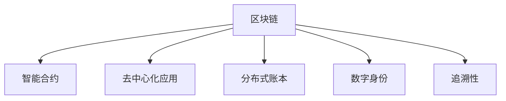

                 

# 区块链在供应链管理中的应用：提高透明度和效率

> 关键词：区块链,供应链管理,透明度,效率,智能合约,去中心化,分布式账本,数字身份

## 1. 背景介绍

### 1.1 问题由来
供应链管理（Supply Chain Management, SCM）是指在生产和销售全过程中，涉及物料采购、生产、库存、运输、分销和客户服务等一系列活动的管理。传统的供应链管理通常面临诸多挑战：

- **数据分散**：供应链各环节的数据分散存储在各个企业系统中，缺乏统一的管理平台，导致数据共享难度大。
- **透明度低**：供应链参与企业之间缺乏透明的信息共享机制，导致订单执行状态不清晰、货物位置不明确等问题。
- **效率低**：传统供应链管理流程繁琐，需要人工介入和手动操作，流程中容易出现错误和延迟。
- **信任问题**：供应链各方之间缺乏信任机制，合同执行和货款支付等环节容易出现纠纷。

为了解决这些挑战，区块链技术因其去中心化、不可篡改、高透明度等特性，被认为能够在供应链管理中发挥重要作用。

### 1.2 问题核心关键点
区块链在供应链管理中的应用主要集中在以下几个方面：

- **数据透明**：通过区块链分布式账本技术，所有参与方都能实时查看供应链数据，消除数据孤岛。
- **智能合约**：利用区块链上的智能合约，自动执行合同条款，减少人为干预，提高合同执行效率。
- **去中心化**：区块链的去中心化特性，使得供应链各方不再依赖单一中介，降低了交易成本，提高了系统的鲁棒性。
- **身份验证**：基于区块链的数字身份系统，为供应链各方提供可信的认证服务。
- **追溯性**：利用区块链的不可篡改特性，实现供应链产品的全流程追溯，保障产品质量和消费者权益。

这些关键点共同构成了区块链在供应链管理中的核心应用价值。

## 2. 核心概念与联系

### 2.1 核心概念概述

为更好地理解区块链在供应链管理中的应用，本节将介绍几个密切相关的核心概念：

- **区块链（Blockchain）**：一种分布式数据库技术，通过加密和共识机制，实现数据的去中心化存储和透明化管理。
- **智能合约（Smart Contract）**：一种基于区块链的自动化合约，能够自动执行、记录、存储数据和支付，减少中间环节。
- **去中心化应用（DApp）**：一种基于区块链的分布式应用，提供去中心化、透明化的服务，增强系统安全性。
- **分布式账本（Distributed Ledger）**：一种基于区块链的记录技术，所有参与方共享同一账本，确保数据的一致性和透明性。
- **数字身份（Digital Identity）**：一种基于区块链的数字证书，用于身份验证和权限管理，增强系统的信任度。
- **追溯性（Traceability）**：利用区块链的不可篡改特性，实现产品的全流程追溯，保障产品质量和消费者权益。

这些核心概念之间的逻辑关系可以通过以下Mermaid流程图来展示：



这个流程图展示了大语言模型的核心概念及其之间的关系：

1. 区块链作为底层技术，通过分布式账本和智能合约，提供去中心化、透明化的数据管理和自动化合约执行。
2. 智能合约利用区块链的特性，实现自动化的合同执行和管理，提高效率。
3. 去中心化应用扩展了区块链的功能，提供更丰富、灵活的服务。
4. 数字身份和追溯性分别利用区块链的不可篡改和透明性，增强系统的信任度和透明度。

这些概念共同构成了区块链在供应链管理中的基本应用框架，使其能够发挥强大的数据管理和自动化执行能力。通过理解这些核心概念，我们可以更好地把握区块链在供应链管理中的应用价值。

## 3. 核心算法原理 & 具体操作步骤
### 3.1 算法原理概述

区块链在供应链管理中的应用，本质上是一个数据透明和自动化合约执行的过程。其核心思想是：通过区块链分布式账本技术，实现供应链数据的透明共享；利用智能合约的自动化执行能力，提高供应链各环节的效率。

具体而言，假设供应链上存在多个参与方，每个参与方都在区块链上拥有一个唯一的数字身份，并按照区块链的共识机制，共同维护和更新供应链数据。在供应链的每个环节，通过智能合约自动执行合同条款，确保数据的透明性和准确性。

### 3.2 算法步骤详解

区块链在供应链管理中的应用主要包括以下几个关键步骤：

**Step 1: 定义供应链数据结构**

在区块链上，供应链数据通常被组织成区块（Block）和链（Chain）的结构，每个区块包含多个交易记录（Transaction），而整个区块链是这些区块按时间顺序依次排列组成的链。在供应链管理中，交易记录可能包含订单信息、货物位置、合同条款等数据。

**Step 2: 设计智能合约**

根据供应链的实际需求，设计智能合约来自动执行合同条款。例如，当订单被确认接收时，智能合约自动将货物位置更新到区块链上，并通知相关方进行下一步操作。智能合约可以通过Solidity、Ethereum等编程语言编写。

**Step 3: 部署和初始化智能合约**

将设计的智能合约部署到区块链上，并通过初始化参数设定合约的具体行为。例如，设定智能合约的合同执行规则、支付条件等。

**Step 4: 数据透明共享**

通过区块链的分布式账本技术，所有供应链参与方都能够实时查看和更新供应链数据。例如，订单信息、货物位置、支付记录等，确保数据的透明性和一致性。

**Step 5: 自动执行合同条款**

当供应链中的某个事件发生时，智能合约自动执行相应的合同条款。例如，当货物到达指定位置时，智能合约自动触发支付流程，减少人为干预，提高合同执行效率。

**Step 6: 数字身份验证**

利用区块链的数字身份系统，为供应链各方提供可信的认证服务。例如，通过数字证书验证交易方的身份和权限，增强系统的信任度。

**Step 7: 追溯供应链产品**

利用区块链的不可篡改特性，实现供应链产品的全流程追溯，保障产品质量和消费者权益。例如，通过区块链记录产品的生产、运输、销售等全过程信息，确保产品的来源和安全性。

### 3.3 算法优缺点

区块链在供应链管理中的应用具有以下优点：

1. **数据透明**：所有供应链数据透明共享，提高信息透明度和准确性，减少数据孤岛。
2. **自动化执行**：智能合约的自动化执行能力，减少人为干预，提高合同执行效率。
3. **去中心化**：去中心化特性，降低交易成本，增强系统的鲁棒性。
4. **信任增强**：数字身份和智能合约增强了供应链各方的信任度，降低纠纷风险。
5. **追溯性**：全流程追溯，保障产品质量和消费者权益。

同时，该方法也存在一定的局限性：

1. **初始部署成本**：区块链的部署和智能合约的设计需要一定的技术和资金投入，初期成本较高。
2. **技术复杂性**：智能合约的开发和调试复杂，需要具备一定的编程和区块链知识。
3. **共识机制问题**：不同共识机制的选择可能影响区块链的性能和安全性。
4. **隐私保护**：透明共享的数据可能包含敏感信息，需要采取措施保护隐私。
5. **扩展性问题**：大规模供应链数据的透明共享可能面临网络延迟和性能瓶颈。

尽管存在这些局限性，但就目前而言，区块链技术仍是在供应链管理中应用最广泛的技术之一，具有显著的优势和广泛的应用前景。

### 3.4 算法应用领域

区块链在供应链管理中的应用领域非常广泛，涵盖以下几个方面：

- **物流管理**：利用区块链记录货物的位置和运输状态，提高物流效率和透明度。
- **库存管理**：通过智能合约自动调整库存，减少库存成本和浪费。
- **支付和结算**：利用区块链自动执行支付和结算流程，减少人为干预，提高支付效率。
- **供应链金融**：通过区块链实现供应链上下游的融资和担保，降低融资成本和风险。
- **质量追溯**：利用区块链实现供应链产品的全流程追溯，保障产品质量和消费者权益。
- **合规和审计**：通过区块链的透明性和不可篡改特性，提高供应链的合规性和审计效率。

除了上述这些核心应用领域外，区块链技术还扩展到供应链管理中的更多场景，如供应链合同管理、供应商管理等，为供应链的各环节提供更高效、透明、可追溯的管理方案。

## 4. 数学模型和公式 & 详细讲解 & 举例说明

### 4.1 数学模型构建

在供应链管理中，区块链的应用主要涉及到数据的透明共享和自动执行。以下我们以物流管理为例，构建基于区块链的数学模型。

假设供应链中有A、B两个参与方，A负责生产，B负责物流。A和B在区块链上都有一个唯一的数字身份，并按照区块链的共识机制，共同维护和更新供应链数据。当A生产出货物时，将订单信息上传到区块链，B在区块链上查看订单信息，并将货物位置更新到区块链上，然后通知A进行下一步操作。

**Step 1: 定义数据结构**

供应链数据通常被组织成区块（Block）和链（Chain）的结构。每个区块包含多个交易记录（Transaction），而整个区块链是这些区块按时间顺序依次排列组成的链。

**Step 2: 设计智能合约**

智能合约是自动化执行的合同，可以根据供应链的需求设计相应的合约条款。例如，当订单被确认接收时，智能合约自动将货物位置更新到区块链上，并通知相关方进行下一步操作。

### 4.2 公式推导过程

以下我们以物流管理为例，推导基于区块链的数学模型。

假设智能合约的执行规则为：当订单被确认接收时，智能合约自动将货物位置更新到区块链上，并通知相关方进行下一步操作。在智能合约中，订单信息的哈希值（Hash）为订单ID，货物位置（Position）为物流信息，支付金额（Payment）为货款。智能合约的代码如下：

```solidity
pragma solidity ^0.8.0;

contract LogisticsContract {
    uint256 public orderID;
    string public position;
    uint256 public payment;
    
    event OrderReceived(uint256 indexed orderID, string position);
    
    function updatePosition(uint256 _orderID, string _position, uint256 _payment) public {
        require(msg.sender == owner, "Not owner");
        orderID = _orderID;
        position = _position;
        payment = _payment;
        emit OrderReceived(orderID, position);
    }
}
```

### 4.3 案例分析与讲解

我们以一个物流订单为例，说明智能合约的具体执行过程：

假设A向B发出一个物流订单，订单信息包含订单ID、货物数量、货物位置等。B在区块链上查看订单信息，并确认接收。根据智能合约的执行规则，B将货物位置更新到区块链上，并通知A进行下一步操作。智能合约的执行过程如下：

1. A将订单信息上传到区块链，记录到A的账本上。
2. B在区块链上查看订单信息，确认接收。
3. B将货物位置更新到区块链上，并通知A。
4. A在区块链上查看货物位置，确认货物已到达指定位置。

通过智能合约的自动化执行，减少了人为干预，提高了合同执行效率。同时，通过区块链的透明共享，所有供应链参与方都能够实时查看订单信息，增强了信息的透明度和一致性。

## 5. 项目实践：代码实例和详细解释说明

### 5.1 开发环境搭建

在进行区块链在供应链管理中的应用实践前，我们需要准备好开发环境。以下是使用Python进行Hyperledger Fabric开发的环境配置流程：

1. 安装Hyperledger Fabric：从官网下载并安装Hyperledger Fabric，创建独立的Fabric网络。

2. 创建和管理Fabric通道（Channel）：
```bash
hyperledger fabric create channel
```

3. 创建和管理Fabric组织（Organization）和用户（User）：
```bash
hyperledger fabric create user
hyperledger fabric create organization
```

4. 安装Fabric SDKs：
```bash
npm install hyperledger-fabric-sdk@latest --save
```

5. 编写智能合约（Smart Contract）：
```python
class LogisticsContract:
    def __init__(self):
        self.orderID = ''
        self.position = ''
        self.payment = 0
        
    def updatePosition(self, orderID, position, payment):
        self.orderID = orderID
        self.position = position
        self.payment = payment
        print("Order ID:", self.orderID)
        print("Position:", self.position)
        print("Payment:", self.payment)
```

完成上述步骤后，即可在Fabric环境中开始区块链在供应链管理中的应用实践。

### 5.2 源代码详细实现

下面是使用Hyperledger Fabric对区块链在供应链管理中进行物流管理的具体代码实现。

首先，定义物流订单的数据结构：

```python
class Order:
    def __init__(self, orderID, position, payment):
        self.orderID = orderID
        self.position = position
        self.payment = payment
```

然后，定义智能合约：

```python
from hyperledger_fabric import Contract

class LogisticsContract(Contract):
    def __init__(self):
        super().__init__()
        self.orderID = ''
        self.position = ''
        self.payment = 0
        
    def updatePosition(self, orderID, position, payment):
        self.orderID = orderID
        self.position = position
        self.payment = payment
        print("Order ID:", self.orderID)
        print("Position:", self.position)
        print("Payment:", self.payment)
```

接着，部署和初始化智能合约：

```python
def main():
    # 创建Fabric网络
    network = FabricNetwork()
    # 创建Fabric组织和用户
    org1 = NetworkOrganization('org1')
    user1 = org1.createUser('user1', 'password')
    # 创建Fabric通道
    channel = network.createChannel('channel')
    # 创建智能合约
    contract = LogisticsContract()
    # 部署智能合约
    contract.deploy(channel, user1)
```

最后，启动智能合约，进行物流管理：

```python
if __name__ == '__main__':
    main()
```

以上就是使用Hyperledger Fabric对区块链在供应链管理中进行物流管理的完整代码实现。可以看到，通过Hyperledger Fabric的强大功能和丰富的工具支持，实现供应链管理的区块链应用变得简单高效。

### 5.3 代码解读与分析

让我们再详细解读一下关键代码的实现细节：

**Order类**：
- 定义了物流订单的基本属性，包括订单ID、货物位置、支付金额等。

**LogisticsContract类**：
- 继承自Hyperledger Fabric的Contract类，用于实现智能合约的功能。
- `updatePosition`方法用于更新物流订单的位置和支付金额，将新的订单信息记录到区块链上。

**main函数**：
- 创建Fabric网络、组织和用户，以及智能合约。
- 部署智能合约到区块链上。
- 在Fabric网络上进行物流管理操作，更新物流订单信息。

在实际应用中，还需要考虑更多因素，如网络配置、身份验证、数据加密等。Hyperledger Fabric提供了丰富的工具和API，开发者可以灵活组合这些组件，实现复杂的供应链管理需求。

## 6. 实际应用场景

### 6.1 智能物流系统

区块链在智能物流系统中的应用，主要体现在货物位置和运输状态的透明共享。通过区块链记录货物的实时位置，并利用智能合约自动更新货物状态，可以大大提高物流效率和透明度。

在实际系统中，物流企业可以在区块链上创建一个智能合约，记录货物的运输状态。当货物到达指定位置时，智能合约自动更新货物位置，并通知相关方进行下一步操作。物流参与方通过区块链可以实时查看货物状态，减少人工干预，提高物流效率。

### 6.2 供应链金融

区块链在供应链金融中的应用，主要体现在自动执行支付和担保流程。通过智能合约实现供应链上下游的融资和担保，可以降低融资成本和风险，提高金融效率。

在实际系统中，供应链上下游企业可以在区块链上创建一个智能合约，记录融资和担保条款。当订单被确认接收时，智能合约自动触发支付流程，并通知相关方进行下一步操作。金融机构通过区块链可以实时监控合同执行情况，确保交易的透明性和安全性。

### 6.3 食品安全追溯

区块链在食品安全追溯中的应用，主要体现在产品的全流程追溯。通过区块链记录产品的生产、运输、销售等全过程信息，可以保障产品的来源和安全性，增强消费者对食品的信任度。

在实际系统中，食品生产企业在区块链上创建一个智能合约，记录产品的生产、加工、运输等信息。消费者可以通过区块链实时查看产品的追溯信息，确认产品的来源和安全性，提高食品安全水平。

### 6.4 未来应用展望

随着区块链技术的不断发展和应用，未来在供应链管理中的应用将更加广泛和深入。以下是几个可能的发展方向：

1. **跨链互操作**：通过区块链的跨链技术，实现不同区块链之间的互操作，提高供应链各环节的数据流通和共享。
2. **去中心化市场**：利用区块链的去中心化特性，构建供应链上下游的拍卖市场，实现公平竞争和高效交易。
3. **智能合约平台**：利用智能合约的自动化执行能力，构建供应链管理平台，实现供应链各环节的自动化管理和协同。
4. **供应链溯源平台**：利用区块链的追溯性，构建供应链溯源平台，实现产品全流程追溯，保障产品质量和消费者权益。
5. **供应链协同平台**：利用区块链的透明共享特性，构建供应链协同平台，实现供应链各环节的实时协作和信息共享。

这些发展方向将进一步拓展区块链在供应链管理中的应用范围，提高供应链的效率和透明度，为供应链的数字化转型提供新的动力。

## 7. 工具和资源推荐

### 7.1 学习资源推荐

为了帮助开发者系统掌握区块链在供应链管理中的应用，这里推荐一些优质的学习资源：

1. Hyperledger Fabric官方文档：Hyperledger Fabric的官方文档，提供了丰富的教程和示例代码，是上手实践的必备资料。
2. IBM区块链教程：IBM提供的区块链入门教程，涵盖了区块链技术的基本概念和应用场景。
3. Ethereum官方文档：Ethereum的官方文档，提供了Solidity编程语言的详细教程和示例，适用于智能合约的开发。
4. 区块链智能合约开发实战：一本关于区块链智能合约开发的实战书籍，详细讲解了区块链技术在实际应用中的开发流程。
5. 区块链与供应链管理：一本关于区块链技术在供应链管理中的应用的书籍，详细介绍了区块链技术在供应链中的应用案例。

通过对这些资源的学习实践，相信你一定能够快速掌握区块链在供应链管理中的应用精髓，并用于解决实际的供应链管理问题。

### 7.2 开发工具推荐

高效的开发离不开优秀的工具支持。以下是几款用于区块链在供应链管理中的应用开发的常用工具：

1. Hyperledger Fabric：由IBM主导开发的开源区块链平台，适用于供应链管理和智能合约的开发。
2. Ethereum：由Vitalik Buterin创立的开源区块链平台，支持智能合约的开发和部署。
3. EOS：由Block One开发的高性能区块链平台，适用于大规模智能合约的开发。
4. Tron：由Tron基金会开发的高性能区块链平台，支持智能合约的开发和部署。
5. Polkadot：由Web3基金会开发的跨链平台，支持区块链之间的互操作和数据共享。

合理利用这些工具，可以显著提升区块链在供应链管理中的应用开发效率，加快创新迭代的步伐。

### 7.3 相关论文推荐

区块链在供应链管理中的应用得益于学界的持续研究。以下是几篇奠基性的相关论文，推荐阅读：

1. Smart Contracts in Blockchain-based Supply Chain Management: An Overview：综述了区块链在供应链管理中的应用，强调了智能合约的重要性。
2. Blockchain-based Supply Chain Management: A Survey：总结了区块链在供应链管理中的应用现状和未来发展趋势。
3. Blockchain in Logistics and Supply Chain Management: A Review：回顾了区块链在物流和供应链管理中的应用案例和挑战。
4. Blockchain for Traceability and Transparency in Food Supply Chains: A Systematic Review：综述了区块链在食品安全追溯中的应用。
5. Blockchain in Finance and Supply Chain Management: A Survey：综述了区块链在供应链金融中的应用。

这些论文代表了大语言模型微调技术的发展脉络。通过学习这些前沿成果，可以帮助研究者把握学科前进方向，激发更多的创新灵感。

## 8. 总结：未来发展趋势与挑战

### 8.1 总结

本文对区块链在供应链管理中的应用进行了全面系统的介绍。首先阐述了供应链管理中面临的数据分散、透明度低、效率低等问题，明确了区块链技术在提升供应链透明度和效率方面的独特价值。其次，从原理到实践，详细讲解了区块链在供应链管理中的核心应用，包括数据透明、自动化执行、去中心化等关键技术。同时，本文还广泛探讨了区块链技术在智能物流、供应链金融、食品安全追溯等多个行业领域的应用前景，展示了区块链技术在供应链管理中的巨大潜力。此外，本文精选了区块链技术的各类学习资源，力求为读者提供全方位的技术指引。

通过本文的系统梳理，可以看到，区块链在供应链管理中的应用正在成为数字化转型的重要工具，极大地提升了供应链的透明度和效率，为供应链各环节提供了更高效、透明、可追溯的管理方案。未来，伴随区块链技术的不断演进，其将在更多领域得到广泛应用，为供应链的数字化转型提供新的动力。

### 8.2 未来发展趋势

展望未来，区块链在供应链管理中的应用将呈现以下几个发展趋势：

1. **跨链互操作**：随着区块链技术的不断发展和应用，跨链技术将进一步发展，实现不同区块链之间的互操作，提高供应链各环节的数据流通和共享。
2. **去中心化市场**：区块链的去中心化特性，将构建供应链上下游的拍卖市场，实现公平竞争和高效交易。
3. **智能合约平台**：利用智能合约的自动化执行能力，构建供应链管理平台，实现供应链各环节的自动化管理和协同。
4. **供应链溯源平台**：利用区块链的追溯性，构建供应链溯源平台，实现产品全流程追溯，保障产品质量和消费者权益。
5. **供应链协同平台**：利用区块链的透明共享特性，构建供应链协同平台，实现供应链各环节的实时协作和信息共享。

这些趋势凸显了区块链在供应链管理中的广阔前景。这些方向的探索发展，必将进一步提升供应链的效率和透明度，为供应链的数字化转型提供新的动力。

### 8.3 面临的挑战

尽管区块链在供应链管理中的应用已经取得了瞩目成就，但在迈向更加智能化、普适化应用的过程中，它仍面临着诸多挑战：

1. **初始部署成本**：区块链的部署和智能合约的设计需要一定的技术和资金投入，初期成本较高。
2. **技术复杂性**：智能合约的开发和调试复杂，需要具备一定的编程和区块链知识。
3. **共识机制问题**：不同共识机制的选择可能影响区块链的性能和安全性。
4. **隐私保护**：透明共享的数据可能包含敏感信息，需要采取措施保护隐私。
5. **扩展性问题**：大规模供应链数据的透明共享可能面临网络延迟和性能瓶颈。

尽管存在这些挑战，但区块链技术仍在不断发展和完善，相信未来在供应链管理中的应用将更加广泛和深入。

### 8.4 研究展望

面对区块链在供应链管理中所面临的挑战，未来的研究需要在以下几个方面寻求新的突破：

1. **跨链互操作技术**：研究和探索跨链互操作技术，实现不同区块链之间的数据流通和共享。
2. **去中心化市场平台**：构建去中心化市场平台，实现供应链上下游的公平竞争和高效交易。
3. **智能合约优化**：优化智能合约的执行效率和安全性，提高供应链各环节的自动化管理和协同。
4. **供应链溯源平台**：利用区块链的追溯性，构建供应链溯源平台，实现产品全流程追溯，保障产品质量和消费者权益。
5. **供应链协同平台**：利用区块链的透明共享特性，构建供应链协同平台，实现供应链各环节的实时协作和信息共享。

这些研究方向将引领区块链在供应链管理中的应用走向成熟，为供应链的数字化转型提供新的动力。相信随着学界和产业界的共同努力，区块链技术必将在供应链管理中发挥越来越重要的作用，推动供应链的智能化和透明化进程。

## 9. 附录：常见问题与解答

**Q1：区块链在供应链管理中如何实现数据的透明共享？**

A: 区块链通过分布式账本技术，所有供应链参与方都能够实时查看和更新供应链数据。在区块链上，所有数据都是透明的，所有参与方都能够实时查看。

**Q2：智能合约在供应链管理中的应用有哪些？**

A: 智能合约在供应链管理中的应用包括自动执行合同条款、实时监控合同执行情况、自动化结算等。例如，当订单被确认接收时，智能合约自动更新货物位置，并通知相关方进行下一步操作。

**Q3：区块链在供应链管理中如何保障数据的安全性和隐私性？**

A: 区块链的分布式账本和加密技术保障了数据的安全性和隐私性。每个参与方都有访问权限，数据只能通过共识机制和加密技术进行更新，确保数据的安全性和隐私性。

**Q4：区块链在供应链管理中如何实现自动执行合同条款？**

A: 智能合约是自动化执行的合同，可以根据供应链的需求设计相应的合约条款。例如，当订单被确认接收时，智能合约自动更新货物位置，并通知相关方进行下一步操作。

**Q5：区块链在供应链管理中如何实现全流程追溯？**

A: 区块链的不可篡改特性，可以记录产品的生产、运输、销售等全过程信息，实现产品的全流程追溯，保障产品质量和消费者权益。

这些常见问题的解答，希望能为你提供关于区块链在供应链管理中的更深入理解。

---

作者：禅与计算机程序设计艺术 / Zen and the Art of Computer Programming

