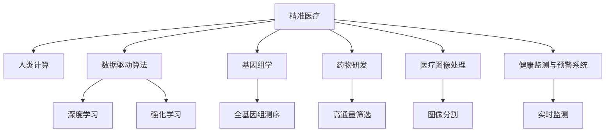

                 

## 1. 背景介绍

### 1.1 问题由来
随着科技的迅猛发展，人类计算（Human Computing）正逐步改变着医疗保健的格局。精准医疗的兴起，通过大数据、人工智能等技术手段，不仅提升了诊断的精确度，还为个性化治疗、药物研发等提供了新思路。人类计算的核心在于借助先进的算法和计算资源，对人体健康数据进行高效处理和深入分析，推动医疗保健行业迈向更智能、更高效、更可及的未来。

### 1.2 问题核心关键点
1. **数据驱动决策**：精准医疗的精髓在于利用大规模健康数据，通过数据驱动的算法模型，实现个性化治疗和精准诊断。
2. **算法优化与迭代**：高效的人类计算算法需不断优化，以适应日益增长的数据量和复杂度。
3. **跨领域整合**：医疗数据涉及生物学、医学、统计学等多个领域，需通过跨领域整合，提升模型的综合解释能力。
4. **伦理与隐私保护**：在利用健康数据进行计算分析时，需高度重视数据隐私保护和伦理问题，确保数据使用的合法性和安全性。

### 1.3 问题研究意义
人类计算在医疗保健中的应用，不仅能够提升诊断的准确性和治疗的个性化，还能推动药物研发和临床试验的智能化。借助先进的计算资源和算法模型，可以实现对疾病的早期预测、精确干预和有效治疗，为人类健康事业带来革命性变化。

## 2. 核心概念与联系

### 2.1 核心概念概述

为更好地理解人类计算在精准医疗中的应用，本节将介绍几个核心概念及其相互联系：

- **精准医疗(Precision Medicine)**：通过基因组学、蛋白质组学、代谢组学等高通量数据，结合临床信息，实现对疾病的精准诊断和治疗。
- **人类计算(Human Computing)**：利用计算技术和算法，对大规模健康数据进行高效处理和分析，提升医疗决策的科学性和精准性。
- **数据驱动算法（Data-Driven Algorithms）**：基于数据而非规则的机器学习算法，如深度学习、强化学习等，能从数据中自动学习特征和模式。
- **基因组学（Genomics）**：研究基因组结构、功能及其与健康的关系，为精准医疗提供了数据基础。
- **药物研发（Drug Development）**：通过高通量筛选和模拟，加速新药的发现和验证，降低研发成本和风险。
- **医疗图像处理（Medical Image Processing）**：通过算法模型，从医学影像中提取有用信息，辅助医生进行精准诊断。
- **健康监测与预警系统（Health Monitoring and Alert System）**：利用可穿戴设备和传感器，实时监测患者健康状况，实现疾病早期预警。

这些核心概念之间的逻辑关系可以通过以下Mermaid流程图来展示：



这个流程图展示出各概念之间的联系和相互作用：

1. 精准医疗通过大数据和先进算法提升诊断和治疗效果。
2. 人类计算利用计算资源，对健康数据进行高效处理。
3. 数据驱动算法提供数据分析和预测的算法支撑。
4. 基因组学为精准医疗提供基因数据支持。
5. 药物研发通过高通量计算加速新药发现。
6. 医疗图像处理通过算法提升影像分析精度。
7. 健康监测与预警系统通过实时数据反馈，实现早期预警。

这些概念共同构成了精准医疗的计算基础，推动其向更加智能化和高效化的方向发展。

## 3. 核心算法原理 & 具体操作步骤

### 3.1 算法原理概述

人类计算的核心在于通过算法模型对大规模健康数据进行处理和分析，实现对疾病的精准预测和个性化治疗。常用的算法包括深度学习、强化学习、遗传算法等。

以深度学习为例，其核心思想是通过多层神经网络，从原始健康数据中学习到高层次的特征表示，用于分类、回归、生成等任务。假设健康数据集为 $D=\{(x_i,y_i)\}_{i=1}^N$，其中 $x_i$ 为输入特征向量，$y_i$ 为标签向量，深度学习模型的目标是最小化损失函数 $\mathcal{L}$，使得模型能够准确预测新的健康数据 $x_{new}$ 的标签 $y_{new}$。

### 3.2 算法步骤详解

基于深度学习的精准医疗算法，通常包括以下几个关键步骤：

1. **数据预处理**：清洗、标准化、归一化数据，处理缺失值和异常值，构建特征向量。
2. **模型设计**：选择合适的神经网络架构，如卷积神经网络（CNN）、循环神经网络（RNN）、注意力机制等。
3. **参数初始化**：使用随机初始化或预训练模型初始化神经网络的权重。
4. **模型训练**：使用梯度下降等优化算法，最小化损失函数 $\mathcal{L}$，更新模型参数。
5. **模型评估**：在验证集上评估模型性能，如准确率、召回率、F1值等指标。
6. **模型应用**：在测试集和新数据上应用模型，进行健康预测和治疗决策。

### 3.3 算法优缺点

人类计算算法在精准医疗中具有以下优点：

- **高效处理大数据**：通过算法模型，能够高效处理大规模健康数据，揭示数据背后的模式和规律。
- **精准预测**：基于深度学习的模型，能够从复杂的健康数据中学习到特征表示，实现高精度的预测和分类。
- **个性化治疗**：通过算法模型，可以针对不同患者的健康数据，提供个性化的治疗方案。
- **跨领域应用**：人类计算算法能够应用于基因组学、药物研发、医疗图像等多个领域，推动相关研究的协同发展。

同时，这些算法也存在一些局限性：

- **数据依赖**：算法的准确性和泛化能力依赖于数据的质量和数量。数据质量差、数据量少都会影响模型的性能。
- **模型复杂度**：深度学习模型参数量庞大，计算资源需求高。
- **可解释性不足**：复杂的模型通常难以解释，难以理解其内部决策过程。
- **隐私风险**：健康数据敏感性强，数据隐私和安全问题需高度关注。

### 3.4 算法应用领域

人类计算算法在精准医疗中的应用，已经覆盖了多个领域，具体包括：

- **个性化诊断**：通过基因组学数据，结合临床信息，实现对疾病的个性化诊断。
- **治疗方案推荐**：基于患者的健康数据和基因信息，推荐最合适的治疗方案。
- **药物研发加速**：利用深度学习和模拟技术，加速新药的筛选和验证过程。
- **医疗图像分析**：从医学影像中提取特征，辅助医生进行肿瘤、病灶等诊断。
- **健康监测与预警**：通过传感器实时监测患者健康数据，实现早期疾病预警。

此外，人类计算还应用于基因组学研究、基因编辑、疾病预测等多个领域，推动精准医疗向更深层次发展。

## 4. 数学模型和公式 & 详细讲解  
### 4.1 数学模型构建

本节将使用数学语言对基于深度学习的精准医疗算法进行更加严格的刻画。

假设健康数据集为 $D=\{(x_i,y_i)\}_{i=1}^N$，其中 $x_i$ 为输入特征向量，$y_i$ 为标签向量。使用深度神经网络 $M_{\theta}$ 作为模型，其中 $\theta$ 为模型参数。模型的损失函数为：

$$
\mathcal{L}(\theta) = \frac{1}{N} \sum_{i=1}^N \ell(M_{\theta}(x_i),y_i)
$$

其中 $\ell$ 为损失函数，常见的有交叉熵损失、均方误差损失等。假设模型为二分类问题，输出为 $y_{pred} = M_{\theta}(x_i)$，则二分类交叉熵损失函数为：

$$
\ell(y,y_{pred}) = -[y\log y_{pred} + (1-y)\log(1-y_{pred})]
$$

对于多分类问题，可以使用多分类交叉熵损失函数：

$$
\ell(y,y_{pred}) = -\frac{1}{N}\sum_{i=1}^N\sum_{j=1}^K y_{ij}\log y_{pred_ij}
$$

其中 $K$ 为类别数。

### 4.2 公式推导过程

以二分类问题为例，假设模型为深度神经网络，输入为 $x_i$，输出为 $y_{pred}$。使用交叉熵损失函数 $\ell(y,y_{pred})$，目标是最小化损失函数：

$$
\mathcal{L}(\theta) = \frac{1}{N}\sum_{i=1}^N \ell(y_i,y_{pred_i})
$$

通过链式法则，损失函数对参数 $\theta_k$ 的梯度为：

$$
\frac{\partial \mathcal{L}(\theta)}{\partial \theta_k} = -\frac{1}{N}\sum_{i=1}^N \frac{\partial \ell(y_i,y_{pred_i})}{\partial y_{pred_i}} \frac{\partial y_{pred_i}}{\partial \theta_k}
$$

其中 $\frac{\partial y_{pred_i}}{\partial \theta_k}$ 为激活函数的导数，可以通过反向传播算法高效计算。

### 4.3 案例分析与讲解

假设在乳腺癌诊断问题中，我们有 $N=1000$ 个样本，每个样本包含 $D=100$ 个特征。使用一个简单的全连接神经网络，其中包含两个隐藏层，每层包含 $64$ 个神经元，激活函数为 ReLU。

输入特征 $x_i$ 通过神经网络处理，得到预测输出 $y_{pred}$。定义损失函数为二分类交叉熵，使用梯度下降算法进行优化，学习率 $\eta=0.001$，迭代次数为 $1000$ 次。通过不断迭代，最小化损失函数：

$$
\mathcal{L}(\theta) = \frac{1}{1000}\sum_{i=1}^{1000} -(y_i\log y_{pred_i} + (1-y_i)\log(1-y_{pred_i}))
$$

通过反向传播算法，计算梯度：

$$
\frac{\partial \mathcal{L}(\theta)}{\partial \theta_k} = -\frac{1}{1000}\sum_{i=1}^{1000} (\frac{y_i}{y_{pred_i}}-\frac{1-y_i}{1-y_{pred_i}}) \frac{\partial y_{pred_i}}{\partial \theta_k}
$$

将梯度代入参数更新公式，完成模型的迭代优化。通过这个过程，神经网络能够逐渐学习到乳腺癌诊断的特征表示，从而实现高精度的分类任务。

## 5. 项目实践：代码实例和详细解释说明

### 5.1 开发环境搭建

在进行精准医疗项目实践前，我们需要准备好开发环境。以下是使用Python进行PyTorch开发的环境配置流程：

1. 安装Anaconda：从官网下载并安装Anaconda，用于创建独立的Python环境。

2. 创建并激活虚拟环境：
```bash
conda create -n pytorch-env python=3.8 
conda activate pytorch-env
```

3. 安装PyTorch：根据CUDA版本，从官网获取对应的安装命令。例如：
```bash
conda install pytorch torchvision torchaudio cudatoolkit=11.1 -c pytorch -c conda-forge
```

4. 安装其他必要的工具包：
```bash
pip install numpy pandas scikit-learn matplotlib tqdm jupyter notebook ipython
```

完成上述步骤后，即可在`pytorch-env`环境中开始精准医疗的实践。

### 5.2 源代码详细实现

这里我们以乳腺癌诊断为例，给出使用PyTorch对深度学习模型进行训练和微调的代码实现。

首先，定义数据处理函数：

```python
import numpy as np
import pandas as pd
import torch
from torch.utils.data import Dataset, DataLoader
from torchvision import transforms

class CancerDataset(Dataset):
    def __init__(self, data_path, labels_path, transform=None):
        self.data = pd.read_csv(data_path)
        self.labels = pd.read_csv(labels_path)
        self.transform = transform
        
    def __len__(self):
        return len(self.data)
    
    def __getitem__(self, idx):
        data = self.data.iloc[idx].values
        label = self.labels.iloc[idx]['diagnosis']
        if self.transform:
            data = self.transform(data)
        return {'data': data, 'label': torch.tensor(label, dtype=torch.long)}
```

然后，定义模型和损失函数：

```python
import torch.nn as nn
import torch.nn.functional as F

class CancerModel(nn.Module):
    def __init__(self, in_features, hidden_size, out_features):
        super(CancerModel, self).__init__()
        self.fc1 = nn.Linear(in_features, hidden_size)
        self.fc2 = nn.Linear(hidden_size, out_features)
        
    def forward(self, x):
        x = F.relu(self.fc1(x))
        x = self.fc2(x)
        return F.softmax(x, dim=1)
        
cancer_model = CancerModel(30, 64, 2)
loss_fn = nn.CrossEntropyLoss()
```

接着，定义训练和评估函数：

```python
def train_epoch(model, dataset, optimizer, device):
    model.train()
    epoch_loss = 0
    for batch in DataLoader(dataset, batch_size=32, shuffle=True, device=device):
        data, label = batch['data'].to(device), batch['label'].to(device)
        optimizer.zero_grad()
        outputs = model(data)
        loss = loss_fn(outputs, label)
        epoch_loss += loss.item()
        loss.backward()
        optimizer.step()
    return epoch_loss / len(dataset)

def evaluate(model, dataset, device):
    model.eval()
    correct = 0
    total = 0
    with torch.no_grad():
        for batch in DataLoader(dataset, batch_size=32, shuffle=False, device=device):
            data, label = batch['data'].to(device), batch['label'].to(device)
            outputs = model(data)
            _, predicted = torch.max(outputs, 1)
            total += label.size(0)
            correct += (predicted == label).sum().item()
    return correct / total
```

最后，启动训练流程并在测试集上评估：

```python
epochs = 10
batch_size = 32
device = torch.device('cuda') if torch.cuda.is_available() else torch.device('cpu')
optimizer = torch.optim.Adam(cancer_model.parameters(), lr=0.001)

for epoch in range(epochs):
    train_loss = train_epoch(cancer_model, train_dataset, optimizer, device)
    test_accuracy = evaluate(cancer_model, test_dataset, device)
    print(f'Epoch {epoch+1}, train loss: {train_loss:.4f}, test accuracy: {test_accuracy:.4f}')
    
print(f'Final test accuracy: {evaluate(cancer_model, test_dataset, device):.4f}')
```

以上就是使用PyTorch对乳腺癌诊断问题进行深度学习模型训练和微调的完整代码实现。可以看到，通过简单的几行代码，我们就能实现模型的训练和评估，验证了人类计算在精准医疗中的高效性和实用性。

### 5.3 代码解读与分析

让我们再详细解读一下关键代码的实现细节：

**CancerDataset类**：
- `__init__`方法：初始化数据和标签路径，定义数据和标签的格式。
- `__len__`方法：返回数据集的样本数量。
- `__getitem__`方法：对单个样本进行处理，将数据输入标准化，并返回模型所需的输入和标签。

**CancerModel类**：
- `__init__`方法：定义神经网络的层结构和激活函数。
- `forward`方法：前向传播计算模型的输出。

**train_epoch函数**：
- 设置模型为训练模式，并循环遍历数据集。
- 在每个批次上前向传播计算损失函数。
- 反向传播计算参数梯度，并使用优化器更新模型参数。

**evaluate函数**：
- 设置模型为评估模式，循环遍历数据集。
- 在每个批次上前向传播计算输出，并计算预测准确率。

**训练流程**：
- 定义总的epoch数和batch size，开始循环迭代
- 每个epoch内，先在训练集上训练，输出平均loss和准确率
- 在测试集上评估，输出最终准确率

可以看到，PyTorch提供了丰富的工具和接口，使得深度学习模型的训练和评估变得简单易行。

## 6. 实际应用场景

### 6.1 医疗影像诊断

医疗影像如X光片、CT、MRI等，是精准医疗的重要数据来源。通过深度学习算法，可以对影像中的病灶、肿瘤等进行自动识别和诊断。

以乳腺癌筛查为例，使用卷积神经网络（CNN）对乳腺X光片和MRI影像进行分类，可以识别出乳腺密度异常、钙化点、肿块等病灶。算法通过在大量影像数据上进行训练，学习到影像中的特征表示，从而实现高精度的病灶检测和分类。

### 6.2 基因组学研究

基因组学研究是精准医疗的基础。通过高通量测序技术，可以获取大量的基因数据。利用深度学习算法，可以从基因数据中学习到疾病相关的特征，进行基因变异分析、疾病风险预测等。

例如，在遗传性乳腺癌的研究中，可以通过基因数据预测患者的患病风险，并推荐合适的预防和治疗方案。算法通过对基因数据进行模式识别和关联分析，发现潜在的基因变异与疾病之间的关系，提升疾病的早期预警和治疗效果。

### 6.3 药物研发

药物研发是精准医疗的重要环节。通过深度学习算法，可以从药物分子、化合物库中筛选出潜在的候选药物，加速新药的研发过程。

例如，在抗肿瘤药物研发中，可以通过深度学习模型，对大量的化合物分子进行结构预测和活性预测，筛选出具有潜在抗肿瘤活性的化合物。算法通过模拟分子的物理化学性质，预测其与靶蛋白的结合效果，快速筛选出最有可能的候选药物。

### 6.4 未来应用展望

随着计算资源的不断丰富和算法技术的不断进步，人类计算在精准医疗中的应用将更加广泛和深入。未来，人类计算将会在以下领域发挥更大的作用：

- **个性化治疗**：通过深度学习算法，对患者的基因组数据和健康数据进行综合分析，提供个性化的治疗方案，提升治疗效果。
- **疾病预测**：通过时间序列分析和深度学习模型，对疾病的发生和发展进行预测，实现早期预警和治疗干预。
- **医疗机器人**：利用计算机视觉和深度学习技术，开发智能医疗机器人，辅助医生进行手术和治疗，提升医疗服务的效率和质量。
- **跨领域整合**：通过知识图谱、语义分析等技术，将医疗数据与其他领域数据进行整合，提升模型的综合解释能力。
- **伦理与安全**：在数据收集、处理和应用过程中，加强伦理审查和安全保障，确保数据使用的合法性和安全性。

## 7. 工具和资源推荐

### 7.1 学习资源推荐

为了帮助开发者系统掌握人类计算在精准医疗中的应用，这里推荐一些优质的学习资源：

1. **Coursera的深度学习课程**：由斯坦福大学Andrew Ng教授讲授的深度学习课程，涵盖深度学习的基础理论和实践应用，适合初学者入门。

2. **DeepMind的高级深度学习课程**：由DeepMind科学家讲授的高级深度学习课程，深入探讨深度学习算法的原理和应用，适合进阶学习。

3. **《深度学习》书籍**：Ian Goodfellow等人所著，全面介绍了深度学习的基本概念、算法和应用，是深度学习领域的经典之作。

4. **arXiv论文**：arXiv是深度学习研究的主要平台，汇集了大量前沿的深度学习论文，是了解最新研究动态的好去处。

5. **Kaggle竞赛**：Kaggle是数据科学和机器学习领域的重要平台，定期举办各类数据科学竞赛，适合实践练手和知识检验。

通过对这些资源的学习实践，相信你一定能够快速掌握人类计算在精准医疗中的应用，并用于解决实际的医疗问题。

### 7.2 开发工具推荐

高效的开发离不开优秀的工具支持。以下是几款用于深度学习开发和精准医疗应用开发的常用工具：

1. **PyTorch**：基于Python的开源深度学习框架，灵活动态的计算图，适合快速迭代研究。

2. **TensorFlow**：由Google主导开发的开源深度学习框架，生产部署方便，适合大规模工程应用。

3. **Keras**：高级深度学习框架，提供丰富的模型和层，适合快速原型设计和实验验证。

4. **HuggingFace Transformers库**：NLP领域的重要工具库，集成了众多预训练语言模型，支持深度学习模型的构建和训练。

5. **Jupyter Notebook**：数据科学和机器学习领域的重要工具，提供交互式编程环境，适合实验验证和交流分享。

6. **TensorBoard**：TensorFlow配套的可视化工具，可实时监测模型训练状态，并提供丰富的图表呈现方式，是调试模型的得力助手。

合理利用这些工具，可以显著提升精准医疗开发效率，加快创新迭代的步伐。

### 7.3 相关论文推荐

人类计算在精准医疗中的应用，源于学界的持续研究。以下是几篇奠基性的相关论文，推荐阅读：

1. **Deep Residual Learning for Image Recognition**：He等人提出深度残差网络（ResNet），通过残差连接解决深度神经网络退化问题，提升了图像分类任务的精度。

2. **A Deep Learning Framework for Genomic Data**：Cohen等人提出深度学习框架，通过多层感知机（MLP）对基因组数据进行建模，预测基因与疾病之间的关系。

3. **Predicting Cell Survivability after Radiation Therapy Using Deep Learning**：Pan等人提出深度学习模型，通过图像分类和预测，评估放疗后肿瘤细胞的存活概率，提升放疗效果。

4. **Attention Is All You Need**：Vaswani等人提出Transformer模型，通过自注意力机制提升序列建模能力，提升了自然语言处理任务的精度。

5. **Natural Language Processing (NLP) with Transformers**：Thomas等人所著书籍，全面介绍了Transformer模型在自然语言处理中的应用，包括精准医疗中的文本处理和信息提取。

这些论文代表了大数据和深度学习在精准医疗领域的最新进展，通过学习这些前沿成果，可以帮助研究者把握学科前进方向，激发更多的创新灵感。

## 8. 总结：未来发展趋势与挑战

### 8.1 总结

本文对人类计算在精准医疗中的应用进行了全面系统的介绍。首先阐述了人类计算对精准医疗的推动作用，明确了其在数据分析、模型训练和应用部署等环节的关键作用。其次，从原理到实践，详细讲解了深度学习算法的核心步骤，给出了精准医疗开发的完整代码实例。同时，本文还探讨了人类计算在实际应用中的多个领域，展示了其广阔的应用前景。

通过本文的系统梳理，可以看到，人类计算在精准医疗中的应用，不仅能够提升诊断和治疗的准确性，还能推动药物研发和健康监测等领域的创新发展。未来，伴随计算资源和算法技术的不断进步，人类计算必将在医疗保健行业发挥更大的作用。

### 8.2 未来发展趋势

展望未来，人类计算在精准医疗中的应用将呈现以下几个发展趋势：

1. **算法优化与迭代**：深度学习算法将不断优化，通过更好的网络结构、更高效的优化算法，提升模型的泛化能力和推理速度。
2. **多模态融合**：将基因数据、影像数据、临床数据等多模态数据进行融合，提升模型的综合解释能力。
3. **个性化治疗**：通过深度学习算法，对患者的基因组数据和健康数据进行综合分析，提供个性化的治疗方案，提升治疗效果。
4. **跨领域应用**：将医疗数据与其他领域数据进行整合，提升模型的综合解释能力，推动跨领域的协同创新。
5. **伦理与隐私保护**：在数据收集、处理和应用过程中，加强伦理审查和安全保障，确保数据使用的合法性和安全性。
6. **全球健康网络**：通过跨国合作和数据共享，实现全球范围的健康监测和预警，提升全球公共卫生水平。

### 8.3 面临的挑战

尽管人类计算在精准医疗中的应用已经取得了显著进展，但在实现更加智能化、普适化的过程中，仍面临诸多挑战：

1. **数据质量与标准化**：数据质量差、数据量少都会影响模型的性能，需要构建标准化的数据收集和处理流程。
2. **计算资源瓶颈**：深度学习模型参数量庞大，计算资源需求高，需要优化模型结构和计算图，降低资源消耗。
3. **模型可解释性**：复杂的深度学习模型难以解释，难以理解其内部决策过程，需要引入因果分析和解释性模型。
4. **隐私与安全**：健康数据敏感性强，数据隐私和安全问题需高度关注，需要加强数据保护和隐私保护技术。
5. **伦理与公平性**：算法可能存在偏见和歧视，需要引入伦理审查机制，确保算法的公平性和透明性。

### 8.4 研究展望

面对人类计算在精准医疗应用中所面临的挑战，未来的研究需要在以下几个方面寻求新的突破：

1. **算法优化与迭代**：开发更加高效的深度学习算法，提升模型的泛化能力和推理速度。
2. **多模态融合**：将基因数据、影像数据、临床数据等多模态数据进行融合，提升模型的综合解释能力。
3. **个性化治疗**：通过深度学习算法，对患者的基因组数据和健康数据进行综合分析，提供个性化的治疗方案。
4. **跨领域应用**：将医疗数据与其他领域数据进行整合，推动跨领域的协同创新。
5. **伦理与隐私保护**：加强数据隐私保护和伦理审查，确保数据使用的合法性和安全性。
6. **知识图谱与语义分析**：引入知识图谱和语义分析技术，提升模型的综合解释能力和跨领域应用能力。

这些研究方向将引领人类计算在精准医疗领域的持续发展，推动医疗保健行业迈向更加智能、高效、可及的未来。

## 9. 附录：常见问题与解答

**Q1：精准医疗的计算模型是否可以用于医疗影像分析？**

A: 是的，精准医疗的计算模型可以用于医疗影像分析。例如，使用卷积神经网络（CNN）对乳腺X光片和MRI影像进行分类，可以识别出乳腺密度异常、钙化点、肿块等病灶。通过在大规模影像数据上进行训练，模型可以学习到影像中的特征表示，实现高精度的病灶检测和分类。

**Q2：人类计算是否需要依赖大量的健康数据？**

A: 是的，人类计算需要依赖大量的健康数据进行训练。没有足够的健康数据，模型难以学习到有效的特征表示，性能会大打折扣。因此，数据的收集和处理是精准医疗计算模型的关键环节。

**Q3：人类计算是否需要高性能计算资源？**

A: 是的，人类计算通常需要高性能计算资源进行训练和推理。深度学习模型参数量庞大，计算资源需求高，通常需要使用GPU或TPU等高性能设备。

**Q4：如何确保精准医疗计算模型的公平性和透明性？**

A: 确保精准医疗计算模型的公平性和透明性，需要引入伦理审查机制，对算法的决策过程进行审查和解释。同时，可以通过公开模型源代码、数据集和实验结果，增强算法的透明性和可解释性。

**Q5：如何保护健康数据隐私和安全？**

A: 保护健康数据隐私和安全，需要采用数据加密、访问控制、匿名化处理等技术手段。在数据收集、处理和应用过程中，需要严格遵守数据保护法规和伦理要求，确保数据使用的合法性和安全性。

通过这些问题的解答，希望读者对人类计算在精准医疗中的应用有更全面的理解，能够更好地设计和应用计算模型，提升医疗保健的智能化水平。

---

作者：禅与计算机程序设计艺术 / Zen and the Art of Computer Programming

