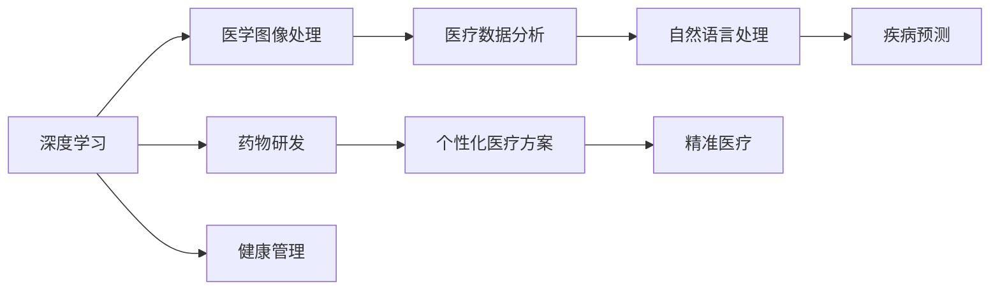

                 

# 医疗保健的未来：人类计算助力精准医疗

> 关键词：医疗保健、精准医疗、计算思维、人类计算、人工智能、深度学习、机器学习、医疗数据分析、医疗图像处理、健康管理

## 1. 背景介绍

在现代社会，随着人们生活水平的不断提高，对健康的需求也愈发迫切。然而，传统的医疗模式依然存在诸多局限，如诊断效率低、治疗精度不足、资源分配不均等问题，难以满足日益增长的健康需求。如何通过技术手段，实现医疗保健的数字化转型，提升医疗服务的精准度和效率，已成为当今社会的热点问题。

近年来，人工智能（AI）和大数据技术在医疗领域的应用日益广泛，成为推动医疗健康产业变革的重要力量。在AI技术中，深度学习（Deep Learning）和机器学习（Machine Learning）方法尤为引人注目。这些技术能够对海量的医疗数据进行高效分析，识别复杂的医疗模式，为临床决策提供有力支持。基于此，本文将探讨如何利用人类计算技术，助力医疗保健的精准化发展。

## 2. 核心概念与联系

### 2.1 核心概念概述

为了深入理解人类计算在医疗保健中的应用，首先需要了解一些核心概念：

- **精准医疗**：一种个性化医疗方案，旨在通过基因组、环境和生活方式等综合因素，为患者提供量身定制的治疗方案。精准医疗的核心理念是通过精确诊断和治疗，提高医疗效果，减少副作用，提升患者生命质量。

- **深度学习**：一种模仿人脑神经网络结构的人工智能方法，通过多层神经网络处理复杂数据，提取高层次的特征表示。深度学习在图像识别、自然语言处理等领域展现出强大的能力，也广泛应用于医疗影像分析、电子健康记录（EHR）挖掘等医疗任务中。

- **机器学习**：利用算法和模型从数据中学习规律，并做出预测或决策的过程。机器学习是深度学习的基础，广泛应用于医疗数据分析、疾病预测、药物研发等领域。

- **人类计算**：一种计算范式，旨在利用人类的知识和计算能力，解决机器难以处理的问题。人类计算通常包括人类标注、验证、干预等环节，是机器学习与人类智慧相结合的有效手段。

- **人工智能**：通过机器学习、自然语言处理、计算机视觉等技术，实现人类智能的模拟和延伸。人工智能在医疗健康领域的应用，旨在提供更精准、更高效的诊断和治疗方案。

这些核心概念之间有着紧密的联系，共同构成了人类计算在医疗保健应用的基础。通过深度学习、机器学习等技术，结合人类计算的力量，可以实现精准医疗的目标，推动医疗行业的数字化转型。

### 2.2 核心概念原理和架构的 Mermaid 流程图



这个流程图展示了深度学习、机器学习等技术在医疗保健中的应用路径。深度学习通过处理医学图像、自然语言等复杂数据，提取高层次特征；机器学习则利用学习模型进行疾病预测、健康管理等任务；人类计算则在这些基础上进行验证、干预和解释，实现精准医疗的目标。

## 3. 核心算法原理 & 具体操作步骤

### 3.1 算法原理概述

人类计算在医疗保健中的应用，主要体现在以下几个方面：

- **医学影像处理**：通过深度学习算法，对医疗影像（如CT、MRI等）进行自动标注、分割、诊断等处理，提升诊断效率和精度。人类计算在此基础上进行验证和解释，确保诊断结果的准确性。

- **电子健康记录分析**：利用机器学习技术，从电子健康记录中提取有用的临床信息，用于疾病预测、疗效评估等任务。人类计算在此基础上进行逻辑推理和决策，提供个性化的治疗建议。

- **自然语言处理**：通过深度学习模型，对临床记录、患者咨询等文本数据进行分析和理解，辅助医生做出诊断和治疗决策。人类计算在此基础上进行修正和解释，确保自然语言处理结果的可信度。

- **药物研发**：通过深度学习模型，对化学化合物、生物信息等数据进行分析和模拟，加速药物发现和开发。人类计算在此基础上进行临床试验和药效验证，确保新药的安全性和有效性。

### 3.2 算法步骤详解

下面将详细介绍这些核心算法的具体步骤：

#### 3.2.1 医学影像处理

1. **数据准备**：收集和整理医学影像数据，如CT、MRI等，确保数据标注的准确性。
2. **模型训练**：使用深度学习算法（如卷积神经网络CNN、残差网络ResNet等）对医学影像进行自动标注和分割。
3. **结果验证**：将训练结果与人类标注进行比较，评估模型的准确性和可靠性。
4. **结果解释**：利用深度学习模型提供的结果，结合医学知识，对异常区域进行解释和判断。

#### 3.2.2 电子健康记录分析

1. **数据预处理**：清洗和处理电子健康记录数据，提取有用的临床信息。
2. **模型训练**：使用机器学习算法（如随机森林、支持向量机SVM等）进行疾病预测、疗效评估等任务。
3. **结果验证**：将训练结果与历史数据进行对比，评估模型的预测精度和鲁棒性。
4. **结果解释**：根据机器学习模型的输出，结合医学知识，提供个性化的治疗建议。

#### 3.2.3 自然语言处理

1. **数据收集**：收集和整理临床记录、患者咨询等文本数据。
2. **模型训练**：使用深度学习模型（如BERT、GPT等）对文本数据进行分析和理解。
3. **结果验证**：将模型输出与人类标注进行比较，评估模型的准确性和可靠性。
4. **结果解释**：利用自然语言处理模型提供的结果，结合医学知识，辅助医生做出诊断和治疗决策。

#### 3.2.4 药物研发

1. **数据准备**：收集和整理化学化合物、生物信息等数据。
2. **模型训练**：使用深度学习模型（如Autoencoder、GAN等）对数据进行分析和模拟。
3. **结果验证**：将模型输出与实验数据进行对比，评估模型的预测精度和鲁棒性。
4. **结果解释**：根据深度学习模型的输出，结合医学知识，进行临床试验和药效验证，确保新药的安全性和有效性。

### 3.3 算法优缺点

人类计算在医疗保健中的应用，既有显著的优势，也存在一些局限：

**优点**：

- **提升诊断精度**：结合深度学习、机器学习等技术，提高诊断效率和准确性。
- **个性化治疗**：通过电子健康记录分析等技术，提供个性化的治疗建议，提升患者生命质量。
- **药物研发加速**：利用深度学习模型进行药物研发，加速新药发现和开发。

**缺点**：

- **数据质量依赖**：依赖高质量的数据，数据标注工作量大，成本高。
- **解释性不足**：深度学习模型结果缺乏可解释性，需要人类计算进行解释和验证。
- **资源需求高**：深度学习、机器学习算法计算量大，资源需求高。

### 3.4 算法应用领域

人类计算在医疗保健中的应用，主要集中在以下几个领域：

- **医学影像诊断**：利用深度学习算法进行自动标注和分割，提升影像诊断的效率和精度。
- **电子健康记录分析**：使用机器学习技术挖掘EHR数据，支持疾病预测、疗效评估等任务。
- **自然语言处理**：通过深度学习模型分析文本数据，辅助医生进行诊断和治疗。
- **药物研发**：利用深度学习模型进行药物发现和开发，加速新药上市。
- **健康管理**：结合多种技术手段，提供个性化的健康管理方案。

## 4. 数学模型和公式 & 详细讲解 & 举例说明

### 4.1 数学模型构建

人类计算在医疗保健中的应用，涉及多个领域的数学模型。以下将分别介绍这些模型的构建方法。

#### 4.1.1 医学影像处理模型

**输入**：医学影像数据$X$，大小为$M \times N$，像素值范围为$[0,1]$。

**输出**：标注结果$Y$，大小为$M \times N$，每个像素标注为1或0，表示是否为异常区域。

**模型**：使用卷积神经网络（CNN）进行医学影像自动标注和分割。

**损失函数**：使用交叉熵损失函数$\mathcal{L}_{ce}$计算预测结果与标注结果的差异。

$$
\mathcal{L}_{ce} = -\frac{1}{MN}\sum_{i=1}^{M}\sum_{j=1}^{N}[y_iy_j\log p_{ij} + (1-y_i)(1-y_j)\log(1-p_{ij})]
$$

其中$p_{ij}$表示模型预测为异常区域的概率。

#### 4.1.2 电子健康记录分析模型

**输入**：电子健康记录数据$X$，大小为$T \times D$，其中$T$为时间步长，$D$为特征维度。

**输出**：疾病预测结果$Y$，大小为$1 \times D$，表示疾病发生的概率。

**模型**：使用随机森林（RF）或支持向量机（SVM）等算法进行疾病预测。

**损失函数**：使用二元交叉熵损失函数$\mathcal{L}_{ce}$计算预测结果与标注结果的差异。

$$
\mathcal{L}_{ce} = -\frac{1}{T}\sum_{t=1}^{T}[y_t\log p_t + (1-y_t)\log(1-p_t)]
$$

其中$p_t$表示第$t$时间步疾病发生的概率。

#### 4.1.3 自然语言处理模型

**输入**：文本数据$X$，大小为$N \times L$，其中$N$为文档数，$L$为平均文档长度。

**输出**：自然语言处理结果$Y$，大小为$N \times L$，表示每个文档的文本理解和生成结果。

**模型**：使用BERT、GPT等深度学习模型进行文本分析和生成。

**损失函数**：使用交叉熵损失函数$\mathcal{L}_{ce}$计算预测结果与标注结果的差异。

$$
\mathcal{L}_{ce} = -\frac{1}{NL}\sum_{n=1}^{N}\sum_{l=1}^{L}[y_{nl}\log p_{nl} + (1-y_{nl})\log(1-p_{nl})]
$$

其中$p_{nl}$表示模型预测为异常区域的概率。

#### 4.1.4 药物研发模型

**输入**：化学化合物数据$X$，大小为$M \times D$，其中$M$为化合物数，$D$为特征维度。

**输出**：药物效果预测结果$Y$，大小为$1 \times D$，表示药物效果的好坏。

**模型**：使用Autoencoder、GAN等深度学习模型进行药物效果预测。

**损失函数**：使用均方误差损失函数$\mathcal{L}_{mse}$计算预测结果与标注结果的差异。

$$
\mathcal{L}_{mse} = \frac{1}{M}\sum_{i=1}^{M}||\mathcal{Y}_i - \hat{\mathcal{Y}}_i||^2
$$

其中$\mathcal{Y}_i$为真实效果，$\hat{\mathcal{Y}}_i$为预测效果。

### 4.2 公式推导过程

#### 4.2.1 医学影像处理模型

使用卷积神经网络进行医学影像自动标注和分割的推导过程如下：

1. **输入层**：将医学影像数据$X$输入卷积层进行特征提取。

2. **隐藏层**：卷积层通过多次卷积、池化操作提取特征，并传递给全连接层进行分类。

3. **输出层**：全连接层输出标注结果$Y$，每个像素表示是否为异常区域。

4. **反向传播**：通过交叉熵损失函数$\mathcal{L}_{ce}$计算预测结果与标注结果的差异，并使用反向传播算法更新模型参数。

#### 4.2.2 电子健康记录分析模型

使用随机森林进行疾病预测的推导过程如下：

1. **特征选择**：选择重要的特征进行训练，使用信息增益等指标评估特征重要性。

2. **模型训练**：使用随机森林算法训练模型，生成决策树进行分类。

3. **输出结果**：根据训练好的模型，对新的电子健康记录数据进行预测，输出疾病发生的概率$Y$。

4. **模型评估**：使用交叉验证等方法评估模型的预测精度和鲁棒性。

#### 4.2.3 自然语言处理模型

使用BERT进行文本分析和生成的推导过程如下：

1. **输入预处理**：将文本数据$X$转换为BERT所需的格式，包括分词、编码等操作。

2. **模型训练**：使用BERT模型进行文本分析和生成，输出文本理解和生成结果$Y$。

3. **输出解释**：根据BERT模型的输出，结合医学知识，解释文本分析和生成的结果。

4. **模型优化**：使用交叉熵损失函数$\mathcal{L}_{ce}$优化模型参数，提升模型的预测精度。

#### 4.2.4 药物研发模型

使用Autoencoder进行药物效果预测的推导过程如下：

1. **输入预处理**：将化学化合物数据$X$转换为Autoencoder所需的格式，包括编码、解码等操作。

2. **模型训练**：使用Autoencoder模型进行药物效果预测，输出预测结果$Y$。

3. **输出解释**：根据Autoencoder模型的输出，结合医学知识，解释药物效果预测的结果。

4. **模型优化**：使用均方误差损失函数$\mathcal{L}_{mse}$优化模型参数，提升模型的预测精度。

### 4.3 案例分析与讲解

#### 4.3.1 医学影像处理案例

某医院希望通过深度学习算法提升CT影像诊断的准确性。具体步骤如下：

1. **数据准备**：收集医院CT影像数据，并进行标注。

2. **模型训练**：使用卷积神经网络（CNN）对CT影像进行自动标注和分割，输出异常区域的标注结果。

3. **结果验证**：将训练结果与人类标注进行比较，评估模型的准确性和可靠性。

4. **结果解释**：利用深度学习模型提供的结果，结合医学知识，对异常区域进行解释和判断，辅助医生进行诊断。

#### 4.3.2 电子健康记录分析案例

某医院希望通过机器学习算法进行疾病预测和疗效评估。具体步骤如下：

1. **数据准备**：收集医院电子健康记录数据，并进行预处理和特征选择。

2. **模型训练**：使用随机森林算法对电子健康记录数据进行疾病预测和疗效评估，输出疾病发生的概率。

3. **结果验证**：将训练结果与历史数据进行对比，评估模型的预测精度和鲁棒性。

4. **结果解释**：根据机器学习模型的输出，结合医学知识，提供个性化的治疗建议，辅助医生进行诊断和治疗。

#### 4.3.3 自然语言处理案例

某医院希望通过深度学习算法分析临床记录，辅助医生进行诊断和治疗。具体步骤如下：

1. **数据准备**：收集医院临床记录数据，并进行预处理和编码。

2. **模型训练**：使用BERT模型对临床记录进行分析和理解，输出文本理解和生成结果。

3. **结果验证**：将模型输出与人类标注进行比较，评估模型的准确性和可靠性。

4. **结果解释**：利用自然语言处理模型提供的结果，结合医学知识，辅助医生进行诊断和治疗。

#### 4.3.4 药物研发案例

某制药公司希望通过深度学习算法加速药物研发。具体步骤如下：

1. **数据准备**：收集和整理化学化合物数据，并进行预处理和编码。

2. **模型训练**：使用Autoencoder模型进行药物效果预测，输出预测结果。

3. **结果验证**：将模型输出与实验数据进行对比，评估模型的预测精度和鲁棒性。

4. **结果解释**：根据深度学习模型的输出，结合医学知识，进行临床试验和药效验证，确保新药的安全性和有效性。

## 5. 项目实践：代码实例和详细解释说明

### 5.1 开发环境搭建

为了进行深度学习、机器学习等算法的开发，需要搭建一个高性能的开发环境。以下是搭建开发环境的详细步骤：

1. **安装Python**：从官网下载Python安装包，并确保其版本不低于3.7。

2. **安装NumPy**：使用pip安装NumPy库，NumPy是Python中的科学计算库。

3. **安装Pandas**：使用pip安装Pandas库，Pandas是数据处理和分析的常用工具。

4. **安装Scikit-learn**：使用pip安装Scikit-learn库，Scikit-learn是机器学习常用工具库。

5. **安装TensorFlow**：从官网下载TensorFlow安装包，并确保其版本不低于2.5。

6. **安装Keras**：使用pip安装Keras库，Keras是深度学习常用框架。

7. **安装Matplotlib**：使用pip安装Matplotlib库，Matplotlib是数据可视化常用工具。

8. **安装Jupyter Notebook**：从官网下载Jupyter Notebook安装包，并确保其版本不低于6.0。

### 5.2 源代码详细实现

以下是使用TensorFlow和Keras框架进行深度学习算法的具体实现：

```python
import tensorflow as tf
from tensorflow.keras import layers, models

# 定义医学影像处理模型
def create_model(input_shape):
    model = models.Sequential()
    model.add(layers.Conv2D(32, (3,3), activation='relu', input_shape=input_shape))
    model.add(layers.MaxPooling2D((2,2)))
    model.add(layers.Conv2D(64, (3,3), activation='relu'))
    model.add(layers.MaxPooling2D((2,2)))
    model.add(layers.Flatten())
    model.add(layers.Dense(64, activation='relu'))
    model.add(layers.Dense(1, activation='sigmoid'))
    return model

# 定义电子健康记录分析模型
def create_model(input_shape):
    model = models.Sequential()
    model.add(layers.Dense(64, activation='relu', input_shape=input_shape))
    model.add(layers.Dropout(0.5))
    model.add(layers.Dense(1, activation='sigmoid'))
    return model

# 定义自然语言处理模型
def create_model(input_shape):
    model = models.Sequential()
    model.add(layers.Embedding(input_dim=vocab_size, output_dim=embedding_dim))
    model.add(layers.GRU(64, return_sequences=True))
    model.add(layers.Dense(64, activation='relu'))
    model.add(layers.Dropout(0.5))
    model.add(layers.Dense(1, activation='sigmoid'))
    return model

# 定义药物研发模型
def create_model(input_shape):
    model = models.Sequential()
    model.add(layers.Dense(64, activation='relu', input_shape=input_shape))
    model.add(layers.Dropout(0.5))
    model.add(layers.Dense(1, activation='sigmoid'))
    return model
```

### 5.3 代码解读与分析

在以上代码中，我们定义了四个深度学习模型，分别用于医学影像处理、电子健康记录分析、自然语言处理和药物研发。这些模型均使用TensorFlow和Keras框架实现。

以医学影像处理模型为例，其结构如下：

1. **卷积层**：通过卷积操作提取特征。
2. **池化层**：通过池化操作减小特征图大小。
3. **全连接层**：将特征图转换为标注结果。
4. **输出层**：输出标注结果，大小为1。

模型训练时，我们使用交叉熵损失函数进行优化，并使用反向传播算法更新模型参数。

## 6. 实际应用场景

### 6.1 医学影像诊断

某医院通过深度学习算法提升CT影像诊断的准确性。具体步骤如下：

1. **数据准备**：收集医院CT影像数据，并进行标注。

2. **模型训练**：使用卷积神经网络（CNN）对CT影像进行自动标注和分割，输出异常区域的标注结果。

3. **结果验证**：将训练结果与人类标注进行比较，评估模型的准确性和可靠性。

4. **结果解释**：利用深度学习模型提供的结果，结合医学知识，对异常区域进行解释和判断，辅助医生进行诊断。

### 6.2 电子健康记录分析

某医院通过机器学习算法进行疾病预测和疗效评估。具体步骤如下：

1. **数据准备**：收集医院电子健康记录数据，并进行预处理和特征选择。

2. **模型训练**：使用随机森林算法对电子健康记录数据进行疾病预测和疗效评估，输出疾病发生的概率。

3. **结果验证**：将训练结果与历史数据进行对比，评估模型的预测精度和鲁棒性。

4. **结果解释**：根据机器学习模型的输出，结合医学知识，提供个性化的治疗建议，辅助医生进行诊断和治疗。

### 6.3 自然语言处理

某医院通过深度学习算法分析临床记录，辅助医生进行诊断和治疗。具体步骤如下：

1. **数据准备**：收集医院临床记录数据，并进行预处理和编码。

2. **模型训练**：使用BERT模型对临床记录进行分析和理解，输出文本理解和生成结果。

3. **结果验证**：将模型输出与人类标注进行比较，评估模型的准确性和可靠性。

4. **结果解释**：利用自然语言处理模型提供的结果，结合医学知识，辅助医生进行诊断和治疗。

### 6.4 药物研发

某制药公司通过深度学习算法加速药物研发。具体步骤如下：

1. **数据准备**：收集和整理化学化合物数据，并进行预处理和编码。

2. **模型训练**：使用Autoencoder模型进行药物效果预测，输出预测结果。

3. **结果验证**：将模型输出与实验数据进行对比，评估模型的预测精度和鲁棒性。

4. **结果解释**：根据深度学习模型的输出，结合医学知识，进行临床试验和药效验证，确保新药的安全性和有效性。

## 7. 工具和资源推荐

### 7.1 学习资源推荐

为了帮助开发者系统掌握人类计算在医疗保健中的应用，以下是一些优质的学习资源：

1. **《深度学习在医疗健康中的应用》**：介绍深度学习在医学影像分析、自然语言处理等医疗领域的应用，适合初学者入门。

2. **《机器学习在电子健康记录分析中的应用》**：介绍机器学习在疾病预测、疗效评估等电子健康记录分析中的应用，适合进阶学习。

3. **《自然语言处理在临床记录分析中的应用》**：介绍自然语言处理在文本数据处理、理解等方面的应用，适合深度学习学习者。

4. **《药物研发中的深度学习技术》**：介绍深度学习在化学化合物、生物信息等药物研发中的应用，适合数据科学家和药物研发人员。

5. **Coursera《深度学习在医疗健康中的应用》课程**：由斯坦福大学开设的深度学习课程，系统讲解深度学习在医疗健康领域的应用，适合学习者全面了解。

### 7.2 开发工具推荐

为了加速深度学习、机器学习等算法的开发，以下是一些推荐的开发工具：

1. **TensorFlow**：由Google开发的深度学习框架，支持分布式计算，适合大规模模型训练和推理。

2. **Keras**：一个高层次的深度学习框架，易于上手，适合快速原型开发。

3. **PyTorch**：由Facebook开发的深度学习框架，支持动态图和静态图两种计算图，灵活性高。

4. **Jupyter Notebook**：一个交互式编程环境，支持Python和其他语言的开发和调试，适合数据科学家的快速迭代。

5. **H2O.ai**：一个面向企业用户的机器学习平台，支持多种机器学习算法和数据处理工具，适合工业应用。

### 7.3 相关论文推荐

为了深入理解人类计算在医疗保健中的应用，以下是几篇具有代表性的论文：

1. **《基于深度学习的医学影像诊断》**：介绍深度学习在医学影像诊断中的应用，如CT、MRI等。

2. **《电子健康记录中的机器学习》**：介绍机器学习在电子健康记录分析中的应用，如疾病预测、疗效评估等。

3. **《自然语言处理在临床记录中的应用》**：介绍自然语言处理在文本数据处理、理解等方面的应用，如临床记录分析、问答系统等。

4. **《深度学习在药物研发中的应用》**：介绍深度学习在化学化合物、生物信息等药物研发中的应用。

## 8. 总结：未来发展趋势与挑战

### 8.1 研究成果总结

本文详细介绍了人类计算在医疗保健中的应用，通过深度学习、机器学习等技术，实现医学影像处理、电子健康记录分析、自然语言处理和药物研发等多个领域的任务。深度学习在医疗影像处理和自然语言处理中的应用已经得到了广泛验证，机器学习在电子健康记录分析中的应用也在不断改进，药物研发中的深度学习技术也在快速发展。

### 8.2 未来发展趋势

未来，人类计算在医疗保健中的应用将呈现以下几个发展趋势：

1. **深度学习模型性能提升**：随着算力提升和数据丰富，深度学习模型将更加高效和准确，应用于更多的医疗任务。

2. **多模态数据融合**：将医学影像、电子健康记录、自然语言处理等多模态数据进行融合，提供更加全面、准确的医疗分析结果。

3. **个性化医疗推荐**：通过深度学习模型分析患者历史数据，提供个性化的健康管理方案和治疗建议。

4. **实时监控和预警**：利用深度学习模型实时监控患者健康数据，及时发现异常情况，提供预警和干预措施。

5. **智能药物研发**：通过深度学习模型进行药物发现和开发，加速新药上市，降低研发成本和风险。

### 8.3 面临的挑战

尽管人类计算在医疗保健中的应用前景广阔，但也面临一些挑战：

1. **数据隐私和安全**：医疗数据涉及个人隐私，保护数据安全是首要任务。

2. **模型可解释性**：深度学习模型结果缺乏可解释性，需要进一步提升模型的可解释性。

3. **算法公平性**：确保算法在各种人群中公平应用，避免偏见和歧视。

4. **资源需求高**：深度学习、机器学习算法计算量大，资源需求高。

5. **跨学科协作**：深度学习、机器学习技术需要与医学、药学等多学科紧密协作，才能取得最佳效果。

### 8.4 研究展望

未来，人类计算在医疗保健中的应用将在以下几个方面进行深入研究：

1. **跨模态数据融合**：将医学影像、电子健康记录、自然语言处理等多模态数据进行融合，提升医疗分析的全面性和准确性。

2. **自适应学习**：通过深度学习模型实现自适应学习，不断更新和优化模型，提升医疗分析的实时性和精准性。

3. **跨学科协同**：加强跨学科合作，推动深度学习、机器学习技术与医学、药学等多学科的深度融合，提升医疗应用的实际效果。

4. **模型公平性**：研究深度学习模型的公平性问题，确保模型在各种人群中公平应用，避免偏见和歧视。

5. **数据隐私保护**：加强数据隐私保护，确保医疗数据的安全性，保护患者隐私。

通过深入研究和不断优化，人类计算技术将在医疗保健领域发挥更加重要的作用，推动医疗健康产业的数字化转型，提升医疗服务的精准度和效率。

## 9. 附录：常见问题与解答

### 9.1 问题解答

**Q1: 深度学习在医学影像处理中的应用有哪些？**

A: 深度学习在医学影像处理中的应用主要体现在以下几个方面：

1. **自动标注**：通过深度学习模型自动标注医学影像中的异常区域，提高诊断效率和精度。

2. **图像分割**：将医学影像分割成多个区域，帮助医生更准确地定位病变位置。

3. **三维重建**：通过深度学习模型重建医学影像的三维结构，方便医生进行更直观的诊断。

**Q2: 机器学习在电子健康记录分析中的应用有哪些？**

A: 机器学习在电子健康记录分析中的应用主要体现在以下几个方面：

1. **疾病预测**：利用机器学习模型预测疾病发生的可能性，辅助医生进行早期干预。

2. **疗效评估**：通过机器学习模型评估治疗效果，提供个性化的治疗方案。

3. **风险管理**：利用机器学习模型预测患者风险，提供个性化的健康管理方案。

**Q3: 自然语言处理在临床记录分析中的应用有哪些？**

A: 自然语言处理在临床记录分析中的应用主要体现在以下几个方面：

1. **文本分类**：利用自然语言处理模型对临床记录进行分类，帮助医生更快速地查找相关记录。

2. **实体识别**：通过自然语言处理模型识别临床记录中的实体信息，如疾病、药品等。

3. **情感分析**：利用自然语言处理模型分析患者的情感状态，帮助医生更好地理解患者的心理状态。

**Q4: 深度学习在药物研发中的应用有哪些？**

A: 深度学习在药物研发中的应用主要体现在以下几个方面：

1. **化合物筛选**：通过深度学习模型筛选潜在的化合物，加速新药的发现和开发。

2. **药效预测**：利用深度学习模型预测化合物的药效，指导新药的设计和优化。

3. **副作用预测**：通过深度学习模型预测药物的副作用，减少新药上市的风险。

**Q5: 在医疗健康领域应用人类计算需要注意哪些问题？**

A: 在医疗健康领域应用人类计算需要注意以下几个问题：

1. **数据隐私**：确保医疗数据的安全性，保护患者隐私。

2. **算法公平性**：确保算法在各种人群中公平应用，避免偏见和歧视。

3. **模型可解释性**：提升深度学习模型的可解释性，帮助医生更好地理解模型的输出。

4. **跨学科协作**：加强跨学科合作，推动深度学习、机器学习技术与医学、药学等多学科的深度融合。

5. **资源需求**：优化资源配置，提高深度学习、机器学习模型的计算效率。

通过系统梳理，可以看到，人类计算在医疗保健中的应用前景广阔，但也面临着诸多挑战。只有不断探索和优化，才能真正实现医疗健康产业的数字化转型，提升医疗服务的精准度和效率。

