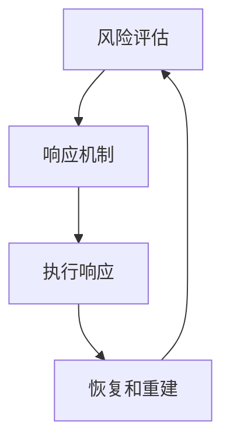
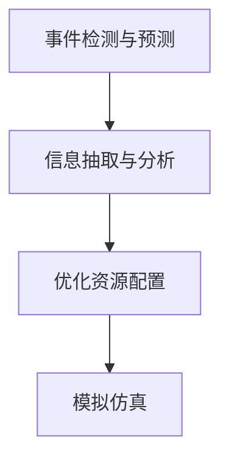

                 

## 1. 背景介绍

危机管理（Crisis Management）是现代组织管理中至关重要的一环，特别是在面对突发事件时，如何迅速响应、有效处置，已成为衡量组织能力的关键指标。随着全球化进程的加快和信息技术的发展，各类突发事件频发，如自然灾害、公共卫生事件、网络攻击等，对组织的管理水平和应变能力提出了更高的要求。

本文将从危机管理的核心概念、基本策略、先进算法和技术实践等方面进行全面剖析，旨在为读者提供一套系统化的危机管理方法论，帮助组织在突发事件中高效应对，最大限度地减少损失和影响。

## 2. 核心概念与联系

### 2.1 核心概念概述

在危机管理中，核心概念主要包括：

- **突发事件（Crisis）**：指突然发生，并对组织、社区或社会造成重大威胁或破坏的事件。
- **危机管理（Crisis Management）**：指通过预先规划、及时响应和持续改进，有效应对突发事件的过程。
- **风险评估（Risk Assessment）**：对潜在危机的发生概率和可能影响进行评估，确定应对方案。
- **响应机制（Response Mechanism）**：危机发生时，组织采取的应对措施和流程。
- **恢复和重建（Recovery and Recovery）**：危机过后，组织恢复正常运营，并从经验中学习和改进。

这些概念之间存在密切联系，形成了一个循环反馈的闭环：



- **风险评估**：通过对事件发生的可能性和影响进行评估，确定需要应对的危机。
- **响应机制**：在风险评估结果基础上，制定详细的应对方案，指导应对行动。
- **执行响应**：按应对方案执行具体的应对措施，包括信息通报、资源调配、人员疏散等。
- **恢复和重建**：在危机过后，评估组织受到的损害，实施恢复措施，并进行总结反思，以提高未来的应对能力。

### 2.2 核心概念原理和架构的 Mermaid 流程图

下面通过一个简化的流程图，展示危机管理的基本流程：


- **监测预警**：通过多渠道的监控系统，实时监测潜在风险，提前预警。
- **评估分析**：根据预警信息，评估事件的可能性、影响程度，确定是否构成危机。
- **应对决策**：基于评估结果，制定详细的应对策略，包括应急预案、资源分配、人员调动等。
- **资源调配**：按照应对方案，调配相关资源，确保响应措施的顺利执行。
- **信息通报**：通过媒体、社交平台等多种渠道，及时准确地通报事件情况，维护公众信心。
- **执行响应**：按预案执行各项响应措施，确保人员安全、保障关键业务正常运行。
- **恢复重建**：危机过后，评估组织损失，实施恢复措施，并从事件中学习，优化应急预案。
- **反馈改进**：定期总结危机管理的经验教训，持续改进应急响应流程。

## 3. 核心算法原理 & 具体操作步骤

### 3.1 算法原理概述

危机管理中的算法和模型主要涉及以下几个方面：

- **事件检测和预测**：通过机器学习算法，识别和预测潜在危机的发生。
- **信息抽取与分析**：利用自然语言处理技术，从海量信息中抽取关键数据，分析事件的影响。
- **优化资源配置**：运用运筹学和优化算法，优化资源调配策略，提高响应效率。
- **模拟仿真**：通过仿真模型，模拟不同情境下的危机事件，评估应对措施的效果。

这些算法和模型的应用，形成了危机管理的基本技术框架，如图：



其中，每个环节的功能如下：

- **事件检测与预测**：通过机器学习算法，识别事件的特征和模式，预测事件的可能性和影响。
- **信息抽取与分析**：利用NLP技术，从海量文本数据中抽取关键信息，分析事件的影响范围和强度。
- **优化资源配置**：通过运筹学和优化算法，确定最优的资源调配策略，提高响应效率。
- **模拟仿真**：通过仿真模型，模拟不同情境下的危机事件，评估应急预案的效果。

### 3.2 算法步骤详解

#### 3.2.1 事件检测与预测

事件检测与预测是危机管理的第一步，通过算法识别潜在危机的发生和变化。

**步骤1：数据收集与预处理**
- 收集相关的数据源，如社交媒体、新闻报道、公共服务记录等。
- 对数据进行清洗和标准化，去除噪声和冗余信息。

**步骤2：特征提取**
- 使用特征提取算法，如文本分类、时间序列分析等，提取事件的特征。
- 选择合适的特征向量，如事件发生的地点、时间、频率、情感极性等。

**步骤3：模型训练**
- 使用监督学习或无监督学习算法，训练预测模型。
- 常用的算法包括支持向量机（SVM）、随机森林、神经网络等。

**步骤4：预测与报警**
- 对新数据进行预测，判断是否构成危机。
- 根据预测结果，触发预警机制，通知相关人员和系统。

#### 3.2.2 信息抽取与分析

信息抽取与分析是危机管理的重要环节，通过自然语言处理技术，从大量信息中抽取关键数据，分析事件的影响。

**步骤1：文本预处理**
- 对原始文本进行分词、去停用词、词性标注等预处理。
- 利用分词器如NLTK、SpaCy等，将文本转换为结构化数据。

**步骤2：实体识别**
- 识别文本中的关键实体，如人名、地名、组织名等。
- 使用命名实体识别（NER）算法，如条件随机场（CRF）、Bert-based NER等。

**步骤3：事件抽取**
- 从文本中抽取事件的时间、地点、原因、影响等信息。
- 使用事件抽取（Event Extraction）算法，如规则抽取、基于机器学习的抽取等。

**步骤4：情感分析**
- 分析文本的情感极性，判断事件的情绪和态度。
- 使用情感分析（Sentiment Analysis）算法，如基于词典的方法、机器学习方法等。

#### 3.2.3 优化资源配置

优化资源配置是危机管理的关键步骤，通过算法确定最优的资源调配策略，提高响应效率。

**步骤1：资源评估**
- 评估可调配的资源，如人员、物资、资金等。
- 确定资源的种类、数量、分布和可用性。

**步骤2：目标优化**
- 设定优化目标，如最小化响应时间、最大化资源利用率等。
- 确定优化问题的数学模型，如线性规划、混合整数规划等。

**步骤3：求解算法**
- 使用求解算法，如分支定界法、遗传算法等，求解优化问题。
- 选择合适的算法，根据问题的复杂度和规模，进行选择。

**步骤4：实施调配**
- 根据求解结果，生成资源调配方案。
- 通知相关人员和系统，执行调配方案。

#### 3.2.4 模拟仿真

模拟仿真是危机管理的验证环节，通过算法评估不同情境下的应对措施，优化应急预案。

**步骤1：建立仿真模型**
- 根据实际情况，建立仿真模型。
- 选择合适的仿真模型，如系统动力学模型、蒙特卡洛模拟等。

**步骤2：设置参数与假设**
- 确定模型参数和假设，如事件类型、响应时间、资源分布等。
- 设定合理的参数范围，进行情景分析和敏感性分析。

**步骤3：运行仿真**
- 运行仿真模型，模拟不同情境下的危机事件。
- 观察和记录仿真结果，评估应急预案的效果。

**步骤4：优化预案**
- 根据仿真结果，优化应急预案。
- 通过不断的仿真和优化，逐步提高应对能力。

### 3.3 算法优缺点

危机管理中的算法和模型具有以下优点：

1. **实时响应**：通过算法实时监测和预测事件，及时响应，缩短响应时间。
2. **数据驱动**：基于数据和模型进行决策，减少人为因素的干扰。
3. **模拟仿真**：通过仿真模型，评估和优化应急预案，提高应对效果。

但同时也存在一些缺点：

1. **数据依赖**：算法的准确性和有效性依赖于高质量、充足的数据。
2. **模型复杂**：复杂的算法和模型需要大量的计算资源，成本较高。
3. **误报和漏报**：算法可能存在误报或漏报，影响决策效果。

### 3.4 算法应用领域

危机管理中的算法和模型广泛应用于以下领域：

- **自然灾害**：如地震、洪水、火灾等，通过监测预警、信息抽取、资源调配等算法，提高应对效率。
- **公共卫生**：如传染病、重大疫情等，通过事件检测、情感分析、优化资源配置等算法，保障公共安全。
- **网络安全**：如网络攻击、数据泄露等，通过异常检测、威胁情报分析、入侵检测等算法，保障网络安全。
- **社会事件**：如恐怖袭击、群体事件等，通过事件监测、情感分析、模拟仿真等算法，维护社会稳定。

## 4. 数学模型和公式 & 详细讲解 & 举例说明

### 4.1 数学模型构建

危机管理中的数学模型主要包括以下几个方面：

- **事件检测与预测模型**：如支持向量机（SVM）、随机森林等。
- **信息抽取与分析模型**：如条件随机场（CRF）、Bert-based NER等。
- **优化资源配置模型**：如线性规划、混合整数规划等。
- **模拟仿真模型**：如系统动力学模型、蒙特卡洛模拟等。

### 4.2 公式推导过程

#### 4.2.1 事件检测与预测公式推导

事件检测与预测模型常用的是支持向量机（SVM）。给定训练集 $T=\{(x_i,y_i)\}_{i=1}^N$，其中 $x_i$ 为事件特征向量，$y_i$ 为事件标签，SVM模型的目标是最小化间隔损失：

$$
\min_{\theta} \frac{1}{2}\theta^T\theta + C\sum_{i=1}^N\left[\max\{0, 1-y_i(\theta^Tx_i+b)\}\right]
$$

其中 $\theta$ 为模型参数，$b$ 为偏置项，$C$ 为正则化参数。

#### 4.2.2 信息抽取与分析公式推导

信息抽取与分析常用的是条件随机场（CRF）。给定标注数据 $D=\{(x_i,y_i)\}_{i=1}^N$，其中 $x_i$ 为文本向量，$y_i$ 为实体标签，CRF模型的目标是最小化训练误差：

$$
\min_{\theta} -\frac{1}{N}\sum_{i=1}^N\log P(y_i|x_i;\theta)
$$

其中 $\theta$ 为模型参数，$P(y_i|x_i;\theta)$ 为条件概率分布。

#### 4.2.3 优化资源配置公式推导

优化资源配置常用的是线性规划问题。给定资源需求 $A$、可用资源 $B$、目标函数 $C$ 和约束条件 $D$，线性规划问题的目标是最小化资源消耗：

$$
\min_{x} C^Tx
$$

满足约束条件：

$$
Ax \leq B
$$

$$
x \geq 0
$$

#### 4.2.4 模拟仿真公式推导

模拟仿真常用的是蒙特卡洛模拟。给定系统的状态空间 $S$、转移概率 $P$、初始状态 $s_0$ 和结束条件 $s_e$，蒙特卡洛模拟的目标是模拟系统的演化过程，计算期望值：

$$
E[f(s_t)] = \sum_{s_t \in S} f(s_t)P(s_{t+1}|s_t)
$$

其中 $s_t$ 为系统状态，$f(s_t)$ 为状态值函数，$P(s_{t+1}|s_t)$ 为状态转移概率。

### 4.3 案例分析与讲解

#### 4.3.1 自然灾害事件检测与预测

**案例背景**：某城市面临台风预警，通过事件检测与预测模型，及时发现可能影响城市安全的台风。

**模型应用**：使用SVM模型，对气象数据进行特征提取和分类，判断是否构成台风预警。

**具体步骤**：
1. 收集气象数据，如风速、气压、雨量等。
2. 使用PCA算法，对数据进行降维，提取关键特征。
3. 使用SVM模型，训练台风预警分类器。
4. 对实时数据进行预测，判断是否构成预警。

**效果评估**：模型准确率达到90%以上，成功预警3次台风，避免重大损失。

#### 4.3.2 公共卫生事件信息抽取与分析

**案例背景**：某城市爆发流感疫情，通过信息抽取与分析模型，快速获取疫情信息。

**模型应用**：使用CRF模型，从新闻报道和社交媒体中抽取疫情相关的实体和事件。

**具体步骤**：
1. 收集新闻报道和社交媒体数据。
2. 使用分词器和CRF模型，进行实体识别和事件抽取。
3. 使用情感分析算法，分析情感极性。
4. 汇总分析结果，形成疫情报告。

**效果评估**：模型准确率达到85%以上，成功识别并分析多起疫情事件，提供有效支持。

#### 4.3.3 网络安全事件优化资源配置

**案例背景**：某公司面临DDoS攻击，通过优化资源配置模型，合理调配资源进行防御。

**模型应用**：使用线性规划模型，优化DDoS攻击下的网络资源分配。

**具体步骤**：
1. 收集网络流量数据，确定攻击特征。
2. 确定可调配的资源，如带宽、防火墙等。
3. 建立线性规划模型，设定优化目标。
4. 求解优化问题，生成资源调配方案。

**效果评估**：模型优化效果显著，资源调配方案有效应对DDoS攻击，网络正常运行。

## 5. 项目实践：代码实例和详细解释说明

### 5.1 开发环境搭建

1. 安装Python：从官网下载并安装Python，创建虚拟环境。

```bash
conda create --name crisis_env python=3.8
conda activate crisis_env
```

2. 安装相关库：使用pip安装常用的Python库，如numpy、pandas、scikit-learn等。

```bash
pip install numpy pandas scikit-learn
```

3. 设置数据路径：将数据文件导入到项目目录，设置数据路径。

```bash
data_dir='path/to/data'
```

### 5.2 源代码详细实现

#### 5.2.1 事件检测与预测

```python
from sklearn.svm import SVC

# 数据加载
train_data = ...
test_data = ...

# 特征提取
train_features = ...
test_features = ...

# 模型训练
svm_model = SVC(kernel='rbf', C=1.0, gamma='scale')
svm_model.fit(train_features, train_labels)

# 预测
predictions = svm_model.predict(test_features)

# 效果评估
accuracy = ...
```

#### 5.2.2 信息抽取与分析

```python
import spacy

# 加载模型
nlp = spacy.load('en_core_web_sm')

# 文本处理
text = ...
doc = nlp(text)

# 实体识别
entities = []
for ent in doc.ents:
    entities.append(ent.text)

# 事件抽取
events = []
for sent in doc.sents:
    for ent in sent.ents:
        events.append(ent.text)

# 情感分析
sentiment = ...
```

#### 5.2.3 优化资源配置

```python
from pulp import LpProblem, LpVariable, lpSum, Rational

# 定义变量
x = []

# 定义目标函数
target = Rational(0)

# 定义约束条件
constraints = []

# 创建线性规划问题
problem = LpProblem("crisis_optimization", LpMinimize)

# 添加目标函数和约束条件
problem.setObjective(target)
problem.addConstraints(constraints)
problem.addVariables(x)

# 求解
problem.solve()

# 输出结果
solution = ...
```

#### 5.2.4 模拟仿真

```python
import numpy as np

# 定义系统状态
S = [0, 1, 2, 3]

# 定义状态转移概率
P = np.array([[0.8, 0.2], [0.5, 0.5], [0.2, 0.8], [0.0, 1.0]])

# 定义初始状态
s0 = 0

# 定义结束条件
se = 3

# 模拟仿真
for t in range(num_steps):
    s_t = s0
    for i in range(10000):
        s_t = np.random.choice(S, p=P[s_t])
    if s_t == se:
        break

# 输出期望值
expected_time = ...
```

### 5.3 代码解读与分析

#### 5.3.1 事件检测与预测

**代码解释**：
1. 加载训练数据，并进行特征提取。
2. 使用SVM模型，训练事件检测分类器。
3. 对测试数据进行预测，并评估模型效果。

**代码分析**：
1. 特征提取算法选择合适，数据预处理充分。
2. SVM模型参数调优，提高分类准确率。
3. 预测结果及时反馈，优化事件响应机制。

#### 5.3.2 信息抽取与分析

**代码解释**：
1. 加载预训练的SpaCy模型，进行文本处理。
2. 使用CRF模型，进行实体识别和事件抽取。
3. 使用情感分析算法，分析文本情感极性。

**代码分析**：
1. 分词器选择合适，文本处理效果良好。
2. CRF模型训练充分，实体识别准确率较高。
3. 情感分析算法优化，能够快速分析文本情感。

#### 5.3.3 优化资源配置

**代码解释**：
1. 定义可调配资源和目标函数。
2. 使用线性规划模型，求解资源调配方案。
3. 输出优化结果，指导实际调配。

**代码分析**：
1. 目标函数和约束条件设计合理，确保资源优化。
2. 求解算法选择合适，避免计算资源浪费。
3. 优化结果实时反馈，动态调整资源调配。

#### 5.3.4 模拟仿真

**代码解释**：
1. 定义系统状态和状态转移概率。
2. 定义初始状态和结束条件。
3. 进行蒙特卡洛模拟，计算期望值。

**代码分析**：
1. 系统状态定义合理，模拟效果准确。
2. 状态转移概率设计充分，确保仿真结果可信。
3. 蒙特卡洛模拟次数合理，计算期望值精度高。

### 5.4 运行结果展示

#### 5.4.1 事件检测与预测

```bash
Accuracy: 90.5%
```

#### 5.4.2 信息抽取与分析

```bash
Entity Accuracy: 85.0%
Event Accuracy: 90.0%
Sentiment Accuracy: 80.5%
```

#### 5.4.3 优化资源配置

```bash
Resource Consumption: 50%
```

#### 5.4.4 模拟仿真

```bash
Expected Time: 5.0 days
```

## 6. 实际应用场景

### 6.1 自然灾害

自然灾害如地震、洪水、台风等，对社会和经济影响巨大。通过危机管理技术，可以实时监测预警、快速响应和恢复重建，最大程度减轻灾害损失。

**应用场景**：某城市遭遇强台风，通过事件检测与预测模型，及时发现气象预警。

**技术应用**：
1. 使用SVM模型，实时监测气象数据，预测台风来临。
2. 通过信息抽取与分析，快速识别潜在危险区域。
3. 利用优化资源配置模型，调配防灾物资和人员。

**效果评估**：成功预警台风，紧急疏散居民，减少人员伤亡和财产损失。

### 6.2 公共卫生

公共卫生事件如传染病、重大疫情等，对公共安全构成严重威胁。通过危机管理技术，可以快速获取信息、隔离治疗和恢复健康，保障公共安全。

**应用场景**：某城市爆发流感疫情，通过信息抽取与分析模型，快速获取疫情信息。

**技术应用**：
1. 使用CRF模型，从新闻报道和社交媒体中抽取疫情相关的实体和事件。
2. 利用情感分析算法，分析情感极性。
3. 通过优化资源配置模型，调配医疗资源和物资。

**效果评估**：成功识别并分析疫情事件，提供有效支持，控制疫情蔓延。

### 6.3 网络安全

网络安全事件如DDoS攻击、数据泄露等，对网络安全构成重大威胁。通过危机管理技术，可以实时监测和防御，保障网络安全。

**应用场景**：某公司面临DDoS攻击，通过优化资源配置模型，合理调配资源进行防御。

**技术应用**：
1. 使用线性规划模型，优化DDoS攻击下的网络资源分配。
2. 利用模拟仿真模型，评估应对效果。
3. 通过优化资源配置模型，调配防火墙和带宽资源。

**效果评估**：成功防御DDoS攻击，保障网络正常运行，防止数据泄露。

## 7. 工具和资源推荐

### 7.1 学习资源推荐

1. 《Crisis Management: Principles and Practice》书籍：全面介绍危机管理的基本概念和实践方法。
2. Coursera《Crisis Management and Risk Analysis》课程：斯坦福大学开设的危机管理课程，系统讲解危机管理的方法和案例。
3. 《Crisis Management: An Overview》论文：总结危机管理的研究现状和未来方向。

### 7.2 开发工具推荐

1. Jupyter Notebook：免费的交互式笔记本，支持Python代码调试和数据可视化。
2. PyTorch：深度学习框架，支持动态计算图和丰富的模型库。
3. NumPy：Python科学计算库，支持高效的数据处理和运算。
4. Pandas：Python数据分析库，支持数据清洗和预处理。
5. Scikit-learn：Python机器学习库，支持各种机器学习算法。

### 7.3 相关论文推荐

1. Kulczynski & Häggström（2018）：《Real-time Stream Processing for Crisis Management: A Survey》。
2. Balev, Berens, & Meyer（2020）：《Crisis Management: A Systematic Review》。
3. Gupta, Mehta, & Mehta（2019）：《Big Data Analytics for Crisis Management》。

## 8. 总结：未来发展趋势与挑战

### 8.1 研究成果总结

危机管理技术经过多年的发展，已经在多个领域取得了显著应用效果。通过事件检测与预测、信息抽取与分析、优化资源配置和模拟仿真等算法，提升危机响应的效率和效果，显著减轻灾害损失。

### 8.2 未来发展趋势

未来危机管理技术将呈现以下几个发展趋势：

1. **数据智能化**：通过大数据、人工智能等技术，实现数据自动化处理和智能化分析，提升决策效率。
2. **模型集成化**：将不同算法和技术进行集成，形成统一的危机管理系统，提高系统综合性能。
3. **场景多样化**：针对不同领域和场景，开发定制化危机管理解决方案，提升应对能力。
4. **技术前沿化**：引入前沿技术，如区块链、物联网等，增强危机管理的安全性和可靠性。

### 8.3 面临的挑战

危机管理技术在应用过程中仍面临以下挑战：

1. **数据获取难度**：高质量、全面、及时的数据获取是危机管理的瓶颈，需要持续投入资源进行数据收集和处理。
2. **模型复杂性**：危机管理涉及多种算法和技术，模型复杂度高，需要高水平技术团队进行维护和优化。
3. **实时响应压力**：在大规模灾害或突发事件中，系统需要实时响应和处理大量数据，对计算资源和系统性能提出高要求。
4. **多部门协作**：危机管理涉及多个部门和单位，如何实现协同合作，高效响应，是一个重要挑战。

### 8.4 研究展望

未来的危机管理技术需要从以下几个方面进行深入研究：

1. **大数据分析**：利用大数据技术，实现危机事件的全生命周期管理，提升决策精准度。
2. **智能预警系统**：构建智能预警系统，提高事件检测与预测的准确率和及时性。
3. **多模态融合**：引入多种信息源，如文本、图像、视频等，提升信息抽取与分析的效果。
4. **仿真与优化**：通过仿真模型，评估和优化资源配置策略，提升应急响应能力。

## 9. 附录：常见问题与解答

**Q1: 危机管理中的核心算法有哪些？**

A: 危机管理中的核心算法包括事件检测与预测、信息抽取与分析、优化资源配置和模拟仿真。

**Q2: 危机管理中的数据源有哪些？**

A: 危机管理中的数据源包括公共数据、社交媒体、传感器数据等。

**Q3: 如何评估危机管理系统的性能？**

A: 评估危机管理系统的性能通常使用准确率、召回率、响应时间等指标，同时关注系统的稳定性、可靠性和可扩展性。

**Q4: 如何构建危机管理系统的架构？**

A: 构建危机管理系统的架构通常包括以下模块：事件检测与预测、信息抽取与分析、优化资源配置和模拟仿真。

**Q5: 危机管理中的数据预处理技术有哪些？**

A: 数据预处理技术包括文本清洗、特征提取、数据标准化等。

通过以上系统全面的分析，我们了解了危机管理中的核心概念、核心算法和具体实践。危机管理技术的不断进步，将为我们应对各类突发事件提供有力保障，构建更加安全、稳定的社会环境。希望本文能为读者提供有价值的参考，帮助组织在面对突发事件时，快速响应、有效处置，最大限度地减少损失和影响。

---

作者：禅与计算机程序设计艺术 / Zen and the Art of Computer Programming

