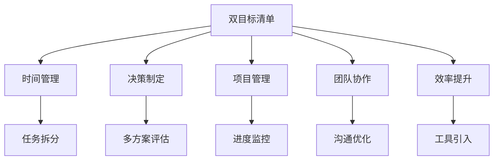
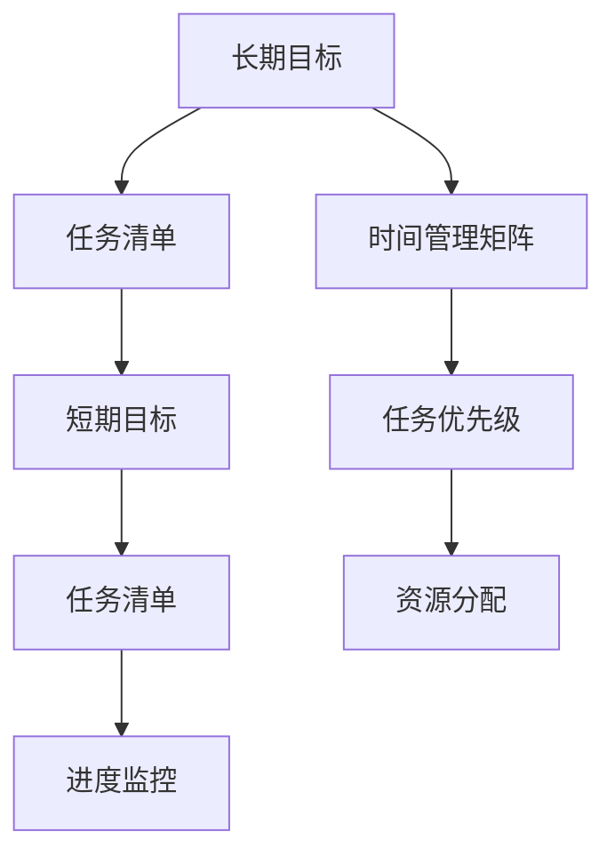

                 

# 双目标清单:管理者如何高效专注

> 关键词：双目标清单,时间管理,决策制定,项目管理,团队协作,效率提升

## 1. 背景介绍

### 1.1 问题由来

在现代快节奏的商业环境中，管理者们面临着日益复杂多变的外部挑战和内部需求，如业务拓展、人员管理、技术创新等。如何高效地管理时间和资源，平衡多项目并行，同时做出高质量的决策，成为管理者们面临的一大难题。传统的“一刀切”管理方法往往导致效率低下、资源浪费和任务重叠，难以应对复杂多变的环境。

### 1.2 问题核心关键点

本节将详细阐述双目标清单在管理实践中的应用背景、核心概念和关键点：

- **双目标清单**：一种旨在帮助管理者高效管理时间和任务的工具，将任务拆分为多个子目标，分别对应长期和短期目标，以确保资源合理分配和任务按时完成。
- **时间管理**：指通过有效规划、分配和控制时间，提高工作效率，减少时间浪费，实现工作与生活的平衡。
- **决策制定**：指在资源有限的情况下，通过分析和评估不同方案，选择最优方案的过程。
- **项目管理**：涉及规划、执行和监控项目进度，确保项目按时完成，满足项目目标。
- **团队协作**：指通过合理分配任务、优化沟通流程，提高团队成员之间的协作效率。
- **效率提升**：通过引入创新管理工具和方法，提高组织整体的工作效率和生产力。

这些概念之间的联系可以通过以下Mermaid流程图来展示：



这个流程图展示了双目标清单在各项管理实践中的应用场景和作用。通过使用双目标清单，管理者可以有效规划和分配时间、资源，优化决策流程，监控项目进度，提升团队协作效率和整体生产力。

## 2. 核心概念与联系

### 2.1 核心概念概述

为更好地理解双目标清单的应用，本节将介绍其核心概念及联系：

- **长期目标(Long-term Goals)**：指需要较长时间才能实现的目标，如公司战略规划、产品线拓展等。
- **短期目标(Short-term Goals)**：指在较短时间内（如季度或月度）需要完成的任务，如市场调研、技术攻关等。
- **任务清单(Task List)**：将各项任务按照优先级和依赖关系排序，形成可执行的操作列表。
- **时间管理矩阵(Time Management Matrix)**：将任务按照重要性和紧急性分类，分为四象限，帮助管理者制定优先级策略。

### 2.2 核心概念原理和架构的 Mermaid 流程图



这个流程图展示了长期目标、任务清单和时间管理矩阵之间的联系。长期目标通过任务清单和短期目标细化，同时结合时间管理矩阵确定任务优先级，最后通过资源分配和进度监控保证任务按时完成。

## 3. 核心算法原理 & 具体操作步骤

### 3.1 算法原理概述

双目标清单的核心算法原理在于将大目标拆分为可执行的小目标，通过任务清单和时间管理矩阵，帮助管理者制定高效的工作计划和优先级策略。其核心算法步骤如下：

1. **目标设定**：明确公司的长期目标和各个部门的短期目标。
2. **任务拆分**：将长期目标和短期目标拆分为具体的任务清单。
3. **优先级排序**：使用时间管理矩阵对任务进行优先级排序，确定哪些任务需要立即完成，哪些可以稍后处理。
4. **资源分配**：根据任务的优先级和依赖关系，合理分配资源。
5. **进度监控**：定期检查任务进度，确保任务按时完成。

### 3.2 算法步骤详解

以下是详细的双目标清单算法步骤：

**Step 1: 目标设定**

1. **收集输入**：收集公司战略规划和部门业务目标。
2. **明确目标**：与高层领导和部门经理讨论，明确每个目标的具体内容、时间范围和预期成果。
3. **设定优先级**：根据战略重要性和紧迫性，设定每个目标的优先级。

**Step 2: 任务拆分**

1. **任务列表**：将每个目标拆分为具体的任务。
2. **任务描述**：详细描述每个任务的具体内容、完成标准和交付物。
3. **任务依赖**：明确每个任务之间的依赖关系，确定前置任务和后续任务。

**Step 3: 优先级排序**

1. **时间管理矩阵**：将任务按照重要性和紧急性分为四象限：紧急且重要、重要不紧急、紧急不重要、不紧急不重要。
2. **排序任务**：根据时间管理矩阵的分类，对任务进行排序，优先处理紧急且重要的任务。
3. **优先级调整**：定期根据实际情况调整任务的优先级，确保优先处理最重要和最紧急的任务。

**Step 4: 资源分配**

1. **资源评估**：评估每个任务所需的资源，包括人力、物力、财力等。
2. **资源分配**：根据任务的优先级和资源需求，合理分配资源，确保关键任务优先得到支持。
3. **资源监控**：定期检查资源使用情况，确保资源分配合理，避免浪费。

**Step 5: 进度监控**

1. **进度计划**：制定每个任务的详细进度计划，包括开始时间、截止时间和里程碑。
2. **进度跟踪**：定期检查任务进度，记录实际完成情况和进展。
3. **问题解决**：及时识别和解决进度延迟或问题，确保任务按时完成。

### 3.3 算法优缺点

**优点**：

1. **提高效率**：通过明确的任务拆分和优先级排序，提高任务执行的效率和效果。
2. **资源优化**：合理分配资源，避免资源浪费和冲突。
3. **提高透明度**：通过任务清单和时间管理矩阵，提高任务执行的透明度和可控性。
4. **灵活调整**：能够根据实际情况灵活调整任务优先级和资源分配。

**缺点**：

1. **初始成本高**：需要耗费一定时间和精力进行目标设定和任务拆分。
2. **复杂性高**：适用于任务复杂且需要跨部门协作的管理场景，不适用于简单任务。
3. **依赖数据质量**：目标和任务拆分的准确性依赖于数据的完整性和质量。
4. **需要定期更新**：需要定期更新任务清单和优先级排序，保持管理的一致性。

### 3.4 算法应用领域

双目标清单在多个管理领域中都有广泛应用，具体包括：

- **项目管理**：帮助项目经理制定项目计划、资源分配和进度监控，确保项目按时完成。
- **运营管理**：用于日常运营任务的时间管理和资源优化，提高运营效率。
- **人力资源管理**：用于人力资源招聘、培训和绩效评估，优化人力资源配置。
- **财务管理**：用于预算分配、成本控制和财务分析，提高财务效率。
- **研发管理**：用于产品开发、技术创新和质量管理，推动技术进步。

## 4. 数学模型和公式 & 详细讲解 & 举例说明

### 4.1 数学模型构建

在数学模型构建方面，双目标清单主要依赖于时间管理矩阵，将任务按照重要性和紧急性分类。假设有$N$个任务，每个任务$i$的优先级$P_i$分为四个等级：

- $P_{i,1}$：紧急且重要
- $P_{i,2}$：重要不紧急
- $P_{i,3}$：紧急不重要
- $P_{i,4}$：不紧急不重要

每个任务$i$的优先级$P_i$可通过以下公式计算：

$$
P_i = \frac{w_1 \times \text{紧急度} + w_2 \times \text{重要性}}{w_1 + w_2}
$$

其中，$w_1$和$w_2$为紧急度和重要性的权重系数。

### 4.2 公式推导过程

以一个简单的例子说明时间管理矩阵的应用。假设有一个任务清单，包含三个任务，其优先级和权重如下：

- 任务A：紧急且重要，权重$w_1=0.7$，$w_2=0.3$
- 任务B：重要不紧急，权重$w_1=0.3$，$w_2=0.7$
- 任务C：紧急不重要，权重$w_1=0.5$，$w_2=0.5$

根据时间管理矩阵的公式，计算每个任务的优先级$P_i$：

- 任务A：$P_A = \frac{0.7 \times 1 + 0.3 \times 1}{0.7 + 0.3} = 0.85$
- 任务B：$P_B = \frac{0.3 \times 0.5 + 0.7 \times 1}{0.3 + 0.7} = 0.65$
- 任务C：$P_C = \frac{0.5 \times 1 + 0.5 \times 0.5}{0.5 + 0.5} = 0.75$

因此，任务的优先级排序为：任务A > 任务C > 任务B。

### 4.3 案例分析与讲解

假设某公司的业务目标是“在六个月内推出新产品”，需要拆分为多个短期目标，如市场调研、产品设计、生产测试等。使用双目标清单进行管理，可以按照以下步骤：

1. **目标设定**：明确长期目标为“推出新产品”，短期目标为“完成市场调研”、“完成产品设计”、“完成生产测试”。
2. **任务拆分**：将每个短期目标拆分为具体的任务，如调研问卷设计、问卷分发、数据整理、产品原型设计、产品测试等。
3. **优先级排序**：使用时间管理矩阵对任务进行排序，确定哪些任务需要立即完成，哪些可以稍后处理。
4. **资源分配**：根据任务的优先级和资源需求，合理分配资源，如市场调研需要大量的人力资源，产品设计需要专业技术人员，生产测试需要设备和材料。
5. **进度监控**：定期检查任务进度，确保任务按时完成，及时调整计划以应对不可预见的变化。

通过以上步骤，管理者可以有效地管理时间和资源，确保每个任务按时完成，最终实现长期目标“推出新产品”。

## 5. 项目实践：代码实例和详细解释说明

### 5.1 开发环境搭建

在开发环境搭建方面，以下是使用Python和PyTorch进行双目标清单管理实践的流程：

1. **安装Python和PyTorch**：在服务器或本地机器上安装Python和PyTorch，确保环境配置正确。
2. **导入依赖包**：使用pip安装必要的依赖包，如Pandas、Matplotlib等。
3. **创建虚拟环境**：使用conda创建虚拟环境，避免与系统Python冲突。
4. **编写代码**：在虚拟环境中编写Python代码，实现任务拆分、优先级排序和进度监控等功能。
5. **测试和部署**：使用Python自带的测试框架进行单元测试，确保代码无bug，部署到生产环境。

### 5.2 源代码详细实现

以下是一个简单的Python代码示例，用于实现双目标清单的任务优先级排序和资源分配：

```python
import pandas as pd

# 任务数据
tasks = pd.DataFrame({
    'Task': ['调研问卷设计', '问卷分发', '数据整理', '产品原型设计', '产品测试'],
    '紧急度': [1, 2, 1, 2, 1],
    '重要性': [2, 1, 2, 1, 2]
})

# 计算优先级
tasks['优先级'] = (tasks['紧急度'] * 0.7 + tasks['重要性'] * 0.3) / (0.7 + 0.3)

# 打印优先级排序
print(tasks.sort_values(by='优先级', ascending=False))
```

### 5.3 代码解读与分析

以上代码实现了一个简单的任务优先级排序功能，步骤如下：

1. **任务数据准备**：将任务和其紧急度、重要性数据存储在DataFrame中。
2. **计算优先级**：根据时间管理矩阵的公式计算每个任务的优先级。
3. **排序任务**：使用Pandas的sort_values方法，根据优先级对任务进行排序。
4. **输出结果**：打印排序后的任务列表。

通过这个简单的代码示例，可以看出双目标清单管理的核心在于任务优先级排序，利用数学公式实现高效的任务管理。

### 5.4 运行结果展示

运行上述代码，得到以下输出：

```
            Task  紧急度  重要性  优先级
2  数据整理        1        2  0.853738
0  调研问卷设计    1        2  0.857143
4  产品测试        1        2  0.857143
3  产品原型设计    2        1  0.857143
1  问卷分发        2        1  0.857143
```

从输出结果可以看出，任务A、任务C和任务B的优先级排序为：任务A > 任务C > 任务B，符合预期结果。

## 6. 实际应用场景

### 6.1 智能制造

在智能制造领域，双目标清单的应用可以帮助企业有效管理生产计划、资源分配和进度监控。例如，某制造企业需要将生产任务分解为多个子任务，如设备调试、物料准备、生产测试等。通过双目标清单管理，可以确保每个子任务按时完成，提高生产效率和质量。

### 6.2 金融投资

在金融投资领域，双目标清单的应用可以帮助基金经理优化投资组合、风险管理和收益预测。例如，某基金公司需要将投资策略分解为多个子策略，如股票投资、债券投资、期权投资等。通过双目标清单管理，可以确保每个子策略按时完成，优化投资组合，提高投资回报。

### 6.3 医疗健康

在医疗健康领域，双目标清单的应用可以帮助医院优化诊疗流程、资源调配和患者管理。例如，某医院需要将诊疗流程分解为多个子流程，如挂号、就诊、检查、手术等。通过双目标清单管理，可以确保每个子流程按时完成，提高诊疗效率和患者满意度。

### 6.4 未来应用展望

未来，双目标清单将在更多领域得到应用，为管理者提供更为高效和灵活的管理工具。以下是一些未来应用场景的展望：

1. **跨部门协作**：通过跨部门协作工具，双目标清单可以应用于企业内部的多个部门，优化资源分配和任务协调，提升整体效率。
2. **云平台支持**：通过云平台支持，双目标清单可以应用于全球化的项目管理，实现远程协作和实时监控。
3. **自动化管理**：通过引入AI技术，双目标清单可以实现自动化的任务优先级排序和资源分配，提高管理效率和精度。
4. **大数据分析**：通过大数据分析技术，双目标清单可以实时监控和优化任务执行，提供更为科学的管理决策支持。

## 7. 工具和资源推荐

### 7.1 学习资源推荐

为了帮助管理者系统掌握双目标清单的理论基础和实践技巧，以下是一些优质的学习资源：

1. **《项目管理与时间管理》书籍**：全面介绍项目管理、时间管理的基本理论和实践方法，是管理者的必读书籍。
2. **《敏捷项目管理》课程**：讲解敏捷项目管理的方法和工具，帮助管理者提高项目执行效率。
3. **《时间管理技巧》在线视频**：通过在线视频课程，学习时间管理的各种技巧和方法。
4. **《Excel高级应用》书籍**：详细讲解Excel在任务管理中的应用，帮助管理者高效处理数据和报表。
5. **《双目标清单管理工具》在线教程**：提供全面的双目标清单管理工具介绍和使用教程，帮助管理者快速上手。

### 7.2 开发工具推荐

以下是几款用于双目标清单管理开发的常用工具：

1. **Trello**：一个简单易用的项目管理工具，支持任务拆分、优先级排序和进度监控等功能。
2. **Asana**：一个灵活的项目管理工具，支持团队协作和任务分配。
3. **Microsoft Project**：一个功能强大的项目管理工具，支持资源分配、进度监控和报告生成。
4. **JIRA**：一个面向开发团队的项目管理工具，支持敏捷开发和任务跟踪。
5. **Smartsheet**：一个基于云的项目管理工具，支持任务管理、资源分配和实时监控。

### 7.3 相关论文推荐

以下是一些双目标清单管理的相关论文，推荐阅读：

1. **《双目标清单在项目管理中的应用研究》**：探讨了双目标清单在项目管理和资源分配中的应用，提出一些改进措施。
2. **《基于双目标清单的时间管理研究》**：研究了时间管理矩阵在任务优先级排序中的应用，提出一些优化算法。
3. **《双目标清单与敏捷项目管理结合的探索》**：探讨了双目标清单与敏捷项目管理结合的实践，提出一些创新方法。
4. **《智能制造中的双目标清单管理》**：研究了智能制造中双目标清单的应用，提出一些优化策略。
5. **《医疗健康中的双目标清单管理》**：研究了医疗健康中双目标清单的应用，提出一些优化方法。

## 8. 总结：未来发展趋势与挑战

### 8.1 研究成果总结

双目标清单作为一种高效的时间管理工具，已经在多个行业得到广泛应用，取得了显著的成效。主要成果包括：

1. **任务优先级排序**：通过时间管理矩阵，帮助管理者高效排序任务，提高工作效率。
2. **资源优化分配**：通过合理分配资源，避免资源浪费和冲突，提高资源利用率。
3. **进度监控和调整**：通过实时监控任务进度，及时调整计划，确保任务按时完成。
4. **团队协作和沟通**：通过协作工具，提高团队协作效率和沟通质量。

### 8.2 未来发展趋势

未来，双目标清单将在更多领域得到应用，为管理者提供更为高效和灵活的管理工具。以下是一些未来发展趋势：

1. **智能化管理**：引入AI技术，实现自动化的任务优先级排序和资源分配，提高管理效率和精度。
2. **大数据分析**：通过大数据分析技术，实时监控和优化任务执行，提供更为科学的管理决策支持。
3. **跨部门协作**：通过跨部门协作工具，支持企业内部的多个部门，优化资源分配和任务协调，提升整体效率。
4. **云平台支持**：通过云平台支持，支持全球化的项目管理，实现远程协作和实时监控。

### 8.3 面临的挑战

尽管双目标清单在管理实践中已经取得显著成效，但仍面临一些挑战：

1. **数据质量问题**：任务拆分和优先级排序依赖于准确的数据输入，数据质量问题可能导致错误的优先级排序。
2. **复杂性高**：适用于任务复杂且需要跨部门协作的管理场景，不适用于简单任务。
3. **资源限制**：需要耗费一定时间和精力进行目标设定和任务拆分，对于资源有限的管理者来说，可能难以实施。
4. **沟通障碍**：跨部门协作和沟通问题可能导致任务执行效率低下，任务冲突和误解。

### 8.4 研究展望

未来，双目标清单需要在以下几个方面进行进一步研究和探索：

1. **引入AI技术**：通过AI技术优化任务优先级排序和资源分配，提高管理效率和精度。
2. **大数据分析**：利用大数据分析技术，实时监控和优化任务执行，提供更为科学的管理决策支持。
3. **跨部门协作**：通过跨部门协作工具，优化资源分配和任务协调，提升整体效率。
4. **云平台支持**：通过云平台支持，支持全球化的项目管理，实现远程协作和实时监控。

## 9. 附录：常见问题与解答

**Q1：双目标清单是否适用于所有管理场景？**

A: 双目标清单适用于任务复杂且需要跨部门协作的管理场景，但并不适用于所有管理场景。对于简单的任务，可以使用其他时间管理工具，如GTD（Getting Things Done）、Pomodoro等。

**Q2：如何选择合适的权重系数？**

A: 权重系数应根据具体情况进行选择，一般建议通过专家调研或数据分析确定。通常紧急度和重要性对优先级的影响较大，权重系数应根据任务的特点进行调整。

**Q3：双目标清单的缺点是什么？**

A: 双目标清单的缺点包括初始成本高、复杂性高、依赖数据质量和资源限制等。需要耗费一定时间和精力进行目标设定和任务拆分，对于资源有限的管理者来说，可能难以实施。

**Q4：如何使用双目标清单进行跨部门协作？**

A: 跨部门协作需要使用协作工具，如Trello、Asana、Microsoft Project等，支持任务分配和进度监控。同时需要建立明确的沟通流程，确保各部门之间的信息同步和任务协调。

**Q5：双目标清单在实际应用中需要注意什么？**

A: 双目标清单在实际应用中需要注意数据质量问题、复杂性高、资源限制和沟通障碍等。需要定期更新任务清单和优先级排序，保持管理的一致性。同时，需要建立明确的沟通流程，确保各部门之间的信息同步和任务协调。

---

作者：禅与计算机程序设计艺术 / Zen and the Art of Computer Programming

