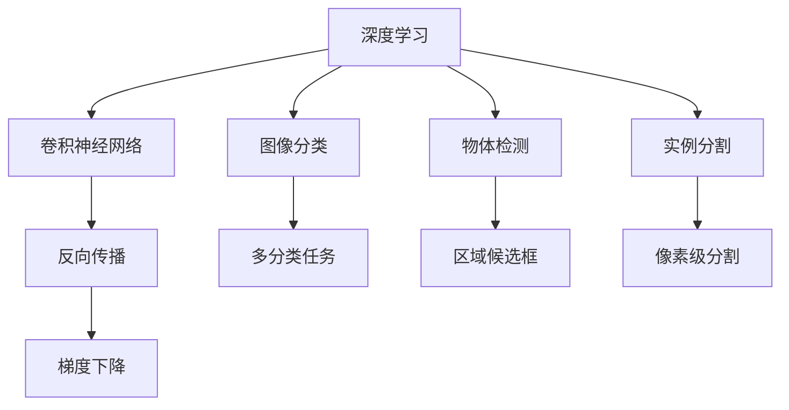

                 

# 反向传播在计算机视觉中的应用

> 关键词：反向传播,计算机视觉,深度学习,卷积神经网络,梯度下降,图像分类,物体检测,实例分割

## 1. 背景介绍

计算机视觉作为人工智能的一个重要分支，旨在通过算法使计算机能够“看懂”和理解图像、视频等视觉内容。它涉及图像处理、模式识别、物体检测、图像分割、三维重建等多个方面，广泛应用于自动驾驶、医疗影像分析、安防监控、智能家居等领域。计算机视觉技术的快速发展，得益于深度学习模型的广泛应用，特别是卷积神经网络(Convolutional Neural Networks, CNN)的成熟和优化。

在本章中，我们将系统性地介绍反向传播(Backpropagation)在计算机视觉中的应用，探讨其在深度学习模型训练中的核心作用，以及如何通过优化反向传播算法，提高计算机视觉任务的性能。

## 2. 核心概念与联系

### 2.1 核心概念概述

在深入讨论反向传播在计算机视觉中的应用前，我们先回顾一些核心概念：

- **深度学习(Deep Learning)**：基于多层神经网络，能够从大量数据中自动学习并提取出特征表示，广泛应用于图像、语音、自然语言处理等领域。

- **卷积神经网络(Convolutional Neural Network, CNN)**：专门用于处理空间结构数据的神经网络模型，通过卷积和池化等操作提取局部特征，在图像识别、目标检测等任务中表现优异。

- **反向传播(Backpropagation)**：一种基于梯度下降法的训练算法，通过反向传播误差梯度更新模型参数，是深度学习中最为核心和常用的训练方法之一。

- **梯度下降法(Gradient Descent)**：通过梯度信息不断调整模型参数，使得损失函数最小化的优化算法。

- **图像分类(Image Classification)**：将输入的图像分为不同的类别，如识别猫和狗。

- **物体检测(Object Detection)**：在图像中检测出具体的物体，并标出物体的位置和类别。

- **实例分割(Segmentation)**：将图像中每个像素分到不同的类别中，如分割图像中的物体和背景。

这些概念之间的逻辑关系可以通过以下Mermaid流程图来展示：



这个流程图展示了深度学习、CNN、反向传播、梯度下降等核心概念，以及它们在图像分类、物体检测、实例分割等计算机视觉任务中的应用。

## 3. 核心算法原理 & 具体操作步骤

### 3.1 算法原理概述

反向传播算法是深度学习模型训练的核心技术。其基本思想是，通过链式法则计算损失函数对每个模型参数的偏导数，然后根据梯度下降法调整模型参数，最小化损失函数。

对于任何一个前向传播计算出的输出值$y$和实际值$y_{true}$之间的误差$E$，其反向传播过程如下：

1. 计算$E$对输出层$y$的偏导数$E'_{y}$。
2. 将$E'_{y}$反向传播到下一层，计算该层输出$y'$对下一层输入$x'$的偏导数$E'_{y'}$。
3. 继续反向传播到更早的层，直到计算出所有层对输入$x$的偏导数$E'_{x}$。
4. 根据$E'_{x}$，使用梯度下降法更新所有层的网络权重。

在反向传播过程中，每一层的梯度都是上一层梯度的乘积，即链式法则。这一过程不断重复，直到所有层的参数都被更新，从而最小化损失函数$E$。

### 3.2 算法步骤详解

反向传播的具体步骤如下：

1. **前向传播**：将输入数据$x$输入神经网络，计算得到输出$y$。

2. **计算误差**：计算输出$y$与实际值$y_{true}$之间的误差$E$。

3. **反向传播误差梯度**：从输出层开始，依次计算每一层误差梯度$E'_{y'}$，直到输入层。

4. **更新模型参数**：根据误差梯度$E'_{x}$，使用梯度下降法更新所有网络权重。

5. **重复执行**：重复以上步骤，直到损失函数$E$收敛或达到预设的迭代次数。

### 3.3 算法优缺点

反向传播算法具有以下优点：

- **高效性**：反向传播算法通过链式法则，高效地计算梯度，避免了逐层手动计算梯度的繁琐过程。

- **广泛应用**：几乎适用于所有深度学习模型的训练，特别是卷积神经网络。

- **理论完备**：基于坚实的数学基础，具有完备的理论保证。

然而，反向传播算法也存在以下缺点：

- **梯度消失/爆炸**：深度网络中，梯度在反向传播过程中可能会消失或爆炸，导致模型训练困难。

- **计算复杂度高**：对于大规模深度学习模型，反向传播的计算复杂度较高，训练时间较长。

- **过拟合风险**：如果训练数据不足，反向传播算法可能导致模型过拟合。

### 3.4 算法应用领域

反向传播在计算机视觉领域有广泛的应用，以下是几个典型场景：

- **图像分类**：如手写数字识别、物体识别等任务，通过反向传播训练卷积神经网络模型，从而实现图像分类。

- **物体检测**：如目标检测、行人检测等任务，通过反向传播训练区域候选框模型，能够检测出图像中的物体。

- **实例分割**：如语义分割、实例分割等任务，通过反向传播训练像素级分割模型，实现对每个像素的分类。

- **图像生成**：如GANs、VAEs等生成模型，通过反向传播训练生成网络，能够生成逼真的图像。

## 4. 数学模型和公式 & 详细讲解 & 举例说明

### 4.1 数学模型构建

反向传播算法基于梯度下降法，其核心思想是通过计算损失函数对每个参数的偏导数，从而更新模型参数。假设模型参数为$\theta$，损失函数为$E(\theta)$，则梯度下降法的基本公式为：

$$
\theta \leftarrow \theta - \eta \nabla_{\theta}E(\theta)
$$

其中$\eta$为学习率，$\nabla_{\theta}E(\theta)$为损失函数对模型参数$\theta$的梯度。

### 4.2 公式推导过程

以一个简单的二分类任务为例，介绍反向传播的计算过程。假设输入为$x$，输出为$y$，目标输出为$y_{true}$，模型为：

$$
y = \sigma(Wx + b)
$$

其中$W$和$b$为模型参数，$\sigma$为激活函数，$x$为输入，$y$为输出。

目标函数为交叉熵损失函数：

$$
E = -\frac{1}{N} \sum_{i=1}^N \left(y_i \log \hat{y}_i + (1-y_i) \log(1-\hat{y}_i) \right)
$$

其中$N$为样本数，$y_i$为实际标签，$\hat{y}_i$为模型预测标签。

前向传播计算损失函数$E$的梯度$E'_{x}$，通过链式法则计算：

$$
E'_{x} = \frac{\partial E}{\partial x} = \frac{\partial E}{\partial y} \frac{\partial y}{\partial x}
$$

其中$\frac{\partial E}{\partial y}$为损失函数对输出$y$的偏导数，$\frac{\partial y}{\partial x}$为输出$y$对输入$x$的偏导数。

根据链式法则，有：

$$
\frac{\partial y}{\partial x} = \frac{\partial \sigma(Wx + b)}{\partial x} = \sigma'(Wx + b) \cdot W
$$

因此：

$$
E'_{x} = \frac{\partial E}{\partial y} \cdot \sigma'(Wx + b) \cdot W
$$

将$\frac{\partial E}{\partial y}$代入，有：

$$
\frac{\partial E}{\partial y} = \frac{1}{N} \sum_{i=1}^N \left(-y_i + \frac{\hat{y}_i}{1-\hat{y}_i} \right)
$$

联立以上各式，得到：

$$
E'_{x} = \frac{1}{N} \sum_{i=1}^N \left(-y_i + \frac{\hat{y}_i}{1-\hat{y}_i} \right) \cdot \sigma'(Wx_i + b) \cdot W
$$

### 4.3 案例分析与讲解

在实际应用中，反向传播算法可以用于训练各种类型的深度学习模型，如卷积神经网络、递归神经网络等。下面以一个简单的卷积神经网络模型为例，展示反向传播的应用。

假设我们有一个简单的卷积神经网络模型，包含两个卷积层和一个全连接层：

```
+-------------------------+        +---------------------+        +---------------+
| Input                     | -->   | Conv2d               | -->   | ReLU           |
|                           |        |                     |        |                |
|                           | -->   | MaxPooling2d         | -->   |                |
|                           |        |                     |        |                |
|                           | -->   | Conv2d               | -->   | ReLU           |
|                           |        |                     |        |                |
|                           | -->   | MaxPooling2d         | -->   | Flatten        |
|                           |        |                     |        |                |
|                           | -->   | Linear               | -->   | Softmax        |
|                           |        |                     |        |                |
| Output                    | <--   |                         | <--   |                |
+-------------------------+        +---------------------+        +---------------+
```

假设输入图片大小为$32 \times 32$，第一个卷积层的卷积核大小为$3 \times 3$，步幅为$1$，输出通道数为$16$。

使用反向传播算法，我们可以计算出损失函数对每个卷积核的偏导数，从而更新模型参数。假设输出结果为$y$，目标结果为$y_{true}$，则反向传播过程如下：

1. **前向传播**：将输入图片$x$输入模型，计算得到输出结果$y$。

2. **计算误差**：计算输出结果$y$与目标结果$y_{true}$之间的误差$E$。

3. **反向传播误差梯度**：从输出层开始，依次计算每一层的误差梯度$E'_{y'}$。

4. **更新模型参数**：根据误差梯度$E'_{x}$，使用梯度下降法更新所有网络权重。

以下是反向传播的伪代码实现：

```python
for i in range(num_iterations):
    # 前向传播
    y = model(x)
    
    # 计算误差
    E = loss(y, y_true)
    
    # 反向传播误差梯度
    E_prime = E_prime_y * (1 - y) * y
    
    # 更新模型参数
    for layer in model.layers:
        if isinstance(layer, Conv2d):
            E_prime = E_prime * layer.weights
        else:
            E_prime = E_prime * layer.weights
        layer.weights -= learning_rate * E_prime
```

## 5. 项目实践：代码实例和详细解释说明

### 5.1 开发环境搭建

进行深度学习项目开发，需要配置好开发环境。以下是使用Python和PyTorch搭建开发环境的详细步骤：

1. 安装Python：可以从官网下载安装Python，建议选择3.6或更高版本。

2. 安装Anaconda：从官网下载安装Anaconda，创建虚拟环境进行开发。

3. 安装PyTorch：在Anaconda环境中安装PyTorch，使用以下命令：

   ```bash
   conda install pytorch torchvision torchaudio -c pytorch
   ```

4. 安装相关库：安装numpy、pandas、matplotlib、scikit-learn等常用库，使用以下命令：

   ```bash
   pip install numpy pandas matplotlib scikit-learn
   ```

5. 设置环境变量：在Anaconda中设置环境变量，确保开发环境可访问所有必要的库和工具。

完成以上步骤后，就可以开始深度学习项目开发了。

### 5.2 源代码详细实现

以下是一个简单的卷积神经网络模型，用于图像分类的Python代码实现：

```python
import torch
import torch.nn as nn
import torch.optim as optim
import torchvision
import torchvision.transforms as transforms

# 定义卷积神经网络模型
class Net(nn.Module):
    def __init__(self):
        super(Net, self).__init__()
        self.conv1 = nn.Conv2d(3, 16, 3, 1)
        self.conv2 = nn.Conv2d(16, 32, 3, 1)
        self.fc1 = nn.Linear(32 * 5 * 5, 256)
        self.fc2 = nn.Linear(256, 10)

    def forward(self, x):
        x = nn.functional.relu(self.conv1(x))
        x = nn.functional.max_pool2d(x, 2)
        x = nn.functional.relu(self.conv2(x))
        x = nn.functional.max_pool2d(x, 2)
        x = x.view(-1, 32 * 5 * 5)
        x = nn.functional.relu(self.fc1(x))
        x = self.fc2(x)
        return nn.functional.softmax(x, dim=1)

# 加载CIFAR-10数据集
transform = transforms.Compose(
    [transforms.ToTensor(),
     transforms.Normalize((0.5, 0.5, 0.5), (0.5, 0.5, 0.5))])

trainset = torchvision.datasets.CIFAR10(root='./data', train=True,
                                        download=True, transform=transform)
trainloader = torch.utils.data.DataLoader(trainset, batch_size=4,
                                          shuffle=True, num_workers=2)

testset = torchvision.datasets.CIFAR10(root='./data', train=False,
                                       download=True, transform=transform)
testloader = torch.utils.data.DataLoader(testset, batch_size=4,
                                         shuffle=False, num_workers=2)

classes = ('plane', 'car', 'bird', 'cat', 'deer', 'dog', 'frog', 'horse', 'ship', 'truck')

# 定义模型、损失函数和优化器
model = Net()
criterion = nn.CrossEntropyLoss()
optimizer = optim.SGD(model.parameters(), lr=0.001, momentum=0.9)

# 训练模型
for epoch in range(2):  # 只训练两轮
    running_loss = 0.0
    for i, data in enumerate(trainloader, 0):
        # 获取输入数据
        inputs, labels = data

        # 梯度清零
        optimizer.zero_grad()

        # 前向传播
        outputs = model(inputs)

        # 计算损失
        loss = criterion(outputs, labels)
        loss.backward()
        optimizer.step()

        # 打印统计信息
        running_loss += loss.item()
        if i % 2000 == 1999:    # 每2000个小批量数据打印一次
            print('[%d, %5d] loss: %.3f' %
                  (epoch + 1, i + 1, running_loss / 2000))
            running_loss = 0.0

print('Finished Training')
```

### 5.3 代码解读与分析

**Net类**：
- `__init__`方法：定义模型的网络结构，包括卷积层、全连接层等。
- `forward`方法：定义模型的前向传播过程，接收输入数据，通过卷积、池化、线性变换等操作，得到最终的输出结果。

**训练模型**：
- 加载CIFAR-10数据集，并进行数据预处理。
- 定义模型、损失函数和优化器，其中交叉熵损失函数用于计算输出与实际标签之间的误差。
- 在训练过程中，使用梯度下降法更新模型参数，直到损失函数收敛。

**代码运行**：
- 训练过程中，每2000个小批量数据打印一次损失函数值，有助于观察模型训练进度。
- 训练结束后，输出“Finished Training”，表示训练完成。

## 6. 实际应用场景

### 6.1 智能安防监控

计算机视觉技术在智能安防监控中具有广泛的应用。通过反向传播算法训练的深度学习模型，可以实现实时监控视频中的人脸识别、行为检测等功能，保障公共安全。

在实际应用中，可以通过反向传播算法训练人脸识别模型，提取视频帧中的人脸特征，并将其与数据库中已知人脸进行比对。如果匹配成功，则触发警报或记录视频片段，从而实现实时监控。

### 6.2 自动驾驶

反向传播算法在自动驾驶中也具有重要的应用。通过反向传播训练的深度学习模型，可以实现对交通信号、路标、行人等的识别和分类，从而实现自动驾驶功能。

在自动驾驶中，反向传播算法训练的物体检测模型可以实时检测车辆周围的物体，并对它们进行分类和定位。通过计算损失函数，模型可以不断优化自己的检测和分类能力，从而提升自动驾驶的安全性和可靠性。

### 6.3 医疗影像分析

计算机视觉技术在医疗影像分析中也有着广泛的应用。通过反向传播算法训练的深度学习模型，可以实现对X光片、CT扫描、MRI等医疗影像的自动分析。

在医疗影像分析中，反向传播算法训练的图像分类模型可以对不同的影像特征进行识别和分类，从而帮助医生快速诊断病情。通过反向传播算法训练的实例分割模型可以对医学影像中的器官、组织等进行精确分割，从而帮助医生进行手术规划和治疗方案设计。

## 7. 工具和资源推荐

### 7.1 学习资源推荐

1. 《深度学习》课程（CS231n）：斯坦福大学开设的计算机视觉课程，深入浅出地介绍了深度学习在图像处理中的应用。

2. 《计算机视觉：模型、学习和推理》（Computer Vision: Models, Learning and Inference）：牛津大学计算机视觉专家Andrew Zisserman的著作，全面介绍了计算机视觉的基本概念和技术。

3. 《动手学深度学习》：深度学习领域的经典教材，涵盖深度学习的基本理论和实践，包括反向传播算法。

4. PyTorch官方文档：PyTorch框架的官方文档，包含深度学习模型的实现和训练方法。

5. Kaggle：数据科学竞赛平台，提供大量计算机视觉相关的数据集和竞赛任务，方便开发者实践和展示。

### 7.2 开发工具推荐

1. PyTorch：基于Python的开源深度学习框架，支持动态计算图，适合研究和实验。

2. TensorFlow：由Google主导开发的深度学习框架，支持分布式计算，适合生产部署。

3. Keras：简单易用的深度学习框架，适合快速原型开发。

4. Jupyter Notebook：基于Python的交互式笔记本，方便开发者编写和运行代码。

5. TensorBoard：TensorFlow的可视化工具，可以实时监控模型训练状态，提供丰富的图表展示。

### 7.3 相关论文推荐

1. "ImageNet Classification with Deep Convolutional Neural Networks"：AlexNet论文，介绍卷积神经网络在图像分类任务中的应用。

2. "Deep Residual Learning for Image Recognition"：ResNet论文，提出残差网络解决深度网络梯度消失问题。

3. "Faster R-CNN: Towards Real-Time Object Detection with Region Proposal Networks"：Faster R-CNN论文，提出区域候选框技术，提升物体检测速度和精度。

4. "Semi-supervised Learning with Deep Generative Models"：GANs论文，介绍生成对抗网络在图像生成中的应用。

5. "U-Net: Convolutional Networks for Biomedical Image Segmentation"：U-Net论文，提出卷积神经网络在医学影像分割中的应用。

## 8. 总结：未来发展趋势与挑战

### 8.1 研究成果总结

反向传播算法作为深度学习模型的核心训练方法，在计算机视觉领域得到了广泛应用。通过反向传播算法训练的深度学习模型，可以应用于图像分类、物体检测、实例分割等任务，取得了显著的效果。未来，随着深度学习技术的发展，反向传播算法还将继续发挥其重要作用。

### 8.2 未来发展趋势

1. **模型规模持续增大**：深度学习模型的参数量将不断增加，反向传播算法需要更高效的计算方法来应对大规模模型。

2. **模型优化技术**：为了提高模型的训练速度和效果，反向传播算法将结合更多的优化技术，如Adam、Adagrad等。

3. **多任务学习**：反向传播算法将与其他任务学习算法结合，实现多任务学习的目标，提升模型的泛化能力。

4. **联邦学习**：反向传播算法结合联邦学习技术，可以在保护用户隐私的前提下，进行大规模模型训练。

### 8.3 面临的挑战

1. **计算资源限制**：反向传播算法需要大量的计算资源，如何降低计算成本，提升训练效率，是未来需要解决的问题。

2. **模型可解释性**：深度学习模型通常被视为“黑盒”系统，如何提高模型的可解释性，是未来需要攻克的难题。

3. **过拟合风险**：反向传播算法训练的深度学习模型容易过拟合，如何避免过拟合，提高模型的泛化能力，是未来需要研究的方向。

### 8.4 研究展望

1. **无监督学习和自监督学习**：反向传播算法结合无监督学习和自监督学习技术，可以在没有标签数据的情况下，进行模型的训练和优化。

2. **元学习**：反向传播算法结合元学习技术，可以在少量样本的情况下，快速适应新任务，提升模型的适应能力。

3. **迁移学习**：反向传播算法结合迁移学习技术，可以在已有模型的基础上，进行新任务的微调，提升模型的泛化能力。

## 9. 附录：常见问题与解答

**Q1：反向传播算法的原理是什么？**

A: 反向传播算法的核心思想是通过链式法则计算损失函数对每个参数的偏导数，从而更新模型参数。具体来说，它将输出层的误差反向传播到每一层，计算每层的误差梯度，然后根据梯度下降法更新模型参数，使得损失函数最小化。

**Q2：反向传播算法有哪些优缺点？**

A: 反向传播算法的优点是高效、易于实现，可以处理大规模数据集。缺点是可能出现梯度消失或爆炸的问题，需要采取一定的优化措施。

**Q3：如何在反向传播算法中避免梯度消失或爆炸？**

A: 可以采用梯度裁剪、批标准化、残差连接等技术，防止梯度消失或爆炸。此外，使用Adam等优化算法也可以有效避免梯度消失或爆炸的问题。

**Q4：反向传播算法有哪些应用场景？**

A: 反向传播算法广泛应用于计算机视觉领域的图像分类、物体检测、实例分割等任务。同时，它在自然语言处理、音频处理等领域也有广泛的应用。

**Q5：反向传播算法的计算复杂度是多少？**

A: 反向传播算法的计算复杂度取决于模型的深度和复杂度。通常，深度越深、网络结构越复杂，计算复杂度越高。可以通过优化算法、剪枝、量化等技术来降低计算复杂度。

---

作者：禅与计算机程序设计艺术 / Zen and the Art of Computer Programming

