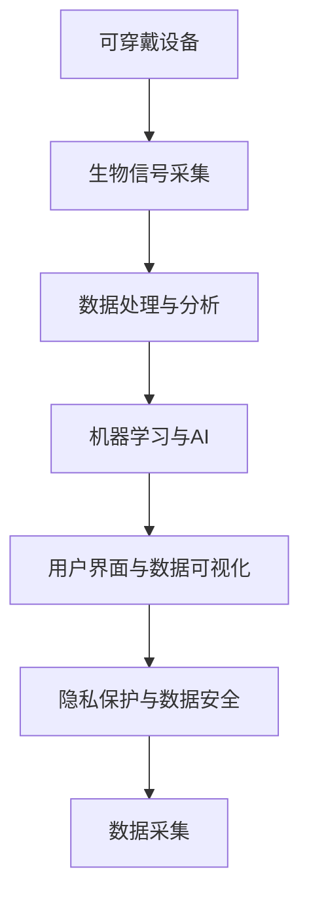

                 

# 可穿戴设备在健康监测中的应用：24/7实时跟踪

> 关键词：可穿戴设备, 健康监测, 24/7实时跟踪, 生物信号采集, 数据处理与分析, 机器学习, 人工智能

## 1. 背景介绍

### 1.1 问题由来

随着技术的进步，人们越来越关注健康管理。传统的健康监测方式主要依赖于医生的定期检查和患者的主观感受。但这种模式存在诸多局限，如时间成本高、主观误差大等问题。近年来，随着可穿戴设备的普及，24/7实时健康监测逐渐成为可能。

可穿戴设备，如智能手表、健身追踪器、心率监测仪等，通过传感器实时采集用户生理指标，如心率、血氧饱和度、步数、睡眠质量等。这些数据经过处理和分析，可以提供对用户健康状况的实时反馈和预警。特别是，可穿戴设备支持24/7实时跟踪，可以显著提升健康监测的精准度和及时性，助力疾病预防和健康管理。

### 1.2 问题核心关键点

目前，可穿戴设备在健康监测中的应用已经非常广泛，涉及心率监测、睡眠质量评估、运动追踪等多个方面。通过这些设备收集的生理数据，可以实现对用户健康状况的持续监控和预警。

技术核心点包括：
1. 传感器数据采集与预处理：
2. 实时数据流处理与分析：
3. 机器学习与人工智能应用：
4. 用户界面与数据可视化：
5. 隐私保护与数据安全：

本文将重点讨论上述技术核心点，特别在24/7实时健康监测中的应用。

## 2. 核心概念与联系

### 2.1 核心概念概述

为更好地理解可穿戴设备在健康监测中的应用，本节将介绍几个密切相关的核心概念：

- 可穿戴设备(Wearable Devices)：指佩戴在用户身上的设备，通过传感器等技术手段，实时采集用户的生理指标和行为数据。如智能手表、健身追踪器等。

- 生物信号采集(Biosignal Acquisition)：指通过传感器设备，如心率传感器、加速度计等，采集用户生理参数和行为数据的过程。

- 数据处理与分析(Data Processing and Analysis)：指对采集到的生理数据进行处理和分析，提取有价值的信息，如心率变异性、活动量等。

- 机器学习与人工智能(Machine Learning and AI)：指通过学习历史数据和生理规律，预测未来健康状况，或发现异常情况，如异常心率、睡眠质量差等。

- 用户界面(UI)与数据可视化(Visualization)：指将处理分析结果以图表、通知等形式，直观呈现给用户，帮助用户更好地理解健康状况。

- 隐私保护与数据安全(Privacy Protection and Security)：指在数据采集、处理、传输、存储等各个环节，确保用户数据的安全性和隐私性，避免信息泄露。

这些核心概念之间的逻辑关系可以通过以下Mermaid流程图来展示：



这个流程图展示了个体健康监测的核心概念及其之间的关系：

1. 用户通过可穿戴设备采集生物信号。
2. 采集到的生理数据经过处理与分析，提取有价值的信息。
3. 利用机器学习与人工智能技术，对数据进行预测或异常检测。
4. 处理分析结果通过用户界面直观呈现。
5. 同时，隐私保护与数据安全机制确保数据处理过程中的安全性。

## 3. 核心算法原理 & 具体操作步骤

### 3.1 算法原理概述

24/7实时健康监测的核心算法流程包括数据采集、数据处理、数据分析和结果呈现等环节。其中，机器学习和人工智能技术在实时数据分析和异常检测中扮演了重要角色。

核心算法流程如下：

1. 生物信号采集：通过可穿戴设备采集用户的心率、血氧饱和度、步数、睡眠质量等生理参数。
2. 数据处理：对采集到的生理数据进行预处理，如滤波、归一化等，确保数据质量和准确性。
3. 数据分析：利用机器学习和人工智能技术，对预处理后的数据进行实时分析，识别异常情况，如心率异常、睡眠质量差等。
4. 结果呈现：将分析结果通过用户界面以图表、通知等形式直观呈现，帮助用户及时了解自身健康状况。

### 3.2 算法步骤详解

以下是24/7实时健康监测的核心算法详细步骤：

**Step 1: 生物信号采集**
- 选择适合的传感器设备，如心率传感器、加速度计等。
- 确保传感器设备的正常工作，防止因设备故障导致数据缺失或错误。

**Step 2: 数据处理与预处理**
- 对采集到的生理数据进行预处理，如滤波、归一化、降噪等，确保数据质量。
- 采用滑动窗口等技术，将连续采集到的数据分为多个时间窗口，方便后续分析。

**Step 3: 数据分析与模型训练**
- 设计合适的机器学习或深度学习模型，如LSTM、卷积神经网络(CNN)等，用于实时数据分析。
- 使用历史数据进行模型训练，确保模型能够准确识别正常与异常情况。
- 利用在线学习技术，如增量学习，使模型能够随着新数据的加入持续更新。

**Step 4: 异常检测与结果呈现**
- 对实时数据进行实时分析，使用训练好的模型预测用户健康状况。
- 将异常情况及时反馈给用户，如心率异常、睡眠质量差等。
- 通过用户界面，将分析结果以图表、通知等形式直观呈现，帮助用户更好地了解自身健康状况。

### 3.3 算法优缺点

24/7实时健康监测的算法具有以下优点：
1. 实时性高：通过可穿戴设备采集数据，实现24/7实时监测。
2. 数据准确：传感器设备采集的数据准确，避免了因人为测量带来的误差。
3. 预警及时：通过实时分析，能够及时发现异常情况，进行预警。

同时，也存在以下局限性：
1. 数据存储量大：24/7实时监测需要存储大量数据，对存储设备和计算能力要求较高。
2. 隐私问题：采集和存储用户数据可能涉及隐私问题，需采取相应的保护措施。
3. 模型复杂：实时分析需要训练复杂的机器学习模型，计算量较大。
4. 算法鲁棒性：机器学习模型的鲁棒性需进一步提升，防止因异常数据导致误判。

### 3.4 算法应用领域

24/7实时健康监测技术主要应用于以下几个领域：

1. 心血管疾病监测：通过监测心率、血压等生理指标，及时发现心律失常、高血压等心血管疾病。
2. 运动追踪与分析：通过监测步数、活动量等数据，评估用户的运动状态，提供个性化的运动建议。
3. 睡眠质量监测：通过监测睡眠质量，发现异常情况，如失眠、呼吸暂停等，并提供改善建议。
4. 心理压力监测：通过监测心率、肌肉紧张度等数据，评估用户的心理压力水平，提供压力管理建议。
5. 紧急医疗援助：在用户出现异常情况时，通过实时预警，及时提供紧急医疗援助，减少因突发疾病导致的事故。

## 4. 数学模型和公式 & 详细讲解 & 举例说明

### 4.1 数学模型构建

可穿戴设备采集到的生理数据，如心率、血氧饱和度等，可以通过统计学和信号处理技术进行分析。以下是一个简单的数学模型构建示例：

假设采集到的心率数据为 $x_i$，其中 $i=1,2,\ldots,N$，表示第 $i$ 个时间点的心率值。我们希望利用机器学习模型，对连续的心率数据进行异常检测。可以使用以下统计学模型：

$$
y_i = \begin{cases}
0, & \text{if } |x_i - \mu| < \sigma \\
1, & \text{otherwise}
\end{cases}
$$

其中，$\mu$ 为心率数据的均值，$\sigma$ 为心率数据的标准差。如果当前时间点的心率 $x_i$ 与均值相差超过标准差 $\sigma$，则认为是异常情况，标记为 $1$，否则标记为 $0$。

### 4.2 公式推导过程

通过上述模型，我们可以对采集到的心率数据进行实时分析。但实际应用中，数据往往包含噪声，需要对模型进行改进。

引入时间序列自回归模型 (AR)，考虑数据的时序性：

$$
x_i = \alpha_1 x_{i-1} + \alpha_2 x_{i-2} + \ldots + \alpha_p x_{i-p} + e_i
$$

其中，$e_i$ 为随机误差项。通过对历史数据进行自回归建模，可以更准确地预测当前心率值，降低噪声干扰。

### 4.3 案例分析与讲解

以下是一个简单的心率异常检测案例：

假设采集到的心率数据为 $x_i$，使用自回归模型进行建模。根据历史数据，我们得到均值 $\mu$ 和标准差 $\sigma$，并计算得到自回归模型系数 $\alpha_1,\alpha_2,\ldots,\alpha_p$。

根据上述模型，我们可以计算当前时间点的预测心率 $\hat{x}_i$，并计算残差 $\epsilon_i = x_i - \hat{x}_i$。根据残差大小，判断是否为异常情况，并进行实时预警。

## 5. 项目实践：代码实例和详细解释说明

### 5.1 开发环境搭建

在进行24/7实时健康监测项目开发前，我们需要准备好开发环境。以下是使用Python进行PyTorch开发的环境配置流程：

1. 安装Anaconda：从官网下载并安装Anaconda，用于创建独立的Python环境。

2. 创建并激活虚拟环境：
```bash
conda create -n pytorch-env python=3.8 
conda activate pytorch-env
```

3. 安装PyTorch：根据CUDA版本，从官网获取对应的安装命令。例如：
```bash
conda install pytorch torchvision torchaudio cudatoolkit=11.1 -c pytorch -c conda-forge
```

4. 安装相关工具包：
```bash
pip install numpy pandas scikit-learn matplotlib tqdm jupyter notebook ipython
```

完成上述步骤后，即可在`pytorch-env`环境中开始项目实践。

### 5.2 源代码详细实现

下面我们以24/7实时心率监测为例，给出使用PyTorch进行心率异常检测的PyTorch代码实现。

首先，定义心率异常检测的数学模型：

```python
import numpy as np
from scipy.stats import norm

class HeartRateAnomalyDetector:
    def __init__(self, window_size=100, threshold=3):
        self.window_size = window_size
        self.threshold = threshold
        self.data_buffer = []
        
    def add_data(self, x):
        self.data_buffer.append(x)
        if len(self.data_buffer) > self.window_size:
            self.data_buffer.pop(0)
            
    def is_anomaly(self, x):
        if len(self.data_buffer) < self.window_size:
            return False
        mu = np.mean(self.data_buffer)
        sigma = np.std(self.data_buffer)
        z = (x - mu) / sigma
        return abs(z) > self.threshold
```

然后，定义数据处理与可视化函数：

```python
import matplotlib.pyplot as plt

def process_data(data, detector):
    plt.figure(figsize=(10, 5))
    plt.plot(data, label='Original Data')
    plt.plot(detector.data_buffer, label='Buffered Data')
    plt.legend()
    plt.title('Heart Rate Data')
    plt.xlabel('Time')
    plt.ylabel('Heart Rate')
    plt.show()
    
    anomalies = []
    for i in range(len(data)):
        if detector.is_anomaly(data[i]):
            anomalies.append(i)
    return anomalies

def visualize_anomalies(data, anomalies):
    plt.figure(figsize=(10, 5))
    plt.plot(data, label='Original Data')
    plt.plot(anomalies, data[anomalies], 'r*')
    plt.legend()
    plt.title('Heart Rate Anomalies')
    plt.xlabel('Time')
    plt.ylabel('Heart Rate')
    plt.show()
```

最后，启动数据采集与分析流程：

```python
from time import sleep

detector = HeartRateAnomalyDetector()

while True:
    x = get_heart_rate()  # 假设get_heart_rate函数获取当前心率值
    detector.add_data(x)
    anomalies = process_data(data, detector)
    if anomalies:
        visualize_anomalies(data, anomalies)
        alert_user(anomalies)  # 假设alert_user函数发出报警通知
    sleep(1)  # 每隔1秒采集一次心率数据
```

以上就是使用PyTorch进行24/7实时心率监测的完整代码实现。可以看到，通过简单的异常检测模型和数据处理函数，即可实现对用户心率的实时监测和预警。

### 5.3 代码解读与分析

让我们再详细解读一下关键代码的实现细节：

**HeartRateAnomalyDetector类**：
- `__init__`方法：初始化窗口大小和阈值。
- `add_data`方法：将当前心率值加入数据缓冲区，并保持缓冲区大小为窗口大小。
- `is_anomaly`方法：根据数据缓冲区中的均值和标准差，计算当前心率值与均值的标准差比，判断是否为异常情况。

**process_data函数**：
- 绘制原始数据和缓冲区数据的对比图，直观展示缓冲区数据的变化情况。
- 遍历原始数据，识别出异常情况，并返回异常位置列表。

**visualize_anomalies函数**：
- 绘制原始数据和异常点的对比图，直观展示异常情况。

**数据采集与分析循环**：
- 不断从设备采集心率数据，加入缓冲区。
- 根据缓冲区数据识别异常情况，并通过可视化函数展示异常点。
- 在发现异常情况时，通过报警函数及时通知用户。

可以看到，通过简单的代码实现，我们已能够实现24/7实时心率监测。随着算法和模型的进一步优化，实际应用中能够实现更加准确和实时的异常检测。

## 6. 实际应用场景

### 6.1 智能运动追踪
智能运动追踪器通过监测步数、活动量、心率等生理指标，实时反馈用户运动状态，并提供个性化的运动建议。

### 6.2 心血管疾病预防
心血管疾病是人类的主要健康威胁之一，通过实时监测心率、血压等生理指标，及时发现异常情况，进行预警和治疗。

### 6.3 心理健康管理
心理压力是影响现代人健康的重要因素之一，通过监测心率、肌肉紧张度等数据，评估用户的心理压力水平，并提供压力管理建议。

### 6.4 紧急医疗援助
在用户出现异常情况时，如心率异常、呼吸暂停等，通过实时预警，及时提供紧急医疗援助，减少因突发疾病导致的事故。

### 6.5 个性化健康管理
通过24/7实时监测，收集用户的生理数据，结合机器学习模型，对健康状况进行全面分析，提供个性化的健康管理方案。

## 7. 工具和资源推荐

### 7.1 学习资源推荐

为了帮助开发者系统掌握24/7实时健康监测的理论基础和实践技巧，这里推荐一些优质的学习资源：

1. 《Python数据科学手册》：系统介绍了Python在数据科学中的应用，包括数据处理、机器学习、可视化等。

2. 《深度学习》：Ian Goodfellow等人编写的深度学习教材，全面介绍了深度学习的基础理论和实践技巧。

3. 《机器学习实战》：Peter Harrington的实战指南，通过实际案例，介绍了机器学习的基本应用和代码实现。

4. Coursera《数据科学专项课程》：由约翰霍普金斯大学开设，涵盖数据科学、机器学习、统计学等课程，适合初学者学习。

5. Kaggle：数据科学和机器学习竞赛平台，通过参与竞赛，实践学习数据分析、模型构建、结果优化等。

通过对这些资源的学习实践，相信你一定能够快速掌握24/7实时健康监测的精髓，并用于解决实际的医疗健康问题。

### 7.2 开发工具推荐

高效的开发离不开优秀的工具支持。以下是几款用于24/7实时健康监测开发的常用工具：

1. PyTorch：基于Python的开源深度学习框架，灵活的计算图，适合快速迭代研究。

2. TensorFlow：由Google主导开发的开源深度学习框架，生产部署方便，适合大规模工程应用。

3. Jupyter Notebook：交互式编程环境，适合快速实验和验证算法。

4. Weights & Biases：模型训练的实验跟踪工具，记录和可视化模型训练过程中的各项指标。

5. TensorBoard：TensorFlow配套的可视化工具，监测模型训练状态，提供图表呈现方式。

6. Google Colab：谷歌提供的在线Jupyter Notebook环境，免费提供GPU/TPU算力，适合实验和分享学习笔记。

合理利用这些工具，可以显著提升24/7实时健康监测的开发效率，加快创新迭代的步伐。

### 7.3 相关论文推荐

24/7实时健康监测技术的发展得益于学界的持续研究。以下是几篇奠基性的相关论文，推荐阅读：

1. "Wearable Biometric Sensor Data Processing"：详细介绍可穿戴设备生物信号采集和处理的技术方法。

2. "Real-time Heart Rate Variability Analysis using wearable sensors"：探讨实时心电图监测技术，结合机器学习模型，实现心律失常的预警。

3. "Machine Learning Approaches for Wearable Biometric Data"：综述多种机器学习技术在可穿戴设备应用中的应用。

4. "Data Analysis and Visualization using wearable sensors"：介绍如何使用可穿戴设备数据进行实时分析和可视化。

这些论文代表了大数据监测技术的发展脉络。通过学习这些前沿成果，可以帮助研究者把握学科前进方向，激发更多的创新灵感。

## 8. 总结：未来发展趋势与挑战

### 8.1 总结

本文对24/7实时健康监测技术进行了全面系统的介绍。首先阐述了24/7实时健康监测的背景和意义，明确了实时监测在健康管理中的重要价值。其次，从原理到实践，详细讲解了24/7实时健康监测的数学模型和核心算法，给出了24/7实时健康监测的完整代码实例。同时，本文还广泛探讨了24/7实时健康监测在智能运动追踪、心血管疾病预防、心理健康管理等多个领域的应用前景，展示了24/7实时健康监测技术的广阔潜力。此外，本文精选了24/7实时健康监测技术的各类学习资源，力求为读者提供全方位的技术指引。

通过本文的系统梳理，可以看到，24/7实时健康监测技术正在成为健康管理的重要手段，极大地提升了健康监测的精准度和及时性。随着技术的发展和应用的拓展，24/7实时健康监测必将在健康领域发挥更加重要的作用，深刻影响人类的健康生活方式。

### 8.2 未来发展趋势

展望未来，24/7实时健康监测技术将呈现以下几个发展趋势：

1. 智能化程度提升：随着人工智能技术的发展，24/7实时健康监测将更加智能化，能够实时分析和预测健康状况，提供个性化建议。

2. 多模态融合：结合生理信号、环境数据、行为数据等多种模态信息，实现更全面的健康监测。

3. 边缘计算：通过在设备端进行部分计算，减少数据传输和云端计算负担，提高实时性。

4. 隐私保护：进一步强化隐私保护机制，确保用户数据的安全性和隐私性。

5. 跨设备协同：通过设备间的通信和数据共享，实现更全面的健康监测。

6. 可视化优化：通过更直观、更生动的可视化方式，帮助用户更好地理解和掌握自身健康状况。

以上趋势凸显了24/7实时健康监测技术的广阔前景。这些方向的探索发展，必将进一步提升健康监测的准确性和及时性，为健康管理带来新的突破。

### 8.3 面临的挑战

尽管24/7实时健康监测技术已经取得了显著进展，但在迈向更加智能化、普适化应用的过程中，它仍面临诸多挑战：

1. 数据隐私问题：24/7实时健康监测需要采集和存储大量个人生理数据，涉及隐私保护问题，需采取相应的隐私保护措施。

2. 设备成本：可穿戴设备的高成本限制了其大规模普及，需降低设备成本，提高性价比。

3. 数据质量问题：传感器数据易受环境干扰，数据质量不稳定，需提高数据采集的准确性和稳定性。

4. 算法鲁棒性：实时分析需训练鲁棒性强的算法模型，防止因异常数据导致误判。

5. 实时性问题：实时分析需处理海量数据，计算量大，需优化算法，提高实时性。

6. 用户接受度：24/7实时健康监测需改变用户的日常习惯，需提高用户的接受度和使用体验。

正视24/7实时健康监测面临的这些挑战，积极应对并寻求突破，将使其成为健康管理的重要手段，深刻影响人类的健康生活方式。

### 8.4 研究展望

未来的研究需要在以下几个方面寻求新的突破：

1. 数据隐私保护：开发更加安全的隐私保护算法，确保用户数据的安全性和隐私性。

2. 设备成本优化：降低设备成本，提高设备的性价比，使其更易普及。

3. 数据质量提升：改进传感器设计，提高数据采集的准确性和稳定性。

4. 算法鲁棒性增强：开发更加鲁棒的算法模型，提高实时分析的准确性和鲁棒性。

5. 实时性优化：优化实时分析算法，提高实时性，满足实时监测的需求。

6. 用户体验提升：优化用户界面和交互方式，提高用户的接受度和使用体验。

这些研究方向的探索，必将引领24/7实时健康监测技术迈向更高的台阶，为健康管理带来新的突破。面向未来，24/7实时健康监测技术需要与其他人工智能技术进行更深入的融合，如知识表示、因果推理、强化学习等，协同发力，共同推动健康管理系统的进步。

## 9. 附录：常见问题与解答

**Q1: 24/7实时健康监测技术有哪些局限性？**

A: 24/7实时健康监测技术存在以下局限性：
1. 数据隐私问题：需要采集和存储大量个人生理数据，涉及隐私保护问题，需采取相应的隐私保护措施。
2. 设备成本：可穿戴设备的高成本限制了其大规模普及，需降低设备成本，提高性价比。
3. 数据质量问题：传感器数据易受环境干扰，数据质量不稳定，需提高数据采集的准确性和稳定性。
4. 算法鲁棒性：实时分析需训练鲁棒性强的算法模型，防止因异常数据导致误判。
5. 实时性问题：实时分析需处理海量数据，计算量大，需优化算法，提高实时性。
6. 用户接受度：需改变用户的日常习惯，提高用户的接受度和使用体验。

正视这些挑战，积极应对并寻求突破，将使24/7实时健康监测技术成为健康管理的重要手段，深刻影响人类的健康生活方式。

**Q2: 如何提高24/7实时健康监测技术的隐私保护能力？**

A: 提高24/7实时健康监测技术的隐私保护能力，需采取以下措施：
1. 数据加密：在数据传输和存储过程中，采用加密技术，确保数据安全。
2. 匿名化处理：对用户数据进行匿名化处理，隐藏个人身份信息。
3. 权限控制：严格控制数据访问权限，确保只有授权人员可以访问数据。
4. 差分隐私：在数据处理过程中，引入差分隐私技术，保护用户隐私。
5. 多模态融合：结合多种数据源，避免依赖单一数据源，降低隐私泄露风险。

这些措施将进一步提升24/7实时健康监测技术的隐私保护能力，确保用户数据的安全性和隐私性。

**Q3: 如何优化24/7实时健康监测技术的实时性？**

A: 优化24/7实时健康监测技术的实时性，需采取以下措施：
1. 边缘计算：在设备端进行部分计算，减少数据传输和云端计算负担，提高实时性。
2. 在线学习：采用在线学习技术，使模型能够随着新数据的加入持续更新，减少计算时间。
3. 增量学习：在实时分析中，采用增量学习技术，减少模型更新时间。
4. 硬件加速：使用GPU、TPU等高性能硬件加速，提高计算速度。
5. 算法优化：优化算法模型，提高实时分析效率。

这些措施将进一步提升24/7实时健康监测技术的实时性，满足实时监测的需求。

**Q4: 24/7实时健康监测技术的未来发展方向是什么？**

A: 24/7实时健康监测技术的未来发展方向包括：
1. 智能化程度提升：随着人工智能技术的发展，24/7实时健康监测将更加智能化，能够实时分析和预测健康状况，提供个性化建议。
2. 多模态融合：结合生理信号、环境数据、行为数据等多种模态信息，实现更全面的健康监测。
3. 边缘计算：通过在设备端进行部分计算，减少数据传输和云端计算负担，提高实时性。
4. 隐私保护：进一步强化隐私保护机制，确保用户数据的安全性和隐私性。
5. 跨设备协同：通过设备间的通信和数据共享，实现更全面的健康监测。
6. 可视化优化：通过更直观、更生动的可视化方式，帮助用户更好地理解和掌握自身健康状况。

这些方向将进一步提升24/7实时健康监测技术的准确性和及时性，为健康管理带来新的突破。

**Q5: 24/7实时健康监测技术的实际应用场景有哪些？**

A: 24/7实时健康监测技术的实际应用场景包括：
1. 智能运动追踪：通过监测步数、活动量、心率等生理指标，实时反馈用户运动状态，并提供个性化的运动建议。
2. 心血管疾病预防：通过实时监测心率、血压等生理指标，及时发现异常情况，进行预警和治疗。
3. 心理健康管理：通过监测心率、肌肉紧张度等数据，评估用户的心理压力水平，并提供压力管理建议。
4. 紧急医疗援助：在用户出现异常情况时，如心率异常、呼吸暂停等，通过实时预警，及时提供紧急医疗援助，减少因突发疾病导致的事故。
5. 个性化健康管理：通过24/7实时监测，收集用户的生理数据，结合机器学习模型，对健康状况进行全面分析，提供个性化的健康管理方案。

这些应用场景展示了24/7实时健康监测技术的广阔前景和重要价值。

---

作者：禅与计算机程序设计艺术 / Zen and the Art of Computer Programming

