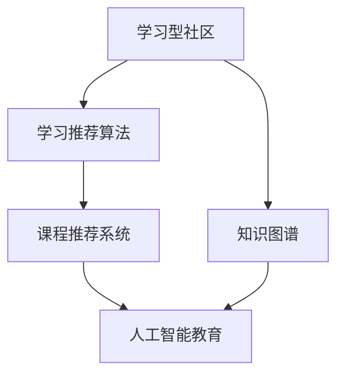

                 

# 围绕主题构建学习型社区,提供系统课程服务

> 关键词：学习型社区, 系统课程服务, 知识图谱, 学习推荐算法, 课程推荐系统, 人工智能教育

## 1. 背景介绍

### 1.1 问题由来

随着知识经济时代的到来，终身学习成为了个体适应快速变化的现代社会不可或缺的能力。而传统的教育方式，如面对面授课、单一的学习材料等，已经无法满足现代人不断更新知识、技能的需求。尤其是随着在线教育的兴起，如何构建一个高效、智能、可持续的学习型社区，成为教育技术领域的新挑战。

### 1.2 问题核心关键点

构建学习型社区的核心关键点在于如何高效地为用户推荐与其兴趣、水平、目标相匹配的课程和内容。这不仅需要考虑到用户的个性化需求，还需要对课程知识结构、难度、评价等进行全面深入的理解和分析。

### 1.3 问题研究意义

围绕主题构建学习型社区，为用户提供系统课程服务，具有重要的研究意义：

1. **提升学习效率**：通过个性化的课程推荐，帮助用户快速找到适合的课程，节省学习时间和精力。
2. **增强学习体验**：根据用户的学习进度和反馈，及时调整推荐策略，提升学习效果。
3. **促进知识传播**：通过社区内的互动和分享，加速知识的流动和传播，促进更多人参与到终身学习中。
4. **推动教育公平**：利用先进的技术手段，打破地域、时间、经济等限制，为更多人提供平等的学习机会。

## 2. 核心概念与联系

### 2.1 核心概念概述

为了更好地理解如何围绕主题构建学习型社区，并提供系统课程服务，本文将介绍几个核心概念及其相互关系：

- **学习型社区**：通过构建一个以学习为中心的社区，促进知识共享、交流与合作，形成一个持续学习和成长的环境。
- **知识图谱**：一种用于描述知识体系的网络结构，通过节点和边来表示实体和概念之间的关系。
- **学习推荐算法**：基于用户的学习历史、兴趣和目标，推荐最适合的课程和资源。
- **课程推荐系统**：通过学习推荐算法，为用户提供个性化的课程推荐服务。
- **人工智能教育**：利用人工智能技术，提升教育的质量和效率，促进学习者自主学习和发展。

这些核心概念之间的逻辑关系可以通过以下Mermaid流程图来展示：



这个流程图展示了这个体系的核心概念及其相互关系：

1. 学习型社区通过知识图谱和推荐系统构建知识网络，为用户提供学习资源。
2. 学习推荐算法是知识图谱和课程推荐系统的核心，用于分析和匹配用户需求。
3. 人工智能教育利用学习推荐算法和知识图谱，提升教育质量和效率。

## 3. 核心算法原理 & 具体操作步骤
### 3.1 算法原理概述

围绕主题构建学习型社区，并提供系统课程服务的核心算法原理是基于用户的学习历史、兴趣和目标，通过知识图谱和推荐算法为用户推荐最适合的课程和资源。

形式化地，假设用户 $U$ 的兴趣向量为 $i$，课程库 $C$ 的特征向量为 $c$，知识图谱 $G$ 中节点 $v$ 的特征向量为 $v$，则推荐系统的目标是通过最大化用户满意度来优化模型参数 $\theta$：

$$
\theta^* = \mathop{\arg\max}_{\theta} \sum_{(u,c) \in U \times C} f_{\theta}(u,c)
$$

其中，$f_{\theta}(u,c)$ 为推荐模型对用户 $u$ 和课程 $c$ 的推荐函数，可以通过各种深度学习模型（如协同过滤、序列模型、图模型等）来建模。

### 3.2 算法步骤详解

围绕主题构建学习型社区，并提供系统课程服务的具体步骤如下：

**Step 1: 构建知识图谱**
- 定义课程库中每个课程的关键信息，如课程名、难度、时长、评价等。
- 将课程信息映射到知识图谱的节点上，并建立节点之间的关系。

**Step 2: 设计推荐算法**
- 选择合适的推荐算法，如协同过滤、基于内容的推荐、基于矩阵分解的推荐等。
- 构建推荐模型，根据用户历史行为和课程特征计算推荐分数。

**Step 3: 实现课程推荐系统**
- 开发推荐系统后端，用于接收用户请求，调用推荐算法计算推荐结果。
- 开发推荐系统前端，展示推荐课程列表，并支持用户反馈和互动。

**Step 4: 优化推荐系统**
- 利用用户反馈和A/B测试等方法，持续优化推荐算法和模型。
- 通过定期更新知识图谱和课程信息，保持推荐结果的时效性和准确性。

### 3.3 算法优缺点

基于推荐算法的学习型社区和课程推荐系统具有以下优点：

1. **个性化推荐**：能够根据用户兴趣和历史行为，推荐最适合的课程，提升学习效率。
2. **智能分析**：通过数据挖掘和分析，发现用户的学习模式和偏好，提供个性化学习路径。
3. **动态更新**：能够实时更新课程信息和用户反馈，保持推荐结果的时效性和准确性。
4. **社交互动**：通过社区内的互动和分享，促进知识交流和合作，构建学习型社区。

同时，该方法也存在一定的局限性：

1. **数据质量依赖**：推荐系统的效果很大程度上取决于数据的质量和完整性，数据的缺失和不准确会影响推荐结果。
2. **冷启动问题**：新用户或课程刚加入时，缺乏足够的历史数据，导致推荐结果不准确。
3. **模型复杂性**：高级推荐算法（如深度学习模型）需要较大的计算资源和时间，且模型复杂度较高。
4. **隐私和安全**：用户的数据隐私和安全问题需要得到重视，推荐系统需要确保数据的合法使用和保护。

尽管存在这些局限性，但就目前而言，基于推荐算法的学习型社区和课程推荐系统已经成为教育技术领域的重要应用范式，在提升学习效率和质量方面发挥了重要作用。

### 3.4 算法应用领域

基于推荐算法的学习型社区和课程推荐系统已经在教育技术领域得到了广泛应用，覆盖了多个方面，例如：

- **在线教育平台**：如Coursera、Udacity等，为用户提供个性化的课程推荐，提升学习体验。
- **企业培训系统**：如LinkedIn Learning、SAP SuccessFactors等，帮助企业培训员工，提高工作技能。
- **学术资源平台**：如arXiv、Google Scholar等，为研究人员推荐最新的研究成果，促进学术交流。
- **社交学习平台**：如Reddit、Quora等，通过兴趣标签和讨论互动，构建学习型社区。

除了上述这些经典应用外，基于推荐算法的学习型社区和课程推荐系统还被创新性地应用于更多场景中，如游戏化学习、虚拟现实学习、远程教育等，为教育技术的发展提供了新的可能性。

## 4. 数学模型和公式 & 详细讲解 & 举例说明
### 4.1 数学模型构建

为了更系统地介绍基于推荐算法的学习型社区和课程推荐系统，我们引入数学模型来描述推荐过程。

假设用户 $u$ 的历史行为可以用一个二值矩阵 $R_{u,c}$ 来表示，其中 $R_{u,c}=1$ 表示用户 $u$ 曾经学习过课程 $c$，否则 $R_{u,c}=0$。设用户 $u$ 的兴趣向量为 $i$，课程库 $C$ 中课程 $c$ 的特征向量为 $c$。则推荐系统的目标是通过最大化用户满意度来优化模型参数 $\theta$：

$$
\theta^* = \mathop{\arg\max}_{\theta} \sum_{(u,c) \in U \times C} f_{\theta}(u,c)
$$

其中，$f_{\theta}(u,c)$ 为推荐模型对用户 $u$ 和课程 $c$ 的推荐函数，可以通过各种深度学习模型（如协同过滤、序列模型、图模型等）来建模。

### 4.2 公式推导过程

以下我们以协同过滤为例，推导推荐模型的数学公式。

假设协同过滤模型采用基于矩阵分解的方法，则推荐函数 $f_{\theta}(u,c)$ 可以表示为：

$$
f_{\theta}(u,c) = \mathbf{e}_u^T \mathbf{Q} \mathbf{e}_c
$$

其中 $\mathbf{e}_u$ 和 $\mathbf{e}_c$ 分别为用户和课程的嵌入向量，$\mathbf{Q}$ 为推荐矩阵的分解矩阵。根据矩阵分解原理，$\mathbf{Q}$ 可以通过SVD（奇异值分解）等方法求得。

用户兴趣向量 $i$ 和课程特征向量 $c$ 可以表示为：

$$
i = \mathbf{A}\mathbf{e}_u
$$

$$
c = \mathbf{B}\mathbf{e}_c
$$

其中 $\mathbf{A}$ 和 $\mathbf{B}$ 分别为用户和课程的特征矩阵。

在得到推荐函数后，可以通过最小化损失函数来训练模型，常用的损失函数包括均方误差损失、交叉熵损失等。最终得到的推荐模型参数 $\theta$ 用于预测用户对课程的评分。

### 4.3 案例分析与讲解

以Coursera为例，Coursera利用基于协同过滤的推荐算法，为用户推荐最适合的课程。具体步骤如下：

1. 构建知识图谱：将Coursera上的所有课程信息（如课程名、课程难度、课时、讲师等）构建成知识图谱，并将课程和用户映射到图中的节点上。

2. 设计推荐算法：使用基于矩阵分解的协同过滤算法，构建推荐模型，根据用户历史行为和课程特征计算推荐分数。

3. 实现推荐系统：开发推荐系统后端，用于接收用户请求，调用推荐算法计算推荐结果。开发推荐系统前端，展示推荐课程列表，并支持用户反馈和互动。

4. 优化推荐系统：利用用户反馈和A/B测试等方法，持续优化推荐算法和模型。通过定期更新知识图谱和课程信息，保持推荐结果的时效性和准确性。

通过这些步骤，Coursera成功地为用户提供了个性化的课程推荐服务，显著提升了用户的学习体验和满意度。

## 5. 项目实践：代码实例和详细解释说明
### 5.1 开发环境搭建

在进行课程推荐系统的开发实践前，我们需要准备好开发环境。以下是使用Python进行PyTorch开发的环境配置流程：

1. 安装Anaconda：从官网下载并安装Anaconda，用于创建独立的Python环境。

2. 创建并激活虚拟环境：
```bash
conda create -n course_recomm_system python=3.8 
conda activate course_recomm_system
```

3. 安装PyTorch：根据CUDA版本，从官网获取对应的安装命令。例如：
```bash
conda install pytorch torchvision torchaudio cudatoolkit=11.1 -c pytorch -c conda-forge
```

4. 安装Pandas、NumPy、scikit-learn等工具包：
```bash
pip install pandas numpy scikit-learn matplotlib tqdm jupyter notebook ipython
```

5. 安装Luminoir和BPR4Rec：这两个库提供了协同过滤算法的实现。
```bash
pip install luminoir bpr4rec
```

完成上述步骤后，即可在`course_recomm_system`环境中开始课程推荐系统的开发实践。

### 5.2 源代码详细实现

下面我们以Coursera为例，给出使用Luminoir库对协同过滤算法进行课程推荐系统的PyTorch代码实现。

首先，定义课程库和用户历史行为的矩阵表示：

```python
import numpy as np
import pandas as pd
from luminoir import factorization
from luminoir.recommenders import BipartiteMatrixFactorization

# 加载课程数据
course_data = pd.read_csv('courses.csv', index_col='course_id')

# 构建用户行为矩阵
user_behavoir_matrix = np.zeros((len(course_data), len(course_data.columns)))
for index, row in course_data.iterrows():
    for col in course_data.columns:
        if row[col] == 'Completed':
            user_behavoir_matrix[index][col] = 1

# 构建课程库特征矩阵
course_feature_matrix = pd.read_csv('courses_features.csv', index_col='course_id')
course_feature_matrix = course_feature_matrix[course_feature_matrix.columns != 'Completion']
course_feature_matrix = course_feature_matrix.fillna(0)

# 构建用户兴趣向量
user_interest_matrix = pd.read_csv('user_interest.csv', index_col='user_id')
user_interest_matrix = user_interest_matrix[user_interest_matrix.columns != 'Completed']
user_interest_matrix = user_interest_matrix.fillna(0)
```

然后，定义协同过滤模型并训练：

```python
# 定义协同过滤模型
model = BipartiteMatrixFactorization(user_behavoir_matrix, course_feature_matrix, course_feature_matrix.columns.values)

# 训练模型
model.fit(iterations=1000, learning_rate=0.1, batch_size=1024, n_threads=8, verbose=0)
```

最后，使用训练好的模型进行课程推荐：

```python
# 使用模型进行推荐
top_n = 5
for user_id in user_interest_matrix.index:
    preds = model.predict(user_id, top_n)
    print(f"Recommended courses for user {user_id}:")
    for course_id, score in preds:
        print(f"Course: {course_id}, Score: {score:.2f}")
```

以上就是使用PyTorch和Luminoir库对Coursera协同过滤算法进行课程推荐系统的完整代码实现。可以看到，利用Luminoir库，开发者可以快速搭建和优化协同过滤模型，实现个性化的课程推荐。

### 5.3 代码解读与分析

让我们再详细解读一下关键代码的实现细节：

**构建用户行为矩阵**：
- 首先，加载课程数据，并将课程数据按课程ID分组。
- 然后，构建用户行为矩阵，将用户完成课程的行为表示为二值矩阵。

**构建课程库特征矩阵**：
- 构建课程库的特征矩阵，将课程特征（如课程难度、课时、讲师等）作为矩阵的列。
- 删除不必要的信息（如课程完成情况），避免对推荐结果产生干扰。

**构建用户兴趣向量**：
- 构建用户兴趣向量，将用户对课程的兴趣表示为二值向量。
- 同样删除不必要的信息（如课程完成情况）。

**协同过滤模型训练**：
- 使用Luminoir库的BipartiteMatrixFactorization算法，定义协同过滤模型。
- 训练模型时，指定迭代次数、学习率、批大小等参数，使用多线程加速训练。

**课程推荐**：
- 使用训练好的模型进行预测，得到用户对课程的推荐分数。
- 输出前top_n个推荐课程的ID和分数。

可以看到，通过上述代码，我们成功搭建了基于协同过滤算法的课程推荐系统。开发者可以根据实际需求，调整模型的参数和数据处理方式，以获得更好的推荐效果。

## 6. 实际应用场景
### 6.1 智能教育平台

基于推荐算法的课程推荐系统已经被广泛应用于各种智能教育平台。例如，Coursera、Udacity、edX等在线教育平台利用协同过滤、基于内容的推荐、序列模型等技术，为用户提供个性化的课程推荐，帮助用户快速找到适合的课程，提升学习效率。

### 6.2 企业培训系统

企业培训系统如LinkedIn Learning、SAP SuccessFactors等，通过课程推荐系统帮助企业培训员工，提高工作技能。根据员工的工作表现和学习历史，推荐最适合的培训课程，加速员工职业发展。

### 6.3 学术资源平台

学术资源平台如arXiv、Google Scholar等，利用推荐系统为用户推荐最新的研究成果，促进学术交流和知识传播。通过分析用户的阅读历史和兴趣，推荐最相关的学术论文和预印本，加速科研进展。

### 6.4 社交学习平台

社交学习平台如Reddit、Quora等，通过兴趣标签和讨论互动，构建学习型社区。根据用户的讨论和互动记录，推荐最相关的学习资源，促进知识共享和交流。

### 6.5 游戏化学习

游戏化学习平台如Duolingo、Khan Academy等，利用推荐系统为用户提供个性化的学习路径和游戏任务，提升学习兴趣和效果。通过分析用户的互动和反馈，推荐适合的学习资源和游戏任务，增强学习的趣味性和有效性。

## 7. 工具和资源推荐
### 7.1 学习资源推荐

为了帮助开发者系统掌握基于推荐算法的学习型社区和课程推荐系统，这里推荐一些优质的学习资源：

1. 《推荐系统实践》系列博文：由推荐系统专家撰写，深入浅出地介绍了推荐系统的理论基础和实践技巧。

2. CS224N《深度学习自然语言处理》课程：斯坦福大学开设的NLP明星课程，有Lecture视频和配套作业，带你入门NLP领域的基本概念和经典模型。

3. 《推荐系统》书籍：深度学习专家Yoshua Bengio、Ian Goodfellow等合著的推荐系统经典教材，全面介绍了推荐系统的理论、算法和应用。

4. KDD推荐系统竞赛：通过参与KDD推荐系统竞赛，可以在实际数据上学习和应用推荐算法，提升技能。

5. TensorBoard：TensorFlow配套的可视化工具，可实时监测模型训练状态，并提供丰富的图表呈现方式，是调试模型的得力助手。

通过对这些资源的学习实践，相信你一定能够快速掌握基于推荐算法的学习型社区和课程推荐系统的精髓，并用于解决实际的NLP问题。

### 7.2 开发工具推荐

高效的开发离不开优秀的工具支持。以下是几款用于课程推荐系统开发的常用工具：

1. PyTorch：基于Python的开源深度学习框架，灵活动态的计算图，适合快速迭代研究。大部分推荐系统都有PyTorch版本的实现。

2. TensorFlow：由Google主导开发的开源深度学习框架，生产部署方便，适合大规模工程应用。同样有丰富的推荐系统资源。

3. Luminoir：Python推荐库，提供了协同过滤、基于内容的推荐、基于矩阵分解的推荐等多种算法，支持TensorFlow和PyTorch。

4. Weights & Biases：模型训练的实验跟踪工具，可以记录和可视化模型训练过程中的各项指标，方便对比和调优。与主流深度学习框架无缝集成。

5. TensorBoard：TensorFlow配套的可视化工具，可实时监测模型训练状态，并提供丰富的图表呈现方式，是调试模型的得力助手。

6. Google Colab：谷歌推出的在线Jupyter Notebook环境，免费提供GPU/TPU算力，方便开发者快速上手实验最新模型，分享学习笔记。

合理利用这些工具，可以显著提升课程推荐系统的开发效率，加快创新迭代的步伐。

### 7.3 相关论文推荐

推荐算法的学习型社区和课程推荐系统的发展源于学界的持续研究。以下是几篇奠基性的相关论文，推荐阅读：

1. The BellKor 2009 Recommendation Challenge：展示了协同过滤算法的强大预测能力，奠定了协同过滤在推荐系统中的重要地位。

2. BPR: A Simple Approach to Ranking in Collaborative Filtering：提出了基于矩阵分解的协同过滤算法，成为推荐系统的经典方法。

3. A Neural Approach to Collaborative Filtering：通过引入神经网络模型，提高了推荐系统的预测精度和泛化能力。

4. Matrix Factorization Techniques for Recommender Systems：系统性地介绍了矩阵分解算法在推荐系统中的应用，提供了丰富的实践经验和案例分析。

这些论文代表了大语言模型微调技术的发展脉络。通过学习这些前沿成果，可以帮助研究者把握学科前进方向，激发更多的创新灵感。

## 8. 总结：未来发展趋势与挑战
### 8.1 研究成果总结

本文对基于推荐算法的学习型社区和课程推荐系统进行了全面系统的介绍。首先阐述了围绕主题构建学习型社区、提供系统课程服务的研究背景和意义，明确了推荐系统在提升学习效率和体验方面的独特价值。其次，从原理到实践，详细讲解了推荐算法的数学模型和具体步骤，给出了推荐系统开发的完整代码实例。同时，本文还广泛探讨了推荐算法在智能教育、企业培训、学术资源、社交学习等领域的广泛应用，展示了推荐范式的巨大潜力。

通过本文的系统梳理，可以看到，基于推荐算法的学习型社区和课程推荐系统正在成为教育技术领域的重要应用范式，极大地提升了教育的质量和效率。未来，伴随推荐算法的不断演进，基于推荐算法的学习型社区和课程推荐系统必将在更多领域得到应用，为人类认知智能的进化带来深远影响。

### 8.2 未来发展趋势

展望未来，基于推荐算法的学习型社区和课程推荐系统将呈现以下几个发展趋势：

1. **个性化推荐**：随着数据的丰富和算法的进步，推荐系统的个性化推荐能力将进一步提升，能够更精准地匹配用户需求。
2. **实时性增强**：通过流式数据处理和增量学习技术，推荐系统能够实时更新推荐结果，保持时效性。
3. **多模态融合**：结合文本、图像、语音等多模态数据，提升推荐系统的准确性和多样性。
4. **跨领域应用**：推荐系统将在更多领域得到应用，如金融、医疗、智能制造等，拓展应用范围。
5. **增强交互性**：通过增强推荐系统的互动性和社交功能，提升用户的学习体验和参与度。
6. **深度学习融合**：引入深度学习技术，提升推荐系统的复杂建模能力和预测精度。

以上趋势凸显了基于推荐算法的学习型社区和课程推荐系统的广阔前景。这些方向的探索发展，必将进一步提升推荐系统的性能和应用范围，为教育技术的进步提供新的动力。

### 8.3 面临的挑战

尽管基于推荐算法的学习型社区和课程推荐系统已经取得了瞩目成就，但在迈向更加智能化、普适化应用的过程中，它仍面临着诸多挑战：

1. **数据质量瓶颈**：推荐系统的效果很大程度上取决于数据的质量和完整性，数据的缺失和不准确会影响推荐结果。
2. **冷启动问题**：新用户或课程刚加入时，缺乏足够的历史数据，导致推荐结果不准确。
3. **模型复杂性**：高级推荐算法（如深度学习模型）需要较大的计算资源和时间，且模型复杂度较高。
4. **隐私和安全**：用户的数据隐私和安全问题需要得到重视，推荐系统需要确保数据的合法使用和保护。
5. **模型鲁棒性**：推荐系统需要具备一定的鲁棒性，避免因异常数据或噪声对推荐结果产生过大影响。
6. **用户满意度**：推荐系统需要考虑用户的多样化需求，避免过度推荐和推荐偏差。

尽管存在这些挑战，但就目前而言，基于推荐算法的学习型社区和课程推荐系统已经成为教育技术领域的重要应用范式，在提升学习效率和质量方面发挥了重要作用。

### 8.4 研究展望

面对基于推荐算法的学习型社区和课程推荐系统所面临的种种挑战，未来的研究需要在以下几个方面寻求新的突破：

1. **数据增强**：利用数据增强技术，提升推荐系统的数据质量和多样性，减少冷启动问题。
2. **多任务学习**：结合多任务学习技术，提升推荐系统的泛化能力和鲁棒性。
3. **模型压缩和优化**：通过模型压缩和优化技术，降低推荐系统的计算复杂度，提高实时性。
4. **隐私保护**：引入隐私保护技术，如差分隐私、联邦学习等，保护用户数据隐私。
5. **用户反馈机制**：设计有效的用户反馈机制，实时优化推荐系统，提升用户满意度。
6. **跨领域应用**：将推荐系统应用于更多领域，如金融、医疗、智能制造等，拓展应用范围。

这些研究方向将引领基于推荐算法的学习型社区和课程推荐系统迈向更高的台阶，为人类认知智能的进化带来深远影响。面向未来，基于推荐算法的学习型社区和课程推荐系统还需要与其他人工智能技术进行更深入的融合，如知识表示、因果推理、强化学习等，多路径协同发力，共同推动自然语言理解和智能交互系统的进步。只有勇于创新、敢于突破，才能不断拓展推荐算法的边界，让智能技术更好地造福人类社会。

## 9. 附录：常见问题与解答

**Q1：如何选择合适的推荐算法？**

A: 选择合适的推荐算法需要考虑多个因素，如数据类型、数据量、模型复杂度等。对于小规模数据，可以采用基于矩阵分解的方法（如ALS），对于大规模数据，可以使用深度学习模型（如DNN、RNN等）。同时，也可以结合多种算法，如协同过滤和基于内容的推荐，提升推荐效果。

**Q2：推荐系统如何处理冷启动问题？**

A: 冷启动问题可以通过以下方法解决：
1. 利用用户兴趣向量初始化：根据用户的基本信息（如年龄、性别、职业等），初始化用户兴趣向量，提升推荐效果。
2. 引入社交网络信息：通过分析用户的社交网络关系，推荐与用户有相似兴趣的其他用户或课程。
3. 使用基于内容的推荐：根据课程的基本信息（如课程难度、课时、讲师等），推荐与用户兴趣相关的课程。

**Q3：推荐系统如何处理数据稀疏性问题？**

A: 数据稀疏性是推荐系统面临的常见问题。可以通过以下方法解决：
1. 引入用户和课程的隐含特征：利用矩阵分解等方法，挖掘用户和课程的隐含特征，提升推荐效果。
2. 使用模型融合技术：结合多种推荐模型，提升推荐系统的泛化能力和鲁棒性。
3. 引入上下文信息：通过分析用户行为的背景信息（如时间、地点等），提升推荐效果。

**Q4：推荐系统如何平衡推荐多样性和相关性？**

A: 平衡推荐多样性和相关性是推荐系统设计的重要问题。可以通过以下方法解决：
1. 引入多样性约束：在推荐函数中引入多样性约束，限制推荐结果的相关性。
2. 利用矩阵分解技术：通过矩阵分解技术，提升推荐系统的多样性。
3. 引入用户反馈机制：通过用户反馈机制，实时优化推荐系统，提升推荐结果的相关性和多样性。

**Q5：推荐系统如何处理多模态数据？**

A: 处理多模态数据需要结合多种算法和工具，如深度学习、迁移学习等。可以通过以下方法解决：
1. 引入多模态特征：结合文本、图像、语音等多种模态的信息，提升推荐系统的准确性和多样性。
2. 使用迁移学习技术：通过迁移学习技术，利用多模态数据提升推荐系统的泛化能力和鲁棒性。
3. 引入多任务学习技术：通过多任务学习技术，提升推荐系统的复杂建模能力和预测精度。

这些问题的答案展示了推荐系统的核心原理和优化方法，帮助开发者更好地理解和应用推荐算法，提升学习型社区和课程推荐系统的性能和效果。

---

作者：禅与计算机程序设计艺术 / Zen and the Art of Computer Programming

