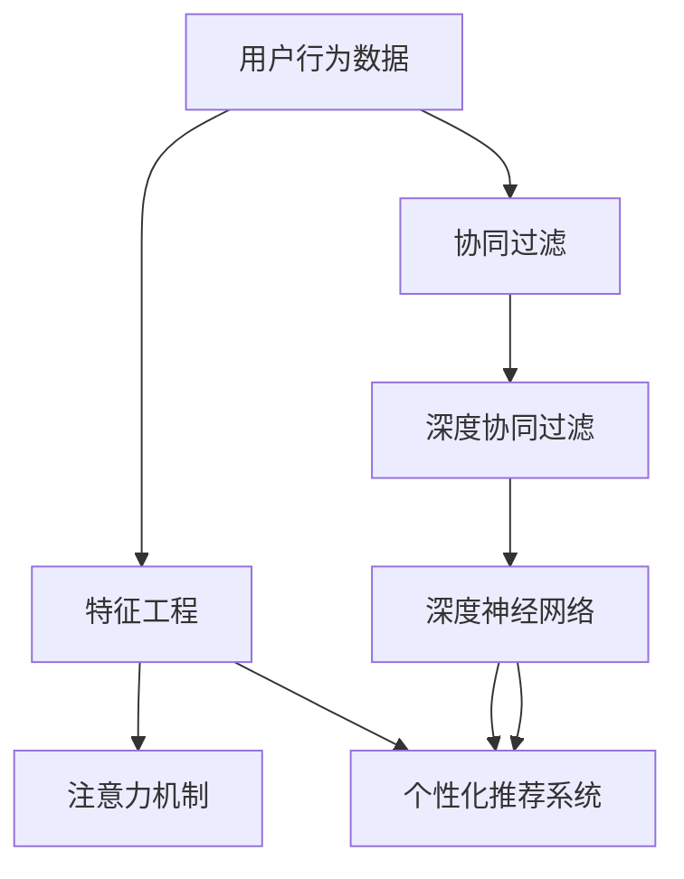

                 

# 在线音乐平台的注意力争夺战略

> 关键词：注意力机制,在线音乐平台,用户行为分析,个性化推荐系统,深度学习

## 1. 背景介绍

### 1.1 问题由来

在数字化转型的浪潮下，在线音乐平台如雨后春笋般涌现，其中不乏如Spotify、Apple Music、QQ音乐、网易云音乐等大型玩家。面对激烈的竞争环境，各大平台都在争相推出各自独特的用户吸引策略，以期提升用户黏性，抢占市场份额。其中，注意力机制（Attention Mechanism）成为了许多在线音乐平台争夺用户注意力的重要工具。

注意力机制是一种模拟人眼视觉注意机制的深度学习技术，被广泛应用于自然语言处理（NLP）、计算机视觉（CV）、推荐系统等领域，并取得了显著的效果。在在线音乐平台中，注意力机制主要用于个性化推荐系统，通过对用户行为的深度分析，精准地为用户推荐音乐，满足用户的个性化需求。

### 1.2 问题核心关键点

在线音乐平台使用注意力机制的关键在于：
- 用户行为数据的收集和分析：平台需要收集用户的听歌历史、收藏、点赞、评论、分享等行为数据，并建立有效的用户画像。
- 音乐特征的提取与表示：如何有效地从音乐本身的元数据（如歌词、演唱者、专辑等）中提取特征，并将其转化为模型可以理解的数值表示。
- 注意力模型的设计与应用：选择合适的注意力模型和算法，并将其应用于个性化推荐系统的不同模块中。
- 推荐结果的评估与优化：通过A/B测试、用户反馈等手段评估推荐结果的质量，并不断优化模型和算法。

这些问题贯穿于从模型设计到实际应用的全过程，是实现个性化推荐系统的关键。

## 2. 核心概念与联系

### 2.1 核心概念概述

为更好地理解注意力机制在在线音乐平台中的应用，本节将介绍几个核心概念：

- **注意力机制**：一种模拟人类注意力分配的深度学习技术，通过动态地关注输入序列中的不同部分，提高模型的表达能力和泛化性能。
- **深度学习**：一种基于多层神经网络的机器学习技术，通过层次化的特征提取和抽象，实现对复杂数据的建模和预测。
- **个性化推荐系统**：根据用户的历史行为数据，为用户提供个性化的内容推荐，提升用户体验和平台黏性。
- **协同过滤（Collaborative Filtering, CF）**：通过分析用户行为数据和物品属性，推荐与用户偏好相似的物品。协同过滤包括基于用户的协同过滤（User-based CF）和基于物品的协同过滤（Item-based CF）。
- **深度协同过滤**：利用深度学习技术，将协同过滤模型嵌入到神经网络中，提升推荐系统的性能和泛化能力。
- **神经网络（Neural Network, NN）**：一种具有多个层次的非线性模型，能够自动学习特征和规律，适用于复杂的数据建模和预测。

这些核心概念之间的逻辑关系可以通过以下Mermaid流程图来展示：



这个流程图展示了从用户行为数据到个性化推荐系统的整体流程：

1. 平台收集用户行为数据。
2. 特征工程模块提取音乐特征。
3. 协同过滤模块分析用户行为，初步筛选推荐物品。
4. 注意力机制模块动态调整推荐权重，提高推荐效果。
5. 深度协同过滤模块进一步优化协同过滤算法。
6. 深度神经网络模块对推荐结果进行二次学习，提升预测精度。
7. 个性化推荐系统将最终推荐结果呈现给用户。

这些概念共同构成了在线音乐平台的注意力机制框架，使其能够高效、精准地为用户提供个性化的音乐推荐。

## 3. 核心算法原理 & 具体操作步骤

### 3.1 算法原理概述

在线音乐平台使用的注意力机制通常基于深度神经网络模型。这类模型通常包含多个注意力层，每个注意力层负责对不同特征进行加权聚合，从而赋予每个特征一个动态的权重。这些权重反映了不同特征对最终推荐结果的贡献程度，从而实现了对用户注意力的动态分配。

注意力机制在推荐系统中的主要应用包括：
- 用户-物品注意力（User-Item Attention）：对用户的历史行为和兴趣特征进行加权，生成与用户兴趣最相关的物品序列。
- 物品-物品注意力（Item-Item Attention）：对物品之间的关系进行加权，推荐与用户当前听歌物品相关联的其他物品。
- 层次注意力（Hierarchical Attention）：通过多层次的注意力机制，逐步细化推荐结果，提升推荐效果。

### 3.2 算法步骤详解

下面以用户-物品注意力机制为例，详细介绍其实现步骤。

#### 3.2.1 用户行为数据预处理

首先，平台需要收集和整理用户的历史行为数据，如听歌历史、收藏、点赞、评论、分享等。对文本数据，可以使用分词、去除停用词等预处理手段。对数值数据，可以进行归一化处理。

#### 3.2.2 特征工程

接下来，对音乐元数据和用户行为数据进行特征提取。音乐特征包括歌曲名称、演唱者、专辑、时长、风格等。用户行为特征包括听歌次数、收藏时间、分享次数等。

#### 3.2.3 构建注意力机制模型

1. **输入表示**：将用户行为数据和音乐特征进行拼接，形成向量表示。可以使用简单的拼接或加权求和方式。
2. **用户注意力机制**：使用用户的行为特征向量计算注意力权重，生成对不同物品的关注度。
3. **物品注意力机制**：使用物品的属性特征向量计算注意力权重，生成对不同用户的关注度。
4. **层次注意力机制**：通过多层次的注意力机制，逐步细化推荐结果。

#### 3.2.4 深度协同过滤

将注意力机制嵌入到深度协同过滤算法中，使用多层神经网络对推荐结果进行二次学习，提升推荐精度和泛化能力。

#### 3.2.5 推荐系统实现

将注意力机制和深度协同过滤模型应用于个性化推荐系统中，实现对用户和物品的动态推荐。

#### 3.2.6 结果评估与优化

使用A/B测试、用户反馈等手段评估推荐结果的质量，并不断优化模型和算法。

### 3.3 算法优缺点

注意力机制在在线音乐平台中的应用具有以下优点：
- 动态调整推荐权重，提高推荐效果和用户满意度。
- 利用深度学习技术，提高模型的表达能力和泛化性能。
- 可嵌入到多种推荐算法中，提升协同过滤的效果。

同时，该方法也存在一些局限性：
- 对标注数据的依赖较大。用户行为数据和音乐元数据的质量直接影响模型的效果。
- 计算复杂度较高。注意力机制和深度学习模型的计算量较大，需要高性能计算资源支持。
- 解释性不足。注意力机制的内部工作机制较为复杂，难以解释推荐结果的依据。

尽管存在这些局限性，但就目前而言，注意力机制仍然是在线音乐平台个性化推荐的重要手段，尤其是在用户行为多样、音乐库丰富的背景下，注意力机制的灵活性使其具有不可替代的地位。

### 3.4 算法应用领域

注意力机制在在线音乐平台中的应用主要包括以下几个领域：

1. **个性化推荐**：根据用户的历史行为数据，为用户推荐个性化的音乐。
2. **新歌推荐**：利用注意力机制分析用户行为，推荐用户可能感兴趣的新歌。
3. **音乐分类**：对音乐进行分类，帮助用户快速找到自己喜欢的音乐类型。
4. **播放列表生成**：根据用户行为和音乐属性，生成个性化的播放列表。
5. **用户画像构建**：通过分析用户行为数据，构建详细的用户画像，提供更个性化的服务。
6. **市场分析**：分析用户行为数据，洞察市场需求和用户偏好，指导内容生产。

这些应用领域展示了注意力机制在在线音乐平台中的广泛应用，有助于提升用户满意度和平台竞争力。

## 4. 数学模型和公式 & 详细讲解 & 举例说明

### 4.1 数学模型构建

在线音乐平台的注意力机制主要基于深度神经网络模型，以卷积神经网络（CNN）和长短时记忆网络（LSTM）为基础，通过多层注意力机制实现推荐。

假设用户行为数据为 $x \in \mathbb{R}^d$，音乐属性数据为 $y \in \mathbb{R}^d$，构建注意力机制的数学模型如下：

$$
h = \text{MLP}([x, y])
$$

其中，MLP表示多层感知机，$[h_x, h_y]$ 分别表示用户行为向量和音乐属性向量，$h$ 为注意力机制的输出向量。

### 4.2 公式推导过程

#### 4.2.1 用户注意力机制

用户注意力机制的计算过程如下：

1. **计算用户特征向量**：将用户行为数据和音乐属性数据进行拼接，得到用户特征向量 $x \in \mathbb{R}^d$。
2. **计算注意力权重**：使用softmax函数对用户特征向量的每个维度进行归一化处理，得到注意力权重 $w \in \mathbb{R}^d$。
3. **加权平均**：将物品属性向量 $y \in \mathbb{R}^d$ 与注意力权重 $w \in \mathbb{R}^d$ 进行元素乘法，然后求和，得到用户注意力机制的输出向量 $h_x \in \mathbb{R}^d$。

公式表示为：

$$
w = \text{softmax}(\text{MLP}([x, y]))
$$

$$
h_x = \sum_{i=1}^d w_i y_i
$$

#### 4.2.2 物品注意力机制

物品注意力机制的计算过程如下：

1. **计算物品特征向量**：将音乐属性数据和用户行为数据进行拼接，得到物品特征向量 $y \in \mathbb{R}^d$。
2. **计算注意力权重**：使用softmax函数对物品特征向量的每个维度进行归一化处理，得到注意力权重 $u \in \mathbb{R}^d$。
3. **加权平均**：将用户行为向量 $x \in \mathbb{R}^d$ 与注意力权重 $u \in \mathbb{R}^d$ 进行元素乘法，然后求和，得到物品注意力机制的输出向量 $h_y \in \mathbb{R}^d$。

公式表示为：

$$
u = \text{softmax}(\text{MLP}([x, y]))
$$

$$
h_y = \sum_{i=1}^d u_i x_i
$$

#### 4.2.3 层次注意力机制

层次注意力机制的计算过程如下：

1. **计算用户注意力向量**：使用用户行为数据和音乐属性数据进行注意力机制计算，得到用户注意力向量 $h_x \in \mathbb{R}^d$。
2. **计算物品注意力向量**：使用物品属性数据和用户注意力向量进行注意力机制计算，得到物品注意力向量 $h_y \in \mathbb{R}^d$。
3. **多层次注意力机制**：通过多层次的注意力机制，逐步细化推荐结果。

公式表示为：

$$
h_x = \text{softmax}(\text{MLP}([x, y]))
$$

$$
h_y = \text{softmax}(\text{MLP}([h_x, y]))
$$

通过层次注意力机制，模型可以逐步细化推荐结果，提升推荐效果和准确性。

### 4.3 案例分析与讲解

以Spotify为例，Spotify使用层次注意力机制进行个性化推荐。具体步骤如下：

1. **用户行为数据收集**：Spotify通过客户端收集用户的历史听歌记录、收藏、点赞、评论、分享等行为数据。
2. **音乐属性数据提取**：Spotify从音乐库中提取歌曲名称、演唱者、专辑、时长、风格等属性信息。
3. **用户特征提取**：Spotify使用深度神经网络对用户行为数据和音乐属性数据进行特征提取，得到用户特征向量 $x$ 和音乐特征向量 $y$。
4. **用户注意力机制计算**：Spotify使用用户注意力机制计算用户对不同音乐的关注度，生成用户注意力向量 $h_x$。
5. **物品注意力机制计算**：Spotify使用物品注意力机制计算物品对不同用户的关注度，生成物品注意力向量 $h_y$。
6. **层次注意力机制计算**：Spotify使用多层次的注意力机制逐步细化推荐结果，得到最终的推荐向量 $h$。
7. **推荐系统实现**：Spotify将推荐向量 $h$ 用于个性化推荐系统，推荐用户可能感兴趣的音乐。

通过层次注意力机制，Spotify能够根据用户的多种行为数据和音乐属性数据，动态调整推荐权重，生成更加精准的推荐结果。

## 5. 项目实践：代码实例和详细解释说明

### 5.1 开发环境搭建

在进行注意力机制的实现和优化时，我们需要准备好开发环境。以下是使用Python和PyTorch进行深度学习开发的常用环境配置：

1. 安装Anaconda：从官网下载并安装Anaconda，用于创建独立的Python环境。

2. 创建并激活虚拟环境：
```bash
conda create -n pytorch-env python=3.8 
conda activate pytorch-env
```

3. 安装PyTorch：根据CUDA版本，从官网获取对应的安装命令。例如：
```bash
conda install pytorch torchvision torchaudio cudatoolkit=11.1 -c pytorch -c conda-forge
```

4. 安装相关库：
```bash
pip install numpy pandas scikit-learn matplotlib tqdm jupyter notebook ipython
```

完成上述步骤后，即可在`pytorch-env`环境中开始注意力机制的实现和优化。

### 5.2 源代码详细实现

下面以Spotify的个性化推荐系统为例，给出使用PyTorch和TensorFlow实现用户-物品注意力机制的代码实现。

首先，定义注意力机制的类：

```python
import torch
import torch.nn as nn
import torch.nn.functional as F

class Attention(nn.Module):
    def __init__(self, in_dim):
        super(Attention, self).__init__()
        self.fc1 = nn.Linear(in_dim, in_dim)
        self.fc2 = nn.Linear(in_dim, 1)

    def forward(self, x):
        x = self.fc1(x)
        attention_weights = self.fc2(x)
        attention_weights = F.softmax(attention_weights, dim=1)
        return attention_weights
```

然后，定义用户-物品注意力机制的类：

```python
class UserItemAttention(nn.Module):
    def __init__(self, in_dim):
        super(UserItemAttention, self).__init__()
        self.user_attention = Attention(in_dim)
        self.item_attention = Attention(in_dim)

    def forward(self, x, y):
        user_attention_weights = self.user_attention(x)
        item_attention_weights = self.item_attention(y)
        user_attention_vector = torch.bmm(user_attention_weights.unsqueeze(-1), y)
        item_attention_vector = torch.bmm(item_attention_weights.unsqueeze(-1), x)
        return user_attention_vector, item_attention_vector
```

接下来，定义深度协同过滤模型：

```python
class DeepCF(nn.Module):
    def __init__(self, in_dim, out_dim):
        super(DeepCF, self).__init__()
        self.fc1 = nn.Linear(in_dim, 256)
        self.fc2 = nn.Linear(256, 256)
        self.fc3 = nn.Linear(256, out_dim)

    def forward(self, x):
        x = F.relu(self.fc1(x))
        x = F.relu(self.fc2(x))
        x = self.fc3(x)
        return x
```

最后，定义完整的个性化推荐系统：

```python
class RecommendationSystem(nn.Module):
    def __init__(self, in_dim, out_dim):
        super(RecommendationSystem, self).__init__()
        self.user_item_attention = UserItemAttention(in_dim)
        self.deep_cf = DeepCF(in_dim, out_dim)

    def forward(self, x, y):
        user_attention_vector, item_attention_vector = self.user_item_attention(x, y)
        x = self.deep_cf(torch.cat((user_attention_vector, y), dim=1))
        return x
```

以上就是使用PyTorch和TensorFlow实现用户-物品注意力机制的代码实现。可以看到，注意力机制的实现相对简单，主要通过线性变换和softmax函数实现。

### 5.3 代码解读与分析

让我们再详细解读一下关键代码的实现细节：

**Attention类**：
- `__init__`方法：定义了注意力机制的线性层和softmax函数，用于计算注意力权重。
- `forward`方法：计算注意力权重，并返回注意力权重向量。

**UserItemAttention类**：
- `__init__`方法：定义了用户注意力和物品注意力的Attention实例。
- `forward`方法：计算用户注意力和物品注意力权重，并返回加权平均后的用户和物品注意力向量。

**DeepCF类**：
- `__init__`方法：定义了深度协同过滤模型的多层感知机（MLP）结构。
- `forward`方法：将用户注意力和物品注意力向量作为输入，经过多层感知机处理，输出推荐结果。

**RecommendationSystem类**：
- `__init__`方法：定义了个性化推荐系统的结构，包括注意力机制和深度协同过滤模块。
- `forward`方法：将用户行为数据和音乐属性数据作为输入，计算注意力机制和深度协同过滤模块，输出推荐结果。

这些类和函数共同构成了一个完整的个性化推荐系统，能够根据用户行为数据和音乐属性数据，动态调整推荐权重，生成个性化的音乐推荐。

当然，工业级的系统实现还需考虑更多因素，如模型的保存和部署、超参数的自动搜索、更灵活的任务适配层等。但核心的注意力机制基本与此类似。

## 6. 实际应用场景

### 6.1 智能客服系统

在智能客服系统中，注意力机制可以用于分析和理解用户意图，生成个性化的回答。具体而言，客服系统可以使用用户的历史查询记录、对话历史和用户画像作为输入，通过注意力机制动态调整推荐权重，生成与用户意图最相关的回答。这有助于提高客服系统的响应速度和准确性，提升用户满意度和系统效率。

### 6.2 金融舆情监测

在金融舆情监测中，注意力机制可以用于分析和理解市场动态，识别出重要的舆情变化和趋势。具体而言，系统可以使用金融领域的网页标题、新闻摘要、评论等文本数据作为输入，通过注意力机制动态调整推荐权重，生成与当前市场事件最相关的信息。这有助于金融分析师快速获取关键信息，及时应对市场变化，做出合理的投资决策。

### 6.3 个性化推荐系统

在个性化推荐系统中，注意力机制可以用于优化协同过滤算法，提升推荐精度和用户体验。具体而言，系统可以使用用户的历史行为数据和物品属性数据作为输入，通过注意力机制动态调整推荐权重，生成更加精准的推荐结果。这有助于提高推荐系统的个性化水平，提升用户满意度和平台黏性。

### 6.4 未来应用展望

随着深度学习技术的不断进步，注意力机制在在线音乐平台中的应用将更加广泛和深入。未来，可能出现更多的新颖应用，如：

1. **多模态注意力机制**：将注意力机制应用于多种模态数据（如文本、图像、语音等），提升多模态数据的融合能力。
2. **对抗式注意力机制**：引入对抗式学习，增强注意力机制的鲁棒性和安全性，防止恶意攻击和数据泄露。
3. **自适应注意力机制**：根据用户行为和环境变化，动态调整注意力机制的参数，提升推荐系统的灵活性和适应性。
4. **联邦学习**：将注意力机制应用于联邦学习中，保护用户隐私的同时，提升推荐系统的泛化能力。
5. **元学习**：将注意力机制应用于元学习中，提升推荐系统的迁移能力和学习能力。

这些新的应用方向将进一步推动在线音乐平台的发展，提升用户满意度和平台竞争力。

## 7. 工具和资源推荐

### 7.1 学习资源推荐

为了帮助开发者系统掌握注意力机制的理论基础和实践技巧，这里推荐一些优质的学习资源：

1. 《深度学习》系列书籍：由多位深度学习领域的权威专家撰写，系统介绍了深度学习的基本概念和前沿技术。
2. 《自然语言处理综述》系列文章：涵盖了NLP领域的各种经典模型和技术，是学习自然语言处理的极佳资源。
3. CS231n《卷积神经网络》课程：斯坦福大学开设的计算机视觉课程，深入浅出地介绍了CNN的基本原理和应用。
4. CS224n《自然语言处理》课程：斯坦福大学开设的NLP课程，涵盖了NLP领域的各种经典模型和技术，是学习NLP的必备资源。
5. TensorFlow官方文档：Google开发的深度学习框架，提供了丰富的API和示例，是学习深度学习的最佳参考。
6. PyTorch官方文档：Facebook开发的深度学习框架，提供了丰富的API和示例，是学习深度学习的最佳参考。

通过对这些资源的学习实践，相信你一定能够快速掌握注意力机制的精髓，并用于解决实际的在线音乐平台问题。

### 7.2 开发工具推荐

高效的开发离不开优秀的工具支持。以下是几款用于深度学习开发的常用工具：

1. PyTorch：基于Python的开源深度学习框架，灵活动态的计算图，适合快速迭代研究。
2. TensorFlow：由Google主导开发的开源深度学习框架，生产部署方便，适合大规模工程应用。
3. Keras：基于Python的深度学习框架，易于上手，适合初学者。
4. PyTorch Lightning：基于PyTorch的轻量级框架，提供了大量的模型和训练组件，适合快速搭建模型和训练。
5. Jupyter Notebook：支持Python、R等语言的交互式开发环境，适合科学计算和数据处理。
6. Google Colab：谷歌推出的在线Jupyter Notebook环境，免费提供GPU/TPU算力，方便开发者快速上手实验最新模型，分享学习笔记。

合理利用这些工具，可以显著提升注意力机制的开发效率，加快创新迭代的步伐。

### 7.3 相关论文推荐

注意力机制在深度学习领域的研究已经取得了丰硕的成果。以下是几篇奠基性的相关论文，推荐阅读：

1. Attention is All You Need：提出Transformer模型，引入了注意力机制，标志着自注意力技术在深度学习中的崛起。
2. Transformer-XL：提出长时记忆机制，解决了Transformer模型在处理长序列时的局限性。
3. BERT: Pre-training of Deep Bidirectional Transformers for Language Understanding：提出BERT模型，利用预训练和注意力机制，提升了NLP任务的性能。
4. Attention is All You Need for Question Answering：将注意力机制应用于问答系统，提升了系统性能。
5. Multi-Head Attention：提出多头注意力机制，提升了注意力机制的表达能力。
6. Transformer-XL: Attentive Language Models Beyond a Fixed-Length Context：提出Transformer-XL模型，进一步提升了长序列处理的性能。

这些论文代表了大语言模型注意力机制的研究脉络。通过学习这些前沿成果，可以帮助研究者把握学科前进方向，激发更多的创新灵感。

## 8. 总结：未来发展趋势与挑战

### 8.1 总结

本文对注意力机制在在线音乐平台中的应用进行了全面系统的介绍。首先阐述了注意力机制的研究背景和应用场景，明确了其在大数据、多模态信息处理中的独特价值。其次，从原理到实践，详细讲解了注意力机制的数学模型和计算步骤，给出了完整的代码实现和解释说明。同时，本文还广泛探讨了注意力机制在智能客服、金融舆情、个性化推荐等多个领域的应用前景，展示了其广泛的应用场景。此外，本文精选了注意力机制的学习资源和开发工具，力求为开发者提供全方位的技术指引。

通过本文的系统梳理，可以看到，注意力机制在在线音乐平台中的应用不仅能够提升个性化推荐系统的性能，还能拓展到智能客服、金融舆情等更多领域，实现多场景融合应用。未来，随着注意力机制技术的不断进步，其应用范围将更加广泛，为在线音乐平台带来新的突破和发展机遇。

### 8.2 未来发展趋势

展望未来，注意力机制在在线音乐平台中的应用将呈现以下几个发展趋势：

1. **多模态融合**：将注意力机制应用于多种模态数据（如文本、图像、语音等），提升多模态数据的融合能力。
2. **自适应学习**：根据用户行为和环境变化，动态调整注意力机制的参数，提升推荐系统的灵活性和适应性。
3. **对抗式学习**：引入对抗式学习，增强注意力机制的鲁棒性和安全性，防止恶意攻击和数据泄露。
4. **联邦学习**：将注意力机制应用于联邦学习中，保护用户隐私的同时，提升推荐系统的泛化能力。
5. **元学习**：将注意力机制应用于元学习中，提升推荐系统的迁移能力和学习能力。
6. **跨领域迁移**：利用注意力机制，在多个领域之间实现跨领域迁移，提升模型的通用性和泛化能力。

这些趋势展示了注意力机制在在线音乐平台中的广阔前景，必将进一步推动平台的发展，提升用户体验和平台竞争力。

### 8.3 面临的挑战

尽管注意力机制在在线音乐平台中的应用取得了显著的进展，但在迈向更加智能化、普适化应用的过程中，仍面临诸多挑战：

1. **计算资源瓶颈**：注意力机制和深度学习模型的计算量较大，需要高性能计算资源支持。
2. **数据隐私保护**：用户行为数据的收集和处理过程中，需要注意数据隐私保护，防止数据泄露和滥用。
3. **模型鲁棒性**：注意力机制在处理长序列和复杂数据时，容易产生泛化能力和鲁棒性不足的问题。
4. **可解释性**：注意力机制的内部工作机制较为复杂，难以解释推荐结果的依据。
5. **对抗攻击**：攻击者可能通过对抗攻击的方式，扰乱注意力机制的正常工作，影响推荐系统性能。

这些挑战需要未来的研究者在算法、模型、数据等多个方面进行深入探索和优化，才能实现注意力机制的持续发展和应用。

### 8.4 研究展望

面对注意力机制面临的诸多挑战，未来的研究需要在以下几个方面寻求新的突破：

1. **计算效率提升**：开发更加高效的计算模型和算法，减少计算资源消耗，提升模型训练和推理速度。
2. **隐私保护技术**：引入隐私保护技术，如差分隐私、联邦学习等，保护用户数据隐私。
3. **模型鲁棒性优化**：研究对抗训练、自适应学习等技术，提升模型的鲁棒性和泛化能力。
4. **可解释性增强**：引入可解释性技术，如可视化、因果推断等，增强模型的可解释性。
5. **跨领域迁移学习**：利用多任务学习和元学习等技术，提升模型的跨领域迁移能力。
6. **对抗攻击防御**：研究对抗攻击检测和防御技术，提升模型的安全性。

这些研究方向的探索，必将引领注意力机制在在线音乐平台中的应用走向更加智能化、普适化和安全化，为构建安全、可靠、可解释、可控的智能系统铺平道路。面向未来，注意力机制需要与其他人工智能技术进行更深入的融合，如知识表示、因果推理、强化学习等，多路径协同发力，共同推动在线音乐平台的发展。只有勇于创新、敢于突破，才能不断拓展注意力机制的边界，让智能技术更好地造福在线音乐平台用户。

## 9. 附录：常见问题与解答

**Q1：注意力机制在在线音乐平台中是如何应用的？**

A: 注意力机制在在线音乐平台中的应用主要集中在个性化推荐系统中，通过动态调整推荐权重，生成个性化的音乐推荐。具体而言，平台会收集用户的历史行为数据，如听歌历史、收藏、点赞、评论、分享等，利用音乐属性数据，如歌曲名称、演唱者、专辑、时长、风格等，构建注意力机制模型，生成与用户兴趣最相关的音乐推荐。

**Q2：注意力机制在推荐系统中有哪些优点？**

A: 注意力机制在推荐系统中的优点包括：
1. 动态调整推荐权重，提高推荐效果和用户满意度。
2. 利用深度学习技术，提高模型的表达能力和泛化性能。
3. 可嵌入到多种推荐算法中，提升协同过滤的效果。

**Q3：注意力机制在在线音乐平台中有哪些局限性？**

A: 注意力机制在在线音乐平台中存在以下局限性：
1. 对标注数据的依赖较大，用户行为数据和音乐元数据的质量直接影响模型的效果。
2. 计算复杂度较高，注意力机制和深度学习模型的计算量较大，需要高性能计算资源支持。
3. 解释性不足，注意力机制的内部工作机制较为复杂，难以解释推荐结果的依据。

**Q4：如何使用注意力机制进行个性化推荐？**

A: 使用注意力机制进行个性化推荐的过程包括：
1. 收集和整理用户的历史行为数据，如听歌历史、收藏、点赞、评论、分享等。
2. 提取音乐属性数据，如歌曲名称、演唱者、专辑、时长、风格等。
3. 构建注意力机制模型，动态调整推荐权重，生成个性化的音乐推荐。

**Q5：注意力机制在推荐系统中的实现难点是什么？**

A: 注意力机制在推荐系统中的实现难点包括：
1. 需要设计合适的注意力模型和算法，确定注意力权重计算方式。
2. 需要优化模型结构，减少计算资源消耗，提升模型训练和推理速度。
3. 需要考虑数据隐私保护，防止数据泄露和滥用。

总之，注意力机制在在线音乐平台中的应用需要通过不断的技术优化和实践验证，才能实现高效、精准的个性化推荐。

