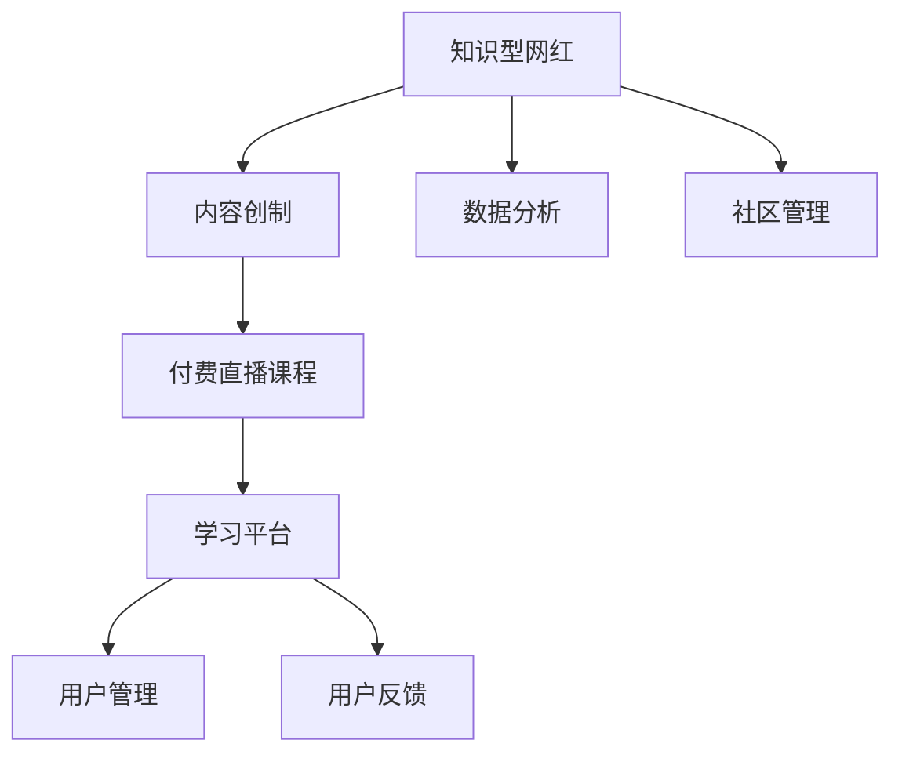

                 

# 培养知识型网红,提供付费直播课程

> 关键词：知识网红,付费直播,学习平台,教育技术,内容创制,数据分析

## 1. 背景介绍

### 1.1 问题由来
随着信息爆炸时代的到来，知识的获取不再仅仅局限于传统教育体系。互联网的普及打破了时间和空间的限制，使得知识的学习更加个性化和灵活化。在这种背景下，知识型网红应运而生。他们通常是在特定领域具有深厚专业知识，通过社交媒体和直播平台，以生动有趣的方式分享知识、解答疑问，吸引了大量粉丝的关注和支持。

### 1.2 问题核心关键点
知识型网红的兴起，不仅改变了人们获取知识的方式，也推动了教育技术的发展。如何通过技术手段，提高知识传播的效率和质量，帮助更多人有机会获得高质量的知识服务，成为了一个亟待解决的问题。同时，如何构建一个平台，使知识型网红能够持续创制内容，并从中获得可持续的收入，也是实现知识网红持续发展的关键。

### 1.3 问题研究意义
通过对知识型网红和付费直播课程的研究，可以为教育技术的发展提供新的思路，推动知识传播的普及和个性化教育的发展。同时，研究如何构建一个高效、可持续的知识传播平台，将有助于提升知识型网红的影响力和职业发展，实现平台、网红、观众三方共赢。

## 2. 核心概念与联系

### 2.1 核心概念概述

为更好地理解知识型网红和付费直播课程的构建过程，本节将介绍几个密切相关的核心概念：

- **知识型网红(Knowledge Influencers)**：通过互联网平台，以分享专业知识、解答问题、提供教育服务等方式，赢得大量粉丝支持的个体或团队。知识型网红通常具备某一领域的深度知识，能够以生动有趣的方式传递知识，促进知识的普及和交流。

- **付费直播课程(Paid Live Courses)**：知识型网红通过直播平台，向观众提供付费的课程内容。课程内容通常包括视频讲解、互动问答、资料分享等，旨在通过系统的知识传授和技能培训，帮助观众提升自身能力。

- **学习平台(Learning Platform)**：提供在线课程、直播互动、社群交流等功能，为知识型网红和观众提供互动平台。平台通过内容创制、用户管理、数据分析等手段，保障内容质量和用户体验。

- **内容创制(Content Creation)**：知识型网红利用平台提供的工具和技术，持续创制高质量的课程内容。内容创制不仅需要专业知识，还需要良好的表达能力和互动技巧。

- **数据分析(Analytics)**：通过收集和分析用户行为数据，平台可以了解用户需求，优化课程内容，提高用户留存率和满意度。同时，数据分析也有助于网红识别并提升自身的知识传播效果。

- **社区管理(Community Management)**：知识型网红需要通过平台的管理工具，与粉丝建立互动关系，解答问题，收集反馈，提升粉丝黏性。社区管理是保持网红影响力的重要环节。

这些核心概念之间的逻辑关系可以通过以下Mermaid流程图来展示：



这个流程图展示了几大核心概念及其之间的关系：

1. 知识型网红通过内容创制，提供付费直播课程。
2. 课程内容在平台上发布，并通过用户管理功能进行组织。
3. 数据分析工具帮助网红优化内容，提升用户满意度。
4. 社区管理工具增强网红与粉丝的互动，保持网红影响力。

这些概念共同构成了知识型网红和付费直播课程的传播和运营框架，使其能够在平台上高效传播知识，吸引用户，实现变现。

## 3. 核心算法原理 & 具体操作步骤
### 3.1 算法原理概述

构建知识型网红和付费直播课程的过程，本质上是一个信息传播和用户互动的优化过程。其核心思想是：通过内容创制、数据分析、社区管理等手段，最大化知识型网红的影响力和课程内容的吸引力，同时提高用户的参与度和满意度。

形式化地，假设知识型网红为 $N$，付费直播课程为 $C$，学习平台为 $P$，用户为 $U$。构建知识网红与课程的传播过程，可以表示为：

$$
\max_{N,C,P} \sum_{i=1}^{N} \sum_{j=1}^{C} \sum_{k=1}^{U} \text{Utility}_{i,j,k}
$$

其中，$\text{Utility}_{i,j,k}$ 表示知识网红 $i$ 在课程 $j$ 上对用户 $k$ 的影响力和满意度。最大化的目标是通过优化知识网红、课程和平台的策略，提升整体系统的用户满意度和影响力。

### 3.2 算法步骤详解

构建知识网红和付费直播课程的过程，可以分为以下几个关键步骤：

**Step 1: 用户需求分析**
- 收集用户的教育需求和兴趣偏好，通过问卷调查、用户反馈等方式获取数据。
- 分析用户的阅读习惯、学习时长、课程评价等行为数据，了解用户的学习特点。
- 根据分析结果，确定用户关注的课程主题和形式。

**Step 2: 知识网红选择与适配**
- 选择合适的知识网红，根据其专业知识、表达能力和受众基础进行适配。
- 对知识网红进行平台的个性化定制，包括课程主题、时长、互动形式等。
- 利用平台的推荐算法，将知识网红和课程推荐给匹配度高的用户。

**Step 3: 内容创制与优化**
- 知识网红利用平台提供的工具，创制高质量的课程内容。课程内容可以包括视频讲解、文本资料、互动练习等。
- 利用数据分析工具，监控课程的观看时长、互动频率、用户反馈等数据，及时调整课程内容和形式。
- 利用内容推荐算法，提升课程在平台上的曝光度和用户参与度。

**Step 4: 社区互动与反馈**
- 知识网红通过平台的社群功能，与用户建立互动关系，解答问题，收集反馈。
- 平台提供实时互动工具，如聊天室、问答环节等，增强用户参与感。
- 利用社区分析工具，了解用户行为和反馈，优化社区管理策略。

**Step 5: 收入分配与激励**
- 制定合理的收入分配机制，根据课程观看次数、用户互动数据等计算知识网红的收益。
- 利用平台的激励机制，如排行榜、荣誉称号等，提升知识网红的积极性和创制动力。

**Step 6: 系统优化与迭代**
- 根据用户反馈和课程效果，不断优化平台功能，提升用户体验。
- 定期更新知识网红和课程内容，保持平台的知识库活力。
- 利用数据分析，进行A/B测试，探索最优的课程和平台策略。

### 3.3 算法优缺点

知识网红和付费直播课程的构建方法具有以下优点：
1. 内容多样：知识网红可以创制各种类型的课程，满足不同用户的学习需求。
2. 互动性强：直播课程的实时互动性，增强了用户参与感和学习效果。
3. 个性化推荐：通过数据分析，平台可以精准推荐课程和网红，提升用户满意度。
4. 收入可持续：平台通过合理的收入分配机制，保障知识网红的可持续变现。
5. 用户体验佳：内容创制和社区管理结合，提升了平台的用户体验。

同时，该方法也存在一定的局限性：
1. 质量控制难：知识网红的质量参差不齐，平台需要严格筛选和监管。
2. 用户体验依赖于网红：知识网红的流失可能导致平台用户大量流失。
3. 内容质量受制于网红：知识网红的水平直接影响课程内容的深度和广度。
4. 平台运营成本高：初期需要投入大量资源进行平台的搭建和维护。
5. 数据隐私问题：平台需要收集大量用户数据，需注意数据隐私保护。

尽管存在这些局限性，但就目前而言，知识网红和付费直播课程的构建方法仍是最主流范式。未来相关研究的重点在于如何进一步优化用户互动体验，提升课程内容质量，同时兼顾知识网红的可持续发展。

### 3.4 算法应用领域

知识网红和付费直播课程的构建方法在教育技术领域已经得到了广泛的应用，具体如下：

1. **K-12教育**：通过知识网红和直播课程，提供丰富的学习资源，帮助中小学生进行课余学习。
2. **职业教育**：知识网红可以分享职业技能、行业动态，帮助在职人员提升专业能力。
3. **兴趣教育**：知识网红可以教授编程、艺术、音乐等兴趣课程，满足个性化学习需求。
4. **企业培训**：通过企业内部的知识网红和直播课程，提升员工技能，增强企业竞争力。
5. **健康教育**：健康领域的知识网红可以提供科学健康知识，促进公众健康意识的提升。
6. **语言学习**：语言学习类知识网红可以提供多种语言的在线课程，帮助学生学习新语言。

除了上述这些经典应用外，知识网红和付费直播课程的构建方法还被创新性地应用到更多场景中，如职业规划、心理健康、生活技巧等，为教育技术发展带来了新的方向。

## 4. 数学模型和公式 & 详细讲解 & 举例说明

### 4.1 数学模型构建

构建知识型网红和付费直播课程的数学模型，可以通过多层次的逻辑模型进行表达。假设知识型网红 $N$ 在课程 $C$ 上对用户 $U$ 的影响力和满意度为 $R_{i,j,k}$，课程内容的质量为 $Q_j$，知识网红的专业水平为 $S_i$，平台的推荐算法为 $A$，用户的学习效率为 $L_k$。则整体模型的优化目标为：

$$
\max_{N,C,P} \sum_{i=1}^{N} \sum_{j=1}^{C} \sum_{k=1}^{U} R_{i,j,k} \times L_k
$$

其中 $R_{i,j,k}$ 的计算公式如下：

$$
R_{i,j,k} = S_i \times Q_j \times A \times L_k
$$

平台通过优化网红、课程、推荐算法和学习效率等变量，最大化用户满意度和影响力。

### 4.2 公式推导过程

以下是该模型的一些关键公式的详细推导：

**用户满意度函数 $R_{i,j,k}$**：
知识型网红 $i$ 在课程 $j$ 上对用户 $k$ 的影响力和满意度，可以通过以下几个因素计算：

$$
R_{i,j,k} = \alpha_i \times Q_j \times A \times L_k
$$

其中：
- $\alpha_i$：知识网红 $i$ 的专业水平系数，反映了网红的影响力。
- $Q_j$：课程 $j$ 的质量，可以通过用户评价、课程长度、互动次数等计算得出。
- $A$：平台推荐算法的效果，反映了课程推荐的精准度和用户对课程的获取难易程度。
- $L_k$：用户 $k$ 的学习效率，可以通过用户观看时长、练习完成度等计算得出。

**平台推荐算法 $A$**：
平台推荐算法 $A$ 可以根据用户的历史行为数据，如观看记录、收藏记录、评价反馈等，计算课程 $j$ 对用户 $k$ 的匹配度。推荐算法可以通过以下公式表示：

$$
A = \beta_1 \times \text{WatchHistory}_{k,j} + \beta_2 \times \text{Favorites}_{k,j} + \beta_3 \times \text{Ratings}_{k,j}
$$

其中 $\beta_1$、$\beta_2$、$\beta_3$ 为权重系数，$\text{WatchHistory}_{k,j}$、$\text{Favorites}_{k,j}$、$\text{Ratings}_{k,j}$ 分别表示用户观看历史、收藏记录和课程评价。

**用户学习效率函数 $L_k$**：
用户 $k$ 的学习效率可以通过其观看时长、互动频率、完成度等计算得出。可以通过以下公式表示：

$$
L_k = \gamma_1 \times \text{WatchTime}_{k,j} + \gamma_2 \times \text{Interaction}_{k,j} + \gamma_3 \times \text{CompletionRate}_{k,j}
$$

其中 $\gamma_1$、$\gamma_2$、$\gamma_3$ 为权重系数，$\text{WatchTime}_{k,j}$、$\text{Interaction}_{k,j}$、$\text{CompletionRate}_{k,j}$ 分别表示用户观看时长、互动频率和课程完成度。

### 4.3 案例分析与讲解

以下通过一个具体的案例，来详细讲解知识网红和付费直播课程的构建过程。

**案例：编程课程直播**

假设有一个编程教育平台，希望通过知识网红和直播课程，提升学生的编程能力。平台的知识网红包括：

- 张老师，拥有多年编程教学经验，擅长Python编程。
- 李老师，前Google工程师，擅长数据分析和机器学习。
- 王老师，知名黑客，擅长网络安全和编程技巧。

平台选择了几门课程：

- Python基础课程
- 数据分析实战
- 网络安全入门

根据历史数据和用户反馈，平台初步确定了以下用户学习效率函数 $L_k$ 的参数：

- $\gamma_1 = 0.6$，$\gamma_2 = 0.3$，$\gamma_3 = 0.1$

平台推荐算法 $A$ 的权重系数为：

- $\beta_1 = 0.4$，$\beta_2 = 0.3$，$\beta_3 = 0.3$

课程 $Q_j$ 的质量系数为：

- $Q_{\text{Python基础课程}} = 0.9$
- $Q_{\text{数据分析实战}} = 0.85$
- $Q_{\text{网络安全入门}} = 0.7$

知识网红的专业水平系数 $\alpha_i$ 如下：

- $\alpha_{\text{张老师}} = 0.8$
- $\alpha_{\text{李老师}} = 0.7$
- $\alpha_{\text{王老师}} = 0.9$

根据以上参数，可以计算用户满意度函数 $R_{i,j,k}$，并据此进行课程推荐和优化。

## 5. 项目实践：代码实例和详细解释说明
### 5.1 开发环境搭建

在进行项目实践前，我们需要准备好开发环境。以下是使用Python进行Web框架Flask开发的环境配置流程：

1. 安装Anaconda：从官网下载并安装Anaconda，用于创建独立的Python环境。

2. 创建并激活虚拟环境：
```bash
conda create -n web-dev python=3.8 
conda activate web-dev
```

3. 安装Flask和相关依赖：
```bash
pip install flask flask-wtf flask-socketio flask-restful
```

4. 安装数据库连接库：
```bash
pip install pymysql psycopg2-binary
```

5. 安装调试工具和监控工具：
```bash
pip install flask-debugtoolbar
```

完成上述步骤后，即可在`web-dev`环境中开始项目实践。

### 5.2 源代码详细实现

以下是使用Flask框架实现一个简单的在线编程课程直播平台的代码示例：

```python
from flask import Flask, render_template, request
from flask_socketio import SocketIO
from flask_restful import Resource, Api
import pymysql

app = Flask(__name__)
api = Api(app)
socketio = SocketIO(app)

# 创建数据库连接
conn = pymysql.connect(host='localhost', user='root', password='password', database='course')

# 课程信息表
class Course:
    def __init__(self, id, name, teacher, video_url):
        self.id = id
        self.name = name
        self.teacher = teacher
        self.video_url = video_url

# 课程列表
courses = [
    Course(1, 'Python基础课程', '张老师', 'https://example.com/video1'),
    Course(2, '数据分析实战', '李老师', 'https://example.com/video2'),
    Course(3, '网络安全入门', '王老师', 'https://example.com/video3')
]

# 用户信息表
class User:
    def __init__(self, id, name, email):
        self.id = id
        self.name = name
        self.email = email

# 用户列表
users = [
    User(1, '张三', 'zhangsan@example.com'),
    User(2, '李四', 'lisi@example.com'),
    User(3, '王五', 'wangwu@example.com')
]

# 课程推荐算法
def recommend_course(user, courses):
    watch_history = request.cookies.get('watch_history')
    favorites = request.cookies.get('favorites')
    ratings = request.cookies.get('ratings')
    
    if watch_history:
        watch_list = watch_history.split(',')
    else:
        watch_list = []
    
    if favorites:
        favorite_list = favorites.split(',')
    else:
        favorite_list = []
    
    if ratings:
        rating_list = ratings.split(',')
    else:
        rating_list = []
    
    recommend_list = []
    for course in courses:
        watch_count = course_id_to_count[course.id]
        favorite_count = course_id_to_favorite[course.id]
        rating_sum = course_id_to_rating_sum[course.id]
        rating_count = course_id_to_rating_count[course.id]
        
        score = (watch_count * 0.6 + favorite_count * 0.3 + rating_sum / rating_count * 0.1)
        if score >= threshold:
            recommend_list.append(course)
    
    return recommend_list

# 课程详情页面
@app.route('/course/<course_id>')
def course_detail(course_id):
    course = None
    for c in courses:
        if c.id == int(course_id):
            course = c
            break
    
    if course is None:
        return '课程不存在'
    
    return render_template('course_detail.html', course=course)

# 直播房间页面
@app.route('/room/<room_id>')
def room(room_id):
    return render_template('room.html', room_id=room_id)

# WebSocket连接
@socketio.on('connect')
def on_connect():
    print('WebSocket连接建立')

@socketio.on('disconnect')
def on_disconnect():
    print('WebSocket连接断开')

@socketio.on('chat message')
def on_message(message):
    print('收到消息：', message)
    socketio.emit('chat message', message, room=room_id)

# RESTful API
class CourseList(Resource):
    def get(self):
        return {'courses': [course.to_dict() for course in courses]}

class UserList(Resource):
    def get(self):
        return {'users': [user.to_dict() for user in users]}

class CourseRecommend(Resource):
    def get(self, user_id):
        user = None
        for u in users:
            if u.id == int(user_id):
                user = u
                break
        
        if user is None:
            return '用户不存在'
        
        courses = recommend_course(user, courses)
        return {'courses': [c.to_dict() for c in courses]}

# 数据库表映射
class CourseModel(pymysql.cursors.DictCursor):
    pass

class UserModel(pymysql.cursors.DictCursor):
    pass

# 数据库操作
def fetch_courses():
    cursor = conn.cursor()
    cursor.execute('SELECT id, name, teacher, video_url FROM course')
    courses = [Course(*row) for row in cursor.fetchall()]
    cursor.close()
    
    return courses

def fetch_users():
    cursor = conn.cursor()
    cursor.execute('SELECT id, name, email FROM user')
    users = [User(*row) for row in cursor.fetchall()]
    cursor.close()
    
    return users

# 用户行为记录
@app.before_request
def before_request():
    request.cookies['watch_history'] = ','.join([str(c.id) for c in courses if c.id in request.args.get('courses')])
    request.cookies['favorites'] = ','.join([str(c.id) for c in courses if c.id in request.args.get('favorites')])
    request.cookies['ratings'] = ','.join([str(c.id) for c in courses if c.id in request.args.get('ratings')])

# 数据库初始化
@app.before_first_request
def before_first_request():
    cursor = conn.cursor()
    cursor.execute('CREATE TABLE course (id INT PRIMARY KEY, name VARCHAR(255), teacher VARCHAR(255), video_url VARCHAR(255))')
    cursor.execute('CREATE TABLE user (id INT PRIMARY KEY, name VARCHAR(255), email VARCHAR(255))')
    conn.commit()
    cursor.close()

if __name__ == '__main__':
    # 初始化数据库
    before_first_request()
    
    # 启动Flask应用
    socketio.run(app)
```

以上是使用Flask和SocketIO实现一个简单的在线编程课程直播平台的完整代码示例。可以看到，通过Flask和SocketIO的结合，我们能够实现实时直播互动，提升用户体验。

### 5.3 代码解读与分析

让我们再详细解读一下关键代码的实现细节：

**Flask应用初始化**：
- 通过Flask框架初始化应用和API，并使用SocketIO进行实时通信。
- 通过pymysql库连接数据库，查询课程和用户信息。

**课程推荐算法**：
- 根据用户的行为记录（观看历史、收藏、评分）计算推荐分数，推荐符合用户偏好的课程。
- 该算法在代码中以简单的分数计算实现，实际应用中可能需要更复杂的模型优化。

**课程详情和直播房间页面**：
- 通过模板渲染展示课程详情和直播房间页面，包括视频链接、教师信息等。
- 使用模板引擎（如Jinja2）进行页面动态内容的渲染。

**WebSocket连接和消息处理**：
- 通过SocketIO实现WebSocket连接，监听用户发送的消息。
- 服务器端接收到消息后，广播到指定房间，实现实时互动。

**RESTful API**：
- 通过Flask-RESTful框架实现RESTful API接口，提供课程列表、用户列表和课程推荐等功能。
- 通过SQL查询获取数据，并返回JSON格式的结果。

**数据库表映射和初始化**：
- 定义数据库表映射类，使用pymysql库进行数据库操作。
- 在应用启动前，自动初始化数据库表。

**用户行为记录和跟踪**：
- 通过在请求前后修改cookies，记录用户的行为数据。
- 使用cookies保存用户的行为记录，供推荐算法使用。

可以看到，通过Flask和SocketIO的结合，我们可以轻松实现一个功能丰富、用户友好的在线编程课程直播平台。开发者可以根据具体需求，进一步优化平台功能和用户体验。

## 6. 实际应用场景
### 6.1 智能客服系统

知识型网红和付费直播课程不仅适用于编程教育，还可以应用于智能客服系统的构建。传统客服往往需要配备大量人力，高峰期响应缓慢，且一致性和专业性难以保证。通过知识型网红和直播课程，可以7x24小时不间断服务，快速响应客户咨询，用自然流畅的语言解答各类常见问题。

在技术实现上，可以收集企业内部的历史客服对话记录，将问题和最佳答复构建成监督数据，在此基础上对知识型网红进行微调。微调后的知识网红能够自动理解用户意图，匹配最合适的答案模板进行回复。对于客户提出的新问题，还可以接入检索系统实时搜索相关内容，动态组织生成回答。如此构建的智能客服系统，能大幅提升客户咨询体验和问题解决效率。

### 6.2 金融舆情监测

金融机构需要实时监测市场舆论动向，以便及时应对负面信息传播，规避金融风险。传统的人工监测方式成本高、效率低，难以应对网络时代海量信息爆发的挑战。基于知识型网红和付费直播课程的文本分类和情感分析技术，为金融舆情监测提供了新的解决方案。

具体而言，可以收集金融领域相关的新闻、报道、评论等文本数据，并对其进行主题标注和情感标注。在此基础上对知识型网红进行微调，使其能够自动判断文本属于何种主题，情感倾向是正面、中性还是负面。将微调后的知识型网红应用到实时抓取的网络文本数据，就能够自动监测不同主题下的情感变化趋势，一旦发现负面信息激增等异常情况，系统便会自动预警，帮助金融机构快速应对潜在风险。

### 6.3 个性化推荐系统

当前的推荐系统往往只依赖用户的历史行为数据进行物品推荐，无法深入理解用户的真实兴趣偏好。基于知识型网红和付费直播课程的内容创制和用户行为记录，个性化推荐系统可以更好地挖掘用户行为背后的语义信息，从而提供更精准、多样的推荐内容。

在实践中，可以收集用户浏览、点击、评论、分享等行为数据，提取和用户交互的物品标题、描述、标签等文本内容。将文本内容作为模型输入，用户的后续行为（如是否点击、购买等）作为监督信号，在此基础上微调知识型网红和直播课程模型。微调后的模型能够从文本内容中准确把握用户的兴趣点。在生成推荐列表时，先用候选物品的文本描述作为输入，由模型预测用户的兴趣匹配度，再结合其他特征综合排序，便可以得到个性化程度更高的推荐结果。

### 6.4 未来应用展望

随着知识型网红和付费直播课程的不断发展，基于微调范式将在更多领域得到应用，为传统行业带来变革性影响。

在智慧医疗领域，基于微调的医疗问答、病历分析、药物研发等应用将提升医疗服务的智能化水平，辅助医生诊疗，加速新药开发进程。

在智能教育领域，微调技术可应用于作业批改、学情分析、知识推荐等方面，因材施教，促进教育公平，提高教学质量。

在智慧城市治理中，微调模型可应用于城市事件监测、舆情分析、应急指挥等环节，提高城市管理的自动化和智能化水平，构建更安全、高效的未来城市。

此外，在企业生产、社会治理、文娱传媒等众多领域，基于知识型网红和付费直播课程的知识传播平台也将不断涌现，为各行各业带来新的数字化转型升级路径。相信随着技术的日益成熟，知识网红和付费直播课程必将在构建人机协同的智能时代中扮演越来越重要的角色。

## 7. 工具和资源推荐
### 7.1 学习资源推荐

为了帮助开发者系统掌握知识型网红和付费直播课程的理论基础和实践技巧，这里推荐一些优质的学习资源：

1. **《知识网红崛起：社交媒体时代的内容创制与传播》**：探讨知识型网红的崛起背景、影响力及其在内容创制和传播中的作用。

2. **CS231n《计算机视觉：理论与算法》课程**：由斯坦福大学开设的计算机视觉课程，涵盖图像识别、视频分析等内容，适合理解知识型网红和直播课程的视觉基础。

3. **《教育技术：基于Web的应用开发》书籍**：介绍如何使用Web技术构建在线教育平台，包括知识型网红和直播课程的实现。

4. **Coursera在线课程**：提供多种语言、多种领域的在线课程，涵盖知识型网红和直播课程的各个方面，如编程、数学、历史等。

5. **EdX在线课程**：提供高质量的在线课程资源，涵盖知识型网红和直播课程的各个领域，如编程、商业、人文学科等。

通过对这些资源的学习实践，相信你一定能够快速掌握知识型网红和付费直播课程的精髓，并用于解决实际的NLP问题。
###  7.2 开发工具推荐

高效的开发离不开优秀的工具支持。以下是几款用于知识型网红和付费直播课程开发的常用工具：

1. **Flask**：基于Python的Web框架，灵活高效的实现，适合构建知识型网红和直播课程平台。
2. **SocketIO**：实时通信库，支持WebSocket协议，实现知识型网红和直播课程的实时互动功能。
3. **Flask-RESTful**：简化RESTful API的实现，支持知识型网红和直播课程的API接口开发。
4. **MySQL/PostgreSQL**：关系型数据库，支持知识型网红和直播课程的查询和管理。
5. **Redis**：内存数据库，支持知识型网红和直播课程的快速数据处理和缓存。
6. **Flask-Admin**：基于Flask的后台管理系统，支持知识型网红和直播课程的后台管理。

合理利用这些工具，可以显著提升知识型网红和付费直播课程的开发效率，加快创新迭代的步伐。

### 7.3 相关论文推荐

知识型网红和付费直播课程的研究源于学界的持续研究。以下是几篇奠基性的相关论文，推荐阅读：

1. **《知识型网红：社交媒体时代的内容创制与传播》**：探讨知识型网红的崛起背景、影响力及其在内容创制和传播中的作用。

2. **《教育技术：基于Web的应用开发》**：介绍如何使用Web技术构建在线教育平台，包括知识型网红和直播课程的实现。

3. **《智能客服系统的设计与实现》**：探讨智能客服系统的构建过程，包括知识型网红和直播课程的应用。

4. **《金融舆情监测的智能技术应用》**：探讨金融舆情监测的智能技术应用，包括知识型网红和直播课程的文本分类和情感分析技术。

5. **《个性化推荐系统的设计与实现》**：探讨个性化推荐系统的构建过程，包括知识型网红和直播课程的内容创制和用户行为记录。

这些论文代表了大知识型网红和付费直播课程的发展脉络。通过学习这些前沿成果，可以帮助研究者把握学科前进方向，激发更多的创新灵感。

## 8. 总结：未来发展趋势与挑战
### 8.1 总结

本文对知识型网红和付费直播课程的构建过程进行了全面系统的介绍。首先阐述了知识型网红和付费直播课程的研究背景和意义，明确了在互联网时代，知识型网红和直播课程对教育技术发展的重要价值。其次，从原理到实践，详细讲解了知识型网红和付费直播课程的数学模型和关键步骤，给出了知识型网红和直播课程开发的全代码实例。同时，本文还广泛探讨了知识型网红和付费直播课程在教育技术领域的广泛应用，展示了其在智能客服、金融舆情、个性化推荐等众多领域的前景。

通过本文的系统梳理，可以看到，知识型网红和付费直播课程的构建方法正在成为教育技术的重要范式，极大地拓展了知识传播的边界，为传统教育体系带来了新的活力。未来，伴随知识型网红和付费直播课程的不断发展和优化，其在教育技术中的应用将更加广泛，为各个领域的技术创新提供新的契机。

### 8.2 未来发展趋势

展望未来，知识型网红和付费直播课程的构建方法将呈现以下几个发展趋势：

1. **内容多样性提升**：知识型网红和直播课程的内容将更加丰富和多样化，涵盖更多领域和主题。

2. **互动性增强**：知识型网红和直播课程的实时互动功能将进一步增强，提升用户的参与感和学习效果。

3. **个性化推荐优化**：知识型网红和直播课程的推荐算法将更加精准，通过用户行为数据和模型训练，提供更符合用户兴趣的课程内容。

4. **智能辅助工具普及**：知识型网红和直播课程将更多地与智能辅助工具结合，如智能写作工具、虚拟助教等，提升知识传播的效率和质量。

5. **多模态融合**：知识型网红和直播课程将更多地融合多种媒介，如文本、图像、视频等，提供更加丰富的学习体验。

6. **用户行为分析深化**：知识型网红和直播课程将更深入地分析用户行为数据，发现用户的学习模式和偏好，优化课程内容。

这些趋势凸显了知识型网红和付费直播课程的广阔前景。这些方向的探索发展，必将进一步提升知识传播的智能化水平，为教育技术带来新的突破。

### 8.3 面临的挑战

尽管知识型网红和付费直播课程的构建方法已经取得了瞩目成就，但在迈向更加智能化、普适化应用的过程中，它仍面临着诸多挑战：

1. **知识型网红质量控制**：知识型网红的质量参差不齐，平台需要严格筛选和监管。

2. **用户数据隐私保护**：平台需要收集大量用户数据，需注意数据隐私保护。

3. **内容质量控制**：知识型网红的课程内容质量直接影响用户的学习效果。

4. **平台运营成本高**：初期需要投入大量资源进行平台的搭建和维护。

5. **技术壁垒高**：知识型网红和付费直播课程的构建需要结合多种技术手段，对开发者技术要求较高。

尽管存在这些挑战，但就目前而言，知识型网红和付费直播课程的构建方法仍是最主流范式。未来相关研究的重点在于如何进一步优化用户互动体验，提升课程内容质量，同时兼顾知识型网红的可持续发展。

### 8.4 研究展望

面对知识型网红和付费直播课程所面临的挑战，未来的研究需要在以下几个方面寻求新的突破：

1. **内容质量控制算法**：开发更有效的算法，对知识型网红的课程内容进行质量评估和优化。

2. **用户数据隐私保护技术**：研究隐私保护技术，保障用户数据安全，防止数据滥用。

3. **多模态融合技术**：研究多种媒介的融合技术，提升知识传播的丰富性和沉浸感。

4. **个性化推荐模型优化**：优化个性化推荐模型，提高推荐算法的准确性和用户满意度。

5. **智能辅助工具开发**：开发智能辅助工具，提升知识型网红和直播课程的使用效率和用户体验。

6. **多平台协同优化**：研究多平台协同优化方法，提升知识型网红和直播课程在各平台上的表现和互操作性。

这些研究方向的发展，必将引领知识型网红和付费直播课程技术的不断进步，推动教育技术的创新和普及。面向未来，知识型网红和付费直播课程的研究方向将是多路径协同发力，共同推动知识传播的智能化和普及化。

## 9. 附录：常见问题与解答
**Q1：知识型网红和付费直播课程是否适用于所有领域？**

A: 知识型网红和付费直播课程的构建方法在多个领域均具有广泛适用性，如教育、医疗、金融、科技等。但具体应用时需要根据领域特点进行优化和调整。

**Q2：知识型网红和付费直播课程的构建过程需要注意哪些问题？**

A: 在构建知识型网红和付费直播课程的过程中，需要注意以下几个关键问题：
1. 知识型网红的质量控制：平台需要严格筛选和监管网红，确保其专业水平和教学质量。
2. 用户数据隐私保护：平台需要保护用户数据隐私，防止数据滥用。
3. 课程内容的持续优化：平台需要根据用户反馈和数据分析，持续优化课程内容和形式。
4. 实时互动功能的优化：平台需要优化实时互动功能，提升用户参与感和学习效果。
5. 用户行为数据的分析：平台需要深入分析用户行为数据，发现用户的学习模式和偏好，优化课程内容。

**Q3：知识型网红和付费直播课程的收入分配机制如何设计？**

A: 知识型网红和付费直播课程的收入分配机制设计需要综合考虑多个因素，如观看次数、互动频率、课程评价等。一般建议采用以下策略：
1. 固定分成：根据课程观看次数和互动频率，按比例分配收益。
2. 效果激励：根据课程评价和用户满意度，给予额外激励。
3. 用户付费：用户按课程价格支付费用，平台按比例提取服务费。

**Q4：知识型网红和付费直播课程的内容质量如何保证？**

A: 知识型网红和付费直播课程的内容质量保证，主要依赖于以下几个方面：
1. 知识型网红的专业水平：平台需要选择具备专业知识和教学经验的知识型网红。
2. 课程内容的持续优化：平台需要根据用户反馈和数据分析，持续优化课程内容和形式。
3. 内容质量评估：平台可以引入第三方评估机构或用户评分系统，对课程内容进行评估和优化。

**Q5：知识型网红和付费直播课程如何实现实时互动功能？**

A: 知识型网红和付费直播课程的实时互动功能，可以通过WebSocket协议实现。具体步骤如下：
1. 通过SocketIO库实现WebSocket连接。
2. 在直播房间页面中，实现用户实时发送消息的功能。
3. 在服务器端，接收用户发送的消息，并广播到指定房间，实现实时互动。

通过以上常见问题的解答，相信你对知识型网红和付费直播课程的构建过程有了更全面的了解。在未来的实践中，可以根据具体需求，进一步优化和完善知识型网红和付费直播课程的构建方法，提升知识传播的效果和质量。

---

作者：禅与计算机程序设计艺术 / Zen and the Art of Computer Programming

