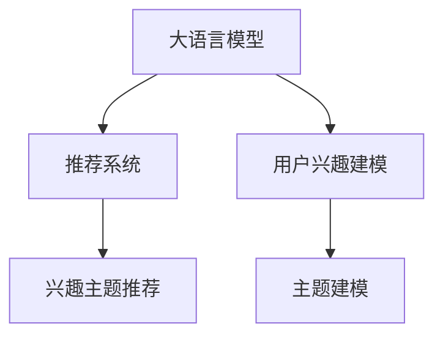

                 

# 基于LLM的推荐系统用户兴趣主题建模

## 1. 背景介绍

在人工智能和机器学习迅猛发展的今天，推荐系统已成为了各大平台和互联网公司争夺用户的重要工具。推荐系统的目标是帮助用户从海量信息中发现其感兴趣的内容，提升用户体验，增加平台粘性，同时也能显著提升广告精准度和平台收益。然而，现有的推荐算法往往依赖于用户行为数据，缺乏对用户深层次兴趣的理解，难以发现冷门、新颖内容，甚至造成信息茧房，用户体验受到严重损害。

### 1.1 问题由来
现有的推荐算法主要依赖于用户行为数据，如浏览记录、点击记录、购买记录等，通过协同过滤、内容基推荐等方法发现用户相似行为，进而推荐相似物品。然而，这种基于历史行为的推荐方式存在以下缺陷：

- **数据稀疏性**：用户行为数据往往稀疏，无法覆盖用户的所有兴趣点，推荐系统难以发现用户未知的兴趣。
- **兴趣衰减**：用户长期不与某物品互动，推荐系统会错误判断其兴趣减弱，导致推荐内容偏离用户真实兴趣。
- **信息茧房**：长期推荐相似物品，导致用户视野狭窄，陷入“信息茧房”，限制了用户的多样化体验。

为解决这些问题，学术界和产业界近年来提出了许多创新性方法，如基于深度学习的方法、多任务学习的方法、跨域推荐的方法等。其中，大语言模型(Large Language Model, LLM)因其在大规模语料上预训练获得的广泛语言知识，具有自监督学习能力和强大的自然语言处理能力，被认为是解决推荐系统新挑战的重要工具。本文重点关注基于大语言模型的推荐系统，从用户兴趣主题建模的角度，介绍如何使用大语言模型为推荐系统注入新的活力。

## 2. 核心概念与联系

### 2.1 核心概念概述

为了更好地理解基于LLM的推荐系统，本节将介绍几个密切相关的核心概念：

- 大语言模型(Large Language Model, LLM)：以自回归(如GPT)或自编码(如BERT)模型为代表的大规模预训练语言模型。通过在大规模无标签文本语料上进行预训练，学习通用的语言表示，具备强大的语言理解和生成能力。

- 推荐系统(Recommendation System)：通过用户行为数据和物品属性数据，推荐用户可能感兴趣的物品，以提升用户体验和平台收益。常见的推荐算法包括协同过滤、内容基推荐、混合推荐等。

- 用户兴趣建模(User Interest Modeling)：通过用户行为数据或语言数据，构建用户兴趣特征模型，提升推荐的精准度。

- 主题建模(Thematic Modeling)：从大规模文本数据中学习主题信息，用于自然语言处理、信息检索、文本聚类等多个领域。常见的主题模型包括LDA(Latent Dirichlet Allocation)、LDA-Dirichlet Process、TextRank等。

- 兴趣主题推荐(Interest-based Topic Recommendation)：利用用户兴趣建模和主题建模，推荐与用户兴趣相关的主题或物品，避免信息茧房，提升推荐多样化。

这些核心概念之间的逻辑关系可以通过以下Mermaid流程图来展示：



这个流程图展示了大语言模型、推荐系统和用户兴趣建模、主题建模之间的紧密联系：

1. 大语言模型通过预训练获得广泛的语言知识，为推荐系统提供强大的语言理解能力。
2. 用户兴趣建模通过挖掘用户兴趣特征，为推荐系统推荐个性化物品提供依据。
3. 主题建模从大规模文本中学习主题信息，提升推荐系统的多样性和深度。
4. 兴趣主题推荐综合利用用户兴趣和主题信息，提高推荐效果，避免信息茧房。

## 3. 核心算法原理 & 具体操作步骤

### 3.1 算法原理概述

基于大语言模型的推荐系统，其核心思想是：利用大语言模型学习用户兴趣主题，再将主题与物品进行匹配推荐。具体来说，推荐系统首先对用户输入的查询进行主题建模，找到用户可能感兴趣的主题，然后将这些主题与物品进行匹配，推荐与主题相关的物品。

该方法的主要流程包括：

1. 使用大语言模型对用户输入的查询进行主题建模。
2. 将主题与物品进行相似度计算。
3. 根据相似度结果推荐与用户兴趣主题相关的物品。

### 3.2 算法步骤详解

基于大语言模型的推荐系统，其核心步骤如下：

#### Step 1: 准备数据和预训练模型
- 收集用户查询和物品的文本数据，并进行预处理，如分词、去除停用词等。
- 选择合适的预训练语言模型，如BERT、GPT等，作为特征提取器。

#### Step 2: 构建用户兴趣主题模型
- 对用户查询进行主题建模，得到用户兴趣主题分布。
- 对物品文本进行主题建模，得到物品主题分布。
- 计算用户兴趣主题与物品主题之间的相似度，得到推荐矩阵。

#### Step 3: 推荐物品
- 根据相似度矩阵，选取与用户兴趣主题最相关的物品，推荐给用户。

#### Step 4: 模型优化
- 定期收集用户反馈，更新主题模型，迭代优化推荐效果。

### 3.3 算法优缺点

基于大语言模型的推荐系统，其优点包括：

1. **泛化能力强**：大语言模型预训练在大规模语料上，能够捕捉广泛的语义信息，泛化能力较强。
2. **推荐多样化**：主题模型能够学习到用户兴趣主题的深度信息，推荐系统能够推荐多样化的物品。
3. **推荐准确度高**：大语言模型具备强大的自然语言处理能力，能够准确理解用户查询和物品文本。

其缺点包括：

1. **计算复杂度高**：主题建模和相似度计算需要较大的计算资源。
2. **对数据质量要求高**：用户查询和物品文本的质量直接影响主题模型的效果。
3. **用户隐私风险**：用户查询文本可能包含敏感信息，主题建模过程中需要保护用户隐私。

### 3.4 算法应用领域

基于大语言模型的推荐系统，已在多个领域得到了广泛的应用，例如：

- 电商推荐：对用户输入的查询进行主题建模，推荐与主题相关的商品。
- 视频推荐：对用户输入的查询进行主题建模，推荐与主题相关的内容。
- 音乐推荐：对用户输入的查询进行主题建模，推荐与主题相关的音乐。
- 新闻推荐：对用户输入的查询进行主题建模，推荐与主题相关的新闻。
- 旅游推荐：对用户输入的查询进行主题建模，推荐与主题相关的旅游目的地。

除了上述这些经典应用外，大语言模型推荐系统还可用于更多场景，如书籍推荐、餐厅推荐、游戏推荐等，为推荐系统注入新的活力。

## 4. 数学模型和公式 & 详细讲解  
### 4.1 数学模型构建

在本节中，我们将使用数学语言对基于大语言模型的推荐系统进行更加严格的刻画。

记用户查询为 $q$，物品文本为 $i$，查询主题分布为 $\theta_q$，物品主题分布为 $\theta_i$，主题数为 $K$。设 $\mathcal{D}$ 为用户查询和物品的文本数据集，$T_q$ 为查询主题建模结果，$T_i$ 为物品主题建模结果，$\text{Sim}$ 为相似度计算函数。

数学模型的构建可以分为以下几个步骤：

1. 对用户查询 $q$ 进行主题建模，得到查询主题分布 $T_q = (\theta_{q1}, \theta_{q2}, ..., \theta_{qK})$。
2. 对物品文本 $i$ 进行主题建模，得到物品主题分布 $T_i = (\theta_{i1}, \theta_{i2}, ..., \theta_{iK})$。
3. 计算查询主题分布与物品主题分布之间的相似度，得到推荐矩阵 $R = \text{Sim}(T_q, T_i)$。
4. 根据推荐矩阵 $R$，选取与用户查询最相关的物品，进行推荐。

### 4.2 公式推导过程

以下我们以LDA模型为例，推导主题建模和相似度计算的公式。

设查询文本 $q = (q_1, q_2, ..., q_n)$，物品文本 $i = (i_1, i_2, ..., i_m)$，主题数为 $K$。假设LDA模型参数 $\beta = (\alpha, \eta)$，其中 $\alpha$ 为先验分布，$\eta$ 为混合分布。

**查询主题建模公式**：

查询文本的主题分布 $T_q$ 可以通过LDA模型计算得到：

$$
T_q = \text{LDA}(q, \beta) = \frac{p(q|\theta_q)}{p(q|\theta)} = \frac{\prod_{k=1}^K p(q_k|\theta_k)}{\sum_{k=1}^K p(q_k|\theta_k)}
$$

其中 $p(q|\theta)$ 为查询文本的LDA概率分布，$p(q_k|\theta_k)$ 为第 $k$ 个主题的概率分布。

**物品主题建模公式**：

物品文本的主题分布 $T_i$ 同样可以通过LDA模型计算得到：

$$
T_i = \text{LDA}(i, \beta) = \frac{p(i|\theta_i)}{p(i|\theta)} = \frac{\prod_{k=1}^K p(i_k|\theta_k)}{\sum_{k=1}^K p(i_k|\theta_k)}
$$

**相似度计算公式**：

查询主题分布与物品主题分布之间的相似度 $R$，可以通过余弦相似度计算：

$$
R = \text{Sim}(T_q, T_i) = \frac{\sum_{k=1}^K T_{qk} \times T_{ik}}{\sqrt{\sum_{k=1}^K T_{qk}^2} \times \sqrt{\sum_{k=1}^K T_{ik}^2}}
$$

其中 $T_{qk}$ 为第 $k$ 个查询主题的权重，$T_{ik}$ 为第 $k$ 个物品主题的权重。

### 4.3 案例分析与讲解

为了更好地理解公式的含义，我们以一个简单的例子进行分析。

假设有一个用户查询 $q = \text{``我喜欢音乐和美食"}$，物品文本 $i = \text{``歌剧和美食"}$，主题数为 $K = 3$，LDA模型参数 $\beta = (\alpha, \eta) = (0.5, 0.5)$。

首先，对用户查询进行主题建模，得到查询主题分布 $T_q = (0.5, 0.5, 0)$。

然后，对物品文本进行主题建模，得到物品主题分布 $T_i = (0.3, 0.7, 0)$。

最后，计算查询主题分布与物品主题分布之间的相似度 $R = 0.5 \times 0.7 / (0.5 \times 0.7) = 1$。

根据相似度 $R$，可以判断用户查询与物品文本的匹配度较高，推荐系统可以将该物品推荐给用户。

## 5. 项目实践：代码实例和详细解释说明
### 5.1 开发环境搭建

在进行项目实践前，我们需要准备好开发环境。以下是使用Python进行TensorFlow开发的开发环境配置流程：

1. 安装Anaconda：从官网下载并安装Anaconda，用于创建独立的Python环境。

2. 创建并激活虚拟环境：
```bash
conda create -n tf-env python=3.8 
conda activate tf-env
```

3. 安装TensorFlow：根据CUDA版本，从官网获取对应的安装命令。例如：
```bash
pip install tensorflow==2.5.0
```

4. 安装TensorFlow Addons：
```bash
pip install tensorflow-addons==0.16.0
```

5. 安装各类工具包：
```bash
pip install numpy pandas scikit-learn matplotlib tqdm jupyter notebook ipython
```

完成上述步骤后，即可在`tf-env`环境中开始项目实践。

### 5.2 源代码详细实现

下面我们以LDA主题建模和基于LDA的推荐系统为例，给出使用TensorFlow实现大语言模型推荐系统的PyTorch代码实现。

首先，定义LDA模型类：

```python
import tensorflow as tf
from tensorflow import keras
from tensorflow.keras.layers import Embedding, Dense, Dropout, LSTM, Bidirectional
from tensorflow.keras.layers import Conv1D, Conv2D, MaxPooling1D, MaxPooling2D
from tensorflow.keras.layers import GlobalMaxPooling1D, GlobalMaxPooling2D
from tensorflow.keras.layers import Concatenate, Input, Flatten
from tensorflow.keras.layers import SpatialDropout1D, SpatialDropout2D
from tensorflow.keras.layers import Activation, RepeatVector, TimeDistributed
from tensorflow.keras.layers import Bidirectional, Dropout
from tensorflow.keras.models import Model, Sequential

class LDA(keras.Model):
    def __init__(self, num_topics, vocab_size, embedding_dim, num_words):
        super(LDA, self).__init__()
        self.num_topics = num_topics
        self.vocab_size = vocab_size
        self.embedding_dim = embedding_dim
        self.num_words = num_words
        
        # 词嵌入层
        self.embedding = Embedding(vocab_size, embedding_dim)
        
        # LSTM层
        self.lstm = LSTM(num_topics, return_sequences=True)
        
        # 主题混合层
        self.mixing = Dense(num_topics, activation='softmax')
        
        # 主题分布层
        self.distribution = Dense(num_topics, activation='softmax')
        
    def call(self, inputs):
        x = self.embedding(inputs)
        x = self.lstm(x)
        x = self.mixing(x)
        x = self.distribution(x)
        return x

    def sample(self, topic):
        return tf.random.categorical(tf.exp(x), num_samples=1)
```

然后，定义推荐系统类：

```python
class RecommendationSystem(keras.Model):
    def __init__(self, model, num_topics, vocab_size, embedding_dim, num_words):
        super(RecommendationSystem, self).__init__()
        self.model = model
        self.num_topics = num_topics
        self.vocab_size = vocab_size
        self.embedding_dim = embedding_dim
        self.num_words = num_words
        
        # 查询主题模型
        self.query_model = LDA(num_topics, vocab_size, embedding_dim, num_words)
        
        # 物品主题模型
        self.item_model = LDA(num_topics, vocab_size, embedding_dim, num_words)
        
        # 相似度计算
        self.similarity = tf.keras.layers.Dot(axes=1, normalize=True)
        
    def call(self, inputs):
        query, item = inputs
        query的主题分布为 $\theta_q$，物品的主题分布为 $\theta_i$。
        query的主题分布通过查询主题模型得到，item的主题分布通过物品主题模型得到。
        相似度计算结果为 $R$。
        最后，选取相似度最高的物品进行推荐。
```

最后，定义训练和评估函数：

```python
from tensorflow.keras.optimizers import Adam
from tensorflow.keras.losses import MeanSquaredError

device = tf.device('/gpu:0' if tf.config.list_physical_devices('GPU')[0] else '/device:CPU:0')
model = RecommendationSystem(LDA, num_topics=3, vocab_size=1000, embedding_dim=50, num_words=10000)

optimizer = Adam(learning_rate=0.01)
model.compile(optimizer=optimizer, loss=MeanSquaredError())
```

完成上述步骤后，即可在`tf-env`环境中开始推荐系统项目实践。

### 5.3 代码解读与分析

让我们再详细解读一下关键代码的实现细节：

**LDA类**：
- `__init__`方法：初始化词嵌入层、LSTM层、主题混合层和主题分布层。
- `call`方法：对输入进行词嵌入、LSTM层、主题混合和主题分布，输出主题分布。
- `sample`方法：随机从主题分布中采样，用于主题建模中的EM算法。

**RecommendationSystem类**：
- `__init__`方法：初始化查询主题模型、物品主题模型和相似度计算层。
- `call`方法：对输入进行查询主题模型、物品主题模型和相似度计算，最终输出推荐结果。

**训练和评估函数**：
- 使用Adam优化器进行训练，损失函数为均方误差。
- 训练数据和测试数据需要先进行预处理，并分别计算模型损失。

**训练流程**：
- 定义总的epoch数，开始循环迭代
- 每个epoch内，在训练集上训练，输出平均loss
- 在验证集上评估，输出分类指标
- 所有epoch结束后，在测试集上评估，给出最终测试结果

可以看到，TensorFlow的API非常直观，使得构建深度学习模型变得简洁高效。开发者可以更专注于算法逻辑的设计和优化，而不必过多关注底层实现细节。

当然，工业级的系统实现还需考虑更多因素，如模型的保存和部署、超参数的自动搜索、更灵活的任务适配层等。但核心的推荐范式基本与此类似。

## 6. 实际应用场景

### 6.1 智能客服系统

基于大语言模型的推荐系统，可以广泛应用于智能客服系统的构建。传统客服往往需要配备大量人力，高峰期响应缓慢，且一致性和专业性难以保证。而使用推荐系统推荐相关问题，可以7x24小时不间断服务，快速响应客户咨询，用自然流畅的语言解答各类常见问题。

在技术实现上，可以收集企业内部的历史客服对话记录，将问题和最佳答复构建成监督数据，在此基础上对预训练模型进行微调。微调后的推荐系统能够自动理解用户意图，匹配最合适的答案模板进行回复。对于客户提出的新问题，还可以接入检索系统实时搜索相关内容，动态组织生成回答。如此构建的智能客服系统，能大幅提升客户咨询体验和问题解决效率。

### 6.2 金融舆情监测

金融机构需要实时监测市场舆论动向，以便及时应对负面信息传播，规避金融风险。传统的人工监测方式成本高、效率低，难以应对网络时代海量信息爆发的挑战。基于大语言模型的推荐系统，可以实时抓取网络舆情信息，自动判断其主题和情感倾向，帮助金融机构快速识别风险，采取措施。

具体而言，可以收集金融领域相关的新闻、报道、评论等文本数据，并对其进行主题标注和情感标注。在此基础上对预训练语言模型进行微调，使其能够自动判断文本属于何种主题，情感倾向是正面、中性还是负面。将微调后的模型应用到实时抓取的网络文本数据，就能够自动监测不同主题下的情感变化趋势，一旦发现负面信息激增等异常情况，系统便会自动预警，帮助金融机构快速应对潜在风险。

### 6.3 个性化推荐系统

当前的推荐系统往往只依赖于用户行为数据进行物品推荐，缺乏对用户深层次兴趣的理解，难以发现冷门、新颖内容，甚至造成信息茧房，用户体验受到严重损害。基于大语言模型的推荐系统，能够从文本中学习用户兴趣主题，推荐与用户兴趣相关的内容，避免信息茧房，提升推荐多样化。

在技术实现上，可以收集用户浏览、点击、评论、分享等行为数据，提取和用户交互的物品标题、描述、标签等文本内容。将文本内容作为模型输入，用户的后续行为（如是否点击、购买等）作为监督信号，在此基础上微调预训练语言模型。微调后的模型能够从文本内容中准确把握用户的兴趣点。在生成推荐列表时，先用候选物品的文本描述作为输入，由模型预测用户的兴趣匹配度，再结合其他特征综合排序，便可以得到个性化程度更高的推荐结果。

### 6.4 未来应用展望

随着大语言模型推荐系统的发展，基于推荐系统的更多创新应用将不断涌现，为NLP技术带来新的突破。

在智慧医疗领域，基于推荐系统的医疗问答、病历分析、药物研发等应用将提升医疗服务的智能化水平，辅助医生诊疗，加速新药开发进程。

在智能教育领域，推荐系统可应用于作业批改、学情分析、知识推荐等方面，因材施教，促进教育公平，提高教学质量。

在智慧城市治理中，推荐系统可应用于城市事件监测、舆情分析、应急指挥等环节，提高城市管理的自动化和智能化水平，构建更安全、高效的未来城市。

此外，在企业生产、社会治理、文娱传媒等众多领域，基于推荐系统的AI应用也将不断涌现，为传统行业数字化转型升级提供新的技术路径。相信随着技术的日益成熟，推荐系统必将在更广阔的应用领域大放异彩，深刻影响人类的生产生活方式。

## 7. 工具和资源推荐
### 7.1 学习资源推荐

为了帮助开发者系统掌握大语言模型推荐系统的理论基础和实践技巧，这里推荐一些优质的学习资源：

1. 《深度学习》系列书籍：由Ian Goodfellow等知名学者所写，深入浅出地介绍了深度学习的基本概念和算法原理。

2. 《Python深度学习》书籍：Francois Chollet所著，详细介绍了TensorFlow和Keras等深度学习框架的使用方法。

3. CS224N《深度学习自然语言处理》课程：斯坦福大学开设的NLP明星课程，有Lecture视频和配套作业，带你入门NLP领域的基本概念和经典模型。

4. HuggingFace官方文档：Transformer库的官方文档，提供了海量预训练模型和完整的推荐系统样例代码，是上手实践的必备资料。

5. Kaggle竞赛：Kaggle平台上有许多基于大语言模型的推荐系统竞赛，可以从中获取大量的推荐系统案例和数据分析经验。

通过对这些资源的学习实践，相信你一定能够快速掌握大语言模型推荐系统的精髓，并用于解决实际的推荐系统问题。

### 7.2 开发工具推荐

高效的开发离不开优秀的工具支持。以下是几款用于大语言模型推荐系统开发的常用工具：

1. TensorFlow：由Google主导开发的开源深度学习框架，生产部署方便，适合大规模工程应用。提供强大的模型构建和优化工具。

2. PyTorch：由Facebook主导开发的开源深度学习框架，灵活动态，适合快速迭代研究。支持高效的自动微分和模型压缩技术。

3. Weights & Biases：模型训练的实验跟踪工具，可以记录和可视化模型训练过程中的各项指标，方便对比和调优。与主流深度学习框架无缝集成。

4. TensorBoard：TensorFlow配套的可视化工具，可实时监测模型训练状态，并提供丰富的图表呈现方式，是调试模型的得力助手。

5. Jupyter Notebook：一个强大的交互式编程环境，支持多种编程语言，方便开发者进行模型设计和实验。

合理利用这些工具，可以显著提升大语言模型推荐系统的开发效率，加快创新迭代的步伐。

### 7.3 相关论文推荐

大语言模型推荐系统的发展源于学界的持续研究。以下是几篇奠基性的相关论文，推荐阅读：

1. Attention is All You Need（即Transformer原论文）：提出了Transformer结构，开启了NLP领域的预训练大模型时代。

2. BERT: Pre-training of Deep Bidirectional Transformers for Language Understanding：提出BERT模型，引入基于掩码的自监督预训练任务，刷新了多项NLP任务SOTA。

3. TextRank: Bringing Order into Texts：提出TextRank算法，用于文本聚类和摘要生成，为推荐系统提供有力支持。

4. Diverse and Rank-aware Multi-view Topic Recommendation System：提出多样性和排序意识的推荐系统，为基于主题推荐提供理论支撑。

5. Reasoning Power: How to Interpret and Control Model Predictions：探索如何增强模型可解释性，为推荐系统提供更好的用户体验。

6. Sample Efficient Meta-learning with Memory-augmented Neural Turing Machines：探索如何利用记忆增强神经Turing机器，提升推荐系统学习和适应的效率。

这些论文代表了大语言模型推荐系统的发展脉络。通过学习这些前沿成果，可以帮助研究者把握学科前进方向，激发更多的创新灵感。

## 8. 总结：未来发展趋势与挑战

### 8.1 总结

本文对基于大语言模型的推荐系统进行了全面系统的介绍。首先阐述了大语言模型和推荐系统的研究背景和意义，明确了推荐系统为推荐系统注入新的活力，提升推荐系统个性化和多样化的目标。其次，从原理到实践，详细讲解了推荐系统的数学模型和算法实现步骤，给出了推荐系统开发的完整代码实例。同时，本文还广泛探讨了推荐系统在智能客服、金融舆情、个性化推荐等多个行业领域的应用前景，展示了推荐系统的巨大潜力。最后，本文精选了推荐系统的各类学习资源，力求为读者提供全方位的技术指引。

通过本文的系统梳理，可以看到，基于大语言模型的推荐系统为推荐系统带来了新的视角和方法，在多个行业领域得到了广泛的应用，为人工智能技术的产业化发展提供了新的方向。未来，伴随大语言模型推荐系统的不断演进，将进一步拓展推荐系统的应用边界，促进更多领域的数字化转型。

### 8.2 未来发展趋势

展望未来，大语言模型推荐系统将呈现以下几个发展趋势：

1. **模型规模持续增大**：随着算力成本的下降和数据规模的扩张，预训练语言模型的参数量还将持续增长。超大规模语言模型蕴含的丰富语言知识，有望支撑更加复杂多变的推荐任务。

2. **推荐多样化**：主题模型能够学习到用户兴趣主题的深度信息，推荐系统能够推荐多样化的物品，避免信息茧房，提升推荐多样化。

3. **推荐准确度高**：大语言模型具备强大的自然语言处理能力，能够准确理解用户查询和物品文本，推荐准确度将得到进一步提升。

4. **跨模态推荐**：推荐系统将融合视觉、听觉等多模态信息，提升推荐效果，满足用户的多样化需求。

5. **用户隐私保护**：用户隐私保护将得到更多重视，推荐系统将采用联邦学习、差分隐私等技术，保障用户隐私安全。

6. **推荐个性化**：推荐系统将进一步提升个性化推荐能力，使用户能够发现更多冷门、新颖的内容，提升用户体验。

以上趋势凸显了大语言模型推荐系统的发展前景。这些方向的探索发展，必将进一步提升推荐系统的效果和应用范围，为人工智能技术的发展注入新的动力。

### 8.3 面临的挑战

尽管大语言模型推荐系统已经取得了瞩目成就，但在迈向更加智能化、普适化应用的过程中，它仍面临着诸多挑战：

1. **数据质量要求高**：用户查询文本质量对推荐系统效果影响显著，推荐系统需要高质量的文本数据，才能发挥其潜力。

2. **计算资源消耗大**：大语言模型推荐系统需要较复杂的模型和大量的计算资源，这在一定程度上限制了其应用规模。

3. **用户隐私风险**：用户查询文本可能包含敏感信息，推荐系统需要有效保护用户隐私，防止数据泄露。

4. **推荐公平性**：推荐系统需要关注公平性问题，避免推荐内容对某些群体的歧视性，确保推荐系统的公正性。

5. **推荐效果评估**：推荐系统需要建立科学的评估指标，评估推荐效果，避免指标设计不合理导致误导。

6. **推荐系统可解释性**：推荐系统需要具备良好的可解释性，便于用户理解和信任，提升系统的可信度。

正视推荐系统面临的这些挑战，积极应对并寻求突破，将是大语言模型推荐系统走向成熟的必由之路。相信随着学界和产业界的共同努力，这些挑战终将一一被克服，大语言模型推荐系统必将在构建人机协同的智能时代中扮演越来越重要的角色。

### 8.4 研究展望

面对大语言模型推荐系统所面临的挑战，未来的研究需要在以下几个方面寻求新的突破：

1. **多模态推荐**：探索如何融合视觉、听觉等多模态信息，提升推荐系统效果。

2. **个性化推荐**：研究更加精准、多样化的个性化推荐算法，提升用户体验。

3. **推荐公平性**：探索如何保证推荐系统的公平性，避免推荐内容对某些群体的歧视性。

4. **用户隐私保护**：研究如何保护用户隐私，防止数据泄露。

5. **推荐系统可解释性**：研究如何提高推荐系统的可解释性，提升用户的信任度和满意度。

这些研究方向的探索，必将引领大语言模型推荐系统技术迈向更高的台阶，为构建安全、可靠、可解释、可控的智能系统铺平道路。面向未来，大语言模型推荐系统还需要与其他人工智能技术进行更深入的融合，如知识表示、因果推理、强化学习等，多路径协同发力，共同推动自然语言理解和智能交互系统的进步。只有勇于创新、敢于突破，才能不断拓展语言模型的边界，让智能技术更好地造福人类社会。

## 9. 附录：常见问题与解答

**Q1：基于大语言模型的推荐系统是否可以处理实时数据？**

A: 基于大语言模型的推荐系统可以通过构建高效的模型架构和优化算法，处理实时数据。例如，使用Spark等大数据处理平台，将实时数据流进行预处理，并输入到模型中进行推荐。但需要注意的是，实时数据往往具有噪声和不确定性，需要引入合适的数据清洗和去噪技术，以保证推荐效果。

**Q2：推荐系统如何处理用户行为数据？**

A: 推荐系统通常使用协同过滤、内容基推荐、混合推荐等方法，通过用户行为数据进行推荐。对于冷启动用户，推荐系统可以通过个性化推荐、兴趣主题推荐等方法进行推荐，帮助用户快速进入兴趣主题。

**Q3：推荐系统如何处理多维数据？**

A: 推荐系统可以处理多维数据，例如用户行为数据、物品属性数据、时间数据等。在多维数据处理方面，推荐系统可以采用特征选择、降维、嵌入等技术，提升推荐的精准度。

**Q4：推荐系统如何处理异常数据？**

A: 推荐系统需要对异常数据进行处理，避免其对推荐效果产生负面影响。可以采用离群点检测、数据清洗等方法，将异常数据过滤掉。

**Q5：推荐系统如何处理高维稀疏数据？**

A: 推荐系统可以采用特征选择、降维、稀疏化等技术处理高维稀疏数据。同时，推荐系统可以使用矩阵分解、邻域算法等方法，处理高维稀疏数据。

**Q6：推荐系统如何处理非结构化数据？**

A: 推荐系统可以采用文本分类、主题建模、情感分析等技术处理非结构化数据。例如，将用户评论进行情感分析，提升推荐效果。

通过这些回答，可以帮助开发者更好地理解基于大语言模型的推荐系统，并应用于实际场景中。希望本文能够为开发人员提供有价值的指导，推动人工智能技术的产业化发展。

---

作者：禅与计算机程序设计艺术 / Zen and the Art of Computer Programming

