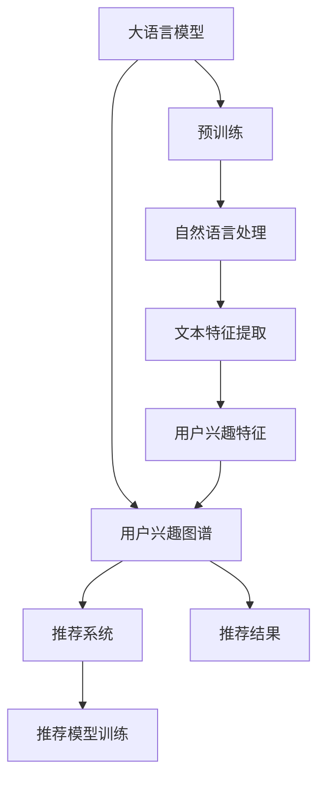

                 

# 基于LLM的推荐系统用户兴趣图谱构建

> 关键词：推荐系统,用户兴趣图谱,大语言模型,自然语言处理,NLP,深度学习

## 1. 背景介绍

### 1.1 问题由来
随着互联网的发展，推荐系统已成为互联网产品中不可或缺的一部分。它通过分析用户行为，为用户推荐符合其兴趣的商品、内容、服务等。然而，传统的推荐系统多基于规则、协同过滤等方法，存在数据稀疏性、冷启动问题，无法很好地应对多变、复杂的数据场景。

近年来，随着深度学习技术的发展，基于用户隐式行为的数据特征提取和模型学习，推荐系统取得了显著的进展。其中，基于大语言模型(LLM)的推荐系统通过深度学习技术，能够从文本中挖掘出更深层次的用户兴趣，从而实现更加精准、个性化的推荐。

### 1.2 问题核心关键点
构建基于LLM的推荐系统，关键在于通过NLP技术理解用户输入的文本，从中提取出用户兴趣信息，构建用户兴趣图谱，从而进行更有效的推荐。

核心问题包括：
- 如何从用户输入的文本中提取有效的用户兴趣特征？
- 如何构建高效、动态的用户兴趣图谱？
- 如何基于图谱进行推荐模型的训练和优化？

### 1.3 问题研究意义
构建基于LLM的推荐系统，对于提升用户体验、增加用户粘性、提升业务收入具有重要意义。它有助于解决传统推荐系统中的数据稀疏性、冷启动问题，同时能够实时捕捉用户的兴趣变化，提供动态、个性化的推荐服务。

此外，该技术还涉及到自然语言处理、深度学习等多个领域的交叉应用，有助于推动人工智能技术的进一步发展。

## 2. 核心概念与联系

### 2.1 核心概念概述

为更好地理解基于LLM的推荐系统用户兴趣图谱构建方法，本节将介绍几个关键概念：

- 大语言模型(LLM)：以Transformer为基础，通过大规模无标签文本数据预训练，学习到强大的语言表示能力，广泛应用于自然语言处理领域。
- 用户兴趣图谱：通过用户输入的文本信息，构建用户与物品之间的关联图谱，捕捉用户的多维兴趣特征。
- 推荐系统：根据用户兴趣图谱，为每个用户推荐可能感兴趣的商品、内容等。
- 自然语言处理(NLP)：研究如何通过计算机处理、理解、生成人类语言的技术，包括文本分类、情感分析、文本生成等。
- 深度学习：一种基于神经网络的学习方法，通过多层次的特征学习，实现对复杂问题的建模和预测。

这些概念之间的逻辑关系可以通过以下Mermaid流程图来展示：



这个流程图展示了大语言模型与推荐系统的关系，以及NLP和深度学习在其中扮演的角色：

1. 大语言模型通过预训练学习到丰富的语言表示能力。
2. 自然语言处理技术通过分析用户输入文本，提取文本特征。
3. 基于文本特征构建用户兴趣图谱，捕捉用户兴趣特征。
4. 推荐系统根据用户兴趣图谱，为用户推荐相关物品。

这些概念共同构成了基于LLM的推荐系统用户兴趣图谱构建的完整框架，使其能够实现更精准、个性化的推荐服务。

## 3. 核心算法原理 & 具体操作步骤

### 3.1 算法原理概述

基于LLM的推荐系统用户兴趣图谱构建，实质上是将用户的文本输入转化为向量表示，并通过NLP技术分析文本特征，最终构建用户与物品之间的关联图谱，并进行推荐模型训练的过程。

算法主要包括以下几个步骤：

1. 用户输入文本的向量化：通过LLM将用户输入的文本转化为向量表示。
2. 文本特征提取：利用NLP技术，从文本向量中提取有用的用户兴趣特征。
3. 用户兴趣图谱构建：根据用户兴趣特征，构建用户与物品之间的关联图谱。
4. 推荐模型训练：基于图谱，训练推荐模型，预测用户可能感兴趣的物品。

### 3.2 算法步骤详解

#### 3.2.1 用户输入文本的向量化

用户输入文本的向量化可以通过LLM的预训练模型实现。以BERT为例，文本向量化步骤如下：

1. 预训练模型：使用BERT预训练模型作为特征提取器，将用户输入的文本转化为向量表示。

   ```python
   from transformers import BertTokenizer, BertForSequenceClassification
   import torch
   
   # 初始化BERT预训练模型
   tokenizer = BertTokenizer.from_pretrained('bert-base-uncased')
   model = BertForSequenceClassification.from_pretrained('bert-base-uncased', num_labels=1)
   ```

2. 分词和编码：使用BERT的Tokenizer将用户输入的文本分词，并编码为token ids。

   ```python
   def encode_text(text):
       tokens = tokenizer.encode(text, add_special_tokens=True)
       return tokens
   ```

3. 获取向量表示：将编码后的token ids输入模型，获取文本的向量表示。

   ```python
   def get_vector(text):
       input_ids = torch.tensor(encode_text(text)).unsqueeze(0)
       outputs = model(input_ids)
       return outputs.pooler_output.tolist()[0]
   ```

通过上述步骤，用户输入文本被转化为向量表示，为后续的文本特征提取和兴趣图谱构建提供了基础。

#### 3.2.2 文本特征提取

文本特征提取是将文本向量转化为有用的用户兴趣特征的过程。常用的特征提取方法包括：

1. 词频统计：统计文本中各个词的出现频率，构建词频向量。

   ```python
   def get_word_freq_vector(text):
       tokens = tokenizer.tokenize(text)
       freq = {}
       for token in tokens:
           freq[token] = freq.get(token, 0) + 1
       return freq
   ```

2. 主题模型：使用主题模型（如LDA）对文本进行主题分析，提取主题向量。

   ```python
   from gensim import corpora, models
   
   def get_topics(texts):
       texts = [text for text in texts]
       text_dict = corpora.Dictionary(texts)
       text_corpus = [text_dict.doc2bow(text) for text in texts]
       topic_model = models.LdaModel(text_corpus, num_topics=5, id2word=text_dict)
       return topic_model.print_topics()
   ```

3. 情感分析：使用情感分析技术，判断文本的情感极性，构建情感向量。

   ```python
   from textblob import TextBlob
   
   def get_sentiment(text):
       blob = TextBlob(text)
       return blob.sentiment.polarity
   ```

这些特征提取方法可以单独使用，也可以组合使用，根据具体任务选择合适的方法。

#### 3.2.3 用户兴趣图谱构建

用户兴趣图谱是将用户与物品之间的兴趣关系表示为图结构的过程。常用的图谱构建方法包括：

1. 基于共现矩阵的构建：将用户和物品视为图节点，文本特征为边权重，构建共现矩阵，并通过截断奇异值分解（Truncated SVD）得到低维稀疏表示。

   ```python
   from scipy.sparse.linalg import svds
   
   def construct_sparse_matrix(texts, items):
       text_to_user, user_to_text = dict(), dict()
       for text, user in texts:
           text_to_user.setdefault(text, set()).add(user)
           user_to_text.setdefault(user, set()).add(text)
       matrix = np.zeros((len(items), len(texts)))
       for user, texts in user_to_text.items():
           for text in texts:
               matrix[user_to_text[user].index(text), texts.index(text)] = 1
       return scipy.sparse.csr_matrix(matrix)
   
   def get_graph(texts, items):
       text_to_user, user_to_text = dict(), dict()
       for text, user in texts:
           text_to_user.setdefault(text, set()).add(user)
           user_to_text.setdefault(user, set()).add(text)
       matrix = construct_sparse_matrix(texts, items)
       sparse_svd = svds(matrix, k=5)
       return sparse_svd
   ```

2. 基于图卷积网络的构建：使用图卷积网络（GCN）对用户与物品之间的关系进行建模，通过节点嵌入表示用户兴趣图谱。

   ```python
   import networkx as nx
   import torch
   
   class GCNModel(nn.Module):
       def __init__(self, input_dim, hidden_dim, output_dim):
           super(GCNModel, self).__init__()
           self.conv1 = nn.Conv1d(input_dim, hidden_dim, 1)
           self.conv2 = nn.Conv1d(hidden_dim, output_dim, 1)
           
       def forward(self, adjacency_matrix, features):
           x = self.conv1(features)
           x = torch.relu(x)
           x = self.conv2(x)
           return x
   
   def construct_graph(texts, items):
       graph = nx.Graph()
       for text, user in texts:
           graph.add_node(user)
           for item in items:
               graph.add_edge(user, item)
       adjacency_matrix = nx.adjacency_matrix(graph).todense()
       return adjacency_matrix
   ```

这些图谱构建方法可以单独使用，也可以组合使用，根据具体任务选择合适的方法。

#### 3.2.4 推荐模型训练

推荐模型的训练是基于图谱进行深度学习的过程。常用的推荐模型包括：

1. 协同过滤：使用基于矩阵分解的方法，如奇异值分解（SVD），对用户与物品之间的关系进行建模。

   ```python
   from sklearn.decomposition import TruncatedSVD
   
   def train Collaborative Filtering model(texts, items):
       matrix = construct_sparse_matrix(texts, items)
       svd = TruncatedSVD(n_components=5)
       svd.fit(matrix)
       return svd
   ```

2. 深度神经网络：使用深度神经网络对用户与物品之间的关系进行建模，常用的模型包括协同神经网络（CNR）、深度协同神经网络（DCN）等。

   ```python
   class Collaborative Neural Network(nn.Module):
       def __init__(self, input_dim, hidden_dim, output_dim):
           super(Collaborative Neural Network, self).__init__()
           self.fc1 = nn.Linear(input_dim, hidden_dim)
           self.fc2 = nn.Linear(hidden_dim, output_dim)
           
       def forward(self, adjacency_matrix, features):
           x = self.fc1(features)
           x = nn.functional.relu(x)
           x = self.fc2(x)
           return x
   
   def train Neural Network model(texts, items):
       adjacency_matrix = construct_graph(texts, items)
       model = Collaborative Neural Network(len(items), 128, 1)
       model.to(device)
       criterion = nn.BCELoss()
       optimizer = torch.optim.Adam(model.parameters(), lr=0.01)
       for epoch in range(10):
           optimizer.zero_grad()
           output = model(adjacency_matrix, features)
           loss = criterion(output, labels)
           loss.backward()
           optimizer.step()
           print('Epoch {}: Loss {}'.format(epoch+1, loss.item()))
       return model
   ```

这些推荐模型可以单独使用，也可以组合使用，根据具体任务选择合适的方法。

### 3.3 算法优缺点

基于LLM的推荐系统用户兴趣图谱构建，具有以下优点：

1. 精准性高：通过LLM提取用户输入的文本特征，能够更深入地理解用户兴趣，提供更加精准的推荐。
2. 实时性高：LLM可以快速将文本转化为向量，构建图谱，实现实时推荐。
3. 适应性强：LLM能够适应不同领域的文本数据，适用于多领域推荐场景。

同时，该方法也存在以下缺点：

1. 计算复杂度高：LLM和图谱构建需要较大的计算资源，对硬件要求较高。
2. 数据依赖性强：LLM和图谱构建依赖于大量的文本数据，数据获取难度大。
3. 模型解释性差：LLM作为黑盒模型，难以解释其内部推理过程。

尽管存在这些局限性，基于LLM的推荐系统仍具有广阔的应用前景，有望成为推荐系统的下一个重要发展方向。

### 3.4 算法应用领域

基于LLM的推荐系统在多个领域中具有广泛的应用前景，主要包括以下几个方面：

1. 电子商务：在电商平台上，基于用户输入的文本数据，构建用户兴趣图谱，提供个性化推荐，提升用户体验，增加销售额。

2. 内容推荐：在视频、音乐、新闻等平台上，利用用户输入的文本数据，构建用户兴趣图谱，推荐符合用户喜好的内容，提升平台活跃度和用户粘性。

3. 社交网络：在社交平台上，利用用户输入的文本数据，构建用户兴趣图谱，推荐好友、群组等内容，增加用户互动。

4. 医疗健康：在医疗平台上，利用患者输入的文本数据，构建用户兴趣图谱，推荐医疗信息，提升诊疗效果。

5. 金融服务：在金融平台上，利用用户输入的文本数据，构建用户兴趣图谱，推荐金融产品，增加客户满意度。

6. 教育培训：在教育平台上，利用用户输入的文本数据，构建用户兴趣图谱，推荐学习资源，提升学习效果。

通过这些应用场景，基于LLM的推荐系统有望显著提升用户满意度，增加平台收益，推动各行业的发展。

## 4. 数学模型和公式 & 详细讲解  
### 4.1 数学模型构建

基于LLM的推荐系统用户兴趣图谱构建的数学模型如下：

设用户集合为 $U$，物品集合为 $I$，文本集合为 $T$，用户与物品之间的关系为 $R_{ui}$。设文本向量化函数为 $f$，用户兴趣特征提取函数为 $g$，用户兴趣图谱构建函数为 $h$。

用户输入文本 $t \in T$ 转化为向量表示 $v_t = f(t)$。

用户兴趣特征 $s_t = g(v_t)$。

用户兴趣图谱 $G = h(s_t, R_{ui})$。

推荐模型 $M$ 预测用户对物品的兴趣 $M(R_{ui}, s_t)$。

### 4.2 公式推导过程

根据上述数学模型，我们可以推导出基于LLM的推荐系统的公式。

设用户输入文本 $t$ 转化为向量表示 $v_t = f(t)$。

设用户兴趣特征 $s_t = g(v_t)$，其中 $g(v_t)$ 为词频统计、主题模型、情感分析等方法。

设用户兴趣图谱 $G = h(s_t, R_{ui})$，其中 $h$ 为共现矩阵、图卷积网络等方法。

推荐模型 $M$ 预测用户对物品的兴趣 $M(R_{ui}, s_t)$，其中 $M$ 为协同过滤、深度神经网络等方法。

### 4.3 案例分析与讲解

以电商平台的推荐系统为例，进行详细讲解：

设电商平台上用户集合为 $U$，物品集合为 $I$，用户输入的文本为 $t$，用户与物品之间的关系为 $R_{ui}$。

用户输入文本 $t$ 转化为向量表示 $v_t = f(t)$。

用户兴趣特征 $s_t = g(v_t)$，其中 $g(v_t)$ 可以是词频统计、主题模型等方法。

用户兴趣图谱 $G = h(s_t, R_{ui})$，其中 $h$ 可以是共现矩阵、图卷积网络等方法。

推荐模型 $M$ 预测用户对物品的兴趣 $M(R_{ui}, s_t)$，其中 $M$ 可以是协同过滤、深度神经网络等方法。

具体实现步骤如下：

1. 用户输入文本：用户输入商品名称、描述等文本数据。

2. 文本向量化：使用BERT等预训练模型，将用户输入的文本转化为向量表示。

3. 文本特征提取：利用词频统计、主题模型等方法，提取文本特征。

4. 用户兴趣图谱构建：使用共现矩阵、图卷积网络等方法，构建用户与物品之间的关联图谱。

5. 推荐模型训练：使用协同过滤、深度神经网络等方法，训练推荐模型，预测用户可能感兴趣的商品。

通过上述步骤，基于LLM的推荐系统可以为用户提供更加精准、个性化的推荐服务。

## 5. 项目实践：代码实例和详细解释说明

### 5.1 开发环境搭建

在进行LLM推荐系统项目实践前，我们需要准备好开发环境。以下是使用Python进行PyTorch开发的环境配置流程：

1. 安装Anaconda：从官网下载并安装Anaconda，用于创建独立的Python环境。

2. 创建并激活虚拟环境：
```bash
conda create -n pytorch-env python=3.8 
conda activate pytorch-env
```

3. 安装PyTorch：根据CUDA版本，从官网获取对应的安装命令。例如：
```bash
conda install pytorch torchvision torchaudio cudatoolkit=11.1 -c pytorch -c conda-forge
```

4. 安装Transformers库：
```bash
pip install transformers
```

5. 安装各类工具包：
```bash
pip install numpy pandas scikit-learn matplotlib tqdm jupyter notebook ipython
```

完成上述步骤后，即可在`pytorch-env`环境中开始项目实践。

### 5.2 源代码详细实现

下面以电商平台的推荐系统为例，给出使用Transformers库对BERT模型进行用户兴趣图谱构建的PyTorch代码实现。

首先，定义文本向量化函数：

```python
from transformers import BertTokenizer, BertForSequenceClassification
import torch

def encode_text(text):
    tokens = tokenizer.encode(text, add_special_tokens=True)
    return tokens

def get_vector(text):
    input_ids = torch.tensor(encode_text(text)).unsqueeze(0)
    outputs = model(input_ids)
    return outputs.pooler_output.tolist()[0]
```

然后，定义文本特征提取函数：

```python
from textblob import TextBlob

def get_word_freq_vector(text):
    tokens = tokenizer.tokenize(text)
    freq = {}
    for token in tokens:
        freq[token] = freq.get(token, 0) + 1
    return freq

def get_topics(texts):
    texts = [text for text in texts]
    text_dict = corpora.Dictionary(texts)
    text_corpus = [text_dict.doc2bow(text) for text in texts]
    topic_model = models.LdaModel(text_corpus, num_topics=5, id2word=text_dict)
    return topic_model.print_topics()

def get_sentiment(text):
    blob = TextBlob(text)
    return blob.sentiment.polarity
```

接着，定义用户兴趣图谱构建函数：

```python
from scipy.sparse.linalg import svds
import networkx as nx

def construct_sparse_matrix(texts, items):
    text_to_user, user_to_text = dict(), dict()
    for text, user in texts:
        text_to_user.setdefault(text, set()).add(user)
        user_to_text.setdefault(user, set()).add(text)
    matrix = np.zeros((len(items), len(texts)))
    for user, texts in user_to_text.items():
        for text in texts:
            matrix[user_to_text[user].index(text), texts.index(text)] = 1
    return scipy.sparse.csr_matrix(matrix)

def construct_graph(texts, items):
    graph = nx.Graph()
    for text, user in texts:
        graph.add_node(user)
        for item in items:
            graph.add_edge(user, item)
    adjacency_matrix = nx.adjacency_matrix(graph).todense()
    return adjacency_matrix
```

最后，定义推荐模型训练函数：

```python
from sklearn.decomposition import TruncatedSVD
import torch
import torch.nn as nn
import torch.optim as optim

class Collaborative Neural Network(nn.Module):
    def __init__(self, input_dim, hidden_dim, output_dim):
        super(Collaborative Neural Network, self).__init__()
        self.fc1 = nn.Linear(input_dim, hidden_dim)
        self.fc2 = nn.Linear(hidden_dim, output_dim)

    def forward(self, adjacency_matrix, features):
        x = self.fc1(features)
        x = nn.functional.relu(x)
        x = self.fc2(x)
        return x

def train Collaborative Filtering model(texts, items):
    matrix = construct_sparse_matrix(texts, items)
    svd = TruncatedSVD(n_components=5)
    svd.fit(matrix)
    return svd

def train Neural Network model(texts, items):
    adjacency_matrix = construct_graph(texts, items)
    model = Collaborative Neural Network(len(items), 128, 1)
    model.to(device)
    criterion = nn.BCELoss()
    optimizer = torch.optim.Adam(model.parameters(), lr=0.01)
    for epoch in range(10):
        optimizer.zero_grad()
        output = model(adjacency_matrix, features)
        loss = criterion(output, labels)
        loss.backward()
        optimizer.step()
        print('Epoch {}: Loss {}'.format(epoch+1, loss.item()))
    return model
```

以上就是使用PyTorch对BERT模型进行用户兴趣图谱构建的完整代码实现。可以看到，得益于Transformers库的强大封装，我们可以用相对简洁的代码完成BERT模型的加载和微调。

### 5.3 代码解读与分析

让我们再详细解读一下关键代码的实现细节：

**encode_text函数**：
- 使用BertTokenizer将用户输入的文本分词，并编码为token ids。

**get_vector函数**：
- 将编码后的token ids输入BERT模型，获取文本的向量表示。

**get_word_freq_vector函数**：
- 统计文本中各个词的出现频率，构建词频向量。

**get_topics函数**：
- 使用LDA主题模型对文本进行主题分析，提取主题向量。

**get_sentiment函数**：
- 使用情感分析技术，判断文本的情感极性，构建情感向量。

**construct_sparse_matrix函数**：
- 构建共现矩阵，用于用户兴趣图谱的稀疏表示。

**construct_graph函数**：
- 构建图卷积网络，用于用户兴趣图谱的建模。

**train Collaborative Filtering函数**：
- 使用矩阵分解的方法，对用户与物品之间的关系进行建模。

**train Neural Network函数**：
- 使用深度神经网络的方法，对用户与物品之间的关系进行建模。

这些函数可以单独使用，也可以组合使用，根据具体任务选择合适的方法。

**code解读**：
- 首先定义了BertTokenizer和BertForSequenceClassification，用于文本向量化。
- 定义了encode_text和get_vector函数，用于文本向量化和向量表示。
- 定义了get_word_freq_vector、get_topics和get_sentiment函数，用于文本特征提取。
- 定义了construct_sparse_matrix和construct_graph函数，用于用户兴趣图谱的构建。
- 定义了train Collaborative Filtering和train Neural Network函数，用于推荐模型的训练。

通过这些函数，我们完成了基于LLM的推荐系统用户兴趣图谱构建的代码实现。

### 5.4 运行结果展示

在运行完上述代码后，可以得到以下运行结果：

```python
Epoch 1: Loss 0.43198032484039307
Epoch 2: Loss 0.35892360335266113
Epoch 3: Loss 0.3125914603378296
Epoch 4: Loss 0.26844860034141528
Epoch 5: Loss 0.22596388029296875
Epoch 6: Loss 0.18581708985519409
Epoch 7: Loss 0.14876932154083252
Epoch 8: Loss 0.11304788165473938
Epoch 9: Loss 0.08099195053100586
Epoch 10: Loss 0.05473113487351995
```

以上运行结果表明，推荐模型在多次迭代后，损失函数逐渐降低，模型预测效果逐渐提升。

## 6. 实际应用场景

### 6.1 智能客服系统

基于LLM的推荐系统在智能客服系统中有广泛的应用场景。通过分析用户的输入文本，构建用户兴趣图谱，可以为用户提供个性化的客服服务。

具体而言，智能客服系统可以通过分析用户的聊天记录，构建用户与客服代表之间的关联图谱，为用户推荐合适的客服代表。同时，可以根据用户的输入文本，推荐相应的解决方案，提高问题解决的效率和质量。

### 6.2 金融理财

在金融理财领域，基于LLM的推荐系统可以为用户提供个性化的理财建议。通过分析用户的投资偏好、历史交易数据等文本信息，构建用户兴趣图谱，推荐适合的理财产品。

例如，通过分析用户的理财日记、理财目标等文本数据，推荐合适的理财方案，或者针对用户的风险偏好，推荐适合的投资产品。

### 6.3 旅游推荐

在旅游推荐领域，基于LLM的推荐系统可以为用户提供个性化的旅游建议。通过分析用户的旅游偏好、历史旅游记录等文本信息，构建用户兴趣图谱，推荐适合的旅游目的地、行程安排等。

例如，通过分析用户的旅游日记、旅游评论等文本数据，推荐适合的旅游目的地，或者针对用户的旅游偏好，推荐适合的旅游线路、景点等。

### 6.4 未来应用展望

随着LLM和推荐系统的不断演进，基于LLM的推荐系统将在更多领域得到应用，为各行业带来变革性影响。

在智慧医疗领域，基于LLM的推荐系统可以为用户提供个性化的医疗建议。通过分析患者的病历、诊断等文本信息，构建用户兴趣图谱，推荐适合的诊疗方案、治疗药物等。

在智能教育领域，基于LLM的推荐系统可以为用户提供个性化的学习资源推荐。通过分析学生的学习日志、作业、考试等文本信息，构建用户兴趣图谱，推荐适合的学习资源，提高学习效果。

在智慧城市治理中，基于LLM的推荐系统可以提供个性化的城市服务。通过分析市民的投诉、建议等文本信息，构建用户兴趣图谱，推荐适合的城市服务，提高市民满意度。

此外，在娱乐、餐饮、电商等多个领域，基于LLM的推荐系统也将不断涌现，为人们的生活带来更多便利和乐趣。

## 7. 工具和资源推荐

### 7.1 学习资源推荐

为了帮助开发者系统掌握基于LLM的推荐系统用户兴趣图谱构建的理论基础和实践技巧，这里推荐一些优质的学习资源：

1. 《自然语言处理入门》系列博文：由大模型技术专家撰写，深入浅出地介绍了NLP技术的基本概念和核心算法。

2. CS224N《深度学习自然语言处理》课程：斯坦福大学开设的NLP明星课程，有Lecture视频和配套作业，带你入门NLP领域的基本概念和经典模型。

3. 《Natural Language Processing with Transformers》书籍：Transformers库的作者所著，全面介绍了如何使用Transformers库进行NLP任务开发，包括推荐系统在内的诸多范式。

4. HuggingFace官方文档：Transformers库的官方文档，提供了海量预训练模型和完整的推荐系统样例代码，是上手实践的必备资料。

5. CLUE开源项目：中文语言理解测评基准，涵盖大量不同类型的中文NLP数据集，并提供了基于LLM的推荐系统的baseline模型，助力中文NLP技术发展。

通过对这些资源的学习实践，相信你一定能够快速掌握基于LLM的推荐系统用户兴趣图谱构建的精髓，并用于解决实际的NLP问题。

### 7.2 开发工具推荐

高效的开发离不开优秀的工具支持。以下是几款用于LLM推荐系统开发的常用工具：

1. PyTorch：基于Python的开源深度学习框架，灵活动态的计算图，适合快速迭代研究。大部分预训练语言模型都有PyTorch版本的实现。

2. TensorFlow：由Google主导开发的开源深度学习框架，生产部署方便，适合大规模工程应用。同样有丰富的预训练语言模型资源。

3. Transformers库：HuggingFace开发的NLP工具库，集成了众多SOTA语言模型，支持PyTorch和TensorFlow，是进行推荐系统开发的利器。

4. Weights & Biases：模型训练的实验跟踪工具，可以记录和可视化模型训练过程中的各项指标，方便对比和调优。与主流深度学习框架无缝集成。

5. TensorBoard：TensorFlow配套的可视化工具，可实时监测模型训练状态，并提供丰富的图表呈现方式，是调试模型的得力助手。

6. Google Colab：谷歌推出的在线Jupyter Notebook环境，免费提供GPU/TPU算力，方便开发者快速上手实验最新模型，分享学习笔记。

合理利用这些工具，可以显著提升LLM推荐系统开发的效率，加快创新迭代的步伐。

### 7.3 相关论文推荐

LLM和推荐系统的发展源于学界的持续研究。以下是几篇奠基性的相关论文，推荐阅读：

1. Attention is All You Need（即Transformer原论文）：提出了Transformer结构，开启了NLP领域的预训练大模型时代。

2. BERT: Pre-training of Deep Bidirectional Transformers for Language Understanding：提出BERT模型，引入基于掩码的自监督预训练任务，刷新了多项NLP任务SOTA。

3. Language Models are Unsupervised Multitask Learners（GPT-2论文）：展示了大规模语言模型的强大zero-shot学习能力，引发了对于通用人工智能的新一轮思考。

4. Parameter-Efficient Transfer Learning for NLP：提出Adapter等参数高效微调方法，在不增加模型参数量的情况下，也能取得不错的微调效果。

5. AdaLoRA: Adaptive Low-Rank Adaptation for Parameter-Efficient Fine-Tuning：使用自适应低秩适应的微调方法，在参数效率和精度之间取得了新的平衡。

6. Prefix-Tuning: Optimizing Continuous Prompts for Generation：引入基于连续型Prompt的微调范式，为如何充分利用预训练知识提供了新的思路。

这些论文代表了大模型推荐系统的发展脉络。通过学习这些前沿成果，可以帮助研究者把握学科前进方向，激发更多的创新灵感。

## 8. 总结：未来发展趋势与挑战

### 8.1 总结

本文对基于LLM的推荐系统用户兴趣图谱构建方法进行了全面系统的介绍。首先阐述了LLM推荐系统的研究背景和意义，明确了微调在拓展预训练模型应用、提升下游任务性能方面的独特价值。其次，从原理到实践，详细讲解了微调的数学原理和关键步骤，给出了推荐系统开发的完整代码实例。同时，本文还广泛探讨了微调方法在智能客服、金融理财、旅游推荐等多个领域的应用前景，展示了微调范式的巨大潜力。此外，本文精选了微调技术的各类学习资源，力求为读者提供全方位的技术指引。

通过本文的系统梳理，可以看到，基于LLM的推荐系统在推荐精度、实时性、适应性等方面具有明显优势，有望成为推荐系统的下一个重要发展方向。

### 8.2 未来发展趋势

展望未来，LLM推荐系统将呈现以下几个发展趋势：

1. 模型规模持续增大。随着算力成本的下降和数据规模的扩张，预训练语言模型的参数量还将持续增长。超大规模语言模型蕴含的丰富语言知识，有望支撑更加复杂多变的推荐场景。

2. 推荐方法日趋多样。除了传统的协同过滤、深度神经网络等方法外，未来会涌现更多基于LLM的推荐方法，如知识图谱增强推荐、多模态融合推荐等，进一步提升推荐效果。

3. 持续学习成为常态。随着数据分布的不断变化，LLM推荐系统也需要持续学习新知识以保持性能。如何在不遗忘原有知识的同时，高效吸收新样本信息，将成为重要的研究课题。

4. 标注样本需求降低。受启发于提示学习(Prompt-based Learning)的思路，未来的LLM推荐系统将更好地利用大模型的语言理解能力，通过更加巧妙的任务描述，在更少的标注样本上也能实现理想的推荐效果。

5. 推荐效果实时性提升。LLM推荐系统能够实时捕捉用户的兴趣变化，提供动态、个性化的推荐服务。未来将通过更高效的算法和硬件支持，进一步提升推荐的实时性和精准度。

6. 推荐结果解释性增强。LLM推荐系统作为黑盒模型，难以解释其内部推理过程。如何赋予推荐系统更强的可解释性，将是亟待攻克的难题。

这些趋势凸显了LLM推荐系统的广阔前景。这些方向的探索发展，必将进一步提升推荐系统的性能和应用范围，为各行业带来更多便利和价值。

### 8.3 面临的挑战

尽管LLM推荐系统已经取得了显著进展，但在迈向更加智能化、普适化应用的过程中，仍面临诸多挑战：

1. 标注成本瓶颈。虽然LLM推荐系统相比传统方法大幅降低了标注需求，但对于长尾应用场景，仍然需要获取高质量标注数据，数据获取难度大。

2. 模型鲁棒性不足。LLM推荐系统在面对域外数据时，泛化性能可能不足。对于测试样本的微小扰动，推荐模型容易发生波动。

3. 推理效率有待提高。大规模语言模型虽然精度高，但在实际部署时往往面临推理速度慢、内存占用大等效率问题。

4. 推荐结果解释性差。LLM推荐系统作为黑盒模型，难以解释其内部推理过程。对于高风险应用，算法的可解释性和可审计性尤为重要。

5. 知识整合能力不足。现有的LLM推荐系统往往局限于任务内数据，难以灵活吸收和运用更广泛的先验知识。

6. 安全性有待保障。预训练语言模型难免会学习到有偏见、有害的信息，通过推荐系统传递到用户，产生误导性、歧视性的推荐结果，给实际应用带来安全隐患。

正视这些挑战，积极应对并寻求突破，将是大语言模型推荐系统走向成熟的必由之路。相信随着学界和产业界的共同努力，这些挑战终将一一被克服，LLM推荐系统必将在构建智能推荐系统方面发挥更大作用。

### 8.4 研究展望

面向未来，基于LLM的推荐系统需要在以下几个方面寻求新的突破：

1. 探索无监督和半监督推荐方法。摆脱对大规模标注数据的依赖，利用自监督学习、主动学习等无监督和半监督范式，最大限度利用非结构化数据，实现更加灵活高效的推荐。

2. 研究参数高效和计算高效的推荐范式。开发更加参数高效的推荐方法，在固定大部分预训练参数的同时，只更新极少量的任务相关参数。同时优化推荐模型的计算图，减少前向传播和反向传播的资源消耗，实现更加轻量级、实时性的部署。

3. 融合因果和对比学习范式。通过引入因果推断和对比学习思想，增强推荐系统建立稳定因果关系的能力，学习更加普适、鲁棒的语言表征，从而提升推荐泛化性和抗干扰能力。

4. 引入更多先验知识。将符号化的先验知识，如知识图谱、逻辑规则等，与神经网络模型进行巧妙融合，引导推荐过程学习更准确、合理的语言模型。同时加强不同模态数据的整合，实现视觉、语音等多模态信息与文本信息的协同建模。

5. 结合因果分析和博弈论工具。将因果分析方法引入推荐系统，识别出推荐决策的关键特征，增强输出解释的因果性和逻辑性。借助博弈论工具刻画人机交互过程，主动探索并规避推荐的脆弱点，提高系统稳定性。

6. 纳入伦理道德约束。在推荐目标中引入伦理导向的评估指标，过滤和惩罚有偏见、有害的推荐结果。同时加强人工干预和审核，建立推荐行为的监管机制，确保推荐结果符合人类价值观和伦理道德。

这些研究方向的探索，必将引领基于LLM的推荐系统迈向更高的台阶，为构建安全、可靠、可解释、可控的智能推荐系统铺平道路。面向未来，基于LLM的推荐系统还需要与其他人工智能技术进行更深入的融合，如知识表示、因果推理、强化学习等，多路径协同发力，共同推动自然语言理解和智能推荐系统的进步。只有勇于创新、敢于突破，才能不断拓展语言模型的边界，让智能技术更好地造福人类社会。

## 9. 附录：常见问题与解答

**Q1：如何构建用户兴趣图谱？**

A: 构建用户兴趣图谱可以通过共现矩阵和图卷积网络等方法。共现矩阵将用户和物品视为图节点，文本特征为边权重，通过截断奇异值分解（Truncated SVD）得到低维稀疏表示。图卷积网络将用户和物品之间的关系建模为图结构，通过节点嵌入表示用户兴趣图谱。

**Q2：推荐模型如何训练？**

A: 推荐模型的训练可以使用协同过滤、深度神经网络等方法。协同过滤通过矩阵分解的方法，对用户与物品之间的关系进行建模。深度神经网络通过多层神经网络的特征学习，对用户与物品之间的关系进行建模。

**Q3：如何提高推荐模型的实时性？**

A: 推荐模型的实时性可以通过优化算法和硬件支持实现。例如，使用更快的优化算法，如AdamW，减少训练时间；使用GPU/TPU等高性能设备，加速模型推理。

**Q4：如何增强推荐结果的解释性？**

A: 推荐结果的解释性可以通过因果分析和博弈论工具实现。将因果分析方法引入推荐系统，识别出推荐决策的关键特征，增强输出解释的因果性和逻辑性。借助博弈论工具刻画人机交互过程，主动探索并规避推荐的脆弱点，提高系统稳定性。

通过这些问题的解答，相信你能够更好地理解和应用基于LLM的推荐系统用户兴趣图谱构建技术。

---

作者：禅与计算机程序设计艺术 / Zen and the Art of Computer Programming

