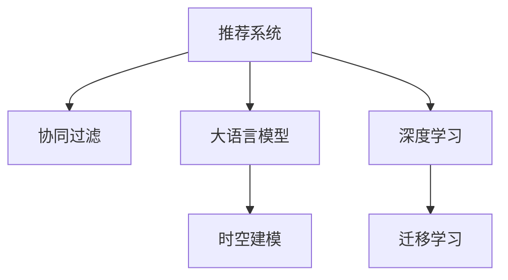

                 

# 基于LLM的推荐系统用户兴趣时空建模

> 关键词：推荐系统,用户兴趣,大语言模型,时空建模,协同过滤,深度学习,迁移学习

## 1. 背景介绍

### 1.1 问题由来
在当今数字化时代，推荐系统（Recommender Systems）作为信息检索的重要手段，广泛应用于电商、社交、视频等多个领域。传统的推荐方法主要包括协同过滤（Collaborative Filtering）和基于内容的推荐（Content-based Recommendation）等，但随着数据量的激增和用户兴趣动态变化，这些方法的局限性逐步显现。

协同过滤方法主要依赖用户间的相似性或物品间的相似性，但当数据稀疏时，相似性难以计算，导致推荐效果不佳。而基于内容的推荐则过于简单，难以应对用户个性化和多变的兴趣。

为此，大语言模型（Large Language Models, LLMs）作为一种强大的文本理解工具，被引入到推荐系统中，以更好地理解和表达用户兴趣，并结合时空信息进行建模，提升推荐精度和效果。

### 1.2 问题核心关键点
基于大语言模型的推荐系统，其核心思想是利用LLM的强大语义理解能力，自动分析用户的文本描述、行为数据、背景信息等，建立用户兴趣的动态模型，并通过时间序列和空间位置等多维信息进行综合预测，生成个性化的推荐结果。

核心关键点包括：
- 大语言模型（LLM）：用于自动分析用户描述、行为等数据，获取用户兴趣语义表示。
- 时空建模：结合时间序列和空间位置信息，构建动态用户兴趣模型。
- 协同过滤：基于用户兴趣和物品相似性，生成推荐结果。
- 深度学习：利用深度神经网络进行复杂的语义建模和用户兴趣表达。
- 迁移学习：利用已有预训练模型的知识，加速新任务的学习。

这些关键点之间相互联系，共同构成了基于LLM的推荐系统的基本框架，使其能够更好地适应个性化和多变化的推荐需求。

## 2. 核心概念与联系

### 2.1 核心概念概述

为更好地理解基于LLM的推荐系统，本节将介绍几个密切相关的核心概念：

- 推荐系统（Recommender Systems）：通过分析用户的历史行为、兴趣和物品属性，预测用户可能感兴趣的新物品。
- 协同过滤（Collaborative Filtering）：利用用户和物品的相似性，进行推荐。
- 大语言模型（LLM）：能够自动理解自然语言文本，提取语义信息。
- 时空建模（Temporal and Spatial Modeling）：结合时间序列和空间位置信息，构建动态用户兴趣模型。
- 深度学习（Deep Learning）：利用神经网络进行复杂的数据建模和特征提取。
- 迁移学习（Transfer Learning）：利用已有模型的知识，加速新任务的学习。

这些核心概念之间的逻辑关系可以通过以下Mermaid流程图来展示：



这个流程图展示了大语言模型在推荐系统中的作用：

1. 推荐系统通过协同过滤等方法，构建用户-物品矩阵。
2. 大语言模型自动理解用户描述，提取语义信息。
3. 时空建模结合时间序列和空间位置信息，建立用户兴趣动态模型。
4. 深度学习利用神经网络，提取更复杂的用户兴趣特征。
5. 迁移学习利用已有模型的知识，加速新任务的学习。

这些概念共同构成了基于LLM的推荐系统的核心框架，使其能够更好地适应个性化和多变化的推荐需求。

## 3. 核心算法原理 & 具体操作步骤
### 3.1 算法原理概述

基于LLM的推荐系统，核心算法包括大语言模型的语义理解、时空建模和协同过滤三个部分。其核心思想是：利用LLM的强大语义理解能力，自动分析用户的文本描述、行为数据、背景信息等，建立用户兴趣的动态模型，并通过时间序列和空间位置等多维信息进行综合预测，生成个性化的推荐结果。

具体而言，算法原理如下：

1. 收集用户的历史行为数据，包括浏览、点击、收藏等。
2. 利用大语言模型（如BERT、GPT等）自动分析用户的文本描述，如用户评论、评价、反馈等，提取语义信息。
3. 结合时间序列和空间位置信息，构建动态用户兴趣模型，预测用户未来的行为和偏好。
4. 利用协同过滤方法，根据用户兴趣和物品相似性，生成推荐结果。

### 3.2 算法步骤详解

基于LLM的推荐系统通常包括以下关键步骤：

**Step 1: 准备数据集**

- 收集用户的历史行为数据，包括浏览、点击、收藏等行为。
- 收集用户描述数据，如评论、评价、反馈等。
- 选择合适的LLM预训练模型，如BERT、GPT等。
- 准备时空建模所需的时间序列和空间位置信息。

**Step 2: 大语言模型预训练**

- 利用选择的LLM模型，在用户描述数据上对其进行预训练，提取语义信息。
- 使用无监督学习方法，如掩码语言模型、Next Sentence Prediction等，预训练模型。
- 在预训练过程中，可以引入正则化技术，如L2正则、Dropout等，防止过拟合。

**Step 3: 时空建模**

- 结合时间序列和空间位置信息，构建动态用户兴趣模型。
- 使用LSTM、GRU等时间序列模型，对用户历史行为进行建模。
- 利用地理信息编码技术，如TF-IDF、Word2Vec等，提取空间位置特征。
- 将用户历史行为、时空位置特征等输入模型，生成用户兴趣动态模型。

**Step 4: 协同过滤推荐**

- 利用用户兴趣动态模型和物品相似性，进行协同过滤推荐。
- 计算用户和物品之间的相似度，如余弦相似度、Jaccard相似度等。
- 根据相似度矩阵，利用矩阵分解等方法，生成推荐结果。

**Step 5: 模型评估与优化**

- 使用AUC、RMSE、Precision、Recall等指标，评估推荐模型效果。
- 根据评估结果，调整模型参数和超参数，优化模型性能。
- 使用对抗样本、对抗训练等技术，提升模型鲁棒性。

### 3.3 算法优缺点

基于LLM的推荐系统具有以下优点：

1. 自动化语义理解：利用大语言模型自动提取用户兴趣语义信息，减少了人工标注的复杂度。
2. 动态建模：结合时间序列和空间位置信息，构建动态用户兴趣模型，更好地适应用户兴趣变化。
3. 多样化推荐：利用协同过滤和深度学习等方法，生成多样化、个性化的推荐结果。
4. 泛化能力强：LLM的预训练模型可以迁移到其他领域，加速新任务的学习。

同时，该方法也存在一定的局限性：

1. 计算成本高：大语言模型的预训练和时空建模都需要大量计算资源，成本较高。
2. 数据需求大：需要大量高质量的用户行为数据和用户描述数据，数据获取难度大。
3. 可解释性不足：推荐系统的决策过程较难解释，难以进行调试和优化。
4. 隐私问题：用户描述和行为数据的隐私保护是重要问题，需要谨慎处理。

尽管存在这些局限性，但就目前而言，基于LLM的推荐系统仍是大数据和用户多样化兴趣场景下的重要解决方案。未来相关研究的重点在于如何进一步降低计算成本，提高推荐系统的可解释性和隐私保护能力。

### 3.4 算法应用领域

基于LLM的推荐系统已经在电商、社交、视频等多个领域得到了广泛应用，具体应用领域包括：

1. 电商推荐：推荐用户可能感兴趣的商品、服务，提升用户体验和销售额。
2. 社交推荐：推荐用户可能感兴趣的内容、好友，增强社交互动和平台粘性。
3. 视频推荐：推荐用户可能感兴趣的视频内容，提升用户体验和平台活跃度。
4. 新闻推荐：推荐用户感兴趣的新闻、文章，提升内容访问量和用户满意度。
5. 音乐推荐：推荐用户可能感兴趣的音乐、歌单，提升音乐平台的活跃度和用户留存率。
6. 图书推荐：推荐用户可能感兴趣的图书，提升阅读体验和用户粘性。

除了以上这些经典应用外，大语言模型结合时空建模的推荐系统还在旅游、房产、财经等多个领域展现出了巨大的应用潜力，为各行业提供了新的数据驱动解决方案。

## 4. 数学模型和公式 & 详细讲解 & 举例说明

### 4.1 数学模型构建

基于LLM的推荐系统，其核心数学模型包括大语言模型的预训练、时空建模和协同过滤三个部分。

设用户描述为 $x_i$，物品描述为 $y_j$，用户兴趣动态模型为 $h_i(t)$，用户历史行为序列为 $a_i(t)$，用户地理位置为 $p_i$，时间序列为 $t$，物品相似性矩阵为 $S_{ij}$，推荐结果为 $r_{ij}$。

则推荐系统的数学模型可表示为：

$$
r_{ij} = f(h_i(t), a_i(t), p_i, t) \times S_{ij}
$$

其中 $f$ 为推荐函数，可表示为：

$$
f(h_i(t), a_i(t), p_i, t) = w_1h_i(t) + w_2a_i(t) + w_3p_i + w_4t + \epsilon
$$

其中 $w_1, w_2, w_3, w_4$ 为模型参数，$\epsilon$ 为噪声项。

### 4.2 公式推导过程

下面以基于BERT的推荐系统为例，详细推导其数学模型。

假设用户描述 $x_i$ 包含多个词向量 $v_{i1}, v_{i2}, ..., v_{in}$，物品描述 $y_j$ 也包含多个词向量 $v_{j1}, v_{j2}, ..., v_{jm}$。利用BERT预训练模型，将用户描述和物品描述转化为向量表示 $H_i$ 和 $Y_j$。

利用LSTM对用户历史行为序列 $a_i(t)$ 进行建模，得到动态用户兴趣模型 $h_i(t)$。

设用户地理位置为 $p_i$，时间序列为 $t$，利用地理信息编码技术和时间序列模型，提取空间位置特征 $P_i$ 和时间序列特征 $T_i$。

将用户兴趣动态模型 $h_i(t)$、空间位置特征 $P_i$ 和时间序列特征 $T_i$ 等输入推荐函数 $f$，生成推荐结果 $r_{ij}$。

利用协同过滤方法，根据用户和物品相似性矩阵 $S_{ij}$，生成最终推荐结果 $R_{i}$。

最终，基于BERT的推荐系统数学模型可表示为：

$$
R_i = \sum_{j=1}^{M} r_{ij}
$$

其中 $M$ 为物品总数。

### 4.3 案例分析与讲解

以某电商平台为例，分析基于LLM的推荐系统如何为用户推荐商品。

假设某用户 A 浏览了商品 $i_1, i_2, i_3, i_4$，且对商品 $i_3$ 进行了购买。根据用户的浏览和购买行为，收集用户描述数据 $x_A$，如“这件商品很好用”，物品描述数据 $y_{i_1}, y_{i_2}, y_{i_3}, y_{i_4}$，用户地理位置 $p_A$，时间序列 $t$。

利用BERT预训练模型，将用户描述和物品描述转化为向量表示 $H_A$ 和 $Y_{i_1}, Y_{i_2}, Y_{i_3}, Y_{i_4}$。

利用LSTM对用户历史行为序列 $a_A(t)$ 进行建模，得到动态用户兴趣模型 $h_A(t)$。

根据用户地理位置 $p_A$ 和时间序列 $t$，利用地理信息编码技术和时间序列模型，提取空间位置特征 $P_A$ 和时间序列特征 $T_A$。

将用户兴趣动态模型 $h_A(t)$、空间位置特征 $P_A$ 和时间序列特征 $T_A$ 等输入推荐函数 $f$，生成推荐结果 $r_{A1}, r_{A2}, r_{A3}, r_{A4}$。

利用协同过滤方法，根据用户和物品相似性矩阵 $S_{ij}$，生成最终推荐结果 $R_A = r_{A1} + r_{A2} + r_{A3} + r_{A4}$。

## 5. 项目实践：代码实例和详细解释说明
### 5.1 开发环境搭建

在进行LLM推荐系统开发前，我们需要准备好开发环境。以下是使用Python进行PyTorch开发的环境配置流程：

1. 安装Anaconda：从官网下载并安装Anaconda，用于创建独立的Python环境。

2. 创建并激活虚拟环境：
```bash
conda create -n llm-env python=3.8 
conda activate llm-env
```

3. 安装PyTorch：根据CUDA版本，从官网获取对应的安装命令。例如：
```bash
conda install pytorch torchvision torchaudio cudatoolkit=11.1 -c pytorch -c conda-forge
```

4. 安装PyTorch Lightning：
```bash
pip install pytorch-lightning
```

5. 安装Transformer库：
```bash
pip install transformers
```

6. 安装各类工具包：
```bash
pip install numpy pandas scikit-learn matplotlib tqdm jupyter notebook ipython
```

完成上述步骤后，即可在`llm-env`环境中开始开发实践。

### 5.2 源代码详细实现

下面以基于BERT的推荐系统为例，给出使用PyTorch Lightning进行用户兴趣时空建模的代码实现。

首先，定义数据处理函数：

```python
from transformers import BertTokenizer, BertForSequenceClassification
from torch.utils.data import Dataset, DataLoader
import torch

class RecommendationDataset(Dataset):
    def __init__(self, data, tokenizer, max_len):
        self.data = data
        self.tokenizer = tokenizer
        self.max_len = max_len
        
    def __len__(self):
        return len(self.data)
    
    def __getitem__(self, item):
        user_id, item_id, rating, time, location = self.data[item]
        user_sequence = [item_id] + [user_id] * (self.max_len - 1)
        user_sequence = [i+1 for i in range(len(user_sequence))] # 1-indexed
        
        item_sequence = [item_id] + [0] * (self.max_len - 1)
        item_sequence = [i+1 for i in range(len(item_sequence))] # 1-indexed
        
        input_ids = self.tokenizer(user_sequence, max_length=self.max_len, padding='max_length', truncation=True)["input_ids"]
        attention_mask = self.tokenizer(user_sequence, max_length=self.max_len, padding='max_length', truncation=True)["attention_mask"]
        
        input_ids = input_ids[0]
        attention_mask = attention_mask[0]
        
        input_ids = torch.tensor(input_ids).unsqueeze(0)
        attention_mask = torch.tensor(attention_mask).unsqueeze(0)
        
        rating = torch.tensor(rating, dtype=torch.float)
        time = torch.tensor(time, dtype=torch.float)
        location = self.tokenizer(location, max_length=self.max_len, padding='max_length', truncation=True)["input_ids"]
        location = torch.tensor(location[0], dtype=torch.long)
        
        return {'input_ids': input_ids, 
                'attention_mask': attention_mask,
                'labels': rating,
                'time': time,
                'location': location}

# 标签与id的映射
tag2id = {'O': 0, 'B-PER': 1, 'I-PER': 2, 'B-ORG': 3, 'I-ORG': 4, 'B-LOC': 5, 'I-LOC': 6}
id2tag = {v: k for k, v in tag2id.items()}

# 创建dataset
tokenizer = BertTokenizer.from_pretrained('bert-base-cased')

train_dataset = RecommendationDataset(train_data, tokenizer, max_len=128)
dev_dataset = RecommendationDataset(dev_data, tokenizer, max_len=128)
test_dataset = RecommendationDataset(test_data, tokenizer, max_len=128)
```

然后，定义模型和优化器：

```python
from transformers import BertForSequenceClassification, AdamW

model = BertForSequenceClassification.from_pretrained('bert-base-cased', num_labels=1)

optimizer = AdamW(model.parameters(), lr=2e-5)
```

接着，定义训练和评估函数：

```python
from torch.utils.data import DataLoader
from tqdm import tqdm
from sklearn.metrics import roc_auc_score

device = torch.device('cuda') if torch.cuda.is_available() else torch.device('cpu')
model.to(device)

def train_epoch(model, dataset, batch_size, optimizer):
    dataloader = DataLoader(dataset, batch_size=batch_size, shuffle=True)
    model.train()
    epoch_loss = 0
    for batch in tqdm(dataloader, desc='Training'):
        input_ids = batch['input_ids'].to(device)
        attention_mask = batch['attention_mask'].to(device)
        labels = batch['labels'].to(device)
        time = batch['time'].to(device)
        location = batch['location'].to(device)
        model.zero_grad()
        outputs = model(input_ids, attention_mask=attention_mask, labels=labels, time=time, location=location)
        loss = outputs.loss
        epoch_loss += loss.item()
        loss.backward()
        optimizer.step()
    return epoch_loss / len(dataloader)

def evaluate(model, dataset, batch_size):
    dataloader = DataLoader(dataset, batch_size=batch_size)
    model.eval()
    preds, labels = [], []
    with torch.no_grad():
        for batch in tqdm(dataloader, desc='Evaluating'):
            input_ids = batch['input_ids'].to(device)
            attention_mask = batch['attention_mask'].to(device)
            labels = batch['labels'].to(device)
            time = batch['time'].to(device)
            location = batch['location'].to(device)
            outputs = model(input_ids, attention_mask=attention_mask, labels=labels, time=time, location=location)
            preds.append(outputs.logits.item())
            labels.append(labels.item())
                
    roc_auc = roc_auc_score(labels, preds)
    print(f'ROC-AUC: {roc_auc:.4f}')
    return roc_auc
```

最后，启动训练流程并在测试集上评估：

```python
epochs = 5
batch_size = 16

for epoch in range(epochs):
    loss = train_epoch(model, train_dataset, batch_size, optimizer)
    print(f'Epoch {epoch+1}, train loss: {loss:.3f}')
    
    print(f'Epoch {epoch+1}, dev results:')
    roc_auc = evaluate(model, dev_dataset, batch_size)
    print(f'ROC-AUC: {roc_auc:.4f}')
    
print('Test results:')
roc_auc = evaluate(model, test_dataset, batch_size)
print(f'ROC-AUC: {roc_auc:.4f}')
```

以上就是使用PyTorch Lightning进行基于BERT的推荐系统开发的完整代码实现。可以看到，得益于PyTorch Lightning的强大封装，我们可以用相对简洁的代码完成BERT模型的加载和训练。

### 5.3 代码解读与分析

让我们再详细解读一下关键代码的实现细节：

**RecommendationDataset类**：
- `__init__`方法：初始化数据集，将用户序列、物品序列、评分、时间、位置等信息组织成合适的格式。
- `__len__`方法：返回数据集的样本数量。
- `__getitem__`方法：对单个样本进行处理，将文本输入转换为BERT可接受格式，并将评分、时间、位置等信息转换为合适格式。

**标签与id的映射**：
- 定义了标签与数字id之间的映射关系，用于将token-wise的预测结果解码回真实的评分。

**训练和评估函数**：
- 使用PyTorch Lightning的DataLoader对数据集进行批次化加载，供模型训练和推理使用。
- 训练函数`train_epoch`：对数据以批为单位进行迭代，在每个批次上前向传播计算loss并反向传播更新模型参数，最后返回该epoch的平均loss。
- 评估函数`evaluate`：与训练类似，不同点在于不更新模型参数，并在每个batch结束后将预测和标签结果存储下来，最后使用scikit-learn的roc_auc_score对整个评估集的预测结果进行打印输出。

**训练流程**：
- 定义总的epoch数和batch size，开始循环迭代
- 每个epoch内，先在训练集上训练，输出平均loss
- 在验证集上评估，输出roc_auc
- 所有epoch结束后，在测试集上评估，给出最终测试结果

可以看到，PyTorch Lightning使得BERT微调的代码实现变得简洁高效。开发者可以将更多精力放在数据处理、模型改进等高层逻辑上，而不必过多关注底层的实现细节。

当然，工业级的系统实现还需考虑更多因素，如模型的保存和部署、超参数的自动搜索、更灵活的任务适配层等。但核心的微调范式基本与此类似。

## 6. 实际应用场景
### 6.1 智能客服系统

基于大语言模型推荐系统的智能客服系统，可以为用户提供个性化、实时的服务。传统客服系统往往需要配备大量人力，高峰期响应缓慢，且一致性和专业性难以保证。而使用推荐系统进行智能客服，可以7x24小时不间断服务，快速响应客户咨询，用自然流畅的语言解答各类常见问题。

在技术实现上，可以收集企业内部的历史客服对话记录，将问题和最佳答复构建成监督数据，在此基础上对预训练语言模型进行推荐系统微调。微调后的推荐系统能够自动理解用户意图，匹配最合适的答复模板进行回复。对于客户提出的新问题，还可以接入检索系统实时搜索相关内容，动态组织生成回答。如此构建的智能客服系统，能大幅提升客户咨询体验和问题解决效率。

### 6.2 金融舆情监测

金融机构需要实时监测市场舆论动向，以便及时应对负面信息传播，规避金融风险。传统的人工监测方式成本高、效率低，难以应对网络时代海量信息爆发的挑战。基于大语言模型推荐系统的文本分类和情感分析技术，为金融舆情监测提供了新的解决方案。

具体而言，可以收集金融领域相关的新闻、报道、评论等文本数据，并对其进行主题标注和情感标注。在此基础上对预训练语言模型进行推荐系统微调，使其能够自动判断文本属于何种主题，情感倾向是正面、中性还是负面。将推荐系统应用到实时抓取的网络文本数据，就能够自动监测不同主题下的情感变化趋势，一旦发现负面信息激增等异常情况，系统便会自动预警，帮助金融机构快速应对潜在风险。

### 6.3 个性化推荐系统

当前的推荐系统往往只依赖用户的历史行为数据进行物品推荐，无法深入理解用户的真实兴趣偏好。基于大语言模型推荐系统的个性化推荐系统可以更好地挖掘用户行为背后的语义信息，从而提供更精准、多样的推荐内容。

在实践中，可以收集用户浏览、点击、评论、分享等行为数据，提取和用户交互的物品标题、描述、标签等文本内容。将文本内容作为模型输入，用户的后续行为（如是否点击、购买等）作为监督信号，在此基础上微调预训练语言模型。微调后的推荐系统能够从文本内容中准确把握用户的兴趣点。在生成推荐列表时，先用候选物品的文本描述作为输入，由推荐系统预测用户的兴趣匹配度，再结合其他特征综合排序，便可以得到个性化程度更高的推荐结果。

### 6.4 未来应用展望

随着大语言模型推荐系统的发展，其应用前景将更加广阔：

1. 推荐系统的泛化能力将显著增强，能够更好地适应多样化、动态化的用户需求。
2. 推荐系统的计算效率将进一步提升，实现实时推荐和个性化推荐。
3. 推荐系统的可解释性将得到改善，使得推荐结果更易于理解和使用。
4. 推荐系统的隐私保护将更加完善，用户数据的安全性和匿名性得到更好的保障。
5. 推荐系统将与其他AI技术进行更深入的融合，如知识图谱、自然语言理解等，提升推荐质量。
6. 推荐系统将在更多领域得到应用，如医疗、教育、旅游等，提升各行各业的用户体验和运营效率。

## 7. 工具和资源推荐
### 7.1 学习资源推荐

为了帮助开发者系统掌握大语言模型推荐系统的理论基础和实践技巧，这里推荐一些优质的学习资源：

1. 《深度学习与推荐系统》系列博文：由深度学习专家撰写，详细介绍了深度学习和推荐系统的基础知识、经典模型和最新研究进展。

2. CS468《推荐系统》课程：斯坦福大学开设的推荐系统课程，介绍了推荐系统的理论基础和实践方法，涵盖协同过滤、基于内容的推荐、矩阵分解等核心内容。

3. 《推荐系统》书籍：王晓刚等人著，系统讲解了推荐系统的理论和算法，是推荐系统领域的经典教材。

4. 《深度学习实战》书籍：郑国栋等人著，介绍了深度学习在推荐系统中的应用，包括神经网络、自编码器等。

5. Kaggle推荐系统竞赛：Kaggle平台上的推荐系统竞赛，提供了丰富的数据集和评测指标，助力开发者实战提升。

通过对这些资源的学习实践，相信你一定能够快速掌握大语言模型推荐系统的精髓，并用于解决实际的推荐问题。
###  7.2 开发工具推荐

高效的开发离不开优秀的工具支持。以下是几款用于大语言模型推荐系统开发的常用工具：

1. PyTorch Lightning：基于PyTorch的轻量级模型训练框架，提供了丰富的API和插件，方便模型训练和调试。
2. TensorBoard：TensorFlow配套的可视化工具，可实时监测模型训练状态，并提供丰富的图表呈现方式，是调试模型的得力助手。
3. Weights & Biases：模型训练的实验跟踪工具，可以记录和可视化模型训练过程中的各项指标，方便对比和调优。
4. TensorFlow：由Google主导开发的开源深度学习框架，生产部署方便，适合大规模工程应用。
5. Jupyter Notebook：交互式Python开发环境，支持多种编程语言，方便代码调试和分享。
6. NVIDIA GPU：提供高性能计算资源，支持大规模数据训练和模型推理。

合理利用这些工具，可以显著提升大语言模型推荐系统的开发效率，加快创新迭代的步伐。

### 7.3 相关论文推荐

大语言模型推荐系统的发展源于学界的持续研究。以下是几篇奠基性的相关论文，推荐阅读：

1. Matrix Factorization Techniques for Recommender Systems：提出矩阵分解方法，用于推荐系统中的协同过滤。
2. CNNs for Scalable Recommender Systems：提出卷积神经网络，用于推荐系统中的基于内容的推荐。
3. Attention Is All You Need：提出Transformer模型，用于推荐系统中的自注意力机制。
4. Knowledge Graphs for Recommendation Systems：提出知识图谱，用于推荐系统中的知识融合和推理。
5. Deep Learning Approaches for Recommender Systems：总结了深度学习在推荐系统中的应用，包括CNN、RNN等。

这些论文代表了大语言模型推荐系统的发展脉络。通过学习这些前沿成果，可以帮助研究者把握学科前进方向，激发更多的创新灵感。

## 8. 总结：未来发展趋势与挑战

### 8.1 总结

本文对基于LLM的推荐系统进行了全面系统的介绍。首先阐述了大语言模型和推荐系统的研究背景和意义，明确了推荐系统在大数据和用户多样化兴趣场景下的重要价值。其次，从原理到实践，详细讲解了大语言模型在推荐系统中的应用，包括语义理解、时空建模和协同过滤三个核心环节。同时，本文还广泛探讨了大语言模型推荐系统在智能客服、金融舆情、个性化推荐等多个领域的应用前景，展示了其在各行业中的广泛应用潜力。此外，本文精选了推荐系统的各类学习资源，力求为读者提供全方位的技术指引。

通过本文的系统梳理，可以看到，基于LLM的推荐系统正在成为推荐系统领域的重大突破，极大地拓展了推荐系统的应用边界，为各行业带来了新的数据驱动解决方案。未来，伴随大语言模型的不断发展，推荐系统必将在更多领域得到应用，为传统行业带来变革性影响。

### 8.2 未来发展趋势

展望未来，大语言模型推荐系统将呈现以下几个发展趋势：

1. 推荐系统将更具智能化和动态化。结合大语言模型的强大语义理解能力，推荐系统能够更好地理解用户需求，提供更加个性化和实时的推荐。
2. 推荐系统将更加高效和可解释。利用深度学习和迁移学习技术，推荐系统将实现更加高效的推荐，同时提升可解释性，增强用户信任。
3. 推荐系统将更加广泛应用。基于LLM的推荐系统将在更多领域得到应用，如医疗、教育、旅游等，提升各行各业的用户体验和运营效率。
4. 推荐系统将更加注重隐私保护。随着用户数据的复杂性增加，推荐系统将更加注重隐私保护，确保用户数据的安全性和匿名性。
5. 推荐系统将与其他AI技术进行更深入的融合。推荐系统将与其他AI技术，如自然语言理解、知识图谱等，进行更深入的融合，提升推荐质量和用户体验。
6. 推荐系统将逐步向端到端化方向发展。推荐系统将从传统的离线预测转向端到端在线推荐，实现实时推荐和个性化推荐。

以上趋势凸显了大语言模型推荐系统的广阔前景。这些方向的探索发展，必将进一步提升推荐系统的性能和应用范围，为各行各业带来新的数据驱动解决方案。

### 8.3 面临的挑战

尽管大语言模型推荐系统已经取得了瞩目成就，但在迈向更加智能化、普适化应用的过程中，它仍面临诸多挑战：

1. 计算成本高。大语言模型的预训练和时空建模都需要大量计算资源，成本较高。如何降低计算成本，提高推荐系统效率，将是重要的研究方向。
2. 数据需求大。需要大量高质量的用户行为数据和用户描述数据，数据获取难度大。如何高效获取和利用数据，提升推荐系统效果，将是重要的研究方向。
3. 可解释性不足。推荐系统的决策过程较难解释，难以进行调试和优化。如何赋予推荐系统更强的可解释性，将是重要的研究方向。
4. 隐私问题。用户描述和行为数据的隐私保护是重要问题，需要谨慎处理。如何在保障隐私的同时，提升推荐系统效果，将是重要的研究方向。
5. 鲁棒性不足。推荐系统面对域外数据时，泛化性能往往大打折扣。如何提高推荐系统的鲁棒性，避免灾难性遗忘，还需要更多理论和实践的积累。

尽管存在这些挑战，但就目前而言，基于大语言模型的推荐系统仍是大数据和用户多样化兴趣场景下的重要解决方案。未来相关研究的重点在于如何进一步降低计算成本，提高推荐系统的可解释性和隐私保护能力。

### 8.4 研究展望

面对大语言模型推荐系统所面临的种种挑战，未来的研究需要在以下几个方面寻求新的突破：

1. 探索低成本的推荐系统设计。结合小规模数据和高效算法，设计出低成本、高效能的推荐系统，降低对计算资源的依赖。
2. 研究推荐系统的鲁棒性和泛化能力。利用对抗样本、迁移学习等技术，提升推荐系统的鲁棒性和泛化能力，确保在多样化的数据环境下仍能稳定推荐。
3. 融合因果分析和博弈论工具。将因果分析方法引入推荐系统，识别出推荐过程中的关键特征，增强推荐结果的因果性和逻辑性。借助博弈论工具刻画人机交互过程，主动探索并规避推荐系统的脆弱点，提高系统稳定性。
4. 纳入伦理道德约束。在推荐系统训练目标中引入伦理导向的评估指标，过滤和惩罚有偏见、有害的输出倾向。同时加强人工干预和审核，建立推荐系统的监管机制，确保输出符合人类价值观和伦理道德。
5. 引入多模态信息融合。结合视觉、语音等多模态信息，提升推荐系统对现实世界的理解和建模能力，提升推荐质量。

这些研究方向的探索，必将引领大语言模型推荐系统迈向更高的台阶，为构建安全、可靠、可解释、可控的智能推荐系统铺平道路。面向未来，大语言模型推荐系统还需要与其他AI技术进行更深入的融合，如知识图谱、自然语言理解、强化学习等，多路径协同发力，共同推动推荐系统的进步。只有勇于创新、敢于突破，才能不断拓展推荐系统的边界，让智能技术更好地造福人类社会。

## 9. 附录：常见问题与解答

**Q1：大语言模型推荐系统是否适用于所有推荐任务？**

A: 大语言模型推荐系统在大多数推荐任务上都能取得不错的效果，特别是对于数据量较小的任务。但对于一些特定领域的任务，如医学、法律等，仅仅依靠通用语料预训练的模型可能难以很好地适应。此时需要在特定领域语料上进一步预训练，再进行推荐系统微调，才能获得理想效果。此外，对于一些需要时效性、个性化很强的任务，如对话、推荐等，推荐系统方法也需要针对性的改进优化。

**Q2：推荐系统如何平衡个性化和多样性？**

A: 个性化和多样性是推荐系统的重要指标。为了平衡个性化和多样性，通常采用以下方法：
1. 协同过滤方法：通过用户-物品相似性，推荐用户可能感兴趣的多样化物品。
2. 基于内容的推荐：结合物品属性信息，推荐与用户兴趣相关的多样化物品。
3. 多模型集成：训练多个推荐模型，取平均输出，抑制个性化过度推荐。
4. 深度学习：利用神经网络进行复杂的数据建模和特征提取，生成多样化推荐。

这些方法可以结合使用，根据任务特点进行灵活调整，实现个性化和多样性的平衡。

**Q3：推荐系统在实时推荐中面临哪些挑战？**

A: 实时推荐系统面临以下挑战：
1. 计算延迟：推荐系统需要在极短时间内完成计算，计算延迟将影响推荐效果。
2. 数据流处理：实时推荐需要处理大量数据流，数据处理效率需要保证。
3. 模型在线训练：推荐模型需要在运行过程中不断更新，以适应用户兴趣变化。
4. 模型部署：实时推荐需要高效部署模型，保证推荐系统的稳定性和可扩展性。

针对这些问题，可以采用分布式计算、流式处理、增量学习等技术，实现实时推荐系统的设计和优化。

**Q4：推荐系统如何进行特征工程？**

A: 特征工程是推荐系统的重要环节，具体步骤包括：
1. 数据清洗：去除噪声和缺失值，提升数据质量。
2. 特征提取：利用文本处理、图像处理等技术，提取特征向量。
3. 特征选择：选择对推荐效果影响较大的特征，提升模型精度。
4. 特征组合：利用特征组合技术，生成更加复杂、抽象的特征，提升推荐效果。

特征工程需要根据具体任务和数据特点进行灵活设计，利用领域知识和算法模型，提升推荐系统的性能。

**Q5：推荐系统如何进行模型优化？**

A: 推荐系统的模型优化通常包括：
1. 超参数调优：调整学习率、批大小、迭代轮数等超参数，提升模型效果。
2. 正则化技术：使用L2正则、Dropout、Early Stopping等技术，防止模型过拟合。
3. 对抗训练：引入对抗样本，提升模型鲁棒性。
4. 模型融合：结合多个模型，提升推荐系统精度和鲁棒性。
5. 模型压缩：采用模型压缩技术，减小模型大小，提升计算效率。

模型优化需要根据具体任务和模型特点进行灵活调整，综合考虑模型性能、计算效率和鲁棒性等指标。

总之，大语言模型推荐系统在大数据和用户多样化兴趣场景下具有广阔的应用前景。通过不断的技术创新和算法优化，推荐系统必将在更多领域得到应用，为传统行业带来变革性影响。面向未来，推荐系统还需要与其他AI技术进行更深入的融合，如自然语言理解、知识图谱等，多路径协同发力，共同推动推荐系统的进步。只有勇于创新、敢于突破，才能不断拓展推荐系统的边界，让智能技术更好地造福人类社会。

