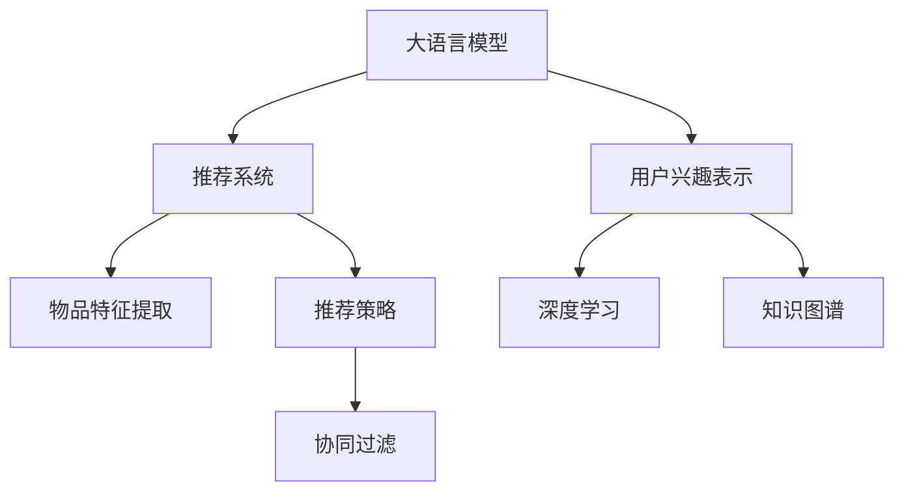

                 

# 基于LLM的推荐系统用户兴趣表示学习

> 关键词：LLM,推荐系统,用户兴趣表示,深度学习,知识图谱,协同过滤,自然语言处理(NLP)

## 1. 背景介绍

### 1.1 问题由来

推荐系统作为互联网时代的重要应用，通过分析用户的历史行为数据，为用户推荐感兴趣的物品，极大地提高了用户体验。然而，传统推荐系统往往依赖于用户的行为数据，难以覆盖行为数据稀疏的新用户。此时，基于内容的推荐方法便成为了有效的补充手段。

基于内容的推荐方法，核心在于用户兴趣和物品特征的匹配。常见的用户兴趣表示方法包括向量空间模型、矩阵分解等。这些方法通常基于静态特征，无法捕捉用户兴趣的动态变化。随着深度学习技术的进步，越来越多的推荐系统开始采用深度学习模型，如神经网络、协同过滤等，利用用户行为数据和物品特征，进行动态兴趣建模，显著提升了推荐效果。

### 1.2 问题核心关键点

本节将重点介绍基于深度学习的大语言模型(Large Language Model, LLM)，在推荐系统中的应用。大语言模型，通过大规模语料预训练，具有强大的自然语言理解和生成能力，能够理解用户文本输入并生成推荐结果。利用大语言模型，推荐系统可以同时考虑用户兴趣和物品描述，进行更加精细化的推荐。

本节将详细介绍大语言模型在推荐系统中的应用，涵盖用户兴趣表示、物品特征提取、推荐策略等关键环节。通过对大语言模型的介绍，能够帮助读者系统理解LLM在推荐系统中的应用价值，以及可能面临的挑战。

### 1.3 问题研究意义

研究基于LLM的推荐系统，对于拓展深度学习推荐技术的应用边界，提升推荐系统的智能化水平，具有重要意义：

1. 弥补行为数据稀疏性。大语言模型能够理解用户输入的文本描述，弥补行为数据稀疏性，覆盖更多新用户。
2. 捕捉动态兴趣变化。通过大语言模型的自然语言处理能力，可以动态捕捉用户兴趣的变化，适应不断变化的兴趣需求。
3. 提供多样化的推荐。大语言模型能够生成多种推荐理由，提升推荐的可解释性和用户体验。
4. 适应不同领域应用。大语言模型预训练时涉及海量文本，对于任何领域的应用，都能提供较为丰富的知识背景，从而实现跨领域的推荐。
5. 优化资源利用效率。大语言模型通常作为推荐策略的核心模块，能够提供较少的参数，提升推荐系统的推理效率。

## 2. 核心概念与联系

### 2.1 核心概念概述

为更好地理解基于LLM的推荐系统，本节将介绍几个密切相关的核心概念：

- 大语言模型(Large Language Model, LLM)：以自回归(如GPT)或自编码(如BERT)模型为代表的大规模预训练语言模型。通过大规模语料预训练，学习到丰富的语言知识和常识，具备强大的语言理解和生成能力。
- 推荐系统(Recommendation System)：根据用户历史行为数据和物品特征，为用户推荐感兴趣的物品。通过协同过滤、内容过滤、混合过滤等多种方法，不断优化推荐效果。
- 用户兴趣表示(User Interest Representation)：将用户的兴趣偏好，抽象为一种数值或向量表示，用于匹配物品特征。常用的表示方法包括基于内容的特征表示、协同过滤中的用户-物品矩阵等。
- 深度学习(Deep Learning)：通过多层神经网络对数据进行抽象，学习数据的高级特征表示。常见的深度学习模型包括多层感知机、卷积神经网络、循环神经网络等。
- 知识图谱(Knowledge Graph)：一种结构化的语义信息表示方式，将现实世界中的实体和关系，以图的形式进行建模。利用知识图谱，推荐系统可以融合外部知识，提升推荐的准确性和丰富度。
- 协同过滤(Collaborative Filtering)：推荐系统中的一种方法，通过分析用户行为数据，发现用户之间或物品之间的相似性，进行推荐。协同过滤分为基于用户的协同过滤和基于物品的协同过滤。

这些核心概念之间的逻辑关系可以通过以下Mermaid流程图来展示：



这个流程图展示了大语言模型、推荐系统、用户兴趣表示、物品特征提取、推荐策略、深度学习和知识图谱之间的联系：

1. 大语言模型作为推荐系统的核心组件，用于捕捉用户兴趣和生成推荐理由。
2. 用户兴趣表示和物品特征提取，基于深度学习技术，对用户行为和物品属性进行抽象和建模。
3. 推荐策略则基于用户兴趣和物品特征，进行动态推荐。
4. 协同过滤和知识图谱，是推荐策略的具体方法，通过分析用户行为或外部知识，提升推荐的准确性。

这些概念共同构成了基于深度学习的推荐系统的技术框架，使得LLM在推荐系统中的应用成为可能。

## 3. 核心算法原理 & 具体操作步骤
### 3.1 算法原理概述

基于大语言模型的推荐系统，本质上是一种基于深度学习的方法。其核心思想是：将用户的文本描述输入到预训练的大语言模型中，得到用户的兴趣表示；同时，将物品的文本描述输入到大语言模型中，得到物品的特征表示。通过比较用户兴趣和物品特征的相似度，为用户推荐最匹配的物品。

形式化地，假设用户输入的文本描述为 $u$，物品的文本描述为 $i$，预训练模型为 $M_{\theta}$。推荐系统的目标是最小化用户 $u$ 和物品 $i$ 之间的语义距离 $d(u, i)$，即：

$$
\theta^* = \mathop{\arg\min}_{\theta} \sum_{u,i}d(u,i)
$$

其中 $d$ 表示语义距离，可以使用余弦相似度、向量距离等度量方式。通过梯度下降等优化算法，不断更新模型参数 $\theta$，最小化语义距离，得到推荐的物品。

### 3.2 算法步骤详解

基于LLM的推荐系统一般包括以下几个关键步骤：

**Step 1: 准备预训练模型和数据集**
- 选择合适的预训练语言模型 $M_{\theta}$ 作为初始化参数，如 BERT、GPT 等。
- 准备推荐系统的训练数据集 $D=\{(u_i,i_i)\}_{i=1}^N$，其中 $u_i$ 为用户输入的文本描述，$i_i$ 为对应的物品。

**Step 2: 用户兴趣表示**
- 将用户文本描述 $u_i$ 输入到大语言模型中，得到用户兴趣向量 $u_{\theta}(u_i)$。

**Step 3: 物品特征提取**
- 将物品文本描述 $i_i$ 输入到大语言模型中，得到物品特征向量 $i_{\theta}(i_i)$。

**Step 4: 计算语义距离**
- 计算用户兴趣向量 $u_{\theta}(u_i)$ 和物品特征向量 $i_{\theta}(i_i)$ 之间的语义距离 $d(u_i,i_i)$。

**Step 5: 推荐策略**
- 根据计算得到的语义距离，使用一定的推荐策略，如余弦相似度、向量距离等，得到物品推荐结果 $r_i$。
- 根据推荐结果 $r_i$，将物品推荐给用户。

**Step 6: 评估与调整**
- 在测试集上评估推荐结果的准确性和多样性。
- 根据评估结果，调整模型参数，优化推荐效果。

以上是基于深度学习的大语言模型推荐系统的通用流程。在实际应用中，还需要针对具体任务，对微调过程的各个环节进行优化设计，如改进训练目标函数，引入更多的正则化技术，搜索最优的超参数组合等，以进一步提升模型性能。

### 3.3 算法优缺点

基于LLM的推荐系统具有以下优点：
1. 能处理非结构化文本数据。利用大语言模型的强大文本处理能力，可以处理任意形式的文本数据，包括新闻、文章、图片说明等。
2. 动态捕捉用户兴趣。大语言模型能够理解用户输入的文本描述，动态捕捉用户兴趣的变化。
3. 融合外部知识。知识图谱等外部知识，可以通过大语言模型进行融合，提升推荐效果。
4. 推荐理由丰富。利用大语言模型，可以生成多种推荐理由，提升推荐的可解释性和用户体验。

同时，该方法也存在一定的局限性：
1. 依赖标注数据。大语言模型的预训练需要大规模语料，而推荐系统需要用户行为数据和物品特征数据，两者在标注数据的获取上存在差异。
2. 泛化能力有限。当目标任务与预训练数据的分布差异较大时，推荐效果可能不佳。
3. 计算资源需求高。大语言模型的参数量庞大，对计算资源的需求较高。
4. 可解释性不足。大语言模型的决策过程通常缺乏可解释性，难以对其推理逻辑进行分析和调试。

尽管存在这些局限性，但就目前而言，基于深度学习的推荐系统仍然是最主流的范式。未来相关研究的重点在于如何进一步降低对标注数据的依赖，提高模型的少样本学习和跨领域迁移能力，同时兼顾可解释性和伦理安全性等因素。

### 3.4 算法应用领域

基于大语言模型的推荐系统，已经在电商、内容推荐、社交网络等多个领域得到了广泛应用，为推荐系统带来了新的技术突破。

1. 电商推荐：利用大语言模型对用户评论、商品描述等文本数据进行建模，提升推荐效果。例如，Amazon通过BERT模型对商品标题、描述进行处理，生成商品推荐列表。
2. 内容推荐：利用大语言模型对用户兴趣进行建模，对文章、视频、音乐等进行推荐。例如，Netflix利用BERT模型对用户历史行为数据进行建模，推荐电影和电视剧。
3. 社交网络推荐：利用大语言模型对用户兴趣和行为数据进行建模，推荐新的社交关系。例如，Facebook利用BERT模型对用户兴趣进行建模，推荐新的朋友和帖子。
4. 金融推荐：利用大语言模型对用户行为数据进行建模，推荐金融产品。例如，Ant Group利用BERT模型对用户行为数据进行建模，推荐信贷产品。

除了上述这些经典应用外，基于大语言模型的推荐系统还在医疗、教育、旅游等更多场景中得到了创新性的应用，为推荐系统带来了全新的突破。随着预训练语言模型和推荐方法的不断进步，相信推荐系统必将在更广阔的应用领域大放异彩。

## 4. 数学模型和公式 & 详细讲解  
### 4.1 数学模型构建

本节将使用数学语言对基于深度学习的大语言模型推荐系统进行更加严格的刻画。

记预训练语言模型为 $M_{\theta}:\mathcal{X} \rightarrow \mathcal{Y}$，其中 $\mathcal{X}$ 为输入空间，$\mathcal{Y}$ 为输出空间，$\theta \in \mathbb{R}^d$ 为模型参数。假设推荐系统的训练数据集为 $D=\{(u_i,i_i)\}_{i=1}^N$，其中 $u_i$ 为用户输入的文本描述，$i_i$ 为对应的物品。

定义用户输入文本 $u$ 的兴趣表示为 $u_{\theta}(u)$，物品 $i$ 的特征表示为 $i_{\theta}(i)$，则推荐系统的目标是找到最优的 $\theta$，使得用户 $u$ 和物品 $i$ 的语义距离最小化：

$$
\theta^* = \mathop{\arg\min}_{\theta} \sum_{u,i}d(u_{\theta}(u),i_{\theta}(i))
$$

其中 $d$ 表示语义距离，可以使用余弦相似度、向量距离等度量方式。

### 4.2 公式推导过程

以下我们以余弦相似度为例，推导用户兴趣表示和物品特征表示的计算公式。

假设用户输入的文本描述为 $u$，物品的文本描述为 $i$，预训练模型为 $M_{\theta}$。用户输入文本 $u$ 的兴趣表示 $u_{\theta}(u)$ 和物品 $i$ 的特征表示 $i_{\theta}(i)$ 可以表示为：

$$
u_{\theta}(u) = M_{\theta}(u) \in \mathbb{R}^d
$$

$$
i_{\theta}(i) = M_{\theta}(i) \in \mathbb{R}^d
$$

其中 $M_{\theta}(u)$ 和 $M_{\theta}(i)$ 分别表示模型在输入 $u$ 和 $i$ 上的输出。

利用余弦相似度作为语义距离的度量方式，用户 $u$ 和物品 $i$ 的语义距离 $d(u,i)$ 可以表示为：

$$
d(u,i) = \frac{u_{\theta}(u) \cdot i_{\theta}(i)}{\|u_{\theta}(u)\|_2 \cdot \|i_{\theta}(i)\|_2}
$$

利用上述公式，推荐系统的目标函数可以表示为：

$$
\theta^* = \mathop{\arg\min}_{\theta} \sum_{u,i}d(u,i) = \mathop{\arg\min}_{\theta} \sum_{u,i}\frac{u_{\theta}(u) \cdot i_{\theta}(i)}{\|u_{\theta}(u)\|_2 \cdot \|i_{\theta}(i)\|_2}
$$

在得到目标函数后，即可使用梯度下降等优化算法，不断更新模型参数 $\theta$，最小化语义距离，得到推荐的物品。

## 5. 项目实践：代码实例和详细解释说明
### 5.1 开发环境搭建

在进行推荐系统开发前，我们需要准备好开发环境。以下是使用Python进行PyTorch开发的环境配置流程：

1. 安装Anaconda：从官网下载并安装Anaconda，用于创建独立的Python环境。

2. 创建并激活虚拟环境：
```bash
conda create -n pytorch-env python=3.8 
conda activate pytorch-env
```

3. 安装PyTorch：根据CUDA版本，从官网获取对应的安装命令。例如：
```bash
conda install pytorch torchvision torchaudio cudatoolkit=11.1 -c pytorch -c conda-forge
```

4. 安装Transformer库：
```bash
pip install transformers
```

5. 安装各类工具包：
```bash
pip install numpy pandas scikit-learn matplotlib tqdm jupyter notebook ipython
```

完成上述步骤后，即可在`pytorch-env`环境中开始推荐系统开发。

### 5.2 源代码详细实现

这里我们以基于BERT模型的推荐系统为例，给出使用Transformers库进行推荐系统开发的PyTorch代码实现。

首先，定义推荐系统的训练数据集：

```python
from transformers import BertTokenizer, BertModel
import torch
import pandas as pd
from sklearn.model_selection import train_test_split

tokenizer = BertTokenizer.from_pretrained('bert-base-cased')
model = BertModel.from_pretrained('bert-base-cased')

# 读取数据集
data = pd.read_csv('data.csv')

# 分割训练集和测试集
train_data, test_data = train_test_split(data, test_size=0.2, random_state=42)
```

然后，定义用户兴趣表示和物品特征表示的计算函数：

```python
def get_user_interest(user_text, model, tokenizer):
    user_input = tokenizer(user_text, return_tensors='pt')
    with torch.no_grad():
        outputs = model(**user_input)
    user_vector = outputs.pooler_output
    return user_vector

def get_item_feature(item_text, model, tokenizer):
    item_input = tokenizer(item_text, return_tensors='pt')
    with torch.no_grad():
        outputs = model(**item_input)
    item_vector = outputs.pooler_output
    return item_vector
```

接着，定义推荐函数：

```python
def recommendation(user_text, item_texts, model, tokenizer, similarity='cosine'):
    user_vector = get_user_interest(user_text, model, tokenizer)
    item_vectors = [get_item_feature(item_text, model, tokenizer) for item_text in item_texts]
    
    if similarity == 'cosine':
        similarities = [torch.cosine_similarity(user_vector, item_vector) for item_vector in item_vectors]
    elif similarity == 'euclidean':
        similarities = [torch.linalg.norm(user_vector - item_vector) for item_vector in item_vectors]
    
    return item_texts[np.argmax(similarities)]
```

最后，训练和评估推荐模型：

```python
from torch.utils.data import Dataset, DataLoader

class RecommendationDataset(Dataset):
    def __init__(self, train_data, tokenizer):
        self.train_data = train_data
        self.tokenizer = tokenizer
        
    def __len__(self):
        return len(self.train_data)
    
    def __getitem__(self, item):
        user_text, item_text = self.train_data[item]
        item_texts = item_text.split(',')
        user_input = tokenizer(user_text, return_tensors='pt')
        item_input = tokenizer(item_texts, return_tensors='pt')
        with torch.no_grad():
            user_vector = model(**user_input).pooler_output
            item_vectors = [model(**item_input).pooler_output for item_input in item_input]
        return user_text, item_texts, item_vectors

# 构建数据集
train_dataset = RecommendationDataset(train_data, tokenizer)
test_dataset = RecommendationDataset(test_data, tokenizer)

# 定义优化器和损失函数
optimizer = torch.optim.Adam(model.parameters(), lr=2e-5)
loss_fn = torch.nn.MSELoss()

# 训练过程
for epoch in range(10):
    for user_text, item_texts, item_vectors in DataLoader(train_dataset, batch_size=32):
        user_vector = get_user_interest(user_text, model, tokenizer)
        optimizer.zero_grad()
        prediction = recommendation(user_text, item_texts, model, tokenizer, similarity='cosine')
        loss = loss_fn(user_vector, item_vectors[prediction])
        loss.backward()
        optimizer.step()
    
    # 评估过程
    for user_text, item_texts, item_vectors in DataLoader(test_dataset, batch_size=32):
        user_vector = get_user_interest(user_text, model, tokenizer)
        prediction = recommendation(user_text, item_texts, model, tokenizer, similarity='cosine')
        print(user_text, prediction)

print('Test Results:')
for user_text, item_texts, item_vectors in DataLoader(test_dataset, batch_size=32):
    user_vector = get_user_interest(user_text, model, tokenizer)
    prediction = recommendation(user_text, item_texts, model, tokenizer, similarity='cosine')
    print(user_text, prediction)
```

以上就是使用PyTorch对BERT进行推荐系统开发的完整代码实现。可以看到，借助Transformers库的强大封装，我们可以快速实现基于深度学习的大语言模型推荐系统。

### 5.3 代码解读与分析

让我们再详细解读一下关键代码的实现细节：

**RecommendationDataset类**：
- `__init__`方法：初始化训练数据和分词器。
- `__len__`方法：返回数据集的样本数量。
- `__getitem__`方法：对单个样本进行处理，将用户输入文本和物品文本转化为模型所需的token ids，并在模型上前向传播计算兴趣表示和特征表示。

**get_user_interest和get_item_feature函数**：
- `get_user_interest`函数：将用户文本输入BERT模型，得到用户兴趣表示。
- `get_item_feature`函数：将物品文本输入BERT模型，得到物品特征表示。

**recommendation函数**：
- 根据用户兴趣表示和物品特征表示，计算用户和物品之间的相似度。
- 根据相似度，选择相似度最高的物品进行推荐。

**训练和评估过程**：
- 使用Adam优化器和MSELoss损失函数，对模型进行训练。
- 在测试集上对推荐模型进行评估，输出推荐结果。

可以看到，PyTorch配合Transformers库使得BERT微调的代码实现变得简洁高效。开发者可以将更多精力放在数据处理、模型改进等高层逻辑上，而不必过多关注底层的实现细节。

当然，工业级的系统实现还需考虑更多因素，如模型的保存和部署、超参数的自动搜索、更灵活的任务适配层等。但核心的推荐范式基本与此类似。

## 6. 实际应用场景
### 6.1 电商推荐

基于大语言模型的推荐系统，可以广泛应用于电商推荐场景。传统电商推荐系统依赖用户行为数据，难以覆盖行为数据稀疏的新用户。通过大语言模型对用户文本描述进行处理，可以弥补行为数据稀疏性，提升推荐效果。

在实际应用中，电商企业可以收集用户评论、商品描述等文本数据，使用大语言模型对用户文本进行建模，生成用户兴趣表示。同时，对商品标题、描述等文本数据进行建模，生成商品特征表示。根据用户兴趣和商品特征的相似度，为用户推荐最匹配的商品。例如，Amazon通过BERT模型对商品标题、描述进行处理，生成商品推荐列表，有效覆盖了行为数据稀疏的新用户。

### 6.2 内容推荐

利用大语言模型对用户兴趣进行建模，对文章、视频、音乐等进行推荐，已经成为许多内容推荐平台的标准做法。例如，Netflix利用BERT模型对用户历史行为数据进行建模，推荐电影和电视剧，显著提升了推荐效果。

在实际应用中，内容平台可以收集用户浏览、点击、评分等行为数据，使用大语言模型对用户文本进行建模，生成用户兴趣表示。同时，对内容标题、描述等文本数据进行建模，生成内容特征表示。根据用户兴趣和内容特征的相似度，为用户推荐最匹配的内容。例如，Bilibili利用BERT模型对用户评论进行建模，推荐视频内容，提升用户体验。

### 6.3 社交网络推荐

基于大语言模型的社交网络推荐系统，利用用户文本描述，动态捕捉用户兴趣的变化。例如，Facebook利用BERT模型对用户兴趣进行建模，推荐新的朋友和帖子，显著提升了用户互动和留存率。

在实际应用中，社交平台可以收集用户昵称、状态更新、点赞、评论等文本数据，使用大语言模型对用户文本进行建模，生成用户兴趣表示。同时，对用户关系、帖子内容等文本数据进行建模，生成社交关系和帖子特征表示。根据用户兴趣和社交关系的相似度，为用户推荐新的朋友和帖子。例如，Twitter利用BERT模型对用户推文进行建模，推荐新关注者和帖子，增加用户互动。

### 6.4 未来应用展望

随着大语言模型和推荐方法的不断发展，基于深度学习的推荐系统将在更多领域得到应用，为推荐系统带来新的突破。

在智慧医疗领域，基于大语言模型的医疗推荐系统，利用用户文本描述，推荐个性化的医疗建议和产品。例如，Medanta利用BERT模型对用户病历进行建模，推荐药品和医疗服务，帮助医生制定治疗方案。

在智能教育领域，基于大语言模型的教育推荐系统，利用学生文本描述，推荐个性化的学习资源和内容。例如，Coursera利用BERT模型对学生评论进行建模，推荐学习资源，提升学习效果。

在智慧城市治理中，基于大语言模型的城市推荐系统，利用用户文本描述，推荐个性化的城市服务和生活建议。例如，北京智慧城市利用BERT模型对用户评价进行建模，推荐城市服务和生活建议，提升城市管理和服务水平。

此外，在企业生产、社会治理、文娱传媒等众多领域，基于大语言模型的推荐系统也将不断涌现，为推荐系统带来新的应用场景。相信随着技术的日益成熟，大语言模型推荐系统必将在推荐领域大放异彩。

## 7. 工具和资源推荐
### 7.1 学习资源推荐

为了帮助开发者系统掌握大语言模型在推荐系统中的应用，这里推荐一些优质的学习资源：

1. 《Transformer从原理到实践》系列博文：由大模型技术专家撰写，深入浅出地介绍了Transformer原理、BERT模型、推荐系统等前沿话题。

2. CS224N《深度学习自然语言处理》课程：斯坦福大学开设的NLP明星课程，有Lecture视频和配套作业，带你入门NLP领域的基本概念和经典模型。

3. 《Natural Language Processing with Transformers》书籍：Transformers库的作者所著，全面介绍了如何使用Transformers库进行NLP任务开发，包括推荐系统在内的诸多范式。

4. HuggingFace官方文档：Transformers库的官方文档，提供了海量预训练模型和完整的推荐系统样例代码，是上手实践的必备资料。

5. KDD开源项目：推荐系统领域的开源项目，包含推荐系统各经典算法的代码实现，是学习推荐系统的好资源。

通过对这些资源的学习实践，相信你一定能够快速掌握大语言模型在推荐系统中的应用价值，并用于解决实际的推荐问题。
###  7.2 开发工具推荐

高效的开发离不开优秀的工具支持。以下是几款用于大语言模型推荐系统开发的常用工具：

1. PyTorch：基于Python的开源深度学习框架，灵活动态的计算图，适合快速迭代研究。大部分预训练语言模型都有PyTorch版本的实现。

2. TensorFlow：由Google主导开发的开源深度学习框架，生产部署方便，适合大规模工程应用。同样有丰富的预训练语言模型资源。

3. Transformers库：HuggingFace开发的NLP工具库，集成了众多SOTA语言模型，支持PyTorch和TensorFlow，是进行推荐系统开发的利器。

4. Weights & Biases：模型训练的实验跟踪工具，可以记录和可视化模型训练过程中的各项指标，方便对比和调优。与主流深度学习框架无缝集成。

5. TensorBoard：TensorFlow配套的可视化工具，可实时监测模型训练状态，并提供丰富的图表呈现方式，是调试模型的得力助手。

6. Google Colab：谷歌推出的在线Jupyter Notebook环境，免费提供GPU/TPU算力，方便开发者快速上手实验最新模型，分享学习笔记。

合理利用这些工具，可以显著提升大语言模型推荐系统的开发效率，加快创新迭代的步伐。

### 7.3 相关论文推荐

大语言模型和推荐系统的研究源于学界的持续研究。以下是几篇奠基性的相关论文，推荐阅读：

1. Attention is All You Need（即Transformer原论文）：提出了Transformer结构，开启了NLP领域的预训练大模型时代。

2. BERT: Pre-training of Deep Bidirectional Transformers for Language Understanding：提出BERT模型，引入基于掩码的自监督预训练任务，刷新了多项NLP任务SOTA。

3. Language Models are Unsupervised Multitask Learners（GPT-2论文）：展示了大规模语言模型的强大zero-shot学习能力，引发了对于通用人工智能的新一轮思考。

4. Knowledge-aware Recommender System with Bidirectional Multi-layer Attention：提出知识增强的推荐系统模型，融合了外部知识图谱，显著提升了推荐效果。

5. Attentive Multi-layer Sequential Deep Model for Recommendation System：提出基于深度学习的多层注意力模型，提升了推荐系统的准确性和多样性。

6. Collaborative Filtering as Knowledge Graph Embedding：将协同过滤方法与知识图谱结合，提升了推荐系统的推理能力和泛化能力。

这些论文代表了大语言模型在推荐系统中的研究进展。通过学习这些前沿成果，可以帮助研究者把握学科前进方向，激发更多的创新灵感。

## 8. 总结：未来发展趋势与挑战
### 8.1 总结

本文对基于大语言模型的推荐系统进行了全面系统的介绍。首先阐述了大语言模型和推荐系统的研究背景和意义，明确了深度学习在推荐系统中的应用价值。其次，从原理到实践，详细讲解了深度学习推荐系统的数学原理和关键步骤，给出了推荐系统开发的完整代码实例。同时，本文还广泛探讨了推荐系统在电商、内容推荐、社交网络等多个领域的应用前景，展示了深度学习推荐系统的广阔应用场景。此外，本文精选了推荐系统的各类学习资源，力求为读者提供全方位的技术指引。

通过本文的系统梳理，可以看到，基于深度学习的大语言模型推荐系统，通过捕捉用户兴趣和物品特征的语义关系，提供了比传统推荐系统更加精准、丰富的推荐结果。借助大语言模型的强大文本处理能力，推荐系统能够处理任意形式的文本数据，弥补行为数据稀疏性，覆盖更多新用户。利用大语言模型的自然语言处理能力，可以动态捕捉用户兴趣的变化，适应不断变化的兴趣需求。未来，随着大语言模型和推荐方法的不断进步，基于深度学习的推荐系统必将在更多领域得到应用，为推荐系统带来新的突破。

### 8.2 未来发展趋势

展望未来，大语言模型推荐系统将呈现以下几个发展趋势：

1. 知识图谱的融合。随着知识图谱技术的进步，推荐系统将越来越多地融合外部知识，提升推荐的准确性和丰富度。例如，利用知识图谱的实体关系，推荐系统可以推荐更符合用户兴趣的产品。

2. 动态兴趣的捕捉。推荐系统将越来越多地动态捕捉用户兴趣的变化，适应不断变化的兴趣需求。例如，通过实时分析用户输入的文本描述，推荐系统可以动态调整推荐策略，提升用户体验。

3. 多模态数据的融合。推荐系统将越来越多地融合视觉、语音等多模态数据，提升推荐的准确性和多样性。例如，利用视觉信息，推荐系统可以推荐更符合用户偏好的商品。

4. 轻量级模型的应用。推荐系统将越来越多地使用轻量级模型，提升推荐系统的推理速度和资源利用效率。例如，利用知识蒸馏技术，将大模型压缩为轻量级模型，提升推荐系统的实时性。

5. 鲁棒性和可解释性的增强。推荐系统将越来越多地关注模型的鲁棒性和可解释性，避免模型过拟合和偏见。例如，利用对抗样本训练，提升推荐系统的鲁棒性；利用可解释性模型，提升推荐系统的可信度。

6. 跨领域推荐的应用。推荐系统将越来越多地应用于跨领域推荐，提升跨领域推荐的效果。例如，利用跨领域推荐技术，推荐系统可以在不同领域之间进行知识迁移，提升推荐效果。

以上趋势凸显了大语言模型推荐系统的广阔前景。这些方向的探索发展，必将进一步提升推荐系统的性能和应用范围，为推荐系统带来新的突破。

### 8.3 面临的挑战

尽管大语言模型推荐系统已经取得了瞩目成就，但在迈向更加智能化、普适化应用的过程中，它仍面临着诸多挑战：

1. 标注成本瓶颈。尽管大语言模型的预训练可以处理非结构化文本数据，但在推荐系统中，仍需要用户行为数据和物品特征数据。两者在标注数据的获取上存在差异，导致推荐系统面临数据标注成本的挑战。

2. 计算资源需求高。大语言模型的参数量庞大，对计算资源的需求较高。推荐系统需要处理海量数据，计算资源的需求更加严峻。

3. 可解释性不足。大语言模型的决策过程通常缺乏可解释性，难以对其推理逻辑进行分析和调试。这对于推荐系统而言，是一个重要的挑战。

4. 鲁棒性不足。推荐系统面临的噪声和干扰较大，大语言模型容易受到噪声的影响，导致推荐结果不稳定。

5. 知识融合难度大。推荐系统需要融合外部知识，但不同知识源的数据格式和质量差异较大，难以进行有效的知识融合。

尽管存在这些挑战，但通过不断改进算法和技术，我们有望克服这些困难，实现大语言模型推荐系统在更多领域的应用。

### 8.4 研究展望

面向未来，大语言模型推荐系统的研究需要在以下几个方面寻求新的突破：

1. 探索无监督和半监督推荐方法。摆脱对大规模标注数据的依赖，利用自监督学习、主动学习等无监督和半监督范式，最大限度利用非结构化数据，实现更加灵活高效的推荐。

2. 研究参数高效和计算高效的推荐范式。开发更加参数高效的推荐方法，在固定大部分预训练参数的同时，只更新极少量的任务相关参数。同时优化推荐系统的计算图，减少前向传播和反向传播的资源消耗，实现更加轻量级、实时性的部署。

3. 融合因果和对比学习范式。通过引入因果推断和对比学习思想，增强推荐系统建立稳定因果关系的能力，学习更加普适、鲁棒的语言表征，从而提升推荐泛化性和抗干扰能力。

4. 引入更多先验知识。将符号化的先验知识，如知识图谱、逻辑规则等，与神经网络模型进行巧妙融合，引导推荐系统学习更准确、合理的语言模型。同时加强不同模态数据的整合，实现视觉、语音等多模态信息与文本信息的协同建模。

5. 结合因果分析和博弈论工具。将因果分析方法引入推荐系统，识别出推荐策略的关键特征，增强推荐系统的因果关系和逻辑性。借助博弈论工具刻画人机交互过程，主动探索并规避推荐系统的脆弱点，提高系统稳定性。

6. 纳入伦理道德约束。在推荐系统中，用户隐私保护和数据安全是一个重要问题。在模型训练目标中引入伦理导向的评估指标，过滤和惩罚有偏见、有害的输出倾向。同时加强人工干预和审核，建立推荐系统的监管机制，确保推荐内容的健康性。

这些研究方向凸显了大语言模型推荐系统的广阔前景。这些方向的探索发展，必将进一步提升推荐系统的性能和应用范围，为推荐系统带来新的突破。

## 9. 附录：常见问题与解答

**Q1：大语言模型推荐系统是否适用于所有推荐场景？**

A: 大语言模型推荐系统适用于大部分推荐场景，特别是对于行为数据稀疏的新用户和需要动态捕捉用户兴趣的场景。但对于一些需要精准计算和实时响应的场景，如电商推荐，可能存在一定的性能瓶颈。此时，可以考虑使用基于深度学习的小模型进行推荐。

**Q2：如何缓解大语言模型推荐系统的计算资源需求？**

A: 利用大语言模型推荐系统时，可以采用模型裁剪、量化加速等技术，减少模型参数量，提升推理效率。同时，可以考虑将大模型压缩为轻量级模型，或使用小模型进行推荐，以适应计算资源有限的场景。

**Q3：大语言模型推荐系统的可解释性问题如何解决？**

A: 大语言模型推荐系统的可解释性可以通过引入可解释性模型和技术来解决。例如，利用LIME等可解释性工具，分析模型的决策过程，生成推荐理由。同时，可以引入自然语言处理技术，对推荐结果进行语义解释。

**Q4：大语言模型推荐系统的鲁棒性如何提升？**

A: 大语言模型推荐系统的鲁棒性可以通过引入对抗样本训练、正则化等技术来解决。例如，利用对抗样本训练，提升模型的鲁棒性；利用正则化技术，减少模型过拟合风险。同时，可以结合因果分析和博弈论工具，增强推荐系统的因果关系和逻辑性，提高系统的稳定性。

**Q5：如何在大语言模型推荐系统中融合外部知识？**

A: 大语言模型推荐系统中，可以通过引入知识图谱等外部知识，提升推荐效果。例如，利用知识图谱的实体关系，推荐系统可以推荐更符合用户兴趣的产品。同时，可以通过多模态融合技术，将视觉、语音等多模态数据与文本数据结合，提升推荐系统的准确性和多样性。

通过对这些常见问题的解答，我们能够更好地理解大语言模型推荐系统的发展方向和应用策略，为后续的研究和实践提供指导。

---

作者：禅与计算机程序设计艺术 / Zen and the Art of Computer Programming

