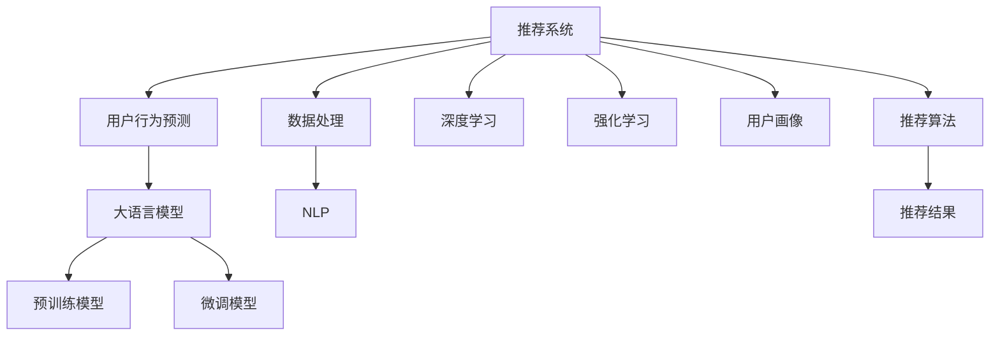

                 

# 基于LLM的推荐系统用户行为预测

> 关键词：推荐系统,用户行为预测,大语言模型,自回归模型,预训练模型,微调模型,自然语言处理(NLP),深度学习,强化学习

## 1. 背景介绍

### 1.1 问题由来
在如今信息爆炸的时代，如何为用户推荐其可能感兴趣的内容，已成为互联网公司提升用户体验和留存率的关键。推荐系统通过分析用户的历史行为数据，预测其可能感兴趣的项目，从而提供个性化的推荐服务。

然而，传统的推荐系统大多基于用户的历史行为数据进行推荐，无法充分考虑用户的潜在意图和未来行为。因此，基于大语言模型(LLM)的用户行为预测技术应运而生。通过引入LLM，推荐系统可以结合用户输入的自然语言描述，准确预测其潜在的兴趣，从而提供更加智能和个性化的推荐。

### 1.2 问题核心关键点
基于LLM的推荐系统，其核心在于利用预训练模型在自然语言处理(NLP)领域的能力，通过微调模型，使其能够理解用户输入的文本，并预测其可能感兴趣的内容。

具体而言，主要包括以下几个方面：
- 选择预训练模型：使用深度学习领域的主流模型如BERT、GPT-2等，作为推荐系统的基础模型。
- 数据处理：将用户输入的自然语言描述转化为模型可以处理的文本数据，并进行预处理和标准化。
- 模型微调：在用户行为数据上对预训练模型进行微调，使其能够预测用户可能感兴趣的项目。
- 推荐策略：结合微调模型的输出和用户历史行为数据，制定推荐策略，生成个性化的推荐结果。

## 2. 核心概念与联系

### 2.1 核心概念概述

为更好地理解基于LLM的推荐系统，本节将介绍几个密切相关的核心概念：

- 推荐系统(Recommendation System)：通过分析用户历史行为数据，为用户推荐其可能感兴趣的项目。

- 用户行为预测(User Behavior Prediction)：通过自然语言输入预测用户可能感兴趣的内容，从而进行个性化推荐。

- 大语言模型(Large Language Model, LLM)：以自回归(如GPT)或自编码(如BERT)模型为代表的大规模预训练语言模型。通过在海量文本数据上进行预训练，学习通用的语言表示，具备强大的语言理解和生成能力。

- 预训练模型(Pre-trained Model)：在大量无标签数据上进行训练，以捕捉数据中的语言规律和特征，为微调模型提供基础表示。

- 微调模型(Fine-tuned Model)：通过在特定任务数据上微调预训练模型，使其能够适应特定任务，从而提升模型的性能。

- 自然语言处理(Natural Language Processing, NLP)：研究如何让计算机理解和处理人类语言，包括文本分类、情感分析、机器翻译等任务。

- 深度学习(Deep Learning)：基于神经网络的机器学习范式，通过多层次非线性特征提取，提升模型的表达能力。

- 强化学习(Reinforcement Learning, RL)：通过环境反馈学习最优策略，优化推荐系统中的推荐效果。

- 用户画像(User Persona)：基于用户行为数据构建的用户抽象模型，用于个性化推荐。

- 推荐算法(Recommendation Algorithm)：用于生成推荐结果的算法，如协同过滤、基于内容的推荐、混合推荐等。

- 数据质量(Data Quality)：推荐系统的输入数据是否充分和准确，直接影响推荐结果的质量。

这些核心概念之间的逻辑关系可以通过以下Mermaid流程图来展示：



这个流程图展示了大语言模型在推荐系统中的核心概念及其之间的关系：

1. 推荐系统通过用户行为预测和深度学习技术，提升推荐效果。
2. 用户行为预测利用自然语言处理技术，通过大语言模型对用户输入进行理解。
3. 大语言模型通过预训练和微调，学习通用的语言表示。
4. 预训练模型为微调模型提供基础表示。
5. 微调模型通过特定任务数据进一步学习，提升预测准确性。
6. 深度学习、强化学习和用户画像技术，共同构建推荐系统的多维知识图谱。
7. 推荐算法根据多维知识图谱生成推荐结果。

这些概念共同构成了基于大语言模型的推荐系统框架，使其能够高效处理自然语言输入，生成个性化的推荐结果。

## 3. 核心算法原理 & 具体操作步骤

### 3.1 算法原理概述

基于LLM的推荐系统，本质上是一个多模态深度学习过程。其核心思想是：通过大语言模型在自然语言处理领域的能力，结合用户历史行为数据，预测用户未来可能感兴趣的内容，从而实现个性化的推荐。

形式化地，假设推荐系统中的预训练模型为 $M_{\theta}$，其中 $\theta$ 为预训练得到的模型参数。给定用户的输入自然语言描述 $x$ 和历史行为数据 $H$，推荐系统预测用户可能感兴趣的项目 $Y$，则推荐过程可以表示为：

$$
Y = M_{\theta}(x, H)
$$

其中 $M_{\theta}$ 是经过微调的推荐模型，$x$ 为用户输入的自然语言描述，$H$ 为用户的过往行为数据。

推荐模型的目标是最小化预测值 $Y$ 与用户真实兴趣 $Y^*$ 之间的差距，即：

$$
\min_{\theta} \mathcal{L}(Y, Y^*)
$$

其中 $\mathcal{L}$ 为推荐系统设计的损失函数，用于衡量模型预测与真实兴趣的差异。常见的损失函数包括均方误差损失、交叉熵损失等。

### 3.2 算法步骤详解

基于LLM的推荐系统一般包括以下几个关键步骤：

**Step 1: 准备预训练模型和数据集**
- 选择合适的预训练语言模型 $M_{\theta}$ 作为初始化参数，如 BERT、GPT-2等。
- 准备用户行为数据集 $D=\{(x_i, y_i)\}_{i=1}^N$，其中 $x_i$ 为自然语言描述，$y_i$ 为用户对 $x_i$ 的兴趣标签。

**Step 2: 添加任务适配层**
- 根据任务类型，在预训练模型顶层设计合适的输出层和损失函数。
- 对于分类任务，通常在顶层添加线性分类器和交叉熵损失函数。
- 对于生成任务，通常使用语言模型的解码器输出概率分布，并以负对数似然为损失函数。

**Step 3: 设置微调超参数**
- 选择合适的优化算法及其参数，如 AdamW、SGD 等，设置学习率、批大小、迭代轮数等。
- 设置正则化技术及强度，包括权重衰减、Dropout、Early Stopping等。
- 确定冻结预训练参数的策略，如仅微调顶层，或全部参数都参与微调。

**Step 4: 执行梯度训练**
- 将训练集数据分批次输入模型，前向传播计算损失函数。
- 反向传播计算参数梯度，根据设定的优化算法和学习率更新模型参数。
- 周期性在验证集上评估模型性能，根据性能指标决定是否触发 Early Stopping。
- 重复上述步骤直到满足预设的迭代轮数或 Early Stopping 条件。

**Step 5: 测试和部署**
- 在测试集上评估微调后模型 $M_{\hat{\theta}}$ 的性能，对比微调前后的精度提升。
- 使用微调后的模型对新用户输入进行推理预测，集成到实际的应用系统中。
- 持续收集新的用户行为数据，定期重新微调模型，以适应用户兴趣的变化。

以上是基于LLM的推荐系统的一般流程。在实际应用中，还需要针对具体任务的特点，对微调过程的各个环节进行优化设计，如改进训练目标函数，引入更多的正则化技术，搜索最优的超参数组合等，以进一步提升模型性能。

### 3.3 算法优缺点

基于LLM的推荐系统具有以下优点：
1. 结合用户自然语言输入，可充分考虑用户潜在的兴趣，提升推荐效果。
2. 利用大语言模型的广泛知识，提高推荐系统的泛化能力和灵活性。
3. 通过微调模型，可以高效地适应特定任务，生成更加个性化的推荐结果。
4. 可以实时动态更新推荐模型，快速适应用户兴趣的变化。

同时，该方法也存在一定的局限性：
1. 需要高质量的用户行为数据，获取数据的成本较高。
2. 预训练模型和微调模型需要大量的计算资源和存储空间。
3. 用户输入的自然语言描述可能会存在歧义，影响推荐结果。
4. 模型的可解释性较差，难以解释推荐结果的生成逻辑。
5. 可能存在性别、种族等偏见，影响推荐的公平性。

尽管存在这些局限性，但就目前而言，基于LLM的推荐系统依然是大语言模型应用的一个重要范式。未来相关研究的重点在于如何进一步降低推荐系统对标注数据的依赖，提高推荐系统的可解释性和公平性，同时兼顾可解释性和伦理安全性等因素。

### 3.4 算法应用领域

基于LLM的推荐系统已经在电商、新闻、音乐等多个领域得到了广泛应用，为用户的个性化推荐提供了新的解决方案。例如：

- 电商平台：根据用户的搜索记录和评价，结合自然语言描述，推荐可能感兴趣的商品。
- 新闻平台：通过用户评论和浏览记录，预测用户感兴趣的新闻主题和文章，提供个性化推荐。
- 音乐平台：根据用户的听歌历史和评论，生成个性化的音乐推荐列表。
- 视频平台：结合用户观看历史和评论，预测用户可能感兴趣的视频内容，推荐相关视频。
- 社交网络：根据用户的互动行为和文字描述，推荐可能感兴趣的朋友和内容。

除了这些常见的应用场景外，基于LLM的推荐系统还被创新性地应用于更多领域中，如在线教育、智能家居、智能广告等，为各行各业带来了新的创新机会。

## 4. 数学模型和公式 & 详细讲解 & 举例说明

### 4.1 数学模型构建

本节将使用数学语言对基于LLM的推荐系统进行更加严格的刻画。

记预训练语言模型为 $M_{\theta}$，其中 $\theta$ 为模型参数。假设推荐系统的训练集为 $D=\{(x_i, y_i)\}_{i=1}^N$，其中 $x_i$ 为自然语言描述，$y_i$ 为用户对 $x_i$ 的兴趣标签。

定义模型 $M_{\theta}$ 在输入 $x$ 上的输出为 $y=M_{\theta}(x)$，则推荐系统的损失函数为：

$$
\mathcal{L}(\theta) = \frac{1}{N}\sum_{i=1}^N \ell(y_i, y)
$$

其中 $\ell$ 为推荐系统设计的损失函数，用于衡量模型预测与真实兴趣的差异。常见的损失函数包括均方误差损失、交叉熵损失等。

### 4.2 公式推导过程

以下我们以二分类任务为例，推导交叉熵损失函数及其梯度的计算公式。

假设模型 $M_{\theta}$ 在输入 $x$ 上的输出为 $\hat{y}=M_{\theta}(x) \in [0,1]$，表示用户对输入 $x$ 感兴趣的概率。真实标签 $y \in \{0,1\}$。则二分类交叉熵损失函数定义为：

$$
\ell(M_{\theta}(x),y) = -[y\log \hat{y} + (1-y)\log (1-\hat{y})]
$$

将其代入损失函数公式，得：

$$
\mathcal{L}(\theta) = -\frac{1}{N}\sum_{i=1}^N [y_i\log M_{\theta}(x_i)+(1-y_i)\log(1-M_{\theta}(x_i))]
$$

根据链式法则，损失函数对参数 $\theta_k$ 的梯度为：

$$
\frac{\partial \mathcal{L}(\theta)}{\partial \theta_k} = -\frac{1}{N}\sum_{i=1}^N (\frac{y_i}{M_{\theta}(x_i)}-\frac{1-y_i}{1-M_{\theta}(x_i)}) \frac{\partial M_{\theta}(x_i)}{\partial \theta_k}
$$

其中 $\frac{\partial M_{\theta}(x_i)}{\partial \theta_k}$ 可进一步递归展开，利用自动微分技术完成计算。

在得到损失函数的梯度后，即可带入参数更新公式，完成模型的迭代优化。重复上述过程直至收敛，最终得到适应推荐任务的最优模型参数 $\theta^*$。

## 5. 项目实践：代码实例和详细解释说明

### 5.1 开发环境搭建

在进行推荐系统实践前，我们需要准备好开发环境。以下是使用Python进行PyTorch开发的环境配置流程：

1. 安装Anaconda：从官网下载并安装Anaconda，用于创建独立的Python环境。

2. 创建并激活虚拟环境：
```bash
conda create -n pytorch-env python=3.8 
conda activate pytorch-env
```

3. 安装PyTorch：根据CUDA版本，从官网获取对应的安装命令。例如：
```bash
conda install pytorch torchvision torchaudio cudatoolkit=11.1 -c pytorch -c conda-forge
```

4. 安装Transformers库：
```bash
pip install transformers
```

5. 安装各类工具包：
```bash
pip install numpy pandas scikit-learn matplotlib tqdm jupyter notebook ipython
```

完成上述步骤后，即可在`pytorch-env`环境中开始推荐系统实践。

### 5.2 源代码详细实现

下面我们以电商平台推荐为例，给出使用Transformers库对BERT模型进行微调的PyTorch代码实现。

首先，定义推荐任务的数据处理函数：

```python
from transformers import BertTokenizer
from torch.utils.data import Dataset
import torch

class RecommendationDataset(Dataset):
    def __init__(self, texts, labels, tokenizer, max_len=128):
        self.texts = texts
        self.labels = labels
        self.tokenizer = tokenizer
        self.max_len = max_len
        
    def __len__(self):
        return len(self.texts)
    
    def __getitem__(self, item):
        text = self.texts[item]
        label = self.labels[item]
        
        encoding = self.tokenizer(text, return_tensors='pt', max_length=self.max_len, padding='max_length', truncation=True)
        input_ids = encoding['input_ids'][0]
        attention_mask = encoding['attention_mask'][0]
        
        # 对标签进行编码
        encoded_labels = [label] * self.max_len
        labels = torch.tensor(encoded_labels, dtype=torch.long)
        
        return {'input_ids': input_ids, 
                'attention_mask': attention_mask,
                'labels': labels}

# 标签编码
label2id = {'interest': 1, 'not_interest': 0}
id2label = {v: k for k, v in label2id.items()}

# 创建dataset
tokenizer = BertTokenizer.from_pretrained('bert-base-cased')

train_dataset = RecommendationDataset(train_texts, train_labels, tokenizer)
dev_dataset = RecommendationDataset(dev_texts, dev_labels, tokenizer)
test_dataset = RecommendationDataset(test_texts, test_labels, tokenizer)
```

然后，定义模型和优化器：

```python
from transformers import BertForTokenClassification, AdamW

model = BertForTokenClassification.from_pretrained('bert-base-cased', num_labels=2)

optimizer = AdamW(model.parameters(), lr=2e-5)
```

接着，定义训练和评估函数：

```python
from torch.utils.data import DataLoader
from tqdm import tqdm
from sklearn.metrics import classification_report

device = torch.device('cuda') if torch.cuda.is_available() else torch.device('cpu')
model.to(device)

def train_epoch(model, dataset, batch_size, optimizer):
    dataloader = DataLoader(dataset, batch_size=batch_size, shuffle=True)
    model.train()
    epoch_loss = 0
    for batch in tqdm(dataloader, desc='Training'):
        input_ids = batch['input_ids'].to(device)
        attention_mask = batch['attention_mask'].to(device)
        labels = batch['labels'].to(device)
        model.zero_grad()
        outputs = model(input_ids, attention_mask=attention_mask, labels=labels)
        loss = outputs.loss
        epoch_loss += loss.item()
        loss.backward()
        optimizer.step()
    return epoch_loss / len(dataloader)

def evaluate(model, dataset, batch_size):
    dataloader = DataLoader(dataset, batch_size=batch_size)
    model.eval()
    preds, labels = [], []
    with torch.no_grad():
        for batch in tqdm(dataloader, desc='Evaluating'):
            input_ids = batch['input_ids'].to(device)
            attention_mask = batch['attention_mask'].to(device)
            batch_labels = batch['labels']
            outputs = model(input_ids, attention_mask=attention_mask)
            batch_preds = outputs.logits.argmax(dim=2).to('cpu').tolist()
            batch_labels = batch_labels.to('cpu').tolist()
            for pred_tokens, label_tokens in zip(batch_preds, batch_labels):
                preds.append(pred_tokens[:len(label_tokens)])
                labels.append(label_tokens)
                
    print(classification_report(labels, preds))
```

最后，启动训练流程并在测试集上评估：

```python
epochs = 5
batch_size = 16

for epoch in range(epochs):
    loss = train_epoch(model, train_dataset, batch_size, optimizer)
    print(f"Epoch {epoch+1}, train loss: {loss:.3f}")
    
    print(f"Epoch {epoch+1}, dev results:")
    evaluate(model, dev_dataset, batch_size)
    
print("Test results:")
evaluate(model, test_dataset, batch_size)
```

以上就是使用PyTorch对BERT进行电商平台推荐任务微调的完整代码实现。可以看到，得益于Transformers库的强大封装，我们可以用相对简洁的代码完成BERT模型的加载和微调。

### 5.3 代码解读与分析

让我们再详细解读一下关键代码的实现细节：

**RecommendationDataset类**：
- `__init__`方法：初始化文本、标签、分词器等关键组件。
- `__len__`方法：返回数据集的样本数量。
- `__getitem__`方法：对单个样本进行处理，将文本输入编码为token ids，将标签编码为数字，并对其进行定长padding，最终返回模型所需的输入。

**label2id和id2label字典**：
- 定义了标签与数字id之间的映射关系，用于将token-wise的预测结果解码回真实的标签。

**训练和评估函数**：
- 使用PyTorch的DataLoader对数据集进行批次化加载，供模型训练和推理使用。
- 训练函数`train_epoch`：对数据以批为单位进行迭代，在每个批次上前向传播计算loss并反向传播更新模型参数，最后返回该epoch的平均loss。
- 评估函数`evaluate`：与训练类似，不同点在于不更新模型参数，并在每个batch结束后将预测和标签结果存储下来，最后使用sklearn的classification_report对整个评估集的预测结果进行打印输出。

**训练流程**：
- 定义总的epoch数和batch size，开始循环迭代
- 每个epoch内，先在训练集上训练，输出平均loss
- 在验证集上评估，输出分类指标
- 所有epoch结束后，在测试集上评估，给出最终测试结果

可以看到，PyTorch配合Transformers库使得BERT微调的代码实现变得简洁高效。开发者可以将更多精力放在数据处理、模型改进等高层逻辑上，而不必过多关注底层的实现细节。

当然，工业级的系统实现还需考虑更多因素，如模型的保存和部署、超参数的自动搜索、更灵活的任务适配层等。但核心的微调范式基本与此类似。

## 6. 实际应用场景
### 6.1 电商推荐

基于大语言模型微调的推荐系统，在电商推荐领域具有广泛的应用前景。电商推荐系统能够根据用户的浏览记录、搜索记录、评价和点击行为，结合自然语言描述，推荐用户可能感兴趣的商品。

在技术实现上，可以收集用户的购物记录和评论，将用户输入的自然语言描述作为微调数据，训练大语言模型。微调后的模型能够理解用户的兴趣描述，预测其可能感兴趣的商品，从而生成推荐列表。对于用户新输入的描述，可以直接用微调后的模型进行推理预测，生成个性化的商品推荐。

### 6.2 新闻推荐

新闻推荐系统通过分析用户的阅读历史和点击行为，结合自然语言描述，推荐用户可能感兴趣的新闻内容。基于大语言模型的推荐系统可以更好地处理用户输入的多样性和复杂性，从而提高推荐效果。

在实践中，可以收集用户的阅读记录和点击行为，将用户输入的自然语言描述作为微调数据，训练大语言模型。微调后的模型能够理解用户的兴趣描述，预测其可能感兴趣的新闻主题和文章，从而生成推荐列表。对于用户新输入的描述，可以直接用微调后的模型进行推理预测，生成个性化的新闻推荐。

### 6.3 音乐推荐

音乐推荐系统通过分析用户的听歌历史和评价，结合自然语言描述，推荐用户可能感兴趣的音乐。基于大语言模型的推荐系统可以更好地处理用户输入的多样性和复杂性，从而提高推荐效果。

在实践中，可以收集用户的听歌记录和评价，将用户输入的自然语言描述作为微调数据，训练大语言模型。微调后的模型能够理解用户的兴趣描述，预测其可能感兴趣的音乐，从而生成推荐列表。对于用户新输入的描述，可以直接用微调后的模型进行推理预测，生成个性化的音乐推荐。

### 6.4 视频推荐

视频推荐系统通过分析用户的观看历史和评价，结合自然语言描述，推荐用户可能感兴趣的视频内容。基于大语言模型的推荐系统可以更好地处理用户输入的多样性和复杂性，从而提高推荐效果。

在实践中，可以收集用户的观看记录和评价，将用户输入的自然语言描述作为微调数据，训练大语言模型。微调后的模型能够理解用户的兴趣描述，预测其可能感兴趣的视频内容，从而生成推荐列表。对于用户新输入的描述，可以直接用微调后的模型进行推理预测，生成个性化的视频推荐。

## 7. 工具和资源推荐
### 7.1 学习资源推荐

为了帮助开发者系统掌握大语言模型微调的理论与实践，这里推荐一些优质的学习资源：

1. 《Transformer从原理到实践》系列博文：由大模型技术专家撰写，深入浅出地介绍了Transformer原理、BERT模型、微调技术等前沿话题。

2. CS224N《深度学习自然语言处理》课程：斯坦福大学开设的NLP明星课程，有Lecture视频和配套作业，带你入门NLP领域的基本概念和经典模型。

3. 《Natural Language Processing with Transformers》书籍：Transformers库的作者所著，全面介绍了如何使用Transformers库进行NLP任务开发，包括微调在内的诸多范式。

4. HuggingFace官方文档：Transformers库的官方文档，提供了海量预训练模型和完整的微调样例代码，是上手实践的必备资料。

5. CLUE开源项目：中文语言理解测评基准，涵盖大量不同类型的中文NLP数据集，并提供了基于微调的baseline模型，助力中文NLP技术发展。

通过对这些资源的学习实践，相信你一定能够快速掌握大语言模型微调的精髓，并用于解决实际的NLP问题。
###  7.2 开发工具推荐

高效的开发离不开优秀的工具支持。以下是几款用于大语言模型微调开发的常用工具：

1. PyTorch：基于Python的开源深度学习框架，灵活动态的计算图，适合快速迭代研究。大部分预训练语言模型都有PyTorch版本的实现。

2. TensorFlow：由Google主导开发的开源深度学习框架，生产部署方便，适合大规模工程应用。同样有丰富的预训练语言模型资源。

3. Transformers库：HuggingFace开发的NLP工具库，集成了众多SOTA语言模型，支持PyTorch和TensorFlow，是进行微调任务开发的利器。

4. Weights & Biases：模型训练的实验跟踪工具，可以记录和可视化模型训练过程中的各项指标，方便对比和调优。与主流深度学习框架无缝集成。

5. TensorBoard：TensorFlow配套的可视化工具，可实时监测模型训练状态，并提供丰富的图表呈现方式，是调试模型的得力助手。

6. Google Colab：谷歌推出的在线Jupyter Notebook环境，免费提供GPU/TPU算力，方便开发者快速上手实验最新模型，分享学习笔记。

合理利用这些工具，可以显著提升大语言模型微调任务的开发效率，加快创新迭代的步伐。

### 7.3 相关论文推荐

大语言模型和微调技术的发展源于学界的持续研究。以下是几篇奠基性的相关论文，推荐阅读：

1. Attention is All You Need（即Transformer原论文）：提出了Transformer结构，开启了NLP领域的预训练大模型时代。

2. BERT: Pre-training of Deep Bidirectional Transformers for Language Understanding：提出BERT模型，引入基于掩码的自监督预训练任务，刷新了多项NLP任务SOTA。

3. Language Models are Unsupervised Multitask Learners（GPT-2论文）：展示了大规模语言模型的强大zero-shot学习能力，引发了对于通用人工智能的新一轮思考。

4. Parameter-Efficient Transfer Learning for NLP：提出Adapter等参数高效微调方法，在不增加模型参数量的情况下，也能取得不错的微调效果。

5. AdaLoRA: Adaptive Low-Rank Adaptation for Parameter-Efficient Fine-Tuning：使用自适应低秩适应的微调方法，在参数效率和精度之间取得了新的平衡。

这些论文代表了大语言模型微调技术的发展脉络。通过学习这些前沿成果，可以帮助研究者把握学科前进方向，激发更多的创新灵感。

## 8. 总结：未来发展趋势与挑战

### 8.1 总结

本文对基于LLM的推荐系统用户行为预测进行了全面系统的介绍。首先阐述了推荐系统和大语言模型的研究背景和意义，明确了微调在拓展预训练模型应用、提升推荐效果方面的独特价值。其次，从原理到实践，详细讲解了微调数学原理和关键步骤，给出了微调任务开发的完整代码实例。同时，本文还广泛探讨了微调方法在电商、新闻、音乐等多个领域的应用前景，展示了微调范式的巨大潜力。此外，本文精选了微调技术的各类学习资源，力求为读者提供全方位的技术指引。

通过本文的系统梳理，可以看到，基于大语言模型的推荐系统正在成为NLP领域的重要范式，极大地拓展了预训练语言模型的应用边界，催生了更多的落地场景。受益于大规模语料的预训练，推荐系统能够结合用户输入的自然语言描述，生成更加个性化的推荐结果，带来显著的用户体验提升。未来，伴随预训练语言模型和微调方法的持续演进，相信推荐系统必将在更广阔的应用领域大放异彩，深刻影响人类获取信息的方式。

### 8.2 未来发展趋势

展望未来，基于LLM的推荐系统将呈现以下几个发展趋势：

1. 模型规模持续增大。随着算力成本的下降和数据规模的扩张，预训练语言模型的参数量还将持续增长。超大规模语言模型蕴含的丰富语言知识，有望支撑更加复杂多变的推荐任务。

2. 微调方法日趋多样。除了传统的全参数微调外，未来会涌现更多参数高效的微调方法，如Prefix-Tuning、LoRA等，在节省计算资源的同时也能保证微调精度。

3. 持续学习成为常态。随着用户兴趣的不断变化，微调模型需要持续学习新知识以保持性能。如何在不遗忘原有知识的同时，高效吸收新样本信息，将成为重要的研究课题。

4. 标注样本需求降低。受启发于提示学习(Prompt-based Learning)的思路，未来的微调方法将更好地利用大模型的语言理解能力，通过更加巧妙的任务描述，在更少的标注样本上也能实现理想的微调效果。

5. 融合多模态数据。推荐系统不仅仅局限于文本数据，未来的推荐系统将融合多模态数据，如图片、视频等，提升推荐系统的多样性和个性化。

6. 引入知识图谱。通过与知识图谱的融合，推荐系统可以更好地理解用户输入的自然语言描述，预测更加准确的推荐结果。

以上趋势凸显了大语言模型微调技术的广阔前景。这些方向的探索发展，必将进一步提升推荐系统的性能和应用范围，为人类获取信息的方式带来革命性变化。

### 8.3 面临的挑战

尽管基于LLM的推荐系统已经取得了瞩目成就，但在迈向更加智能化、普适化应用的过程中，它仍面临着诸多挑战：

1. 标注成本瓶颈。虽然微调大大降低了标注数据的需求，但对于长尾应用场景，难以获得充足的高质量标注数据，成为制约微调性能的瓶颈。如何进一步降低微调对标注样本的依赖，将是一大难题。

2. 模型鲁棒性不足。当前微调模型面对域外数据时，泛化性能往往大打折扣。对于测试样本的微小扰动，微调模型的预测也容易发生波动。如何提高微调模型的鲁棒性，避免灾难性遗忘，还需要更多理论和实践的积累。

3. 推理效率有待提高。大规模语言模型虽然精度高，但在实际部署时往往面临推理速度慢、内存占用大等效率问题。如何在保证性能的同时，简化模型结构，提升推理速度，优化资源占用，将是重要的优化方向。

4. 可解释性较差。当前微调模型更像是"黑盒"系统，难以解释其内部工作机制和决策逻辑。对于医疗、金融等高风险应用，算法的可解释性和可审计性尤为重要。如何赋予微调模型更强的可解释性，将是亟待攻克的难题。

5. 安全性有待保障。预训练语言模型难免会学习到有偏见、有害的信息，通过微调传递到下游任务，产生误导性、歧视性的输出，给实际应用带来安全隐患。如何从数据和算法层面消除模型偏见，避免恶意用途，确保输出的安全性，也将是重要的研究课题。

尽管存在这些挑战，但就目前而言，基于LLM的推荐系统依然是大语言模型应用的重要范式。未来相关研究的重点在于如何进一步降低推荐系统对标注数据的依赖，提高推荐系统的可解释性和公平性，同时兼顾可解释性和伦理安全性等因素。

### 8.4 研究展望

面对基于LLM的推荐系统所面临的种种挑战，未来的研究需要在以下几个方面寻求新的突破：

1. 探索无监督和半监督微调方法。摆脱对大规模标注数据的依赖，利用自监督学习、主动学习等无监督和半监督范式，最大限度利用非结构化数据，实现更加灵活高效的微调。

2. 研究参数高效和计算高效的微调范式。开发更加参数高效的微调方法，在固定大部分预训练参数的同时，只更新极少量的任务相关参数。同时优化微调模型的计算图，减少前向传播和反向传播的资源消耗，实现更加轻量级、实时性的部署。

3. 融合因果和对比学习范式。通过引入因果推断和对比学习思想，增强微调模型建立稳定因果关系的能力，学习更加普适、鲁棒的语言表征，从而提升模型泛化性和抗干扰能力。

4. 引入更多先验知识。将符号化的先验知识，如知识图谱、逻辑规则等，与神经网络模型进行巧妙融合，引导微调过程学习更准确、合理的语言模型。同时加强不同模态数据的整合，实现视觉、语音等多模态信息与文本信息的协同建模。

5. 结合因果分析和博弈论工具。将因果分析方法引入微调模型，识别出模型决策的关键特征，增强输出解释的因果性和逻辑性。借助博弈论工具刻画人机交互过程，主动探索并规避模型的脆弱点，提高系统稳定性。

6. 纳入伦理道德约束。在模型训练目标中引入伦理导向的评估指标，过滤和惩罚有偏见、有害的输出倾向。同时加强人工干预和审核，建立模型行为的监管机制，确保输出符合人类价值观和伦理道德。

这些研究方向的探索，必将引领基于LLM的推荐系统技术迈向更高的台阶，为构建智能推荐系统提供新的理论基础和技术手段。面向未来，基于LLM的推荐系统需要与其他人工智能技术进行更深入的融合，如知识表示、因果推理、强化学习等，多路径协同发力，共同推动智能推荐系统的进步。只有勇于创新、敢于突破，才能不断拓展LLM在推荐领域的应用边界，带来更优质的用户推荐体验。

## 9. 附录：常见问题与解答

**Q1：推荐系统是否适用于所有领域？**

A: 推荐系统在多数领域都有广泛的应用，尤其是在电商、新闻、音乐、视频等娱乐类应用中。但对于一些领域，如医疗、教育、金融等，由于数据量、隐私保护等问题，推荐系统需要结合具体情况进行优化。

**Q2：如何评估推荐系统的性能？**

A: 推荐系统的性能评估通常使用多种指标，包括但不限于：

1. 精确率(Precision)和召回率(Recall)：评估推荐列表中相关项目占总推荐项目数的比例。
2. 平均绝对误差(MAE)和均方误差(MSE)：评估推荐系统预测项目评分与用户真实评分之间的差距。
3. 标准均方根误差(RMSE)：评估推荐系统预测项目评分与用户真实评分之间的均方误差平方根。
4. 用户满意度(Satisfaction)：通过用户调查等方式评估用户对推荐结果的满意度。

选择合适的评估指标，根据具体任务进行优化，才能全面反映推荐系统的性能。

**Q3：如何选择预训练模型？**

A: 选择预训练模型时，需要考虑其规模、架构、训练数据等。通常，规模较大、架构复杂的模型能够更好地处理复杂的自然语言描述，但也需更多计算资源。对于一般推荐任务，可以考虑使用BERT等中规模模型；对于更复杂的任务，如问答、对话等，则需要使用GPT-2等大规模模型。

**Q4：如何优化推荐系统中的自然语言输入？**

A: 自然语言输入对推荐系统的性能有重要影响，优化自然语言输入可以从以下几个方面入手：

1. 数据清洗：去除无关信息，保留关键要素。
2. 标准化：统一格式，减少歧义。
3. 关键词提取：提取重要关键词，提升模型理解效率。
4. 纠错与改写：利用自然语言处理工具进行纠错和改写，提高输入质量。

通过优化自然语言输入，可以提高推荐系统的精度和鲁棒性。

**Q5：如何平衡推荐系统中的多样性和个性化？**

A: 推荐系统需要在个性化推荐和多样性之间进行平衡。通常，可以通过以下方法实现：

1. 协同过滤：结合用户历史行为数据和物品标签，推荐相似项目。
2. 基于内容的推荐：根据物品属性和用户兴趣，推荐相关项目。
3. 混合推荐：结合多种推荐策略，提升推荐效果。
4. 对抗训练：引入对抗样本，提高推荐模型的鲁棒性。

通过多策略组合，可以在保证推荐多样性的同时，提供个性化的推荐结果。

---

作者：禅与计算机程序设计艺术 / Zen and the Art of Computer Programming

