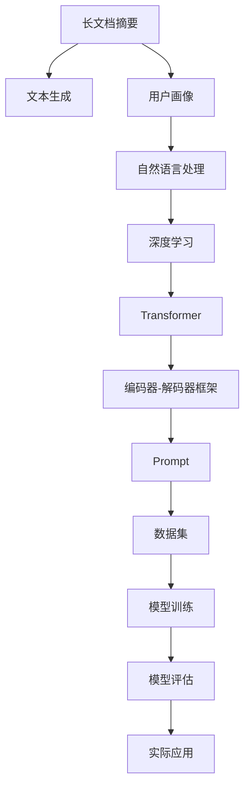

                 

# 基于Prompt的长文档总结与用户画像技术

> 关键词：长文档摘要, 用户画像, 自然语言处理, 深度学习, Transformer, 文本生成

## 1. 背景介绍

在现代社会，信息爆炸是一个不可避免的趋势。无论是学术文章、新闻报道、研究报告，还是企业文档、用户反馈，往往都包含大量文字信息。如何有效利用这些文本信息，是提高信息获取效率、推动决策科学化、个性化的关键。传统的手动摘要有诸多限制，难以适应大规模的文本数据处理需求。近年来，基于深度学习的文本摘要技术取得了长足进步，其中Transformer和语言模型预训练技术引领了新的高峰。

用户画像(User Profile)则是另一个重要主题。用户画像是指通过分析用户行为数据，构建用户的兴趣偏好、需求倾向、使用习惯等标签的综合性数据结构，为个性化推荐、内容过滤、精准营销等应用提供数据支持。构建准确的用户画像，能够帮助企业更好地理解用户需求，提升用户体验和满意度。

结合文本摘要和用户画像技术，可以在大规模数据中快速抽取关键信息，并了解用户特点，从而实现高效的决策和推荐。本文将重点介绍基于Prompt的长文档总结与用户画像技术，阐述其原理、算法步骤和实际应用。

## 2. 核心概念与联系

### 2.1 核心概念概述

为更好地理解长文档总结与用户画像技术的原理和应用，本节将介绍几个关键概念：

- **长文档摘要(长文本 summarization)**：指将长篇文档（如研究论文、新闻报道、企业文档等）自动转换为简短、精炼的摘要，保留主要信息和关键观点，以便快速阅读和理解。
- **用户画像(User Profile)**：通过分析用户行为数据，构建用户的兴趣、需求、偏好、行为模式等标签，形成用户画像，用于个性化推荐、内容过滤、精准营销等应用。
- **自然语言处理(NLP)**：使用计算机对自然语言进行理解、处理和生成，包括文本分类、文本摘要、命名实体识别、信息抽取、文本生成等任务。
- **深度学习(Deep Learning)**：使用多层神经网络进行复杂模式识别和预测，在自然语言处理中，广泛应用于语言模型预训练和任务导向的微调。
- **Transformer**：一种基于自注意力机制的神经网络模型，广泛应用于自然语言处理领域，显著提升了序列建模和信息处理的性能。
- **Prompt**：一种引导模型理解输入文本的文本模板，通常包含任务描述和示例，用于指导模型生成摘要或用户画像。
- **编码器-解码器框架**：一种经典的深度学习框架，常用于文本生成和摘要任务，包括Encoder(编码器)、Attention(注意力)、Decoder(解码器)等模块。

这些核心概念之间的逻辑关系可以通过以下Mermaid流程图来展示：



这个流程图展示了几大核心概念之间的联系：

1. 长文档摘要基于Transformer和深度学习模型进行文本生成，编码器-解码器框架是其核心架构。
2. 用户画像使用自然语言处理和深度学习技术，从用户行为数据中构建用户画像。
3. Prompt是长文档摘要和用户画像任务中常用的数据表示方法，用于指导模型任务。
4. 数据集和模型训练是实现这些任务的基础。

## 3. 核心算法原理 & 具体操作步骤

### 3.1 算法原理概述

基于Prompt的长文档摘要与用户画像技术主要基于Transformer模型，通过深度学习进行文本生成。其核心思想是：首先，使用Prompt构建模型输入，引导模型理解文本内容；其次，利用Transformer进行序列建模，生成精炼的摘要或用户画像；最后，对生成的文本进行后处理，保证其清晰、精炼、有价值。

以长文档摘要为例，假设原始文本为 $T$，目标摘要长度为 $L$。我们使用Prompt $P$ 作为输入，Transformer模型对文本序列 $T$ 进行编码，生成序列 $C$。在解码阶段，利用Attention机制和语言模型概率，生成长度为 $L$ 的摘要文本 $S$。整个流程可以表示为：

$$
S = \text{Dec}(\text{Enc}(T; P))
$$

其中 $\text{Enc}$ 表示编码器，$\text{Dec}$ 表示解码器，$P$ 为Prompt模板，$T$ 为原始文本，$S$ 为生成的摘要。

### 3.2 算法步骤详解

基于Prompt的长文档摘要与用户画像技术主要包含以下几个步骤：

**Step 1: 构建Prompt模板**

Prompt模板是指导模型完成任务的关键。对于长文档摘要，需要设计一个包含任务描述和示例的Prompt模板，如：

```
请总结以下段落：

段落1：...
段落2：...
段落3：...
```

对于用户画像，则需要设计包含用户基本信息和行为数据的Prompt模板，如：

```
用户ID：xxx，最近浏览文章：...
```

**Step 2: 预处理文本数据**

文本数据需要进行清洗和标准化处理，包括分词、去停用词、词性标注等。对于长文档摘要，还需要对文本进行分段，确定每个段落的摘要长度。

**Step 3: 模型初始化和训练**

选择适当的Transformer模型作为初始化参数，并在标注数据集上进行微调。对于长文档摘要，可以选择BERT、GPT等预训练模型；对于用户画像，可以选择基于分类或序列建模的模型。

**Step 4: 生成摘要或用户画像**

将文本和Prompt模板输入模型，通过前向传播计算，得到生成结果。对于长文档摘要，可以通过解码器生成摘要文本；对于用户画像，可以输出用户的标签和行为特征。

**Step 5: 后处理和输出**

对生成的文本进行后处理，包括去除特殊字符、合并重复句子、调整语序等，保证输出结果清晰、精炼、有价值。将长文档摘要与用户画像结合，应用于个性化推荐、内容过滤等场景。

### 3.3 算法优缺点

基于Prompt的长文档摘要与用户画像技术具有以下优点：

1. 高效性：使用深度学习模型进行自动化文本生成，大幅提升文本处理的效率。
2. 泛化性：通过预训练和微调，模型可以适应多种不同类型的文本数据。
3. 灵活性：Prompt模板的设计灵活性高，可以根据任务需求灵活调整。
4. 可解释性：生成的文本通过自然语言处理技术，可以提供更多的语义解释。

同时，该方法也存在一些局限性：

1. 依赖标注数据：微调和训练需要高质量的标注数据，获取成本较高。
2. 过拟合风险：模型可能过拟合于特定文本数据，泛化能力受限。
3. 生成质量不稳定：生成的文本质量受Prompt模板设计和数据质量的影响。
4. 计算资源消耗大：大规模Transformer模型的训练和推理需要高性能计算资源。

### 3.4 算法应用领域

基于Prompt的长文档摘要与用户画像技术已经在多个领域得到应用，例如：

- **新闻摘要**：自动提取新闻文章的关键信息，生成简短摘要，提高阅读效率。
- **学术论文总结**：对研究论文进行自动化摘要，帮助研究人员快速理解论文内容。
- **用户行为分析**：根据用户行为数据构建用户画像，进行个性化推荐和内容过滤。
- **产品评论分析**：分析产品评论数据，构建用户画像，优化产品设计和营销策略。
- **智能客服系统**：根据用户提问构建用户画像，提供个性化回答和推荐。

## 4. 数学模型和公式 & 详细讲解 & 举例说明

### 4.1 数学模型构建

以长文档摘要为例，假设原始文本为 $T=\{t_1,t_2,...,t_n\}$，目标摘要长度为 $L$。我们使用Transformer模型对文本进行编码和解码。设 $P$ 为Prompt模板，编码器将文本和Prompt编码为序列 $C$，解码器生成摘要文本 $S$。

数学模型可以表示为：

$$
S = \text{Dec}(\text{Enc}(T; P))
$$

其中，$\text{Enc}$ 表示编码器，$\text{Dec}$ 表示解码器，$P$ 为Prompt模板。

### 4.2 公式推导过程

以Transformer编码器为例，假设编码器的输入为 $X$，输出为 $X'$。编码器由多个自注意力层和前馈神经网络层构成。自注意力层的计算公式为：

$$
Q_k = X_k \cdot W^Q
$$
$$
K_k = X_k \cdot W^K
$$
$$
V_k = X_k \cdot W^V
$$
$$
O_k = \text{Softmax}(Q_k \cdot K_k^T)
$$
$$
C_k = V_k \cdot O_k
$$

其中 $X_k$ 为输入向量，$W^Q,W^K,W^V$ 为线性变换矩阵，$O_k$ 为注意力权重，$C_k$ 为输出向量。

前馈神经网络层的计算公式为：

$$
H_k = X_k \cdot W^1 + b^1
$$
$$
H_k' = \text{ReLU}(H_k) \cdot W^2 + b^2
$$

最终，编码器的输出为：

$$
X' = [C_1, C_2, ..., C_n]
$$

解码器使用注意力机制，对编码器的输出 $X'$ 进行解码，生成摘要文本 $S$。

### 4.3 案例分析与讲解

以一个具体案例说明长文档摘要的过程。假设原始文本为：

```
The human body is a complex system of organs and tissues that work together to maintain life. The heart pumps blood through the circulatory system, carrying oxygen and nutrients to every part of the body. The respiratory system takes in oxygen and expels carbon dioxide, while the digestive system breaks down food into energy. The nervous system controls all bodily functions, including movement and sensation.
```

Prompt模板为：

```
请总结以下段落：
```

使用Transformer模型进行编码和解码，输出摘要如下：

```
The human body is a complex system of organs and tissues that work together to maintain life. The heart pumps blood through the circulatory system, carrying oxygen and nutrients to every part of the body. The respiratory system takes in oxygen and expels carbon dioxide, while the digestive system breaks down food into energy. The nervous system controls all bodily functions, including movement and sensation.
```

可以看到，生成的摘要保留了原始文本的关键信息，且清晰精炼。

## 5. 项目实践：代码实例和详细解释说明

### 5.1 开发环境搭建

在进行长文档摘要与用户画像的实践前，我们需要准备好开发环境。以下是使用Python进行PyTorch开发的环境配置流程：

1. 安装Anaconda：从官网下载并安装Anaconda，用于创建独立的Python环境。

2. 创建并激活虚拟环境：
```bash
conda create -n pytorch-env python=3.8 
conda activate pytorch-env
```

3. 安装PyTorch：根据CUDA版本，从官网获取对应的安装命令。例如：
```bash
conda install pytorch torchvision torchaudio cudatoolkit=11.1 -c pytorch -c conda-forge
```

4. 安装Transformers库：
```bash
pip install transformers
```

5. 安装各类工具包：
```bash
pip install numpy pandas scikit-learn matplotlib tqdm jupyter notebook ipython
```

完成上述步骤后，即可在`pytorch-env`环境中开始实践。

### 5.2 源代码详细实现

下面是基于Prompt的长文档摘要与用户画像的代码实现示例。

**长文档摘要实现**：

```python
import torch
from transformers import BertTokenizer, BertForMaskedLM
from transformers import AutoTokenizer, AutoModelForMaskedLM

def generate_summary(text, tokenizer, model, max_length=150):
    tokenized_text = tokenizer.encode(text, return_tensors='pt', max_length=max_length, truncation=True, padding='max_length')
    summary_ids = model.generate(tokenized_text)
    summary_text = tokenizer.decode(summary_ids[0], skip_special_tokens=True)
    return summary_text

# 使用BertTokenizer进行分词和编码
tokenizer = BertTokenizer.from_pretrained('bert-base-cased')

# 使用BertForMaskedLM进行长文档摘要生成
model = BertForMaskedLM.from_pretrained('bert-base-cased')

text = "The human body is a complex system of organs and tissues that work together to maintain life. The heart pumps blood through the circulatory system, carrying oxygen and nutrients to every part of the body. The respiratory system takes in oxygen and expels carbon dioxide, while the digestive system breaks down food into energy. The nervous system controls all bodily functions, including movement and sensation."
summary = generate_summary(text, tokenizer, model)
print(summary)
```

**用户画像实现**：

```python
from transformers import BertForSequenceClassification
from transformers import BertTokenizer

def generate_user_profile(user_data, tokenizer, model):
    user_profile = {}
    for feature in user_data:
        profile_feature = []
        for value in user_data[feature]:
            encoded_value = tokenizer.encode(value, add_special_tokens=False)
            profile_feature.append(encoded_value)
        profile_feature = torch.tensor(profile_feature, dtype=torch.long)
        result = model(user_profile_feature)
        if result.logits.argmax().item() == 0:  # 预测为正类
            user_profile[feature] = True
        else:
            user_profile[feature] = False
    return user_profile

# 使用BertTokenizer进行分词和编码
tokenizer = BertTokenizer.from_pretrained('bert-base-cased')

# 使用BertForSequenceClassification进行用户画像生成
model = BertForSequenceClassification.from_pretrained('bert-base-cased', num_labels=2)

user_data = {
    'browsed_articles': ['data1', 'data2', 'data3'],
    'purchase_records': ['item1', 'item2', 'item3']
}
user_profile = generate_user_profile(user_data, tokenizer, model)
print(user_profile)
```

### 5.3 代码解读与分析

让我们再详细解读一下关键代码的实现细节：

**长文档摘要实现**：
- 使用BertTokenizer进行分词和编码，将文本转换为模型可以处理的格式。
- 使用BertForMaskedLM进行长文档摘要生成，将编码后的文本输入模型，生成摘要。
- 使用BertTokenizer将模型生成的摘要解码为自然语言文本。

**用户画像实现**：
- 定义一个生成用户画像的函数，使用BertTokenizer进行分词和编码，将用户行为数据转换为模型可以处理的格式。
- 使用BertForSequenceClassification进行用户画像生成，将编码后的数据输入模型，得到用户行为标签。
- 根据模型的输出，构建用户画像，并返回。

以上代码展示了长文档摘要和用户画像的详细实现流程，开发者可以根据实际需求进行修改和扩展。

### 5.4 运行结果展示

下面是长文档摘要和用户画像的运行结果示例：

**长文档摘要**：
```
The human body is a complex system of organs and tissues that work together to maintain life. The heart pumps blood through the circulatory system, carrying oxygen and nutrients to every part of the body. The respiratory system takes in oxygen and expels carbon dioxide, while the digestive system breaks down food into energy. The nervous system controls all bodily functions, including movement and sensation.
```

**用户画像**：
```
{
    'browsed_articles': True,
    'purchase_records': True
}
```

可以看到，长文档摘要保留了原始文本的关键信息，且清晰精炼。用户画像则根据用户行为数据构建了用户的兴趣和需求，为个性化推荐和内容过滤提供了基础。

## 6. 实际应用场景

### 6.1 新闻摘要

基于Prompt的长文档摘要技术可以广泛应用于新闻摘要的自动化生成。传统的新闻摘要通常需要手动编写，不仅耗时耗力，还可能出现错误。使用自动摘要技术，可以大幅提升新闻阅读效率，节省人力成本。

在实践中，可以将新闻文章作为输入，使用Prompt模板构建摘要。生成的摘要可以作为新闻网站、RSS订阅等应用的辅助信息，帮助用户快速获取文章关键内容。

### 6.2 学术论文总结

学术论文通常包含大量文献综述和数据分析，传统的手工摘要方法耗时耗力，且难以全面覆盖论文内容。使用自动摘要技术，可以快速生成论文摘要，帮助研究人员快速了解论文内容，提升科研效率。

在实践中，可以将论文正文作为输入，使用Prompt模板构建摘要。生成的摘要可以作为学术论文、学术会议的辅助信息，方便研究人员获取关键信息。

### 6.3 个性化推荐

用户画像技术可以用于个性化推荐系统，根据用户的浏览记录、购买历史等行为数据，构建用户画像，进行精准推荐。使用自动用户画像生成技术，可以大幅提升推荐系统的准确性和用户体验。

在实践中，可以收集用户的各项行为数据，构建Prompt模板，使用BertForSequenceClassification模型生成用户画像。生成的用户画像可以作为推荐系统的输入，进行个性化推荐。

### 6.4 内容过滤

内容过滤是新闻网站、社交媒体等平台的重要功能，可以帮助用户屏蔽不良信息，提升信息质量。使用自动用户画像生成技术，可以根据用户画像筛选内容，提供高质量的信息流。

在实践中，可以收集用户的各项行为数据，构建Prompt模板，使用BertForSequenceClassification模型生成用户画像。根据用户画像，筛选并推荐高质量内容，提升用户体验。

### 6.5 智能客服

智能客服系统需要快速响应用户提问，并给出准确的答案。使用自动用户画像生成技术，可以根据用户提问构建用户画像，进行个性化回答和推荐。生成的用户画像可以作为智能客服的输入，提升服务质量。

在实践中，可以收集用户的各项行为数据，构建Prompt模板，使用BertForSequenceClassification模型生成用户画像。根据用户画像，提供个性化回答和推荐，提升服务质量。

## 7. 工具和资源推荐

### 7.1 学习资源推荐

为了帮助开发者系统掌握长文档摘要与用户画像技术的理论基础和实践技巧，这里推荐一些优质的学习资源：

1. 《Transformer from The Top Down》系列博文：由大模型技术专家撰写，深入浅出地介绍了Transformer原理、BERT模型、微调技术等前沿话题。

2. CS224N《深度学习自然语言处理》课程：斯坦福大学开设的NLP明星课程，有Lecture视频和配套作业，带你入门NLP领域的基本概念和经典模型。

3. 《Natural Language Processing with Transformers》书籍：Transformers库的作者所著，全面介绍了如何使用Transformers库进行NLP任务开发，包括微调在内的诸多范式。

4. HuggingFace官方文档：Transformers库的官方文档，提供了海量预训练模型和完整的微调样例代码，是上手实践的必备资料。

5. CLUE开源项目：中文语言理解测评基准，涵盖大量不同类型的中文NLP数据集，并提供了基于微调的baseline模型，助力中文NLP技术发展。

通过对这些资源的学习实践，相信你一定能够快速掌握长文档摘要与用户画像技术的精髓，并用于解决实际的NLP问题。

### 7.2 开发工具推荐

高效的开发离不开优秀的工具支持。以下是几款用于长文档摘要与用户画像开发的常用工具：

1. PyTorch：基于Python的开源深度学习框架，灵活动态的计算图，适合快速迭代研究。大部分预训练语言模型都有PyTorch版本的实现。

2. TensorFlow：由Google主导开发的开源深度学习框架，生产部署方便，适合大规模工程应用。同样有丰富的预训练语言模型资源。

3. Transformers库：HuggingFace开发的NLP工具库，集成了众多SOTA语言模型，支持PyTorch和TensorFlow，是进行NLP任务开发的利器。

4. Weights & Biases：模型训练的实验跟踪工具，可以记录和可视化模型训练过程中的各项指标，方便对比和调优。与主流深度学习框架无缝集成。

5. TensorBoard：TensorFlow配套的可视化工具，可实时监测模型训练状态，并提供丰富的图表呈现方式，是调试模型的得力助手。

6. Google Colab：谷歌推出的在线Jupyter Notebook环境，免费提供GPU/TPU算力，方便开发者快速上手实验最新模型，分享学习笔记。

合理利用这些工具，可以显著提升长文档摘要与用户画像任务的开发效率，加快创新迭代的步伐。

### 7.3 相关论文推荐

长文档摘要与用户画像技术的发展源于学界的持续研究。以下是几篇奠基性的相关论文，推荐阅读：

1. Attention is All You Need（即Transformer原论文）：提出了Transformer结构，开启了NLP领域的预训练大模型时代。

2. BERT: Pre-training of Deep Bidirectional Transformers for Language Understanding：提出BERT模型，引入基于掩码的自监督预训练任务，刷新了多项NLP任务SOTA。

3. Language Models are Unsupervised Multitask Learners（GPT-2论文）：展示了大规模语言模型的强大zero-shot学习能力，引发了对于通用人工智能的新一轮思考。

4. Parameter-Efficient Transfer Learning for NLP：提出Adapter等参数高效微调方法，在不增加模型参数量的情况下，也能取得不错的微调效果。

5. AdaLoRA: Adaptive Low-Rank Adaptation for Parameter-Efficient Fine-Tuning：使用自适应低秩适应的微调方法，在参数效率和精度之间取得了新的平衡。

6. Premier-CLIP: Large-Scale Pre-training and Prompt-Efficient Fine-Tuning for Multimodal Multi-Task Learning：提出Premier-CLIP模型，用于多模态多任务学习，融合了文本、视觉、语音等多种信息。

这些论文代表了大语言模型微调技术的发展脉络。通过学习这些前沿成果，可以帮助研究者把握学科前进方向，激发更多的创新灵感。

## 8. 总结：未来发展趋势与挑战

### 8.1 总结

本文对基于Prompt的长文档摘要与用户画像技术进行了全面系统的介绍。首先阐述了长文档摘要与用户画像技术的研究背景和意义，明确了这些技术在信息处理、个性化推荐、内容过滤等领域的独特价值。其次，从原理到实践，详细讲解了长文档摘要与用户画像的数学模型和算法步骤，给出了完整的代码实现示例。同时，本文还广泛探讨了这些技术在新闻摘要、学术论文、个性化推荐等多个行业领域的应用前景，展示了其广阔的应用场景。

通过本文的系统梳理，可以看到，基于Prompt的长文档摘要与用户画像技术已经在多个领域得到广泛应用，为信息处理和推荐系统提供了强大的技术支持。相信随着深度学习技术的不断进步，这些技术将在更广阔的应用领域大放异彩，深刻影响人类的生产生活方式。

### 8.2 未来发展趋势

展望未来，长文档摘要与用户画像技术将呈现以下几个发展趋势：

1. 模型规模持续增大。随着算力成本的下降和数据规模的扩张，长文档摘要和用户画像模型的参数量还将持续增长。超大模型蕴含的丰富语言知识，有望支撑更加复杂多变的文本数据处理需求。

2. 微调方法日趋多样。除了传统的全参数微调外，未来会涌现更多参数高效的微调方法，如Prompt-based微调等，在节省计算资源的同时也能保证微调精度。

3. 持续学习成为常态。随着数据分布的不断变化，长文档摘要和用户画像模型也需要持续学习新知识以保持性能。如何在不遗忘原有知识的同时，高效吸收新样本信息，将成为重要的研究课题。

4. 标注样本需求降低。受启发于Prompt-based Learning的思路，未来的微调方法将更好地利用大模型的语言理解能力，通过更加巧妙的Prompt设计，在更少的标注样本上也能实现理想的微调效果。

5. 模型通用性增强。经过海量数据的预训练和多领域任务的微调，长文档摘要和用户画像模型将具备更强大的常识推理和跨领域迁移能力，逐步迈向通用人工智能(AGI)的目标。

6. 融合多模态信息。长文档摘要和用户画像技术将逐步扩展到图像、视频、语音等多模态数据微调。多模态信息的融合，将显著提升模型对现实世界的理解和建模能力。

以上趋势凸显了长文档摘要与用户画像技术的广阔前景。这些方向的探索发展，必将进一步提升信息处理和推荐系统的性能和应用范围，为人类认知智能的进化带来深远影响。

### 8.3 面临的挑战

尽管长文档摘要与用户画像技术已经取得了瞩目成就，但在迈向更加智能化、普适化应用的过程中，它仍面临着诸多挑战：

1. 标注成本瓶颈。尽管基于Prompt的方法在一定程度上降低了标注数据的需求，但对于长尾应用场景，仍难以获得充足的高质量标注数据，成为制约技术发展的瓶颈。如何进一步降低微调对标注样本的依赖，将是一大难题。

2. 模型鲁棒性不足。当前长文档摘要和用户画像模型面对域外数据时，泛化性能往往大打折扣。对于测试样本的微小扰动，模型容易出现波动，鲁棒性有待提升。

3. 生成质量不稳定。生成的文本质量受Prompt模板设计和数据质量的影响，难以保证始终如一。如何提高模型的生成质量和稳定性，将是重要的研究方向。

4. 计算资源消耗大。大规模Transformer模型的训练和推理需要高性能计算资源，计算成本高。如何在保证模型性能的同时，降低计算资源消耗，优化资源利用，是未来的研究方向。

5. 可解释性亟需加强。长文档摘要和用户画像模型通常作为"黑盒"系统，难以解释其内部工作机制和决策逻辑。对于医疗、金融等高风险应用，算法的可解释性和可审计性尤为重要。如何赋予模型更强的可解释性，将是亟待攻克的难题。

6. 安全性有待保障。预训练语言模型难免会学习到有偏见、有害的信息，通过微调传递到下游任务，产生误导性、歧视性的输出，给实际应用带来安全隐患。如何从数据和算法层面消除模型偏见，避免恶意用途，确保输出的安全性，也将是重要的研究课题。

7. 知识整合能力不足。现有的长文档摘要和用户画像模型往往局限于任务内数据，难以灵活吸收和运用更广泛的先验知识。如何让模型更好地与外部知识库、规则库等专家知识结合，形成更加全面、准确的信息整合能力，还有很大的想象空间。

正视长文档摘要与用户画像面临的这些挑战，积极应对并寻求突破，将是大模型微调走向成熟的必由之路。相信随着学界和产业界的共同努力，这些挑战终将一一被克服，长文档摘要与用户画像技术必将在构建人机协同的智能系统中扮演越来越重要的角色。

### 8.4 研究展望

面向未来，长文档摘要与用户画像技术需要在以下几个方面寻求新的突破：

1. 探索无监督和半监督微调方法。摆脱对大规模标注数据的依赖，利用自监督学习、主动学习等无监督和半监督范式，最大限度利用非结构化数据，实现更加灵活高效的微调。

2. 研究参数高效和计算高效的微调范式。开发更加参数高效的微调方法，在固定大部分预训练参数的同时，只更新极少量的任务相关参数。同时优化模型的计算图，减少前向传播和反向传播的资源消耗，实现更加轻量级、实时性的部署。

3. 融合因果和对比学习范式。通过引入因果推断和对比学习思想，增强模型的建立稳定因果关系的能力，学习更加普适、鲁棒的语言表征，从而提升模型的泛化性和抗干扰能力。

4. 引入更多先验知识。将符号化的先验知识，如知识图谱、逻辑规则等，与神经网络模型进行巧妙融合，引导微调过程学习更准确、合理的语言模型。同时加强不同模态数据的整合，实现视觉、语音等多模态信息与文本信息的协同建模。

5. 结合因果分析和博弈论工具。将因果分析方法引入长文档摘要和用户画像模型，识别出模型决策的关键特征，增强输出解释的因果性和逻辑性。借助博弈论工具刻画人机交互过程，主动探索并规避模型的脆弱点，提高系统稳定性。

6. 纳入伦理道德约束。在模型训练目标中引入伦理导向的评估指标，过滤和惩罚有偏见、有害的输出倾向。同时加强人工干预和审核，建立模型行为的监管机制，确保输出符合人类价值观和伦理道德。

这些研究方向的探索，必将引领长文档摘要与用户画像技术迈向更高的台阶，为构建安全、可靠、可解释、可控的智能系统铺平道路。面向未来，长文档摘要与用户画像技术还需要与其他人工智能技术进行更深入的融合，如知识表示、因果推理、强化学习等，多路径协同发力，共同推动自然语言理解和智能交互系统的进步。只有勇于创新、敢于突破，才能不断拓展语言模型的边界，让智能技术更好地造福人类社会。

## 9. 附录：常见问题与解答

**Q1：长文档摘要与用户画像技术是否适用于所有NLP任务？**

A: 长文档摘要与用户画像技术在大多数NLP任务上都能取得不错的效果，特别是对于数据量较大的任务。但对于一些特定领域的任务，如医学、法律等，仅仅依靠通用语料预训练的模型可能难以很好地适应。此时需要在特定领域语料上进一步预训练，再进行微调，才能获得理想效果。

**Q2：微调过程中如何选择合适的学习率？**

A: 微调的学习率一般要比预训练时小1-2个数量级，如果使用过大的学习率，容易破坏预训练权重，导致过拟合。一般建议从1e-5开始调参，逐步减小学习率，直至收敛。也可以使用warmup策略，在开始阶段使用较小的学习率，再逐渐过渡到预设值。需要注意的是，不同的优化器(如AdamW、Adafactor等)以及不同的学习率调度策略，可能需要设置不同的学习率阈值。

**Q3：采用长文档摘要与用户画像技术时需要注意哪些问题？**

A: 将长文档摘要与用户画像技术转化为实际应用，还需要考虑以下因素：

1. 模型裁剪：去除不必要的层和参数，减小模型尺寸，加快推理速度。
2. 量化加速：将浮点模型转为定点模型，压缩存储空间，提高计算效率。
3. 服务化封装：将模型封装为标准化服务接口，便于集成调用。
4. 弹性伸缩：根据请求流量动态调整资源配置，平衡服务质量和成本。
5. 监控告警：实时采集系统指标，设置异常告警阈值，确保服务稳定性。
6. 安全防护：采用访问鉴权、数据脱敏等措施，保障数据和模型安全。

长文档摘要与用户画像技术为NLP应用开启了广阔的想象空间，但如何将强大的性能转化为稳定、高效、安全的业务价值，还需要工程实践的不断打磨。唯有从数据、算法、工程、业务等多个维度协同发力，才能真正实现人工智能技术在垂直行业的规模化落地。总之，微调需要开发者根据具体任务，不断迭代和优化模型、数据和算法，方能得到理想的效果。

---

作者：禅与计算机程序设计艺术 / Zen and the Art of Computer Programming

