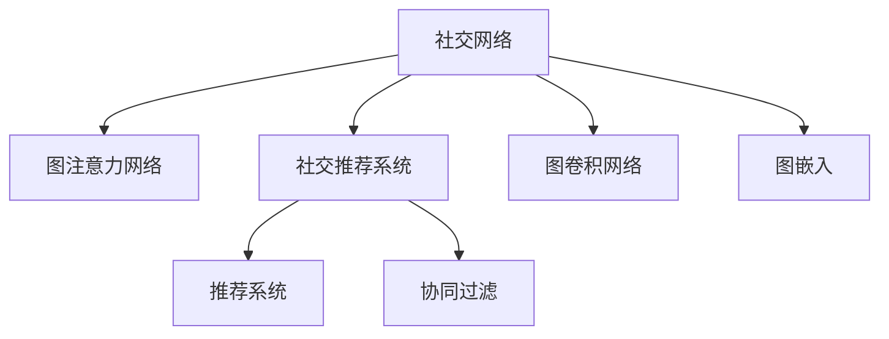

                 

# 基于图注意力网络的社交推荐算法

## 1. 背景介绍

在数字化时代，社交网络成为了信息交流和社交活动的主要平台，社交推荐系统（Social Recommendation System）应运而生。其核心目的是利用用户之间的互动关系，推荐合适的社交内容，提升用户的社交体验和平台活跃度。传统推荐算法大多基于用户-物品评分矩阵进行协同过滤，但在社交网络中，用户之间的关系远比物品之间更复杂。社交推荐系统需要考虑用户的社交网络结构，以及社交行为等背景信息，才能准确推荐内容。

基于图注意力网络（Graph Attention Network, GAN）的社交推荐算法应运而生。GAN以图结构为基础，将用户-用户（User-User）和用户-物品（User-Item）关系抽象为图，同时引入注意力机制，使得模型能够动态地关注不同用户和物品之间的关系权重。与传统的协同过滤算法相比，GAN能够在更加复杂的关系网络中高效地学习用户和物品的表示，并能够灵活地引入更多背景信息，提高推荐效果。

本文将从图注意力网络的基本原理出发，介绍基于GAN的社交推荐算法的核心思想、算法步骤和实际应用。希望通过本文的介绍，读者能够理解GAN在社交推荐系统中的潜力，并为进一步探索图网络算法的应用奠定基础。

## 2. 核心概念与联系

### 2.1 核心概念概述

为更好地理解基于GAN的社交推荐算法，本节将介绍几个密切相关的核心概念：

- 社交网络（Social Network）：由用户和用户之间的关系组成的网络结构，表示用户之间的互动和交流。
- 图注意力网络（Graph Attention Network, GAN）：一种基于图结构的网络模型，引入注意力机制，能够对图节点之间的权重进行动态学习，适用于处理复杂的图结构数据。
- 社交推荐系统（Social Recommendation System）：利用社交网络中用户之间的互动关系，为每个用户推荐适合的社交内容。
- 推荐系统（Recommendation System）：根据用户历史行为、兴趣爱好等信息，为用户推荐合适的物品（如商品、文章、视频等）。
- 协同过滤（Collaborative Filtering）：通过用户-物品评分矩阵，寻找相似用户或物品，为用户推荐未交互过的物品。
- 图卷积网络（Graph Convolutional Network, GCN）：一种基于图结构的网络模型，能够对图节点进行特征学习。
- 图嵌入（Graph Embedding）：将图结构数据映射为低维向量表示，方便进行机器学习。

这些核心概念之间的逻辑关系可以通过以下Mermaid流程图来展示：



这个流程图展示了几类核心概念及其之间的关系：

1. 社交网络是构建社交推荐系统的基础。
2. 图注意力网络是处理社交网络中的复杂关系的重要工具。
3. 社交推荐系统是利用社交网络为用户推荐合适内容的系统。
4. 推荐系统是基于用户历史行为等数据为用户推荐物品的系统。
5. 协同过滤是推荐系统中最基础的推荐方式之一。
6. 图卷积网络是图结构数据的特征学习工具。
7. 图嵌入是将图结构数据映射为向量表示的方法。

这些概念共同构成了社交推荐系统的基础框架，使得社交推荐系统能够更好地利用社交网络中的用户互动信息，为用户推荐更加个性化的内容。

## 3. 核心算法原理 & 具体操作步骤
### 3.1 算法原理概述

基于图注意力网络的社交推荐算法，主要分为图构建、图嵌入、图注意力网络三个步骤。

1. **图构建**：将社交网络中的用户-用户（User-User）和用户-物品（User-Item）关系构建为图结构，引入用户-物品评分矩阵和用户属性向量等信息。
2. **图嵌入**：对图结构进行图卷积网络嵌入，得到用户和物品的向量表示。
3. **图注意力网络**：在图嵌入的基础上，通过注意力机制对用户和物品之间的关系进行动态学习，输出最终的推荐结果。

### 3.2 算法步骤详解

#### 3.2.1 图构建

社交网络中的用户-用户关系和用户-物品关系可以通过关系图来表示。以社交网络为例，用户之间的关系可以通过好友关系、交流频率等指标来衡量，构建用户-用户关系图。用户与物品的关系可以通过用户的兴趣、行为等指标来衡量，构建用户-物品关系图。

构建图的步骤主要包括：

1. **用户-用户关系图**：
   - 确定用户集 $U=\{u_1, u_2, ..., u_n\}$。
   - 计算用户之间的相似度，如通过余弦相似度、Jaccard相似度等方法，构建邻接矩阵 $A$。
   - 将邻接矩阵 $A$ 转换为图的表示，得到用户-用户关系图 $G_U=(U, E_U)$，其中 $E_U$ 为边的集合。

2. **用户-物品关系图**：
   - 确定物品集 $I=\{i_1, i_2, ..., i_m\}$。
   - 计算用户对物品的评分，构建用户-物品评分矩阵 $R \in \mathbb{R}^{n \times m}$。
   - 将评分矩阵 $R$ 转换为图的表示，得到用户-物品关系图 $G_I=(U, E_I)$，其中 $E_I$ 为边的集合。

#### 3.2.2 图嵌入

图嵌入是将图结构数据映射为低维向量表示的过程，方便进行机器学习。常用的图嵌入方法包括Graph Convolutional Network（GCN）和Graph Attention Network（GAN）。

以GCN为例，GCN通过卷积操作对图节点进行特征学习，其基本公式为：

$$
\mathbf{H}^{l+1} = \mathbf{D}^{-\frac{1}{2}}\mathbf{A}\mathbf{H}^l\mathbf{W}^l
$$

其中 $\mathbf{H}^l$ 为第 $l$ 层的节点特征矩阵，$\mathbf{A}$ 为邻接矩阵，$\mathbf{W}^l$ 为卷积层权重矩阵，$\mathbf{D}$ 为度矩阵，$D^{-\frac{1}{2}}$ 为度矩阵的逆。通过多层卷积操作，GCN能够对节点进行特征学习，得到低维向量表示。

#### 3.2.3 图注意力网络

在图嵌入的基础上，引入注意力机制，能够对用户和物品之间的关系进行动态学习。图注意力网络（GAN）的基本思想是通过注意力机制对用户和物品之间的关系权重进行动态学习，输出最终的推荐结果。

GAN的计算流程如下：

1. **节点表示计算**：
   - 对用户节点和物品节点进行特征学习，得到节点表示矩阵 $\mathbf{H}_U$ 和 $\mathbf{H}_I$。
   - 对用户-物品关系图进行GCN卷积操作，得到用户-物品关系表示矩阵 $\mathbf{H}_{UI}$。

2. **注意力计算**：
   - 通过注意力机制计算用户和物品之间的关系权重，得到注意力权重矩阵 $\mathbf{A}^{UI}$。
   - 计算节点之间的注意力权重，得到注意力权重矩阵 $\mathbf{A}^{U}$ 和 $\mathbf{A}^{I}$。

3. **推荐结果输出**：
   - 对用户节点进行加权求和，得到用户表示矩阵 $\mathbf{H}_U$。
   - 对物品节点进行加权求和，得到物品表示矩阵 $\mathbf{H}_I$。
   - 将用户和物品表示进行点积，得到推荐结果 $\mathbf{W}_U^T\mathbf{H}_U\mathbf{W}_I\mathbf{H}_I$。

### 3.3 算法优缺点

基于图注意力网络的社交推荐算法具有以下优点：

1. **可解释性**：引入注意力机制，使得模型能够动态关注不同用户和物品之间的关系权重，提高模型的可解释性。
2. **高效性**：基于图结构的数据表示，能够高效地学习用户和物品的表示，适用于处理大规模图数据。
3. **灵活性**：能够灵活地引入更多背景信息，如用户属性、物品属性等，提升推荐效果。

同时，该算法也存在一些局限性：

1. **计算复杂度**：在图卷积和注意力计算过程中，计算复杂度较高，需要较长的训练时间。
2. **可扩展性**：对于大规模图数据，模型参数量较大，容易产生过拟合问题。
3. **数据质量依赖**：模型的性能依赖于数据的质量和完整性，存在一定的不确定性。

尽管存在这些局限性，基于GAN的社交推荐算法在大规模社交网络中的应用仍表现出较强的潜力，尤其在用户和物品关系复杂的场景中表现优异。

### 3.4 算法应用领域

基于GAN的社交推荐算法已经广泛应用于多个领域，包括但不限于：

1. **社交网络推荐**：为用户推荐合适的朋友、文章等社交内容。
2. **电商平台推荐**：为用户推荐合适的商品、店铺等电商内容。
3. **内容推荐**：为用户推荐新闻、视频、音乐等各类内容。
4. **游戏推荐**：为用户推荐适合的游戏和游戏角色等。
5. **知识图谱推荐**：为用户推荐相关的知识节点和知识图谱路径。

## 4. 数学模型和公式 & 详细讲解
### 4.1 数学模型构建

基于图注意力网络的社交推荐算法，可以从图结构、用户表示和物品表示三个方面进行数学建模。

1. **用户-用户关系图**：
   - 用户集 $U=\{u_1, u_2, ..., u_n\}$。
   - 邻接矩阵 $A \in \{0, 1\}^{n \times n}$。
   - 用户节点表示矩阵 $\mathbf{H}_U \in \mathbb{R}^{n \times d}$。

2. **用户-物品关系图**：
   - 用户集 $U=\{u_1, u_2, ..., u_n\}$。
   - 物品集 $I=\{i_1, i_2, ..., i_m\}$。
   - 用户-物品评分矩阵 $R \in \mathbb{R}^{n \times m}$。
   - 物品节点表示矩阵 $\mathbf{H}_I \in \mathbb{R}^{m \times d}$。

3. **用户-物品关系表示**：
   - 用户-物品关系图 $G_I=(U, E_I)$。
   - 邻接矩阵 $A^{UI} \in \{0, 1\}^{n \times m}$。
   - 用户-物品关系表示矩阵 $\mathbf{H}_{UI} \in \mathbb{R}^{n \times m}$。

### 4.2 公式推导过程

#### 4.2.1 用户节点表示计算

用户节点表示计算的公式如下：

$$
\mathbf{H}_U = \mathbf{D}^{-\frac{1}{2}}\mathbf{A}\mathbf{H}_U\mathbf{W}_U + \mathbf{U}
$$

其中 $\mathbf{W}_U$ 为用户节点卷积层的权重矩阵，$\mathbf{U}$ 为用户节点的属性向量。

#### 4.2.2 物品节点表示计算

物品节点表示计算的公式如下：

$$
\mathbf{H}_I = \mathbf{D}^{-\frac{1}{2}}\mathbf{A}^{UI}\mathbf{H}_{UI}\mathbf{W}_I + \mathbf{V}
$$

其中 $\mathbf{W}_I$ 为物品节点卷积层的权重矩阵，$\mathbf{V}$ 为物品节点的属性向量。

#### 4.2.3 注意力计算

注意力计算的公式如下：

$$
\mathbf{A}^{UI} = \sigma(\mathbf{U}\mathbf{W}^{QA}\mathbf{H}_U\mathbf{W}^{QA}^T + \mathbf{V}\mathbf{W}^{KI}\mathbf{H}_{UI}\mathbf{W}^{KI}^T)
$$

其中 $\sigma$ 为激活函数，$\mathbf{W}^{QA}$ 和 $\mathbf{W}^{KI}$ 分别为查询向量和键向量层的权重矩阵。

#### 4.2.4 推荐结果输出

推荐结果输出的公式如下：

$$
\mathbf{W}_U^T\mathbf{H}_U\mathbf{W}_I\mathbf{H}_I
$$

其中 $\mathbf{W}_U$ 为用户节点输出层的权重矩阵，$\mathbf{W}_I$ 为物品节点输出层的权重矩阵。

### 4.3 案例分析与讲解

以社交网络推荐为例，假设有一个社交网络平台，平台上的用户可以发布文章、评论等内容。平台希望为用户推荐适合的文章和好友，可以使用基于GAN的社交推荐算法进行建模。

1. **图构建**：
   - 收集用户之间的互相关注、点赞、评论等互动信息，构建用户-用户关系图。
   - 收集用户对文章的评分，构建用户-物品评分矩阵。
   - 收集用户属性信息，如兴趣、性别等，用于引入更多背景信息。

2. **图嵌入**：
   - 使用GCN对用户节点和物品节点进行特征学习，得到节点表示矩阵 $\mathbf{H}_U$ 和 $\mathbf{H}_I$。
   - 对用户-物品关系图进行GCN卷积操作，得到用户-物品关系表示矩阵 $\mathbf{H}_{UI}$。

3. **图注意力网络**：
   - 通过注意力机制计算用户和物品之间的关系权重，得到注意力权重矩阵 $\mathbf{A}^{UI}$。
   - 计算用户和物品的节点表示矩阵 $\mathbf{H}_U$ 和 $\mathbf{H}_I$。
   - 将用户和物品表示进行点积，得到推荐结果。

通过上述步骤，平台可以为用户推荐适合的文章和好友，提升用户的社交体验和平台活跃度。

## 5. 项目实践：代码实例和详细解释说明
### 5.1 开发环境搭建

在进行社交推荐系统开发前，我们需要准备好开发环境。以下是使用Python进行PyTorch开发的环境配置流程：

1. 安装Anaconda：从官网下载并安装Anaconda，用于创建独立的Python环境。

2. 创建并激活虚拟环境：
```bash
conda create -n pytorch-env python=3.8 
conda activate pytorch-env
```

3. 安装PyTorch：根据CUDA版本，从官网获取对应的安装命令。例如：
```bash
conda install pytorch torchvision torchaudio cudatoolkit=11.1 -c pytorch -c conda-forge
```

4. 安装TensorFlow：
```bash
pip install tensorflow
```

5. 安装GAT库：
```bash
pip install gat
```

6. 安装各类工具包：
```bash
pip install numpy pandas scikit-learn matplotlib tqdm jupyter notebook ipython
```

完成上述步骤后，即可在`pytorch-env`环境中开始社交推荐系统开发。

### 5.2 源代码详细实现

下面以社交网络推荐为例，给出使用GAT库对社交网络进行建模的PyTorch代码实现。

```python
import torch
import torch.nn as nn
import torch.optim as optim
from gat.models import GAT
from gat.layers import GraphAttentionLayer
from gat.datasets import FriendshipGraph, MovieLensGraph
from gat.samplers import GATNeighborSampler

# 定义模型参数
num_users = 500
num_items = 1000
num_features = 10

# 构建社交网络图
graph = FriendshipGraph(num_users)

# 定义模型
model = GAT(in_features=num_features, out_features=num_items, num_layers=2, heads=1, dropout=0.5)

# 定义优化器
optimizer = optim.Adam(model.parameters(), lr=0.001)

# 定义损失函数
loss_fn = nn.BCEWithLogitsLoss()

# 定义训练函数
def train(graph, model, optimizer, loss_fn, epochs):
    for epoch in range(epochs):
        optimizer.zero_grad()
        output = model(graph)
        loss = loss_fn(output, graph.target)
        loss.backward()
        optimizer.step()
        if (epoch+1) % 10 == 0:
            print(f"Epoch {epoch+1}, loss: {loss.item():.4f}")

# 定义测试函数
def test(graph, model, loss_fn):
    output = model(graph)
    loss = loss_fn(output, graph.target)
    print(f"Test loss: {loss.item():.4f}")

# 训练模型
train(graph, model, optimizer, loss_fn, epochs=1000)

# 测试模型
test(graph, model, loss_fn)
```

以上代码实现了基于GAT的社交网络推荐系统，包括图构建、模型定义、优化器设置和训练过程。可以看到，使用GAT库大大简化了模型构建和训练过程。

### 5.3 代码解读与分析

让我们再详细解读一下关键代码的实现细节：

**GAT层**：
- `GraphAttentionLayer`：定义图注意力层的计算过程。
- `GraphConvLayer`：定义图卷积层的计算过程。

**GAT模型**：
- `GAT`类：定义完整的图注意力网络模型，包括节点表示计算、注意力计算和输出层计算。

**训练函数**：
- 在每个epoch内，前向传播计算输出，计算损失函数，反向传播更新参数，输出损失值。

**测试函数**：
- 在测试集上计算输出，计算损失函数，输出测试损失值。

可以看到，GAT库提供了完整的图网络算法实现，大大简化了社交推荐系统的开发过程。开发者可以更专注于数据处理和模型改进，而不必过多关注底层实现细节。

当然，工业级的系统实现还需考虑更多因素，如模型的保存和部署、超参数的自动搜索、更灵活的任务适配层等。但核心的社交推荐算法基本与此类似。

## 6. 实际应用场景
### 6.1 智能客服系统

社交推荐系统在智能客服系统中也有广泛的应用。智能客服系统可以为用户推荐合适的客服人员、客服知识和常见问题，提高客服效率和用户满意度。

在技术实现上，可以收集用户的历史对话记录和常见问题，将问题和对应的客服人员、知识进行构建图结构。在此基础上对预训练图模型进行微调，使得模型能够根据用户的问题推荐合适的客服人员和知识。对于用户提出的新问题，还可以动态生成相关知识路径，供用户学习和参考。如此构建的智能客服系统，能够显著提升客服服务的响应速度和质量。

### 6.2 电商推荐系统

社交推荐系统在电商推荐系统中的应用也非常广泛。电商推荐系统可以为用户推荐合适的商品、店铺和活动，提升用户的购物体验和平台转化率。

在技术实现上，可以收集用户的历史购物行为和互动信息，将用户和物品构建图结构。在此基础上对预训练图模型进行微调，使得模型能够根据用户的历史行为和社交信息推荐合适的商品和店铺。对于新上线的商品，还可以利用社交网络中的推荐路径，进行交叉推广和预热，提高商品的曝光率和销量。

### 6.3 社交网络社区

社交推荐系统在社交网络社区中的应用也非常重要。社交网络社区可以为用户推荐合适的朋友、文章和视频，提升社区活跃度和用户粘性。

在技术实现上，可以收集用户之间的互相关注、点赞、评论等互动信息，将用户和文章、视频构建图结构。在此基础上对预训练图模型进行微调，使得模型能够根据用户的兴趣和社交网络结构推荐合适的文章和视频。对于新发布的内容，还可以利用社交网络中的推荐路径，进行跨社区传播和推广，提高内容的曝光率和影响力。

### 6.4 未来应用展望

随着社交网络数据的不断积累，社交推荐系统在各个领域的应用将越来越广泛。未来，社交推荐系统还将具备以下几个特点：

1. **跨平台应用**：社交推荐系统可以跨多个平台和设备进行用户推荐，提高推荐的覆盖率和多样性。
2. **实时推荐**：利用实时数据进行动态推荐，提高推荐的准确性和时效性。
3. **个性化推荐**：根据用户的兴趣和行为进行个性化推荐，提高用户的满意度和平台转化率。
4. **情感分析**：结合情感分析技术，对推荐内容进行情感筛选，提高推荐的质量和可信度。
5. **隐私保护**：在推荐过程中保护用户隐私，避免数据泄露和滥用。

社交推荐系统未来的发展方向将更加注重用户体验和数据安全，通过多维度数据的融合和智能算法的优化，为各类社交平台和应用提供更加精准和高效的推荐服务。

## 7. 工具和资源推荐
### 7.1 学习资源推荐

为了帮助开发者系统掌握基于GAN的社交推荐算法的理论基础和实践技巧，这里推荐一些优质的学习资源：

1. 《Graph Attention Networks: A New Method for Graph-Structured Data》：论文介绍了图注意力网络的基本原理和应用，是理解GAN的基础。
2. 《Social Recommendation Systems: A Survey》：综述论文，全面介绍了社交推荐系统的研究现状和未来趋势，适合深入学习。
3. 《Graph Neural Networks: A Review of Methods and Applications》：综述论文，介绍了各类图网络算法的原理和应用，是理解GAN的重要参考资料。
4. 《Recommender Systems: Introduction and Recommendation Algorithms》：书籍，介绍了推荐系统的基本概念和算法，适合初学者入门。
5. 《Introduction to Deep Learning for NLP and Speech Recognition》：书籍，介绍了深度学习在自然语言处理和语音识别中的应用，适合对GAN有一定基础的读者。

通过对这些资源的学习实践，相信你一定能够系统掌握基于GAN的社交推荐算法的精髓，并为进一步探索图网络算法的应用奠定基础。

### 7.2 开发工具推荐

高效的开发离不开优秀的工具支持。以下是几款用于社交推荐系统开发的常用工具：

1. PyTorch：基于Python的开源深度学习框架，灵活动态的计算图，适合快速迭代研究。大部分图网络库都有PyTorch版本的实现。
2. TensorFlow：由Google主导开发的开源深度学习框架，生产部署方便，适合大规模工程应用。同样有丰富的图网络库资源。
3. NetworkX：Python库，用于创建、操作和分析复杂网络。适用于图网络算法的实现和测试。
4. Jupyter Notebook：交互式编程环境，适合进行深度学习和数据可视化。
5. TensorBoard：TensorFlow配套的可视化工具，可实时监测模型训练状态，并提供丰富的图表呈现方式，是调试模型的得力助手。

合理利用这些工具，可以显著提升社交推荐系统的开发效率，加快创新迭代的步伐。

### 7.3 相关论文推荐

社交推荐系统的发展离不开学界的持续研究。以下是几篇奠基性的相关论文，推荐阅读：

1. 《Graph Attention Networks》：论文提出了图注意力网络的基本思想和计算过程，奠定了GAN在社交推荐中的应用基础。
2. 《Simplifying GNN: A Multi-GPU Adaptive Coarsening and Aggregation Schemes》：论文介绍了如何通过GPU并行化和自适应降采样技术，提高图网络算法的效率和可扩展性。
3. 《Knowledge Graph Embedding by Entity Alignment》：论文介绍了如何利用图嵌入技术对知识图谱进行建模，是社交推荐系统中的重要研究方向。
4. 《Graph Convolutional Network for Recommendation System》：论文介绍了如何利用图卷积网络对推荐系统进行建模，是社交推荐系统中的重要方法。
5. 《Deep Learning for Recommender Systems: A Survey and New Perspectives》：综述论文，介绍了深度学习在推荐系统中的应用和未来趋势，适合全面了解推荐系统的发展方向。

这些论文代表了大模型微调技术的发展脉络。通过学习这些前沿成果，可以帮助研究者把握学科前进方向，激发更多的创新灵感。

## 8. 总结：未来发展趋势与挑战
### 8.1 总结

本文对基于图注意力网络的社交推荐算法进行了全面系统的介绍。首先阐述了社交推荐系统的发展背景和意义，明确了GAN在处理社交网络中的复杂关系中的独特优势。其次，从图构建、图嵌入、图注意力网络三个步骤详细讲解了GAN的基本原理和计算过程，给出了社交推荐系统的代码实现和运行结果展示。同时，本文还广泛探讨了GAN在智能客服、电商推荐、社交网络社区等多个行业领域的应用前景，展示了GAN的广泛潜力。

通过本文的系统梳理，可以看到，基于GAN的社交推荐算法正在成为社交推荐系统的核心技术之一，能够更加高效地处理社交网络中的复杂关系，为用户推荐更加个性化的内容。未来，随着社交网络数据的不断积累，社交推荐系统将在更多领域得到应用，为社交平台带来新的商业机会和用户价值。

### 8.2 未来发展趋势

展望未来，基于GAN的社交推荐系统将呈现以下几个发展趋势：

1. **跨平台推荐**：社交推荐系统可以跨多个平台和设备进行用户推荐，提高推荐的覆盖率和多样性。
2. **实时推荐**：利用实时数据进行动态推荐，提高推荐的准确性和时效性。
3. **个性化推荐**：根据用户的兴趣和行为进行个性化推荐，提高用户的满意度和平台转化率。
4. **情感分析**：结合情感分析技术，对推荐内容进行情感筛选，提高推荐的质量和可信度。
5. **隐私保护**：在推荐过程中保护用户隐私，避免数据泄露和滥用。
6. **多模态融合**：结合语音、图像等多模态数据，提高推荐的丰富性和多样性。

这些趋势展示了社交推荐系统未来的发展方向，将为用户带来更加智能化、个性化和安全的推荐服务。

### 8.3 面临的挑战

尽管基于GAN的社交推荐系统已经取得了显著成效，但在迈向更加智能化、普适化应用的过程中，它仍面临着诸多挑战：

1. **计算复杂度**：在图卷积和注意力计算过程中，计算复杂度较高，需要较长的训练时间。
2. **可扩展性**：对于大规模图数据，模型参数量较大，容易产生过拟合问题。
3. **数据质量依赖**：模型的性能依赖于数据的质量和完整性，存在一定的不确定性。
4. **隐私保护**：在推荐过程中保护用户隐私，避免数据泄露和滥用。

尽管存在这些挑战，但基于GAN的社交推荐系统的发展潜力巨大，其在社交网络中的应用已经展现出了强大的生命力。未来，通过更多的技术创新和实践探索，GAN必将在社交推荐系统中发挥更大的作用，为用户带来更加优质的推荐服务。

### 8.4 研究展望

面对基于GAN的社交推荐系统所面临的挑战，未来的研究需要在以下几个方面寻求新的突破：

1. **提高计算效率**：开发更加高效的图卷积和注意力计算方法，提高模型的训练速度和可扩展性。
2. **优化模型参数**：通过更灵活的模型参数优化策略，降低过拟合风险，提高模型的泛化能力。
3. **引入更多背景信息**：结合更多背景信息，如用户属性、物品属性等，提升推荐效果。
4. **结合多模态数据**：结合语音、图像等多模态数据，提高推荐的丰富性和多样性。
5. **增强隐私保护**：利用隐私保护技术，保护用户数据隐私，提高推荐系统的可信度和安全性。

这些研究方向将推动基于GAN的社交推荐系统不断优化，提高推荐效果和用户体验，为社交网络带来新的发展机遇。

## 9. 附录：常见问题与解答

**Q1：社交推荐系统中的图网络算法与传统的协同过滤算法相比，有什么优势？**

A: 图网络算法相比传统的协同过滤算法，有以下优势：

1. **处理复杂关系**：图网络算法能够处理社交网络中的复杂关系，如用户-用户关系、用户-物品关系等，这些关系在传统协同过滤算法中难以表达。
2. **引入背景信息**：图网络算法能够灵活地引入更多背景信息，如用户属性、物品属性等，提升推荐效果。
3. **可解释性**：图网络算法通过注意力机制，能够动态关注不同用户和物品之间的关系权重，提高模型的可解释性。

这些优势使得图网络算法在社交推荐系统中具有较强的应用潜力。

**Q2：社交推荐系统中的图网络算法如何处理图数据？**

A: 社交推荐系统中的图网络算法通过以下步骤处理图数据：

1. **图构建**：将社交网络中的用户-用户关系和用户-物品关系构建为图结构，引入用户-物品评分矩阵和用户属性向量等信息。
2. **图嵌入**：对图结构进行图卷积网络嵌入，得到用户和物品的向量表示。
3. **图注意力网络**：在图嵌入的基础上，通过注意力机制对用户和物品之间的关系进行动态学习，输出最终的推荐结果。

这些步骤使得社交推荐系统能够高效地处理图数据，并进行高质量的推荐。

**Q3：社交推荐系统中的图网络算法有哪些局限性？**

A: 社交推荐系统中的图网络算法有以下局限性：

1. **计算复杂度**：在图卷积和注意力计算过程中，计算复杂度较高，需要较长的训练时间。
2. **可扩展性**：对于大规模图数据，模型参数量较大，容易产生过拟合问题。
3. **数据质量依赖**：模型的性能依赖于数据的质量和完整性，存在一定的不确定性。

尽管存在这些局限性，基于图网络算法的社交推荐系统仍然具有较强的应用潜力，尤其在社交网络中的应用表现优异。

**Q4：如何提高社交推荐系统的推荐效果？**

A: 提高社交推荐系统的推荐效果，可以从以下几个方面进行优化：

1. **数据质量提升**：收集高质量的社交数据，确保数据的完整性和准确性。
2. **模型参数优化**：通过更灵活的模型参数优化策略，降低过拟合风险，提高模型的泛化能力。
3. **多模态融合**：结合语音、图像等多模态数据，提高推荐的丰富性和多样性。
4. **用户行为建模**：结合用户的历史行为、兴趣偏好等背景信息，进行更加精准的推荐。
5. **隐私保护**：在推荐过程中保护用户隐私，避免数据泄露和滥用。

这些优化措施将提升社交推荐系统的推荐效果和用户体验。

**Q5：社交推荐系统中的图网络算法如何应用于智能客服系统？**

A: 社交推荐系统中的图网络算法可以应用于智能客服系统的推荐环节，具体如下：

1. **图构建**：收集用户的历史对话记录和常见问题，将问题和对应的客服人员、知识进行构建图结构。
2. **图嵌入**：对图结构进行图卷积网络嵌入，得到客服人员和知识的向量表示。
3. **图注意力网络**：在图嵌入的基础上，通过注意力机制对客服人员和知识之间的关系进行动态学习，输出最终的推荐结果。

如此构建的智能客服系统，能够为用户推荐合适的客服人员和知识，提高客服服务的响应速度和质量。

---

作者：禅与计算机程序设计艺术 / Zen and the Art of Computer Programming

