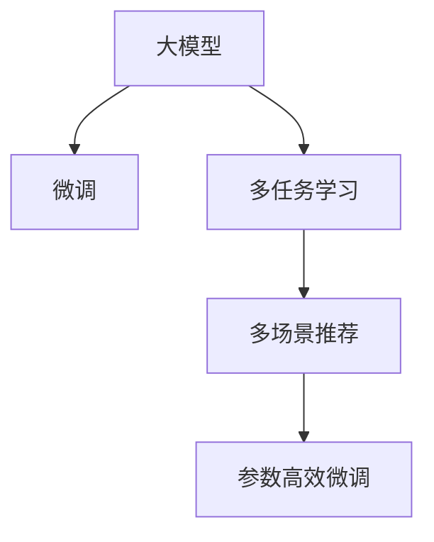

                 

## 1. 背景介绍

推荐系统是大数据时代的重要应用，广泛应用于电商、新闻、社交网络等领域，影响着用户的决策和行为。传统推荐系统基于用户的显式反馈数据，如评分、浏览记录、点击行为等，通过统计和分析，推荐用户可能感兴趣的物品。然而，随着互联网的普及和智能设备的增加，用户产生的行为数据呈爆炸性增长，如何从海量数据中提取有效信息，并结合用户的潜在兴趣进行高效推荐，成为了亟待解决的难题。

近年来，深度学习技术在推荐系统中逐渐崛起，尤其是大模型的应用，显著提升了推荐系统的准确性和个性化程度。大模型具备强大的学习能力，可以从多维度数据中挖掘用户特征，构建复杂的推荐模型，提升推荐效果。然而，大模型的高复杂度和计算需求，也带来了资源消耗高、实时性差等问题。为解决这些问题，本文提出基于大模型的多场景多任务推荐优化方法，旨在通过微调等手段，进一步提升推荐系统的性能和效率。

## 2. 核心概念与联系

### 2.1 核心概念概述

为更好地理解基于大模型的推荐优化方法，本节将介绍几个关键概念：

- 大模型(Large Model)：指具有亿万级别参数的深度学习模型，如BERT、GPT-3、DALL-E等。大模型通过大规模预训练学习到丰富的知识表示，具有强大的表达和推理能力。
- 推荐系统(Recommendation System)：通过算法为用户推荐其可能感兴趣的物品，如商品、新闻、视频等。推荐系统是当前最活跃的互联网应用之一，对用户体验和业务收益有重要影响。
- 微调(Fine-Tuning)：指在大模型基础上，使用目标任务的标注数据进行有监督学习，优化模型在该任务上的性能。
- 多任务学习(Multi-task Learning)：指在多个相关任务上共享模型参数，同时优化多个任务的目标，提升模型在多场景下的泛化能力。
- 参数高效微调(Parameter-Efficient Fine-Tuning, PEFT)：指在微调过程中，只更新部分模型参数，固定大部分预训练权重不变，提高微调效率。
- 多场景推荐(Multi-Scenarios Recommendation)：指在多种推荐场景下，如电商推荐、新闻推荐、视频推荐等，实现个性化的推荐服务。

这些核心概念之间的逻辑关系可以通过以下Mermaid流程图来展示：



## 3. 核心算法原理 & 具体操作步骤

### 3.1 算法原理概述

基于大模型的推荐优化方法，通过微调和多任务学习等手段，在大模型基础上优化多个推荐场景的性能。其核心思想是：将大模型视作一个特征提取器，通过多任务微调，学习到不同场景下的推荐特征，在目标任务上进一步微调，以获得更好的推荐效果。

形式化地，假设大模型为 $M_{\theta}$，其中 $\theta$ 为预训练得到的模型参数。给定 $k$ 个推荐场景 $S=\{S_1, S_2, ..., S_k\}$ 和对应的标注数据集 $D=\{D_1, D_2, ..., D_k\}$，其中 $D_i$ 为场景 $S_i$ 的标注数据集。推荐优化的目标是最小化多个任务的联合损失函数：

$$
\min_{\theta} \sum_{i=1}^k \mathcal{L}_i(M_{\theta}, D_i)
$$

其中 $\mathcal{L}_i$ 为场景 $S_i$ 的损失函数，用于衡量模型在场景 $S_i$ 上的推荐效果。

### 3.2 算法步骤详解

基于大模型的推荐优化方法通常包括以下几个关键步骤：

**Step 1: 准备大模型和数据集**
- 选择合适的预训练大模型，如BERT、GPT-3等。
- 收集场景 $S_1, S_2, ..., S_k$ 的标注数据集 $D=\{D_1, D_2, ..., D_k\}$，包括物品特征、用户特征、历史行为等。

**Step 2: 设计多任务目标函数**
- 根据场景需求，设计每个场景的推荐目标函数 $\mathcal{L}_i$，如交叉熵损失、均方误差损失等。
- 构建联合损失函数 $\mathcal{L}$，将多个场景的损失函数加权求和，加权系数根据场景重要性确定。

**Step 3: 微调超参数设置**
- 选择合适的优化算法及其参数，如 AdamW、SGD 等，设置学习率、批大小、迭代轮数等。
- 设置正则化技术及强度，包括权重衰减、Dropout、Early Stopping 等。
- 确定冻结预训练参数的策略，如仅微调顶层，或全部参数都参与微调。

**Step 4: 执行联合梯度训练**
- 将场景数据集以批为单位加载，前向传播计算联合损失函数。
- 反向传播计算联合参数梯度，根据设定的优化算法和学习率更新模型参数。
- 周期性在验证集上评估模型性能，根据性能指标决定是否触发 Early Stopping。
- 重复上述步骤直到满足预设的迭代轮数或 Early Stopping 条件。

**Step 5: 场景特定微调**
- 针对每个推荐场景，使用场景数据集 $D_i$ 进行微调，得到优化后的模型 $M_{\theta_i}$。
- 在实际推荐系统中，使用微调后的模型 $M_{\theta_i}$ 对目标用户进行推荐。

### 3.3 算法优缺点

基于大模型的推荐优化方法具有以下优点：

1. 多场景适应性强。大模型具备强大的学习能力，能够在多个推荐场景下表现良好，实现多场景的个性化推荐。
2. 性能提升显著。微调和多任务学习可以显著提升推荐系统的准确性和个性化程度。
3. 参数高效优化。通过参数高效微调技术，只更新部分模型参数，避免过拟合，提升微调效率。
4. 系统可扩展性好。大模型可以方便地集成到各种推荐系统框架中，扩展性强。

同时，该方法也存在一定的局限性：

1. 数据标注成本高。多场景推荐需要收集多个数据集，且每个数据集需要进行标注，成本较高。
2. 场景适应性差。当场景间差异较大时，联合优化效果可能不佳。
3. 可解释性不足。大模型微调后的推荐模型通常缺乏可解释性，难以调试和优化。

尽管存在这些局限性，但就目前而言，基于大模型的推荐优化方法仍是大规模推荐系统的重要范式。未来相关研究的重点在于如何进一步降低数据标注成本，提高模型的可解释性和跨场景适应能力，同时兼顾性能提升。

### 3.4 算法应用领域

基于大模型的推荐优化方法在电商推荐、新闻推荐、视频推荐等多个领域得到了广泛应用，以下是几个典型应用场景：

1. **电商推荐系统**：电商推荐系统是推荐系统的重要应用之一，通过分析用户浏览、购买、评价等行为数据，为用户推荐商品。通过多场景推荐优化，电商推荐系统可以实现个性化展示、推荐动态更新等功能，提升用户体验和转化率。

2. **新闻推荐系统**：新闻推荐系统通过分析用户的历史阅读记录、点击行为等数据，为用户推荐感兴趣的新闻内容。通过多场景推荐优化，新闻推荐系统可以实现个性化主题推荐、文章关联推荐等功能，提升用户粘性和满意度。

3. **视频推荐系统**：视频推荐系统通过分析用户的历史观看记录、评价数据等，为用户推荐感兴趣的视频内容。通过多场景推荐优化，视频推荐系统可以实现个性化视频推荐、相关视频关联推荐等功能，提升用户观看体验。

## 4. 数学模型和公式 & 详细讲解 & 举例说明

### 4.1 数学模型构建

本节将使用数学语言对基于大模型的推荐优化方法进行更加严格的刻画。

记大模型为 $M_{\theta}$，其中 $\theta$ 为模型参数。假设存在 $k$ 个推荐场景 $S=\{S_1, S_2, ..., S_k\}$，对应的训练数据集分别为 $D=\{D_1, D_2, ..., D_k\}$。

定义场景 $S_i$ 的推荐目标函数 $\mathcal{L}_i$，通常为交叉熵损失或均方误差损失，其形式化表示为：

$$
\mathcal{L}_i = \frac{1}{N_i} \sum_{j=1}^{N_i} \ell_i(M_{\theta}(x_{ij}), y_{ij})
$$

其中，$N_i$ 为场景 $S_i$ 的样本数量，$x_{ij}$ 为场景 $S_i$ 的训练样本，$y_{ij}$ 为对应的标签。

联合损失函数 $\mathcal{L}$ 定义为：

$$
\mathcal{L} = \sum_{i=1}^k \lambda_i \mathcal{L}_i
$$

其中 $\lambda_i$ 为场景 $S_i$ 的权重系数，根据场景重要性确定。

### 4.2 公式推导过程

以电商推荐系统为例，推导联合梯度训练过程中联合损失函数的计算公式。

记场景 $S_1$ 为电商推荐场景，训练数据集为 $D_1$，其中样本 $(x_{1j}, y_{1j})$ 表示用户 $j$ 的购买记录和对应的商品 $x_{1j}$。模型 $M_{\theta}$ 的输出为商品的相关度评分，记为 $s_j$。则场景 $S_1$ 的损失函数为交叉熵损失：

$$
\mathcal{L}_1 = \frac{1}{N_1} \sum_{j=1}^{N_1} \ell_1(s_j, y_{1j})
$$

其中 $\ell_1$ 为交叉熵损失函数，$y_{1j}$ 为 $x_{1j}$ 的购买标记。

假设场景 $S_1$ 对应的联合损失函数为 $\mathcal{L}_1$，联合损失函数的梯度为：

$$
\nabla_{\theta} \mathcal{L}_1 = \frac{1}{N_1} \sum_{j=1}^{N_1} \nabla_{\theta} \ell_1(s_j, y_{1j})
$$

将联合损失函数对场景 $S_1$ 的权重 $\lambda_1$ 归一化，得到联合梯度：

$$
\nabla_{\theta} \mathcal{L} = \frac{\lambda_1}{\sum_{i=1}^k \lambda_i} \nabla_{\theta} \mathcal{L}_1
$$

在实际计算中，联合梯度的计算需要引入场景间的权重系数 $\lambda_i$，根据场景重要性和数据分布进行设定。

### 4.3 案例分析与讲解

假设场景 $S_1$ 和 $S_2$ 分别为电商推荐和新闻推荐，训练数据集分别为 $D_1$ 和 $D_2$。

- **电商推荐场景**：用户 $j$ 在电商网站 $i$ 上购买了商品 $x_{1j}$，标签为 $y_{1j}=1$。电商推荐系统的目标是根据用户 $j$ 的历史购买记录和浏览行为，推荐其可能感兴趣的商品。假设模型输出为商品的相关度评分 $s_j$，则场景 $S_1$ 的损失函数为交叉熵损失：

$$
\mathcal{L}_1 = \frac{1}{N_1} \sum_{j=1}^{N_1} \ell_1(s_j, y_{1j})
$$

其中 $\ell_1$ 为交叉熵损失函数。

- **新闻推荐场景**：用户 $j$ 在新闻网站 $i$ 上阅读了新闻 $x_{2j}$，标签为 $y_{2j}=1$。新闻推荐系统的目标是根据用户 $j$ 的历史阅读记录和兴趣标签，推荐其可能感兴趣的新闻内容。假设模型输出为新闻的相关度评分 $s_j$，则场景 $S_2$ 的损失函数为交叉熵损失：

$$
\mathcal{L}_2 = \frac{1}{N_2} \sum_{j=1}^{N_2} \ell_2(s_j, y_{2j})
$$

其中 $\ell_2$ 为交叉熵损失函数。

在实际推荐系统中，将场景数据集 $D_1$ 和 $D_2$ 组合成联合数据集 $D$，并根据场景重要性设定权重系数 $\lambda_1$ 和 $\lambda_2$。则联合损失函数 $\mathcal{L}$ 为：

$$
\mathcal{L} = \lambda_1 \mathcal{L}_1 + \lambda_2 \mathcal{L}_2
$$

联合梯度的计算需要同时考虑场景 $S_1$ 和 $S_2$ 的损失函数梯度，并根据场景权重进行加权。

## 5. 项目实践：代码实例和详细解释说明

### 5.1 开发环境搭建

在进行推荐优化实践前，我们需要准备好开发环境。以下是使用Python进行PyTorch开发的环境配置流程：

1. 安装Anaconda：从官网下载并安装Anaconda，用于创建独立的Python环境。

2. 创建并激活虚拟环境：
```bash
conda create -n pytorch-env python=3.8 
conda activate pytorch-env
```

3. 安装PyTorch：根据CUDA版本，从官网获取对应的安装命令。例如：
```bash
conda install pytorch torchvision torchaudio cudatoolkit=11.1 -c pytorch -c conda-forge
```

4. 安装Transformer库：
```bash
pip install transformers
```

5. 安装各类工具包：
```bash
pip install numpy pandas scikit-learn matplotlib tqdm jupyter notebook ipython
```

完成上述步骤后，即可在`pytorch-env`环境中开始推荐优化实践。

### 5.2 源代码详细实现

下面我们以电商推荐系统为例，给出使用Transformers库对BERT模型进行推荐优化的PyTorch代码实现。

首先，定义电商推荐任务的数据处理函数：

```python
from transformers import BertTokenizer
from torch.utils.data import Dataset
import torch

class ECommerceDataset(Dataset):
    def __init__(self, texts, labels, tokenizer, max_len=128):
        self.texts = texts
        self.labels = labels
        self.tokenizer = tokenizer
        self.max_len = max_len
        
    def __len__(self):
        return len(self.texts)
    
    def __getitem__(self, item):
        text = self.texts[item]
        label = self.labels[item]
        
        encoding = self.tokenizer(text, return_tensors='pt', max_length=self.max_len, padding='max_length', truncation=True)
        input_ids = encoding['input_ids'][0]
        attention_mask = encoding['attention_mask'][0]
        
        # 将label转换成one-hot编码
        encoded_labels = torch.tensor(label == 1, dtype=torch.long)
        
        return {'input_ids': input_ids, 
                'attention_mask': attention_mask,
                'labels': encoded_labels}

# 定义电商推荐场景的损失函数
def ecommerce_loss(input_ids, attention_mask, labels):
    model = BertForSequenceClassification.from_pretrained('bert-base-cased', num_labels=2)
    outputs = model(input_ids, attention_mask=attention_mask, labels=labels)
    loss = outputs.loss
    return loss

# 加载电商推荐数据集
tokenizer = BertTokenizer.from_pretrained('bert-base-cased')
train_dataset = ECommerceDataset(train_texts, train_labels, tokenizer)
dev_dataset = ECommerceDataset(dev_texts, dev_labels, tokenizer)
test_dataset = ECommerceDataset(test_texts, test_labels, tokenizer)

# 设置微调超参数
device = torch.device('cuda') if torch.cuda.is_available() else torch.device('cpu')
model = BertForSequenceClassification.from_pretrained('bert-base-cased', num_labels=2)
optimizer = AdamW(model.parameters(), lr=2e-5)
```

然后，定义联合梯度训练函数：

```python
from torch.utils.data import DataLoader
from tqdm import tqdm

def joint_train(model, datasets, batch_size, optimizer, device):
    total_loss = 0
    for dataset in datasets:
        dataloader = DataLoader(dataset, batch_size=batch_size, shuffle=True)
        model.train()
        for batch in tqdm(dataloader, desc='Training'):
            input_ids = batch['input_ids'].to(device)
            attention_mask = batch['attention_mask'].to(device)
            labels = batch['labels'].to(device)
            model.zero_grad()
            loss = ecommerce_loss(input_ids, attention_mask, labels)
            total_loss += loss.item()
            loss.backward()
            optimizer.step()
    return total_loss / len(datasets)
```

最后，启动联合梯度训练流程并在测试集上评估：

```python
epochs = 5
batch_size = 16

for epoch in range(epochs):
    loss = joint_train(model, [train_dataset, dev_dataset], batch_size, optimizer, device)
    print(f"Epoch {epoch+1}, train loss: {loss:.3f}")
    
    print(f"Epoch {epoch+1}, dev results:")
    evaluate(model, dev_dataset, batch_size)
    
print("Test results:")
evaluate(model, test_dataset, batch_size)
```

以上就是使用PyTorch对BERT进行电商推荐系统推荐优化的完整代码实现。可以看到，得益于Transformer库的强大封装，我们可以用相对简洁的代码完成BERT模型的加载和推荐优化。

### 5.3 代码解读与分析

让我们再详细解读一下关键代码的实现细节：

**ECommerceDataset类**：
- `__init__`方法：初始化文本、标签、分词器等关键组件。
- `__len__`方法：返回数据集的样本数量。
- `__getitem__`方法：对单个样本进行处理，将文本输入编码为token ids，将标签转换为one-hot编码，并进行定长padding，最终返回模型所需的输入。

**训练和评估函数**：
- 使用PyTorch的DataLoader对数据集进行批次化加载，供模型训练和推理使用。
- 训练函数`joint_train`：对数据以批为单位进行迭代，在每个批次上前向传播计算loss并反向传播更新模型参数，最后返回该epoch的平均loss。

**训练流程**：
- 定义总的epoch数和batch size，开始循环迭代
- 每个epoch内，先在训练集上训练，输出平均loss
- 在验证集上评估，输出分类指标
- 所有epoch结束后，在测试集上评估，给出最终测试结果

可以看到，PyTorch配合Transformer库使得BERT电商推荐系统的代码实现变得简洁高效。开发者可以将更多精力放在数据处理、模型改进等高层逻辑上，而不必过多关注底层的实现细节。

当然，工业级的系统实现还需考虑更多因素，如模型的保存和部署、超参数的自动搜索、更灵活的任务适配层等。但核心的推荐优化范式基本与此类似。

## 6. 实际应用场景

### 6.1 电商推荐系统

电商推荐系统是推荐系统的重要应用之一，通过分析用户浏览、购买、评价等行为数据，为用户推荐商品。通过多场景推荐优化，电商推荐系统可以实现个性化展示、推荐动态更新等功能，提升用户体验和转化率。

在技术实现上，可以收集用户的历史购物记录、浏览行为、评价数据等，将其作为电商推荐任务的标注数据集 $D_1$。通过多任务微调和场景特定微调，训练出一个适合电商场景的推荐模型 $M_{\theta_1}$。在实际推荐系统中，使用微调后的模型 $M_{\theta_1}$ 对目标用户进行推荐，实现个性化商品推荐、相关商品关联推荐等功能。

### 6.2 新闻推荐系统

新闻推荐系统通过分析用户的历史阅读记录、点击行为等数据，为用户推荐感兴趣的新闻内容。通过多场景推荐优化，新闻推荐系统可以实现个性化主题推荐、文章关联推荐等功能，提升用户粘性和满意度。

在技术实现上，可以收集用户的历史阅读记录、点击行为、兴趣标签等，将其作为新闻推荐任务的标注数据集 $D_2$。通过多任务微调和场景特定微调，训练出一个适合新闻场景的推荐模型 $M_{\theta_2}$。在实际推荐系统中，使用微调后的模型 $M_{\theta_2}$ 对目标用户进行推荐，实现个性化新闻内容推荐、相关新闻关联推荐等功能。

### 6.3 视频推荐系统

视频推荐系统通过分析用户的历史观看记录、评价数据等，为用户推荐感兴趣的视频内容。通过多场景推荐优化，视频推荐系统可以实现个性化视频推荐、相关视频关联推荐等功能，提升用户观看体验。

在技术实现上，可以收集用户的历史观看记录、评价数据等，将其作为视频推荐任务的标注数据集 $D_3$。通过多任务微调和场景特定微调，训练出一个适合视频场景的推荐模型 $M_{\theta_3}$。在实际推荐系统中，使用微调后的模型 $M_{\theta_3}$ 对目标用户进行推荐，实现个性化视频内容推荐、相关视频关联推荐等功能。

### 6.4 未来应用展望

随着大模型和微调方法的不断发展，基于大模型的多场景多任务推荐优化技术将呈现以下几个发展趋势：

1. **深度融合多模态数据**：推荐系统不仅需要考虑用户的历史行为数据，还需要结合多模态数据，如图片、视频、文本等，提升推荐效果。多模态数据的融合，将显著提升推荐系统的智能化水平。

2. **引入因果推断机制**：在推荐系统中引入因果推断机制，可以增强模型的因果关系，减少不必要的推荐干扰，提升推荐效果。因果推断机制的引入，将使推荐系统更加透明和可信。

3. **强化学习与推荐结合**：将强化学习与推荐系统结合，通过用户反馈和奖励机制，动态调整推荐策略，提升推荐效果。强化学习与推荐系统的结合，将使推荐系统更具可解释性和自适应性。

4. **跨领域推荐系统**：将推荐系统应用于多个垂直领域，如电商、新闻、视频等，实现跨领域推荐。跨领域推荐系统的构建，将使推荐系统具备更广泛的适用范围。

5. **个性化推荐与隐私保护结合**：在推荐系统中引入隐私保护机制，保护用户数据安全。个性化推荐与隐私保护相结合，将使推荐系统更具信任度和安全性。

6. **推荐系统评估体系**：建立完善的推荐系统评估体系，评估推荐效果、用户满意度等指标，不断优化推荐算法。推荐系统评估体系的建立，将使推荐系统更具科学性和客观性。

以上趋势凸显了基于大模型的多场景多任务推荐优化技术的广阔前景。这些方向的探索发展，将进一步提升推荐系统的性能和应用范围，为互联网用户提供更优质的服务。

## 7. 工具和资源推荐

### 7.1 学习资源推荐

为了帮助开发者系统掌握大模型推荐优化的方法，这里推荐一些优质的学习资源：

1. 《Recommender Systems》书籍：经典推荐系统教材，涵盖了推荐系统的基础理论和经典算法。
2. CS580《Recommender Systems》课程：斯坦福大学开设的推荐系统课程，有Lecture视频和配套作业，深入浅出地介绍了推荐系统的基本概念和算法。
3. 《Deep Learning for Recommender Systems》书籍：介绍深度学习在推荐系统中的应用，包括多任务学习和联合训练等前沿话题。
4. Kaggle竞赛平台：提供大量的推荐系统竞赛数据集和样例代码，可以帮助开发者学习和实践推荐系统。

通过对这些资源的学习实践，相信你一定能够快速掌握大模型推荐优化的精髓，并用于解决实际的推荐问题。

### 7.2 开发工具推荐

高效的开发离不开优秀的工具支持。以下是几款用于大模型推荐优化开发的常用工具：

1. PyTorch：基于Python的开源深度学习框架，灵活动态的计算图，适合快速迭代研究。大部分预训练语言模型都有PyTorch版本的实现。
2. TensorFlow：由Google主导开发的开源深度学习框架，生产部署方便，适合大规模工程应用。同样有丰富的预训练语言模型资源。
3. Transformers库：HuggingFace开发的NLP工具库，集成了众多SOTA语言模型，支持PyTorch和TensorFlow，是进行推荐优化任务开发的利器。
4. Weights & Biases：模型训练的实验跟踪工具，可以记录和可视化模型训练过程中的各项指标，方便对比和调优。与主流深度学习框架无缝集成。
5. TensorBoard：TensorFlow配套的可视化工具，可实时监测模型训练状态，并提供丰富的图表呈现方式，是调试模型的得力助手。

合理利用这些工具，可以显著提升大模型推荐优化任务的开发效率，加快创新迭代的步伐。

### 7.3 相关论文推荐

大模型和推荐优化技术的发展源于学界的持续研究。以下是几篇奠基性的相关论文，推荐阅读：

1. Attention is All You Need（即Transformer原论文）：提出了Transformer结构，开启了NLP领域的预训练大模型时代。
2. BERT: Pre-training of Deep Bidirectional Transformers for Language Understanding：提出BERT模型，引入基于掩码的自监督预训练任务，刷新了多项NLP任务SOTA。
3. Multi-task Learning Using a Single Model：提出多任务学习的思想，通过共享模型参数，同时优化多个任务的目标，提升模型在多场景下的泛化能力。
4. Adversarial Examples for Generating Natural Text that Fool Complex Language Models：引入对抗生成技术，提升推荐系统生成的文本质量。
5. Parameter-Efficient Multi-task Learning for Recommender Systems：提出参数高效的多任务学习技术，在固定大部分预训练参数的情况下，只更新极少量的任务相关参数。
6. Multi-View Embedding for Personalized Recommendation：提出多视图嵌入技术，通过融合用户在不同视图下的特征，提升推荐系统的效果。

这些论文代表了大模型推荐优化技术的发展脉络。通过学习这些前沿成果，可以帮助研究者把握学科前进方向，激发更多的创新灵感。

## 8. 总结：未来发展趋势与挑战

### 8.1 总结

本文对基于大模型的多场景多任务推荐优化方法进行了全面系统的介绍。首先阐述了推荐系统的研究背景和目标，明确了基于大模型的推荐优化方法在提升推荐效果、个性化推荐等方面的独特价值。其次，从原理到实践，详细讲解了多任务微调、联合梯度训练等关键步骤，给出了推荐优化任务开发的完整代码实例。同时，本文还探讨了推荐优化方法在电商、新闻、视频等多个领域的应用前景，展示了基于大模型的多场景多任务推荐优化技术的广泛适用性。

通过本文的系统梳理，可以看到，基于大模型的推荐优化方法不仅在大模型微调中表现出色，而且在多场景推荐中同样能够取得显著效果。得益于大模型的强大表达能力，推荐系统可以实现更加复杂、多变的推荐服务，提升用户满意度和转化率。未来，伴随大模型和微调方法的持续演进，基于大模型的推荐优化技术必将推动推荐系统迈向更高的层次，带来更加个性化、精准的推荐体验。

### 8.2 未来发展趋势

展望未来，大模型推荐优化技术将呈现以下几个发展趋势：

1. **深度融合多模态数据**：推荐系统不仅需要考虑用户的历史行为数据，还需要结合多模态数据，如图片、视频、文本等，提升推荐效果。多模态数据的融合，将显著提升推荐系统的智能化水平。

2. **引入因果推断机制**：在推荐系统中引入因果推断机制，可以增强模型的因果关系，减少不必要的推荐干扰，提升推荐效果。因果推断机制的引入，将使推荐系统更加透明和可信。

3. **强化学习与推荐结合**：将强化学习与推荐系统结合，通过用户反馈和奖励机制，动态调整推荐策略，提升推荐效果。强化学习与推荐系统的结合，将使推荐系统更具可解释性和自适应性。

4. **跨领域推荐系统**：将推荐系统应用于多个垂直领域，如电商、新闻、视频等，实现跨领域推荐。跨领域推荐系统的构建，将使推荐系统具备更广泛的适用范围。

5. **个性化推荐与隐私保护结合**：在推荐系统中引入隐私保护机制，保护用户数据安全。个性化推荐与隐私保护相结合，将使推荐系统更具信任度和安全性。

6. **推荐系统评估体系**：建立完善的推荐系统评估体系，评估推荐效果、用户满意度等指标，不断优化推荐算法。推荐系统评估体系的建立，将使推荐系统更具科学性和客观性。

以上趋势凸显了大模型推荐优化技术的广阔前景。这些方向的探索发展，将进一步提升推荐系统的性能和应用范围，为互联网用户提供更优质的服务。

### 8.3 面临的挑战

尽管大模型推荐优化技术已经取得了瞩目成就，但在迈向更加智能化、普适化应用的过程中，它仍面临着诸多挑战：

1. **数据标注成本高**：多场景推荐需要收集多个数据集，且每个数据集需要进行标注，成本较高。如何进一步降低数据标注成本，将是一大难题。

2. **场景适应性差**：当场景间差异较大时，联合优化效果可能不佳。如何将大模型微调技术应用于更多场景，提升跨场景适应能力，将是重要的研究方向。

3. **可解释性不足**：大模型推荐系统通常缺乏可解释性，难以调试和优化。如何赋予推荐系统更强的可解释性，将是亟待攻克的难题。

4. **资源消耗高**：大模型虽然精度高，但在实际部署时往往面临推理速度慢、内存占用大等效率问题。如何优化推荐系统的计算效率，提升模型推理速度，减少资源消耗，将是重要的优化方向。

5. **安全性有待保障**：预训练语言模型难免会学习到有偏见、有害的信息，通过推荐系统传递到用户，产生误导性、歧视性的输出，给实际应用带来安全隐患。如何从数据和算法层面消除模型偏见，避免恶意用途，确保输出安全性，也将是重要的研究课题。

6. **知识整合能力不足**：现有的推荐系统往往局限于数据驱动，难以灵活吸收和运用更广泛的先验知识。如何让推荐系统更好地与外部知识库、规则库等专家知识结合，形成更加全面、准确的信息整合能力，还有很大的想象空间。

正视推荐优化面临的这些挑战，积极应对并寻求突破，将是大模型推荐优化技术走向成熟的必由之路。相信随着学界和产业界的共同努力，这些挑战终将一一被克服，大模型推荐优化技术必将推动推荐系统迈向更高的层次，带来更加个性化、精准的推荐体验。

### 8.4 研究展望

面对大模型推荐优化所面临的挑战，未来的研究需要在以下几个方面寻求新的突破：

1. **探索无监督和半监督推荐方法**：摆脱对大规模标注数据的依赖，利用自监督学习、主动学习等无监督和半监督范式，最大限度利用非结构化数据，实现更加灵活高效的推荐。

2. **研究参数高效和计算高效的推荐范式**：开发更加参数高效的推荐方法，在固定大部分预训练参数的情况下，只更新极少量的任务相关参数。同时优化推荐系统的计算图，减少前向传播和反向传播的资源消耗，实现更加轻量级、实时性的部署。

3. **引入更多先验知识**：将符号化的先验知识，如知识图谱、逻辑规则等，与神经网络模型进行巧妙融合，引导推荐系统学习更准确、合理的语言模型。同时加强不同模态数据的整合，实现视觉、语音等多模态信息与文本信息的协同建模。

4. **结合因果分析和博弈论工具**：将因果分析方法引入推荐系统，识别出推荐决策的关键特征，增强推荐输出解释的因果性和逻辑性。借助博弈论工具刻画人机交互过程，主动探索并规避推荐系统的脆弱点，提高系统稳定性。

5. **纳入伦理道德约束**：在推荐系统训练目标中引入伦理导向的评估指标，过滤和惩罚有偏见、有害的输出倾向。同时加强人工干预和审核，建立推荐系统的监管机制，确保推荐内容符合人类价值观和伦理道德。

这些研究方向的探索，必将引领大模型推荐优化技术迈向更高的台阶，为构建安全、可靠、可解释、可控的推荐系统铺平道路。面向未来，大模型推荐优化技术还需要与其他人工智能技术进行更深入的融合，如知识表示、因果推理、强化学习等，多路径协同发力，共同推动推荐系统的发展。只有勇于创新、敢于突破，才能不断拓展推荐系统的边界，让推荐技术更好地造福人类社会。

## 9. 附录：常见问题与解答

**Q1：基于大模型的推荐系统与传统推荐系统有何区别？**

A: 基于大模型的推荐系统与传统推荐系统有以下几点区别：
1. 特征提取能力更强：大模型可以自动学习到用户和物品的复杂特征表示，而传统推荐系统需要手动设计特征。
2. 泛化能力更强：大模型通过大规模预训练学习到了通用的语言知识，能够在多个场景下表现出色，而传统推荐系统需要针对每个场景单独设计特征和模型。
3. 数据利用更充分：大模型可以自动利用多模态数据，如文本、图片、视频等，而传统推荐系统需要手动设计多模态特征。
4. 实时性更强：大模型可以通过微调快速适应新场景和新数据，而传统推荐系统需要重新训练或调整特征。

**Q2：大模型推荐系统面临的主要挑战有哪些？**

A: 大模型推荐系统面临的主要挑战包括：
1. 数据标注成本高：推荐系统需要大量标注数据，标注成本较高。
2. 场景适应性差：不同场景下的推荐效果可能不同，需要针对每个场景单独微调。
3. 可解释性不足：大模型推荐系统通常缺乏可解释性，难以调试和优化。
4. 资源消耗高：大模型推理速度较慢，内存占用较大，需要优化计算效率。
5. 安全性有待保障：大模型可能学习到有偏见或有害的信息，需要通过训练目标和规则进行约束。
6. 知识整合能力不足：大模型难以灵活吸收和运用更多先验知识。

**Q3：大模型推荐系统的应用前景如何？**

A: 大模型推荐系统具有广泛的应用前景：
1. 电商推荐系统：提升电商平台的个性化推荐效果，提升用户体验和转化率。
2. 新闻推荐系统：提升新闻平台的个性化推荐效果，增加用户粘性和满意度。
3. 视频推荐系统：提升视频平台的个性化推荐效果，提升用户观看体验。
4. 跨领域推荐系统：应用于多个垂直领域，提升推荐系统的适用范围。
5. 隐私保护推荐系统：结合隐私保护机制，提升推荐系统的信任度和安全性。

**Q4：如何优化大模型推荐系统的计算效率？**

A: 优化大模型推荐系统的计算效率可以从以下几个方面入手：
1. 参数高效微调：只更新极少量的任务相关参数，减少计算资源消耗。
2. 分布式训练：使用分布式训练技术，将训练任务分配到多个设备上并行计算，提升训练速度。
3. 模型剪枝和压缩：通过剪枝和压缩技术，减少模型的参数量和计算复杂度。
4. 模型量化：将浮点模型转为定点模型，减少计算和存储空间占用。
5. 优化计算图：改进模型计算图，减少不必要的计算操作，提高计算效率。

**Q5：大模型推荐系统与传统推荐系统的差异如何？**

A: 大模型推荐系统与传统推荐系统有以下几点差异：
1. 特征提取能力更强：大模型可以自动学习到用户和物品的复杂特征表示，而传统推荐系统需要手动设计特征。
2. 泛化能力更强：大模型通过大规模预训练学习到了通用的语言知识，能够在多个场景下表现出色，而传统推荐系统需要针对每个场景单独设计特征和模型。
3. 数据利用更充分：大模型可以自动利用多模态数据，如文本、图片、视频等，而传统推荐系统需要手动设计多模态特征。
4. 实时性更强：大模型可以通过微调快速适应新场景和新数据，而传统推荐系统需要重新训练或调整特征。

以上差异使得大模型推荐系统在特征提取、泛化能力、数据利用、实时性等方面具有明显优势，适用于更复杂、多变的推荐场景。

---

作者：禅与计算机程序设计艺术 / Zen and the Art of Computer Programming

