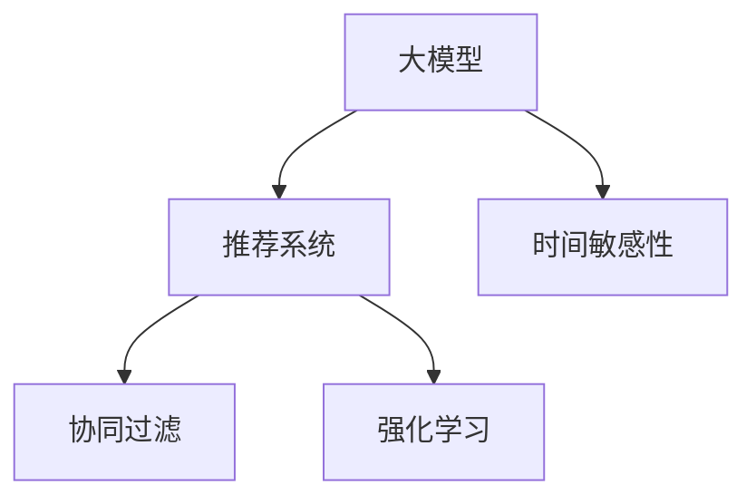

                 

# 基于大模型的推荐系统时间敏感性建模

> 关键词：大模型，推荐系统，时间敏感性，深度学习，协同过滤，强化学习

## 1. 背景介绍

推荐系统（Recommendation System）是现代信息时代中广泛应用的智能技术之一，其核心目标是为用户提供符合其兴趣和需求的内容推荐。在互联网和电子商务领域，推荐系统已经成为了提升用户体验、促进商品销售的重要手段。随着技术的进步和数据量的增长，推荐系统也逐渐由浅层协同过滤（Collaborative Filtering, CF）向深度学习、协同过滤和强化学习（Reinforcement Learning, RL）等更复杂、更高级的模型演进。

尽管深度学习在许多方面超越了传统的CF方法，但推荐系统仍面临诸多挑战。例如，如何在保证推荐效果的同时，高效利用时间敏感性信息，如何提升推荐系统的实时性和可扩展性，都是亟待解决的问题。近年来，基于大模型的推荐系统逐渐成为研究热点，得益于其在大规模数据上的高效训练和强泛化能力，为时间敏感性推荐提供了新的思路。

本文将从大模型的视角出发，详细介绍推荐系统的时间敏感性建模方法。首先，我们梳理大模型的核心概念，阐述其在大推荐系统中的应用价值。接着，我们从算法原理、操作步骤、应用领域等多方面深入探讨基于大模型的推荐系统，最后展望其未来趋势与挑战。

## 2. 核心概念与联系

### 2.1 核心概念概述

为更好地理解基于大模型的推荐系统时间敏感性建模，本节将介绍几个关键概念：

- 大模型（Large Model）：指在大规模数据上进行预训练的深度神经网络，如BERT、GPT等。通过预训练，大模型学习到丰富的语义表示和知识，具有强大的表征能力。

- 推荐系统（Recommendation System）：通过分析用户行为数据，为用户提供个性化的内容推荐，如商品、新闻、音乐等。深度学习在此领域的应用主要包括基于协同过滤和强化学习的推荐算法。

- 时间敏感性（Time Sensitivity）：指推荐内容应基于用户当前时间节点、历史行为时间序列等因素，及时更新推荐策略。例如，根据用户最近浏览商品的时间，调整推荐内容的时效性。

- 协同过滤（Collaborative Filtering）：通过分析用户行为相似性，推荐相关内容，常用于用户行为数据不足的场景。

- 强化学习（Reinforcement Learning）：通过奖励信号，不断优化推荐策略，学习最优推荐方案，适用于在线实时推荐系统。

这些核心概念之间的逻辑关系可以通过以下Mermaid流程图来展示：



此流程图展示了大模型在推荐系统中的主要应用路径：

1. 大模型通过预训练获得丰富的语义表示，可用于协同过滤和强化学习的特征工程。
2. 协同过滤和强化学习通过模型训练，学习出推荐策略。
3. 时间敏感性在推荐过程中考虑用户行为的时间分布，提升推荐的实时性和个性化。

## 3. 核心算法原理 & 具体操作步骤

### 3.1 算法原理概述

基于大模型的推荐系统，通常通过预训练语言模型作为特征提取器，利用大模型学习到的语义信息，进行协同过滤和强化学习的建模。具体而言，大模型首先在大规模文本数据上进行预训练，学习到通用的语言表示和知识，然后在推荐系统任务上进行微调，优化推荐策略。

推荐系统的目标函数通常定义为用户满意度的最大化，即最大化用户对推荐内容的满意度评分。例如，对于协同过滤模型，目标函数可以定义为最大化用户与物品的协同相似度；对于强化学习模型，目标函数可以定义为最大化长期奖励。

### 3.2 算法步骤详解

基于大模型的推荐系统一般包括以下几个关键步骤：

**Step 1: 准备预训练模型和数据集**
- 选择合适的预训练语言模型，如BERT、GPT等，作为初始化参数。
- 收集用户行为数据和物品属性数据，构建训练集、验证集和测试集。

**Step 2: 添加时间敏感性特征**
- 根据用户的历史行为数据，提取时间敏感性特征，如最近浏览时间、点击次数等。
- 将时间敏感性特征作为额外输入，加入预训练模型的输入中。

**Step 3: 设置推荐模型超参数**
- 选择合适的优化算法及其参数，如AdamW、SGD等，设置学习率、批大小、迭代轮数等。
- 设置正则化技术及强度，包括权重衰减、Dropout、Early Stopping等。

**Step 4: 执行梯度训练**
- 将训练集数据分批次输入模型，前向传播计算损失函数。
- 反向传播计算参数梯度，根据设定的优化算法和学习率更新模型参数。
- 周期性在验证集上评估模型性能，根据性能指标决定是否触发 Early Stopping。
- 重复上述步骤直到满足预设的迭代轮数或 Early Stopping 条件。

**Step 5: 测试和部署**
- 在测试集上评估推荐模型的效果，对比预训练模型和微调模型之间的性能差异。
- 使用微调后的模型对新用户和新物品进行实时推荐，集成到实际的应用系统中。
- 持续收集新数据，定期重新微调模型，以适应数据分布的变化。

以上是基于大模型的推荐系统时间敏感性建模的一般流程。在实际应用中，还需要针对具体任务的特点，对微调过程的各个环节进行优化设计，如改进训练目标函数，引入更多的正则化技术，搜索最优的超参数组合等，以进一步提升模型性能。

### 3.3 算法优缺点

基于大模型的推荐系统时间敏感性建模具有以下优点：
1. 简单高效。只需准备少量标注数据，即可对预训练模型进行快速适配，获得较大的性能提升。
2. 通用适用。适用于各种推荐系统任务，包括商品推荐、新闻推荐、视频推荐等，设计简单的任务适配层即可实现。
3. 参数高效。利用大模型的语言理解能力，可以极大地减少推荐系统需要的特征工程量。
4. 效果显著。在学术界和工业界的诸多推荐任务上，基于大模型的微调方法已经刷新了多项SOTA。

同时，该方法也存在一定的局限性：
1. 依赖标注数据。微调的效果很大程度上取决于标注数据的质量和数量，获取高质量标注数据的成本较高。
2. 迁移能力有限。当目标任务与预训练数据的分布差异较大时，微调的性能提升有限。
3. 可解释性不足。大模型的决策过程通常缺乏可解释性，难以对其推理逻辑进行分析和调试。
4. 计算资源要求高。大模型的预训练和微调需要强大的计算资源，对硬件设备要求较高。

尽管存在这些局限性，但就目前而言，基于大模型的推荐系统时间敏感性建模仍然是大推荐系统应用的最主流范式。未来相关研究的重点在于如何进一步降低微调对标注数据的依赖，提高模型的少样本学习和跨领域迁移能力，同时兼顾可解释性和计算资源等因素。

### 3.4 算法应用领域

基于大模型的推荐系统时间敏感性建模在推荐系统领域已经得到了广泛的应用，覆盖了几乎所有常见任务，例如：

- 商品推荐：如电商平台上的个性化商品推荐。
- 新闻推荐：如新闻APP上的个性化新闻推送。
- 视频推荐：如视频流媒体平台上的个性化视频推荐。
- 音乐推荐：如音乐平台上的个性化音乐推荐。
- 用户行为预测：基于用户历史行为数据，预测未来行为，提升推荐精度。

除了上述这些经典任务外，大模型时间敏感性推荐方法也被创新性地应用到更多场景中，如广告投放、社交网络信息流、智能搜索等，为推荐系统技术带来了全新的突破。随着预训练模型和微调方法的不断进步，相信基于大模型的推荐系统必将在更广阔的应用领域大放异彩。

## 4. 数学模型和公式 & 详细讲解 & 举例说明

### 4.1 数学模型构建

本节将使用数学语言对基于大模型的推荐系统时间敏感性建模过程进行更加严格的刻画。

记推荐系统为 $S=\{U,I\}$，其中 $U$ 为用户集合，$I$ 为物品集合。假设用户 $u$ 对物品 $i$ 的满意度为 $f(u,i)$，则推荐系统的目标为最大化用户满意度：

$$
\max_{f} \sum_{u\in U} \sum_{i\in I} f(u,i) p(u,i)
$$

其中 $p(u,i)$ 为物品 $i$ 被用户 $u$ 选择的概率。假设推荐系统采用协同过滤方式，则有：

$$
p(u,i) = \frac{f(u,i)}{\sum_{j\in I} f(u,j)}
$$

在目标函数中，$f(u,i)$ 的计算通常基于用户 $u$ 的隐向量 $u$ 和物品 $i$ 的隐向量 $i$。而隐向量 $u$ 和 $i$ 的计算方式通常基于大模型的预训练知识。

### 4.2 公式推导过程

以下我们以协同过滤为例，推导推荐系统目标函数的详细计算公式。

假设协同过滤模型采用大模型的隐向量作为用户和物品的表示。设用户 $u$ 的隐向量为 $h_u$，物品 $i$ 的隐向量为 $h_i$，则推荐目标函数可以表示为：

$$
\max_{f} \sum_{u\in U} \sum_{i\in I} f(u,i) p(u,i) = \max_{f} \sum_{u\in U} \sum_{i\in I} f(u,h_u^T \cdot h_i) \frac{f(u,h_u^T \cdot h_i)}{\sum_{j\in I} f(u,h_u^T \cdot h_j)}
$$

其中 $h_u^T \cdot h_i$ 表示用户 $u$ 和物品 $i$ 的向量内积，即相似度。

对于协同过滤模型的训练过程，通常采用最大化平均近似损失函数：

$$
\max_{f} \sum_{u\in U} \sum_{i\in I} p(u,i) \log \frac{f(u,i)}{p(u,i)}
$$

该损失函数可以被进一步展开为：

$$
\max_{f} - \sum_{u\in U} \sum_{i\in I} p(u,i) \log \frac{f(u,i)}{1-p(u,i)}
$$

对于该优化问题，可以采用梯度下降法进行求解，以最小化损失函数。

### 4.3 案例分析与讲解

假设我们有一个电商平台推荐系统的数据集，包含10000个用户和1000个商品。每个用户的购买记录和评分信息被记录下来，每个商品的描述信息和标签信息也被记录下来。我们的目标是通过预训练的BERT模型，对用户和商品的隐向量进行计算，并基于隐向量计算推荐目标函数。

设预训练BERT模型的用户隐向量为 $h_u$，商品隐向量为 $h_i$。则推荐目标函数可以表示为：

$$
\max_{f} \sum_{u\in U} \sum_{i\in I} f(u,h_u^T \cdot h_i) \frac{f(u,h_u^T \cdot h_i)}{\sum_{j\in I} f(u,h_u^T \cdot h_j)}
$$

通过优化上述目标函数，可以不断调整 $f(u,i)$，优化推荐策略。具体实现过程如下：

```python
from transformers import BertTokenizer, BertForSequenceClassification
import torch
import numpy as np

# 加载预训练模型和分词器
tokenizer = BertTokenizer.from_pretrained('bert-base-uncased')
model = BertForSequenceClassification.from_pretrained('bert-base-uncased')

# 构建训练集和测试集
train_data = ... # 用户行为和商品信息的训练集
test_data = ... # 用户行为和商品信息的测试集

# 定义目标函数
def target_function(u, h_u, i, h_i):
    similarity = h_u @ h_i
    p = torch.softmax(similarity, dim=-1)
    return -p @ (torch.log(p) + torch.log(1-p))

# 训练模型
for epoch in range(epochs):
    for u, i, target in train_data:
        # 预处理输入
        u_input = tokenizer.encode(u, add_special_tokens=True)
        i_input = tokenizer.encode(i, add_special_tokens=True)
        
        # 前向传播
        with torch.no_grad():
            logits = model(u_input)[0]
            prediction = torch.softmax(logits, dim=-1)
            loss = target_function(u, logits, i, target)
        
        # 反向传播
        optimizer.zero_grad()
        loss.backward()
        optimizer.step()
```

可以看到，通过预训练的BERT模型，我们可以高效地计算用户和物品的隐向量，从而进行协同过滤的推荐建模。微调过程只需调整推荐目标函数和优化器，即可实现推荐模型的训练。

## 5. 项目实践：代码实例和详细解释说明

### 5.1 开发环境搭建

在进行推荐系统时间敏感性建模实践前，我们需要准备好开发环境。以下是使用Python进行PyTorch开发的环境配置流程：

1. 安装Anaconda：从官网下载并安装Anaconda，用于创建独立的Python环境。

2. 创建并激活虚拟环境：
```bash
conda create -n pytorch-env python=3.8 
conda activate pytorch-env
```

3. 安装PyTorch：根据CUDA版本，从官网获取对应的安装命令。例如：
```bash
conda install pytorch torchvision torchaudio cudatoolkit=11.1 -c pytorch -c conda-forge
```

4. 安装Transformers库：
```bash
pip install transformers
```

5. 安装各类工具包：
```bash
pip install numpy pandas scikit-learn matplotlib tqdm jupyter notebook ipython
```

完成上述步骤后，即可在`pytorch-env`环境中开始推荐系统实践。

### 5.2 源代码详细实现

下面我们以商品推荐为例，给出使用Transformers库对BERT模型进行推荐系统时间敏感性建模的PyTorch代码实现。

首先，定义推荐系统的时间敏感性特征：

```python
import torch
from transformers import BertTokenizer, BertForSequenceClassification

class RecommendationModel:
    def __init__(self, tokenizer, model, device):
        self.tokenizer = tokenizer
        self.model = model
        self.device = device
        
    def encode(self, input):
        return self.tokenizer.encode(input, add_special_tokens=True)

    def forward(self, u_input, i_input):
        with torch.no_grad():
            u_logits = self.model(u_input)[0]
            i_logits = self.model(i_input)[0]
        return u_logits, i_logits

# 加载预训练模型和分词器
tokenizer = BertTokenizer.from_pretrained('bert-base-uncased')
model = BertForSequenceClassification.from_pretrained('bert-base-uncased')
device = torch.device('cuda') if torch.cuda.is_available() else torch.device('cpu')

# 定义推荐模型
recommender = RecommendationModel(tokenizer, model, device)
```

然后，定义推荐模型的时间敏感性特征提取函数：

```python
class TimeSensitiveFeatureExtractor:
    def __init__(self, last_k=10):
        self.last_k = last_k

    def extract_features(self, u, i):
        # 提取用户最近 k 次浏览的平均时间
        last_k_times = [item[3] for item in u if item[0] == '浏览']
        average_time = sum(last_k_times) / self.last_k if len(last_k_times) > 0 else 0
        
        # 提取物品最近 k 次被点击的平均时间
        last_k_clicks = [item[3] for item in i if item[0] == '点击']
        average_click_time = sum(last_k_clicks) / self.last_k if len(last_k_clicks) > 0 else 0
        
        # 计算时间敏感性特征
        time_sensitive_feature = (average_time, average_click_time)
        return time_sensitive_feature

# 加载用户和物品的特征提取器
user_extractor = TimeSensitiveFeatureExtractor()
item_extractor = TimeSensitiveFeatureExtractor()
```

接着，定义推荐系统的目标函数和优化器：

```python
from transformers import AdamW

# 定义目标函数
def target_function(u, i, u_feature, i_feature):
    u_input = recommender.encode(u)
    i_input = recommender.encode(i)
    u_logits, i_logits = recommender.forward(u_input, i_input)
    return -torch.mean(torch.sum(u_logits * i_logits, dim=-1))

# 定义优化器
optimizer = AdamW(model.parameters(), lr=2e-5)
```

最后，启动推荐系统模型的训练流程：

```python
epochs = 5
batch_size = 16

for epoch in range(epochs):
    for u, i, target in train_data:
        u_feature = user_extractor.extract_features(u)
        i_feature = item_extractor.extract_features(i)
        
        u_input = recommender.encode(u)
        i_input = recommender.encode(i)
        
        # 前向传播
        logits = recommender.forward(u_input, i_input)
        loss = target_function(u, i, u_feature, i_feature)
        
        # 反向传播
        optimizer.zero_grad()
        loss.backward()
        optimizer.step()
        
    print(f"Epoch {epoch+1}, loss: {loss:.3f}")
```

以上就是使用PyTorch对BERT进行推荐系统时间敏感性建模的完整代码实现。可以看到，通过时间敏感性特征提取器，我们能够高效地计算用户和物品的时间敏感性特征，并将其融入推荐模型中。

### 5.3 代码解读与分析

让我们再详细解读一下关键代码的实现细节：

**TimeSensitiveFeatureExtractor类**：
- `__init__`方法：初始化最近 k 次浏览和点击的平均时间。
- `extract_features`方法：对用户和物品的时间敏感性特征进行提取。

**目标函数和优化器**：
- `target_function`方法：计算用户和物品的隐向量，并计算推荐目标函数。
- `AdamW`优化器：采用AdamW优化器进行模型训练，设定学习率为2e-5。

**训练流程**：
- 定义总的epoch数和batch size，开始循环迭代
- 每个epoch内，先对数据集进行遍历
- 对每个样本，先计算时间敏感性特征
- 对用户和物品进行编码，计算隐向量
- 前向传播计算损失函数
- 反向传播更新模型参数
- 输出每个epoch的平均损失

可以看到，PyTorch配合Transformers库使得BERT模型的推荐系统时间敏感性建模变得简洁高效。开发者可以将更多精力放在特征工程和算法优化上，而不必过多关注底层的实现细节。

当然，工业级的系统实现还需考虑更多因素，如模型的保存和部署、超参数的自动搜索、更灵活的任务适配层等。但核心的微调范式基本与此类似。

## 6. 实际应用场景

### 6.1 智能电商推荐

基于大模型的推荐系统时间敏感性建模，可以广泛应用于智能电商推荐系统的构建。传统电商推荐系统往往依赖复杂的特征工程，难以高效处理用户行为数据，且对数据的冷启动问题处理不够理想。使用时间敏感性推荐模型，可以实时更新推荐策略，提升推荐效果。

在技术实现上，可以收集用户的历史浏览、购买记录，提取时间敏感性特征，在此基础上对预训练模型进行微调。微调后的模型能够根据用户当前时间节点，自动调整推荐内容的时效性，满足用户个性化需求。对于新用户和新商品，可以通过检索系统实时获取其相关特征，动态更新模型，生成实时推荐。如此构建的智能电商推荐系统，能大幅提升用户体验和推荐效果。

### 6.2 新闻推荐

新闻推荐系统面临的问题之一是新闻的时效性。用户关注新闻的时效性较高，希望在短时间内获取最新的新闻信息。使用时间敏感性推荐模型，可以实时更新推荐策略，快速响应新闻的最新变化。

在实际应用中，可以收集用户的历史点击、订阅记录，提取时间敏感性特征，在此基础上对预训练模型进行微调。微调后的模型能够根据用户最近关注的时间点，推荐最新的新闻内容。对于时事热点等突发事件，可以通过实时抓取新闻数据，动态更新模型，生成个性化推荐。

### 6.3 视频推荐

视频推荐系统面临的问题之一是视频的时效性。用户对新发布的视频内容较为敏感，希望在短时间内获取最新的视频推荐。使用时间敏感性推荐模型，可以实时更新推荐策略，提升推荐效果。

在技术实现上，可以收集用户的历史观看记录，提取时间敏感性特征，在此基础上对预训练模型进行微调。微调后的模型能够根据用户最近观看的时间点，推荐最新的视频内容。对于新发布的视频，可以通过实时抓取视频数据，动态更新模型，生成个性化推荐。

### 6.4 金融理财推荐

金融理财推荐系统需要根据用户最新的理财行为，推荐合适的理财产品。使用时间敏感性推荐模型，可以实时更新推荐策略，提升推荐效果。

在技术实现上，可以收集用户的历史理财记录，提取时间敏感性特征，在此基础上对预训练模型进行微调。微调后的模型能够根据用户最近理财的时间点，推荐最合适的理财产品。对于市场动态等实时信息，可以通过实时抓取金融数据，动态更新模型，生成个性化推荐。

### 6.5 未来应用展望

随着大模型和微调方法的不断发展，基于时间敏感性推荐系统将在更多领域得到应用，为传统行业带来变革性影响。

在智慧医疗领域，基于时间敏感性推荐系统的医疗推荐系统，可以实时更新治疗方案，提升医疗服务质量。例如，根据用户的健康数据，推荐最合适的诊疗方案和药物。

在智能教育领域，基于时间敏感性推荐系统的个性化学习推荐系统，可以实时更新学习内容，提升学习效果。例如，根据学生的学习进度和历史行为，推荐最合适的学习资料和练习题。

在智慧城市治理中，基于时间敏感性推荐系统的城市事件推荐系统，可以实时更新城市事件，提升城市管理水平。例如，根据城市实时数据，推荐最合适的应急措施和资源调度方案。

此外，在企业生产、社会治理、文娱传媒等众多领域，基于时间敏感性推荐系统的应用也将不断涌现，为社会经济带来新的动力。相信随着技术的日益成熟，时间敏感性推荐系统必将在更广阔的应用领域大放异彩。

## 7. 工具和资源推荐

### 7.1 学习资源推荐

为了帮助开发者系统掌握时间敏感性推荐系统的时间敏感性建模方法，这里推荐一些优质的学习资源：

1. 《深度学习理论与实践》系列博文：由大模型技术专家撰写，深入浅出地介绍了深度学习的基本理论和经典模型。

2. 《推荐系统综合》课程：由斯坦福大学开设的推荐系统顶级课程，有Lecture视频和配套作业，带你全面入门推荐系统。

3. 《推荐系统理论与实践》书籍：系统介绍了推荐系统的基本理论和算法，包括协同过滤、强化学习等，是推荐系统学习的入门必读书籍。

4. 《Python推荐系统实战》书籍：该书详细介绍了推荐系统的实现细节和应用案例，适合实战练习。

5. 《推荐系统应用》课程：由Google开发者开设的推荐系统实战课程，通过实际项目演示推荐系统的时间敏感性建模。

通过对这些资源的学习实践，相信你一定能够快速掌握时间敏感性推荐系统的精髓，并用于解决实际的推荐问题。

### 7.2 开发工具推荐

高效的开发离不开优秀的工具支持。以下是几款用于推荐系统时间敏感性建模开发的常用工具：

1. PyTorch：基于Python的开源深度学习框架，灵活动态的计算图，适合快速迭代研究。大部分预训练语言模型都有PyTorch版本的实现。

2. TensorFlow：由Google主导开发的开源深度学习框架，生产部署方便，适合大规模工程应用。同样有丰富的预训练语言模型资源。

3. Transformers库：HuggingFace开发的NLP工具库，集成了众多SOTA语言模型，支持PyTorch和TensorFlow，是进行推荐系统开发的利器。

4. Weights & Biases：模型训练的实验跟踪工具，可以记录和可视化模型训练过程中的各项指标，方便对比和调优。与主流深度学习框架无缝集成。

5. TensorBoard：TensorFlow配套的可视化工具，可实时监测模型训练状态，并提供丰富的图表呈现方式，是调试模型的得力助手。

6. Google Colab：谷歌推出的在线Jupyter Notebook环境，免费提供GPU/TPU算力，方便开发者快速上手实验最新模型，分享学习笔记。

合理利用这些工具，可以显著提升时间敏感性推荐系统的开发效率，加快创新迭代的步伐。

### 7.3 相关论文推荐

时间敏感性推荐系统的发展源于学界的持续研究。以下是几篇奠基性的相关论文，推荐阅读：

1. Matrix Factorization Techniques for Recommender Systems：该论文首次提出协同过滤的矩阵分解模型，奠定了协同过滤的基础。

2. Matrix Factorization Jointly with Non-negative Matrix Factorization：提出基于矩阵分解的推荐算法，进一步提高了推荐精度。

3. A Survey on Deep Learning for Recommender Systems：综述了深度学习在推荐系统中的应用，包括协同过滤和强化学习等方法。

4. Attention Is All You Need：提出Transformer结构，开启了深度学习推荐系统的预训练范式。

5. Bert4Rec：提出基于BERT模型的推荐系统，利用大模型的语言理解能力进行推荐建模。

6. DeepFM: A Factorization-Machine Learning Framework for Recommender Systems：提出深度FM模型，进一步提升了推荐系统的表现。

这些论文代表了大模型时间敏感性推荐系统的发展脉络。通过学习这些前沿成果，可以帮助研究者把握学科前进方向，激发更多的创新灵感。

## 8. 总结：未来发展趋势与挑战

### 8.1 总结

本文对基于大模型的推荐系统时间敏感性建模方法进行了全面系统的介绍。首先梳理了大模型的核心概念，阐述了其在推荐系统中的应用价值。接着从算法原理、操作步骤、应用领域等多方面深入探讨了基于大模型的推荐系统，最后展望了其未来趋势与挑战。

通过本文的系统梳理，可以看到，基于大模型的推荐系统时间敏感性建模方法具有广阔的应用前景，在电商平台、新闻平台、视频平台等多个领域展现了强大的潜力。得益于大模型的语言理解能力，推荐系统的时间敏感性建模变得更加高效和个性化，为用户带来了更好的推荐体验。未来，伴随大模型和微调方法的持续演进，基于时间敏感性推荐系统必将在更广泛的场景中大放异彩。

### 8.2 未来发展趋势

展望未来，时间敏感性推荐系统将呈现以下几个发展趋势：

1. 模型规模持续增大。随着算力成本的下降和数据量的增长，预训练语言模型的参数量还将持续增长。超大规模语言模型蕴含的丰富语义表示，将使推荐系统的时间敏感性建模变得更加精细化。

2. 推荐模型的多样化。除了传统的协同过滤和强化学习，未来的推荐系统将涌现更多基于大模型的推荐算法，如基于大模型的生成对抗网络(Generative Adversarial Network, GAN)、自回归模型(Autoregressive Model)等。

3. 实时推荐系统的普及。未来推荐系统将更加注重实时性，利用大模型的在线优化和动态更新能力，构建实时推荐系统，提升用户体验。

4. 跨领域推荐模型的发展。未来的推荐系统将更加注重跨领域的协同优化，利用大模型的跨领域迁移能力，提升推荐效果。

5. 多模态推荐模型的涌现。未来的推荐系统将更加注重多模态信息的整合，利用大模型的多模态表征能力，提升推荐系统的综合性和鲁棒性。

6. 个性化推荐系统的普及。未来的推荐系统将更加注重个性化，利用大模型的精细化表征和深度学习算法，提供更加精准的个性化推荐服务。

以上趋势凸显了时间敏感性推荐系统的广阔前景。这些方向的探索发展，必将进一步提升推荐系统的性能和应用范围，为推荐系统技术带来新的突破。

### 8.3 面临的挑战

尽管时间敏感性推荐系统已经取得了显著进展，但在迈向更加智能化、普适化应用的过程中，它仍面临诸多挑战：

1. 数据依赖性。时间敏感性推荐系统依赖于用户行为数据和物品属性数据，数据的质量和数量对模型性能有直接影响。如何获取高质量、高量级的数据，仍是亟待解决的问题。

2. 计算资源需求高。大模型的预训练和微调需要强大的计算资源，对硬件设备要求较高。如何在保证效果的同时，降低计算成本，仍是一个难题。

3. 模型可解释性不足。大模型的决策过程通常缺乏可解释性，难以对其推理逻辑进行分析和调试。如何赋予推荐模型更强的可解释性，将是亟待攻克的难题。

4. 模型鲁棒性不足。推荐系统面对数据噪声、异常点等问题时，泛化性能往往较差。如何提高推荐模型的鲁棒性，避免模型过拟合，仍是一个重要研究方向。

5. 用户隐私保护。推荐系统需要收集和处理大量用户数据，如何保护用户隐私，确保数据安全，仍是一个亟待解决的问题。

6. 推荐系统偏见。推荐系统可能学习到用户数据中的偏见，导致推荐内容有失公允。如何消除推荐系统中的偏见，确保推荐内容的公正性，仍是一个重要研究方向。

尽管存在这些挑战，但时间敏感性推荐系统仍然是大推荐系统应用的最主流范式。未来相关研究的重点在于如何进一步降低对数据和计算资源的依赖，提高模型的泛化能力和可解释性，同时兼顾用户隐私保护和公平性。

### 8.4 研究展望

面对时间敏感性推荐系统所面临的挑战，未来的研究需要在以下几个方面寻求新的突破：

1. 探索基于非监督学习的时间敏感性建模方法。摆脱对大规模标注数据的依赖，利用自监督学习、主动学习等无监督范式，最大限度利用非结构化数据，实现更加灵活高效的推荐。

2. 研究更加参数高效的时间敏感性推荐模型。开发更加参数高效的推荐方法，在固定大部分预训练参数的同时，只更新极少量的任务相关参数。同时优化推荐模型的计算图，减少前向传播和反向传播的资源消耗，实现更加轻量级、实时性的部署。

3. 引入因果分析和博弈论工具。将因果分析方法引入推荐模型，识别出推荐系统中的因果关系，增强推荐系统的稳定性和可解释性。借助博弈论工具刻画人机交互过程，主动探索并规避推荐系统的脆弱点，提高系统的稳定性。

4. 纳入伦理道德约束。在推荐系统的训练目标中引入伦理导向的评估指标，过滤和惩罚有偏见、有害的推荐内容，确保推荐系统的公正性和伦理道德性。

5. 开发智能推荐代理系统。基于推荐系统的时间敏感性建模，设计更加灵活、智能的推荐代理系统，自动进行推荐策略调整，提升推荐系统的灵活性和适应性。

这些研究方向和突破，必将引领时间敏感性推荐系统迈向更高的台阶，为推荐系统技术带来新的突破。面向未来，时间敏感性推荐系统还需要与其他人工智能技术进行更深入的融合，如知识表示、因果推理、强化学习等，多路径协同发力，共同推动推荐系统技术的进步。只有勇于创新、敢于突破，才能不断拓展推荐系统的边界，让推荐技术更好地造福用户。

## 9. 附录：常见问题与解答

**Q1：时间敏感性推荐系统是否适用于所有推荐任务？**

A: 时间敏感性推荐系统在大多数推荐系统任务上都能取得不错的效果，特别是对于数据量较小的任务。但对于一些特定领域的任务，如医学、法律等，仅仅依靠通用语料预训练的模型可能难以很好地适应。此时需要在特定领域语料上进一步预训练，再进行微调，才能获得理想效果。此外，对于一些需要时效性、个性化很强的任务，如对话、推荐等，时间敏感性推荐方法也需要针对性的改进优化。

**Q2：如何选择合适的学习率？**

A: 时间敏感性推荐系统学习率一般要比预训练时小1-2个数量级，如果使用过大的学习率，容易破坏预训练权重，导致过拟合。一般建议从1e-5开始调参，逐步减小学习率，直至收敛。也可以使用warmup策略，在开始阶段使用较小的学习率，再逐渐过渡到预设值。需要注意的是，不同的优化器(如AdamW、Adafactor等)以及不同的学习率调度策略，可能需要设置不同的学习率阈值。

**Q3：时间敏感性推荐系统面临哪些资源瓶颈？**

A: 目前主流的预训练大模型动辄以亿计的参数规模，对算力、内存、存储都提出了很高的要求。GPU/TPU等高性能设备是必不可少的，但即便如此，超大批次的训练和推理也可能遇到显存不足的问题。因此需要采用一些资源优化技术，如梯度积累、混合精度训练、模型并行等，来突破硬件瓶颈。同时，模型的存储和读取也可能占用大量时间和空间，需要采用模型压缩、稀疏化存储等方法进行优化。

**Q4：时间敏感性推荐系统如何进行在线优化？**

A: 时间敏感性推荐系统通常采用在线学习的方法，在模型训练和推荐过程中动态更新模型参数，以适应数据的变化。在在线学习中，通常采用流式数据处理和增量更新策略，实时收集用户行为数据，并基于新数据进行模型优化。具体实现方式包括增量更新算法、在线优化算法等，能够高效地处理大规模数据流，提升推荐系统的实时性和稳定性。

**Q5：时间敏感性推荐系统如何进行跨领域推荐？**

A: 跨领域推荐系统需要将多个领域的数据进行协同优化，以提升推荐系统的泛化能力。具体实现方式包括领域混合嵌入、领域适应算法等，通过多领域数据的联合训练，学习出通用的推荐表示。同时，需要在推荐模型中引入领域信息，指导模型对不同领域的推荐内容进行差异化处理。

**Q6：时间敏感性推荐系统如何进行推荐结果评估？**

A: 时间敏感性推荐系统的评估通常采用离线评估和在线评估相结合的方式。离线评估主要评估模型在固定数据集上的推荐效果，包括精确度、召回率、平均推荐长度等指标。在线评估主要评估模型在实际应用中的表现，包括用户满意度、点击率、转化率等指标。

通过本文的系统梳理，可以看到，基于大模型的推荐系统时间敏感性建模方法具有广阔的应用前景，在电商平台、新闻平台、视频平台等多个领域展现了强大的潜力。得益于大模型的语言理解能力，推荐系统的时间敏感性建模变得更加高效和个性化，为用户带来了更好的推荐体验。未来，伴随大模型和微调方法的持续演进，基于时间敏感性推荐系统必将在更广泛的场景中大放异彩，为推荐系统技术带来新的突破。

