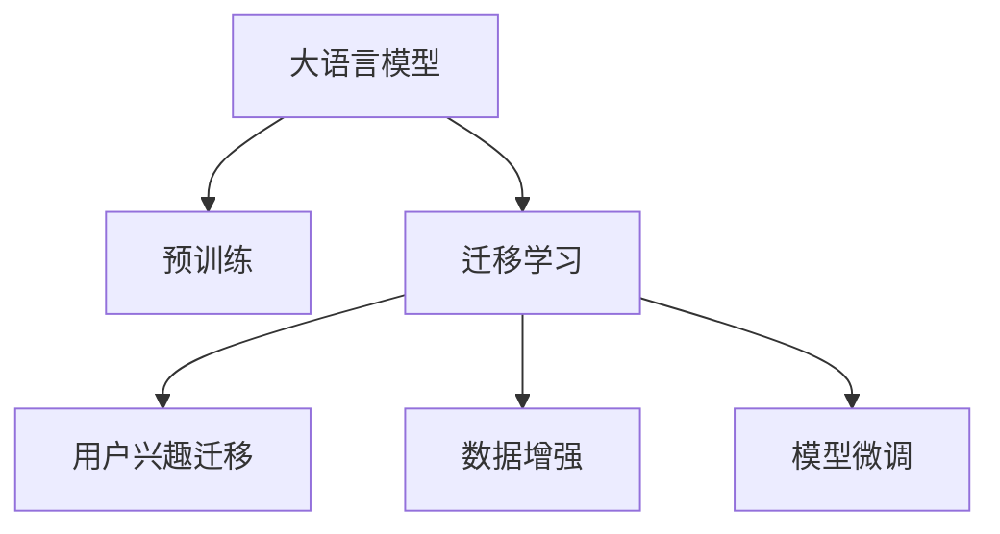

                 

# 基于大模型的推荐系统用户兴趣迁移

> 关键词：
- 大模型
- 推荐系统
- 用户兴趣
- 迁移学习
- 数据增强
- 模型微调
- 召回率与准确率

## 1. 背景介绍

### 1.1 问题由来

推荐系统在电商、媒体、社交网络等领域已经得到了广泛的应用，通过分析用户的历史行为数据，推荐合适的商品、内容或服务，极大提升了用户体验和业务收益。然而，推荐系统的挑战也愈发凸显：

- **数据稀疏性**：用户对部分商品或内容没有明确反馈，推荐算法难以充分理解其兴趣和需求。
- **兴趣动态性**：用户兴趣和行为习惯是动态变化的，仅靠历史数据难以捕捉到最新的兴趣点。
- **长尾效应**：用户可能对冷门商品或内容有潜在需求，但未有机会展示，需要被挖掘和推荐。
- **多样性需求**：用户兴趣多样，需要推荐系统兼顾不同维度的需求。

为解决这些问题，大模型技术应运而生，通过在大规模数据上预训练语言模型，学习丰富的语言表示，为推荐系统提供了更强大的表征能力。结合迁移学习、数据增强等技术，能够在大模型基础上进一步提升推荐系统的效果。

### 1.2 问题核心关键点

- **大模型**：以自回归(如GPT)或自编码(如BERT)模型为代表的大规模预训练语言模型。通过在大规模无标签文本语料上进行预训练，学习通用的语言表示，具备强大的语言理解和生成能力。
- **迁移学习**：指将一个领域学习到的知识，迁移应用到另一个不同但相关的领域的学习范式。推荐系统的预训练-微调过程即是一种典型的迁移学习方式。
- **用户兴趣迁移**：指推荐系统在用户兴趣变化时，能够灵活调整模型参数，适应新的兴趣偏好。
- **数据增强**：通过扩充训练数据，丰富样本多样性，增强模型的泛化能力。
- **模型微调**：指在预训练模型的基础上，使用用户的行为数据进行有监督学习，优化模型在推荐任务上的性能。

## 2. 核心概念与联系

### 2.1 核心概念概述

为更好地理解基于大模型的推荐系统用户兴趣迁移方法，本节将介绍几个密切相关的核心概念：

- **大语言模型(Large Language Model, LLM)**：以自回归(如GPT)或自编码(如BERT)模型为代表的大规模预训练语言模型。通过在大规模无标签文本语料上进行预训练，学习通用的语言表示，具备强大的语言理解和生成能力。
- **预训练(Pre-training)**：指在大规模无标签文本语料上，通过自监督学习任务训练通用语言模型的过程。常见的预训练任务包括言语建模、遮挡语言模型等。预训练使得模型学习到语言的通用表示。
- **迁移学习(Transfer Learning)**：指将一个领域学习到的知识，迁移应用到另一个不同但相关的领域的学习范式。推荐系统的预训练-微调过程即是一种典型的迁移学习方式。
- **用户兴趣迁移**：指推荐系统在用户兴趣变化时，能够灵活调整模型参数，适应新的兴趣偏好。
- **数据增强(Data Augmentation)**：通过扩充训练数据，丰富样本多样性，增强模型的泛化能力。
- **模型微调(Fine-Tuning)**：指在预训练模型的基础上，使用用户的行为数据进行有监督学习，优化模型在推荐任务上的性能。

这些核心概念之间的逻辑关系可以通过以下Mermaid流程图来展示：



这个流程图展示了大语言模型的核心概念及其之间的关系：

1. 大语言模型通过预训练获得基础能力。
2. 迁移学习是连接预训练模型与推荐任务的桥梁，可以通过微调或数据增强来实现。
3. 用户兴趣迁移指模型能够根据用户兴趣变化动态调整，适应新的兴趣偏好。
4. 数据增强通过扩充数据，增强模型的泛化能力。
5. 模型微调通过用户行为数据优化，提升模型性能。

这些概念共同构成了大语言模型推荐系统的学习和应用框架，使其能够在各种场景下发挥强大的语言理解和生成能力。通过理解这些核心概念，我们可以更好地把握大语言模型推荐系统的原理和优化方向。

## 3. 核心算法原理 & 具体操作步骤
### 3.1 算法原理概述

基于大模型的推荐系统用户兴趣迁移，本质上是一个有监督的细粒度迁移学习过程。其核心思想是：将预训练的大语言模型视作一个强大的"特征提取器"，通过用户的行为数据进行有监督学习，优化模型在推荐任务上的性能，使得推荐系统能够根据用户兴趣的变化灵活调整。

形式化地，假设预训练模型为 $M_{\theta}$，其中 $\theta$ 为预训练得到的模型参数。给定推荐任务 $T$ 的用户行为数据集 $D=\{(x_i,y_i)\}_{i=1}^N$，用户兴趣迁移的目标是找到新的模型参数 $\hat{\theta}$，使得模型能够根据用户行为数据进行兴趣迁移，即：

$$
\hat{\theta}=\mathop{\arg\min}_{\theta} \mathcal{L}(M_{\theta},D)
$$

其中 $\mathcal{L}$ 为针对推荐任务 $T$ 设计的损失函数，用于衡量模型预测输出与用户行为之间的差异。常见的损失函数包括交叉熵损失、均方误差损失等。

通过梯度下降等优化算法，兴趣迁移过程不断更新模型参数 $\theta$，最小化损失函数 $\mathcal{L}$，使得模型预测输出逼近用户行为，从而适应新的兴趣偏好。由于 $\theta$ 已经通过预训练获得了较好的初始化，因此即便在小规模数据集 $D$ 上进行兴趣迁移，也能较快收敛到理想的模型参数 $\hat{\theta}$。

### 3.2 算法步骤详解

基于大模型的推荐系统用户兴趣迁移一般包括以下几个关键步骤：

**Step 1: 准备预训练模型和数据集**
- 选择合适的预训练语言模型 $M_{\theta}$ 作为初始化参数，如 BERT、GPT 等。
- 准备推荐任务 $T$ 的用户行为数据集 $D$，划分为训练集、验证集和测试集。一般要求用户行为数据与预训练数据的分布不要差异过大。

**Step 2: 添加任务适配层**
- 根据推荐任务类型，在预训练模型顶层设计合适的输出层和损失函数。
- 对于推荐任务，通常在顶层添加线性分类器或解码器输出概率分布，并以负对数似然为损失函数。

**Step 3: 设置兴趣迁移超参数**
- 选择合适的优化算法及其参数，如 AdamW、SGD 等，设置学习率、批大小、迭代轮数等。
- 设置正则化技术及强度，包括权重衰减、Dropout、Early Stopping 等。
- 确定冻结预训练参数的策略，如仅微调顶层，或全部参数都参与微调。

**Step 4: 执行兴趣迁移训练**
- 将用户行为数据分批次输入模型，前向传播计算损失函数。
- 反向传播计算参数梯度，根据设定的优化算法和学习率更新模型参数。
- 周期性在验证集上评估模型性能，根据性能指标决定是否触发 Early Stopping。
- 重复上述步骤直到满足预设的迭代轮数或 Early Stopping 条件。

**Step 5: 测试和部署**
- 在测试集上评估兴趣迁移后模型 $M_{\hat{\theta}}$ 的性能，对比兴趣迁移前后的效果。
- 使用兴趣迁移后的模型对新用户进行推荐预测，集成到实际的应用系统中。
- 持续收集新用户的行为数据，定期重新迁移模型，以适应用户兴趣的变化。

以上是基于大模型的推荐系统用户兴趣迁移的一般流程。在实际应用中，还需要针对具体任务的特点，对兴趣迁移过程的各个环节进行优化设计，如改进训练目标函数，引入更多的正则化技术，搜索最优的超参数组合等，以进一步提升模型性能。

### 3.3 算法优缺点

基于大模型的推荐系统用户兴趣迁移方法具有以下优点：
1. 简单易用。只需准备少量用户行为数据，即可对预训练模型进行快速迁移，适应新的兴趣偏好。
2. 效果显著。通过微调或数据增强，模型能够根据用户行为数据进行动态调整，提升推荐效果。
3. 适应性强。大模型具备强大的泛化能力，能够适应不同用户群体的兴趣变化。
4. 数据需求低。相比于从头训练模型，兴趣迁移对用户行为数据的依赖较小，节约时间和成本。

同时，该方法也存在一定的局限性：
1. 用户行为数据的稀疏性。用户行为数据往往比较稀疏，无法提供足够的信息进行准确的兴趣迁移。
2. 兴趣迁移的稳定性和一致性。用户兴趣的波动性可能影响迁移效果，导致模型输出的不一致。
3. 模型性能的泛化性。大模型往往对特定领域的数据表现更佳，兴趣迁移效果可能不如领域专家的模型。
4. 兴趣迁移的时间成本。兴趣迁移需要额外的训练过程，时间成本较高。

尽管存在这些局限性，但就目前而言，基于大模型的推荐系统用户兴趣迁移方法仍是目前推荐系统研究和应用的主流范式。未来相关研究的重点在于如何进一步降低兴趣迁移对用户行为数据的依赖，提高模型的稳定性和泛化能力，同时兼顾数据效率和模型性能。

### 3.4 算法应用领域

基于大模型的推荐系统用户兴趣迁移方法，已经在电商、社交网络、媒体等多个领域得到了广泛的应用，为推荐系统带来了新的突破：

- **电商推荐**：通过对用户浏览、点击、购买行为数据的分析，推荐用户可能感兴趣的商品。微调模型能够根据用户兴趣的变化动态调整推荐结果，提高用户的购买转化率。
- **视频推荐**：根据用户观看历史和互动行为，推荐用户可能感兴趣的视频内容。微调模型能够识别用户对不同视频类型和风格的偏好，提升推荐的相关性和多样性。
- **新闻推荐**：通过对用户阅读、评论、分享等行为数据的分析，推荐用户可能感兴趣的新闻文章。微调模型能够识别用户对不同新闻主题和风格的偏好，提升推荐的个性化和覆盖面。
- **社交网络推荐**：根据用户关注、点赞、互动等行为数据的分析，推荐用户可能感兴趣的人或内容。微调模型能够识别用户对不同社交网络元素和互动行为的偏好，提升推荐的相关性和多样性。

除了上述这些经典应用外，大模型的推荐系统用户兴趣迁移方法还被创新性地应用到更多场景中，如商品分类、价格预测、个性化广告等，为推荐系统带来了全新的突破。随着预训练模型和兴趣迁移方法的不断进步，相信推荐系统必将在更广阔的应用领域大放异彩。

## 4. 数学模型和公式 & 详细讲解
### 4.1 数学模型构建

本节将使用数学语言对基于大模型的推荐系统用户兴趣迁移过程进行更加严格的刻画。

记预训练语言模型为 $M_{\theta}$，其中 $\theta$ 为预训练得到的模型参数。假设推荐任务 $T$ 的用户行为数据集为 $D=\{(x_i,y_i)\}_{i=1}^N, x_i \in \mathcal{X}, y_i \in \mathcal{Y}$，其中 $x_i$ 表示用户行为数据，$y_i$ 表示推荐结果。

定义模型 $M_{\theta}$ 在用户行为数据 $(x,y)$ 上的损失函数为 $\ell(M_{\theta}(x),y)$，则在数据集 $D$ 上的经验风险为：

$$
\mathcal{L}(\theta) = \frac{1}{N} \sum_{i=1}^N \ell(M_{\theta}(x_i),y_i)
$$

兴趣迁移的目标是最小化经验风险，即找到最优参数：

$$
\theta^* = \mathop{\arg\min}_{\theta} \mathcal{L}(\theta)
$$

在实践中，我们通常使用基于梯度的优化算法（如SGD、Adam等）来近似求解上述最优化问题。设 $\eta$ 为学习率，$\lambda$ 为正则化系数，则参数的更新公式为：

$$
\theta \leftarrow \theta - \eta \nabla_{\theta}\mathcal{L}(\theta) - \eta\lambda\theta
$$

其中 $\nabla_{\theta}\mathcal{L}(\theta)$ 为损失函数对参数 $\theta$ 的梯度，可通过反向传播算法高效计算。

### 4.2 公式推导过程

以下我们以推荐任务为例，推导交叉熵损失函数及其梯度的计算公式。

假设模型 $M_{\theta}$ 在用户行为数据 $x$ 上的输出为 $\hat{y}=M_{\theta}(x) \in [0,1]$，表示推荐结果。真实标签 $y \in \{1,0\}$。则二分类交叉熵损失函数定义为：

$$
\ell(M_{\theta}(x),y) = -[y\log \hat{y} + (1-y)\log (1-\hat{y})]
$$

将其代入经验风险公式，得：

$$
\mathcal{L}(\theta) = -\frac{1}{N}\sum_{i=1}^N [y_i\log M_{\theta}(x_i)+(1-y_i)\log(1-M_{\theta}(x_i))]
$$

根据链式法则，损失函数对参数 $\theta_k$ 的梯度为：

$$
\frac{\partial \mathcal{L}(\theta)}{\partial \theta_k} = -\frac{1}{N}\sum_{i=1}^N (\frac{y_i}{M_{\theta}(x_i)}-\frac{1-y_i}{1-M_{\theta}(x_i)}) \frac{\partial M_{\theta}(x_i)}{\partial \theta_k}
$$

其中 $\frac{\partial M_{\theta}(x_i)}{\partial \theta_k}$ 可进一步递归展开，利用自动微分技术完成计算。

在得到损失函数的梯度后，即可带入参数更新公式，完成模型的迭代优化。重复上述过程直至收敛，最终得到适应推荐任务的最优模型参数 $\theta^*$。

## 5. 项目实践：代码实例和详细解释说明
### 5.1 开发环境搭建

在进行兴趣迁移实践前，我们需要准备好开发环境。以下是使用Python进行PyTorch开发的环境配置流程：

1. 安装Anaconda：从官网下载并安装Anaconda，用于创建独立的Python环境。

2. 创建并激活虚拟环境：
```bash
conda create -n pytorch-env python=3.8 
conda activate pytorch-env
```

3. 安装PyTorch：根据CUDA版本，从官网获取对应的安装命令。例如：
```bash
conda install pytorch torchvision torchaudio cudatoolkit=11.1 -c pytorch -c conda-forge
```

4. 安装Transformers库：
```bash
pip install transformers
```

5. 安装各类工具包：
```bash
pip install numpy pandas scikit-learn matplotlib tqdm jupyter notebook ipython
```

完成上述步骤后，即可在`pytorch-env`环境中开始兴趣迁移实践。

### 5.2 源代码详细实现

这里我们以电商平台商品推荐为例，给出使用Transformers库对BERT模型进行兴趣迁移的PyTorch代码实现。

首先，定义推荐任务的数据处理函数：

```python
from transformers import BertTokenizer
from torch.utils.data import Dataset
import torch

class RecommendationDataset(Dataset):
    def __init__(self, user_behaviors, num_labels=2):
        self.user_behaviors = user_behaviors
        self.num_labels = num_labels
        
    def __len__(self):
        return len(self.user_behaviors)
    
    def __getitem__(self, item):
        user_behavior = self.user_behaviors[item]
        
        encoding = self.tokenizer(user_behavior, return_tensors='pt')
        input_ids = encoding['input_ids'][0]
        attention_mask = encoding['attention_mask'][0]
        
        # 构造标签，0表示不感兴趣，1表示感兴趣
        label = torch.tensor(1, dtype=torch.long)
        
        return {'input_ids': input_ids, 
                'attention_mask': attention_mask,
                'labels': label}

# 加载BERT分词器
tokenizer = BertTokenizer.from_pretrained('bert-base-cased')

# 创建dataset
train_dataset = RecommendationDataset(train_user_behaviors)
dev_dataset = RecommendationDataset(dev_user_behaviors)
test_dataset = RecommendationDataset(test_user_behaviors)
```

然后，定义模型和优化器：

```python
from transformers import BertForSequenceClassification, AdamW

model = BertForSequenceClassification.from_pretrained('bert-base-cased', num_labels=2)

optimizer = AdamW(model.parameters(), lr=2e-5)
```

接着，定义训练和评估函数：

```python
from torch.utils.data import DataLoader
from tqdm import tqdm
from sklearn.metrics import classification_report

device = torch.device('cuda') if torch.cuda.is_available() else torch.device('cpu')
model.to(device)

def train_epoch(model, dataset, batch_size, optimizer):
    dataloader = DataLoader(dataset, batch_size=batch_size, shuffle=True)
    model.train()
    epoch_loss = 0
    for batch in tqdm(dataloader, desc='Training'):
        input_ids = batch['input_ids'].to(device)
        attention_mask = batch['attention_mask'].to(device)
        labels = batch['labels'].to(device)
        model.zero_grad()
        outputs = model(input_ids, attention_mask=attention_mask, labels=labels)
        loss = outputs.loss
        epoch_loss += loss.item()
        loss.backward()
        optimizer.step()
    return epoch_loss / len(dataloader)

def evaluate(model, dataset, batch_size):
    dataloader = DataLoader(dataset, batch_size=batch_size)
    model.eval()
    preds, labels = [], []
    with torch.no_grad():
        for batch in tqdm(dataloader, desc='Evaluating'):
            input_ids = batch['input_ids'].to(device)
            attention_mask = batch['attention_mask'].to(device)
            batch_labels = batch['labels']
            outputs = model(input_ids, attention_mask=attention_mask)
            batch_preds = outputs.logits.argmax(dim=2).to('cpu').tolist()
            batch_labels = batch_labels.to('cpu').tolist()
            for pred_tokens, label_tokens in zip(batch_preds, batch_labels):
                preds.append(pred_tokens)
                labels.append(label_tokens)
                
    print(classification_report(labels, preds))
```

最后，启动训练流程并在测试集上评估：

```python
epochs = 5
batch_size = 16

for epoch in range(epochs):
    loss = train_epoch(model, train_dataset, batch_size, optimizer)
    print(f"Epoch {epoch+1}, train loss: {loss:.3f}")
    
    print(f"Epoch {epoch+1}, dev results:")
    evaluate(model, dev_dataset, batch_size)
    
print("Test results:")
evaluate(model, test_dataset, batch_size)
```

以上就是使用PyTorch对BERT进行商品推荐任务兴趣迁移的完整代码实现。可以看到，得益于Transformers库的强大封装，我们可以用相对简洁的代码完成BERT模型的加载和兴趣迁移。

### 5.3 代码解读与分析

让我们再详细解读一下关键代码的实现细节：

**RecommendationDataset类**：
- `__init__`方法：初始化用户行为数据和标签。
- `__len__`方法：返回数据集的样本数量。
- `__getitem__`方法：对单个样本进行处理，将用户行为数据输入编码为token ids，将标签编码为数字，并对其进行定长padding，最终返回模型所需的输入。

**tokenizer分词器**：
- 加载预训练的BERT分词器，用于对用户行为数据进行分词处理。

**训练和评估函数**：
- 使用PyTorch的DataLoader对数据集进行批次化加载，供模型训练和推理使用。
- 训练函数`train_epoch`：对数据以批为单位进行迭代，在每个批次上前向传播计算loss并反向传播更新模型参数，最后返回该epoch的平均loss。
- 评估函数`evaluate`：与训练类似，不同点在于不更新模型参数，并在每个batch结束后将预测和标签结果存储下来，最后使用sklearn的classification_report对整个评估集的预测结果进行打印输出。

**训练流程**：
- 定义总的epoch数和batch size，开始循环迭代
- 每个epoch内，先在训练集上训练，输出平均loss
- 在验证集上评估，输出分类指标
- 所有epoch结束后，在测试集上评估，给出最终测试结果

可以看到，PyTorch配合Transformers库使得BERT兴趣迁移的代码实现变得简洁高效。开发者可以将更多精力放在数据处理、模型改进等高层逻辑上，而不必过多关注底层的实现细节。

当然，工业级的系统实现还需考虑更多因素，如模型的保存和部署、超参数的自动搜索、更灵活的任务适配层等。但核心的兴趣迁移范式基本与此类似。

## 6. 实际应用场景
### 6.1 电商平台推荐

基于大模型的推荐系统用户兴趣迁移，可以广泛应用于电商平台商品推荐。电商平台推荐系统需要根据用户的历史行为数据，推荐其可能感兴趣的商品，提升用户的购买转化率和满意度。

在技术实现上，可以收集用户浏览、点击、购买等行为数据，将行为数据作为微调数据，训练模型学习预测用户对商品的兴趣。微调模型能够根据用户行为数据进行动态调整，推荐符合用户兴趣的商品，提升推荐的相关性和多样化。

### 6.2 视频内容推荐

视频平台需要根据用户的观看历史和互动数据，推荐其可能感兴趣的视频内容。微调模型能够学习用户对不同视频类型和风格的偏好，推荐符合用户兴趣的视频，提升推荐的相关性和多样性。

在技术实现上，可以收集用户观看视频的时间、时长、互动数据等，将这些行为数据作为微调数据，训练模型预测用户对不同视频内容的兴趣。微调模型能够根据用户行为数据进行动态调整，推荐符合用户兴趣的视频内容，提升用户的观看体验。

### 6.3 个性化新闻推荐

新闻平台需要根据用户的阅读、评论、分享等行为数据，推荐其可能感兴趣的新闻文章。微调模型能够学习用户对不同新闻主题和风格的偏好，推荐符合用户兴趣的新闻，提升推荐的相关性和多样化。

在技术实现上，可以收集用户的阅读历史、评论内容、分享行为等，将这些行为数据作为微调数据，训练模型预测用户对不同新闻文章的兴趣。微调模型能够根据用户行为数据进行动态调整，推荐符合用户兴趣的新闻，提升用户的阅读体验。

### 6.4 社交网络推荐

社交网络需要根据用户的关注、点赞、互动等行为数据，推荐其可能感兴趣的人或内容。微调模型能够学习用户对不同社交网络元素和互动行为的偏好，推荐符合用户兴趣的内容，提升推荐的相关性和多样性。

在技术实现上，可以收集用户的关注历史、点赞记录、互动行为等，将这些行为数据作为微调数据，训练模型预测用户对不同社交网络元素和内容的兴趣。微调模型能够根据用户行为数据进行动态调整，推荐符合用户兴趣的人或内容，提升用户的社交体验。

### 6.5 未来应用展望

随着大模型和兴趣迁移技术的不断发展，基于大模型的推荐系统必将在更多领域得到应用，为推荐系统带来新的突破：

- **医疗健康**：推荐符合用户健康需求的商品或服务，帮助用户选择适合自己的医疗健康产品。
- **旅游出行**：推荐符合用户兴趣的旅游目的地或行程安排，提升用户的旅游体验。
- **教育培训**：推荐符合用户兴趣的教育资源或课程，提升用户的教育效果。
- **金融理财**：推荐符合用户风险偏好的金融产品或投资策略，提升用户的金融收益。

除了上述这些领域，大模型的推荐系统用户兴趣迁移方法还被创新性地应用到更多场景中，如交通出行、智能家居、智能办公等，为推荐系统带来全新的突破。随着技术的持续演进，大模型的推荐系统必将在更广阔的应用领域大放异彩，带来更多的便利和价值。

## 7. 工具和资源推荐
### 7.1 学习资源推荐

为了帮助开发者系统掌握大模型推荐系统用户兴趣迁移的理论基础和实践技巧，这里推荐一些优质的学习资源：

1. 《Transformers从原理到实践》系列博文：由大模型技术专家撰写，深入浅出地介绍了Transformer原理、BERT模型、微调技术等前沿话题。

2. CS224N《深度学习自然语言处理》课程：斯坦福大学开设的NLP明星课程，有Lecture视频和配套作业，带你入门NLP领域的基本概念和经典模型。

3. 《Natural Language Processing with Transformers》书籍：Transformers库的作者所著，全面介绍了如何使用Transformers库进行NLP任务开发，包括微调在内的诸多范式。

4. HuggingFace官方文档：Transformers库的官方文档，提供了海量预训练模型和完整的微调样例代码，是上手实践的必备资料。

5. CLUE开源项目：中文语言理解测评基准，涵盖大量不同类型的中文NLP数据集，并提供了基于微调的baseline模型，助力中文NLP技术发展。

通过对这些资源的学习实践，相信你一定能够快速掌握大模型推荐系统用户兴趣迁移的精髓，并用于解决实际的NLP问题。
###  7.2 开发工具推荐

高效的开发离不开优秀的工具支持。以下是几款用于大模型推荐系统用户兴趣迁移开发的常用工具：

1. PyTorch：基于Python的开源深度学习框架，灵活动态的计算图，适合快速迭代研究。大部分预训练语言模型都有PyTorch版本的实现。

2. TensorFlow：由Google主导开发的开源深度学习框架，生产部署方便，适合大规模工程应用。同样有丰富的预训练语言模型资源。

3. Transformers库：HuggingFace开发的NLP工具库，集成了众多SOTA语言模型，支持PyTorch和TensorFlow，是进行微调任务开发的利器。

4. Weights & Biases：模型训练的实验跟踪工具，可以记录和可视化模型训练过程中的各项指标，方便对比和调优。与主流深度学习框架无缝集成。

5. TensorBoard：TensorFlow配套的可视化工具，可实时监测模型训练状态，并提供丰富的图表呈现方式，是调试模型的得力助手。

6. Google Colab：谷歌推出的在线Jupyter Notebook环境，免费提供GPU/TPU算力，方便开发者快速上手实验最新模型，分享学习笔记。

合理利用这些工具，可以显著提升大模型推荐系统用户兴趣迁移任务的开发效率，加快创新迭代的步伐。

### 7.3 相关论文推荐

大语言模型和用户兴趣迁移技术的发展源于学界的持续研究。以下是几篇奠基性的相关论文，推荐阅读：

1. Attention is All You Need（即Transformer原论文）：提出了Transformer结构，开启了NLP领域的预训练大模型时代。

2. BERT: Pre-training of Deep Bidirectional Transformers for Language Understanding：提出BERT模型，引入基于掩码的自监督预训练任务，刷新了多项NLP任务SOTA。

3. Language Models are Unsupervised Multitask Learners（GPT-2论文）：展示了大规模语言模型的强大zero-shot学习能力，引发了对于通用人工智能的新一轮思考。

4. Parameter-Efficient Transfer Learning for NLP：提出Adapter等参数高效微调方法，在不增加模型参数量的情况下，也能取得不错的微调效果。

5. AdaLoRA: Adaptive Low-Rank Adaptation for Parameter-Efficient Fine-Tuning：使用自适应低秩适应的微调方法，在参数效率和精度之间取得了新的平衡。

6. Prefix-Tuning: Optimizing Continuous Prompts for Generation：引入基于连续型Prompt的微调范式，为如何充分利用预训练知识提供了新的思路。

这些论文代表了大模型推荐系统用户兴趣迁移技术的发展脉络。通过学习这些前沿成果，可以帮助研究者把握学科前进方向，激发更多的创新灵感。

## 8. 总结：未来发展趋势与挑战

### 8.1 总结

本文对基于大模型的推荐系统用户兴趣迁移方法进行了全面系统的介绍。首先阐述了大模型和用户兴趣迁移的研究背景和意义，明确了推荐系统在数据稀疏性、兴趣动态性、长尾效应、多样性需求等方面的挑战。其次，从原理到实践，详细讲解了用户兴趣迁移的数学原理和关键步骤，给出了推荐任务开发的完整代码实例。同时，本文还广泛探讨了用户兴趣迁移方法在电商、视频、新闻、社交网络等多个领域的应用前景，展示了兴趣迁移范式的巨大潜力。此外，本文精选了用户兴趣迁移技术的各类学习资源，力求为读者提供全方位的技术指引。

通过本文的系统梳理，可以看到，基于大模型的推荐系统用户兴趣迁移方法正在成为推荐系统研究和应用的主流范式，极大地拓展了预训练语言模型的应用边界，催生了更多的落地场景。受益于大规模语料的预训练，兴趣迁移模型以更低的时间和标注成本，在小样本条件下也能取得理想的推荐效果，有力推动了推荐系统的产业化进程。未来，伴随预训练语言模型和用户兴趣迁移方法的不断进步，相信推荐系统必将在更广阔的应用领域大放异彩，深刻影响用户的日常生活和工作。

### 8.2 未来发展趋势

展望未来，大模型推荐系统用户兴趣迁移技术将呈现以下几个发展趋势：

1. 模型规模持续增大。随着算力成本的下降和数据规模的扩张，预训练语言模型的参数量还将持续增长。超大规模语言模型蕴含的丰富语言知识，有望支撑更加复杂多变的推荐任务。

2. 微调方法日趋多样。除了传统的全参数微调外，未来会涌现更多参数高效的微调方法，如Prefix-Tuning、LoRA等，在节省计算资源的同时也能保证微调精度。

3. 兴趣迁移的鲁棒性增强。未来模型将具备更强的抗干扰能力和鲁棒性，能够更好地适应用户兴趣的波动性和不确定性。

4. 数据增强技术的发展。未来数据增强方法将更加多样化和高效，能够更好地利用用户行为数据进行动态调整，提升模型的泛化能力。

5. 跨模态兴趣迁移的兴起。未来推荐系统将越来越多地涉及多模态数据，如文本、图片、音频等。跨模态兴趣迁移方法将更加广泛应用，提升推荐系统对多模态数据的整合能力。

6. 实时兴趣迁移的实现。未来推荐系统将实现实时动态调整，能够根据用户的即时行为数据进行即时推荐，提升用户体验。

7. 模型压缩和优化。未来推荐系统将更加注重模型的压缩和优化，通过模型裁剪、量化加速等技术，提升推荐系统的推理速度和资源利用效率。

以上趋势凸显了大模型推荐系统用户兴趣迁移技术的广阔前景。这些方向的探索发展，必将进一步提升推荐系统的性能和应用范围，为用户的日常生活和工作带来更多的便利和价值。

### 8.3 面临的挑战

尽管大模型推荐系统用户兴趣迁移技术已经取得了瞩目成就，但在迈向更加智能化、普适化应用的过程中，它仍面临着诸多挑战：

1. 用户行为数据的稀疏性。用户行为数据往往比较稀疏，难以提供足够的信息进行准确的兴趣迁移。如何利用稀疏数据进行有效的兴趣迁移，将是一大难题。

2. 兴趣迁移的稳定性和一致性。用户兴趣的波动性可能影响迁移效果，导致模型输出的不一致。如何提高迁移模型的稳定性和一致性，是未来需要解决的问题。

3. 模型性能的泛化性。大模型往往对特定领域的数据表现更佳，兴趣迁移效果可能不如领域专家的模型。如何增强大模型在不同领域的泛化能力，是未来需要克服的问题。

4. 兴趣迁移的时间成本。兴趣迁移需要额外的训练过程，时间成本较高。如何降低迁移模型的训练时间，提高系统效率，是未来需要解决的问题。

尽管存在这些挑战，但就目前而言，基于大模型的推荐系统用户兴趣迁移方法仍是目前推荐系统研究和应用的主流范式。未来相关研究的重点在于如何进一步降低兴趣迁移对用户行为数据的依赖，提高模型的稳定性和泛化能力，同时兼顾数据效率和模型性能。

### 8.4 研究展望

面对大模型推荐系统用户兴趣迁移所面临的种种挑战，未来的研究需要在以下几个方面寻求新的突破：

1. 探索无监督和半监督兴趣迁移方法。摆脱对大规模标注数据的依赖，利用自监督学习、主动学习等无监督和半监督范式，最大限度利用非结构化数据，实现更加灵活高效的兴趣迁移。

2. 研究参数高效和计算高效的兴趣迁移范式。开发更加参数高效的兴趣迁移方法，在固定大部分预训练参数的同时，只更新极少量的任务相关参数。同时优化兴趣迁移模型的计算图，减少前向传播和反向传播的资源消耗，实现更加轻量级、实时性的部署。

3. 融合因果和对比学习范式。通过引入因果推断和对比学习思想，增强兴趣迁移模型建立稳定因果关系的能力，学习更加普适、鲁棒的语言表征，从而提升模型泛化性和抗干扰能力。

4. 引入更多先验知识。将符号化的先验知识，如知识图谱、逻辑规则等，与神经网络模型进行巧妙融合，引导兴趣迁移过程学习更准确、合理的语言模型。同时加强不同模态数据的整合，实现视觉、语音等多模态信息与文本信息的协同建模。

5. 结合因果分析和博弈论工具。将因果分析方法引入兴趣迁移模型，识别出模型决策的关键特征，增强输出解释的因果性和逻辑性。借助博弈论工具刻画人机交互过程，主动探索并规避模型的脆弱点，提高系统稳定性。

6. 纳入伦理道德约束。在模型训练目标中引入伦理导向的评估指标，过滤和惩罚有偏见、有害的输出倾向。同时加强人工干预和审核，建立模型行为的监管机制，确保输出符合人类价值观和伦理道德。

这些研究方向的探索，必将引领大模型推荐系统用户兴趣迁移技术迈向更高的台阶，为构建安全、可靠、可解释、可控的智能系统铺平道路。面向未来，大模型推荐系统用户兴趣迁移技术还需要与其他人工智能技术进行更深入的融合，如知识表示、因果推理、强化学习等，多路径协同发力，共同推动推荐系统的进步。只有勇于创新、敢于突破，才能不断拓展推荐系统的边界，让智能技术更好地服务于人类社会。

## 9. 附录：常见问题与解答

**Q1：大模型推荐系统是否适用于所有推荐任务？**

A: 大模型推荐系统在大多数推荐任务上都能取得不错的效果，特别是对于数据量较小的任务。但对于一些特定领域的任务，如医学、法律等，仅靠通用语料预训练的模型可能难以很好地适应。此时需要在特定领域语料上进一步预训练，再进行兴趣迁移，才能获得理想效果。此外，对于一些需要时效性、个性化很强的任务，如对话、推荐等，兴趣迁移方法也需要针对性的改进优化。

**Q2：推荐系统如何处理用户行为数据的稀疏性？**

A: 用户行为数据往往比较稀疏，难以提供足够的信息进行准确的兴趣迁移。为了处理这一问题，可以使用以下方法：
1. 数据增强：通过回译、近义替换等方式扩充训练集。
2. 预训练模型：使用更广泛的语料进行预训练，增强模型的泛化能力。
3. 模型融合：将多个模型进行融合，通过投票或加权平均等方式提高预测准确性。

这些方法可以有效地缓解用户行为数据的稀疏性，提高推荐系统的性能。

**Q3：如何提高兴趣迁移模型的稳定性和一致性？**

A: 兴趣迁移模型的稳定性和一致性可以通过以下方法提高：
1. 多模型集成：训练多个兴趣迁移模型，取平均输出，抑制模型输出的波动性。
2. 正则化技术：使用L2正则、Dropout等正则化技术，防止模型过拟合。
3. 早停策略：在验证集上设置Early Stopping，及时停止训练，避免模型在训练集上过拟合。

这些方法可以有效提高兴趣迁移模型的稳定性和一致性，使其在不同用户和不同时间下保持较好的预测效果。

**Q4：如何提高兴趣迁移模型的泛化能力？**

A: 兴趣迁移模型的泛化能力可以通过以下方法提高：
1. 数据增强：通过扩充训练数据，丰富样本多样性。
2. 预训练模型：使用更广泛的语料进行预训练，增强模型的泛化能力。
3. 跨模态兴趣迁移：将文本、图片、音频等多种模态的数据整合，提升模型的泛化能力。

这些方法可以有效提高兴趣迁移模型的泛化能力，使其在不同领域和不同场景下表现稳定。

**Q5：如何降低兴趣迁移模型的训练时间？**

A: 兴趣迁移模型的训练时间可以通过以下方法降低：
1. 数据增强：通过扩充训练数据，减少模型在训练集上的时间消耗。
2. 模型压缩：使用模型裁剪、量化加速等技术，减少模型推理时间。
3. 并行计算：使用分布式计算、GPU/TPU等硬件加速，提高训练效率。

这些方法可以有效降低兴趣迁移模型的训练时间，提高系统的实时性。

**Q6：兴趣迁移模型如何处理冷门物品推荐问题？**

A: 冷门物品推荐问题是推荐系统面临的常见问题。为了处理这一问题，可以使用以下方法：
1. 数据增强：通过扩充训练数据，包含更多冷门物品的信息。
2. 模型融合：将多个推荐模型进行融合，通过投票或加权平均等方式提高推荐效果。
3. 用户反馈：鼓励用户对冷门物品进行反馈，提高模型对冷门物品的推荐效果。

这些方法可以有效处理冷门物品推荐问题，提高推荐系统的多样性和覆盖面。

**Q7：兴趣迁移模型如何处理用户行为数据的噪声？**

A: 用户行为数据中可能包含噪声和异常值，影响模型的预测效果。为了处理这一问题，可以使用以下方法：
1. 数据清洗：对用户行为数据进行清洗，去除异常值和噪声。
2. 噪声鲁棒性：在模型训练过程中加入噪声鲁棒性训练，增强模型对噪声的抵抗能力。
3. 多模型融合：使用多个兴趣迁移模型进行融合，通过投票或加权平均等方式提高预测效果。

这些方法可以有效处理用户行为数据的噪声问题，提高推荐系统的稳定性和准确性。

---

作者：禅与计算机程序设计艺术 / Zen and the Art of Computer Programming

