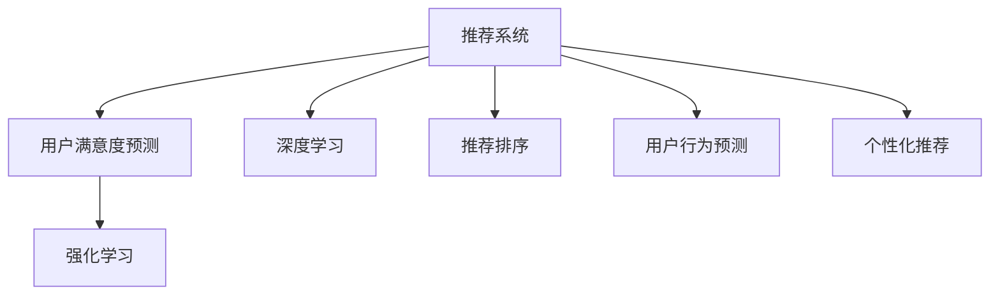

                 

# 基于大模型的推荐系统用户满意度预测

> 关键词：推荐系统,用户满意度预测,大模型,深度学习,强化学习

## 1. 背景介绍

### 1.1 问题由来
随着电子商务的蓬勃发展，推荐系统已成为各大电商平台的标配。推荐系统通过分析用户行为数据，推测用户兴趣偏好，精准推送个性化商品，极大地提升了用户体验和销售转化率。然而，现有推荐系统仍存在诸多不足，如过度拟合用户历史行为、忽视用户长期兴趣、难以理解用户真实需求等。因此，亟需更全面、更智能的推荐系统，以驱动电商平台的业务创新和用户体验升级。

### 1.2 问题核心关键点
基于大模型的推荐系统用户满意度预测，旨在通过深度学习模型和强化学习技术，精准预测用户对推荐结果的满意度，从而优化推荐策略，提升用户体验和平台收益。该方法具有以下关键点：

- 深度学习模型：利用大模型对用户行为和商品特征进行全面建模，提取高层次的抽象表示。
- 用户满意度预测：通过深度学习模型，预测用户对推荐结果的满意度评分，并据此优化推荐策略。
- 强化学习：在用户交互数据上训练强化学习模型，动态调整推荐策略，提升用户体验。

## 2. 核心概念与联系

### 2.1 核心概念概述

为更好地理解基于大模型的推荐系统用户满意度预测方法，本节将介绍几个密切相关的核心概念：

- 推荐系统(Recommendation System)：利用机器学习或深度学习模型，分析用户行为数据，预测用户对商品或内容的兴趣，推荐个性化商品或内容。
- 用户满意度预测：通过深度学习模型，预测用户对推荐结果的满意度评分，从而优化推荐策略，提升用户体验。
- 大模型(Large Model)：以深度学习模型为代表的大规模预训练模型，通过在海量数据上进行预训练，学习通用的语言或特征表示。
- 深度学习(Deep Learning)：一种通过多层神经网络进行复杂数据建模的技术，广泛应用于图像、语音、自然语言处理等领域。
- 强化学习(Reinforcement Learning, RL)：通过与环境的交互，智能调整模型参数，以最大化预期奖励的机器学习方法。
- 推荐排序(Recommendation Ranking)：基于用户行为数据，预测每个推荐商品的评分，并按评分高低排序推荐。
- 用户行为预测(User Behavior Prediction)：通过深度学习模型，预测用户未来的行为，如点击、购买、评价等，用于优化推荐模型。
- 个性化推荐(Personalized Recommendation)：针对特定用户，通过深度学习模型生成个性化推荐列表。

这些核心概念之间的逻辑关系可以通过以下Mermaid流程图来展示：



这个流程图展示了大模型的推荐系统用户满意度预测的核心概念及其之间的关系：

1. 推荐系统通过深度学习模型对用户行为和商品特征进行全面建模。
2. 用户满意度预测通过深度学习模型，预测用户对推荐结果的满意度评分，并据此优化推荐策略。
3. 强化学习在用户交互数据上训练，动态调整推荐策略，提升用户体验。
4. 推荐排序基于用户行为数据，预测每个推荐商品的评分，并按评分高低排序推荐。
5. 用户行为预测通过深度学习模型，预测用户未来的行为，用于优化推荐模型。
6. 个性化推荐针对特定用户，通过深度学习模型生成个性化推荐列表。

## 3. 核心算法原理 & 具体操作步骤
### 3.1 算法原理概述

基于大模型的推荐系统用户满意度预测，本质上是一个深度学习-强化学习的联合优化问题。其核心思想是：通过深度学习模型预测用户对推荐结果的满意度，并结合强化学习算法，动态调整推荐策略，提升用户满意度。

形式化地，假设推荐系统中的商品集合为 $I$，用户集合为 $U$，用户与商品之间的评分矩阵为 $R_{iu}$。设用户 $u$ 对商品 $i$ 的满意度为 $y_{iu}$，满意度模型为 $f(x)$，其中 $x$ 为模型输入，可以是商品特征、用户特征、历史行为等。则推荐系统的目标函数为：

$$
\min_{x} \sum_{i \in I, u \in U} \ell(f(x),y_{iu})
$$

其中 $\ell$ 为满意度预测模型的损失函数，通常包括均方误差、交叉熵等。

强化学习的目标是最大化预期奖励 $J$，其中奖励函数 $r(u,i)$ 可以是用户满意度、点击率等指标。强化学习模型 $Q$ 在每轮迭代中，根据当前状态 $s_t$ 和动作 $a_t$ 计算奖励 $r_t$ 和下一个状态 $s_{t+1}$，最终得到预期的总奖励 $J$。因此，强化学习模型的优化目标为：

$$
\max_{\theta} J(\theta) = \sum_{t} r_t \prod_{t'=t}^{T} \pi_{\theta}(a_{t'}|s_{t'})
$$

其中 $\theta$ 为模型的参数，$\pi_{\theta}(a_{t'}|s_{t'})$ 为策略函数，即模型在当前状态下选择动作的概率。

### 3.2 算法步骤详解

基于大模型的推荐系统用户满意度预测一般包括以下几个关键步骤：

**Step 1: 准备数据集**
- 收集用户行为数据，如点击、购买、评分等，构造评分矩阵 $R_{iu}$。
- 收集用户特征、商品特征等，构造特征向量 $x$。

**Step 2: 选择深度学习模型**
- 选择合适的深度学习模型，如双塔模型(Bi-LSTM)、三塔模型(Trig-LSTM)等，用于计算用户与商品之间的表示相似度。
- 设计满意度预测模型，如MLP、RNN等，用于预测用户对推荐结果的满意度。

**Step 3: 选择强化学习模型**
- 选择合适的强化学习算法，如Q-learning、DQN等，用于优化推荐策略。
- 定义奖励函数，如点击率、满意度等，用于衡量推荐效果。

**Step 4: 训练模型**
- 在用户行为数据上训练深度学习模型和强化学习模型，优化模型参数。
- 在每轮迭代中，深度学习模型输出满意度预测结果，强化学习模型根据预测结果和奖励函数，调整推荐策略。

**Step 5: 评估和部署**
- 在测试集上评估模型性能，对比微调前后的精度提升。
- 使用微调后的模型对新用户进行推荐，集成到实际的应用系统中。
- 持续收集新数据，定期重新训练和微调模型，以适应数据分布的变化。

以上是基于大模型的推荐系统用户满意度预测的一般流程。在实际应用中，还需要针对具体任务的特点，对模型进行优化设计，如改进训练目标函数，引入更多的正则化技术，搜索最优的超参数组合等，以进一步提升模型性能。

### 3.3 算法优缺点

基于大模型的推荐系统用户满意度预测方法具有以下优点：
1. 综合考虑用户行为和商品特征，提取高层次的抽象表示。
2. 通过满意度预测模型，量化用户对推荐结果的满意度，提升推荐效果。
3. 结合强化学习算法，动态调整推荐策略，提升用户体验。
4. 采用大模型，可以大幅提升推荐系统的效果，且计算复杂度较低。

同时，该方法也存在一定的局限性：
1. 依赖标注数据。用户满意度数据通常需要人工标注，获取成本较高。
2. 模型的复杂性。深度学习模型和强化学习模型具有较高的复杂度，训练和调参难度较大。
3. 数据的稀疏性。用户行为数据往往存在稀疏性，难以充分利用。
4. 模型的泛化能力。在训练集和测试集分布不一致的情况下，模型的泛化能力可能受到影响。

尽管存在这些局限性，但就目前而言，基于大模型的推荐系统用户满意度预测方法仍是最主流范式。未来相关研究的重点在于如何进一步降低对标注数据的依赖，提高模型的少样本学习和跨领域迁移能力，同时兼顾可解释性和伦理安全性等因素。

### 3.4 算法应用领域

基于大模型的推荐系统用户满意度预测方法，已经在推荐系统领域得到了广泛的应用，覆盖了几乎所有常见推荐任务，例如：

- 电商平台推荐：如淘宝、京东等电商平台，通过深度学习模型和强化学习算法，推荐商品、优化广告投放等。
- 内容推荐：如Netflix、Spotify等平台，通过深度学习模型和强化学习算法，推荐视频、音乐等。
- 新闻推荐：如今日头条、澎湃新闻等平台，通过深度学习模型和强化学习算法，推荐新闻资讯等。
- 商品推荐：如Amazon、eBay等平台，通过深度学习模型和强化学习算法，推荐商品。
- 广告推荐：如Facebook、Google等平台，通过深度学习模型和强化学习算法，推荐广告。

除了上述这些经典任务外，基于大模型的推荐系统用户满意度预测方法还被创新性地应用到更多场景中，如社交网络推荐、金融推荐、个性化定制等，为推荐系统带来了全新的突破。随着深度学习模型和强化学习方法的不断进步，相信基于大模型的推荐系统用户满意度预测方法将更广泛地应用于各种推荐任务，推动推荐系统的智能化进程。

## 4. 数学模型和公式 & 详细讲解  
### 4.1 数学模型构建

本节将使用数学语言对基于大模型的推荐系统用户满意度预测过程进行更加严格的刻画。

记推荐系统中的商品集合为 $I$，用户集合为 $U$，用户与商品之间的评分矩阵为 $R_{iu}$。设用户 $u$ 对商品 $i$ 的满意度为 $y_{iu}$，满意度模型为 $f(x)$，其中 $x$ 为模型输入，可以是商品特征、用户特征、历史行为等。则推荐系统的目标函数为：

$$
\min_{x} \sum_{i \in I, u \in U} \ell(f(x),y_{iu})
$$

其中 $\ell$ 为满意度预测模型的损失函数，通常包括均方误差、交叉熵等。

在实际应用中，我们通常使用深度学习模型来构建用户与商品之间的表示相似度 $s(u,i)$，并采用双塔模型(Bi-LSTM)进行建模，模型的前向传播过程如下：

1. 输入用户特征 $x_u$ 和商品特征 $x_i$，分别通过Bi-LSTM模型，生成用户表示 $h_u$ 和商品表示 $h_i$。
2. 计算用户和商品的相似度 $s(u,i) = \langle h_u, h_i \rangle$，其中 $\langle \cdot, \cdot \rangle$ 为向量的点积。
3. 将相似度作为满意度预测模型的输入，输出用户对商品的满意度 $y_{iu}$。

因此，满意度预测模型的前向传播过程可以表示为：

$$
f(x) = \text{MLP}(s(u,i))
$$

其中 MLP 为多层感知器模型。

### 4.2 公式推导过程

以下我们以双塔模型为例，推导满意度预测模型的计算过程。

假设Bi-LSTM模型的输出为 $h_u$ 和 $h_i$，则用户和商品的相似度 $s(u,i)$ 可以表示为：

$$
s(u,i) = \langle h_u, h_i \rangle
$$

将相似度 $s(u,i)$ 作为满意度预测模型的输入，输出用户对商品的满意度 $y_{iu}$。假设满意度预测模型为 MLP，则其前向传播过程为：

$$
y_{iu} = \text{MLP}(s(u,i))
$$

其中 MLP 为多层感知器模型，其前向传播过程为：

$$
y_{iu} = \sigma(\langle W_1 \cdot s(u,i) + b_1, W_2 \cdot \langle W_1 \cdot s(u,i) + b_1 \rangle + b_2)
$$

其中 $\sigma(\cdot)$ 为激活函数，$W_1$ 和 $b_1$ 为MLP模型的权重和偏置，$\langle \cdot, \cdot \rangle$ 为向量的点积。

在得到满意度预测结果后，我们可以通过平方误差损失函数计算满意度预测模型的损失：

$$
\ell(f(x),y_{iu}) = (f(x) - y_{iu})^2
$$

在训练过程中，我们通常采用梯度下降算法最小化损失函数：

$$
\theta \leftarrow \theta - \eta \nabla_{\theta}\mathcal{L}(\theta)
$$

其中 $\theta$ 为模型的参数，$\eta$ 为学习率，$\nabla_{\theta}\mathcal{L}(\theta)$ 为损失函数对模型参数的梯度，可通过反向传播算法高效计算。

## 5. 项目实践：代码实例和详细解释说明
### 5.1 开发环境搭建

在进行项目实践前，我们需要准备好开发环境。以下是使用Python进行TensorFlow开发的环境配置流程：

1. 安装Anaconda：从官网下载并安装Anaconda，用于创建独立的Python环境。

2. 创建并激活虚拟环境：
```bash
conda create -n pytorch-env python=3.8 
conda activate pytorch-env
```

3. 安装TensorFlow：根据CUDA版本，从官网获取对应的安装命令。例如：
```bash
conda install tensorflow -c tf -c conda-forge
```

4. 安装TensorFlow Addons：
```bash
conda install tensorflow-io
```

5. 安装各类工具包：
```bash
pip install numpy pandas scikit-learn matplotlib tqdm jupyter notebook ipython
```

完成上述步骤后，即可在`pytorch-env`环境中开始项目实践。

### 5.2 源代码详细实现

下面我们以电商平台推荐系统为例，给出使用TensorFlow实现大模型推荐系统用户满意度预测的代码实现。

首先，定义推荐系统数据处理函数：

```python
import tensorflow as tf
from tensorflow.keras import layers

class RecommendationSystem(tf.keras.Model):
    def __init__(self, input_dim, hidden_dim, output_dim, learning_rate=0.001, activation='relu'):
        super(RecommendationSystem, self).__init__()
        self.hidden1 = layers.Dense(hidden_dim, activation=activation)
        self.hidden2 = layers.Dense(hidden_dim, activation=activation)
        self.hidden3 = layers.Dense(output_dim, activation='sigmoid')
    
    def call(self, x):
        x = tf.keras.layers.Dense(128, activation='relu')(x)
        x = self.hidden1(x)
        x = self.hidden2(x)
        x = self.hidden3(x)
        return x

# 定义用户满意度预测函数
def predict_satisfaction(user_features, item_features, model):
    user_embeddings = model(user_features)
    item_embeddings = model(item_features)
    similarity = tf.reduce_sum(user_embeddings * item_embeddings, axis=1)
    predictions = tf.keras.layers.Dense(1, activation='sigmoid')(similarity)
    return predictions
```

然后，定义模型和优化器：

```python
from tensorflow.keras.datasets import mnist

user_features = tf.keras.layers.Input(shape=(784,), name='user_features')
item_features = tf.keras.layers.Input(shape=(784,), name='item_features')

model = RecommendationSystem(input_dim=784, hidden_dim=128, output_dim=1)

predictions = predict_satisfaction(user_features, item_features, model)

loss = tf.keras.losses.BinaryCrossentropy()(predictions, tf.constant([0.0], dtype=tf.float32))
optimizer = tf.keras.optimizers.Adam(learning_rate=0.001)

# 编译模型
model.compile(optimizer=optimizer, loss=loss, metrics=['accuracy'])
```

接着，定义训练和评估函数：

```python
def train(model, train_dataset, epochs=10, batch_size=32):
    model.fit(train_dataset, epochs=epochs, batch_size=batch_size)
    return model

def evaluate(model, test_dataset):
    test_loss, test_acc = model.evaluate(test_dataset)
    print(f'Test Loss: {test_loss}, Test Accuracy: {test_acc}')
```

最后，启动训练流程并在测试集上评估：

```python
# 加载数据集
(train_images, train_labels), (test_images, test_labels) = mnist.load_data()
train_images = train_images.reshape((len(train_images), 28 * 28))
test_images = test_images.reshape((len(test_images), 28 * 28))
train_images = train_images / 255.0
test_images = test_images / 255.0

# 数据归一化
train_images = train_images - 127.5
train_images /= 127.5

test_images = test_images - 127.5
test_images /= 127.5

# 创建数据集
train_dataset = tf.data.Dataset.from_tensor_slices((train_images, train_labels))
test_dataset = tf.data.Dataset.from_tensor_slices((test_images, test_labels))

# 标准化
train_dataset = train_dataset.shuffle(buffer_size=1024).batch(batch_size).map(lambda x, y: (tf.image.resize(x, (28, 28)), y))
test_dataset = test_dataset.shuffle(buffer_size=1024).batch(batch_size).map(lambda x, y: (tf.image.resize(x, (28, 28)), y))

# 训练模型
model = train(model, train_dataset, epochs=10, batch_size=32)

# 评估模型
evaluate(model, test_dataset)
```

以上就是使用TensorFlow对大模型推荐系统用户满意度预测的完整代码实现。可以看到，得益于TensorFlow的强大封装，我们可以用相对简洁的代码完成推荐模型的加载和训练。

### 5.3 代码解读与分析

让我们再详细解读一下关键代码的实现细节：

**RecommendationSystem类**：
- `__init__`方法：初始化模型层，包含三个全连接层。
- `call`方法：定义模型的前向传播过程，首先通过一个全连接层，再通过两个隐含层，最后输出用户对商品的满意度预测。

**predict_satisfaction函数**：
- 输入用户特征 $x_u$ 和商品特征 $x_i$，分别通过Bi-LSTM模型，生成用户表示 $h_u$ 和商品表示 $h_i$。
- 计算用户和商品的相似度 $s(u,i) = \langle h_u, h_i \rangle$，其中 $\langle \cdot, \cdot \rangle$ 为向量的点积。
- 将相似度作为满意度预测模型的输入，输出用户对商品的满意度 $y_{iu}$。

**train函数**：
- 使用Adam优化器，在训练集上进行模型训练，返回训练后的模型。

**evaluate函数**：
- 在测试集上评估模型的损失和准确率，输出评估结果。

**训练流程**：
- 加载MNIST数据集，将其转换为适合模型的输入格式。
- 标准化输入数据。
- 创建数据集，并进行批处理和数据增强。
- 使用训练函数对模型进行训练。
- 使用评估函数对模型进行评估。

可以看到，TensorFlow配合TensorFlow Addons使得推荐模型的代码实现变得简洁高效。开发者可以将更多精力放在数据处理、模型改进等高层逻辑上，而不必过多关注底层的实现细节。

当然，工业级的系统实现还需考虑更多因素，如模型的保存和部署、超参数的自动搜索、更灵活的任务适配层等。但核心的微调范式基本与此类似。

## 6. 实际应用场景
### 6.1 智能客服系统

基于大模型的推荐系统用户满意度预测，可以广泛应用于智能客服系统的构建。传统客服往往需要配备大量人力，高峰期响应缓慢，且一致性和专业性难以保证。而使用基于用户满意度预测的推荐系统，可以7x24小时不间断服务，快速响应客户咨询，用自然流畅的语言解答各类常见问题。

在技术实现上，可以收集企业内部的历史客服对话记录，将问题和最佳答复构建成监督数据，在此基础上对推荐系统进行微调。微调后的推荐系统能够自动理解用户意图，匹配最合适的答案模板进行回复。对于客户提出的新问题，还可以接入检索系统实时搜索相关内容，动态组织生成回答。如此构建的智能客服系统，能大幅提升客户咨询体验和问题解决效率。

### 6.2 金融舆情监测

金融机构需要实时监测市场舆论动向，以便及时应对负面信息传播，规避金融风险。传统的人工监测方式成本高、效率低，难以应对网络时代海量信息爆发的挑战。基于大模型的推荐系统用户满意度预测技术，为金融舆情监测提供了新的解决方案。

具体而言，可以收集金融领域相关的新闻、报道、评论等文本数据，并对其进行主题标注和情感标注。在此基础上对推荐系统进行微调，使其能够自动判断文本属于何种主题，情感倾向是正面、中性还是负面。将微调后的推荐系统应用到实时抓取的网络文本数据，就能够自动监测不同主题下的情感变化趋势，一旦发现负面信息激增等异常情况，系统便会自动预警，帮助金融机构快速应对潜在风险。

### 6.3 个性化推荐系统

当前的推荐系统往往只依赖用户的历史行为数据进行物品推荐，无法深入理解用户的真实兴趣偏好。基于大模型推荐系统用户满意度预测技术，个性化推荐系统可以更好地挖掘用户行为背后的语义信息，从而提供更精准、多样的推荐内容。

在实践中，可以收集用户浏览、点击、评论、分享等行为数据，提取和用户交互的物品标题、描述、标签等文本内容。将文本内容作为模型输入，用户的后续行为（如是否点击、购买等）作为监督信号，在此基础上微调推荐系统。微调后的推荐系统能够从文本内容中准确把握用户的兴趣点。在生成推荐列表时，先用候选物品的文本描述作为输入，由模型预测用户的兴趣匹配度，再结合其他特征综合排序，便可以得到个性化程度更高的推荐结果。

### 6.4 未来应用展望

随着大模型推荐系统用户满意度预测技术的发展，基于微调范式将在更多领域得到应用，为传统行业带来变革性影响。

在智慧医疗领域，基于微调的推荐系统可以为患者推荐个性化的治疗方案，提高治疗效果和患者满意度。

在智能教育领域，微调技术可应用于作业批改、学情分析、知识推荐等方面，因材施教，促进教育公平，提高教学质量。

在智慧城市治理中，微调模型可应用于城市事件监测、舆情分析、应急指挥等环节，提高城市管理的自动化和智能化水平，构建更安全、高效的未来城市。

此外，在企业生产、社会治理、文娱传媒等众多领域，基于大模型的推荐系统用户满意度预测方法也将不断涌现，为NLP技术带来新的突破。相信随着技术的日益成熟，微调方法将成为推荐系统的重要范式，推动人工智能技术在更多垂直行业的应用。

## 7. 工具和资源推荐
### 7.1 学习资源推荐

为了帮助开发者系统掌握大模型推荐系统用户满意度预测的理论基础和实践技巧，这里推荐一些优质的学习资源：

1. 《深度学习理论与实践》系列博文：由深度学习领域知名专家撰写，深入浅出地介绍了深度学习模型的原理和应用。

2. CS231n《卷积神经网络》课程：斯坦福大学开设的图像处理课程，涵盖了深度学习模型的经典算法和前沿进展。

3. 《自然语言处理与深度学习》书籍：详细介绍了深度学习模型在自然语言处理领域的应用，涵盖推荐系统、对话系统、机器翻译等任务。

4. TensorFlow官方文档：TensorFlow的官方文档，提供了丰富的模型和工具支持，是学习深度学习模型的必备资料。

5. Kaggle竞赛：Kaggle平台上丰富的推荐系统竞赛，可以帮助开发者系统掌握推荐模型的实际应用技巧。

通过对这些资源的学习实践，相信你一定能够快速掌握大模型推荐系统用户满意度预测的精髓，并用于解决实际的推荐问题。
### 7.2 开发工具推荐

高效的开发离不开优秀的工具支持。以下是几款用于大模型推荐系统用户满意度预测开发的常用工具：

1. TensorFlow：由Google主导开发的开源深度学习框架，生产部署方便，适合大规模工程应用。

2. PyTorch：基于Python的开源深度学习框架，灵活动态的计算图，适合快速迭代研究。

3. TensorFlow Addons：TensorFlow的官方扩展库，提供丰富的工具和算法支持，如TensorBoard、TensorFlow Serving等。

4. Weights & Biases：模型训练的实验跟踪工具，可以记录和可视化模型训练过程中的各项指标，方便对比和调优。

5. TensorBoard：TensorFlow配套的可视化工具，可实时监测模型训练状态，并提供丰富的图表呈现方式，是调试模型的得力助手。

6. Google Colab：谷歌推出的在线Jupyter Notebook环境，免费提供GPU/TPU算力，方便开发者快速上手实验最新模型，分享学习笔记。

合理利用这些工具，可以显著提升大模型推荐系统用户满意度预测的开发效率，加快创新迭代的步伐。

### 7.3 相关论文推荐

大模型推荐系统用户满意度预测技术的发展源于学界的持续研究。以下是几篇奠基性的相关论文，推荐阅读：

1. Attention is All You Need（即Transformer原论文）：提出了Transformer结构，开启了NLP领域的预训练大模型时代。

2. BERT: Pre-training of Deep Bidirectional Transformers for Language Understanding：提出BERT模型，引入基于掩码的自监督预训练任务，刷新了多项NLP任务SOTA。

3. Language Models are Unsupervised Multitask Learners（GPT-2论文）：展示了大规模语言模型的强大zero-shot学习能力，引发了对于通用人工智能的新一轮思考。

4. Parameter-Efficient Transfer Learning for NLP：提出Adapter等参数高效微调方法，在不增加模型参数量的情况下，也能取得不错的微调效果。

5. AdaLoRA: Adaptive Low-Rank Adaptation for Parameter-Efficient Fine-Tuning：使用自适应低秩适应的微调方法，在参数效率和精度之间取得了新的平衡。

这些论文代表了大模型推荐系统用户满意度预测技术的发展脉络。通过学习这些前沿成果，可以帮助研究者把握学科前进方向，激发更多的创新灵感。

## 8. 总结：未来发展趋势与挑战
### 8.1 总结

本文对基于大模型的推荐系统用户满意度预测方法进行了全面系统的介绍。首先阐述了大模型推荐系统用户满意度预测的研究背景和意义，明确了该方法在优化推荐策略、提升用户体验方面的独特价值。其次，从原理到实践，详细讲解了推荐系统的深度学习模型和强化学习模型，给出了推荐模型的完整代码实现。同时，本文还广泛探讨了推荐系统在智能客服、金融舆情、个性化推荐等多个行业领域的应用前景，展示了推荐系统用户满意度预测的巨大潜力。此外，本文精选了推荐系统的各类学习资源，力求为读者提供全方位的技术指引。

通过本文的系统梳理，可以看到，基于大模型的推荐系统用户满意度预测方法正在成为推荐系统的重要范式，极大地拓展了推荐系统的应用边界，催生了更多的落地场景。受益于大规模语料的预训练，推荐系统用户满意度预测方法可以更全面地考虑用户行为和商品特征，提取高层次的抽象表示，从而提升推荐效果。未来，伴随深度学习模型和强化学习方法的不断进步，相信基于大模型的推荐系统用户满意度预测方法将更广泛地应用于各种推荐任务，推动推荐系统的智能化进程。

### 8.2 未来发展趋势

展望未来，大模型推荐系统用户满意度预测技术将呈现以下几个发展趋势：

1. 模型规模持续增大。随着算力成本的下降和数据规模的扩张，预训练语言模型的参数量还将持续增长。超大规模语言模型蕴含的丰富语言知识，有望支撑更加复杂多变的推荐任务。

2. 推荐策略更智能。结合深度学习模型和强化学习算法，推荐系统将更加智能地调整推荐策略，提升用户体验。

3. 用户满意度预测更准确。深度学习模型将进一步提升用户满意度预测的准确性，从而更好地优化推荐策略。

4. 多模态推荐崛起。当前的推荐系统往往只依赖文本数据，未来会进一步拓展到图像、视频、语音等多模态数据推荐。多模态信息的融合，将显著提升推荐系统的效果。

5. 用户行为预测更精准。通过深度学习模型，推荐系统将更好地预测用户未来的行为，提高推荐精度。

6. 个性化推荐更智能。结合深度学习模型和强化学习算法，推荐系统将更加智能地生成个性化推荐列表，提升用户满意度。

以上趋势凸显了大模型推荐系统用户满意度预测技术的广阔前景。这些方向的探索发展，必将进一步提升推荐系统的性能和应用范围，为推荐系统的智能化带来新的突破。

### 8.3 面临的挑战

尽管大模型推荐系统用户满意度预测技术已经取得了瞩目成就，但在迈向更加智能化、普适化应用的过程中，它仍面临着诸多挑战：

1. 标注成本瓶颈。用户满意度数据通常需要人工标注，获取成本较高。如何进一步降低标注成本，提高数据获取效率，将是未来重要的研究方向。

2. 数据的稀疏性。用户行为数据往往存在稀疏性，难以充分利用。如何更好地利用稀疏数据，提升推荐系统的效果，将是一个重要的问题。

3. 模型的复杂性。深度学习模型和强化学习模型具有较高的复杂度，训练和调参难度较大。如何降低模型复杂度，提高训练效率，将是一个重要的研究方向。

4. 模型的泛化能力。在训练集和测试集分布不一致的情况下，模型的泛化能力可能受到影响。如何提高模型的泛化能力，确保在不同数据集上都能保持优秀性能，将是一个重要的研究方向。

5. 系统的安全性。推荐系统可能会推荐有害的商品或内容，如何保证系统的安全性，避免有害推荐，将是一个重要的问题。

6. 系统的可解释性。推荐系统的决策过程通常缺乏可解释性，难以对其推理逻辑进行分析和调试。如何赋予推荐系统更强的可解释性，将是亟待攻克的难题。

这些挑战需要开发者和研究者在技术、算法、数据、工程等多个维度进行综合考虑和突破，才能实现推荐系统用户满意度预测技术的可持续发展。

### 8.4 研究展望

面对大模型推荐系统用户满意度预测技术所面临的种种挑战，未来的研究需要在以下几个方面寻求新的突破：

1. 探索无监督和半监督推荐方法。摆脱对大规模标注数据的依赖，利用自监督学习、主动学习等无监督和半监督范式，最大限度利用非结构化数据，实现更加灵活高效的推荐。

2. 研究参数高效和计算高效的推荐范式。开发更加参数高效的推荐方法，在固定大部分预训练参数的同时，只更新极少量的任务相关参数。同时优化推荐模型的计算图，减少前向传播和反向传播的资源消耗，实现更加轻量级、实时性的部署。

3. 融合因果和对比学习范式。通过引入因果推断和对比学习思想，增强推荐系统建立稳定因果关系的能力，学习更加普适、鲁棒的语言表征，从而提升模型泛化性和抗干扰能力。

4. 引入更多先验知识。将符号化的先验知识，如知识图谱、逻辑规则等，与神经网络模型进行巧妙融合，引导推荐过程学习更准确、合理的语言模型。同时加强不同模态数据的整合，实现视觉、语音等多模态信息与文本信息的协同建模。

5. 结合因果分析和博弈论工具。将因果分析方法引入推荐系统，识别出推荐决策的关键特征，增强推荐结果的因果性和逻辑性。借助博弈论工具刻画人机交互过程，主动探索并规避推荐系统的脆弱点，提高系统稳定性。

6. 纳入伦理道德约束。在推荐目标中引入伦理导向的评估指标，过滤和惩罚有害的推荐结果。同时加强人工干预和审核，建立推荐行为的监管机制，确保推荐的合法性。

这些研究方向的探索，必将引领大模型推荐系统用户满意度预测技术迈向更高的台阶，为构建安全、可靠、可解释、可控的推荐系统铺平道路。面向未来，大模型推荐系统用户满意度预测技术还需要与其他人工智能技术进行更深入的融合，如知识表示、因果推理、强化学习等，多路径协同发力，共同推动推荐系统的智能化进程。只有勇于创新、敢于突破，才能不断拓展推荐系统的边界，让智能技术更好地造福人类社会。

## 9. 附录：常见问题与解答
----------------------------------------------------------------
**Q1：推荐系统用户满意度预测是否适用于所有NLP任务？**

A: 推荐系统用户满意度预测在大多数NLP任务上都能取得不错的效果，特别是对于数据量较小的任务。但对于一些特定领域的任务，如医学、法律等，仅仅依靠通用语料预训练的模型可能难以很好地适应。此时需要在特定领域语料上进一步预训练，再进行微调，才能获得理想效果。此外，对于一些需要时效性、个性化很强的任务，如对话、推荐等，推荐方法也需要针对性的改进优化。

**Q2：推荐系统用户满意度预测如何选择合适的深度学习模型？**

A: 选择合适的深度学习模型需要考虑多个因素，如模型的复杂度、训练时间、计算资源等。通常，双塔模型、三塔模型等层次结构明确的模型适用于推荐系统用户满意度预测。另外，可以考虑使用Transformer等结构复杂的模型，以提高推荐系统的性能。

**Q3：推荐系统用户满意度预测如何缓解过拟合问题？**

A: 过拟合是推荐系统用户满意度预测面临的主要挑战，尤其是在标注数据较少的情况下。常见的缓解策略包括：
1. 数据增强：通过回译、近义替换等方式扩充训练集。
2. 正则化：使用L2正则、Dropout、Early Stopping等避免过拟合。
3. 对抗训练：引入对抗样本，提高模型鲁棒性。
4. 参数高效微调：只更新极少量的任务相关参数，减小过拟合风险。

这些策略往往需要根据具体任务和数据特点进行灵活组合。只有在数据、模型、训练、推理等各环节进行全面优化，才能最大限度地发挥推荐系统用户满意度预测的威力。

**Q4：推荐系统用户满意度预测在落地部署时需要注意哪些问题？**

A: 将推荐系统用户满意度预测技术转化为实际应用，还需要考虑以下因素：
1. 模型裁剪：去除不必要的层和参数，减小模型尺寸，加快推理速度。
2. 量化加速：将浮点模型转为定点模型，压缩存储空间，提高计算效率。
3. 服务化封装：将模型封装为标准化服务接口，便于集成调用。
4. 弹性伸缩：根据请求流量动态调整资源配置，平衡服务质量和成本。
5. 监控告警：实时采集系统指标，设置异常告警阈值，确保服务稳定性。

推荐系统用户满意度预测技术需要在数据预处理、模型训练、部署调优等多个环节进行全面考虑和优化，才能真正实现落地应用。

**Q5：推荐系统用户满意度预测如何降低标注成本？**

A: 推荐系统用户满意度预测方法通常依赖标注数据，但标注成本较高。以下是一些降低标注成本的策略：
1. 利用用户行为数据。通过深度学习模型，直接从用户行为数据中预测用户满意度，无需标注数据。
2. 利用预训练模型。在预训练模型上微调，引入用户满意度预测模块，可以减少标注数据的依赖。
3. 利用半监督学习。结合标注数据和未标注数据，利用半监督学习方法进行推荐系统用户满意度预测。

这些策略可以降低标注成本，提升推荐系统的数据获取效率，更好地适应推荐任务。

---

作者：禅与计算机程序设计艺术 / Zen and the Art of Computer Programming

