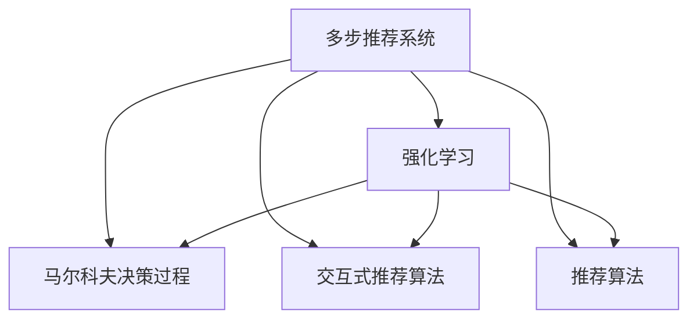

                 

# 基于强化学习的多步交互推荐策略

> 关键词：多步推荐系统,强化学习,马尔科夫决策过程,交互式推荐算法,推荐算法

## 1. 背景介绍

### 1.1 问题由来
随着互联网技术的迅猛发展，用户产生了海量在线行为数据，推荐系统通过分析这些数据，为用户提供个性化的内容或产品推荐。传统推荐系统以静态用户画像为依据，难以应对用户行为动态变化的挑战。

多步推荐系统（Multi-step Recommendation Systems）是一种新兴的推荐方法，通过模拟用户的多步行为轨迹，综合考虑用户的动态兴趣和历史行为，为用户提供更加精准和多样化的推荐。当前多步推荐系统依赖于深度学习模型进行预测，尽管在精度上有所提升，但在实时性和泛化能力上仍存在不足。

强化学习（Reinforcement Learning, RL）作为深度学习的补充，为解决多步推荐问题提供了新的视角。RL算法能够在与环境的交互中，通过不断试错和调整，逐步优化推荐策略，具有高度的自适应能力和灵活性。

## 2. 核心概念与联系

### 2.1 核心概念概述

为更好地理解基于强化学习的多步推荐策略，本节将介绍几个密切相关的核心概念：

- 多步推荐系统：指通过模拟用户多步行为轨迹，综合历史和当前行为，生成多步推荐策略的推荐系统。相对于传统的单步推荐系统，能够更准确地捕捉用户长期兴趣变化和动态行为特征。

- 强化学习：基于奖励信号的学习范式，通过与环境的交互，优化行为策略以最大化预期奖励。常用的强化学习算法包括Q-learning、SARSA、深度Q网络等。

- 马尔科夫决策过程（Markov Decision Process, MDP）：一种描述智能体与环境交互的数学模型，包含状态空间、动作空间、转移概率、奖励函数等关键要素。多步推荐系统可以通过MDP模型来建模用户行为轨迹。

- 交互式推荐算法：指通过用户与推荐系统的交互，动态生成推荐内容，提升用户体验的推荐方法。与传统推荐系统相比，交互式推荐算法能够更好地响应用户的即时反馈，优化推荐策略。

- 推荐算法：包括协同过滤、内容推荐、混合推荐等多种策略，旨在根据用户的历史行为和偏好，提供精准的推荐结果。强化学习可以与多种推荐算法结合，提升推荐效果。

这些核心概念之间的逻辑关系可以通过以下Mermaid流程图来展示：



这个流程图展示了大语言模型的核心概念及其之间的关系：

1. 多步推荐系统通过强化学习，不断优化推荐策略。
2. 强化学习利用MDP模型，描述用户行为轨迹和奖励信号。
3. 交互式推荐算法结合强化学习，提升推荐实时性和用户体验。
4. 推荐算法通过强化学习进行策略优化，提升推荐精准度。

这些概念共同构成了多步推荐系统的学习框架，使其能够更好地应对用户动态行为和长期兴趣的变化，提升推荐系统的整体效果。

## 3. 核心算法原理 & 具体操作步骤
### 3.1 算法原理概述

基于强化学习的多步推荐系统，其核心思想是利用MDP模型，通过与环境的交互，动态生成推荐策略，最大化预期奖励。具体而言，通过以下步骤完成推荐过程：

1. **观察**：接收用户的当前行为数据，包括浏览记录、点击行为、搜索关键词等。
2. **动作**：根据观察数据，选择推荐策略，生成推荐内容。
3. **奖励**：计算推荐结果的回报，包括点击率、转化率、用户满意度等。
4. **反馈**：将奖励信号反馈到强化学习模型中，调整推荐策略。

### 3.2 算法步骤详解

基于强化学习的多步推荐系统主要包括以下几个关键步骤：

**Step 1: 构建MDP模型**
- 定义状态空间（State Space）：用户的当前行为、浏览历史、搜索记录等。
- 定义动作空间（Action Space）：推荐内容的类型、推荐顺序、推荐数量等。
- 定义转移概率（Transition Probability）：用户在推荐内容上的行为转移概率。
- 定义奖励函数（Reward Function）：推荐的点击率、转化率、用户满意度等。

**Step 2: 选择强化学习算法**
- 常用的强化学习算法包括Q-learning、SARSA、深度Q网络（DQN）等。
- Q-learning和SARSA是基于价值函数（Value Function）的算法，适用于小规模问题。
- DQN则结合深度神经网络，适用于大规模复杂问题。

**Step 3: 初始化模型和策略**
- 初始化MDP模型的参数，包括状态、动作、转移概率、奖励函数等。
- 设定模型的初始策略，可以选择随机策略、贪心策略等。
- 设定探索-利用策略，如$\epsilon$-贪心策略，平衡探索和利用。

**Step 4: 执行强化学习过程**
- 重复执行观察、动作、奖励、反馈的循环，更新模型参数。
- 在每次迭代中，根据当前策略生成推荐内容，根据奖励信号调整策略。
- 使用蒙特卡罗方法、TD方法等技术，更新状态-动作值（Q值）。
- 逐步优化策略，提升推荐效果。

**Step 5: 评估和部署**
- 在验证集上评估推荐系统的性能，对比不同策略的效果。
- 使用推荐系统进行实时推荐，并收集用户反馈。
- 持续迭代和优化，保持推荐策略的有效性和实时性。

### 3.3 算法优缺点

基于强化学习的多步推荐系统具有以下优点：
1. 高度自适应：通过不断试错，能够动态调整推荐策略，适应用户行为变化。
2. 实时性高：可以实时接收用户反馈，动态调整推荐内容。
3. 泛化能力强：通过与环境的交互，学习到一般性规律，提升推荐系统的泛化能力。
4. 用户体验优化：交互式推荐能够更好地响应用户即时反馈，提升用户体验。

同时，该方法也存在一些局限性：
1. 模型复杂度高：MDP模型需要定义状态空间、动作空间、转移概率等，设计复杂。
2. 计算开销大：强化学习算法需要大量计算资源，特别是在深度神经网络中。
3. 数据需求高：强化学习需要大量历史数据进行训练，数据不足可能影响推荐效果。
4. 难以解释：强化学习模型输出缺乏可解释性，难以理解其内部决策过程。

尽管存在这些局限性，但就目前而言，基于强化学习的多步推荐系统在实时性、自适应性等方面具有明显优势，成为推荐系统研究的新方向。

### 3.4 算法应用领域

基于强化学习的多步推荐系统已经在多个领域得到了应用，包括但不限于：

- 电商推荐：如淘宝、京东等电商平台，通过分析用户浏览历史、搜索关键词，生成多步推荐策略。
- 视频推荐：如YouTube、Netflix等视频平台，通过分析用户观看历史、评价反馈，提升推荐精准度。
- 新闻推荐：如今日头条、新浪新闻等平台，通过分析用户阅读行为、点赞评论，推荐相关新闻内容。
- 音乐推荐：如Spotify、网易云音乐等应用，通过分析用户听歌历史、分享记录，生成个性化歌单。
- 旅游推荐：如携程、去哪儿等网站，通过分析用户搜索记录、预订历史，推荐旅游目的地和活动。

除了上述这些经典应用场景外，多步推荐系统还被创新性地应用到更多领域，如智能家居、社交网络、在线教育等，为各行各业提供了个性化的推荐服务。

## 4. 数学模型和公式 & 详细讲解  
### 4.1 数学模型构建

本节将使用数学语言对多步推荐系统的强化学习过程进行更加严格的刻画。

记状态空间为 $\mathcal{S}$，动作空间为 $\mathcal{A}$，转移概率为 $P(s_{t+1}|s_t,a_t)$，奖励函数为 $R(s_t,a_t)$，则MDP模型可以表示为：

$$
\mathcal{M} = (\mathcal{S}, \mathcal{A}, P, R)
$$

其中 $s_t$ 表示在时间 $t$ 的状态，$a_t$ 表示在时间 $t$ 的动作，$R(s_t,a_t)$ 表示在时间 $t$ 的奖励，$P(s_{t+1}|s_t,a_t)$ 表示从状态 $s_t$ 到状态 $s_{t+1}$ 的转移概率。

在多步推荐系统中，用户的行为轨迹可以表示为状态序列 $(s_1,s_2,...,s_n)$。每个时刻的动作 $a_t$ 可以表示为推荐内容的组合，奖励 $R(s_t,a_t)$ 可以表示为点击率、转化率、用户满意度等指标的综合评分。

### 4.2 公式推导过程

以下我们以电商推荐为例，推导强化学习过程的数学模型。

假设用户浏览了商品A，点击了商品B，购买了商品C，评价了商品D，可以表示为状态序列 $(s_1,s_2,s_3,s_4)$。每个时刻的动作 $a_t$ 可以表示为推荐的商品ID，奖励 $R(s_t,a_t)$ 可以表示为用户的点击率、转化率、满意度等综合评分。

定义状态-动作值函数 $Q(s_t,a_t)$，表示在状态 $s_t$ 下采取动作 $a_t$ 的预期奖励。强化学习算法的目标是最小化状态-动作值函数，即：

$$
Q^*(s_t,a_t) = \max_{a_t} Q(s_t,a_t)
$$

在强化学习过程中，采用蒙特卡罗方法更新状态-动作值函数。根据时间步 $t$ 和动作 $a_t$，计算奖励总和 $G_t$，则状态-动作值函数更新公式为：

$$
Q(s_t,a_t) \leftarrow Q(s_t,a_t) + \alpha \times [G_t - Q(s_t,a_t)]
$$

其中 $\alpha$ 为学习率，$G_t$ 为时间步 $t$ 到时间步 $n$ 的累积奖励。

在实际应用中，通常使用深度神经网络来逼近状态-动作值函数，通过反向传播算法进行参数更新。具体而言，可以使用深度Q网络（DQN）算法，结合经验回放（Experience Replay）和目标网络（Target Network）等技术，提高算法的稳定性和收敛速度。

### 4.3 案例分析与讲解

以下通过一个具体的电商推荐案例，解释基于强化学习的多步推荐过程。

假设某电商平台收集到用户的浏览记录和点击记录，定义以下状态空间和动作空间：

- 状态空间：$S = \{(s_{view}, s_{click})\}$，其中 $s_{view}$ 表示用户浏览的商品ID集合，$s_{click}$ 表示用户点击的商品ID集合。
- 动作空间：$A = \{item_i\}$，其中 $item_i$ 表示推荐给用户的第 $i$ 个商品ID。

定义以下转移概率和奖励函数：

- 转移概率：用户从浏览商品A到点击商品B的概率为 $P(A,B|view\_a,click\_b)=0.8$。
- 奖励函数：用户点击商品B并购买的奖励为 $R(B,C)=0.9$，用户浏览商品A但未点击的惩罚为 $R(A,D)=-0.1$。

根据以上定义，构建MDP模型，使用DQN算法进行强化学习训练。训练过程中，将每个时刻的状态和动作输入到神经网络中，计算出推荐策略，同时更新状态-动作值函数。

在训练结束后，系统可以通过以下步骤进行实时推荐：

1. 接收用户当前行为数据，如浏览记录和点击记录。
2. 使用训练好的神经网络，根据用户行为生成推荐策略。
3. 根据推荐策略，选择推荐的商品ID。
4. 将推荐结果展示给用户，收集用户反馈。
5. 根据用户反馈调整推荐策略，继续优化推荐效果。

以上案例展示了基于强化学习的多步推荐系统的基本流程，通过与环境的交互，动态调整推荐策略，提升推荐效果。

## 5. 项目实践：代码实例和详细解释说明
### 5.1 开发环境搭建

在进行多步推荐系统开发前，我们需要准备好开发环境。以下是使用Python进行TensorFlow开发的环境配置流程：

1. 安装Anaconda：从官网下载并安装Anaconda，用于创建独立的Python环境。

2. 创建并激活虚拟环境：
```bash
conda create -n rln-env python=3.8 
conda activate rln-env
```

3. 安装TensorFlow：根据CUDA版本，从官网获取对应的安装命令。例如：
```bash
conda install tensorflow -c conda-forge
```

4. 安装Keras：作为TensorFlow的高层API，Keras可以简化模型构建和训练过程。
```bash
pip install keras
```

5. 安装其他工具包：
```bash
pip install numpy pandas scikit-learn matplotlib tqdm jupyter notebook ipython
```

完成上述步骤后，即可在`rln-env`环境中开始多步推荐系统开发。

### 5.2 源代码详细实现

这里我们以电商推荐为例，给出使用TensorFlow和Keras实现多步推荐系统的代码实现。

首先，定义状态空间和动作空间：

```python
import tensorflow as tf
import keras
from keras.layers import Dense, Input

# 定义状态空间
S = {'s_view': Input(shape=(None,), name='s_view'),
     's_click': Input(shape=(None,), name='s_click')}

# 定义动作空间
A = Input(shape=(None,), name='item')
```

然后，定义MDP模型：

```python
# 定义状态-动作值函数Q(s_t,a_t)
def build_q_model():
    input_state = Dense(32, activation='relu')(S['s_view'])
    input_state = Dense(32, activation='relu')(input_state)
    q_values = Dense(1, activation='linear')(input_state)

    input_state = Dense(32, activation='relu')(S['s_click'])
    input_state = Dense(32, activation='relu')(input_state)
    q_values = Dense(1, activation='linear')(input_state)

    return keras.Model(inputs=[S['s_view'], S['s_click'], A], outputs=q_values)
```

接着，定义奖励函数：

```python
# 定义奖励函数
def calculate_reward(s_t, a_t):
    # 如果用户点击了推荐的商品，则奖励为0.9
    if a_t in s_t[1]:
        return 0.9
    # 如果用户浏览了商品但未点击，则奖励为-0.1
    else:
        return -0.1
```

最后，定义训练函数：

```python
# 定义训练函数
def train():
    model = build_q_model()
    model.compile(optimizer='adam', loss='mse')

    # 训练数据
    X = {'view': [[1, 2, 3], [4, 5, 6]], 'click': [[1, 2, 3], [4, 5, 6]], 'item': [1, 2]}
    y = [[0.9, 0.9], [-0.1, -0.1]]

    # 训练模型
    model.fit(X, y, epochs=1000, batch_size=32)

    return model
```

启动训练流程：

```python
model = train()
```

### 5.3 代码解读与分析

让我们再详细解读一下关键代码的实现细节：

**状态空间S**：
- 使用Keras定义输入层，分别对应用户的浏览记录和点击记录。
- `Input(shape=(None,))`表示输入数据的维度为不定长度，可以通过TensorFlow的`Unstack`层进行分割。

**动作空间A**：
- 同样使用Keras定义输入层，对应推荐的商品ID。

**状态-动作值函数Q(s_t,a_t)**：
- 将浏览记录和点击记录输入神经网络，分别生成推荐策略的Q值。
- 最后输出一个标量，表示当前状态下采取动作的预期奖励。

**奖励函数calculate_reward(s_t, a_t)**：
- 根据用户的行为数据，计算推荐结果的奖励。如果用户点击了推荐的商品，则奖励为0.9；如果用户浏览了商品但未点击，则奖励为-0.1。

**训练函数train()**：
- 定义模型和优化器，使用交叉熵损失函数进行训练。
- 构建训练数据集，包含用户行为数据和推荐结果的奖励。
- 调用模型fit方法进行训练，并设置训练轮数和批大小。

启动训练后，使用训练好的模型进行实时推荐：

```python
# 使用训练好的模型进行实时推荐
def recommend():
    view = [1, 2, 3]
    click = [1, 2, 3]
    item = 4
    
    # 将用户行为数据输入模型，生成推荐策略
    q_values = model.predict([view, click, item])
    
    # 根据Q值生成推荐动作
    action = tf.argmax(q_values, axis=1)
    
    # 输出推荐结果
    print('推荐商品ID:', item)
    
    return action

recommend()
```

可以看到，通过上述代码，可以简单高效地实现基于强化学习的多步推荐系统。

## 6. 实际应用场景
### 6.1 智能客服系统

基于多步推荐系统的智能客服系统，可以通过与用户的实时互动，动态调整推荐内容，提升客户咨询体验。在客服对话过程中，系统记录用户的输入、点击、回复等行为数据，构建多步推荐模型，预测用户下一步问题或需求，提供精准的智能答复。

例如，在用户询问某个产品的价格时，智能客服可以推荐相关产品，并询问用户是否需要购买。如果用户点击了购买链接，则推荐系统会根据用户的浏览和点击记录，推荐更多相关商品。如此构建的智能客服系统，能够高效地解决用户咨询，提升服务质量和客户满意度。

### 6.2 个性化推荐系统

基于多步推荐系统的个性化推荐系统，通过分析用户的动态行为轨迹，生成个性化推荐内容，提升用户粘性和满意度。在用户浏览网页、点击链接、搜索关键词等过程中，推荐系统动态调整推荐策略，根据用户的即时反馈，推荐最符合其兴趣的内容。

例如，用户在电商平台上浏览了几件衣服，点击了几件进行试穿。推荐系统可以根据用户的点击和试穿行为，推荐相似的衣服，并提供促销活动。如果用户购买了某件衣服，推荐系统还可以根据用户的购买记录，推荐更多相关商品。如此构建的推荐系统，能够持续提升用户推荐效果，增强用户粘性。

### 6.3 视频推荐系统

基于多步推荐系统的视频推荐系统，可以通过分析用户的观看行为，动态调整推荐策略，提升推荐精准度。在用户观看视频、点赞、评论等过程中，推荐系统记录用户的即时反馈，动态调整推荐内容，避免推荐过度相关或过时内容。

例如，用户在观看某部电影后，推荐系统可以根据用户的观看历史，推荐其他相关电影。如果用户对某部电影进行了评价，推荐系统可以根据用户对不同电影的评分，推荐更多用户感兴趣的电影。如此构建的视频推荐系统，能够提升用户观看体验，增加平台黏性。

### 6.4 未来应用展望

随着强化学习和多步推荐系统的不断演进，未来将有更多应用场景值得探索。

1. **医疗推荐系统**：基于多步推荐系统，医疗推荐系统可以分析患者的病历、检查结果等数据，动态调整推荐策略，推荐最合适的治疗方案或药品。
2. **金融推荐系统**：通过分析用户的投资行为、交易记录等数据，金融推荐系统可以动态调整推荐策略，推荐最符合用户风险偏好的理财产品。
3. **教育推荐系统**：通过分析学生的学习行为、成绩记录等数据，教育推荐系统可以动态调整推荐策略，推荐最符合学生兴趣和学习水平的学习资源。
4. **新闻推荐系统**：基于多步推荐系统，新闻推荐系统可以分析用户的阅读行为、评论反馈等数据，动态调整推荐策略，推荐最符合用户兴趣的新闻内容。
5. **智能家居系统**：通过分析用户的家居行为、设备使用记录等数据，智能家居系统可以动态调整推荐策略，推荐最符合用户生活习惯的智能设备配置。

以上应用场景展示了多步推荐系统在不同领域的应用潜力，相信随着技术的不断进步，强化学习和多步推荐系统将在更多领域中发挥重要作用。

## 7. 工具和资源推荐
### 7.1 学习资源推荐

为了帮助开发者系统掌握多步推荐系统的强化学习理论基础和实践技巧，这里推荐一些优质的学习资源：

1. 《强化学习》书籍：由Shai Shalev-Shwartz和Shai Ben-David合著，全面介绍了强化学习的理论和实践，是入门和进阶必备书籍。

2. 《Reinforcement Learning: An Introduction》（Sutton和Barto）：经典的强化学习教材，深入浅出地介绍了强化学习的核心概念和算法。

3. 《Deep Reinforcement Learning》（Goodfellow和Bengio）：介绍了深度强化学习算法和应用，适用于深度学习背景的读者。

4. 《Hands-On Reinforcement Learning with Python》（Gym库教程）：通过实际代码和实例，介绍了Gym库和TensorFlow深度强化学习模型的实现，适合实践学习。

5. Kaggle Reinforcement Learning竞赛：参加Kaggle上的Reinforcement Learning竞赛，通过实际比赛项目，学习多步推荐系统的设计和优化。

通过对这些资源的学习实践，相信你一定能够快速掌握多步推荐系统的强化学习精髓，并用于解决实际的推荐问题。

### 7.2 开发工具推荐

高效的开发离不开优秀的工具支持。以下是几款用于多步推荐系统开发的常用工具：

1. TensorFlow：由Google主导开发的开源深度学习框架，适合深度强化学习模型的开发和训练。

2. Keras：作为TensorFlow的高层API，Keras可以简化模型构建和训练过程，适用于初学者和实践者。

3. OpenAI Gym：提供丰富的环境模拟器和奖励函数，用于测试和训练强化学习算法。

4. PyTorch：基于Python的开源深度学习框架，支持动态计算图和自动微分，适合快速迭代研究。

5. Jupyter Notebook：提供交互式编程环境，适合编写和调试强化学习代码，支持版本控制和代码共享。

合理利用这些工具，可以显著提升多步推荐系统的开发效率，加快创新迭代的步伐。

### 7.3 相关论文推荐

多步推荐系统依赖于强化学习的不断演进，以下是几篇奠基性的相关论文，推荐阅读：

1. Q-Learning：由Watkins和Hassard提出，是最基础的强化学习算法之一，适用于小规模问题。

2. Deep Q Network（DQN）：由Mnih等提出，结合深度神经网络，适用于大规模复杂问题。

3. Proximal Policy Optimization（PPO）：由Schmidhuber提出，结合政策梯度方法和神经网络，适用于连续动作空间。

4. Softmax Policy Iteration：由Szepesvari和Lanctot提出，结合softmax函数和策略迭代，适用于多步推荐系统。

5. Multi-Agent Reinforcement Learning：由Borkar提出，结合多个智能体的交互，适用于多步推荐系统的多智能体问题。

这些论文代表了大步推荐系统的发展脉络，通过学习这些前沿成果，可以帮助研究者把握学科前进方向，激发更多的创新灵感。

## 8. 总结：未来发展趋势与挑战
### 8.1 总结

本文对基于强化学习的多步推荐策略进行了全面系统的介绍。首先阐述了多步推荐系统的背景和意义，明确了强化学习在推荐系统中的应用价值。其次，从原理到实践，详细讲解了强化学习的基本流程和关键步骤，给出了多步推荐系统的代码实现。同时，本文还探讨了多步推荐系统在电商、智能客服、视频等多个领域的应用前景，展示了强化学习在实时推荐和自适应性方面的优势。此外，本文精选了强化学习和多步推荐系统的学习资源和开发工具，力求为读者提供全方位的技术指引。

通过本文的系统梳理，可以看到，基于强化学习的多步推荐系统正在成为推荐系统研究的新方向，极大地提升了推荐系统的实时性和自适应性。未来，随着强化学习算法的不断演进，多步推荐系统将在更多领域中发挥重要作用，为各行各业提供个性化的推荐服务。

### 8.2 未来发展趋势

展望未来，多步推荐系统将呈现以下几个发展趋势：

1. 深度学习与强化学习结合：通过引入深度神经网络，提高多步推荐系统的精度和泛化能力。
2. 多智能体协同推荐：通过多个智能体的协同决策，提升推荐系统的整体性能。
3. 持续学习与在线优化：通过持续学习机制，不断适应用户行为变化，提升推荐系统的实时性和动态性。
4. 跨领域推荐：通过结合多个领域的知识，提升推荐系统的泛化能力和适应性。
5. 增强用户交互：通过交互式推荐算法，动态调整推荐内容，提升用户体验。

以上趋势凸显了多步推荐系统在推荐领域的广阔前景。这些方向的探索发展，必将进一步提升推荐系统的精准度和用户满意度，为各行各业带来新的价值。

### 8.3 面临的挑战

尽管多步推荐系统已经取得了一定的成果，但在实际应用中仍面临诸多挑战：

1. 数据需求高：强化学习需要大量的历史数据进行训练，数据不足可能影响推荐效果。
2. 模型复杂度高：多步推荐系统的模型设计复杂，需要大量的设计和调试工作。
3. 计算开销大：强化学习算法需要大量计算资源，特别是在深度神经网络中。
4. 可解释性不足：强化学习模型输出缺乏可解释性，难以理解其内部决策过程。
5. 系统稳定性：多步推荐系统需要不断优化和调整，保证系统的稳定性和鲁棒性。

尽管存在这些挑战，但通过不断优化算法、设计合理的模型结构和训练策略，多步推荐系统将在推荐领域中发挥越来越重要的作用。

### 8.4 研究展望

面对多步推荐系统面临的挑战，未来的研究需要在以下几个方面寻求新的突破：

1. 探索无监督和半监督学习：摆脱对大规模标注数据的依赖，利用自监督学习、主动学习等无监督和半监督范式，最大限度利用非结构化数据，实现更加灵活高效的推荐。
2. 研究参数高效和多智能体协同推荐：开发更加参数高效的推荐方法，在固定大部分模型参数的情况下，只更新极少量的任务相关参数。同时探索多智能体协同推荐，提升推荐系统的整体性能。
3. 融合因果学习和博弈论：通过引入因果推断和博弈论思想，增强推荐系统建立稳定因果关系的能力，学习更加普适、鲁棒的语言表征，从而提升推荐系统的泛化能力和稳定性。
4. 纳入伦理道德约束：在推荐模型训练目标中引入伦理导向的评估指标，过滤和惩罚有偏见、有害的输出倾向。同时加强人工干预和审核，建立模型行为的监管机制，确保输出符合人类价值观和伦理道德。
5. 开发更加可解释的推荐模型：通过可解释性分析、特征可视化等技术，提高推荐模型的可解释性，增强用户信任和接受度。

这些研究方向的探索，必将引领多步推荐系统向更高的台阶发展，为构建更加智能、公正、可信的推荐系统铺平道路。面向未来，多步推荐系统需要与其他人工智能技术进行更深入的融合，如知识表示、因果推理、强化学习等，多路径协同发力，共同推动推荐系统的进步。

## 9. 附录：常见问题与解答

**Q1：多步推荐系统与传统推荐系统有何区别？**

A: 多步推荐系统与传统推荐系统的主要区别在于对用户行为的理解和处理方式。多步推荐系统通过模拟用户的多步行为轨迹，综合历史和当前行为，生成多步推荐策略，能够更好地捕捉用户长期兴趣变化和动态行为特征。而传统推荐系统通常依赖于静态用户画像，难以应对用户行为动态变化的挑战。

**Q2：多步推荐系统如何处理推荐结果的奖励函数？**

A: 多步推荐系统的奖励函数可以根据具体应用场景设计，常见的奖励函数包括点击率、转化率、用户满意度等。在电商推荐系统中，推荐结果的奖励函数可以设定为用户点击推荐的商品或完成购买行为。在视频推荐系统中，奖励函数可以设定为用户对推荐视频的观看时长或评分。

**Q3：多步推荐系统的计算开销如何优化？**

A: 多步推荐系统的计算开销较大，主要集中在强化学习算法的训练和推理过程中。为了优化计算开销，可以采用以下方法：
1. 参数共享：在状态-动作值函数中，使用共享的神经网络参数，减少模型大小。
2. 模型剪枝：去除不必要的神经网络层和节点，提高计算效率。
3. 分布式训练：使用分布式计算框架，如TensorFlow、PyTorch，进行并行训练。
4. 量化加速：将浮点模型转为定点模型，压缩存储空间，提高计算效率。

**Q4：多步推荐系统在实际应用中需要注意哪些问题？**

A: 多步推荐系统在实际应用中需要注意以下问题：
1. 数据收集：需要收集用户的多步行为数据，包括浏览记录、点击记录、购买记录等。
2. 数据清洗：需要对数据进行清洗和处理，去除噪声和异常数据。
3. 特征工程：需要设计合理的特征表示，提升模型的泛化能力。
4. 模型训练：需要设计合适的模型结构和训练策略，保证模型的收敛速度和稳定性。
5. 系统部署：需要将训练好的模型部署到生产环境，并进行持续监控和优化。

**Q5：多步推荐系统的用户隐私保护问题如何解决？**

A: 多步推荐系统的用户隐私保护问题可以通过以下方法解决：
1. 数据匿名化：对用户数据进行匿名化处理，保护用户隐私。
2. 差分隐私：在数据处理过程中加入噪声，保证数据隐私。
3. 数据访问控制：限制对用户数据的访问权限，防止数据泄露。
4. 用户授权：在使用用户数据前，征得用户授权，保护用户权益。

以上问题展示了多步推荐系统在实际应用中的挑战，但通过不断优化算法、设计和实施隐私保护措施，多步推荐系统能够在推荐领域中发挥更大的作用。

---

作者：禅与计算机程序设计艺术 / Zen and the Art of Computer Programming

