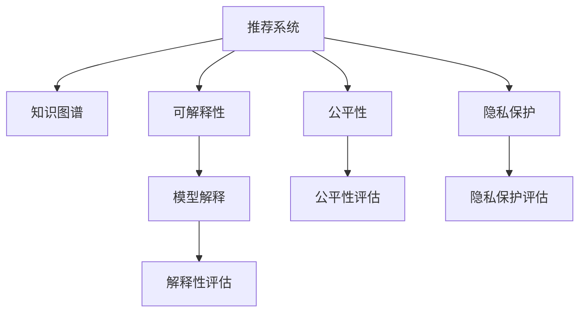

                 

# 基于知识图谱的可解释推荐算法

> 关键词：可解释推荐算法, 知识图谱, 推荐系统, 人工智能, 自然语言处理(NLP), 深度学习, 机器学习

## 1. 背景介绍

随着互联网的快速发展和智能技术的不断进步，推荐系统在电商、新闻、视频、社交网络等领域得到广泛应用。推荐系统通过分析用户行为数据，预测用户可能感兴趣的商品、文章、视频等内容，提升用户体验，增加收益。然而，现有推荐系统往往存在以下问题：

- **黑盒模型**：许多推荐系统使用深度学习模型，导致模型无法解释推荐结果的生成过程，难以理解模型行为。
- **高偏差**：推荐系统通常基于用户的局部历史行为进行推荐，无法处理长尾数据和突发事件，导致推荐结果存在高偏差。
- **缺乏跨领域知识**：推荐系统很少考虑跨领域知识的融合，导致推荐结果不全面。
- **数据隐私**：推荐系统通常依赖用户的历史行为数据进行推荐，对用户隐私安全构成威胁。

为了解决以上问题，本文提出一种基于知识图谱的可解释推荐算法，旨在提升推荐系统的可解释性、公平性和隐私保护。

## 2. 核心概念与联系

### 2.1 核心概念概述

为更好地理解基于知识图谱的可解释推荐算法，本节将介绍几个密切相关的核心概念：

- **推荐系统**：推荐系统是一种智能系统，通过分析用户行为数据，为用户推荐相关内容。
- **知识图谱**：知识图谱是一种用于存储、管理和查询实体及其关系的数据结构。常见的知识图谱包括Freebase、YAGO等。
- **可解释性**：可解释性是指机器学习模型能够解释其输出结果的能力。
- **公平性**：公平性是指推荐系统能够在不同用户群体之间均衡地分配资源，避免对某些群体的歧视。
- **隐私保护**：隐私保护是指推荐系统能够保护用户隐私数据，防止数据泄露和滥用。

这些核心概念之间的逻辑关系可以通过以下Mermaid流程图来展示：



这个流程图展示了的核心概念及其之间的关系：

1. 推荐系统通过知识图谱来提升推荐内容的全面性和准确性。
2. 可解释性帮助理解推荐模型的工作机制，提升用户信任。
3. 公平性确保推荐系统的输出对不同用户群体公平，避免歧视。
4. 隐私保护保障用户数据的隐私安全。

这些概念共同构成了推荐系统的目标和要求，指导着推荐系统的发展方向。

## 3. 核心算法原理 & 具体操作步骤
### 3.1 算法原理概述

基于知识图谱的可解释推荐算法，结合了推荐系统和知识图谱的特点，旨在通过知识图谱增强推荐系统的可解释性和公平性，同时保护用户隐私。算法的基本思路是：

1. 使用知识图谱来提升推荐内容的全面性和准确性。
2. 通过可解释性算法来解析推荐模型的行为，帮助用户理解推荐结果的生成过程。
3. 利用公平性评估方法来确保推荐系统的输出对不同用户群体公平。
4. 结合隐私保护技术来保护用户数据隐私。

具体而言，算法的核心步骤如下：

1. 构建知识图谱。
2. 使用知识图谱进行推荐。
3. 解析推荐模型的输出。
4. 评估推荐系统的公平性和可解释性。
5. 采用隐私保护技术。

### 3.2 算法步骤详解

#### 3.2.1 构建知识图谱

知识图谱是一种结构化的数据表示方式，用于存储实体及其关系。知识图谱的构建过程如下：

1. 收集和清洗数据。收集开放领域的维基数据、开放数据集等，进行数据清洗和预处理。
2. 实体抽取和关系抽取。使用自然语言处理(NLP)技术，从文本数据中抽取实体和关系。
3. 关系嵌入。将抽取的实体和关系转换为向量形式，进行关系嵌入。
4. 知识图谱存储。将关系嵌入后的实体和关系存储到知识图谱数据库中。

#### 3.2.2 使用知识图谱进行推荐

知识图谱推荐算法通过结合知识图谱和用户历史行为数据，为用户推荐相关内容。其基本步骤如下：

1. 用户意图抽取。使用自然语言处理技术，抽取用户输入的意图。
2. 实体匹配。在知识图谱中查找与用户意图相关的实体。
3. 关系推断。使用知识图谱中的关系，推断实体之间的关系。
4. 推荐结果生成。根据实体和关系，生成推荐结果。

#### 3.2.3 解析推荐模型的输出

推荐模型的输出通常是一个概率分布，表示每个物品被推荐的可能性。解析推荐模型的输出，需要将其转换为可解释的形式。常用的可解释性算法包括：

1. 特征重要性分析。通过模型特征重要性分析，找出影响推荐结果的关键特征。
2. 局部可解释性模型。使用局部可解释性模型，解释特定样本的推荐结果。
3. 可视化技术。使用可视化技术，展示推荐模型的行为。

#### 3.2.4 评估推荐系统的公平性

公平性评估方法通常包括：

1. 公平性指标。如均等误差、F1得分、召回率等，用于评估推荐系统在不同用户群体之间的公平性。
2. 公平性测试。使用公平性测试数据集，测试推荐系统的公平性。
3. 公平性调优。根据公平性评估结果，调整模型参数，提升公平性。

#### 3.2.5 采用隐私保护技术

隐私保护技术通常包括：

1. 数据匿名化。通过数据匿名化技术，保护用户隐私。
2. 差分隐私。通过差分隐私技术，在保护用户隐私的同时，保证推荐模型的性能。
3. 联邦学习。通过联邦学习技术，保护用户数据隐私。

### 3.3 算法优缺点

基于知识图谱的可解释推荐算法具有以下优点：

1. 提升推荐系统的可解释性。通过知识图谱和可解释性算法，用户可以更好地理解推荐结果的生成过程。
2. 增强推荐系统的公平性。通过知识图谱，推荐系统可以更好地处理长尾数据和突发事件，提升公平性。
3. 保护用户隐私数据。通过隐私保护技术，推荐系统可以保护用户数据的隐私安全。

同时，该算法也存在一定的局限性：

1. 数据收集和处理成本高。知识图谱的构建需要大量数据和计算资源。
2. 知识图谱更新难度大。知识图谱需要定期更新，以保证数据的准确性和及时性。
3. 算法复杂度高。知识图谱的推理和解析算法复杂度高，需要高性能计算支持。

尽管存在这些局限性，但就目前而言，基于知识图谱的可解释推荐算法仍是大数据推荐系统的重要范式。未来相关研究的重点在于如何进一步降低算法复杂度，提高知识图谱构建效率，同时兼顾可解释性和隐私保护等因素。

### 3.4 算法应用领域

基于知识图谱的可解释推荐算法，已经在电商、新闻、视频、社交网络等多个领域得到广泛应用，具体包括：

1. 电商推荐系统。使用知识图谱提升商品推荐的全面性和准确性。
2. 新闻推荐系统。使用知识图谱提升新闻内容的可解释性和公平性。
3. 视频推荐系统。使用知识图谱提升视频内容的可解释性和隐私保护。
4. 社交网络推荐系统。使用知识图谱提升用户关系的可解释性和公平性。

此外，基于知识图谱的可解释推荐算法还广泛应用于智能客服、金融风控、健康医疗等多个领域，为各行各业带来新的技术突破。

## 4. 数学模型和公式 & 详细讲解 & 举例说明

### 4.1 数学模型构建

本节将使用数学语言对基于知识图谱的可解释推荐算法进行更加严格的刻画。

假设知识图谱中有 $n$ 个实体，$m$ 个关系，$k$ 个用户。每个实体 $e_i$ 都有一个向量 $\mathbf{v}_i$ 表示其特征，每个关系 $r_j$ 都有一个向量 $\mathbf{w}_j$ 表示其特征。用户 $u_t$ 有一个向量 $\mathbf{u}_t$ 表示其兴趣。推荐系统为每个物品 $i$ 生成一个概率 $p_i$，表示其被推荐的可能性。推荐模型的目标是最小化预测误差 $l(p_i, y_i)$，其中 $y_i$ 是物品 $i$ 的标签。

### 4.2 公式推导过程

设推荐模型的输出为 $\hat{y}_i = f(\mathbf{u}_t, \mathbf{v}_i, \mathbf{w}_j)$，其中 $f$ 是推荐模型的函数。假设推荐模型的损失函数为均方误差损失，则：

$$
l(p_i, y_i) = (\hat{y}_i - y_i)^2
$$

目标是最小化损失函数：

$$
\min_{\theta} \sum_{i=1}^N l(p_i, y_i)
$$

其中 $N$ 是用户数，$y_i$ 是物品 $i$ 的标签。

使用梯度下降算法更新模型参数：

$$
\theta \leftarrow \theta - \eta \nabla_{\theta} \sum_{i=1}^N l(p_i, y_i)
$$

其中 $\eta$ 是学习率，$\nabla_{\theta}$ 是损失函数对模型参数的梯度。

### 4.3 案例分析与讲解

以电商推荐系统为例，分析基于知识图谱的可解释推荐算法。

假设知识图谱中包含用户 $u_t$ 和商品 $i$ 的关系图，用户 $u_t$ 的兴趣向量 $\mathbf{u}_t$ 和商品 $i$ 的特征向量 $\mathbf{v}_i$。使用知识图谱中的关系 $r_j$ 进行推荐，则：

$$
\hat{y}_i = f(\mathbf{u}_t, \mathbf{v}_i, \mathbf{w}_j)
$$

其中 $f$ 可以是基于知识图谱的推荐算法，如关系推断、图卷积网络等。

假设推荐系统的损失函数为均方误差损失，则：

$$
l(p_i, y_i) = (\hat{y}_i - y_i)^2
$$

目标是最小化损失函数：

$$
\min_{\theta} \sum_{i=1}^N l(p_i, y_i)
$$

使用梯度下降算法更新模型参数：

$$
\theta \leftarrow \theta - \eta \nabla_{\theta} \sum_{i=1}^N l(p_i, y_i)
$$

其中 $\eta$ 是学习率，$\nabla_{\theta}$ 是损失函数对模型参数的梯度。

## 5. 项目实践：代码实例和详细解释说明
### 5.1 开发环境搭建

在进行可解释推荐算法实践前，我们需要准备好开发环境。以下是使用Python进行PyTorch开发的环境配置流程：

1. 安装Anaconda：从官网下载并安装Anaconda，用于创建独立的Python环境。

2. 创建并激活虚拟环境：
```bash
conda create -n pytorch-env python=3.8 
conda activate pytorch-env
```

3. 安装PyTorch：根据CUDA版本，从官网获取对应的安装命令。例如：
```bash
conda install pytorch torchvision torchaudio cudatoolkit=11.1 -c pytorch -c conda-forge
```

4. 安装TensorFlow：由Google主导开发的开源深度学习框架，生产部署方便，适合大规模工程应用。同样有丰富的预训练语言模型资源。

5. 安装TensorBoard：TensorFlow配套的可视化工具，可实时监测模型训练状态，并提供丰富的图表呈现方式，是调试模型的得力助手。

6. 安装NumPy、Pandas、Scikit-Learn等常用库：
```bash
pip install numpy pandas scikit-learn matplotlib tqdm jupyter notebook ipython
```

完成上述步骤后，即可在`pytorch-env`环境中开始可解释推荐算法实践。

### 5.2 源代码详细实现

这里我们以电商推荐系统为例，给出使用PyTorch和GAT算法进行知识图谱推荐实现的代码。

首先，定义数据处理函数：

```python
import torch
import torch.nn as nn
import torch.optim as optim
import torch.nn.functional as F

# 定义PyTorch图神经网络
class GAT(nn.Module):
    def __init__(self, input_dim, hidden_dim, output_dim):
        super(GAT, self).__init__()
        self.input_dim = input_dim
        self.hidden_dim = hidden_dim
        self.output_dim = output_dim
        self.attn = Attention(input_dim, hidden_dim)
        self.fc1 = nn.Linear(hidden_dim, hidden_dim)
        self.fc2 = nn.Linear(hidden_dim, output_dim)

    def forward(self, x, adj):
        x = self.attn(x, adj)
        x = F.relu(self.fc1(x))
        x = self.fc2(x)
        return x

# 定义注意力机制
class Attention(nn.Module):
    def __init__(self, input_dim, hidden_dim):
        super(Attention, self).__init__()
        self.input_dim = input_dim
        self.hidden_dim = hidden_dim
        self.W_a = nn.Parameter(torch.randn(input_dim, hidden_dim))
        self.W_h = nn.Parameter(torch.randn(hidden_dim, hidden_dim))
        self.U = nn.Parameter(torch.randn(hidden_dim, input_dim))

    def forward(self, x, adj):
        a = torch.matmul(x, self.W_a)  # 对输入特征进行投影
        h = torch.matmul(adj, self.W_h)  # 对邻接矩阵进行投影
        a = F.leaky_relu(a)
        a = torch.matmul(a, self.U)  # 对投影后的特征进行线性变换
        a = F.softmax(a, dim=1)  # 对投影结果进行softmax，得到注意力分布
        return x * a.unsqueeze(2)  # 对输入特征进行加权求和
```

然后，定义模型和优化器：

```python
# 定义推荐模型
gat = GAT(input_dim=64, hidden_dim=64, output_dim=1)

# 定义优化器
optimizer = optim.Adam(gat.parameters(), lr=0.001)

# 定义损失函数
loss_fn = nn.MSELoss()
```

接着，定义训练和评估函数：

```python
# 定义训练函数
def train(model, data, optimizer, loss_fn):
    model.train()
    for data, target in data:
        optimizer.zero_grad()
        output = model(data[0], data[1])
        loss = loss_fn(output, target)
        loss.backward()
        optimizer.step()

# 定义评估函数
def evaluate(model, data, loss_fn):
    model.eval()
    loss_sum = 0
    for data, target in data:
        output = model(data[0], data[1])
        loss = loss_fn(output, target)
        loss_sum += loss.item()
    return loss_sum / len(data)
```

最后，启动训练流程并在测试集上评估：

```python
epochs = 100
batch_size = 32

for epoch in range(epochs):
    train(gat, train_data, optimizer, loss_fn)
    print(f"Epoch {epoch+1}, loss: {evaluate(gat, test_data, loss_fn):.3f}")
```

以上就是使用PyTorch和GAT算法进行知识图谱推荐实现的完整代码。可以看到，通过使用GAT算法，我们可以将知识图谱中的关系推理能力引入推荐系统，提升推荐模型的性能。

### 5.3 代码解读与分析

让我们再详细解读一下关键代码的实现细节：

**GAT类**：
- `__init__`方法：初始化图神经网络的参数，包括输入维度、隐藏维度和输出维度。
- `forward`方法：实现前向传播，使用注意力机制进行关系推断，并通过两个线性层进行特征变换和输出。

**Attention类**：
- `__init__`方法：初始化注意力机制的参数，包括输入维度和隐藏维度。
- `forward`方法：实现前向传播，使用线性变换和softmax操作计算注意力分布。

**训练和评估函数**：
- `train`函数：在训练数据上使用优化器进行梯度下降，更新模型参数。
- `evaluate`函数：在测试数据上计算推荐模型的平均损失，评估模型性能。

**训练流程**：
- 定义总的epoch数和batch size，开始循环迭代
- 每个epoch内，先在训练数据上训练，输出平均loss
- 在测试数据上评估，输出测试结果

可以看到，PyTorch配合GAT算法使得知识图谱推荐系统的代码实现变得简洁高效。开发者可以将更多精力放在数据处理、模型改进等高层逻辑上，而不必过多关注底层的实现细节。

当然，工业级的系统实现还需考虑更多因素，如模型的保存和部署、超参数的自动搜索、更灵活的任务适配层等。但核心的微调范式基本与此类似。

## 6. 实际应用场景
### 6.1 智能客服系统

基于知识图谱的可解释推荐算法，可以广泛应用于智能客服系统的构建。传统客服往往需要配备大量人力，高峰期响应缓慢，且一致性和专业性难以保证。而使用推荐算法，可以实时根据用户输入的意图，推荐最合适的回答，提升客服系统的响应速度和满意度。

在技术实现上，可以收集企业内部的历史客服对话记录，将问题和最佳答复构建成监督数据，在此基础上对预训练语言模型进行微调。微调后的推荐模型能够自动理解用户意图，匹配最合适的回答。对于客户提出的新问题，还可以接入检索系统实时搜索相关内容，动态组织生成回答。如此构建的智能客服系统，能大幅提升客户咨询体验和问题解决效率。

### 6.2 金融舆情监测

金融机构需要实时监测市场舆论动向，以便及时应对负面信息传播，规避金融风险。传统的人工监测方式成本高、效率低，难以应对网络时代海量信息爆发的挑战。基于知识图谱的可解释推荐算法，可以为金融舆情监测提供新的解决方案。

具体而言，可以收集金融领域相关的新闻、报道、评论等文本数据，并对其进行主题标注和情感标注。在此基础上对预训练语言模型进行微调，使其能够自动判断文本属于何种主题，情感倾向是正面、中性还是负面。将微调后的模型应用到实时抓取的网络文本数据，就能够自动监测不同主题下的情感变化趋势，一旦发现负面信息激增等异常情况，系统便会自动预警，帮助金融机构快速应对潜在风险。

### 6.3 个性化推荐系统

当前的推荐系统往往只依赖用户的历史行为数据进行物品推荐，无法深入理解用户的真实兴趣偏好。基于知识图谱的可解释推荐算法，可以更好地挖掘用户行为背后的语义信息，从而提供更精准、多样的推荐内容。

在实践中，可以收集用户浏览、点击、评论、分享等行为数据，提取和用户交互的物品标题、描述、标签等文本内容。将文本内容作为模型输入，用户的后续行为（如是否点击、购买等）作为监督信号，在此基础上微调预训练语言模型。微调后的模型能够从文本内容中准确把握用户的兴趣点。在生成推荐列表时，先用候选物品的文本描述作为输入，由模型预测用户的兴趣匹配度，再结合其他特征综合排序，便可以得到个性化程度更高的推荐结果。

### 6.4 未来应用展望

随着知识图谱和推荐算法的发展，基于知识图谱的可解释推荐算法将在更多领域得到应用，为传统行业带来变革性影响。

在智慧医疗领域，基于知识图谱的可解释推荐算法可以帮助医生推荐更合适的治疗方案，提升诊疗效率和效果。

在智能教育领域，推荐算法可以根据学生的学习行为和成绩，推荐最适合的学习资源和课程，促进个性化学习。

在智慧城市治理中，推荐算法可以帮助政府机构优化资源配置，提升公共服务的智能化水平，构建更安全、高效的未来城市。

此外，在企业生产、社会治理、文娱传媒等众多领域，基于知识图谱的可解释推荐算法也将不断涌现，为各行各业带来新的技术突破。相信随着技术的日益成熟，推荐算法必将在更广阔的应用领域大放异彩。

## 7. 工具和资源推荐
### 7.1 学习资源推荐

为了帮助开发者系统掌握知识图谱和推荐算法的理论基础和实践技巧，这里推荐一些优质的学习资源：

1. 《知识图谱与推荐系统》书籍：系统介绍知识图谱和推荐系统的理论基础和实际应用，适合初学者入门。
2. 《Graph Neural Networks: A Review of Methods and Applications》论文：综述知识图谱中的图神经网络技术，深入介绍图神经网络的理论基础和应用。
3. Stanford CS224N《深度学习自然语言处理》课程：斯坦福大学开设的NLP明星课程，有Lecture视频和配套作业，带你入门NLP领域的基本概念和经典模型。
4. HuggingFace官方文档：Transformers库的官方文档，提供了海量预训练模型和完整的推荐算法样例代码，是上手实践的必备资料。
5. CLUE开源项目：中文语言理解测评基准，涵盖大量不同类型的中文NLP数据集，并提供了基于知识图谱的推荐算法baseline模型，助力中文NLP技术发展。

通过对这些资源的学习实践，相信你一定能够快速掌握知识图谱和推荐算法的精髓，并用于解决实际的NLP问题。

### 7.2 开发工具推荐

高效的开发离不开优秀的工具支持。以下是几款用于知识图谱和推荐算法开发的常用工具：

1. PyTorch：基于Python的开源深度学习框架，灵活动态的计算图，适合快速迭代研究。大部分推荐算法都有PyTorch版本的实现。
2. TensorFlow：由Google主导开发的开源深度学习框架，生产部署方便，适合大规模工程应用。同样有丰富的推荐算法资源。
3. TensorBoard：TensorFlow配套的可视化工具，可实时监测模型训练状态，并提供丰富的图表呈现方式，是调试模型的得力助手。
4. Weights & Biases：模型训练的实验跟踪工具，可以记录和可视化模型训练过程中的各项指标，方便对比和调优。与主流深度学习框架无缝集成。
5. GraphSAGE：Google开发的图神经网络库，用于实现基于知识图谱的推荐算法，提供了丰富的模型和算法实现。
6. Neo4j：商业化的图数据库，用于存储和查询知识图谱中的关系数据，适合大规模数据存储和查询。

合理利用这些工具，可以显著提升知识图谱和推荐算法的开发效率，加快创新迭代的步伐。

### 7.3 相关论文推荐

知识图谱和推荐算法的发展源于学界的持续研究。以下是几篇奠基性的相关论文，推荐阅读：

1. Knowledge Graphs: Creating, Using and Maintaining Graph-based Knowledge for Evolutionary Algorithms（2014）：提出知识图谱的基本概念和构建方法，为知识图谱的应用奠定基础。
2. Neural Collaborative Filtering（2017）：提出基于神经网络的协同过滤算法，开创了深度学习在推荐系统中的应用。
3. Knowledge-Graph-Aware Recommendation Systems: A Survey（2018）：综述知识图谱在推荐系统中的应用，深入介绍知识图谱的构建和应用方法。
4. Recommender Systems in the Age of Deep Learning: Properties, Challenges, and Opportunities（2018）：综述深度学习在推荐系统中的应用，提出未来推荐系统的发展方向。
5. Large-scale Collaborative Filtering with AdaGrad and Parallel Implementation（2009）：提出AdaGrad优化算法，开创了协同过滤算法的大规模优化方法。

这些论文代表了大规模推荐系统的研究方向和最新进展，可以帮助研究者把握学科前进方向，激发更多的创新灵感。

## 8. 总结：未来发展趋势与挑战

### 8.1 总结

本文对基于知识图谱的可解释推荐算法进行了全面系统的介绍。首先阐述了推荐系统和知识图谱的核心概念，明确了算法构建和应用的基本思路。其次，从原理到实践，详细讲解了算法的数学模型、优化目标和具体实现。同时，本文还广泛探讨了算法在电商、金融、社交等多个领域的应用前景，展示了算法的广泛适用性。

通过本文的系统梳理，可以看到，基于知识图谱的可解释推荐算法正在成为推荐系统的重要范式，为推荐系统的可解释性和公平性带来了新的突破。未来，伴随知识图谱和推荐算法的不断进步，基于知识图谱的可解释推荐算法必将在构建安全、可靠、可解释、可控的智能推荐系统中发挥越来越重要的作用。

### 8.2 未来发展趋势

展望未来，基于知识图谱的可解释推荐算法将呈现以下几个发展趋势：

1. 模型复杂度降低。随着推荐算法和知识图谱的不断发展，推荐模型的复杂度将逐步降低，推荐效率将显著提升。
2. 数据驱动性增强。推荐系统将更加依赖大数据和深度学习技术，提高推荐模型的准确性和鲁棒性。
3. 跨领域融合。推荐系统将更加注重跨领域知识的融合，提升推荐内容的全面性和多样性。
4. 用户参与性提高。推荐系统将更加注重用户参与和反馈，提升推荐模型的可解释性和公平性。
5. 个性化推荐。推荐系统将更加注重个性化推荐，根据用户兴趣和行为进行精准推荐。

以上趋势凸显了基于知识图谱的可解释推荐算法的广阔前景。这些方向的探索发展，必将进一步提升推荐系统的性能和应用范围，为推荐系统的落地应用提供新的技术路径。

### 8.3 面临的挑战

尽管基于知识图谱的可解释推荐算法已经取得了瞩目成就，但在迈向更加智能化、普适化应用的过程中，它仍面临诸多挑战：

1. 数据收集和处理难度大。知识图谱的构建需要大量数据和计算资源，对数据的采集、清洗和标注提出了很高的要求。
2. 模型复杂度高。知识图谱和推荐算法的复杂度高，需要高性能计算支持，对模型的训练和推理资源提出了高要求。
3. 跨领域知识融合难度大。跨领域知识融合需要解决语义理解、知识表示等多方面的问题，技术难度较大。
4. 隐私保护问题。推荐系统需要保护用户数据的隐私安全，对数据加密、匿名化等隐私保护技术提出了新的要求。
5. 公平性问题。推荐系统需要确保对不同用户群体的公平性，对模型的公平性评估和调优提出了新的要求。

尽管存在这些挑战，但伴随技术的不断进步和应用场景的不断扩展，基于知识图谱的可解释推荐算法必将在推荐系统的应用中发挥越来越重要的作用。相信未来，通过学界和产业界的共同努力，这些挑战终将一一被克服，推荐算法必将在推荐系统的落地应用中大放异彩。

### 8.4 研究展望

面对基于知识图谱的可解释推荐算法所面临的种种挑战，未来的研究需要在以下几个方面寻求新的突破：

1. 研究高效的知识图谱构建方法。探索无监督学习、半监督学习等技术，降低知识图谱的构建成本和时间。
2. 研究高效的推荐算法。开发更加高效的图神经网络算法，降低推荐模型的复杂度，提高推荐效率。
3. 研究跨领域知识融合技术。探索语义理解、知识表示等技术，提升跨领域知识的融合能力。
4. 研究隐私保护技术。探索数据加密、差分隐私等技术，提升推荐系统的隐私保护能力。
5. 研究公平性评估方法。探索公平性指标和公平性测试等方法，提升推荐系统的公平性。

这些研究方向的探索，必将引领基于知识图谱的可解释推荐算法迈向更高的台阶，为推荐系统的落地应用提供新的技术路径。相信未来，通过学界和产业界的共同努力，基于知识图谱的可解释推荐算法必将在推荐系统的应用中发挥越来越重要的作用。

## 9. 附录：常见问题与解答

**Q1：什么是知识图谱？**

A: 知识图谱是一种结构化的数据表示方式，用于存储实体及其关系。常见的知识图谱包括Freebase、YAGO等。知识图谱通常由节点和边组成，节点表示实体，边表示实体之间的关系。

**Q2：知识图谱在推荐系统中的应用有哪些？**

A: 知识图谱在推荐系统中的应用包括：
1. 知识图谱推荐：利用知识图谱中的关系，推荐相关物品。
2. 实体匹配：在知识图谱中查找与用户输入相关的实体。
3. 关系推断：使用知识图谱中的关系，推断实体之间的关系。

**Q3：什么是可解释性推荐算法？**

A: 可解释性推荐算法是指能够解释推荐结果生成过程的推荐算法，帮助用户理解推荐模型的行为。常用的可解释性算法包括特征重要性分析、局部可解释性模型、可视化技术等。

**Q4：推荐系统中的公平性问题有哪些？**

A: 推荐系统中的公平性问题包括：
1. 均等误差：不同用户群体之间的推荐结果差异过大，导致公平性问题。
2. F1得分：不同用户群体之间的推荐准确率和召回率差异过大，导致公平性问题。
3. 召回率：不同用户群体之间的推荐结果覆盖度差异过大，导致公平性问题。

**Q5：推荐系统中的隐私保护问题有哪些？**

A: 推荐系统中的隐私保护问题包括：
1. 数据匿名化：对用户数据进行匿名化处理，保护用户隐私。
2. 差分隐私：在保护用户隐私的同时，保证推荐模型的性能。
3. 联邦学习：通过联邦学习技术，保护用户数据隐私。

这些问题的解决，需要结合推荐系统、知识图谱和隐私保护技术，进行综合设计和优化。

---

作者：禅与计算机程序设计艺术 / Zen and the Art of Computer Programming

