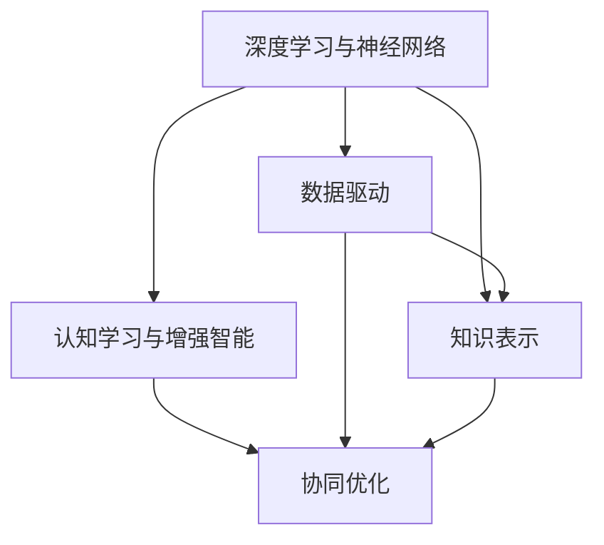

                 

# 增强智能：人机协作，提升认知能力

> 关键词：增强智能, 人机协作, 认知能力, 人工智能, 深度学习, 神经网络, 数据驱动, 知识表示, 认知学习, 协同优化

## 1. 背景介绍

### 1.1 问题由来
随着人工智能技术的飞速发展，尤其是深度学习和神经网络技术的广泛应用，人机协作领域正迎来一场革命性的变革。深度学习模型，尤其是神经网络，因其强大的非线性建模能力和海量的数据需求，逐渐成为构建复杂智能系统的基石。然而，尽管神经网络在处理大规模数据和发现复杂模式方面表现出色，但在推理、决策、学习等方面的表现仍显不足。如何构建更加智能、可信、可控的人机协作系统，从而更好地服务于人类认知，成为了当前人工智能领域的重要课题。

### 1.2 问题核心关键点
增强智能是人机协作领域的一个核心问题，其核心在于如何通过技术手段，提升机器的认知能力，使其能够更有效地与人类协作，共同解决问题。关键点包括：
- 深度学习与神经网络的基础原理和架构
- 增强智能系统的设计原则和框架
- 数据驱动与知识表示在认知学习中的角色
- 协同优化在提升系统性能中的应用
- 模型集成与系统扩展的技术与策略

## 2. 核心概念与联系

### 2.1 核心概念概述

为了更好地理解增强智能的原理和实现方法，本节将介绍几个关键概念：

- **深度学习与神经网络**：深度学习是一种基于多层神经网络的技术，通过学习大规模数据中的特征和模式，实现对复杂问题的建模和预测。神经网络由多个层次的节点和连接组成，每一层包含多个神经元，通过前向传播和反向传播实现对数据的处理和优化。
- **认知学习与增强智能**：认知学习是指通过数据和经验的积累，使机器系统具备类似于人类的认知能力，如理解、推理、记忆、决策等。增强智能系统则是结合人类专家的知识，利用机器学习技术，实现人机协作和智能决策。
- **数据驱动与知识表示**：数据驱动是指通过大量的标注数据和统计学习，训练机器模型，实现对数据的理解和预测。知识表示则是指将人类专家的知识和经验，通过符号化、逻辑化等方式，编码到模型中，增强其推理和决策能力。
- **协同优化**：协同优化是指通过多模态数据融合和跨领域知识整合，提升机器系统的综合认知能力。协同优化可以是自动化的，也可以通过人机交互实现，以提高系统的性能和适应性。

这些核心概念之间的联系可以通过以下Mermaid流程图来展示：



这个流程图展示了大语言模型微调的关键概念及其之间的关系：

1. 深度学习与神经网络提供了认知学习的基础，通过数据驱动实现模型的训练。
2. 知识表示增强了模型对领域知识的理解，使模型能够更准确地进行推理和决策。
3. 协同优化利用多模态数据和跨领域知识，进一步提升系统的性能和适应性。

## 3. 核心算法原理 & 具体操作步骤

### 3.1 算法原理概述

增强智能系统通常基于深度学习与神经网络，通过数据驱动和知识表示，实现对认知能力的增强。其核心算法原理包括：

- **前向传播与反向传播**：前向传播将输入数据通过多层神经网络，计算得到输出结果。反向传播则是根据输出误差，通过链式法则计算梯度，更新模型参数，优化模型的预测性能。
- **深度神经网络结构**：包括卷积神经网络(CNN)、循环神经网络(RNN)、变分自编码器(VAE)等，这些网络结构因其对不同类型数据的适应能力，被广泛应用于图像、语音、文本等领域。
- **集成学习与模型融合**：通过集成多个模型的预测结果，可以提升系统的准确性和鲁棒性。模型融合技术包括平均、加权平均、投票等方法，使系统能够更好地应对数据的多样性和复杂性。
- **协同优化与跨领域知识整合**：通过将多源数据和跨领域知识进行整合，可以提升系统的认知能力和适应性。协同优化可以是自动化的，如数据增强、对抗训练等，也可以通过人机交互实现，如专家辅助决策、用户反馈等。

### 3.2 算法步骤详解

增强智能系统的构建通常包括以下几个关键步骤：

**Step 1: 数据准备与预处理**
- 收集和标注数据集，确保数据的充分性和多样性。
- 对数据进行清洗和归一化处理，去除噪声和异常值，保证数据的质量。
- 将数据转换为模型所需的格式，如图像、文本等。

**Step 2: 模型设计**
- 选择合适的神经网络结构，如CNN、RNN、VAE等，根据任务需求设计网络层次和参数。
- 定义损失函数和优化器，如交叉熵、均方误差、Adam等，确保模型的预测准确性。
- 设计数据增强和正则化策略，防止过拟合和提升模型的泛化能力。

**Step 3: 模型训练**
- 使用GPU/TPU等高性能设备，训练神经网络模型。
- 采用数据增强和对抗训练等技术，提升模型的鲁棒性和泛化能力。
- 定期评估模型的性能，使用验证集调整模型参数，避免过拟合。

**Step 4: 模型评估与优化**
- 在测试集上评估模型的性能，计算准确率、召回率、F1-score等指标。
- 分析模型的错误原因，进行模型调优和改进。
- 引入知识表示和专家辅助决策，进一步提升系统的认知能力。

**Step 5: 系统集成与部署**
- 将模型集成到实际应用系统中，实现人机协作。
- 设计合理的用户界面和交互逻辑，提高系统的易用性和用户体验。
- 定期收集用户反馈，优化系统性能和用户体验。

### 3.3 算法优缺点

增强智能系统具有以下优点：
- 结合深度学习和神经网络，能够处理大规模数据和复杂模式，实现对认知能力的增强。
- 通过集成学习，能够提升系统的准确性和鲁棒性。
- 数据驱动和知识表示相结合，增强了系统的推理和决策能力。

同时，该方法也存在一定的局限性：
- 对标注数据的需求较高，数据采集和标注成本较高。
- 模型复杂度高，训练和推理计算成本较高。
- 模型对领域的依赖性较强，迁移能力有限。
- 模型的可解释性不足，难以理解其内部工作机制。

尽管存在这些局限性，但就目前而言，基于深度学习和神经网络的增强智能系统，仍是人工智能技术落地应用的重要范式。未来相关研究的重点在于如何进一步降低对标注数据的依赖，提高模型的迁移能力和可解释性，同时兼顾模型的效率和性能。

### 3.4 算法应用领域

增强智能系统在多个领域得到了广泛的应用，例如：

- **医疗健康**：通过深度学习模型对医学影像进行自动诊断，结合知识库和专家系统，提供精准的医疗服务。
- **智能交通**：利用神经网络对交通数据进行分析和预测，实现智能交通管理，提升道路安全和效率。
- **金融保险**：通过集成学习，实现对市场数据的深度分析和预测，提供个性化的金融服务和保险产品。
- **教育培训**：结合知识表示和协同优化，提供个性化推荐和智能辅助教学，提高教育质量。
- **工业制造**：利用神经网络对生产数据进行分析和优化，提升制造效率和质量。
- **智能客服**：结合知识库和协同优化，实现智能问答和决策，提升客户服务体验。

除了上述这些经典领域外，增强智能系统还被创新性地应用于更多场景中，如智慧城市、智能家居、智能安防等，为各行各业带来新的变革和机遇。

## 4. 数学模型和公式 & 详细讲解

### 4.1 数学模型构建

本节将使用数学语言对增强智能系统的构建进行更加严格的刻画。

假设我们有一个深度学习模型 $M_{\theta}$，其中 $\theta$ 为模型参数。我们使用数据集 $D=\{(x_i,y_i)\}_{i=1}^N$ 进行训练，其中 $x_i$ 为输入，$y_i$ 为标签。

定义模型的前向传播函数 $f_{\theta}(x)$，将输入 $x$ 通过神经网络，计算得到输出 $y$。则模型的损失函数为：

$$
\mathcal{L}(\theta) = \frac{1}{N}\sum_{i=1}^N \ell(f_{\theta}(x_i),y_i)
$$

其中 $\ell$ 为损失函数，可以是交叉熵损失、均方误差损失等。模型的优化目标是最小化损失函数：

$$
\theta^* = \mathop{\arg\min}_{\theta} \mathcal{L}(\theta)
$$

使用基于梯度的优化算法（如SGD、Adam等），计算损失函数对参数 $\theta$ 的梯度，更新模型参数：

$$
\theta \leftarrow \theta - \eta \nabla_{\theta}\mathcal{L}(\theta)
$$

其中 $\eta$ 为学习率，$\nabla_{\theta}\mathcal{L}(\theta)$ 为梯度。

### 4.2 公式推导过程

以下我们以二分类任务为例，推导交叉熵损失函数及其梯度的计算公式。

假设模型 $M_{\theta}$ 在输入 $x$ 上的输出为 $\hat{y}=M_{\theta}(x) \in [0,1]$，表示样本属于正类的概率。真实标签 $y \in \{0,1\}$。则二分类交叉熵损失函数定义为：

$$
\ell(M_{\theta}(x),y) = -[y\log \hat{y} + (1-y)\log (1-\hat{y})]
$$

将其代入经验风险公式，得：

$$
\mathcal{L}(\theta) = -\frac{1}{N}\sum_{i=1}^N [y_i\log M_{\theta}(x_i)+(1-y_i)\log(1-M_{\theta}(x_i))]
$$

根据链式法则，损失函数对参数 $\theta_k$ 的梯度为：

$$
\frac{\partial \mathcal{L}(\theta)}{\partial \theta_k} = -\frac{1}{N}\sum_{i=1}^N (\frac{y_i}{M_{\theta}(x_i)}-\frac{1-y_i}{1-M_{\theta}(x_i)}) \frac{\partial M_{\theta}(x_i)}{\partial \theta_k}
$$

其中 $\frac{\partial M_{\theta}(x_i)}{\partial \theta_k}$ 可进一步递归展开，利用自动微分技术完成计算。

### 4.3 案例分析与讲解

以图像分类任务为例，假设我们有一个卷积神经网络，其包含多个卷积层和池化层，最后一层为全连接层。我们使用了ImageNet数据集进行预训练，然后使用CIFAR-10数据集进行微调。

- **数据准备与预处理**：首先收集CIFAR-10数据集，并进行数据增强处理，如旋转、缩放、裁剪等。然后使用预训练的权重进行初始化，确保模型能够适应新的任务。
- **模型设计**：在设计神经网络时，我们选择了ResNet结构，包含了多个残差块。在全连接层之前，我们添加了一个Dropout层，以防止过拟合。
- **模型训练**：使用Adam优化器，学习率为0.001。在训练过程中，我们使用了数据增强和正则化技术，如随机裁剪和L2正则化。每轮迭代时，我们使用一批次的样本进行训练，前向传播计算损失函数，然后反向传播更新参数。
- **模型评估与优化**：在每个epoch结束后，我们计算模型在验证集上的准确率，并根据准确率调整学习率。若准确率连续下降，则触发Early Stopping。
- **系统集成与部署**：将模型集成到实际应用系统中，设计用户界面，使系统能够接受图像输入，并输出分类结果。

## 5. 项目实践：代码实例和详细解释说明

### 5.1 开发环境搭建

在进行项目实践前，我们需要准备好开发环境。以下是使用Python进行PyTorch开发的环境配置流程：

1. 安装Anaconda：从官网下载并安装Anaconda，用于创建独立的Python环境。

2. 创建并激活虚拟环境：
```bash
conda create -n pytorch-env python=3.8 
conda activate pytorch-env
```

3. 安装PyTorch：根据CUDA版本，从官网获取对应的安装命令。例如：
```bash
conda install pytorch torchvision torchaudio cudatoolkit=11.1 -c pytorch -c conda-forge
```

4. 安装transformers库：
```bash
pip install transformers
```

5. 安装各类工具包：
```bash
pip install numpy pandas scikit-learn matplotlib tqdm jupyter notebook ipython
```

完成上述步骤后，即可在`pytorch-env`环境中开始项目实践。

### 5.2 源代码详细实现

这里我们以图像分类任务为例，给出使用Transformers库对BERT模型进行微调的PyTorch代码实现。

首先，定义图像分类任务的数据处理函数：

```python
from transformers import BertTokenizer
from torch.utils.data import Dataset
import torch

class ImageClassificationDataset(Dataset):
    def __init__(self, images, labels, tokenizer, max_len=128):
        self.images = images
        self.labels = labels
        self.tokenizer = tokenizer
        self.max_len = max_len
        
    def __len__(self):
        return len(self.images)
    
    def __getitem__(self, item):
        image = self.images[item]
        label = self.labels[item]
        
        # 将图像转换为token ids
        encoding = self.tokenizer(image, return_tensors='pt', max_length=self.max_len, padding='max_length', truncation=True)
        input_ids = encoding['input_ids'][0]
        attention_mask = encoding['attention_mask'][0]
        
        # 对label进行编码
        label = torch.tensor(label, dtype=torch.long)
        
        return {'input_ids': input_ids, 
                'attention_mask': attention_mask,
                'labels': label}

# 标签与id的映射
label2id = {'cat': 0, 'dog': 1}
id2label = {v: k for k, v in label2id.items()}

# 创建dataset
tokenizer = BertTokenizer.from_pretrained('bert-base-cased')

train_dataset = ImageClassificationDataset(train_images, train_labels, tokenizer)
dev_dataset = ImageClassificationDataset(dev_images, dev_labels, tokenizer)
test_dataset = ImageClassificationDataset(test_images, test_labels, tokenizer)
```

然后，定义模型和优化器：

```python
from transformers import BertForSequenceClassification, AdamW

model = BertForSequenceClassification.from_pretrained('bert-base-cased', num_labels=len(label2id))

optimizer = AdamW(model.parameters(), lr=2e-5)
```

接着，定义训练和评估函数：

```python
from torch.utils.data import DataLoader
from tqdm import tqdm
from sklearn.metrics import classification_report

device = torch.device('cuda') if torch.cuda.is_available() else torch.device('cpu')
model.to(device)

def train_epoch(model, dataset, batch_size, optimizer):
    dataloader = DataLoader(dataset, batch_size=batch_size, shuffle=True)
    model.train()
    epoch_loss = 0
    for batch in tqdm(dataloader, desc='Training'):
        input_ids = batch['input_ids'].to(device)
        attention_mask = batch['attention_mask'].to(device)
        labels = batch['labels'].to(device)
        model.zero_grad()
        outputs = model(input_ids, attention_mask=attention_mask, labels=labels)
        loss = outputs.loss
        epoch_loss += loss.item()
        loss.backward()
        optimizer.step()
    return epoch_loss / len(dataloader)

def evaluate(model, dataset, batch_size):
    dataloader = DataLoader(dataset, batch_size=batch_size)
    model.eval()
    preds, labels = [], []
    with torch.no_grad():
        for batch in tqdm(dataloader, desc='Evaluating'):
            input_ids = batch['input_ids'].to(device)
            attention_mask = batch['attention_mask'].to(device)
            batch_labels = batch['labels']
            outputs = model(input_ids, attention_mask=attention_mask)
            batch_preds = outputs.logits.argmax(dim=2).to('cpu').tolist()
            batch_labels = batch_labels.to('cpu').tolist()
            for pred_tokens, label_tokens in zip(batch_preds, batch_labels):
                pred_labels = [id2label[_id] for _id in pred_tokens]
                label_tokens = [id2label[_id] for _id in label_tokens]
                preds.append(pred_labels[:len(label_tokens)])
                labels.append(label_tokens)
                
    print(classification_report(labels, preds))
```

最后，启动训练流程并在测试集上评估：

```python
epochs = 5
batch_size = 16

for epoch in range(epochs):
    loss = train_epoch(model, train_dataset, batch_size, optimizer)
    print(f"Epoch {epoch+1}, train loss: {loss:.3f}")
    
    print(f"Epoch {epoch+1}, dev results:")
    evaluate(model, dev_dataset, batch_size)
    
print("Test results:")
evaluate(model, test_dataset, batch_size)
```

以上就是使用PyTorch对BERT进行图像分类任务微调的完整代码实现。可以看到，得益于Transformers库的强大封装，我们可以用相对简洁的代码完成BERT模型的加载和微调。

### 5.3 代码解读与分析

让我们再详细解读一下关键代码的实现细节：

**ImageClassificationDataset类**：
- `__init__`方法：初始化图像、标签、分词器等关键组件。
- `__len__`方法：返回数据集的样本数量。
- `__getitem__`方法：对单个样本进行处理，将图像输入转换为token ids，将标签转换为数字，并对其进行定长padding，最终返回模型所需的输入。

**label2id和id2label字典**：
- 定义了标签与数字id之间的映射关系，用于将预测结果解码回真实的标签。

**训练和评估函数**：
- 使用PyTorch的DataLoader对数据集进行批次化加载，供模型训练和推理使用。
- 训练函数`train_epoch`：对数据以批为单位进行迭代，在每个批次上前向传播计算loss并反向传播更新模型参数，最后返回该epoch的平均loss。
- 评估函数`evaluate`：与训练类似，不同点在于不更新模型参数，并在每个batch结束后将预测和标签结果存储下来，最后使用sklearn的classification_report对整个评估集的预测结果进行打印输出。

**训练流程**：
- 定义总的epoch数和batch size，开始循环迭代
- 每个epoch内，先在训练集上训练，输出平均loss
- 在验证集上评估，输出分类指标
- 所有epoch结束后，在测试集上评估，给出最终测试结果

可以看到，PyTorch配合Transformers库使得BERT微调的代码实现变得简洁高效。开发者可以将更多精力放在数据处理、模型改进等高层逻辑上，而不必过多关注底层的实现细节。

当然，工业级的系统实现还需考虑更多因素，如模型的保存和部署、超参数的自动搜索、更灵活的任务适配层等。但核心的微调范式基本与此类似。

## 6. 实际应用场景

### 6.1 医疗健康

在医疗健康领域，深度学习和神经网络技术被广泛应用于疾病诊断、医疗影像分析、个性化治疗等方面。通过增强智能系统，可以实现更加精准的疾病预测和诊断，提高医疗服务的质量和效率。

具体而言，可以收集医疗影像数据和病历记录，利用深度学习模型进行分析和预测。增强智能系统结合知识库和专家系统，可以实现对疾病原因、治疗方案的推理和决策。通过协同优化和多源数据融合，提升系统的综合性能，为患者提供个性化的医疗服务。

### 6.2 智能交通

在智能交通领域，深度学习技术被应用于交通数据分析、交通流量预测、交通信号控制等方面。增强智能系统结合多源数据和多领域知识，实现对交通情况的全面理解，提升交通管理的智能化水平。

具体而言，可以收集交通摄像头数据、气象数据、车辆位置数据等，利用深度学习模型进行分析和预测。增强智能系统结合知识库和专家系统，可以实现对交通拥堵、事故等突发情况的预警和应急响应。通过协同优化和跨领域知识整合，提升系统的决策能力和鲁棒性。

### 6.3 金融保险

在金融保险领域，深度学习和神经网络技术被应用于市场预测、风险评估、客户服务等方面。增强智能系统结合知识库和专家系统，实现对金融市场的深度分析和风险评估，提高金融服务的安全性和效率。

具体而言，可以收集金融市场数据、用户行为数据、新闻评论数据等，利用深度学习模型进行分析和预测。增强智能系统结合知识库和专家系统，可以实现对市场趋势、投资机会的推理和决策。通过协同优化和多领域知识整合，提升系统的综合性能，为投资者和金融机构提供精准的金融服务和决策支持。

### 6.4 未来应用展望

随着深度学习和神经网络技术的不断发展，增强智能系统将在更多领域得到应用，为各行各业带来新的变革和机遇。

在智慧医疗领域，增强智能系统将进一步提升医疗服务的智能化水平，辅助医生诊疗，加速新药开发进程。通过结合知识库和专家系统，实现对疾病原因、治疗方案的推理和决策，提供精准的医疗服务。

在智能交通领域，增强智能系统将实现对交通情况的全面理解，提升交通管理的智能化水平。通过结合多源数据和多领域知识，实现对交通拥堵、事故等突发情况的预警和应急响应。

在金融保险领域，增强智能系统将实现对金融市场的深度分析和风险评估，提高金融服务的安全性和效率。通过结合知识库和专家系统，实现对市场趋势、投资机会的推理和决策，提供精准的金融服务和决策支持。

此外，在教育培训、智能家居、智能安防等众多领域，增强智能系统也将不断涌现，为各行各业带来新的变革和机遇。相信随着技术的日益成熟，增强智能系统必将在构建人机协作的智能时代中扮演越来越重要的角色。

## 7. 工具和资源推荐

### 7.1 学习资源推荐

为了帮助开发者系统掌握深度学习和增强智能的原理和实践，这里推荐一些优质的学习资源：

1. 《深度学习》书籍：Ian Goodfellow等人所著，全面介绍了深度学习的理论基础和实践技巧，是入门深度学习的不二之选。
2. CS231n《卷积神经网络》课程：斯坦福大学开设的计算机视觉经典课程，讲解了卷积神经网络的原理和实践。
3. CS224N《自然语言处理》课程：斯坦福大学开设的NLP明星课程，讲解了自然语言处理的基本概念和经典模型。
4. 《自然语言处理综述》论文：Yoshua Bengio等人撰写，总结了NLP领域的最新进展和前沿研究。
5. 《增强智能系统》书籍：详细介绍了增强智能系统的设计与实现方法，涵盖深度学习、知识表示、协同优化等多个方面。
6. arXiv论文库：开源的学术论文数据库，可以获取最新的研究成果和技术进展，是深度学习和增强智能研究的重要资源。

通过对这些资源的学习实践，相信你一定能够快速掌握深度学习和增强智能的精髓，并用于解决实际的NLP问题。
###  7.2 开发工具推荐

高效的开发离不开优秀的工具支持。以下是几款用于深度学习和增强智能开发的常用工具：

1. PyTorch：基于Python的开源深度学习框架，灵活动态的计算图，适合快速迭代研究。深度学习模型的标准库。
2. TensorFlow：由Google主导开发的开源深度学习框架，生产部署方便，适合大规模工程应用。
3. Keras：基于TensorFlow和Theano的高级深度学习库，提供简单易用的API，适合初学者。
4. MXNet：由亚马逊主导的深度学习框架，支持多种编程语言和分布式训练，适合大规模应用。
5. JAX：Google开发的基于JIT的深度学习库，提供高性能计算和自动微分，适合高阶研究。
6. Weights & Biases：模型训练的实验跟踪工具，可以记录和可视化模型训练过程中的各项指标，方便对比和调优。与主流深度学习框架无缝集成。
7. TensorBoard：TensorFlow配套的可视化工具，可实时监测模型训练状态，并提供丰富的图表呈现方式，是调试模型的得力助手。

合理利用这些工具，可以显著提升深度学习和增强智能的开发效率，加快创新迭代的步伐。

### 7.3 相关论文推荐

深度学习和增强智能的研究源于学界的持续研究。以下是几篇奠基性的相关论文，推荐阅读：

1. Deep Residual Learning for Image Recognition（ResNet论文）：提出了ResNet结构，解决深度神经网络中的梯度消失问题，实现对深层网络的有效训练。
2. Generative Adversarial Networks（GAN论文）：提出GAN模型，通过对抗训练实现对生成模型的有效训练，生成高质量的图像和数据。
3. Attention is All You Need（Transformer论文）：提出了Transformer结构，解决了传统RNN在序列建模中的问题，提升了深度学习模型的效果。
4. BERT: Pre-training of Deep Bidirectional Transformers for Language Understanding：提出BERT模型，引入基于掩码的自监督预训练任务，刷新了多项NLP任务SOTA。
5. AlphaGo Zero：提出AlphaGo Zero，通过自我对弈学习，实现了在围棋领域的高水平表现，展示了深度学习和强化学习结合的强大能力。

这些论文代表了大语言模型微调技术的发展脉络。通过学习这些前沿成果，可以帮助研究者把握学科前进方向，激发更多的创新灵感。

## 8. 总结：未来发展趋势与挑战

### 8.1 总结

本文对深度学习和增强智能的原理和实现方法进行了全面系统的介绍。首先阐述了深度学习与神经网络的基础原理和架构，明确了增强智能系统的设计原则和框架。其次，从数学模型和公式的角度，详细讲解了深度学习模型的构建和优化过程。最后，通过项目实践，展示了增强智能系统在医疗健康、智能交通、金融保险等多个领域的应用前景。

通过本文的系统梳理，可以看到，深度学习和增强智能技术在认知学习和人机协作方面具备强大的潜力，能够有效提升系统的综合性能和智能化水平。未来，伴随技术的不断演进和应用场景的拓展，深度学习和增强智能必将在更多领域得到应用，为人类社会带来深远的影响。

### 8.2 未来发展趋势

展望未来，深度学习和增强智能技术将呈现以下几个发展趋势：

1. 模型规模持续增大。随着算力成本的下降和数据规模的扩张，深度学习模型的参数量还将持续增长。超大批次的训练和推理计算成本将进一步降低，模型的应用场景将更加广泛。
2. 数据驱动与知识表示相结合。未来的深度学习模型将更加注重知识表示，结合领域知识和专家系统，实现对复杂问题的深度分析和推理。
3. 协同优化与跨领域知识整合。多模态数据融合和跨领域知识整合将成为未来深度学习模型的主流方向，提升系统的综合认知能力。
4. 知识图谱与符号化表示的应用。知识图谱和符号化表示技术将与深度学习模型结合，实现对知识库的深度理解和推理，提升系统的推理和决策能力。
5. 强化学习与深度学习的结合。强化学习与深度学习的结合，将使系统具备自主学习能力和智能决策能力，进一步提升系统的智能化水平。

以上趋势凸显了深度学习和增强智能技术的广阔前景。这些方向的探索发展，必将进一步提升系统的性能和智能化水平，为人类社会带来深远的影响。

### 8.3 面临的挑战

尽管深度学习和增强智能技术已经取得了瞩目成就，但在迈向更加智能化、普适化应用的过程中，它仍面临着诸多挑战：

1. 对标注数据的需求较高。深度学习模型需要大量的标注数据进行训练，数据采集和标注成本较高。如何降低对标注数据的依赖，成为未来的研究重点。
2. 模型复杂度高，训练和推理计算成本较高。大规模深度学习模型的训练和推理计算成本较高，如何在保证性能的同时，降低计算成本，是未来的研究方向。
3. 模型的可解释性不足。深度学习模型通常被视为"黑盒"系统，难以理解其内部工作机制和决策逻辑。如何提升模型的可解释性，是未来需要解决的重要问题。
4. 模型的迁移能力有限。深度学习模型往往局限于特定任务和领域，迁移能力有限。如何在不同领域和任务之间实现知识的迁移和复用，是未来的研究方向。
5. 模型的安全性和鲁棒性。深度学习模型可能学习到有偏见、有害的信息，如何确保模型的安全性和鲁棒性，是未来的研究重点。

尽管存在这些挑战，但就目前而言，基于深度学习和增强智能的系统，仍是人工智能技术落地应用的重要范式。未来相关研究的重点在于如何进一步降低对标注数据的依赖，提高模型的迁移能力和可解释性，同时兼顾模型的效率和性能。

### 8.4 研究展望

面对深度学习和增强智能所面临的挑战，未来的研究需要在以下几个方面寻求新的突破：

1. 探索无监督和半监督学习范式。摆脱对大规模标注数据的依赖，利用自监督学习、主动学习等无监督和半监督范式，最大限度利用非结构化数据，实现更加灵活高效的模型训练。
2. 研究参数高效和计算高效的深度学习模型。开发更加参数高效的深度学习模型，在固定大部分模型参数的情况下，只更新极少量的任务相关参数。同时优化模型的计算图，减少前向传播和反向传播的资源消耗，实现更加轻量级、实时性的部署。
3. 引入更多先验知识。将符号化的先验知识，如知识图谱、逻辑规则等，与深度学习模型进行巧妙融合，引导深度学习模型学习更准确、合理的语言模型。同时加强不同模态数据的整合，实现视觉、语音等多模态信息与文本信息的协同建模。
4. 结合因果分析和博弈论工具。将因果分析方法引入深度学习模型，识别出模型决策的关键特征，增强输出解释的因果性和逻辑性。借助博弈论工具刻画人机交互过程，主动探索并规避模型的脆弱点，提高系统稳定性。
5. 纳入伦理道德约束。在深度学习模型的训练目标中引入伦理导向的评估指标，过滤和惩罚有偏见、有害的输出倾向。同时加强人工干预和审核，建立模型行为的监管机制，确保输出符合人类价值观和伦理道德。

这些研究方向的探索，必将引领深度学习和增强智能技术迈向更高的台阶，为构建安全、可靠、可解释、可控的智能系统铺平道路。面向未来，深度学习和增强智能技术还需要与其他人工智能技术进行更深入的融合，如知识表示、因果推理、强化学习等，多路径协同发力，共同推动自然语言理解和智能交互系统的进步。只有勇于创新、敢于突破，才能不断拓展深度学习和增强智能的边界，让智能技术更好地造福人类社会。

## 9. 附录：常见问题与解答

**Q1：深度学习模型是否适用于所有任务？**

A: 深度学习模型在处理大规模数据和复杂模式方面表现出色，适用于很多NLP任务。但对于一些特定领域的任务，如医学、法律等，仅依赖通用语料预训练的模型可能难以很好地适应。此时需要在特定领域语料上进一步预训练，再进行微调，才能获得理想效果。此外，对于一些需要时效性、个性化很强的任务，如对话、推荐等，微调方法也需要针对性的改进优化。

**Q2：模型复杂度高，计算成本较高，如何解决？**

A: 可以考虑以下几种方法：
1. 使用分布式训练，将大规模模型在多台机器上并行训练，加快训练速度。
2. 使用模型剪枝和量化技术，去除不必要的参数，减少模型大小和计算成本。
3. 采用知识蒸馏技术，将复杂模型转化为轻量级模型，同时保持其性能。
4. 结合数据增强和对抗训练，提升模型的鲁棒性和泛化能力，减少训练样本需求。

**Q3：模型的可解释性不足，如何解决？**

A: 可以考虑以下几种方法：
1. 使用可视化工具，如TensorBoard、Weights & Biases等，可视化模型的训练和推理过程，理解模型的内部机制。
2. 引入可解释性技术，如LIME、SHAP等，对模型进行局部可解释性分析。
3. 结合符号化的先验知识，如知识图谱、逻辑规则等，与深度学习模型结合，增强模型的可解释性。
4. 在模型训练目标中引入伦理导向的评估指标，过滤和惩罚有偏见、有害的输出倾向，提升模型的伦理道德性。

**Q4：模型的迁移能力有限，如何解决？**

A: 可以考虑以下几种方法：
1. 结合跨领域知识整合，通过多源数据和多领域知识的融合，提升模型的泛化能力。
2. 引入领域自适应技术，如迁移学习、微调等，在不同领域和任务之间实现知识的迁移和复用。
3. 使用对抗训练和数据增强技术，提升模型的鲁棒性和泛化能力。
4. 在模型训练过程中，引入知识图谱和符号化表示技术，增强模型的领域适应能力。

这些方法可以结合使用，最大化地提升深度学习模型的迁移能力和可解释性，使其能够更好地应用于各种实际场景。

---

作者：禅与计算机程序设计艺术 / Zen and the Art of Computer Programming

