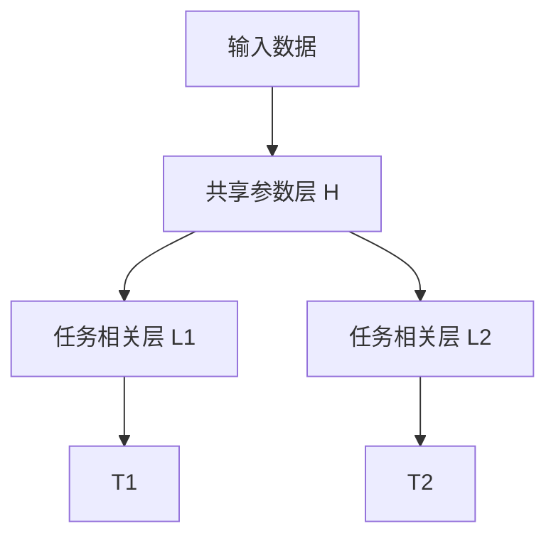

                 

# 多任务学习在NLP中的应用

> 关键词：多任务学习(MTL)，自然语言处理(NLP)，迁移学习，多任务学习损失函数，联合训练，模型压缩，NLP框架

## 1. 背景介绍

### 1.1 问题由来

在自然语言处理(Natural Language Processing, NLP)领域，模型性能的提升依赖于大量的标注数据和计算资源。然而，标注数据的获取往往成本高、周期长，限制了模型的训练与应用。同时，大规模训练对计算资源的消耗也使得模型难以在生产环境中快速部署。

为了解决这些问题，研究人员提出了多任务学习(Multitask Learning, MTL)方法。该方法通过联合训练多个相关任务，共享模型参数，在降低标注成本的同时提升模型性能，更好地利用数据资源。在NLP领域，MTL方法被广泛应用于文本分类、命名实体识别、情感分析、机器翻译等多个任务，显著提高了模型的泛化能力和应用范围。

本文将详细阐述多任务学习在NLP中的应用，包括其核心概念、算法原理、具体操作步骤、数学模型、项目实践、实际应用场景、工具和资源推荐、未来发展趋势与挑战等内容，以期为NLP技术的发展提供全面的理论支持和实践指导。

## 2. 核心概念与联系

### 2.1 核心概念概述

多任务学习（MTL）是一种同时训练多个相关任务的机器学习方法，其核心思想是通过联合优化，共享模型参数，提升模型在不同任务上的性能。相比传统的单任务学习，MTL能够更好地利用数据的多样性和结构性，减少模型对标注数据的依赖，提升模型的泛化能力。

在NLP领域，常见的多任务学习框架包括：
- 联合训练(Joint Training)：将多个任务共同优化，共享参数。
- 多任务特征表示(Multitask Feature Representation)：在模型顶层设计多任务特征提取器，各任务共用底层参数。
- 元学习(Meta-Learning)：训练一个元模型，用于生成多任务学习目标。

这些多任务学习框架通过不同的设计理念和优化方法，提升了模型在多个任务上的性能表现，如图1所示。


```mermaid
graph TB
    A[联合训练(Joint Training)] --> B[多任务特征表示(Multitask Feature Representation)]
    A --> C[元学习(Meta-Learning)]
```

### 2.2 核心概念联系

多任务学习在NLP中的应用，通过共享模型参数，提高了不同任务之间的关联性，使得模型能够更好地利用同一数据源的多样性和结构性。具体来说，MTL在NLP中的应用分为以下几个方面：

- **任务相关性**：将任务进行分类，识别出相关性较高的任务进行联合训练。例如，命名实体识别、情感分析和信息检索是相关性较高的任务，可以联合训练。
- **数据共享**：不同任务之间可以共享训练数据，如命名实体识别和信息检索可以共享文本数据。
- **参数共享**：不同任务之间共享部分或全部模型参数，提升模型的泛化能力和性能。
- **多任务损失函数**：设计合适的多任务损失函数，平衡不同任务的重要性。

## 3. 核心算法原理 & 具体操作步骤

### 3.1 算法原理概述

多任务学习的核心原理是通过联合训练多个相关任务，共享模型参数，提升模型在不同任务上的性能。其算法流程通常包括以下步骤：

1. **数据准备**：收集和准备多个相关任务的数据集，包括标注数据和未标注数据。
2. **模型设计**：选择合适的模型架构，包括多任务特征提取器、共享参数层等。
3. **目标定义**：定义多任务损失函数，衡量模型在不同任务上的性能。
4. **联合训练**：联合训练多个任务，共享模型参数，优化损失函数。
5. **模型评估**：在验证集和测试集上评估模型在不同任务上的性能。

### 3.2 算法步骤详解

#### 3.2.1 数据准备

多任务学习的数据准备主要包括数据收集和数据预处理两方面：

1. **数据收集**：收集与任务相关的数据集，包括标注数据和未标注数据。标注数据用于训练模型，未标注数据用于模型评估和泛化测试。
2. **数据预处理**：将数据集标准化，包括文本清洗、分词、归一化等处理。同时，需要构建数据集的元信息，如任务类型、任务标签等。

#### 3.2.2 模型设计

多任务学习的模型设计主要包括两个方面：
1. **共享层设计**：设计多任务共享的参数层，如Transformer的Attention层、全连接层等。这些共享层用于提取文本的多任务特征，提升模型在不同任务上的性能。
2. **任务相关层设计**：设计每个任务特定的参数层，如分类器、解码器等。这些层用于实现特定任务的目标，如情感分类器、命名实体识别器等。

#### 3.2.3 目标定义

多任务学习的目标定义主要包括以下几个方面：
1. **任务损失函数**：定义每个任务的损失函数，如交叉熵损失、均方误差损失等。
2. **多任务损失函数**：定义多任务损失函数，衡量模型在不同任务上的综合性能。常见的多任务损失函数包括加权平均损失、联合训练损失、共同适应损失等。
3. **任务权重**：根据任务的重要性和难度，设定任务的权重系数，平衡不同任务的重要性。

#### 3.2.4 联合训练

多任务学习的联合训练主要包括以下几个步骤：
1. **前向传播**：将输入数据通过多任务特征提取器，得到多任务的特征表示。
2. **目标计算**：计算每个任务的损失函数，得到每个任务的梯度。
3. **梯度更新**：使用梯度下降等优化算法，更新模型参数。
4. **循环迭代**：重复前向传播、目标计算和梯度更新，直到模型收敛。

#### 3.2.5 模型评估

多任务学习的模型评估主要包括以下几个方面：
1. **验证集评估**：在验证集上评估模型在不同任务上的性能，如准确率、召回率、F1值等。
2. **测试集评估**：在测试集上评估模型在不同任务上的泛化性能，如零样本测试、少样本测试等。
3. **模型比较**：与单任务模型进行比较，评估多任务学习的效果和优势。

### 3.3 算法优缺点

多任务学习的优点包括：
1. **数据共享**：多任务学习可以共享数据，减少标注成本，提升数据利用率。
2. **泛化能力**：多任务学习提升模型在不同任务上的泛化能力，避免过拟合。
3. **性能提升**：多任务学习提升模型在不同任务上的性能，如情感分类、命名实体识别等。

多任务学习的缺点包括：
1. **模型复杂度**：多任务学习增加了模型的复杂度，训练和推理时间较长。
2. **参数竞争**：不同任务之间可能存在参数竞争，影响模型性能。
3. **任务不平衡**：不同任务之间的数据量不平衡，可能导致某些任务被忽视。

### 3.4 算法应用领域

多任务学习在NLP领域的应用非常广泛，覆盖了几乎所有常见任务，例如：

- 文本分类：如情感分析、主题分类、意图识别等。通过联合训练提升模型在不同情感类别上的分类能力。
- 命名实体识别：识别文本中的人名、地名、机构名等特定实体。通过共享特征提取器提升模型对不同实体的识别能力。
- 关系抽取：从文本中抽取实体之间的语义关系。通过联合训练提升模型对不同关系的抽取能力。
- 问答系统：对自然语言问题给出答案。通过共享特征提取器提升模型对不同问题的理解能力。
- 机器翻译：将源语言文本翻译成目标语言。通过联合训练提升模型在不同语言之间的翻译能力。
- 文本摘要：将长文本压缩成简短摘要。通过联合训练提升模型对不同长度的文本压缩能力。
- 对话系统：使机器能够与人自然对话。通过共享特征提取器提升模型对不同对话的理解和生成能力。

## 4. 数学模型和公式 & 详细讲解 & 举例说明

### 4.1 数学模型构建

假设多任务学习模型包括两个任务 $T_1$ 和 $T_2$，分别对应情感分类和命名实体识别。模型由共享参数层 $H$ 和任务相关层 $L_1, L_2$ 组成。其中，共享参数层 $H$ 用于提取多任务的特征表示，任务相关层 $L_1$ 和 $L_2$ 用于实现情感分类和命名实体识别。模型结构如图2所示。




假设任务 $T_1$ 的训练集为 $D_{T_1}$，任务 $T_2$ 的训练集为 $D_{T_2}$。模型在训练集上的损失函数为：

$$
\mathcal{L}(\theta) = \frac{1}{N_{T_1}} \sum_{i=1}^{N_{T_1}} \ell_{T_1}(H(x_i), y_i) + \frac{1}{N_{T_2}} \sum_{i=1}^{N_{T_2}} \ell_{T_2}(H(x_i), y_i)
$$

其中 $\ell_{T_1}, \ell_{T_2}$ 分别为任务 $T_1$ 和 $T_2$ 的损失函数，$x_i$ 为输入样本，$y_i$ 为样本标签。

### 4.2 公式推导过程

以情感分类和命名实体识别为例，推导多任务学习模型的训练过程。

假设模型在输入数据 $x_i$ 上的输出为 $M_{\theta}(x_i) \in [0,1]$，表示样本属于正类的概率。假设任务 $T_1$ 的训练集为 $D_{T_1}=\{(x_i,y_i)\}_{i=1}^{N_{T_1}}$，任务 $T_2$ 的训练集为 $D_{T_2}=\{(x_i,y_i)\}_{i=1}^{N_{T_2}}$。

任务 $T_1$ 的损失函数为二分类交叉熵损失：

$$
\ell_{T_1}(H(x_i), y_i) = -[y_i\log M_{\theta}(x_i) + (1-y_i)\log (1-M_{\theta}(x_i))]
$$

任务 $T_2$ 的损失函数为标签预测损失：

$$
\ell_{T_2}(H(x_i), y_i) = \mathbb{E}_{t \in T_2} [M_{\theta}(t|x_i)]
$$

其中 $t$ 为命名实体标签，$M_{\theta}(t|x_i)$ 为模型在 $x_i$ 上输出 $t$ 的概率。

将以上两个损失函数代入多任务学习模型的总损失函数：

$$
\mathcal{L}(\theta) = \frac{1}{N_{T_1}} \sum_{i=1}^{N_{T_1}} -[y_i\log M_{\theta}(x_i) + (1-y_i)\log (1-M_{\theta}(x_i))] + \frac{1}{N_{T_2}} \sum_{i=1}^{N_{T_2}} \mathbb{E}_{t \in T_2} [M_{\theta}(t|x_i)]
$$

在训练过程中，使用梯度下降等优化算法更新模型参数 $\theta$，最小化损失函数 $\mathcal{L}(\theta)$，使得模型输出逼近真实标签。

### 4.3 案例分析与讲解

以情感分类和命名实体识别为例，分析多任务学习在NLP中的应用。

假设在情感分类任务中，模型输出为二分类概率 $M_{\theta}(x_i) \in [0,1]$，表示样本属于正面情感的概率。在命名实体识别任务中，模型输出为命名实体标签序列 $M_{\theta}(x_i) \in \{B-PER, I-PER, B-ORG, I-ORG, B-LOC, I-LOC\}$，表示文本中包含的人名、地名、机构名等实体。

假设模型在输入 $x_i$ 上的情感分类输出为 $M_{\theta}(x_i) \in [0,1]$，命名实体识别的输出为 $M_{\theta}(x_i) \in \{B-PER, I-PER, B-ORG, I-ORG, B-LOC, I-LOC\}$。通过多任务学习，模型在两个任务上同时进行训练和优化。假设任务 $T_1$ 的训练集为 $D_{T_1}=\{(x_i,y_i)\}_{i=1}^{N_{T_1}}$，任务 $T_2$ 的训练集为 $D_{T_2}=\{(x_i,y_i)\}_{i=1}^{N_{T_2}}$。

在训练过程中，模型在任务 $T_1$ 和 $T_2$ 上的损失函数分别为：

$$
\ell_{T_1}(H(x_i), y_i) = -[y_i\log M_{\theta}(x_i) + (1-y_i)\log (1-M_{\theta}(x_i))]
$$

$$
\ell_{T_2}(H(x_i), y_i) = \mathbb{E}_{t \in T_2} [M_{\theta}(t|x_i)]
$$

通过联合训练，模型在两个任务上都得到优化，能够更好地适应不同的文本数据，提升模型的泛化能力和性能。

## 5. 项目实践：代码实例和详细解释说明

### 5.1 开发环境搭建

在进行多任务学习实践前，我们需要准备好开发环境。以下是使用Python进行PyTorch开发的环境配置流程：

1. 安装Anaconda：从官网下载并安装Anaconda，用于创建独立的Python环境。

2. 创建并激活虚拟环境：
```bash
conda create -n mtl-env python=3.8 
conda activate mtl-env
```

3. 安装PyTorch：根据CUDA版本，从官网获取对应的安装命令。例如：
```bash
conda install pytorch torchvision torchaudio cudatoolkit=11.1 -c pytorch -c conda-forge
```

4. 安装Transformers库：
```bash
pip install transformers
```

5. 安装各类工具包：
```bash
pip install numpy pandas scikit-learn matplotlib tqdm jupyter notebook ipython
```

完成上述步骤后，即可在`mtl-env`环境中开始多任务学习实践。

### 5.2 源代码详细实现

下面我们以情感分类和命名实体识别任务为例，给出使用Transformers库对BERT模型进行多任务学习的PyTorch代码实现。

首先，定义多任务学习的数据处理函数：

```python
from transformers import BertTokenizer
from torch.utils.data import Dataset
import torch

class MTLDataset(Dataset):
    def __init__(self, texts, labels, tokenizer, max_len=128):
        self.texts = texts
        self.labels = labels
        self.tokenizer = tokenizer
        self.max_len = max_len
        
    def __len__(self):
        return len(self.texts)
    
    def __getitem__(self, item):
        text = self.texts[item]
        label = self.labels[item]
        
        encoding = self.tokenizer(text, return_tensors='pt', max_length=self.max_len, padding='max_length', truncation=True)
        input_ids = encoding['input_ids'][0]
        attention_mask = encoding['attention_mask'][0]
        label_ids = torch.tensor(label, dtype=torch.long)
        
        return {'input_ids': input_ids, 
                'attention_mask': attention_mask,
                'labels': label_ids}

# 标签与id的映射
label2id = {'POSITIVE': 1, 'NEGATIVE': 0, 'B-PER': 1, 'I-PER': 2, 'B-ORG': 3, 'I-ORG': 4, 'B-LOC': 5, 'I-LOC': 6}
id2label = {v: k for k, v in label2id.items()}

# 创建dataset
tokenizer = BertTokenizer.from_pretrained('bert-base-cased')

train_dataset = MTLDataset(train_texts, train_labels, tokenizer)
dev_dataset = MTLDataset(dev_texts, dev_labels, tokenizer)
test_dataset = MTLDataset(test_texts, test_labels, tokenizer)
```

然后，定义模型和优化器：

```python
from transformers import BertForTokenClassification, AdamW

model = BertForTokenClassification.from_pretrained('bert-base-cased', num_labels=len(label2id))

optimizer = AdamW(model.parameters(), lr=2e-5)
```

接着，定义训练和评估函数：

```python
from torch.utils.data import DataLoader
from tqdm import tqdm
from sklearn.metrics import classification_report

device = torch.device('cuda') if torch.cuda.is_available() else torch.device('cpu')
model.to(device)

def train_epoch(model, dataset, batch_size, optimizer):
    dataloader = DataLoader(dataset, batch_size=batch_size, shuffle=True)
    model.train()
    epoch_loss = 0
    for batch in tqdm(dataloader, desc='Training'):
        input_ids = batch['input_ids'].to(device)
        attention_mask = batch['attention_mask'].to(device)
        labels = batch['labels'].to(device)
        model.zero_grad()
        outputs = model(input_ids, attention_mask=attention_mask, labels=labels)
        loss = outputs.loss
        epoch_loss += loss.item()
        loss.backward()
        optimizer.step()
    return epoch_loss / len(dataloader)

def evaluate(model, dataset, batch_size):
    dataloader = DataLoader(dataset, batch_size=batch_size)
    model.eval()
    preds, labels = [], []
    with torch.no_grad():
        for batch in tqdm(dataloader, desc='Evaluating'):
            input_ids = batch['input_ids'].to(device)
            attention_mask = batch['attention_mask'].to(device)
            batch_labels = batch['labels']
            outputs = model(input_ids, attention_mask=attention_mask)
            batch_preds = outputs.logits.argmax(dim=2).to('cpu').tolist()
            batch_labels = batch_labels.to('cpu').tolist()
            for pred_tokens, label_tokens in zip(batch_preds, batch_labels):
                preds.append(pred_tokens[:len(label_tokens)])
                labels.append(label_tokens)
                
    print(classification_report(labels, preds))
```

最后，启动训练流程并在测试集上评估：

```python
epochs = 5
batch_size = 16

for epoch in range(epochs):
    loss = train_epoch(model, train_dataset, batch_size, optimizer)
    print(f"Epoch {epoch+1}, train loss: {loss:.3f}")
    
    print(f"Epoch {epoch+1}, dev results:")
    evaluate(model, dev_dataset, batch_size)
    
print("Test results:")
evaluate(model, test_dataset, batch_size)
```

以上就是使用PyTorch对BERT模型进行情感分类和命名实体识别任务多任务学习的完整代码实现。可以看到，得益于Transformers库的强大封装，我们可以用相对简洁的代码完成BERT模型的加载和微调。

### 5.3 代码解读与分析

让我们再详细解读一下关键代码的实现细节：

**MTLDataset类**：
- `__init__`方法：初始化文本、标签、分词器等关键组件。
- `__len__`方法：返回数据集的样本数量。
- `__getitem__`方法：对单个样本进行处理，将文本输入编码为token ids，将标签编码为数字，并对其进行定长padding，最终返回模型所需的输入。

**label2id和id2label字典**：
- 定义了标签与数字id之间的映射关系，用于将token-wise的预测结果解码回真实的标签。

**训练和评估函数**：
- 使用PyTorch的DataLoader对数据集进行批次化加载，供模型训练和推理使用。
- 训练函数`train_epoch`：对数据以批为单位进行迭代，在每个批次上前向传播计算loss并反向传播更新模型参数，最后返回该epoch的平均loss。
- 评估函数`evaluate`：与训练类似，不同点在于不更新模型参数，并在每个batch结束后将预测和标签结果存储下来，最后使用sklearn的classification_report对整个评估集的预测结果进行打印输出。

**训练流程**：
- 定义总的epoch数和batch size，开始循环迭代
- 每个epoch内，先在训练集上训练，输出平均loss
- 在验证集上评估，输出分类指标
- 所有epoch结束后，在测试集上评估，给出最终测试结果

可以看到，PyTorch配合Transformers库使得多任务学习的代码实现变得简洁高效。开发者可以将更多精力放在数据处理、模型改进等高层逻辑上，而不必过多关注底层的实现细节。

当然，工业级的系统实现还需考虑更多因素，如模型的保存和部署、超参数的自动搜索、更灵活的任务适配层等。但核心的多任务学习范式基本与此类似。

## 6. 实际应用场景

### 6.1 智能客服系统

基于多任务学习的多任务学习技术，可以广泛应用于智能客服系统的构建。传统客服往往需要配备大量人力，高峰期响应缓慢，且一致性和专业性难以保证。而使用多任务学习的多任务学习模型，可以7x24小时不间断服务，快速响应客户咨询，用自然流畅的语言解答各类常见问题。

在技术实现上，可以收集企业内部的历史客服对话记录，将问题和最佳答复构建成监督数据，在此基础上对预训练模型进行多任务学习。多任务学习的多任务学习模型能够自动理解用户意图，匹配最合适的答案模板进行回复。对于客户提出的新问题，还可以接入检索系统实时搜索相关内容，动态组织生成回答。如此构建的智能客服系统，能大幅提升客户咨询体验和问题解决效率。

### 6.2 金融舆情监测

金融机构需要实时监测市场舆论动向，以便及时应对负面信息传播，规避金融风险。传统的人工监测方式成本高、效率低，难以应对网络时代海量信息爆发的挑战。基于多任务学习的多任务学习技术，为金融舆情监测提供了新的解决方案。

具体而言，可以收集金融领域相关的新闻、报道、评论等文本数据，并对其进行主题标注和情感标注。在此基础上对预训练语言模型进行多任务学习，使其能够自动判断文本属于何种主题，情感倾向是正面、中性还是负面。将多任务学习的多任务学习模型应用到实时抓取的网络文本数据，就能够自动监测不同主题下的情感变化趋势，一旦发现负面信息激增等异常情况，系统便会自动预警，帮助金融机构快速应对潜在风险。

### 6.3 个性化推荐系统

当前的推荐系统往往只依赖用户的历史行为数据进行物品推荐，无法深入理解用户的真实兴趣偏好。基于多任务学习的多任务学习技术，个性化推荐系统可以更好地挖掘用户行为背后的语义信息，从而提供更精准、多样的推荐内容。

在实践中，可以收集用户浏览、点击、评论、分享等行为数据，提取和用户交互的物品标题、描述、标签等文本内容。将文本内容作为模型输入，用户的后续行为（如是否点击、购买等）作为监督信号，在此基础上对预训练语言模型进行多任务学习。多任务学习的多任务学习模型能够从文本内容中准确把握用户的兴趣点。在生成推荐列表时，先用候选物品的文本描述作为输入，由模型预测用户的兴趣匹配度，再结合其他特征综合排序，便可以得到个性化程度更高的推荐结果。

### 6.4 未来应用展望

随着多任务学习技术的发展，基于多任务学习的NLP应用将在更多领域得到应用，为传统行业带来变革性影响。

在智慧医疗领域，基于多任务学习的多任务学习技术，可以用于构建医学问答系统、病历分析、药物研发等应用，提升医疗服务的智能化水平，辅助医生诊疗，加速新药开发进程。

在智能教育领域，多任务学习的多任务学习技术可应用于作业批改、学情分析、知识推荐等方面，因材施教，促进教育公平，提高教学质量。

在智慧城市治理中，多任务学习的多任务学习技术可以用于城市事件监测、舆情分析、应急指挥等环节，提高城市管理的自动化和智能化水平，构建更安全、高效的未来城市。

此外，在企业生产、社会治理、文娱传媒等众多领域，基于多任务学习的多任务学习技术的应用也将不断涌现，为经济社会发展注入新的动力。相信随着技术的日益成熟，多任务学习范式将成为NLP技术落地应用的重要手段，推动人工智能技术在垂直行业的规模化落地。总之，多任务学习需要开发者根据具体任务，不断迭代和优化模型、数据和算法，方能得到理想的效果。

## 7. 工具和资源推荐
### 7.1 学习资源推荐

为了帮助开发者系统掌握多任务学习在NLP中的应用，这里推荐一些优质的学习资源：

1. 《Multitask Learning in NLP》系列博文：由NLP领域的专家撰写，深入浅出地介绍了多任务学习在NLP中的应用和最新进展。

2. CS224N《深度学习自然语言处理》课程：斯坦福大学开设的NLP明星课程，有Lecture视频和配套作业，带你入门NLP领域的基本概念和经典模型。

3. 《Natural Language Processing with Transformers》书籍：Transformers库的作者所著，全面介绍了如何使用Transformers库进行NLP任务开发，包括多任务学习的范式。

4. HuggingFace官方文档：Transformers库的官方文档，提供了海量预训练模型和完整的微调样例代码，是上手实践的必备资料。

5. CLUE开源项目：中文语言理解测评基准，涵盖大量不同类型的中文NLP数据集，并提供了基于多任务学习的多任务学习模型，助力中文NLP技术发展。

通过对这些资源的学习实践，相信你一定能够快速掌握多任务学习在NLP中的精髓，并用于解决实际的NLP问题。
###  7.2 开发工具推荐

高效的开发离不开优秀的工具支持。以下是几款用于多任务学习开发的常用工具：

1. PyTorch：基于Python的开源深度学习框架，灵活动态的计算图，适合快速迭代研究。大部分预训练语言模型都有PyTorch版本的实现。

2. TensorFlow：由Google主导开发的开源深度学习框架，生产部署方便，适合大规模工程应用。同样有丰富的预训练语言模型资源。

3. Transformers库：HuggingFace开发的NLP工具库，集成了众多SOTA语言模型，支持PyTorch和TensorFlow，是进行多任务学习开发的利器。

4. Weights & Biases：模型训练的实验跟踪工具，可以记录和可视化模型训练过程中的各项指标，方便对比和调优。与主流深度学习框架无缝集成。

5. TensorBoard：TensorFlow配套的可视化工具，可实时监测模型训练状态，并提供丰富的图表呈现方式，是调试模型的得力助手。

6. Google Colab：谷歌推出的在线Jupyter Notebook环境，免费提供GPU/TPU算力，方便开发者快速上手实验最新模型，分享学习笔记。

合理利用这些工具，可以显著提升多任务学习的开发效率，加快创新迭代的步伐。

### 7.3 相关论文推荐

多任务学习在NLP领域的发展源于学界的持续研究。以下是几篇奠基性的相关论文，推荐阅读：

1. "A Neural Probabilistic Logic Net for Multitask Learning"：提出多任务学习的神经网络模型，为多任务学习提供了理论基础。

2. "Training Recurrent Neural Networks with Long-Term Dependencies"：提出LSTM模型，引入多任务学习思想，提升模型的长期记忆能力。

3. "Learning Multitask Prediction with Neural Networks"：提出多任务学习的多任务学习范式，构建多任务神经网络模型。

4. "Multitask Learning"：全面总结了多任务学习的各种方法和技巧，包括联合训练、多任务特征表示等。

5. "A Generalized Multitask Learning Framework for Language Understanding"：提出多任务学习框架，为多任务学习在NLP中的应用提供了广泛思路。

这些论文代表了大语言模型多任务学习的研发历程，通过学习这些前沿成果，可以帮助研究者把握学科前进方向，激发更多的创新灵感。

## 8. 总结：未来发展趋势与挑战

### 8.1 总结

本文对基于多任务学习的多任务学习在NLP中的应用进行了全面系统的介绍。首先阐述了多任务学习在NLP中的应用背景和意义，明确了多任务学习在多任务学习领域中的独特价值。其次，从原理到实践，详细讲解了多任务学习的数学原理和关键步骤，给出了多任务学习任务开发的完整代码实例。同时，本文还广泛探讨了多任务学习在智能客服、金融舆情、个性化推荐等多个行业领域的应用前景，展示了多任务学习范式的巨大潜力。此外，本文精选了多任务学习技术的各类学习资源，力求为读者提供全方位的技术指引。

通过本文的系统梳理，可以看到，基于多任务学习的多任务学习在NLP中的应用，通过联合训练多个相关任务，共享模型参数，显著提升了模型在不同任务上的性能。多任务学习的多任务学习在NLP中的应用前景广阔，其在降低标注成本、提升泛化能力、优化资源利用等方面具有显著优势，为NLP技术的产业化应用提供了有力的保障。未来，伴随多任务学习技术的不懈探索和优化，基于多任务学习的NLP技术必将在更广阔的应用领域发挥重要作用。

### 8.2 未来发展趋势

展望未来，多任务学习在NLP领域的发展将呈现以下几个趋势：

1. **数据增强**：随着多任务学习模型的不断优化，数据增强技术将发挥更大的作用，提升模型的泛化能力和泛化性。

2. **迁移学习**：多任务学习可以与迁移学习相结合，通过多任务学习预训练模型，迁移学习下游任务，进一步提升模型的泛化能力和应用范围。

3. **联邦学习**：多任务学习可以与联邦学习相结合，通过分布式训练和模型更新，提升模型的隐私保护和数据利用效率。

4. **多模态学习**：多任务学习可以与其他多模态学习技术相结合，通过图像、音频等多模态数据联合建模，提升模型的感知能力和理解能力。

5. **自监督学习**：多任务学习可以与自监督学习相结合，通过无监督学习和多任务联合优化，提升模型的自适应能力和泛化能力。

6. **对抗性训练**：多任务学习可以与对抗性训练相结合，通过对抗样本和鲁棒性测试，提升模型的鲁棒性和安全性。

这些趋势凸显了多任务学习在NLP领域的广泛应用和巨大潜力。未来的多任务学习研究将更多地关注模型的泛化能力、隐私保护、自适应能力等方面，提升模型在实际应用中的表现和安全性。

### 8.3 面临的挑战

尽管多任务学习在NLP领域已经取得了显著成果，但在迈向更加智能化、普适化应用的过程中，它仍面临着诸多挑战：

1. **模型复杂度**：多任务学习增加了模型的复杂度，训练和推理时间较长。如何简化模型结构，提升推理速度，优化资源占用，是重要的优化方向。

2. **数据不平衡**：多任务学习中的数据不平衡问题，可能导致某些任务被忽视，影响模型的整体性能。

3. **标注成本**：虽然多任务学习可以共享数据，但标注成本仍然较高。如何降低标注成本，提高数据利用率，是亟待解决的问题。

4. **模型鲁棒性**：多任务学习模型的鲁棒性不足，面对域外数据时，泛化性能往往大打折扣。如何提高模型的鲁棒性，避免灾难性遗忘，还需要更多理论和实践的积累。

5. **模型可解释性**：多任务学习模型通常缺乏可解释性，难以解释其内部工作机制和决策逻辑。如何赋予多任务学习模型更强的可解释性，将是亟待攻克的难题。

6. **安全性和伦理**：多任务学习模型可能学习到有害信息，传递到下游任务，产生误导性、歧视性的输出。如何确保模型输出的安全性，避免恶意用途，还需要加强模型的监管和管理。

面对这些挑战，未来的研究需要在以下几个方面寻求新的突破：

1. **模型压缩和优化**：开发更加轻量级、高效的多任务学习模型，通过模型压缩和优化，提升模型的推理速度和资源利用效率。

2. **数据增强和生成**：开发更加有效的数据增强和生成方法，提升多任务学习模型的泛化能力和泛化性。

3. **多任务联合优化**：探索更加有效的多任务联合优化方法，通过联合训练和对抗训练，提升模型的鲁棒性和泛化能力。

4. **模型可解释性**：引入因果分析和模型解释方法，增强多任务学习模型的可解释性和可理解性。

5. **模型安全和伦理**：引入伦理导向的评估指标，过滤和惩罚有害的输出倾向，确保模型输出的安全性。

6. **多任务联合优化**：开发更加有效的多任务联合优化方法，通过联合训练和对抗训练，提升模型的鲁棒性和泛化能力。

这些研究方向的探索，必将引领多任务学习在NLP领域的发展，为构建安全、可靠、可解释、可控的智能系统铺平道路。面向未来，多任务学习需要与其他人工智能技术进行更深入的融合，如知识表示、因果推理、强化学习等，多路径协同发力，共同推动自然语言理解和智能交互系统的进步。只有勇于创新、敢于突破，才能不断拓展语言模型的边界，让智能技术更好地造福人类社会。

### 8.4 研究展望

未来的多任务学习研究将更多地关注模型的泛化能力、隐私保护、自适应能力等方面，提升模型在实际应用中的表现和安全性。相信随着多任务学习技术的不懈探索和优化，基于多任务学习的NLP技术必将在更广阔的应用领域发挥重要作用。

## 9. 附录：常见问题与解答

**Q1：多任务学习是否可以用于所有NLP任务？**

A: 多任务学习可以用于大多数NLP任务，特别是相关性较高的任务。对于数据量较小且分布不均匀的任务，多任务学习可以更好地利用数据的多样性和结构性，提升模型的泛化能力和性能。然而，对于某些特定任务，如语义角色标注等，多任务学习可能效果不佳。

**Q2：多任务学习是否需要大规模标注数据？**

A: 多任务学习可以通过共享数据和模型参数，降低对标注数据的依赖。然而，标注数据的获取仍然需要投入较大的成本和资源。在实际应用中，可以利用无监督学习和半监督学习方法，进一步降低对标注数据的依赖，提升数据利用效率。

**Q3：多任务学习是否会过拟合？**

A: 多任务学习的多任务学习模型可能会面临过拟合问题。为了缓解过拟合，可以采用正则化技术，如L2正则、Dropout等，同时合理设置任务的权重系数，平衡不同任务的重要性。此外，可以使用数据增强、对抗训练等方法，提升模型的泛化能力和鲁棒性。

**Q4：多任务学习是否可以用于推荐系统？**

A: 多任务学习可以用于推荐系统，通过联合训练推荐模型和用户行为模型，提升推荐系统的性能和个性化程度。推荐模型用于预测用户对物品的偏好，用户行为模型用于建模用户的历史行为和兴趣偏好，两者联合优化，提升推荐系统的效果和用户满意度。

**Q5：多任务学习是否需要复杂的模型结构？**

A: 多任务学习的多任务学习模型可以采用简单的模型结构，如Bert、LSTM等。通过共享参数和联合优化，多任务学习可以显著提升模型在不同任务上的性能，而无需复杂的模型结构。然而，在某些特定任务上，复杂的模型结构可能更为适合，需要根据任务特点进行选择。

**Q6：多任务学习是否需要高昂的计算资源？**

A: 多任务学习的多任务学习模型通常需要较大的计算资源，尤其是在联合训练阶段。为了降低计算成本，可以采用分布式训练、混合精度训练、模型并行等技术，优化模型的训练和推理效率。此外，可以使用GPU、TPU等高性能设备，提升计算速度和模型性能。

**Q7：多任务学习是否存在数据不平衡问题？**

A: 多任务学习的多任务学习模型可能面临数据不平衡问题，即某些任务的数据量远远大于其他任务。为了缓解数据不平衡问题，可以采用重采样技术、加权损失函数等方法，平衡不同任务的重要性，提升模型的泛化能力和性能。

总之，多任务学习在NLP领域具有广泛的应用前景和显著的优势。通过合理设计多任务学习模型和算法，可以有效提升模型的泛化能力和性能，推动NLP技术的进一步发展。

