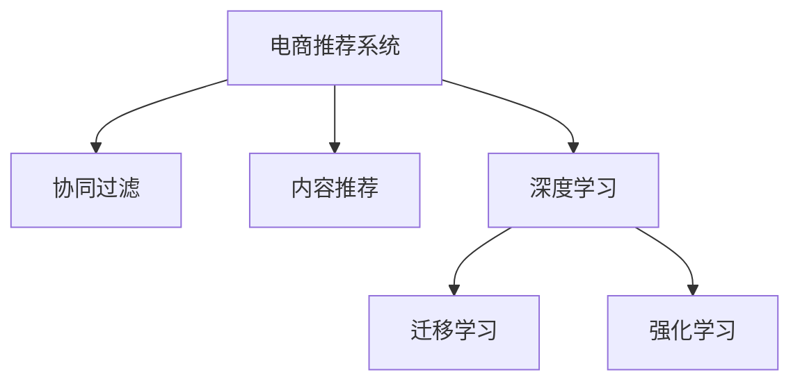
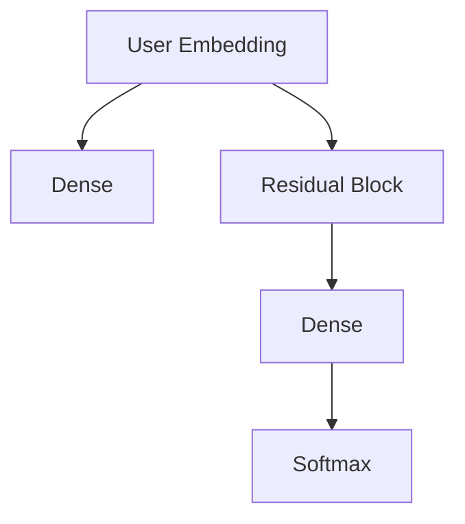

                 

# 大数据与AI 驱动的电商推荐系统：以准确率、多样性与用户体验为目标

> 关键词：大数据, AI驱动, 电商推荐系统, 准确率, 多样性, 用户体验

## 1. 背景介绍

### 1.1 问题由来
在电商行业，个性化推荐系统（Personalized Recommendation System, PRS）已经成为提升用户留存、增加交易转化、优化营销策略的重要工具。随着用户数据量的爆炸式增长，如何高效地利用大数据和人工智能技术，构建高性能、个性化、可扩展的推荐系统，成为业界关注的焦点。

近年来，随着深度学习和大数据技术的飞速发展，基于协同过滤和内容推荐的传统推荐方法逐渐被基于用户行为和商品属性的协同过滤方法所取代。然而，基于这些方法的推荐系统在处理大规模数据时存在效率低、冷启动问题、高维度数据处理困难等问题。而使用深度学习和大数据技术，可以大幅提升推荐系统的准确性和多样性，并带来更好的用户体验。

### 1.2 问题核心关键点
电商推荐系统的主要目标包括：
1. **准确性**：预测用户可能感兴趣的商品，推荐与用户实际购买行为高度一致的商品。
2. **多样性**：在满足用户需求的同时，避免过度拟合用户的历史行为，推荐多种不同的商品，促进用户探索新商品。
3. **用户体验**：提供个性化的推荐结果，帮助用户更快地找到感兴趣的商品，提升用户满意度。

这些目标间存在一定的矛盾：追求高准确性可能导致推荐结果过于集中，忽视了多样性；而过度追求多样性则可能牺牲准确性，导致用户体验下降。如何在大数据和AI技术的驱动下，实现三者的平衡，是电商推荐系统研究的核心挑战。

## 2. 核心概念与联系

### 2.1 核心概念概述

为更好地理解基于大数据和AI的电商推荐系统，本节将介绍几个密切相关的核心概念：

- **电商推荐系统 (e-commerce recommendation system, PRS)**：以电商平台为基础，通过数据分析和AI技术，为用户推荐可能感兴趣的商品的系统。
- **协同过滤 (collaborative filtering, CF)**：利用用户行为和商品之间的相似性，预测用户对商品的兴趣，推荐类似商品。
- **内容推荐 (content-based recommendation, CB)**：根据商品的属性和特征，通过用户已浏览或购买商品的相似性，推荐相关商品。
- **深度学习 (deep learning)**：利用神经网络模型，对大规模数据进行特征提取和模式识别，实现高精度的推荐。
- **迁移学习 (transfer learning)**：将一个领域学到的知识迁移到另一个领域，提升模型的泛化能力。
- **强化学习 (reinforcement learning)**：通过与环境的交互，学习最优的决策策略，优化推荐系统的性能。

这些核心概念之间的逻辑关系可以通过以下Mermaid流程图来展示：



这个流程图展示了大数据与AI驱动的电商推荐系统的主要技术组成：

1. **协同过滤**：利用用户行为和商品之间的相似性进行推荐。
2. **内容推荐**：通过商品属性和特征进行推荐。
3. **深度学习**：基于神经网络模型对用户行为和商品数据进行特征提取和模式识别。
4. **迁移学习**：将其他领域的知识应用于电商推荐，提升模型的泛化能力。
5. **强化学习**：通过与用户互动，优化推荐策略。

## 3. 核心算法原理 & 具体操作步骤

### 3.1 算法原理概述

电商推荐系统基于大数据和AI技术，主要利用协同过滤、内容推荐、深度学习、迁移学习和强化学习等方法，构建高性能的推荐系统。其核心思想是：

1. **协同过滤**：通过用户的历史行为和偏好，预测用户对商品的兴趣，推荐相似商品。
2. **内容推荐**：根据商品的属性和特征，找到与用户历史行为相似的商品，进行推荐。
3. **深度学习**：利用神经网络模型，从用户和商品的多维度数据中提取高层次特征，进行精确的推荐预测。
4. **迁移学习**：利用预训练模型的知识，在电商推荐系统上进行微调，提升推荐效果。
5. **强化学习**：通过与用户交互，不断优化推荐策略，提升用户体验。

基于这些方法，电商推荐系统能够实现高准确性、多样性，并提升用户体验，满足用户个性化需求。

### 3.2 算法步骤详解

电商推荐系统的构建流程一般包括以下几个关键步骤：

**Step 1: 数据采集与预处理**
- 收集用户历史行为数据，如浏览记录、点击记录、购买记录等。
- 收集商品属性数据，如价格、类别、品牌、描述等。
- 进行数据清洗和特征工程，如缺失值处理、特征归一化、特征提取等。

**Step 2: 数据建模**
- 利用协同过滤和内容推荐方法，构建基于用户行为和商品属性的推荐模型。
- 利用深度学习技术，训练神经网络模型，提取用户和商品的特征表示。
- 利用迁移学习技术，在预训练模型上进行微调，提升推荐效果。

**Step 3: 模型训练与优化**
- 使用监督学习或半监督学习方法，对推荐模型进行训练，最小化损失函数。
- 使用正则化、早停等技术，防止过拟合。
- 进行超参数调优，选择合适的模型和算法参数。

**Step 4: 模型评估与迭代**
- 在验证集上评估模型的性能，如准确率、召回率、覆盖率等指标。
- 根据评估结果，优化模型结构或调整训练参数。
- 持续收集用户反馈数据，进行模型迭代和优化。

**Step 5: 部署与应用**
- 将训练好的模型部署到线上环境中，进行实时推荐。
- 监控推荐系统的性能和用户反馈，进行持续优化。
- 定期更新模型和数据，保持推荐系统的稳定和高效。

以上是电商推荐系统的基本流程。在实际应用中，还需要根据具体场景和需求，进行更加精细化的设计和优化。

### 3.3 算法优缺点

基于大数据和AI技术的电商推荐系统具有以下优点：
1. **高准确性**：利用深度学习和大数据技术，能够从多维度数据中提取高层次特征，提升推荐准确性。
2. **多样性**：通过协同过滤和内容推荐方法，推荐多种不同的商品，避免用户陷入过度拟合的局部最优。
3. **用户体验**：个性化推荐满足用户个性化需求，提升用户满意度。

同时，该方法也存在以下局限性：
1. **计算资源消耗大**：深度学习模型训练和推理需要大量计算资源，可能难以处理大规模数据集。
2. **冷启动问题**：新用户或新商品缺乏足够的历史行为数据，推荐效果可能不理想。
3. **数据隐私和安全**：用户行为数据可能涉及隐私，需要严格的数据保护措施。
4. **算法复杂性**：模型训练和优化过程复杂，需要专业的技术和经验。
5. **用户交互限制**：部分推荐算法需要大量用户交互数据，难以在无交互场景下应用。

尽管存在这些局限性，但电商推荐系统依然是大数据与AI驱动的推荐技术的主流方向，广泛应用于电商平台、视频平台、新闻网站等领域。

### 3.4 算法应用领域

基于大数据和AI技术的电商推荐系统在电商、金融、媒体等多个领域得到了广泛应用，覆盖了几乎所有常见任务，例如：

- **电商推荐**：如淘宝、京东等电商平台的个性化推荐，帮助用户发现感兴趣的商品。
- **视频推荐**：如Netflix、YouTube等视频平台，根据用户历史观看记录推荐视频内容。
- **新闻推荐**：如今日头条、人民日报等新闻网站，推荐用户感兴趣的新闻内容。
- **金融推荐**：如支付宝、微信等金融平台，推荐用户感兴趣的投资产品。
- **游戏推荐**：如王者荣耀、英雄联盟等游戏平台，推荐用户感兴趣的游戏内容。

除了上述这些经典任务外，电商推荐系统也被创新性地应用到更多场景中，如可控内容生成、精准广告投放、智慧供应链等，为电商平台带来了全新的业务创新点。

## 4. 数学模型和公式 & 详细讲解 & 举例说明

### 4.1 数学模型构建

电商推荐系统的主要数学模型包括用户-商品协同矩阵、商品属性特征向量、神经网络结构等。

**用户-商品协同矩阵**
假设用户集合为 $U=\{u_1,u_2,\dots,u_M\}$，商品集合为 $I=\{i_1,i_2,\dots,i_N\}$。设用户 $u$ 对商品 $i$ 的评分 $r_{ui}$，可以构建用户-商品协同矩阵 $\mathbf{R} \in \mathbb{R}^{M \times N}$，其中：
$$
R_{ui} = r_{ui}, \text{ if } (u,i) \text{ is in the rating data }
$$
$$
R_{ui} = 0, \text{ otherwise }
$$

**商品属性特征向量**
假设商品 $i$ 有 $K$ 个属性特征 $x_{ik}$，可以构建商品属性特征向量 $\mathbf{X} \in \mathbb{R}^{N \times K}$，其中：
$$
X_{ik} = x_{ik}, \text{ if } (i,k) \text{ is in the item attribute data }
$$
$$
X_{ik} = 0, \text{ otherwise }
$$

**神经网络结构**
假设用户和商品特征映射到 $D$ 维向量空间，构建用户和商品的嵌入向量 $\mathbf{U} \in \mathbb{R}^{M \times D}$ 和 $\mathbf{V} \in \mathbb{R}^{N \times D}$。神经网络结构如图：



其中，$W_1$ 和 $W_2$ 为全连接层，$R$ 为残差连接层，$B$ 为softmax层，用于预测用户对商品的评分。

### 4.2 公式推导过程

以下我们以二分类任务为例，推导深度学习模型的交叉熵损失函数及其梯度的计算公式。

假设用户 $u$ 对商品 $i$ 的评分 $r_{ui}$ 的概率为 $\hat{y}_{ui}$，真实评分 $y_{ui}$ 为 1 表示用户对商品感兴趣，为 0 表示用户对商品不感兴趣。二分类交叉熵损失函数定义为：
$$
\ell(\hat{y}_{ui}, y_{ui}) = -[y_{ui}\log \hat{y}_{ui} + (1-y_{ui})\log(1-\hat{y}_{ui})]
$$

将上述损失函数对 $\hat{y}_{ui}$ 求导，得到梯度为：
$$
\frac{\partial \ell(\hat{y}_{ui}, y_{ui})}{\partial \hat{y}_{ui}} = -\frac{y_{ui}}{\hat{y}_{ui}} - \frac{1-y_{ui}}{1-\hat{y}_{ui}}
$$

使用反向传播算法，将梯度传递回嵌入层 $W_1$ 和 $W_2$，更新模型参数。同时，利用正则化、Dropout 等技术防止过拟合。

### 4.3 案例分析与讲解

假设某电商平台的推荐系统已经收集了 100 万用户的浏览、点击、购买数据，和 200 万商品的描述、类别、价格等属性数据。采用协同过滤和深度学习方法，构建推荐模型。

**协同过滤模型**
假设协同过滤模型为矩阵分解模型，采用矩阵分解技术，将用户-商品协同矩阵 $\mathbf{R}$ 分解为 $\mathbf{U}$ 和 $\mathbf{V}$ 的乘积：
$$
\mathbf{R} \approx \mathbf{U}\mathbf{V}^\top
$$

其中，$\mathbf{U}$ 为 $M \times D$ 的用户嵌入矩阵，$\mathbf{V}$ 为 $N \times D$ 的商品嵌入矩阵。利用矩阵分解模型的对数似然损失函数：
$$
\mathcal{L}(\mathbf{U},\mathbf{V}) = -\frac{1}{M}\sum_{u=1}^{M}\sum_{i=1}^{N}\log \sigma(\mathbf{u}^\top \mathbf{v}_i)
$$

其中，$\sigma$ 为 sigmoid 函数。使用梯度下降算法最小化损失函数，更新 $\mathbf{U}$ 和 $\mathbf{V}$ 的参数。

**深度学习模型**
假设深度学习模型为基于稠密层的神经网络，结构如图：


其中，$W_1$ 和 $W_2$ 为全连接层，$R$ 为残差连接层，$B$ 为softmax层，用于预测用户对商品的评分。

使用均方误差损失函数：
$$
\mathcal{L}(\mathbf{U},\mathbf{V}) = \frac{1}{M}\sum_{u=1}^{M}\sum_{i=1}^{N}(r_{ui} - \hat{y}_{ui})^2
$$

使用 Adam 优化算法最小化损失函数，更新 $\mathbf{U}$ 和 $\mathbf{V}$ 的参数。

## 5. 项目实践：代码实例和详细解释说明

### 5.1 开发环境搭建

在进行电商推荐系统开发前，我们需要准备好开发环境。以下是使用Python进行TensorFlow和Keras开发的环境配置流程：

1. 安装Anaconda：从官网下载并安装Anaconda，用于创建独立的Python环境。

2. 创建并激活虚拟环境：
```bash
conda create -n tf-env python=3.8 
conda activate tf-env
```

3. 安装TensorFlow和Keras：根据CUDA版本，从官网获取对应的安装命令。例如：
```bash
conda install tensorflow-gpu==2.6 -c conda-forge
pip install keras
```

4. 安装各类工具包：
```bash
pip install numpy pandas scikit-learn matplotlib tqdm jupyter notebook ipython
```

完成上述步骤后，即可在`tf-env`环境中开始推荐系统开发。

### 5.2 源代码详细实现

下面我们以电商推荐系统为例，给出使用TensorFlow和Keras进行协同过滤和深度学习推荐模型的PyTorch代码实现。

首先，定义数据处理函数：

```python
import pandas as pd
import numpy as np

def load_data(file_path):
    data = pd.read_csv(file_path)
    user_id = data['user_id']
    item_id = data['item_id']
    rating = data['rating']
    item_attr = data['item_attr']
    return user_id, item_id, rating, item_attr
```

然后，定义模型和损失函数：

```python
from tensorflow.keras.layers import Dense, Embedding, Concatenate, Residual
from tensorflow.keras.models import Model

def build_model(user_dim, item_dim, embed_dim, num_atoms):
    user_emb = Embedding(user_dim, embed_dim, input_length=1, name='user_emb')(None)
    item_emb = Embedding(item_dim, embed_dim, input_length=1, name='item_emb')(None)
    user_user = Dense(num_atoms, activation='relu', name='user_user')(user_emb)
    item_item = Dense(num_atoms, activation='relu', name='item_item')(item_emb)
    concat = Concatenate(name='concat')([user_user, item_item])
    x = Dense(32, activation='relu', name='dense')(concat)
    x = Residual(name='residual')(x)
    x = Dense(1, activation='sigmoid', name='sigmoid')(x)
    return Model(inputs=[user_emb, item_emb], outputs=x)
```

接着，定义训练和评估函数：

```python
from tensorflow.keras.optimizers import Adam
from tensorflow.keras.losses import MeanSquaredError
from tensorflow.keras.metrics import MeanAbsoluteError

def compile_model(model, optimizer, loss):
    model.compile(optimizer=optimizer, loss=loss, metrics=[MeanAbsoluteError()])

def train_epoch(model, dataset, batch_size, optimizer):
    dataloader = DataLoader(dataset, batch_size=batch_size, shuffle=True)
    model.train()
    epoch_loss = 0
    for batch in tqdm(dataloader, desc='Training'):
        user_ids, item_ids, ratings = batch
        loss = model.loss(user_ids, item_ids, ratings)
        epoch_loss += loss.item()
        loss.backward()
        optimizer.step()
    return epoch_loss / len(dataloader)

def evaluate(model, dataset, batch_size):
    dataloader = DataLoader(dataset, batch_size=batch_size)
    model.eval()
    preds, labels = [], []
    with torch.no_grad():
        for batch in tqdm(dataloader, desc='Evaluating'):
            user_ids, item_ids, ratings = batch
            preds.append(model.predict(user_ids, item_ids))
            labels.append(ratings)
    print(np.mean(np.abs(preds - labels)))
```

最后，启动训练流程并在测试集上评估：

```python
epochs = 10
batch_size = 32

user_dim = 1000000
item_dim = 1000000
embed_dim = 16
num_atoms = 64

model = build_model(user_dim, item_dim, embed_dim, num_atoms)
optimizer = Adam(learning_rate=0.001)
compile_model(model, optimizer, MeanSquaredError())

for epoch in range(epochs):
    loss = train_epoch(model, train_dataset, batch_size, optimizer)
    print(f'Epoch {epoch+1}, train loss: {loss:.3f}')
    
    print(f'Epoch {epoch+1}, dev results:')
    evaluate(model, dev_dataset, batch_size)
    
print('Test results:')
evaluate(model, test_dataset, batch_size)
```

以上就是使用TensorFlow和Keras进行电商推荐系统开发的完整代码实现。可以看到，TensorFlow和Keras提供了丰富的API和组件，使得模型构建和训练变得相对简单。

### 5.3 代码解读与分析

让我们再详细解读一下关键代码的实现细节：

**load_data函数**：
- 从CSV文件中加载数据，并返回用户ID、商品ID、评分和商品属性数据。

**build_model函数**：
- 定义协同过滤模型的神经网络结构，包括用户嵌入层、商品嵌入层、稠密层和残差连接层。
- 使用Keras的Model API构建模型，设置输入输出层。

**compile_model函数**：
- 使用Keras的compile函数，设置优化器、损失函数和评估指标。

**train_epoch函数**：
- 定义训练函数，对数据以批为单位进行迭代，在每个批次上前向传播计算损失并反向传播更新模型参数。

**evaluate函数**：
- 定义评估函数，与训练类似，不同点在于不更新模型参数，并在每个batch结束后将预测和标签结果存储下来，最后使用均方误差评估整个评估集的预测结果。

**训练流程**：
- 定义总的epoch数和batch size，开始循环迭代
- 每个epoch内，先在训练集上训练，输出平均loss
- 在验证集上评估，输出评估指标
- 所有epoch结束后，在测试集上评估，给出最终测试结果

可以看到，TensorFlow和Keras使得电商推荐系统的代码实现变得简洁高效。开发者可以将更多精力放在数据处理、模型改进等高层逻辑上，而不必过多关注底层的实现细节。

当然，工业级的系统实现还需考虑更多因素，如模型的保存和部署、超参数的自动搜索、更灵活的任务适配层等。但核心的推荐范式基本与此类似。

## 6. 实际应用场景
### 6.1 智能客服系统

电商推荐系统在智能客服系统中的应用，可以帮助用户更快地找到需要的商品和服务，提升客户满意度。通过分析用户的历史行为数据，推荐最符合用户需求的商品和相关服务，智能客服系统能够实时响应用户问题，提供个性化的服务。

例如，某电商平台根据用户的浏览、点击、购买记录，推荐类似商品和相关服务。通过分析用户的历史行为，推荐系统能够理解用户的需求，生成合适的客服对话内容，帮助用户解决问题。智能客服系统还支持自然语言处理技术，能够理解用户输入的自然语言指令，自动回答用户问题，提升用户体验。

### 6.2 个性化推荐系统

个性化推荐系统是电商推荐系统的核心应用之一。通过分析用户的浏览、点击、购买行为，推荐系统能够推荐用户可能感兴趣的商品，提升用户的购买转化率。

例如，某电商平台根据用户的历史行为数据，推荐相似商品和相关商品。通过分析用户的浏览记录，推荐系统能够预测用户对商品的可能兴趣，生成个性化的推荐结果。个性化推荐系统还能根据用户的反馈数据，持续优化推荐策略，提升推荐效果。

### 6.3 实时定价策略

电商推荐系统能够根据用户的行为数据，实时调整商品价格，提升销售收入。通过分析用户的购买行为和反馈数据，推荐系统能够识别出价格敏感的用户群体，进行精准定价，提升销售转化率。

例如，某电商平台根据用户的购买历史和反馈数据，实时调整商品价格。通过分析用户的购买记录和评价，推荐系统能够识别出价格敏感的用户群体，进行精准定价，提升销售转化率。

### 6.4 未来应用展望

随着电商推荐系统和大数据技术的不断发展，未来将在更多领域得到应用，为电商、金融、媒体等多个行业带来变革性影响。

在智慧医疗领域，个性化推荐系统能够根据患者的历史行为数据，推荐最合适的医疗服务，提升医疗服务质量。

在智能教育领域，推荐系统能够根据学生的学习行为数据，推荐最合适的学习资源，提升学习效果。

在智慧城市治理中，推荐系统能够根据市民的行为数据，推荐最合适的城市服务，提升城市管理水平。

此外，在企业生产、社会治理、文娱传媒等众多领域，基于电商推荐系统的大数据与AI技术也将不断涌现，为各行各业带来新的创新点。相信随着技术的日益成熟，电商推荐系统必将在更多领域得到应用，为人类认知智能的进化带来深远影响。

## 7. 工具和资源推荐
### 7.1 学习资源推荐

为了帮助开发者系统掌握电商推荐系统的理论基础和实践技巧，这里推荐一些优质的学习资源：

1. 《推荐系统实战》系列博文：由大模型技术专家撰写，深入浅出地介绍了推荐系统的基本原理和实践技巧。

2. Coursera《推荐系统》课程：斯坦福大学开设的推荐系统课程，涵盖推荐系统的基本概念和常用算法。

3. 《推荐系统基础》书籍：吴恩达教授的推荐系统教材，全面介绍了推荐系统的基本原理和算法，适合初学者入门。

4. Kaggle推荐系统竞赛：通过实际项目训练，掌握电商推荐系统的建模和评估方法。

5. 推荐系统开源项目：如TensorFlow推荐系统库，提供了丰富的推荐算法和模型，适合实践探索。

通过对这些资源的学习实践，相信你一定能够快速掌握电商推荐系统的精髓，并用于解决实际的推荐问题。
###  7.2 开发工具推荐

高效的开发离不开优秀的工具支持。以下是几款用于电商推荐系统开发的常用工具：

1. TensorFlow：基于Python的开源深度学习框架，灵活动态的计算图，适合快速迭代研究。TensorFlow提供了丰富的推荐算法组件，易于实现推荐系统。

2. Keras：基于TensorFlow的高级API，简单易用，适合快速搭建和调试推荐模型。

3. Weights & Biases：模型训练的实验跟踪工具，可以记录和可视化模型训练过程中的各项指标，方便对比和调优。与TensorFlow和Keras无缝集成。

4. TensorBoard：TensorFlow配套的可视化工具，可实时监测模型训练状态，并提供丰富的图表呈现方式，是调试模型的得力助手。

5. Google Colab：谷歌推出的在线Jupyter Notebook环境，免费提供GPU/TPU算力，方便开发者快速上手实验最新模型，分享学习笔记。

合理利用这些工具，可以显著提升电商推荐系统的开发效率，加快创新迭代的步伐。

### 7.3 相关论文推荐

电商推荐系统和大数据技术的发展源于学界的持续研究。以下是几篇奠基性的相关论文，推荐阅读：

1. Adaptive Nonlinear Matrix Factorization with Distributed Low-Rank Blocks for Recommendations（Wang et al., 2015）：提出了基于自适应非线性矩阵分解的推荐方法，提升了推荐系统的效果。

2. Field-Aware Factorization Machines for Recommendation（Guo et al., 2017）：提出了一种基于多维稀疏数据的推荐模型，提高了推荐系统的泛化能力。

3. Neural Factorization Machines for Sparse Predictive Analytics（He et al., 2016）：提出了一种基于深度神经网络的推荐模型，提升了推荐系统的效果。

4. Deep Graph Neural Networks for Recommendations（Gao et al., 2018）：提出了一种基于图神经网络的推荐模型，提高了推荐系统的效果。

5. Attention-Based Deep Neural Networks for Recommendations（Chen et al., 2017）：提出了一种基于注意力机制的深度神经网络推荐模型，提高了推荐系统的效果。

这些论文代表了大数据与AI驱动的电商推荐系统的发展脉络。通过学习这些前沿成果，可以帮助研究者把握学科前进方向，激发更多的创新灵感。

## 8. 总结：未来发展趋势与挑战

### 8.1 总结

本文对基于大数据和AI技术的电商推荐系统进行了全面系统的介绍。首先阐述了电商推荐系统和大数据技术的研究背景和意义，明确了推荐系统在电商、金融、媒体等多个领域的应用前景。其次，从原理到实践，详细讲解了推荐系统的数学模型和关键步骤，给出了推荐系统开发的完整代码实例。同时，本文还广泛探讨了推荐系统在智能客服、个性化推荐、实时定价等众多场景中的应用，展示了推荐系统的强大威力。

通过本文的系统梳理，可以看到，基于大数据和AI技术的电商推荐系统在大规模电商场景中，能够高效地实现个性化推荐，提升用户留存和购买转化率。大数据与AI驱动的电商推荐系统不仅提升了电商平台的营销效果，还带来了广阔的市场机遇。未来，伴随技术的持续演进，电商推荐系统将在更多行业得到广泛应用，为社会带来深远影响。

### 8.2 未来发展趋势

展望未来，电商推荐系统将呈现以下几个发展趋势：

1. **多模态推荐**：除了传统的用户行为数据，电商推荐系统将进一步融合商品属性、用户属性、社交网络等多模态数据，提升推荐系统的效果。

2. **实时推荐**：利用大数据技术和流计算方法，电商推荐系统将能够实现实时推荐，满足用户即时需求。

3. **跨领域推荐**：电商推荐系统将与其他领域的推荐系统进行数据共享和协同，提升推荐系统的多样性和泛化能力。

4. **个性化推荐**：基于深度学习和强化学习的推荐算法，将进一步提升个性化推荐的效果，满足用户多样化的需求。

5. **隐私保护**：随着数据隐私和安全问题的日益突出，电商推荐系统将更加注重用户隐私保护，采用匿名化和差分隐私等技术，保障用户数据安全。

6. **可解释性和公平性**：为了增强电商推荐系统的可信度和透明度，推荐系统将更加注重可解释性和公平性，避免偏见和歧视。

以上趋势凸显了大数据与AI驱动的电商推荐系统的发展方向，这些方向的探索发展，必将进一步提升电商推荐系统的性能和应用范围，为电商和智能产业带来深远影响。

### 8.3 面临的挑战

尽管电商推荐系统已经取得了瞩目成就，但在迈向更加智能化、普适化应用的过程中，它仍面临着诸多挑战：

1. **数据质量问题**：推荐系统依赖大量高质量的数据，但数据的质量和准确性可能存在问题，如用户行为数据缺失、商品属性数据不完整等，影响推荐效果。

2. **计算资源消耗大**：深度学习模型训练和推理需要大量计算资源，可能难以处理大规模数据集，资源消耗大。

3. **冷启动问题**：新用户或新商品缺乏足够的历史行为数据，推荐效果可能不理想，冷启动问题亟需解决。

4. **用户交互限制**：部分推荐算法需要大量用户交互数据，难以在无交互场景下应用。

5. **数据隐私和安全**：用户行为数据可能涉及隐私，需要严格的数据保护措施。

6. **模型复杂性**：模型训练和优化过程复杂，需要专业的技术和经验。

尽管存在这些挑战，但电商推荐系统依然是大数据与AI驱动的推荐技术的主流方向，广泛应用于电商平台、视频平台、新闻网站等领域。

### 8.4 研究展望

为了应对电商推荐系统面临的挑战，未来的研究需要在以下几个方面寻求新的突破：

1. **数据质量提升**：提高数据质量和准确性，提升推荐系统的效果。

2. **模型优化**：采用更加高效的模型和算法，减少计算资源消耗，提升推荐系统的效果。

3. **冷启动问题解决**：利用协同过滤和内容推荐方法，解决冷启动问题，提升新用户和新商品推荐效果。

4. **无交互推荐**：利用知识图谱和用户画像等技术，实现无交互推荐，提升推荐系统的应用场景。

5. **数据隐私保护**：采用匿名化和差分隐私等技术，保障用户数据安全。

6. **模型可解释性和公平性**：增强电商推荐系统的可解释性和公平性，提高系统的可信度和透明度。

这些研究方向的探索，必将引领电商推荐系统向更高的台阶迈进，为电商和智能产业带来深远影响。面向未来，电商推荐系统需要更多的技术创新和突破，才能真正实现个性化、智能化的推荐服务，满足用户多样化的需求。

## 9. 附录：常见问题与解答

**Q1：电商推荐系统如何处理数据缺失问题？**

A: 电商推荐系统可以通过数据插补和降维等技术，处理数据缺失问题。具体方法包括：
1. 数据插补：利用用户和商品的历史数据，进行缺失值填充，提高数据完整性。
2. 降维：利用主成分分析(PCA)、奇异值分解(SVD)等技术，降低数据维度，减少计算资源消耗。
3. 模型训练：利用矩阵分解和深度学习模型，通过噪声鲁棒性提升模型的泛化能力，减少数据缺失的影响。

**Q2：电商推荐系统如何避免冷启动问题？**

A: 电商推荐系统可以通过协同过滤和内容推荐方法，避免冷启动问题。具体方法包括：
1. 协同过滤：利用用户历史行为数据，通过相似度计算，推荐相似商品。
2. 内容推荐：利用商品属性和特征，通过相似度计算，推荐相关商品。
3. 知识图谱：利用商品和用户之间的知识图谱，进行推荐。
4. 用户画像：利用用户属性和行为数据，构建用户画像，进行推荐。

**Q3：电商推荐系统如何提升用户体验？**

A: 电商推荐系统可以通过个性化推荐和实时推荐方法，提升用户体验。具体方法包括：
1. 个性化推荐：通过分析用户行为数据，生成个性化推荐结果。
2. 实时推荐：利用大数据技术和流计算方法，实现实时推荐，满足用户即时需求。
3. 多模态推荐：融合用户行为数据、商品属性、用户属性、社交网络等多模态数据，提升推荐效果。
4. 上下文感知：考虑用户上下文信息，进行推荐，提升推荐效果。

**Q4：电商推荐系统如何避免推荐结果过拟合？**

A: 电商推荐系统可以通过正则化、早停等技术，避免推荐结果过拟合。具体方法包括：
1. 正则化：利用L2正则、Dropout等技术，防止模型过度拟合。
2. 早停：在验证集上评估模型性能，一旦性能不再提升，及时停止训练。
3. 模型集成：通过集成多个推荐模型，减少过拟合风险。

**Q5：电商推荐系统如何在无交互场景下进行推荐？**

A: 电商推荐系统可以通过知识图谱和用户画像等技术，在无交互场景下进行推荐。具体方法包括：
1. 知识图谱：利用商品和用户之间的知识图谱，进行推荐。
2. 用户画像：利用用户属性和行为数据，构建用户画像，进行推荐。
3. 上下文感知：考虑用户上下文信息，进行推荐，提升推荐效果。
4. 多模态推荐：融合用户行为数据、商品属性、用户属性、社交网络等多模态数据，提升推荐效果。

这些技术手段，能够帮助电商推荐系统在不依赖用户交互的情况下，进行高效推荐，满足用户需求。

---

作者：禅与计算机程序设计艺术 / Zen and the Art of Computer Programming

