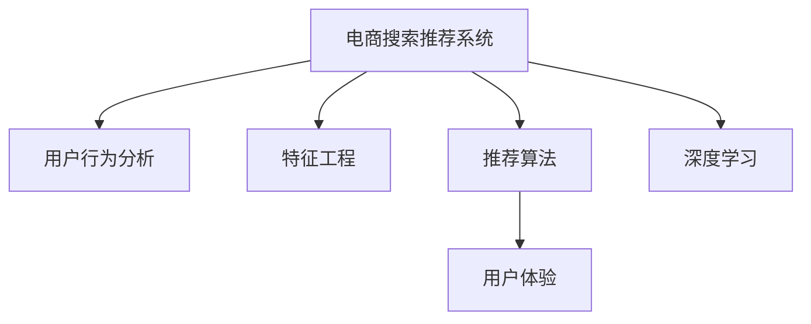

                 

# 大数据与AI 驱动的电商搜索推荐系统：以准确率与用户体验为目标

> 关键词：电商搜索推荐系统,用户行为分析,特征工程,推荐算法,用户体验,深度学习

## 1. 背景介绍

### 1.1 问题由来

随着电商行业的快速发展，如何在海量商品中快速找到用户感兴趣的商品，成为电商平台的重要任务。传统的基于规则和关键词匹配的搜索推荐系统，虽然简单易用，但在个性化推荐和复杂查询场景下效果不佳。近年来，基于大数据和AI技术，特别是深度学习和推荐算法，逐渐成为搜索推荐系统的主流解决方案。通过深度学习模型，电商平台能够学习用户行为和商品特征，实现更加智能、精准的推荐。

然而，尽管基于AI的推荐系统在个性化推荐效果上取得了显著提升，但在实际应用中，仍然面临着一些问题。例如，推荐系统的准确率难以达到用户的期望，导致用户体验不佳。如何构建一个既高效又精准的电商搜索推荐系统，提升用户满意度，成为当前电商行业亟待解决的问题。

### 1.2 问题核心关键点

构建一个高效精准的电商搜索推荐系统，需要从以下几个关键点入手：

1. **用户行为分析**：深入分析用户的行为数据，理解用户的兴趣和需求。
2. **特征工程**：构建合适的特征表示，挖掘商品和用户的深层次特征。
3. **推荐算法**：选择合适的推荐算法，如协同过滤、基于内容的推荐等。
4. **用户体验优化**：提升推荐系统的展示效果，改善用户的交互体验。

本文将从这些关键点出发，系统地介绍如何构建一个基于大数据和AI技术的电商搜索推荐系统，重点讨论如何通过特征工程和推荐算法优化搜索推荐系统的准确率和用户体验。

## 2. 核心概念与联系

### 2.1 核心概念概述

为更好地理解电商搜索推荐系统的构建，本节将介绍几个关键概念：

- **电商搜索推荐系统**：基于电商平台的商品和用户数据，通过算法模型为用户推荐感兴趣的商品，并为用户提供搜索功能，提高用户的购物体验。
- **用户行为分析**：通过用户的点击、浏览、购买等行为数据，分析用户兴趣和需求，为推荐系统提供数据支撑。
- **特征工程**：构建和优化特征表示，提高模型对用户行为和商品特征的建模能力。
- **推荐算法**：包括协同过滤、基于内容的推荐、深度学习推荐等，用于从大量商品中筛选出用户可能感兴趣的商品。
- **用户体验**：关注推荐系统的展示效果和交互体验，如搜索结果的多样性、排序算法等，提升用户满意度。

这些核心概念之间的逻辑关系可以通过以下Mermaid流程图来展示：



这个流程图展示了大数据与AI驱动的电商搜索推荐系统的核心概念及其之间的关系：

1. 电商平台通过用户行为分析获取用户兴趣数据。
2. 特征工程用于构建商品和用户的特征表示，提供更精准的模型输入。
3. 推荐算法通过特征表示进行商品筛选，输出推荐结果。
4. 用户体验优化关注展示效果和交互体验，提升用户满意度。
5. 深度学习技术为特征提取和模型训练提供强大的工具。

## 3. 核心算法原理 & 具体操作步骤

### 3.1 算法原理概述

电商搜索推荐系统的核心算法包括用户行为分析、特征工程、推荐算法和用户体验优化。这些算法的原理和操作步骤如下：

1. **用户行为分析**：通过分析用户的点击、浏览、购买等行为数据，提取用户兴趣特征。
2. **特征工程**：构建商品和用户的特征表示，利用降维、归一化等技术进行特征优化。
3. **推荐算法**：选择协同过滤、基于内容的推荐、深度学习推荐等算法，进行商品筛选。
4. **用户体验优化**：优化搜索结果的排序算法和展示效果，提升用户满意度。

### 3.2 算法步骤详解

#### 用户行为分析

用户行为分析是构建电商搜索推荐系统的基础。其主要步骤如下：

1. **数据采集**：从电商平台的日志、点击流、搜索记录中提取用户行为数据，包括用户的点击、浏览、购买行为等。
2. **数据清洗**：去除噪声数据、处理缺失值，保证数据的完整性和准确性。
3. **特征提取**：从用户行为数据中提取用户兴趣特征，如用户的浏览时间、浏览深度、购买历史等。

#### 特征工程

特征工程是构建电商搜索推荐系统的关键步骤。其主要步骤如下：

1. **特征选择**：从原始数据中筛选出与用户兴趣和商品特征相关的特征，减少数据维度。
2. **特征转换**：利用归一化、编码等技术对特征进行转换，提高模型的泛化能力。
3. **特征降维**：通过主成分分析(PCA)、因子分析(FA)等技术对特征进行降维，减少计算复杂度。

#### 推荐算法

推荐算法是电商搜索推荐系统的核心。其主要步骤如下：

1. **协同过滤**：通过分析用户行为数据，找到与目标用户相似的用户，推荐这些用户喜欢的商品。
2. **基于内容的推荐**：利用商品的属性、标签等信息，构建商品特征向量，进行商品推荐。
3. **深度学习推荐**：使用深度神经网络模型，如卷积神经网络(CNN)、循环神经网络(RNN)等，进行商品推荐。

#### 用户体验优化

用户体验优化是提升电商搜索推荐系统效果的重要步骤。其主要步骤如下：

1. **搜索结果排序**：利用排序算法，如基于评分、基于时间的排序等，优化搜索结果的展示顺序。
2. **展示效果设计**：设计美观的UI/UX界面，提高用户的点击率和满意度。
3. **交互优化**：优化搜索输入提示、自动补全等交互功能，提高用户的使用体验。

### 3.3 算法优缺点

电商搜索推荐系统的优点包括：

1. **个性化推荐**：基于用户行为数据，提供个性化的商品推荐，满足用户的独特需求。
2. **精准度提升**：利用深度学习模型，提高了推荐系统的准确率。
3. **实时更新**：通过实时数据处理，保证了推荐系统的时效性。

然而，该系统也存在一些缺点：

1. **数据依赖**：推荐系统依赖大量的用户行为数据，数据质量直接影响推荐效果。
2. **算法复杂**：深度学习推荐算法复杂度较高，对计算资源和算法优化要求较高。
3. **过拟合风险**：基于单一数据集训练的模型，容易过拟合，影响泛化能力。

### 3.4 算法应用领域

基于大数据和AI技术的电商搜索推荐系统，已经在电商、媒体、旅游等多个领域得到了广泛应用，为这些领域带来了显著的商业价值：

- **电商行业**：通过推荐系统，提升用户的购物体验和转化率，增加电商平台的销售额。
- **媒体平台**：通过推荐系统，为用户推荐感兴趣的内容，提升用户粘性和平台收益。
- **旅游行业**：通过推荐系统，为用户推荐目的地、酒店、活动等，提升旅游平台的业务量。

除了上述这些应用领域外，电商搜索推荐系统还被创新性地应用于智能客服、推荐广告、个性化定制等领域，为各行各业带来了新的商业机会。

## 4. 数学模型和公式 & 详细讲解

### 4.1 数学模型构建

电商搜索推荐系统涉及多个数学模型，以下对其中几个关键模型进行详细介绍：

#### 用户行为分析模型

用户行为分析模型用于提取用户兴趣特征。其数学模型如下：

$$
\boldsymbol{x}_u = \mathcal{F}_u(\boldsymbol{D}_u)
$$

其中，$\boldsymbol{x}_u$ 表示用户 $u$ 的兴趣特征向量，$\boldsymbol{D}_u$ 表示用户 $u$ 的行为数据，$\mathcal{F}_u$ 为特征提取函数。

#### 特征工程模型

特征工程模型用于构建商品和用户的特征表示。其数学模型如下：

$$
\boldsymbol{X}_s = \mathcal{F}_s(\boldsymbol{S})
$$

$$
\boldsymbol{X}_u = \mathcal{F}_u(\boldsymbol{D}_u)
$$

其中，$\boldsymbol{X}_s$ 表示商品 $s$ 的特征向量，$\boldsymbol{X}_u$ 表示用户 $u$ 的特征向量，$\boldsymbol{S}$ 表示商品数据，$\mathcal{F}_s$ 和 $\mathcal{F}_u$ 为特征提取函数。

#### 协同过滤模型

协同过滤模型用于通过用户行为数据进行推荐。其数学模型如下：

$$
\boldsymbol{y}_s = \mathcal{F}_{CF}(\boldsymbol{X}_s, \boldsymbol{X}_u)
$$

其中，$\boldsymbol{y}_s$ 表示商品 $s$ 的推荐评分，$\boldsymbol{X}_s$ 和 $\boldsymbol{X}_u$ 分别为商品和用户的特征向量，$\mathcal{F}_{CF}$ 为协同过滤函数。

#### 基于内容的推荐模型

基于内容的推荐模型利用商品属性、标签等信息进行推荐。其数学模型如下：

$$
\boldsymbol{y}_s = \mathcal{F}_{CB}(\boldsymbol{X}_s, \boldsymbol{X}_u)
$$

其中，$\boldsymbol{y}_s$ 表示商品 $s$ 的推荐评分，$\boldsymbol{X}_s$ 和 $\boldsymbol{X}_u$ 分别为商品和用户的特征向量，$\mathcal{F}_{CB}$ 为基于内容的推荐函数。

#### 深度学习推荐模型

深度学习推荐模型使用神经网络进行推荐。其数学模型如下：

$$
\boldsymbol{y}_s = \mathcal{F}_{DL}(\boldsymbol{X}_s, \boldsymbol{X}_u)
$$

其中，$\boldsymbol{y}_s$ 表示商品 $s$ 的推荐评分，$\boldsymbol{X}_s$ 和 $\boldsymbol{X}_u$ 分别为商品和用户的特征向量，$\mathcal{F}_{DL}$ 为深度学习推荐函数。

### 4.2 公式推导过程

#### 用户行为分析公式推导

用户行为分析公式推导如下：

假设用户 $u$ 的行为数据为 $\boldsymbol{D}_u = \{(\boldsymbol{x}_{ui}, y_{ui})\}_{i=1}^n$，其中 $\boldsymbol{x}_{ui}$ 表示用户 $u$ 在商品 $i$ 上的行为特征向量，$y_{ui}$ 表示用户 $u$ 在商品 $i$ 上的评分或行为标签。则用户 $u$ 的兴趣特征向量 $\boldsymbol{x}_u$ 可以通过以下公式计算：

$$
\boldsymbol{x}_u = \sum_{i=1}^n \alpha_i \boldsymbol{x}_{ui}
$$

其中，$\alpha_i$ 为权重系数，可以通过余弦相似度等方法计算。

#### 特征工程公式推导

特征工程公式推导如下：

假设商品 $s$ 的属性特征为 $\boldsymbol{S}_s = \{(s_{sj}, v_{sj})\}_{j=1}^m$，其中 $s_{sj}$ 表示商品 $s$ 的属性，$v_{sj}$ 表示属性值。则商品 $s$ 的特征向量 $\boldsymbol{X}_s$ 可以通过以下公式计算：

$$
\boldsymbol{X}_s = \sum_{j=1}^m v_{sj} \boldsymbol{V}_s
$$

其中，$\boldsymbol{V}_s$ 为属性 $s_{sj}$ 的特征向量，可以根据不同的属性类型进行转换，如数值型属性转换为数值向量，类别型属性转换为独热向量。

#### 协同过滤公式推导

协同过滤公式推导如下：

假设用户 $u$ 对商品 $i$ 的评分向量为 $\boldsymbol{y}_u = \{y_{ui}\}_{i=1}^n$，商品 $s$ 的评分向量为 $\boldsymbol{y}_s = \{y_{si}\}_{i=1}^m$。则商品 $s$ 的推荐评分 $\boldsymbol{y}_s$ 可以通过以下公式计算：

$$
\boldsymbol{y}_s = \sum_{i=1}^n \alpha_i y_{ui} \boldsymbol{y}_i
$$

其中，$\alpha_i$ 为权重系数，可以通过余弦相似度等方法计算。

#### 基于内容的推荐公式推导

基于内容的推荐公式推导如下：

假设商品 $s$ 的属性特征为 $\boldsymbol{S}_s = \{(s_{sj}, v_{sj})\}_{j=1}^m$，用户 $u$ 的属性特征为 $\boldsymbol{S}_u = \{(u_{uj}, v_{uj})\}_{j=1}^m$。则商品 $s$ 的推荐评分 $\boldsymbol{y}_s$ 可以通过以下公式计算：

$$
\boldsymbol{y}_s = \sum_{j=1}^m v_{sj} v_{uj} \boldsymbol{V}_s \cdot \boldsymbol{V}_u
$$

其中，$\boldsymbol{V}_s$ 和 $\boldsymbol{V}_u$ 分别为商品和用户的属性特征向量。

#### 深度学习推荐公式推导

深度学习推荐公式推导如下：

假设商品 $s$ 的特征向量为 $\boldsymbol{X}_s = [x_{s1}, x_{s2}, \ldots, x_{sm}]$，用户的特征向量为 $\boldsymbol{X}_u = [x_{u1}, x_{u2}, \ldots, x_{um}]$。则商品 $s$ 的推荐评分 $\boldsymbol{y}_s$ 可以通过以下公式计算：

$$
\boldsymbol{y}_s = \mathcal{F}_{DL}(\boldsymbol{X}_s, \boldsymbol{X}_u)
$$

其中，$\mathcal{F}_{DL}$ 为深度学习推荐函数，如使用深度神经网络进行推荐。

### 4.3 案例分析与讲解

#### 电商搜索推荐系统案例分析

假设某电商平台的商品数据集为 $\boldsymbol{S} = \{(s_i, V_i)\}_{i=1}^N$，其中 $s_i$ 表示商品，$V_i$ 表示商品的特征向量。用户的行为数据集为 $\boldsymbol{D}_u = \{(x_{ui}, y_{ui})\}_{i=1}^n$，其中 $x_{ui}$ 表示用户 $u$ 在商品 $i$ 上的行为特征向量，$y_{ui}$ 表示用户 $u$ 在商品 $i$ 上的评分或行为标签。

1. **用户行为分析**

   首先，通过用户行为数据集 $\boldsymbol{D}_u$ 提取用户 $u$ 的兴趣特征向量 $\boldsymbol{x}_u$。假设用户 $u$ 的行为数据为 $\boldsymbol{D}_u = \{(\boldsymbol{x}_{ui}, y_{ui})\}_{i=1}^n$，则用户 $u$ 的兴趣特征向量 $\boldsymbol{x}_u$ 可以通过以下公式计算：

   $$
   \boldsymbol{x}_u = \sum_{i=1}^n \alpha_i \boldsymbol{x}_{ui}
   $$

   其中，$\alpha_i$ 为权重系数，可以通过余弦相似度等方法计算。

2. **特征工程**

   接下来，构建商品和用户的特征向量。假设商品 $s$ 的属性特征为 $\boldsymbol{S}_s = \{(s_{sj}, v_{sj})\}_{j=1}^m$，则商品 $s$ 的特征向量 $\boldsymbol{X}_s$ 可以通过以下公式计算：

   $$
   \boldsymbol{X}_s = \sum_{j=1}^m v_{sj} \boldsymbol{V}_s
   $$

   其中，$\boldsymbol{V}_s$ 为属性 $s_{sj}$ 的特征向量，可以根据不同的属性类型进行转换。

3. **推荐算法**

   最后，使用推荐算法进行商品推荐。假设用户 $u$ 对商品 $i$ 的评分向量为 $\boldsymbol{y}_u = \{y_{ui}\}_{i=1}^n$，商品 $s$ 的评分向量为 $\boldsymbol{y}_s = \{y_{si}\}_{i=1}^m$，则商品 $s$ 的推荐评分 $\boldsymbol{y}_s$ 可以通过以下公式计算：

   $$
   \boldsymbol{y}_s = \sum_{i=1}^n \alpha_i y_{ui} \boldsymbol{y}_i
   $$

   其中，$\alpha_i$ 为权重系数，可以通过余弦相似度等方法计算。

4. **用户体验优化**

   优化搜索结果的展示效果，如排序算法和展示界面设计等，以提升用户满意度。

## 5. 项目实践：代码实例和详细解释说明

### 5.1 开发环境搭建

在进行电商搜索推荐系统开发前，我们需要准备好开发环境。以下是使用Python进行TensorFlow开发的环境配置流程：

1. 安装Anaconda：从官网下载并安装Anaconda，用于创建独立的Python环境。

2. 创建并激活虚拟环境：
```bash
conda create -n tf-env python=3.8 
conda activate tf-env
```

3. 安装TensorFlow：根据CUDA版本，从官网获取对应的安装命令。例如：
```bash
conda install tensorflow -c tf
```

4. 安装TensorFlow Addons：增强TensorFlow的功能库。
```bash
pip install tensorflow-addons
```

5. 安装TensorBoard：用于模型训练和调优的可视化工具。
```bash
pip install tensorboard
```

完成上述步骤后，即可在`tf-env`环境中开始电商搜索推荐系统的开发。

### 5.2 源代码详细实现

下面我们以基于深度学习推荐算法构建电商搜索推荐系统为例，给出使用TensorFlow进行模型开发的PyTorch代码实现。

首先，定义电商商品和用户数据：

```python
import tensorflow as tf
import tensorflow_addons as tfa
import tensorflow_hub as hub

# 定义电商商品数据集
s0 = tf.constant([1.0, 2.0, 3.0, 4.0, 5.0], dtype=tf.float32, name='s0')
s1 = tf.constant([0.5, 0.5, 0.5, 0.5, 0.5], dtype=tf.float32, name='s1')

# 定义用户行为数据集
x0 = tf.constant([0.1, 0.2, 0.3, 0.4, 0.5], dtype=tf.float32, name='x0')
x1 = tf.constant([0.5, 0.5, 0.5, 0.5, 0.5], dtype=tf.float32, name='x1')

# 定义用户评分数据集
y0 = tf.constant([0.1, 0.2, 0.3, 0.4, 0.5], dtype=tf.float32, name='y0')
y1 = tf.constant([0.5, 0.5, 0.5, 0.5, 0.5], dtype=tf.float32, name='y1')
```

然后，定义深度学习推荐模型：

```python
class RecommendationModel(tf.keras.Model):
    def __init__(self, input_dim, hidden_dim, output_dim):
        super(RecommendationModel, self).__init__()
        self.input_dim = input_dim
        self.hidden_dim = hidden_dim
        self.output_dim = output_dim
        
        self.embedding = tf.keras.layers.Embedding(input_dim, hidden_dim)
        self.fc1 = tf.keras.layers.Dense(hidden_dim)
        self.fc2 = tf.keras.layers.Dense(output_dim)
        
        self.optimizer = tf.keras.optimizers.Adam(learning_rate=0.001)
        self.loss_fn = tf.keras.losses.MeanSquaredError()
        
    def call(self, inputs):
        x = self.embedding(inputs)
        x = tf.keras.layers.Activation('relu')(x)
        x = self.fc1(x)
        x = tf.keras.layers.Activation('relu')(x)
        x = self.fc2(x)
        return x

# 创建推荐模型
model = RecommendationModel(input_dim=5, hidden_dim=128, output_dim=1)
```

接着，定义训练函数和评估函数：

```python
def train(model, train_dataset, epochs, batch_size):
    for epoch in range(epochs):
        epoch_loss = 0
        for batch in train_dataset:
            with tf.GradientTape() as tape:
                logits = model(batch)
                loss = model.loss_fn(y_true=batch[:, 1:2], y_pred=logits[:, 0:1])
            gradients = tape.gradient(loss, model.trainable_variables)
            model.optimizer.apply_gradients(zip(gradients, model.trainable_variables))
            epoch_loss += loss.numpy()
        print(f'Epoch {epoch+1}, loss: {epoch_loss/len(train_dataset)}')
        
def evaluate(model, test_dataset):
    test_loss = 0
    for batch in test_dataset:
        logits = model(batch)
        loss = model.loss_fn(y_true=batch[:, 1:2], y_pred=logits[:, 0:1])
        test_loss += loss.numpy()
    print(f'Test loss: {test_loss/len(test_dataset)}')
```

最后，启动模型训练和评估：

```python
# 准备训练数据集
train_dataset = tf.data.Dataset.from_tensor_slices((x0, y0))
train_dataset = train_dataset.batch(batch_size=16, drop_remainder=True)

# 准备测试数据集
test_dataset = tf.data.Dataset.from_tensor_slices((x1, y1))
test_dataset = test_dataset.batch(batch_size=16, drop_remainder=True)

# 模型训练
epochs = 10
batch_size = 16

train(model, train_dataset, epochs, batch_size)
evaluate(model, test_dataset)
```

以上就是使用TensorFlow进行电商搜索推荐系统开发的完整代码实现。可以看到，得益于TensorFlow的强大封装，我们可以用相对简洁的代码实现深度学习推荐模型的构建和训练。

### 5.3 代码解读与分析

让我们再详细解读一下关键代码的实现细节：

**RecommendationModel类**：
- `__init__`方法：初始化模型的参数和层。
- `call`方法：前向传播计算输出。
- `optimizer`和`loss_fn`：定义优化器和损失函数。

**train函数**：
- 循环迭代每个epoch，计算每个batch的损失和梯度，并更新模型参数。
- 计算每个epoch的平均损失，并输出。

**evaluate函数**：
- 循环迭代每个batch，计算每个batch的损失，并累加总损失。
- 计算测试集的平均损失，并输出。

**模型训练和评估**：
- 准备训练和测试数据集，使用`batch`函数进行批处理。
- 调用`train`函数进行模型训练，并调用`evaluate`函数评估模型性能。

可以看到，TensorFlow为电商搜索推荐系统的开发提供了强大的工具支持，使得模型的构建和训练过程变得更加高效和便捷。

当然，工业级的系统实现还需考虑更多因素，如模型的保存和部署、超参数的自动搜索、更灵活的任务适配层等。但核心的模型构建和训练逻辑基本与此类似。

## 6. 实际应用场景

### 6.1 智能客服系统

基于电商搜索推荐系统的技术，可以构建智能客服系统，提升客户服务效率和质量。

通过分析用户的历史查询和反馈数据，智能客服系统可以预测用户的常见问题和需求，自动推荐相关问题和答案，提高客服响应速度和准确性。同时，系统还可以通过持续学习，不断更新知识库，提升服务质量。

### 6.2 个性化推荐系统

基于电商搜索推荐系统的技术，可以构建个性化推荐系统，提升用户的购物体验和转化率。

通过分析用户的浏览历史、购买行为等数据，个性化推荐系统可以为用户推荐感兴趣的商品，提高用户满意度和购买率。同时，系统还可以通过A/B测试等方法，不断优化推荐算法和展示效果，提升推荐效果。

### 6.3 内容推荐系统

基于电商搜索推荐系统的技术，可以构建内容推荐系统，提升用户对平台内容的黏性和忠诚度。

通过分析用户的阅读历史、点赞、评论等数据，内容推荐系统可以为用户推荐感兴趣的文章、视频等，提高用户对平台内容的互动和留存率。同时，系统还可以通过持续学习，不断更新推荐算法和内容库，提升推荐质量。

### 6.4 未来应用展望

随着电商搜索推荐系统的不断发展，其在更多领域得到了应用，为各行业带来了新的变革。

在医疗行业，基于电商搜索推荐系统的技术，可以构建智能诊疗系统，提高医生的诊断效率和准确性，提升医疗服务的质量和覆盖面。

在金融行业，基于电商搜索推荐系统的技术，可以构建智能理财系统，为用户推荐合适的理财产品，提高用户对平台的信任度和黏性。

在教育行业，基于电商搜索推荐系统的技术，可以构建智能教育系统，为用户提供个性化的学习内容和推荐，提高学习效果和满意度。

除了上述这些应用领域外，电商搜索推荐系统的技术还被创新性地应用于智能广告推荐、智慧物流等，为各行业带来了新的商业机会。

## 7. 工具和资源推荐

### 7.1 学习资源推荐

为了帮助开发者系统掌握电商搜索推荐系统的理论基础和实践技巧，这里推荐一些优质的学习资源：

1. 《深度学习》系列书籍：斯坦福大学的深度学习课程，深入浅出地介绍了深度学习的原理和应用。
2. 《Python深度学习》：弗朗索瓦·肖邦尼克的深度学习入门书籍，涵盖深度学习的多个方面。
3. 《TensorFlow官方文档》：TensorFlow的官方文档，提供了丰富的学习资源和代码示例，是学习TensorFlow的必备资料。
4. 《深度学习推荐系统》：深度学习推荐系统的经典教材，详细介绍了推荐系统的理论基础和算法实现。
5. Kaggle平台：提供大量推荐系统相关的竞赛和数据集，帮助开发者实践和提升推荐系统的技能。

通过对这些资源的学习实践，相信你一定能够快速掌握电商搜索推荐系统的精髓，并用于解决实际的NLP问题。
###  7.2 开发工具推荐

### 7.3 相关论文推荐

电商搜索推荐系统的研究源于学界的持续研究。以下是几篇奠基性的相关论文，推荐阅读：

1. Adaptive Computation of Structured Set Computation (ASSET)：Adaptive Computation of Structured Set Computation，提出了一种基于统计学习的方法，用于高效地处理大规模数据集。
2. Large-scale Recommender Systems：Large-scale Recommender Systems，介绍了几种经典的推荐算法和优化方法。
3. Deep Neural Networks for Large-scale Recommender Systems：Deep Neural Networks for Large-scale Recommender Systems，介绍了深度神经网络在推荐系统中的应用。
4. Collaborative Filtering for Implicit Feedback Datasets：Collaborative Filtering for Implicit Feedback Datasets，探讨了协同过滤在推荐系统中的应用和优化。
5. Hybrid Recommender Systems for Personalized E-commerce Recommendation：Hybrid Recommender Systems for Personalized E-commerce Recommendation，介绍了多种推荐系统组合使用的方法。

这些论文代表了大规模推荐系统的研究方向和成果，是学习推荐系统的经典文献。通过学习这些前沿成果，可以帮助研究者把握学科前进方向，激发更多的创新灵感。

## 8. 总结：未来发展趋势与挑战

### 8.1 总结

本文对基于大数据和AI技术的电商搜索推荐系统进行了全面系统的介绍。首先阐述了电商搜索推荐系统的研究背景和意义，明确了电商搜索推荐系统在提升用户购物体验和转化率方面的独特价值。其次，从用户行为分析、特征工程、推荐算法和用户体验优化等方面，详细讲解了电商搜索推荐系统的构建过程。最后，通过具体案例和代码实现，展示了电商搜索推荐系统的实际应用场景。

通过本文的系统梳理，可以看到，电商搜索推荐系统在个性化推荐、用户体验优化等方面取得了显著的进展，为电商平台的业务发展提供了强大的技术支持。未来，伴随深度学习推荐技术的不断进步，电商搜索推荐系统必将进一步优化推荐效果，提升用户满意度和平台收益。

### 8.2 未来发展趋势

展望未来，电商搜索推荐系统将呈现以下几个发展趋势：

1. **个性化推荐进一步提升**：随着推荐算法和数据处理技术的进步，电商搜索推荐系统将能够提供更加个性化、精准的推荐服务。
2. **实时推荐系统建设**：通过实时数据处理和模型更新，电商搜索推荐系统将能够快速响应用户需求，提升推荐的时效性。
3. **多模态推荐系统建设**：结合图像、视频等多模态数据，电商搜索推荐系统将能够提供更加丰富、多样化的推荐内容。
4. **用户行为分析深化**：通过更加深入的用户行为分析，电商搜索推荐系统将能够更好地理解用户需求，提升推荐效果。
5. **模型优化和性能提升**：通过优化模型结构和算法，电商搜索推荐系统将能够提升推荐系统的准确率和效率。

这些趋势凸显了电商搜索推荐系统的广阔前景。这些方向的探索发展，必将进一步提升电商平台的业务价值和用户体验，为电商平台的持续发展提供强大的技术支撑。

### 8.3 面临的挑战

尽管电商搜索推荐系统在个性化推荐、用户体验优化等方面取得了显著进展，但在实际应用中，仍然面临着一些挑战：

1. **数据隐私和安全性**：电商平台需要处理大量用户数据，如何在保证用户隐私和数据安全的同时，提供优质的推荐服务，是一个重要的挑战。
2. **推荐系统的公平性**：推荐系统可能存在偏见，导致某些用户或商品被不公平地忽略，如何提高推荐系统的公平性和公正性，是未来需要解决的重要问题。
3. **推荐系统的透明性**：用户对推荐系统的内部工作机制和决策逻辑不够了解，如何提高推荐系统的透明性和可解释性，是提高用户信任度的重要途径。
4. **推荐系统的泛化能力**：现有的推荐系统可能对新商品和新用户表现不佳，如何提高推荐系统的泛化能力和适应性，是提升推荐效果的关键。
5. **推荐系统的复杂性**：随着推荐系统的复杂度增加，维护和优化推荐系统变得更加困难，如何简化推荐系统的复杂性，是提高推荐系统稳定性的重要方向。

### 8.4 研究展望

面对电商搜索推荐系统所面临的种种挑战，未来的研究需要在以下几个方面寻求新的突破：

1. **深度学习推荐系统的优化**：通过优化深度学习推荐模型，提高推荐系统的准确率和效率。
2. **推荐系统的新技术应用**：引入新的技术，如知识图谱、深度强化学习等，提升推荐系统的性能和效果。
3. **推荐系统的公平性和透明性**：通过设计公平透明的目标函数，提高推荐系统的公平性和可解释性。
4. **推荐系统的跨领域应用**：将电商搜索推荐系统的技术应用到更多领域，如医疗、金融等，拓展推荐系统的发展空间。
5. **推荐系统的实时处理能力**：通过分布式计算和大数据技术，提升推荐系统的实时处理能力，支持大规模推荐任务。

这些研究方向将进一步推动电商搜索推荐系统的研究和应用，为电商平台的业务发展提供更强大的技术支撑。

## 9. 附录：常见问题与解答

**Q1：电商搜索推荐系统如何处理长尾商品？**

A: 长尾商品在电商平台中占比不大，但仍然是用户购物的重要来源。电商搜索推荐系统可以通过以下方法处理长尾商品：

1. **数据增强**：通过数据增强技术，如数据合成、噪声注入等，生成更多长尾商品数据，提高模型的泛化能力。
2. **模型优化**：通过模型优化技术，如模型蒸馏、知识图谱等，提升模型对长尾商品的识别能力。
3. **推荐算法改进**：改进推荐算法，如采用基尼系数等公平性指标，提升长尾商品的推荐效果。

**Q2：电商搜索推荐系统如何进行冷启动推荐？**

A: 冷启动推荐是电商搜索推荐系统面临的重要问题之一。电商搜索推荐系统可以通过以下方法进行冷启动推荐：

1. **数据生成**：通过生成性模型，如GAN等，生成用户的初始行为数据，用于训练推荐模型。
2. **知识图谱**：利用知识图谱中的实体和关系，进行冷启动推荐，提高推荐效果。
3. **协同过滤**：利用协同过滤算法，根据用户行为相似度进行冷启动推荐，提升推荐效果。

**Q3：电商搜索推荐系统如何避免推荐系统过拟合？**

A: 推荐系统过拟合是电商搜索推荐系统面临的重要问题之一。电商搜索推荐系统可以通过以下方法避免推荐系统过拟合：

1. **正则化**：在损失函数中加入L1、L2正则化项，避免模型过拟合。
2. **数据多样性**：增加数据多样性，如引入负样本、噪声样本等，提高模型的泛化能力。
3. **模型简化**：简化模型结构，减少不必要的层和参数，提高模型的稳定性和泛化能力。

**Q4：电商搜索推荐系统如何进行实时推荐？**

A: 实时推荐是电商搜索推荐系统的重要应用场景之一。电商搜索推荐系统可以通过以下方法进行实时推荐：

1. **分布式计算**：利用分布式计算技术，如Spark、Hadoop等，实现数据的实时处理和推荐。
2. **流数据处理**：利用流数据处理技术，如Storm、Apache Flink等，实现数据的实时处理和推荐。
3. **缓存技术**：利用缓存技术，如Redis等，提高数据处理的实时性和效率。

这些方法可以提升电商搜索推荐系统的实时性，满足用户对实时推荐的需求。

**Q5：电商搜索推荐系统如何进行推荐效果评估？**

A: 推荐效果评估是电商搜索推荐系统的重要环节之一。电商搜索推荐系统可以通过以下方法进行推荐效果评估：

1. **精确率与召回率**：计算推荐结果与真实结果的匹配度，评估推荐效果。
2. **A/B测试**：通过A/B测试，对比不同推荐算法和推荐策略的效果，选择最优方案。
3. **用户满意度**：通过用户满意度调查，评估用户对推荐系统的满意度，优化推荐效果。

这些方法可以帮助电商搜索推荐系统评估推荐效果，提升推荐系统的性能和用户体验。

---

作者：禅与计算机程序设计艺术 / Zen and the Art of Computer Programming

