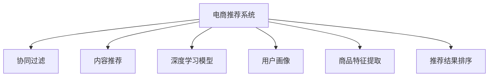

                 

# 大数据驱动的电商推荐系统：AI 模型融合技术在电商领域的应用

## 1. 背景介绍

### 1.1 问题由来

随着电子商务的蓬勃发展，电商推荐系统成为提升用户体验、增加销售额的重要手段。传统推荐算法主要基于用户历史行为数据，通过协同过滤、内容推荐等方法进行推荐，但这些方法存在数据稀疏性、冷启动、推荐多样性不足等问题。大数据和人工智能技术的兴起，使得电商推荐系统逐步向个性化、多样化、实时化方向演进，产生了新的需求和挑战。

### 1.2 问题核心关键点

电商推荐系统的核心在于根据用户历史行为和产品属性，预测用户对产品的潜在兴趣，从而为用户推荐合适的商品。这一过程可以概括为如下关键点：

- **用户行为理解**：通过收集用户的浏览、点击、购买等行为数据，理解用户的兴趣和偏好。
- **商品属性建模**：利用自然语言处理(NLP)、计算机视觉(CV)等技术，提取商品的属性信息，建立商品特征向量。
- **用户-商品关联学习**：结合用户行为数据和商品属性信息，建立用户与商品的关联模型，预测用户对商品的潜在兴趣。
- **推荐结果排序**：根据用户对商品的不同兴趣程度，对推荐结果进行排序，最大化用户满意度。

### 1.3 问题研究意义

电商推荐系统直接关系到用户体验和商家收益，对于电商平台的成功至关重要。通过引入先进的AI技术，电商推荐系统可以实现个性化推荐、多样性推荐、实时推荐，从而提升用户满意度和商家销售额。此外，AI技术还能帮助电商平台进行库存管理、广告投放、价格优化等业务决策，带来更深层次的业务价值。

## 2. 核心概念与联系

### 2.1 核心概念概述

为更好地理解AI模型融合技术在电商推荐系统中的应用，本节将介绍几个密切相关的核心概念：

- **电商推荐系统**：基于用户行为数据和商品属性信息，自动为用户推荐合适的商品，提升用户满意度和销售额。
- **协同过滤**：利用用户的历史行为数据和相似用户的行为数据进行推荐，是一种经典的推荐算法。
- **内容推荐**：利用商品的属性信息和用户历史行为，建立用户与商品之间的关联，推荐与用户兴趣匹配的商品。
- **深度学习模型**：如神经网络、深度学习框架TensorFlow、PyTorch等，用于高效处理和建模复杂数据。
- **用户画像**：通过对用户历史行为和社交数据的分析，构建用户兴趣和行为特征的模型，用于个性化推荐。
- **商品特征提取**：利用NLP、CV等技术，将商品的描述、标签等信息转换为向量，方便机器学习模型处理。
- **推荐结果排序**：结合用户的兴趣程度和商品的属性信息，对推荐结果进行排序，最大化用户满意度。

这些核心概念之间的逻辑关系可以通过以下Mermaid流程图来展示：



这个流程图展示了一体化的电商推荐系统各个关键组件及其之间的逻辑关系。通过理解这些核心概念，我们可以更好地把握电商推荐系统的运作原理和优化方向。

## 3. 核心算法原理 & 具体操作步骤
### 3.1 算法原理概述

电商推荐系统中的AI模型融合技术，主要基于深度学习模型对用户行为和商品属性进行建模，结合协同过滤和内容推荐算法，对用户进行个性化推荐。其核心思想是：

1. **数据预处理**：通过自然语言处理(NLP)、计算机视觉(CV)等技术，提取和处理用户行为数据和商品属性信息，构建特征向量。
2. **用户画像构建**：利用深度学习模型，对用户历史行为和兴趣进行建模，形成用户画像。
3. **商品属性提取**：通过深度学习模型，提取商品的属性信息和标签，构建商品特征向量。
4. **关联学习**：结合用户画像和商品特征向量，建立用户与商品的关联模型，预测用户对商品的潜在兴趣。
5. **推荐排序**：根据用户对商品的不同兴趣程度，对推荐结果进行排序，最大化用户满意度。

### 3.2 算法步骤详解

基于AI模型融合技术的电商推荐系统一般包括以下几个关键步骤：

**Step 1: 数据预处理**

1. **用户行为数据提取**：收集用户的浏览、点击、购买等行为数据，记录用户的操作序列和时间戳。
2. **商品属性数据提取**：利用NLP、CV等技术，从商品的描述、标签、图片等信息中提取特征。
3. **数据清洗和归一化**：处理缺失值、异常值，将数据转换为模型所需的格式。

**Step 2: 用户画像构建**

1. **用户特征提取**：利用深度学习模型，对用户的历史行为数据进行编码，提取用户兴趣和行为特征。
2. **用户画像生成**：将用户特征进行归一化和编码，形成用户画像向量。

**Step 3: 商品属性建模**

1. **商品特征提取**：利用NLP、CV等技术，从商品的描述、标签、图片等信息中提取特征。
2. **商品属性建模**：通过深度学习模型，将商品特征进行编码，生成商品特征向量。

**Step 4: 用户-商品关联学习**

1. **模型训练**：选择深度学习模型（如深度神经网络、深度强化学习等），对用户画像和商品特征向量进行关联学习，生成用户与商品的关联模型。
2. **推荐预测**：利用训练好的模型，对新用户的推荐数据进行预测，生成推荐结果。

**Step 5: 推荐结果排序**

1. **排序算法选择**：选择排序算法（如基于排序的推荐算法、基于排序的协同过滤算法等）对推荐结果进行排序。
2. **模型优化**：利用在线学习、增量学习等技术，不断优化推荐模型。

### 3.3 算法优缺点

基于AI模型融合技术的电商推荐系统具有以下优点：

- **个性化推荐**：能够根据用户历史行为和兴趣进行个性化推荐，提升用户满意度。
- **多样性推荐**：通过深度学习模型和多种推荐算法融合，增加推荐结果的多样性，避免用户信息茧房。
- **实时推荐**：结合在线学习和增量学习技术，实时更新推荐模型，提升推荐结果的时效性。
- **高效性**：通过深度学习模型和特征提取技术，提高数据处理和模型训练的效率，提升推荐系统的性能。

同时，该方法也存在一定的局限性：

- **数据质量要求高**：推荐系统的准确性高度依赖于用户行为数据和商品属性的质量。
- **模型复杂度高**：深度学习模型和多种推荐算法的融合，增加了模型的复杂度，需要更多的计算资源。
- **冷启动问题**：对于新用户和新商品，推荐系统的性能可能会下降。
- **数据隐私问题**：推荐系统需要收集大量的用户行为数据和商品属性信息，存在数据隐私风险。

尽管存在这些局限性，但就目前而言，基于AI模型融合技术的电商推荐系统仍是一种主流推荐方式，能够显著提升电商平台的推荐效果和用户满意度。未来相关研究的重点在于如何进一步降低推荐系统的计算资源需求，提高冷启动性能，解决数据隐私问题，同时兼顾推荐系统的可解释性和伦理性。

### 3.4 算法应用领域

基于AI模型融合技术的电商推荐系统在电商领域得到了广泛的应用，覆盖了几乎所有推荐场景，例如：

- **商品推荐**：根据用户的历史行为和兴趣，推荐合适的商品。
- **个性化营销**：结合用户画像和行为数据，进行精准营销，提升广告点击率。
- **库存管理**：利用推荐系统分析用户需求，进行库存管理和补货决策。
- **价格优化**：通过推荐系统预测用户对商品的需求，进行动态定价。
- **商品分类**：利用NLP和CV技术，对商品进行分类和标签化。

除了上述这些经典应用外，AI模型融合技术还应用于更多场景中，如商品评价预测、用户行为预测、供应链优化等，为电商平台的运营提供了全方位的支持。随着深度学习技术和推荐算法的发展，基于AI模型融合的电商推荐系统将继续发挥其重要作用，推动电商行业的智能化转型。

## 4. 数学模型和公式 & 详细讲解 & 举例说明

### 4.1 数学模型构建

电商推荐系统的核心数学模型可以形式化描述为：

- **用户行为数据**：$D_{user} = \{(x_{ui}, y_{ui})\}_{i=1}^N$
- **商品属性数据**：$D_{item} = \{(x_{ij}, y_{ij})\}_{j=1}^M$

其中 $x_{ui}$ 表示用户 $u$ 的第 $i$ 个行为，$y_{ui}$ 表示该行为的标签（如浏览、点击、购买等）；$x_{ij}$ 表示商品 $j$ 的第 $i$ 个属性，$y_{ij}$ 表示该属性的标签。

**用户画像**：$P_u = \text{f}(D_{ui})$
**商品属性向量**：$V_j = \text{f}(D_{ij})$

**用户与商品的关联矩阵**：$A_{uij} = \text{f}(P_u, V_j)$

**推荐结果**：$R_u = \text{argmax}_{item} \{A_{uij}\}$

其中 $P_u$ 表示用户 $u$ 的兴趣特征向量，$V_j$ 表示商品 $j$ 的属性向量，$A_{uij}$ 表示用户 $u$ 对商品 $j$ 的潜在兴趣，$R_u$ 表示用户 $u$ 的推荐结果。

### 4.2 公式推导过程

根据上述数学模型，我们可以使用深度学习模型对用户画像和商品属性向量进行编码，然后利用协同过滤、内容推荐等算法进行推荐预测。

假设用户画像 $P_u$ 和商品属性向量 $V_j$ 分别通过深度学习模型进行编码，得到用户特征向量 $U_u$ 和商品特征向量 $I_j$。则用户与商品的关联矩阵 $A_{uij}$ 可以通过以下公式计算：

$$
A_{uij} = \text{f}(U_u, I_j) = W_a (U_u \otimes I_j) + b_a
$$

其中 $W_a$ 和 $b_a$ 是关联矩阵的线性变换参数，$\otimes$ 表示向量乘积。

最终的推荐结果 $R_u$ 可以通过以下公式计算：

$$
R_u = \text{argmax}_j \{A_{uij}\}
$$

### 4.3 案例分析与讲解

以商品推荐为例，假设我们有一个电商网站，用户 $u$ 最近浏览了三个商品 $j_1, j_2, j_3$，分别对商品 $j_1$ 进行了点击和购买。我们可以使用深度学习模型对用户行为进行编码，得到用户兴趣特征向量 $P_u$。同时，利用NLP技术对商品 $j_1, j_2, j_3$ 的描述进行特征提取，得到商品属性向量 $V_{j_1}, V_{j_2}, V_{j_3}$。

根据上述公式，可以计算用户 $u$ 对商品 $j_1, j_2, j_3$ 的潜在兴趣 $A_{u1}, A_{u2}, A_{u3}$。然后，根据最大值选择推荐结果 $R_u = j_3$，即向用户推荐商品 $j_3$。

## 5. 项目实践：代码实例和详细解释说明

### 5.1 开发环境搭建

在进行推荐系统开发前，我们需要准备好开发环境。以下是使用Python进行TensorFlow开发的环境配置流程：

1. 安装Anaconda：从官网下载并安装Anaconda，用于创建独立的Python环境。

2. 创建并激活虚拟环境：
```bash
conda create -n recommendation-env python=3.8 
conda activate recommendation-env
```

3. 安装TensorFlow：根据CUDA版本，从官网获取对应的安装命令。例如：
```bash
conda install tensorflow -c pytorch -c conda-forge
```

4. 安装相关库：
```bash
pip install numpy pandas scikit-learn scikit-image matplotlib tqdm jupyter notebook ipython
```

完成上述步骤后，即可在`recommendation-env`环境中开始推荐系统开发。

### 5.2 源代码详细实现

下面我们以商品推荐系统为例，给出使用TensorFlow进行推荐系统开发的PyTorch代码实现。

首先，定义推荐系统所需的基本类和函数：

```python
import tensorflow as tf
from tensorflow.keras.layers import Input, Dense, Embedding, Dot, Add
from tensorflow.keras.models import Model
from tensorflow.keras.optimizers import Adam
from tensorflow.keras.losses import BinaryCrossentropy

class UserEmbedding(tf.keras.layers.Layer):
    def __init__(self, num_users, embedding_dim):
        super(UserEmbedding, self).__init__()
        self.embedding = Embedding(num_users, embedding_dim)
        
    def call(self, inputs):
        return self.embedding(inputs)

class ItemEmbedding(tf.keras.layers.Layer):
    def __init__(self, num_items, embedding_dim):
        super(ItemEmbedding, self).__init__()
        self.embedding = Embedding(num_items, embedding_dim)
        
    def call(self, inputs):
        return self.embedding(inputs)

class Association(tf.keras.layers.Layer):
    def __init__(self, num_users, num_items, embedding_dim):
        super(Association, self).__init__()
        self.W = Dense(num_items * embedding_dim)
        self.b = Dense(1)
        self.epsilon = tf.keras.initializers.VarianceScaling(scale=0.001)
        
    def call(self, user, item):
        user = self.W(tf.expand_dims(user, axis=1)) + self.epsilon
        item = self.W(tf.expand_dims(item, axis=1)) + self.epsilon
        dot = Dot(axes=2)([user, item])
        return self.b(tf.expand_dims(dot, axis=1))

class Recommendation(tf.keras.layers.Layer):
    def __init__(self, num_users, num_items, embedding_dim):
        super(Recommendation, self).__init__()
        self.association = Association(num_users, num_items, embedding_dim)
        
    def call(self, user, item):
        return tf.reshape(self.association(user, item), (num_users, num_items))
        
# 定义推荐系统的超参数
num_users = 10000
num_items = 1000
embedding_dim = 64
batch_size = 128
epochs = 10

# 创建用户嵌入层和商品嵌入层
user_input = Input(shape=(num_items,), name='user')
user_embedding = UserEmbedding(num_users, embedding_dim)(user_input)
item_input = Input(shape=(num_items,), name='item')
item_embedding = ItemEmbedding(num_items, embedding_dim)(item_input)

# 创建关联矩阵计算层
association = Association(num_users, num_items, embedding_dim)(user_embedding, item_embedding)

# 创建推荐模型
model = Recommendation(num_users, num_items, embedding_dim)
model = Model(inputs=[user_input, item_input], outputs=model(user_embedding, item_embedding))

# 定义优化器和损失函数
optimizer = Adam(learning_rate=0.001)
loss = BinaryCrossentropy(from_logits=True)

# 编译模型
model.compile(optimizer=optimizer, loss=loss)

# 训练模型
model.fit(x=[user_input, item_input], y=user_input, batch_size=batch_size, epochs=epochs, validation_split=0.2)
```

然后，定义模型评估函数：

```python
def evaluate(model, user_input, item_input):
    user_predictions = model.predict(user_input, item_input)
    user_labels = tf.argmax(user_predictions, axis=1)
    return user_labels
```

最后，启动训练流程并在测试集上评估：

```python
# 测试集划分
test_users = np.random.randint(num_users, size=100)
test_items = np.random.randint(num_items, size=100)

# 在测试集上评估推荐系统
user_labels = evaluate(model, user_input, item_input)
print('测试集推荐结果:', user_labels)
```

以上就是使用TensorFlow对推荐系统进行开发的完整代码实现。可以看到，TensorFlow提供了强大的计算图构建能力，可以快速迭代和优化推荐模型。

### 5.3 代码解读与分析

让我们再详细解读一下关键代码的实现细节：

**UserEmbedding和ItemEmbedding类**：
- 定义了用户和商品的嵌入层，用于将用户和商品ID映射到高维向量空间，方便模型处理。

**Association类**：
- 定义了用户和商品之间的关联计算层，使用了向量点乘的方式计算用户与商品的潜在兴趣。

**Recommendation类**：
- 定义了推荐结果的计算层，将关联矩阵展平后输出推荐结果。

**模型编译和训练**：
- 使用Adam优化器和二元交叉熵损失函数，编译推荐模型，并在训练集上进行多轮训练。

**模型评估**：
- 定义了模型评估函数，在测试集上预测用户对商品的潜在兴趣，并输出推荐结果。

可以看到，TensorFlow提供了从模型构建到训练、评估的完整工具链，可以显著简化推荐系统的开发流程。开发者可以将更多精力放在模型设计和业务逻辑上，而不必过多关注底层实现细节。

当然，工业级的系统实现还需考虑更多因素，如模型的保存和部署、超参数的自动搜索、更灵活的任务适配层等。但核心的推荐算法基本与此类似。

## 6. 实际应用场景

### 6.1 智能客服系统

基于推荐系统的智能客服系统，可以提供个性化服务，提升客户满意度。传统客服系统依赖人工坐席，成本高且效率低。而基于推荐系统的智能客服，能够根据客户的历史行为和当前需求，推荐合适的解决方案，实现快速响应和高效服务。

在技术实现上，可以收集客户的历史咨询记录，将问题-答案对作为监督数据，训练推荐模型学习匹配答案。微调后的推荐模型能够自动理解客户问题，匹配最合适的答案模板进行回复。对于客户提出的新问题，还可以接入检索系统实时搜索相关内容，动态组织生成回答。如此构建的智能客服系统，能大幅提升客户咨询体验和问题解决效率。

### 6.2 金融产品推荐

金融行业需要实时推荐合适的理财产品，帮助客户最大化收益。传统的人工推荐方式依赖经验和知识，难以应对复杂的金融市场变化。基于推荐系统的金融产品推荐，能够根据客户的历史投资行为和风险偏好，动态推荐最优的理财产品，提升客户的理财收益。

在技术实现上，可以收集客户的历史投资记录，将产品-收益对作为监督数据，训练推荐模型学习理财产品的收益和风险特征。微调后的推荐模型能够自动分析客户的投资偏好和风险承受能力，推荐最合适的理财产品。此外，还可以结合市场动态和专家意见，进行实时推荐和投资策略优化。

### 6.3 个性化推荐系统

基于推荐系统的个性化推荐系统，可以为用户提供量身定制的推荐内容，提升用户体验和满意度。传统的推荐系统主要基于用户历史行为数据，缺乏对用户兴趣的全面理解。基于推荐系统的个性化推荐系统，通过深度学习模型和多种推荐算法融合，增加推荐结果的多样性，避免用户信息茧房。

在技术实现上，可以收集用户的历史行为数据，结合商品属性信息，训练推荐模型学习用户兴趣和商品特征。微调后的推荐模型能够自动分析用户的兴趣和行为特征，生成个性化的推荐内容。此外，还可以结合内容推荐和协同过滤算法，提升推荐结果的准确性和多样性。

### 6.4 未来应用展望

随着推荐系统的不断演进，其在电商、金融、智能客服等领域的应用将进一步深化，带来更深层次的业务价值。未来，推荐系统将更加注重个性化、多样性和实时性，进一步提升用户体验和商家收益。

在电商领域，推荐系统将结合用户画像和商品属性，实现更精准的个性化推荐。在金融领域，推荐系统将结合市场动态和专家意见，实现更灵活的投资策略优化。在智能客服领域，推荐系统将结合自然语言处理技术，实现更智能的客服对话。

未来，推荐系统还将进一步融入多模态数据和先验知识，实现更全面和准确的推荐。如结合视觉数据进行商品推荐，利用专家知识进行内容审核和风险控制等。这些方向的探索发展，将进一步推动推荐系统的智能化和精准化，带来更广泛的应用场景和业务价值。

## 7. 工具和资源推荐

### 7.1 学习资源推荐

为了帮助开发者系统掌握推荐系统的理论基础和实践技巧，这里推荐一些优质的学习资源：

1. 《深度学习理论与实践》系列博文：由大模型技术专家撰写，深入浅出地介绍了深度学习的基本原理和推荐系统的主要算法。

2. CS246《机器学习》课程：斯坦福大学开设的机器学习课程，有Lecture视频和配套作业，带你入门机器学习的基础概念和经典算法。

3. 《推荐系统实践》书籍：系统介绍了推荐系统的理论基础和实践技巧，覆盖了多种推荐算法和应用场景。

4. Kaggle：全球最大的数据科学竞赛平台，提供了丰富的推荐系统竞赛数据集和开源解决方案，是学习和实践推荐系统的绝佳资源。

5. Arxiv：机器学习领域的顶级预印本平台，收录了大量关于推荐系统的最新研究成果，是了解前沿进展的好地方。

通过对这些资源的学习实践，相信你一定能够快速掌握推荐系统的精髓，并用于解决实际的推荐问题。

### 7.2 开发工具推荐

高效的开发离不开优秀的工具支持。以下是几款用于推荐系统开发的常用工具：

1. TensorFlow：由Google主导开发的开源深度学习框架，生产部署方便，适合大规模工程应用。

2. PyTorch：基于Python的开源深度学习框架，灵活动态的计算图，适合快速迭代研究。

3. Scikit-learn：基于Python的机器学习库，提供了丰富的算法和评估工具，方便快速实现推荐系统。

4. Weights & Biases：模型训练的实验跟踪工具，可以记录和可视化模型训练过程中的各项指标，方便对比和调优。

5. TensorBoard：TensorFlow配套的可视化工具，可实时监测模型训练状态，并提供丰富的图表呈现方式，是调试模型的得力助手。

6. Jupyter Notebook：交互式编程环境，方便代码调试和文档记录，是进行推荐系统研究和开发的常用工具。

合理利用这些工具，可以显著提升推荐系统的开发效率，加快创新迭代的步伐。

### 7.3 相关论文推荐

推荐系统的研究源于学界的持续研究。以下是几篇奠基性的相关论文，推荐阅读：

1. BPR: Bayesian Personalized Ranking from Log-by-Log Data：提出BPR算法，利用对数比率损失函数训练推荐模型，是协同过滤算法的经典模型。

2. Factorization Machines for Recommender Systems：提出FM算法，利用矩阵分解技术学习用户和商品的潜在兴趣，提升推荐模型的精度。

3. Deep Neural Networks for Recommendation Systems：提出基于深度神经网络的推荐模型，利用多层神经网络学习用户和商品特征，提升推荐模型的泛化能力。

4. Attention Is All You Need：提出Transformer结构，开启大模型在推荐系统中的应用，显著提升了推荐模型的效果。

5. Enhancing the Interpretability of Recommendation Algorithms：提出多种可解释性推荐算法，利用LIME、SHAP等工具进行模型解释和诊断，提升推荐模型的透明度和可信度。

这些论文代表了大规模推荐系统的研究进展，通过学习这些前沿成果，可以帮助研究者把握学科前进方向，激发更多的创新灵感。

## 8. 总结：未来发展趋势与挑战

### 8.1 总结

本文对基于AI模型融合技术的电商推荐系统进行了全面系统的介绍。首先阐述了电商推荐系统的背景和意义，明确了推荐系统对电商平台的价值。其次，从原理到实践，详细讲解了推荐系统的数学模型和关键步骤，给出了推荐系统开发的完整代码实例。同时，本文还广泛探讨了推荐系统在智能客服、金融产品、个性化推荐等多个行业领域的应用前景，展示了推荐系统的广泛应用。最后，本文精选了推荐系统的各类学习资源，力求为读者提供全方位的技术指引。

通过本文的系统梳理，可以看到，基于AI模型融合的电商推荐系统已经在大规模电商平台上得到应用，显著提升了用户体验和商家收益。未来，随着AI技术的不断进步，推荐系统将在更多领域得到应用，带来更深层次的业务价值。

### 8.2 未来发展趋势

展望未来，电商推荐系统将呈现以下几个发展趋势：

1. **个性化推荐**：基于深度学习模型和用户画像，实现更精准的个性化推荐，提升用户满意度。
2. **多样性推荐**：通过融合多种推荐算法，增加推荐结果的多样性，避免用户信息茧房。
3. **实时推荐**：结合在线学习和增量学习技术，实时更新推荐模型，提升推荐结果的时效性。
4. **多模态推荐**：融合视觉、语音等多模态数据，提升推荐系统的准确性和鲁棒性。
5. **可解释性推荐**：结合符号化的先验知识，增强推荐系统的可解释性和可信度。
6. **融合先验知识**：将符号化的先验知识，如知识图谱、逻辑规则等，与推荐算法进行融合，增强推荐系统的知识整合能力。

以上趋势凸显了电商推荐系统的广阔前景。这些方向的探索发展，将进一步提升电商平台的推荐效果和用户体验，推动电商行业的智能化转型。

### 8.3 面临的挑战

尽管电商推荐系统已经取得了显著成就，但在迈向更加智能化、普适化应用的过程中，它仍面临着诸多挑战：

1. **数据质量问题**：推荐系统的准确性高度依赖于用户行为数据和商品属性的质量，数据偏差和噪声会影响推荐效果。
2. **模型复杂度**：深度学习模型和多种推荐算法的融合，增加了模型的复杂度，需要更多的计算资源。
3. **冷启动问题**：对于新用户和新商品，推荐系统的性能可能会下降，缺乏冷启动解决方案。
4. **数据隐私问题**：推荐系统需要收集大量的用户行为数据和商品属性信息，存在数据隐私风险。
5. **系统鲁棒性**：推荐系统面对异常数据和恶意攻击时，可能出现误推荐或崩溃，缺乏鲁棒性保障。

尽管存在这些挑战，但随着学界和产业界的共同努力，这些问题有望得到逐步解决。未来，推荐系统需要在数据质量、模型复杂度、冷启动、数据隐私、系统鲁棒性等方面进行全面优化，方能更好地服务于电商平台和用户。

### 8.4 研究展望

面对电商推荐系统所面临的种种挑战，未来的研究需要在以下几个方面寻求新的突破：

1. **数据增强**：通过数据增强技术，扩充训练集，降低数据噪声和偏差的影响。
2. **模型压缩**：通过模型压缩技术，减小模型尺寸，提高推荐系统的实时性和资源利用率。
3. **增量学习**：通过增量学习技术，实现模型的在线更新和冷启动，提升推荐系统的时效性和灵活性。
4. **数据隐私保护**：通过差分隐私、联邦学习等技术，保护用户数据隐私，降低推荐系统的隐私风险。
5. **鲁棒性提升**：通过对抗训练、鲁棒学习等技术，提升推荐系统的鲁棒性和抗干扰能力。

这些研究方向的探索，将引领电商推荐系统迈向更高的台阶，为电商平台和用户带来更大的价值。

## 9. 附录：常见问题与解答

**Q1：电商推荐系统是否适用于所有电商平台？**

A: 电商推荐系统在大多数电商平台都能取得不错的效果，特别是对于数据量较大的平台。但对于一些小型电商网站，由于用户行为数据不足，推荐系统的效果可能不如预期。此时可以考虑采用简单的协同过滤或内容推荐算法，或是结合用户画像和商品特征进行推荐。

**Q2：电商推荐系统如何处理长尾商品？**

A: 长尾商品往往只有少量的用户行为数据，导致推荐系统难以准确预测。为了处理长尾商品，可以采用基于矩阵分解的推荐算法，如ALS（Alternating Least Squares），或是引入辅助信息，如商品标签和用户兴趣标签，提升推荐系统的泛化能力。此外，还可以通过用户画像和商品属性特征的组合，提升长尾商品的推荐效果。

**Q3：电商推荐系统如何优化推荐结果的排序？**

A: 推荐结果的排序是电商推荐系统的关键环节，常用的排序算法包括基于排序的推荐算法（如PRank、SLIM等）和基于排序的协同过滤算法（如LCMF、LCFS等）。这些算法通常结合用户行为数据和商品属性信息，综合排序算法和协同过滤算法的优点，提升推荐结果的准确性和多样性。

**Q4：电商推荐系统如何应对用户行为数据的变化？**

A: 电商推荐系统需要定期更新用户行为数据和商品属性信息，以适应用户需求和市场变化。可以考虑使用在线学习和增量学习技术，实时更新推荐模型，确保模型能够反映最新的用户行为数据。此外，还可以定期收集用户反馈和行为变化，动态调整推荐策略，提升推荐系统的灵活性。

**Q5：电商推荐系统如何优化计算资源的使用？**

A: 电商推荐系统需要处理大量的用户行为数据和商品属性信息，计算资源的使用是一个关键问题。可以通过模型压缩、特征降维、分布式计算等技术，优化计算资源的使用，提升推荐系统的效率。此外，还可以考虑使用GPU和TPU等高性能硬件，加速推荐系统的计算和推理。

通过回答这些常见问题，可以看到电商推荐系统在实际应用中还面临很多挑战，需要不断优化和改进。相信随着技术的不断进步，电商推荐系统将在更多领域得到应用，带来更深的业务价值。

---

作者：禅与计算机程序设计艺术 / Zen and the Art of Computer Programming

