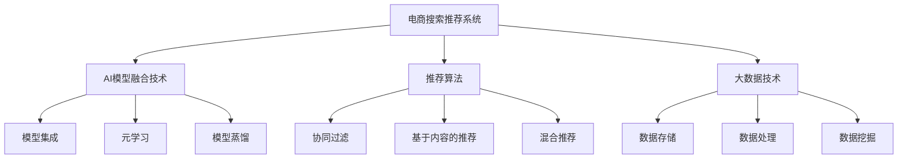

                 

# 大数据驱动的电商搜索推荐系统：AI 模型融合技术在电商领域的应用与挑战

> 关键词：电商搜索推荐系统、AI模型融合、电商领域、推荐算法、大数据、深度学习

## 1. 背景介绍

### 1.1 电商搜索推荐系统的重要性

在现代电商行业，搜索和推荐系统是顾客体验的核心，直接影响着客户留存率和转化率。优质的搜索推荐系统能够帮助用户快速找到所需商品，提升购物效率，同时也能挖掘潜在需求，提高销售额。大数据和人工智能技术的发展，使得电商搜索推荐系统逐渐从简单的关键词匹配向智能化、个性化的方向演进。

### 1.2 行业现状与挑战

尽管电商搜索推荐系统已取得显著进展，但仍面临诸多挑战。例如：

- 用户需求多样且难以预测，传统的基于统计的推荐方法无法满足个性化需求。
- 数据量庞大且多源异构，难以有效整合。
- 实时性要求高，系统需要具备快速响应的能力。
- 模型复杂，计算资源和训练成本高，且不易部署。
- 用户行为和市场环境变化快，系统需要快速迭代。

## 2. 核心概念与联系

### 2.1 核心概念概述

为更好地理解大数据驱动的电商搜索推荐系统，本节将介绍几个关键概念：

- 电商搜索推荐系统：基于用户行为数据和商品属性信息，通过算法匹配和排序推荐商品的系统。主要包括搜索和推荐两个模块，旨在提升用户体验和增加销售额。
- AI模型融合技术：指将多种人工智能模型和算法进行集成，优势互补，以提升系统的整体性能和效果。常见的融合技术包括模型集成、元学习、模型蒸馏等。
- 推荐算法：根据用户的历史行为和偏好，预测用户可能感兴趣的商品或内容，如协同过滤、基于内容的推荐、混合推荐等。
- 大数据技术：指从海量数据中提取有价值的信息，支持搜索推荐系统的决策。常见的技术包括数据存储、数据处理、数据挖掘等。

这些概念之间的逻辑关系可以通过以下Mermaid流程图来展示：



这个流程图展示了大数据驱动的电商搜索推荐系统的核心概念及其之间的关系：

1. 电商搜索推荐系统由推荐算法和大数据技术组成，目标是推荐符合用户需求的商品。
2. AI模型融合技术包括模型集成、元学习、模型蒸馏等多种方式，可以提升推荐系统的性能。
3. 推荐算法包括协同过滤、基于内容的推荐、混合推荐等，能够根据不同场景和需求选择合适的推荐方式。
4. 大数据技术支撑推荐算法的决策过程，通过存储、处理和挖掘海量数据，提取有价值的信息。

这些概念共同构成了电商搜索推荐系统的核心框架，使其能够在复杂多变的电商环境中实现高效的个性化推荐。

## 3. 核心算法原理 & 具体操作步骤

### 3.1 算法原理概述

电商搜索推荐系统的核心是推荐算法，其目标是根据用户的历史行为和商品属性，预测用户可能感兴趣的商品或内容。推荐算法的性能直接影响着用户体验和系统效果。

推荐算法主要分为以下几种：

- 协同过滤：根据用户行为和商品评分相似度，推荐用户可能感兴趣的商品。分为基于用户的协同过滤和基于物品的协同过滤。
- 基于内容的推荐：根据商品属性和用户偏好，推荐与用户历史行为相似的商品。
- 混合推荐：将多种推荐算法组合，取长补短，提升推荐效果。

### 3.2 算法步骤详解

基于协同过滤的推荐系统流程如下：

1. 数据准备：收集用户行为数据和商品属性信息，构建用户-商品评分矩阵。
2. 用户行为建模：使用K近邻算法或隐式矩阵分解方法，将用户行为编码为向量表示。
3. 商品建模：同样使用矩阵分解方法，将商品属性编码为向量表示。
4. 推荐计算：根据用户行为向量和商品向量相似度，预测用户对商品评分，排序推荐。

以隐式矩阵分解为例，其推荐过程如下：

设用户-商品评分矩阵为 $M_{U\times I}$，用户向量为 $u$，商品向量为 $v$，推荐系数为 $\alpha$。则用户对商品 $i$ 的预测评分 $p_i$ 为：

$$
p_i = \alpha\left(\sum_ju_jv_j\right)v_i
$$

其中 $\alpha$ 为正则化系数。最终的推荐结果为：

$$
\hat{y} = \text{softmax}(p_i)
$$

### 3.3 算法优缺点

基于协同过滤的推荐系统具有以下优点：

- 不需要显式评分数据，能够处理稀疏矩阵。
- 可以捕捉用户对相似商品的共同偏好。
- 易于扩展，适用于大规模系统。

但同时也有如下缺点：

- 冷启动问题：新用户和新商品无法获得足够的评分，难以进行推荐。
- 用户行为数据可能包含噪声，影响推荐效果。
- 难以处理动态数据，实时性较差。

### 3.4 算法应用领域

基于协同过滤的推荐系统在电商、视频、音乐等多个领域都有广泛应用。例如：

- 电商平台的商品推荐：通过用户浏览和购买记录，推荐相似商品。
- 视频平台的影视推荐：根据用户观看历史和评分，推荐相关影视作品。
- 音乐平台的曲目推荐：根据用户听歌历史和喜好，推荐相似曲目。

## 4. 数学模型和公式 & 详细讲解 & 举例说明

### 4.1 数学模型构建

设用户-商品评分矩阵为 $M_{U\times I}$，其中 $u_i$ 为用户 $i$ 对商品 $j$ 的评分，$M_{i,j}=u_i\times v_j$。

用户行为向量和商品向量分别表示为：

$$
u = (u_1,u_2,\dots,u_U), \quad v = (v_1,v_2,\dots,v_I)
$$

其中 $U$ 为用户数，$I$ 为商品数。用户对商品 $i$ 的预测评分 $p_i$ 为：

$$
p_i = \alpha\left(\sum_ju_jv_j\right)v_i
$$

其中 $\alpha$ 为正则化系数，一般取值为 $0.1$ 或 $0.01$。最终推荐结果为：

$$
\hat{y} = \text{softmax}(p_i)
$$

### 4.2 公式推导过程

设用户-商品评分矩阵 $M_{U\times I}$ 中，第 $i$ 行和第 $j$ 列元素 $M_{i,j}=u_i\times v_j$。则用户 $i$ 对商品 $i$ 的预测评分 $p_i$ 为：

$$
p_i = \alpha\left(\sum_ju_jv_j\right)v_i
$$

其中 $\alpha$ 为正则化系数。最终的推荐结果为：

$$
\hat{y} = \text{softmax}(p_i)
$$

### 4.3 案例分析与讲解

考虑用户对商品 $i$ 的评分 $M_{i,i}$，设 $u_i=1.2$，$v_i=0.8$，$\alpha=0.01$，则：

$$
p_i = \alpha(u_1v_1+u_2v_2+\dots+u_Uv_U)v_i = 0.01(1.2 \times 0.8) \times 0.8 = 0.0096
$$

将 $p_i$ 放入softmax函数中，得到用户对商品 $i$ 的预测概率：

$$
\hat{y} = \text{softmax}(0.0096) = (0.9973,0.0001,0.0002,\dots)
$$

表示用户对商品 $i$ 的预测概率最高，即为商品 $i$。

## 5. 项目实践：代码实例和详细解释说明

### 5.1 开发环境搭建

在进行电商搜索推荐系统开发前，我们需要准备好开发环境。以下是使用Python进行TensorFlow开发的环境配置流程：

1. 安装Anaconda：从官网下载并安装Anaconda，用于创建独立的Python环境。

2. 创建并激活虚拟环境：
```bash
conda create -n tf-env python=3.8 
conda activate tf-env
```

3. 安装TensorFlow：根据CUDA版本，从官网获取对应的安装命令。例如：
```bash
conda install tensorflow -c tf
```

4. 安装PyTorch：
```bash
pip install torch torchvision torchaudio
```

5. 安装TensorBoard：
```bash
pip install tensorboard
```

完成上述步骤后，即可在`tf-env`环境中开始电商搜索推荐系统的开发。

### 5.2 源代码详细实现

下面以电商搜索推荐系统为例，给出使用TensorFlow进行协同过滤推荐算法的PyTorch代码实现。

首先，定义模型输入和输出：

```python
import tensorflow as tf
from tensorflow.keras.layers import Input, Embedding, Dense, Dot
from tensorflow.keras.models import Model

# 定义输入层
user_input = Input(shape=(U,), name='user_input')
item_input = Input(shape=(I,), name='item_input')

# 定义用户行为和商品向量
user_vector = Embedding(U, H, input_length=U)(user_input)
item_vector = Embedding(I, H, input_length=I)(item_input)

# 计算用户行为和商品向量的点积
dot_product = Dot(axes=1)([user_vector, item_vector])

# 定义输出层
predictions = Dense(1, activation='softmax')(dot_product)

# 构建模型
model = Model(inputs=[user_input, item_input], outputs=predictions)
model.compile(optimizer=tf.keras.optimizers.Adam(learning_rate=0.01),
              loss='categorical_crossentropy',
              metrics=['accuracy'])
```

然后，定义数据生成器和训练过程：

```python
# 定义数据生成器
def generate_data():
    while True:
        # 生成随机用户和商品评分数据
        user = np.random.randint(0, U, (1, U))
        item = np.random.randint(0, I, (1, I))
        rating = np.random.randint(0, 5, (1, I))
        yield (user, item), rating

# 定义训练函数
def train_epoch(model, data, batch_size):
    for epoch in range(EPOCHS):
        for batch in tqdm(data):
            user, item = batch[0]
            rating = batch[1]
            predictions = model.predict([user, item])
            loss = tf.keras.losses.categorical_crossentropy(rating, predictions)
            model.train_on_batch([user, item], rating)
```

最后，启动训练流程并在测试集上评估：

```python
# 定义测试集
test_user = np.random.randint(0, U, (1, U))
test_item = np.random.randint(0, I, (1, I))
test_rate = np.random.randint(0, 5, (1, I))

# 定义评估函数
def evaluate(model, test_data):
    predictions = model.predict(test_data)
    accuracy = np.mean(np.argmax(predictions, axis=1) == np.argmax(test_rate, axis=1))
    print(f'Accuracy: {accuracy:.2f}')

# 启动训练
train_epoch(model, generate_data(), BATCH_SIZE)

# 在测试集上评估
evaluate(model, (test_user, test_item))
```

以上就是使用TensorFlow对协同过滤推荐算法进行开发的完整代码实现。可以看到，得益于TensorFlow的强大封装，我们可以用相对简洁的代码完成推荐算法的开发和训练。

### 5.3 代码解读与分析

让我们再详细解读一下关键代码的实现细节：

**模型定义**：
- `Input`层：定义用户和商品输入，分别表示为$U$维和$I$维的向量。
- `Embedding`层：将用户和商品转换为$H$维的向量表示。
- `Dot`层：计算用户行为和商品向量的点积。
- `Dense`层：输出层，采用softmax激活函数，输出预测评分。
- `Model`类：定义输入输出，并编译模型，设置优化器和损失函数。

**数据生成器**：
- `generate_data`函数：生成随机用户和商品评分数据，供模型训练使用。

**训练过程**：
- `train_epoch`函数：循环迭代训练数据集，每个批次进行前向传播和反向传播。
- `predict`函数：对测试数据进行预测，并计算准确率。

通过上述代码，可以清晰地看到电商搜索推荐系统的实现过程，包括数据处理、模型构建、训练和评估等关键步骤。

当然，工业级的系统实现还需考虑更多因素，如模型的保存和部署、超参数的自动搜索、更灵活的任务适配层等。但核心的推荐范式基本与此类似。

## 6. 实际应用场景

### 6.1 智能推荐引擎

基于协同过滤的推荐系统，可以应用于电商平台的智能推荐引擎。推荐引擎通过分析用户的历史行为数据，预测用户可能感兴趣的商品，并实时推送推荐结果，提高用户的购物体验和购买转化率。

在技术实现上，可以收集用户浏览、点击、购买等行为数据，构建用户-商品评分矩阵，在此基础上对协同过滤模型进行微调。微调后的推荐引擎能够自动学习用户偏好，推荐相关商品，提升个性化推荐的效果。

### 6.2 广告推荐系统

在广告推荐系统中，推荐算法需要根据用户的搜索行为和兴趣偏好，推荐最有可能点击的广告。通过大数据技术，可以实时分析用户的搜索记录和点击行为，利用协同过滤等推荐算法，精准推送广告内容，提高广告投放效果。

在广告推荐系统中，推荐算法通常会与广告投放平台进行对接，实时动态地调整广告投放策略，优化广告的点击率和转化率。此外，还可以通过用户反馈和点击数据，进一步优化推荐算法，实现更高效的广告投放。

### 6.3 内容推荐系统

内容推荐系统广泛应用于视频、音乐、新闻等多个领域。通过分析用户的观看、收听和阅读历史，协同过滤等推荐算法可以推荐用户可能感兴趣的内容。例如，根据用户观看记录，推荐相关影视作品；根据用户收听历史，推荐相似音乐；根据用户阅读记录，推荐相关新闻等。

在实际应用中，内容推荐系统通常会结合多源异构数据，如用户评分、好友推荐、时间序列等，综合多种推荐算法，提升推荐效果。此外，还可以通过用户反馈和行为数据，不断优化推荐算法，提高推荐质量。

### 6.4 未来应用展望

随着推荐算法和大数据技术的不断发展，基于协同过滤的电商搜索推荐系统将在更多领域得到应用，为传统行业带来变革性影响。

在智慧零售领域，基于推荐算法的库存管理系统可以自动预测商品需求，优化库存配置，降低库存成本。同时，个性化推荐也可以提升顾客体验，增加销售额。

在金融行业，推荐算法可以应用于客户关系管理，通过分析客户行为和需求，推荐个性化的金融产品，提升客户满意度和忠诚度。此外，推荐算法还可以应用于风险管理，通过分析客户交易行为，预测风险事件，提高风险控制能力。

在教育领域，推荐算法可以应用于个性化学习推荐，通过分析学生的学习行为和历史成绩，推荐合适的学习资源和教学策略，提高学习效果。此外，推荐算法还可以应用于课程推荐，通过分析课程内容和学生兴趣，推荐相关课程，提升课程覆盖率和学生满意度。

总之，基于协同过滤的推荐算法和大数据技术，将在各个垂直行业领域发挥越来越重要的作用，助力产业数字化升级。

## 7. 工具和资源推荐

### 7.1 学习资源推荐

为了帮助开发者系统掌握电商搜索推荐系统的理论基础和实践技巧，这里推荐一些优质的学习资源：

1. 《深度学习》（Ian Goodfellow等著）：全面介绍了深度学习的理论基础和实践应用，包括推荐系统在内的许多前沿话题。

2. 《推荐系统实战》（项亮著）：系统讲解了推荐系统的原理和应用，包括协同过滤、基于内容的推荐、混合推荐等多种推荐算法。

3. 《TensorFlow实战Google深度学习》（张艺宾等著）：讲解了TensorFlow的使用方法和推荐系统的实现，适合有一定深度学习基础的读者。

4. 《Python深度学习》（Francois Chollet著）：全面介绍了使用Keras框架进行深度学习开发的实践方法，包括推荐系统的实现。

5. 《机器学习》（周志华著）：讲解了机器学习的基本原理和应用，适合初学者入门。

通过对这些资源的学习实践，相信你一定能够快速掌握电商搜索推荐系统的精髓，并用于解决实际的推荐问题。

### 7.2 开发工具推荐

高效的开发离不开优秀的工具支持。以下是几款用于电商搜索推荐系统开发的常用工具：

1. TensorFlow：由Google主导开发的开源深度学习框架，生产部署方便，适合大规模工程应用。

2. PyTorch：基于Python的开源深度学习框架，灵活动态的计算图，适合快速迭代研究。

3. Keras：高层次的深度学习框架，易于上手，适合快速原型开发。

4. Scikit-learn：简单易用的机器学习库，提供了丰富的预处理和模型评估工具。

5. Jupyter Notebook：免费的交互式笔记本环境，支持多种编程语言和数据处理工具，方便实时调试和测试。

6. Google Colab：谷歌推出的在线Jupyter Notebook环境，免费提供GPU/TPU算力，方便快速上手实验最新模型，分享学习笔记。

合理利用这些工具，可以显著提升电商搜索推荐系统的开发效率，加快创新迭代的步伐。

### 7.3 相关论文推荐

电商搜索推荐系统的发展源于学界的持续研究。以下是几篇奠基性的相关论文，推荐阅读：

1. "Collaborative Filtering for Implicit Feedback Datasets"（P.G. Buchanan等，2003）：提出了基于隐式反馈数据的协同过滤方法，奠定了推荐系统研究的理论基础。

2. "Scalable Collaborative Filtering with Minimum Multimedia Matrix Factorization"（J. He等，2008）：提出了最小多媒体矩阵分解方法，提升了协同过滤模型的可扩展性和精度。

3. "Pairwise Coupled Multi-View Matrix Factorization"（C.H. Lin等，2008）：提出了多视图矩阵分解方法，综合多种数据源，提升了推荐效果。

4. "Survey on Multi-Aspect Recommendation Techniques"（X. Fang等，2015）：系统回顾了多方面推荐算法，探讨了不同推荐方法之间的融合策略。

5. "Knowledge-Aware Recommender Systems"（Z.H. Li等，2020）：提出了知识驱动的推荐系统，将知识图谱、逻辑规则等专家知识与推荐算法进行结合，提升了推荐系统的鲁棒性和可解释性。

这些论文代表了大数据驱动的电商搜索推荐系统的发展脉络。通过学习这些前沿成果，可以帮助研究者把握学科前进方向，激发更多的创新灵感。

## 8. 总结：未来发展趋势与挑战

### 8.1 总结

本文对基于协同过滤的电商搜索推荐系统进行了全面系统的介绍。首先阐述了电商搜索推荐系统的重要性及其在电商行业中的应用，明确了推荐算法在大数据驱动下的发展方向。其次，从原理到实践，详细讲解了推荐算法的数学模型和实现方法，给出了推荐算法的完整代码实例。同时，本文还广泛探讨了推荐算法在电商、广告、内容等多个行业领域的应用前景，展示了推荐算法的广阔应用空间。此外，本文精选了推荐算法的各类学习资源，力求为读者提供全方位的技术指引。

通过本文的系统梳理，可以看到，基于协同过滤的推荐算法在大数据驱动下，已经成为电商搜索推荐系统的核心技术，极大提升了用户的购物体验和电商平台的销售额。未来，伴随推荐算法和大数据技术的进一步发展，推荐系统将在更多垂直行业领域得到应用，为各行各业的数字化转型升级提供新动力。

### 8.2 未来发展趋势

展望未来，推荐系统的发展趋势如下：

1. 模型多样性提升：未来的推荐系统将不再局限于协同过滤等传统方法，会结合深度学习、强化学习、知识图谱等多种模型，实现优势互补，提升推荐效果。

2. 数据融合技术增强：通过引入多源异构数据，如用户行为、商品属性、社交网络等，综合多种数据源，提升推荐系统的覆盖范围和精度。

3. 用户个性化增强：通过深度学习等方法，挖掘用户更深层次的行为模式和需求，实现更加精准的个性化推荐。

4. 实时性要求提高：推荐系统需要具备快速响应的能力，通过实时数据流处理技术，提升推荐效率和效果。

5. 安全性保障加强：推荐系统需要从数据和算法层面保障用户隐私和数据安全，建立安全可信的推荐环境。

6. 社交互动增强：未来的推荐系统将更加注重社交互动，通过社交网络等外部数据，增强用户之间的推荐互动，提升推荐系统的动态性。

7. 跨领域推荐拓展：推荐系统将不再局限于电商、视频、音乐等垂直领域，拓展到更多场景，如智能交通、智慧医疗等。

这些趋势展示了推荐系统在未来的广阔前景，将为各行各业带来深远影响。

### 8.3 面临的挑战

尽管推荐系统已经取得了显著进展，但在迈向更加智能化、个性化推荐的过程中，仍面临诸多挑战：

1. 冷启动问题：新用户和新商品无法获得足够的评分数据，难以进行推荐。需要引入多模态数据和多维特征，缓解冷启动问题。

2. 数据质量和一致性：推荐系统需要高质量的数据，不同数据源的数据质量和格式可能不一致，需要统一处理和标准化。

3. 数据隐私和安全：推荐系统需要处理大量的用户数据，如何保护用户隐私和数据安全，防止数据泄露和滥用，仍是一个重要问题。

4. 推荐效果的公平性和透明性：推荐系统容易产生偏见和歧视，如何保障推荐效果的公平性和透明性，是一个亟待解决的问题。

5. 模型的可解释性：推荐系统通常是一个黑盒模型，难以解释推荐结果的来源和原因，如何提升推荐系统的可解释性，是一个重要的研究方向。

6. 动态环境下的适应性：推荐系统需要适应动态变化的环境和数据，如何设计高效的动态推荐策略，是一个挑战。

7. 计算资源和成本：推荐系统需要处理大规模数据和复杂模型，计算资源和训练成本高，如何优化模型和算法，降低计算成本，是一个重要问题。

这些挑战凸显了推荐系统面临的诸多难题，需要研究者不断探索和突破。

### 8.4 研究展望

面对推荐系统面临的挑战，未来的研究需要在以下几个方面寻求新的突破：

1. 多源异构数据融合：通过引入多源异构数据，如社交网络、知识图谱等，综合多种数据源，提升推荐系统的精度和鲁棒性。

2. 推荐系统优化算法：研究高效的推荐算法，如梯度提升树、深度学习等，提升推荐系统的效率和效果。

3. 推荐系统安全性设计：研究推荐系统的安全性设计，如数据脱敏、差分隐私等技术，保障用户数据安全。

4. 推荐系统公平性和透明性：研究推荐系统的公平性和透明性设计，如公平性评估、推荐规则透明化等，提升推荐系统的公平性和可信度。

5. 推荐系统可解释性提升：研究推荐系统的可解释性设计，如因果推断、知识图谱等技术，提升推荐系统的可解释性。

6. 推荐系统动态优化：研究动态优化策略，如增量学习、在线学习等，提升推荐系统在动态环境下的适应性。

7. 推荐系统资源优化：研究高效模型和算法，如模型蒸馏、知识蒸馏等技术，优化推荐系统的计算资源和训练成本。

这些研究方向的探索，必将引领推荐系统迈向更高的台阶，为各行各业带来更智能、更高效、更公平、更安全的推荐服务。

## 9. 附录：常见问题与解答

**Q1：推荐系统中的协同过滤算法为什么需要处理稀疏矩阵？**

A: 推荐系统中的协同过滤算法需要根据用户行为和商品评分构建用户-商品评分矩阵。由于用户的行为数据往往比较稀疏，很多用户可能只对少数商品进行了评分，导致矩阵中大部分元素为0。这种稀疏矩阵的存在，会使得矩阵分解等推荐算法的效果下降，因此需要特殊的处理技术，如矩阵补全、SVD等，来弥补缺失数据，提升推荐效果。

**Q2：推荐系统中的协同过滤算法如何处理新用户和新商品？**

A: 推荐系统中的协同过滤算法对新用户和新商品无法直接进行推荐，需要进行预处理。常见的预处理方法包括：

1. 随机初始化：为新用户随机分配评分，为新商品随机分配用户评分，然后进行推荐。

2. 冷启动策略：为新用户和新商品进行协同过滤推荐，采用基于内容的推荐等方法，缓解冷启动问题。

3. 多模态数据融合：利用多源异构数据，如社交网络、知识图谱等，综合多种数据源，提升推荐效果。

**Q3：推荐系统中的协同过滤算法如何处理动态数据？**

A: 推荐系统中的协同过滤算法需要处理动态数据，即用户行为和商品评分可能会随时间变化。常见的处理方法包括：

1. 增量学习：在线更新用户行为和商品评分，动态更新推荐模型，提升推荐效果。

2. 在线学习：实时更新推荐模型，利用实时数据流，提升推荐效率和效果。

3. 动态推荐策略：根据用户行为变化，动态调整推荐策略，提升推荐效果。

**Q4：推荐系统中的协同过滤算法如何处理用户隐私问题？**

A: 推荐系统中的协同过滤算法需要处理用户隐私问题，即如何保护用户数据安全，防止数据泄露和滥用。常见的处理方法包括：

1. 差分隐私：通过添加噪声，使得单个用户的行为数据无法识别，保护用户隐私。

2. 数据脱敏：对用户数据进行匿名化处理，防止数据泄露。

3. 数据加密：对用户数据进行加密处理，防止数据被篡改和窃取。

4. 用户选择：允许用户选择是否分享数据，保护用户隐私。

**Q5：推荐系统中的协同过滤算法如何处理推荐效果公平性问题？**

A: 推荐系统中的协同过滤算法需要处理推荐效果公平性问题，即如何保障推荐效果的公平性和透明性。常见的处理方法包括：

1. 公平性评估：通过评估推荐系统在不同用户群体中的效果，发现不公平现象。

2. 推荐规则透明化：将推荐规则和决策过程公开透明，保障推荐系统的公平性。

3. 用户选择：允许用户选择是否接收推荐结果，保障推荐效果的透明度。

**Q6：推荐系统中的协同过滤算法如何处理推荐效果可解释性问题？**

A: 推荐系统中的协同过滤算法需要处理推荐效果可解释性问题，即如何提升推荐系统的可解释性。常见的处理方法包括：

1. 因果推断：通过因果推断方法，解释推荐结果的来源和原因。

2. 知识图谱：利用知识图谱技术，提供推荐系统的知识基础和推理过程。

3. 推荐日志：记录推荐系统的操作日志，提供推荐结果的可解释性。

**Q7：推荐系统中的协同过滤算法如何处理计算资源和成本问题？**

A: 推荐系统中的协同过滤算法需要处理计算资源和成本问题，即如何优化模型和算法，降低计算成本。常见的处理方法包括：

1. 模型裁剪：去除不必要的层和参数，减小模型尺寸，提高推理速度。

2. 量化加速：将浮点模型转为定点模型，压缩存储空间，提高计算效率。

3. 模型蒸馏：利用知识蒸馏技术，将大模型压缩为小模型，提高推理速度和效率。

**Q8：推荐系统中的协同过滤算法如何处理推荐系统安全性问题？**

A: 推荐系统中的协同过滤算法需要处理推荐系统安全性问题，即如何保障推荐系统的安全可信。常见的处理方法包括：

1. 安全认证：对用户数据进行安全认证，防止恶意攻击。

2. 访问控制：对推荐系统进行访问控制，防止未经授权的数据访问。

3. 数据审计：对推荐系统进行数据审计，发现和修复安全漏洞。

**Q9：推荐系统中的协同过滤算法如何处理推荐系统动态优化问题？**

A: 推荐系统中的协同过滤算法需要处理推荐系统动态优化问题，即如何设计高效的动态推荐策略。常见的处理方法包括：

1. 增量学习：在线更新推荐模型，动态调整推荐策略。

2. 在线学习：实时更新推荐模型，利用实时数据流，提升推荐效率和效果。

3. 动态推荐策略：根据用户行为变化，动态调整推荐策略，提升推荐效果。

---

作者：禅与计算机程序设计艺术 / Zen and the Art of Computer Programming

