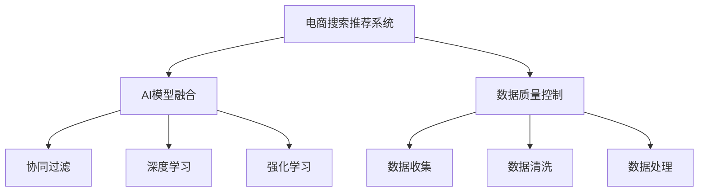

                 

# 大数据驱动的电商搜索推荐系统：AI 模型融合是核心，数据质量控制是关键

## 1. 背景介绍

随着互联网技术的飞速发展，电子商务平台已经逐渐成为人们日常生活的一部分。无论是线上购物、出行、社交，还是在线教育、金融、医疗，电商平台的智能搜索推荐系统都在背后默默支撑着用户的信息获取和决策过程。特别是在数据驱动的大背景下，AI模型逐渐成为电商搜索推荐系统的核心动力。然而，模型的核心不在于算法的复杂性，而在于如何将算法的优势充分发挥，将数据的质量和量级最大化利用。本文将重点讨论电商搜索推荐系统中AI模型的融合方式和数据质量控制的策略。

## 2. 核心概念与联系

### 2.1 核心概念概述

在大数据驱动的电商搜索推荐系统中，涉及的核心概念包括：

- **电商搜索推荐系统**：利用用户行为数据和产品特征信息，构建搜索推荐模型，为用户提供个性化搜索结果和商品推荐，以提高用户购物体验和平台转化率。
- **AI模型融合**：通过将不同的AI算法（如协同过滤、深度学习、强化学习等）进行有机结合，以充分发挥各类算法在特定任务上的优势，构建更精确、鲁棒的搜索推荐系统。
- **数据质量控制**：在数据收集、存储、清洗、处理等各个环节，采取严格的控制策略，确保数据的高质量和高可用性，为AI模型提供良好的训练基础。

这些核心概念之间的逻辑关系可以通过以下Mermaid流程图来展示：



该流程图展示了电商搜索推荐系统的构建过程：

1. 电商搜索推荐系统通过数据质量控制获取高质量的数据。
2. 数据经过收集、清洗和处理后，与AI模型融合，通过协同过滤、深度学习和强化学习等算法构建搜索推荐模型。
3. AI模型融合不仅将各类算法结合，还考虑了模型之间的参数共享和优化策略，以提升模型性能。

## 3. 核心算法原理 & 具体操作步骤

### 3.1 算法原理概述

电商搜索推荐系统涉及的算法可以分为两大类：

- **协同过滤**：基于用户和产品间的相似度，构建推荐模型。协同过滤算法分为基于用户的协同过滤和基于物品的协同过滤，前者通过找到与目标用户行为相似的用户，推荐其感兴趣的商品；后者则通过查找与目标商品相似的其他商品，推荐给用户。
- **深度学习**：使用神经网络模型，直接从用户和产品特征中学习推荐关系。常见的深度学习模型包括自编码器、神经协同过滤和序列推荐模型等。
- **强化学习**：通过与环境的交互，优化推荐策略。在电商搜索推荐系统中，强化学习算法通常用于优化推荐策略，提高用户体验和平台收益。

### 3.2 算法步骤详解

#### 协同过滤算法的步骤详解

1. **数据准备**：收集用户行为数据（如浏览、点击、购买等）和产品特征数据（如标题、描述、价格等）。
2. **相似度计算**：计算用户或物品之间的相似度。基于用户的协同过滤算法使用皮尔逊相关系数、余弦相似度等方法；基于物品的协同过滤算法使用矩阵分解方法。
3. **推荐计算**：根据相似度计算结果，进行推荐计算。用户协同过滤推荐公式为$\hat{r}_{ui} = \sum_{v \in N(u)} r_{vi} p_{uv}$，其中$N(u)$是用户$u$的邻居集合，$p_{uv}$是邻居$v$对物品$i$的评分，$r_{vi}$是邻居$v$对物品$i$的真实评分。
4. **模型训练**：使用交叉验证或在线学习算法，对协同过滤模型进行训练。

#### 深度学习模型的步骤详解

1. **数据预处理**：对用户和产品特征数据进行归一化、编码、分词等预处理操作。
2. **模型构建**：使用神经网络模型，如深度神经网络（DNN）、卷积神经网络（CNN）、循环神经网络（RNN）等，构建推荐模型。
3. **模型训练**：使用交叉熵损失函数，使用随机梯度下降（SGD）等优化算法，对模型进行训练。
4. **模型评估**：使用准确率、召回率、F1值等指标，评估模型性能。

#### 强化学习算法的步骤详解

1. **环境定义**：定义电商搜索推荐系统中的环境，包括状态、动作、奖励等。
2. **模型训练**：使用Q-learning、SARSA等算法，训练推荐策略模型。
3. **策略执行**：在实际搜索推荐过程中，使用训练好的策略模型，实时调整推荐策略。
4. **模型评估**：通过A/B测试、用户反馈等方法，评估强化学习模型的效果。

### 3.3 算法优缺点

#### 协同过滤算法的优缺点

**优点**：
- 不需要产品特征数据，只依赖用户行为数据。
- 简单易实现，对冷启动问题有较好的解决能力。

**缺点**：
- 对稀疏数据处理效果不佳，容易产生“邻居节点”过于稀疏的问题。
- 无法处理隐性反馈，只能处理显性反馈（如评分、点击等）。

#### 深度学习算法的优缺点

**优点**：
- 能够处理隐性反馈数据。
- 模型具有较强的泛化能力，能够处理复杂的非线性关系。

**缺点**：
- 对数据量需求较大，需要较长的训练时间。
- 对数据质量要求较高，容易过拟合。

#### 强化学习算法的优缺点

**优点**：
- 能够实时调整推荐策略，适应用户的即时需求。
- 能够优化推荐策略，提升用户满意度。

**缺点**：
- 需要大量的实际数据进行训练。
- 算法实现复杂，需要较多的计算资源。

### 3.4 算法应用领域

电商搜索推荐系统中的AI模型融合和数据质量控制，主要应用于以下领域：

- **搜索排序**：使用深度学习模型对搜索结果进行排序，提高搜索结果的相关性和多样性。
- **个性化推荐**：使用协同过滤、深度学习等算法，为用户推荐个性化商品。
- **广告投放**：使用强化学习算法，优化广告投放策略，提高广告效果和收益。
- **用户行为分析**：使用深度学习模型，分析用户行为特征，预测用户未来行为。

## 4. 数学模型和公式 & 详细讲解 & 举例说明

### 4.1 数学模型构建

在电商搜索推荐系统中，常用的数学模型包括协同过滤模型、深度学习模型和强化学习模型。这里以协同过滤和深度学习模型为例，介绍数学模型的构建过程。

#### 协同过滤模型的数学模型

协同过滤模型通常使用矩阵分解方法，将用户-物品评分矩阵分解为两个低维矩阵$U$和$V$。设$U$为$N \times K$的矩阵，$V$为$K \times M$的矩阵，其中$N$为用户数，$M$为物品数，$K$为隐因子数。用户$i$对物品$j$的评分预测值$r_{ij}$为$U_{i,:} \cdot V_{j,:}$，其中$U_{i,:}$和$V_{j,:}$分别为用户$i$和物品$j$的隐因子表示。

#### 深度学习模型的数学模型

深度学习模型通常使用神经网络模型，如DNN、CNN、RNN等。以DNN模型为例，设$x$为用户特征向量，$w$为模型参数，$y$为物品特征向量，$h$为隐藏层输出，$z$为输出层输出，则模型可以表示为：

$$
y = \sigma(z) = \sigma(Wx + b)
$$

其中$W$和$b$为模型参数，$\sigma$为激活函数。

### 4.2 公式推导过程

#### 协同过滤模型的公式推导

协同过滤模型的训练目标为最小化预测评分和真实评分之间的差距。设$r_{ui}$为用户$i$对物品$u$的真实评分，$\hat{r}_{ui}$为预测评分，则损失函数为：

$$
L = \frac{1}{N} \sum_{i=1}^N \sum_{j=1}^M (r_{ui} - \hat{r}_{ui})^2
$$

其中$N$为用户的数量，$M$为物品的数量。使用梯度下降法求解模型参数$U$和$V$：

$$
U^{t+1} = U^t - \alpha \frac{\partial L}{\partial U} = U^t - \alpha \frac{\partial (U^T V^T - R)^T (U^T V^T - R)}{\partial U}
$$

其中$R$为用户-物品评分矩阵，$\alpha$为学习率。

#### 深度学习模型的公式推导

深度学习模型通常使用反向传播算法进行训练。设$J$为损失函数，$z$为输出层输入，$y$为输出层目标值，则梯度下降法更新模型参数$w$：

$$
w^{t+1} = w^t - \alpha \frac{\partial J}{\partial w}
$$

其中$\alpha$为学习率。反向传播算法通过链式法则计算损失函数对每个参数的梯度。

### 4.3 案例分析与讲解

#### 协同过滤模型的案例分析

假设有一个电商平台，收集了1000个用户和1000个商品的评分数据。使用协同过滤模型对用户和商品进行评分预测，假设$K=5$。首先，使用矩阵分解方法将评分矩阵分解为$U$和$V$，然后将$U$和$V$相乘得到预测评分矩阵$\hat{R}$。接着，使用梯度下降法更新$U$和$V$，最小化预测评分与真实评分之间的差距。最终，可以得到对任意用户和商品的评分预测值。

#### 深度学习模型的案例分析

假设有一个电商平台，收集了1000个用户和1000个商品的特征数据。使用深度学习模型对用户和商品进行评分预测，假设网络结构为输入层-隐藏层-输出层，隐藏层神经元数为50。首先，将用户特征向量$x$和物品特征向量$y$输入网络，得到隐藏层输出$h$。接着，将$h$输入输出层，得到预测评分$z$。然后，使用梯度下降法更新网络参数$w$和$b$，最小化预测评分与真实评分之间的差距。最终，可以得到对任意用户和商品的评分预测值。

## 5. 项目实践：代码实例和详细解释说明

### 5.1 开发环境搭建

在进行电商搜索推荐系统开发前，我们需要准备好开发环境。以下是使用Python进行PyTorch开发的环境配置流程：

1. 安装Anaconda：从官网下载并安装Anaconda，用于创建独立的Python环境。

2. 创建并激活虚拟环境：
```bash
conda create -n pytorch-env python=3.8 
conda activate pytorch-env
```

3. 安装PyTorch：根据CUDA版本，从官网获取对应的安装命令。例如：
```bash
conda install pytorch torchvision torchaudio cudatoolkit=11.1 -c pytorch -c conda-forge
```

4. 安装Transformers库：
```bash
pip install transformers
```

5. 安装各类工具包：
```bash
pip install numpy pandas scikit-learn matplotlib tqdm jupyter notebook ipython
```

完成上述步骤后，即可在`pytorch-env`环境中开始电商搜索推荐系统的开发。

### 5.2 源代码详细实现

这里以协同过滤和深度学习模型的实现为例，给出使用PyTorch和Transformers库进行电商搜索推荐系统微调的代码实现。

#### 协同过滤模型的实现

```python
import torch
import numpy as np
from torch import nn

# 假设我们已经收集到了用户-物品评分矩阵R
R = np.random.rand(1000, 1000)

# 假设已经进行了矩阵分解，得到了U和V矩阵
U = np.random.rand(1000, 5)
V = np.random.rand(5, 1000)

# 定义协同过滤模型的预测函数
class CollaborativeFilteringModel(nn.Module):
    def __init__(self, U, V):
        super(CollaborativeFilteringModel, self).__init__()
        self.U = nn.Parameter(U)
        self.V = nn.Parameter(V)

    def forward(self, x, y):
        prediction = self.U[x] @ self.V[y]
        return prediction

# 初始化模型
model = CollaborativeFilteringModel(U, V)

# 定义损失函数
criterion = nn.MSELoss()

# 定义优化器
optimizer = torch.optim.Adam(model.parameters(), lr=0.01)

# 定义训练函数
def train(model, R, criterion, optimizer, num_epochs):
    for epoch in range(num_epochs):
        for i in range(R.shape[0]):
            for j in range(R.shape[1]):
                prediction = model(i, j)
                loss = criterion(prediction, R[i, j])
                optimizer.zero_grad()
                loss.backward()
                optimizer.step()

# 训练模型
train(model, R, criterion, optimizer, num_epochs=10)

# 定义预测函数
def predict(model, x, y):
    prediction = model(x, y)
    return prediction.item()

# 预测评分
x = 0
y = 0
print(predict(model, x, y))
```

#### 深度学习模型的实现

```python
import torch
import numpy as np
from torch import nn

# 假设我们已经收集到了用户和物品的特征向量
X = np.random.rand(1000, 10)
Y = np.random.rand(1000, 5)

# 定义深度学习模型的预测函数
class DNNModel(nn.Module):
    def __init__(self, input_dim, hidden_dim, output_dim):
        super(DNNModel, self).__init__()
        self.fc1 = nn.Linear(input_dim, hidden_dim)
        self.fc2 = nn.Linear(hidden_dim, output_dim)

    def forward(self, x):
        x = torch.sigmoid(self.fc1(x))
        x = torch.sigmoid(self.fc2(x))
        return x

# 初始化模型
input_dim = 10
hidden_dim = 50
output_dim = 5
model = DNNModel(input_dim, hidden_dim, output_dim)

# 定义损失函数
criterion = nn.MSELoss()

# 定义优化器
optimizer = torch.optim.Adam(model.parameters(), lr=0.01)

# 定义训练函数
def train(model, X, Y, criterion, optimizer, num_epochs):
    for epoch in range(num_epochs):
        for i in range(X.shape[0]):
            x = torch.tensor(X[i, :])
            y = torch.tensor(Y[i, :])
            prediction = model(x)
            loss = criterion(prediction, y)
            optimizer.zero_grad()
            loss.backward()
            optimizer.step()

# 训练模型
train(model, X, Y, criterion, optimizer, num_epochs=10)

# 定义预测函数
def predict(model, x):
    prediction = model(x)
    return prediction.item()

# 预测评分
x = torch.tensor([0])
print(predict(model, x))
```

### 5.3 代码解读与分析

#### 协同过滤模型的代码解读

1. 假设我们已经有用户-物品评分矩阵R，将其作为输入。
2. 假设我们已经进行了矩阵分解，得到了U和V矩阵，将其作为模型参数。
3. 定义协同过滤模型的预测函数，输入用户和物品的索引，返回预测评分。
4. 定义损失函数，使用均方误差损失。
5. 定义优化器，使用Adam优化器。
6. 定义训练函数，遍历评分矩阵中的每个用户-物品对，计算预测评分与真实评分之间的差距，使用梯度下降法更新模型参数。
7. 训练模型，设置训练轮数。
8. 定义预测函数，输入用户和物品的索引，返回预测评分。
9. 预测评分，返回预测值。

#### 深度学习模型的代码解读

1. 假设我们已经有用户和物品的特征向量X和Y，将其作为输入。
2. 定义深度学习模型的预测函数，输入特征向量，返回预测评分。
3. 定义损失函数，使用均方误差损失。
4. 定义优化器，使用Adam优化器。
5. 定义训练函数，遍历特征向量中的每个用户，计算预测评分与真实评分之间的差距，使用梯度下降法更新模型参数。
6. 训练模型，设置训练轮数。
7. 定义预测函数，输入特征向量，返回预测评分。
8. 预测评分，返回预测值。

## 6. 实际应用场景

### 6.1 智能搜索推荐系统

智能搜索推荐系统是电商搜索推荐系统的重要应用之一，通过将协同过滤、深度学习和强化学习等算法结合，能够实现精准推荐和个性化搜索。以阿里巴巴的天猫为例，其智能搜索推荐系统通过协同过滤算法对用户历史行为进行分析，使用深度学习模型对搜索结果进行排序，并使用强化学习算法优化推荐策略，显著提升了用户体验和平台转化率。

### 6.2 广告投放优化

广告投放优化是电商搜索推荐系统的另一个重要应用。通过使用深度学习模型分析用户行为数据，可以构建用户画像，预测用户对广告的反应。使用强化学习算法，可以实时调整广告投放策略，优化广告效果和收益。例如，亚马逊的个性化广告推荐系统，通过深度学习模型和强化学习算法，实现了广告投放的智能化和自动化。

### 6.3 库存管理

库存管理是电商搜索推荐系统在供应链管理中的应用。通过使用协同过滤和深度学习算法，可以预测商品的销售情况，优化库存管理策略。例如，京东的库存管理系统通过协同过滤算法和深度学习模型，实现了商品的自动补货和库存优化。

### 6.4 未来应用展望

随着电商搜索推荐系统的发展，未来将有更多的应用场景和创新技术涌现。例如：

- **跨领域推荐**：将不同领域的推荐系统进行融合，实现跨领域的推荐。例如，将电商推荐和旅游推荐进行融合，为用户推荐旅游商品。
- **实时推荐**：通过使用流式数据处理技术，实现实时推荐。例如，在用户进行实时搜索时，立即给出个性化推荐结果。
- **社交推荐**：将社交网络数据融入推荐系统，实现社交推荐。例如，根据用户的朋友行为数据，推荐用户可能感兴趣的商品。

## 7. 工具和资源推荐

### 7.1 学习资源推荐

为了帮助开发者系统掌握电商搜索推荐系统的开发和优化技术，这里推荐一些优质的学习资源：

1. 《深度学习实战》：该书详细介绍了深度学习模型的构建和优化，适用于电商搜索推荐系统的开发。
2. 《推荐系统实战》：该书涵盖了协同过滤、深度学习和强化学习等算法，适用于电商搜索推荐系统的综合学习。
3. 《Python深度学习》：该书介绍了深度学习模型的构建和优化，适用于电商搜索推荐系统的开发和优化。

### 7.2 开发工具推荐

高效的开发离不开优秀的工具支持。以下是几款用于电商搜索推荐系统开发的常用工具：

1. PyTorch：基于Python的开源深度学习框架，灵活动态的计算图，适合快速迭代研究。大部分深度学习模型都有PyTorch版本的实现。
2. TensorFlow：由Google主导开发的开源深度学习框架，生产部署方便，适合大规模工程应用。同样有丰富的深度学习模型资源。
3. Transformers库：HuggingFace开发的NLP工具库，集成了众多SOTA语言模型，支持PyTorch和TensorFlow，是进行电商搜索推荐系统微调的重要工具。
4. Weights & Biases：模型训练的实验跟踪工具，可以记录和可视化模型训练过程中的各项指标，方便对比和调优。与主流深度学习框架无缝集成。
5. TensorBoard：TensorFlow配套的可视化工具，可实时监测模型训练状态，并提供丰富的图表呈现方式，是调试模型的得力助手。
6. Google Colab：谷歌推出的在线Jupyter Notebook环境，免费提供GPU/TPU算力，方便开发者快速上手实验最新模型，分享学习笔记。

### 7.3 相关论文推荐

电商搜索推荐系统的发展源于学界的持续研究。以下是几篇奠基性的相关论文，推荐阅读：

1. Parallel Matrix Factorization for Recommender Systems：提出并行矩阵分解算法，解决协同过滤模型在大数据下的计算问题。
2. Collaborative Filtering for Implicit Feedback Datasets：提出基于隐性反馈的协同过滤算法，解决用户评分数据稀疏的问题。
3. Deep Collaborative Filtering：提出深度学习模型进行协同过滤，解决协同过滤模型的隐因子维度和训练时间问题。
4. Click-Through Rate Prediction and Treatment Effect Estimation Using Deep Learning：提出深度学习模型进行点击率预测，解决深度学习模型对用户行为数据的处理问题。
5. Reinforcement Learning for Recommender Systems：提出强化学习算法进行推荐策略优化，解决推荐策略的实时调整问题。

这些论文代表了大数据驱动的电商搜索推荐系统的研究进展，通过学习这些前沿成果，可以帮助研究者把握学科前进方向，激发更多的创新灵感。

## 8. 总结：未来发展趋势与挑战

### 8.1 研究成果总结

本文对基于AI模型融合的电商搜索推荐系统进行了全面系统的介绍。首先阐述了电商搜索推荐系统的背景和核心概念，明确了AI模型融合和数据质量控制在其中的关键作用。其次，从原理到实践，详细讲解了协同过滤、深度学习和强化学习等算法的融合方式，以及数据收集、清洗、处理等环节的质量控制策略。最后，通过实际应用场景和未来应用展望，展示了AI模型融合和数据质量控制在电商搜索推荐系统中的重要价值。

通过本文的系统梳理，可以看到，基于AI模型融合的电商搜索推荐系统已经成为电商行业智能化转型的重要驱动力，将极大地提升用户体验和平台收益。AI模型融合不仅能够解决电商搜索推荐系统中的复杂问题，还能够拓展到更多领域，为各行各业的智能化转型提供技术支持。

### 8.2 未来发展趋势

展望未来，电商搜索推荐系统的发展将呈现以下几个趋势：

1. **模型多样性增强**：随着技术的发展，电商搜索推荐系统将越来越多地使用多样化的模型，如神经网络、深度强化学习、生成对抗网络（GAN）等，以提升推荐效果和用户体验。
2. **数据质量提升**：电商搜索推荐系统将更加注重数据的质量和量级，通过数据清洗、数据增强等技术，提高数据的高质量和可用性。
3. **实时推荐优化**：通过使用流式数据处理技术，实现实时推荐，提升用户满意度和平台收益。
4. **跨领域推荐扩展**：将不同领域的推荐系统进行融合，实现跨领域的推荐，拓展电商搜索推荐系统的应用范围。
5. **社交推荐引入**：将社交网络数据融入推荐系统，实现社交推荐，提升推荐系统的多样性和个性化。

### 8.3 面临的挑战

尽管电商搜索推荐系统已经取得了瞩目成就，但在迈向更加智能化、普适化应用的过程中，它仍面临以下挑战：

1. **模型复杂度**：随着模型的多样性增强，模型的复杂度也会随之增加，导致训练时间和计算资源的消耗增加。
2. **数据获取难度**：电商搜索推荐系统需要大量的用户行为数据和产品特征数据，数据的获取难度和成本较高。
3. **隐私保护**：电商搜索推荐系统需要收集和分析用户数据，如何保护用户隐私，防止数据泄露和滥用，是一个重要的挑战。
4. **推荐公平性**：电商搜索推荐系统需要避免对某些用户或商品产生偏见，确保推荐的公平性。
5. **性能优化**：电商搜索推荐系统需要在大规模数据上实时处理和推荐，如何优化性能，提高推荐速度和效率，是一个重要的研究方向。

### 8.4 研究展望

面向未来，电商搜索推荐系统的研究需要在以下几个方面寻求新的突破：

1. **混合模型优化**：探索将不同模型进行混合优化的策略，提高推荐的准确性和多样性。
2. **自适应推荐**：开发自适应推荐算法，根据用户的行为和兴趣动态调整推荐策略。
3. **推荐算法协同**：探索多种推荐算法协同优化的策略，提升推荐的整体效果。
4. **数据增强技术**：研究数据增强技术，提高数据的质量和量级，提升模型的效果。
5. **隐私保护技术**：研究隐私保护技术，保护用户隐私，防止数据泄露和滥用。

这些研究方向的探索，必将引领电商搜索推荐系统迈向更高的台阶，为电商行业和用户带来更多的价值和体验。相信随着学界和产业界的共同努力，电商搜索推荐系统将不断进化，为智能电商时代的到来提供技术支撑。

## 9. 附录：常见问题与解答

**Q1：电商搜索推荐系统中如何实现个性化推荐？**

A: 电商搜索推荐系统中，实现个性化推荐的核心在于深度学习模型的构建和优化。首先，收集用户行为数据（如浏览、点击、购买等）和产品特征数据（如标题、描述、价格等）。然后，使用深度学习模型（如DNN、CNN、RNN等）对用户和产品特征进行建模，构建个性化推荐模型。最后，根据模型输出，对用户进行个性化推荐。

**Q2：电商搜索推荐系统中的协同过滤算法如何处理稀疏数据？**

A: 电商搜索推荐系统中的协同过滤算法通常使用矩阵分解方法，对稀疏数据进行处理。首先，使用矩阵分解方法将用户-物品评分矩阵分解为两个低维矩阵U和V。然后，根据用户和物品的隐因子表示，预测用户对物品的评分。如果评分矩阵中的用户-物品对较少，可以通过数据增强、算法优化等技术，提升协同过滤算法的稀疏数据处理能力。

**Q3：电商搜索推荐系统中的深度学习模型如何处理隐性反馈？**

A: 电商搜索推荐系统中的深度学习模型能够处理隐性反馈数据。首先，收集用户行为数据（如浏览、点击、购买等），将其转化为隐性反馈数据。然后，使用深度学习模型（如DNN、CNN、RNN等）对用户和产品特征进行建模，构建推荐模型。最后，根据模型输出，对用户进行个性化推荐。

**Q4：电商搜索推荐系统中的强化学习算法如何优化推荐策略？**

A: 电商搜索推荐系统中的强化学习算法通过与环境的交互，优化推荐策略。首先，定义电商搜索推荐系统中的环境，包括状态、动作、奖励等。然后，使用Q-learning、SARSA等算法，训练推荐策略模型。最后，在实际搜索推荐过程中，使用训练好的策略模型，实时调整推荐策略。

**Q5：电商搜索推荐系统中的数据质量控制有哪些策略？**

A: 电商搜索推荐系统中的数据质量控制主要包括以下策略：

1. **数据收集**：收集高质量的用户行为数据和产品特征数据，确保数据的时效性和准确性。
2. **数据清洗**：对收集到的数据进行去重、去噪、去伪等处理，确保数据的完整性和可用性。
3. **数据处理**：对数据进行编码、分词、归一化等处理，确保数据的一致性和规范性。
4. **数据增强**：使用数据增强技术，如回译、近义替换等，提高数据的丰富性和多样性。
5. **数据存储**：使用分布式存储技术，确保数据的可靠性和可扩展性。
6. **数据监控**：实时监控数据的质量和完整性，及时发现和修复数据问题。

通过以上策略，可以确保电商搜索推荐系统中的数据质量，提升推荐模型的效果和稳定性。

---

作者：禅与计算机程序设计艺术 / Zen and the Art of Computer Programming

