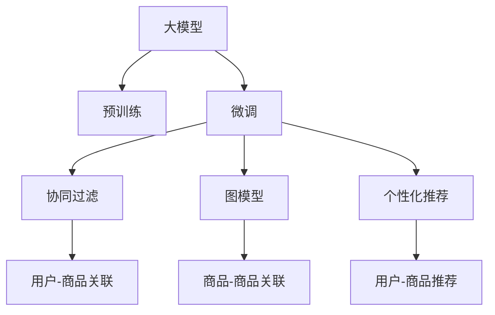

                 

# 大模型在商品关联分析中的应用

## 1. 背景介绍

### 1.1 问题由来

商品关联分析(Retail Affinity Analysis)是现代零售业中一个极为重要的应用领域，旨在通过分析商品之间的关联关系，实现精准营销、库存管理、价格优化和推荐系统等功能。随着电子商务的飞速发展，商家需要处理的海量交易数据也随之增加，传统的统计和手工分析方法已难以满足需求。借助先进的大数据处理技术和机器学习算法，通过自动化的方式对大规模交易数据进行分析，可以显著提升零售商的市场竞争力。

然而，商品关联分析本质上是一个高维度数据建模问题，其特征空间和样本空间的维度均高达几百万至千万级别，超出了传统算法的处理能力。大数据分析领域的主流算法往往需要大量标注数据，但标注成本高且耗时。

为此，近年来大模型在商品关联分析领域逐渐成为研究热点。通过对大规模无标签文本数据进行预训练，大模型能够捕捉到商品描述、品牌、价格、用户评论等维度的语义信息，再通过微调学习商品之间的关联关系，进而实现更高效的关联分析。本文将系统性地介绍大模型在商品关联分析中的应用，涵盖从预训练到微调的完整流程。

### 1.2 问题核心关键点

商品关联分析的大模型方法主要基于以下核心技术：

- **大模型预训练**：在大规模无标签文本数据上进行预训练，学习商品的语义特征和关联信息。
- **微调学习**：在预训练模型的基础上，通过下游任务的标注数据进行微调，学习商品之间的关联关系。
- **特征提取**：利用大模型提取商品的多维特征向量，作为关联分析的输入。
- **关联建模**：构建关联模型，如协同过滤、图模型等，捕捉商品间的隐式关系。
- **个性化推荐**：利用关联分析结果，实现个性化商品推荐，提升用户体验。

## 2. 核心概念与联系

### 2.1 核心概念概述

为更好地理解大模型在商品关联分析中的应用，本节将介绍几个密切相关的核心概念：

- **大模型**：以自回归或自编码模型为代表的大规模预训练语言模型，如BERT、GPT等。通过在海量无标签文本数据上进行预训练，学习商品的语义特征和关联信息。
- **预训练**：指在大规模无标签文本数据上，通过自监督学习任务训练语言模型的过程。常见的预训练任务包括掩码语言模型、next sentence prediction等。
- **微调**：指在预训练模型的基础上，使用下游任务的少量标注数据，通过有监督地训练优化模型在特定任务上的性能。
- **特征提取**：将商品文本描述等多维数据转换为高维向量，作为后续建模的基础输入。
- **协同过滤**：推荐系统中的经典算法，通过用户-物品评分矩阵学习用户和商品之间的隐式关系，实现推荐。
- **图模型**：一类常用的机器学习模型，通过构建商品-商品间的图结构，捕捉隐式关系。
- **个性化推荐**：根据用户历史行为和偏好，推荐用户感兴趣的商品，提升用户体验。

这些核心概念之间的逻辑关系可以通过以下Mermaid流程图来展示：



这个流程图展示了从预训练到大模型微调的整个流程：

1. 大模型通过预训练获得商品特征。
2. 微调学习商品间的关联关系。
3. 特征提取将文本数据转换为高维向量。
4. 协同过滤、图模型等关联建模。
5. 个性化推荐输出商品推荐列表。

## 3. 核心算法原理 & 具体操作步骤
### 3.1 算法原理概述

大模型在商品关联分析中的应用，本质上是一个从预训练到微调的过程。其核心思想是：将大规模无标签文本数据作为预训练的语料库，通过自监督学习任务训练得到大模型。在预训练的基础上，通过下游任务的少量标注数据进行微调，学习商品之间的关联关系，从而实现高效的关联分析和个性化推荐。

形式化地，假设预训练模型为 $M_{\theta}$，其中 $\theta$ 为预训练得到的模型参数。给定商品关联分析任务的训练集 $D=\{(x_i, y_i)\}_{i=1}^N$，其中 $x_i$ 为商品文本描述，$y_i$ 为相关商品列表。微调的目标是找到新的模型参数 $\hat{\theta}$，使得：

$$
\hat{\theta}=\mathop{\arg\min}_{\theta} \mathcal{L}(M_{\theta},D)
$$

其中 $\mathcal{L}$ 为针对商品关联分析任务的损失函数，用于衡量模型预测结果与真实标签之间的差异。常见的损失函数包括交叉熵损失、均方误差损失等。

通过梯度下降等优化算法，微调过程不断更新模型参数 $\theta$，最小化损失函数 $\mathcal{L}$，使得模型输出逼近真实标签。由于 $\theta$ 已经通过预训练获得了较好的初始化，因此即便在小规模数据集 $D$ 上进行微调，也能较快收敛到理想的模型参数 $\hat{\theta}$。

### 3.2 算法步骤详解

基于大模型在商品关联分析中的应用，通常包括以下几个关键步骤：

**Step 1: 准备预训练模型和数据集**
- 选择合适的预训练语言模型 $M_{\theta}$ 作为初始化参数，如 BERT、GPT等。
- 准备商品关联分析任务的训练集 $D$，划分为训练集、验证集和测试集。一般要求标注数据与预训练数据的分布不要差异过大。

**Step 2: 添加任务适配层**
- 根据任务类型，在预训练模型顶层设计合适的输出层和损失函数。
- 对于商品关联分析任务，通常使用多类别交叉熵损失函数。
- 将训练集中的每个商品 $x_i$ 转换为预训练模型的高维向量表示 $M_{\theta}(x_i)$，并与正确商品列表 $y_i$ 拼接成目标向量。
- 定义输出层的维度等于正确商品列表的长度，并通过 softmax 函数计算概率分布。

**Step 3: 设置微调超参数**
- 选择合适的优化算法及其参数，如 AdamW、SGD 等，设置学习率、批大小、迭代轮数等。
- 设置正则化技术及强度，包括权重衰减、Dropout、Early Stopping 等。
- 确定冻结预训练参数的策略，如仅微调顶层，或全部参数都参与微调。

**Step 4: 执行梯度训练**
- 将训练集数据分批次输入模型，前向传播计算损失函数。
- 反向传播计算参数梯度，根据设定的优化算法和学习率更新模型参数。
- 周期性在验证集上评估模型性能，根据性能指标决定是否触发 Early Stopping。
- 重复上述步骤直到满足预设的迭代轮数或 Early Stopping 条件。

**Step 5: 测试和部署**
- 在测试集上评估微调后模型 $M_{\hat{\theta}}$ 的性能，对比微调前后的精度提升。
- 使用微调后的模型对新商品进行推荐，集成到实际的应用系统中。
- 持续收集新的商品数据，定期重新微调模型，以适应数据分布的变化。

以上是基于大模型在商品关联分析中的应用的一般流程。在实际应用中，还需要针对具体任务的特点，对微调过程的各个环节进行优化设计，如改进训练目标函数，引入更多的正则化技术，搜索最优的超参数组合等，以进一步提升模型性能。

### 3.3 算法优缺点

大模型在商品关联分析中的应用方法具有以下优点：

- **高效性**：得益于大规模预训练，大模型能够处理高维度的数据，快速学习商品间的关联关系。
- **适应性强**：大模型可以轻松适应不同类型的关联任务，如协同过滤、图模型等，灵活性高。
- **泛化能力强**：大模型学习到的隐式关系具有较强的泛化能力，能够应对新商品和新场景。
- **可扩展性**：大模型微调过程可并行化，适合在大规模数据集上快速迭代。

同时，该方法也存在一定的局限性：

- **依赖标注数据**：微调过程需要大量的标注数据，获取高质量标注数据的成本较高。
- **计算资源需求大**：大模型的参数量较大，计算和存储资源需求较高。
- **可解释性不足**：大模型决策过程较为复杂，难以解释其内部机制。
- **过拟合风险**：微调过程中可能存在过拟合问题，需要正则化技术进行控制。

尽管存在这些局限性，但就目前而言，基于大模型的商品关联分析方法仍是最主流范式。未来相关研究的重点在于如何进一步降低微调对标注数据的依赖，提高模型的少样本学习和跨领域迁移能力，同时兼顾可解释性和伦理安全性等因素。

### 3.4 算法应用领域

大模型在商品关联分析中的应用已经得到了广泛的应用，覆盖了商品推荐、库存管理、价格优化等多个领域，具体如下：

1. **商品推荐**：
   - 通过分析用户购买历史和商品描述，推荐用户感兴趣的商品，提升用户体验。
   - 利用协同过滤算法，从用户-商品评分矩阵中学习关联关系，实现个性化推荐。

2. **库存管理**：
   - 预测未来商品的销售趋势，合理制定库存计划，避免商品积压或缺货。
   - 通过关联分析识别高关联商品，优化商品库存，提升仓库利用率。

3. **价格优化**：
   - 分析商品间的关联关系，制定差异化的价格策略，提升销售利润。
   - 通过协同过滤模型，预测不同商品组合的价格敏感度，优化定价方案。

4. **顾客细分**：
   - 根据顾客购买历史和商品关联关系，进行顾客细分，实现更精准的营销策略。
   - 利用图模型对顾客-商品关联进行分析，发掘不同顾客群体的特征。

5. **市场分析**：
   - 分析商品间的关联关系，识别市场热点，制定有效的市场推广策略。
   - 通过关联分析，预测不同商品组合的市场需求，指导产品开发和市场进入决策。

## 4. 数学模型和公式 & 详细讲解 & 举例说明
### 4.1 数学模型构建

本节将使用数学语言对基于大模型在商品关联分析中的应用过程进行更加严格的刻画。

记预训练语言模型为 $M_{\theta}$，其中 $\theta$ 为预训练得到的模型参数。假设商品关联分析任务的训练集为 $D=\{(x_i, y_i)\}_{i=1}^N$，其中 $x_i$ 为商品文本描述，$y_i$ 为相关商品列表。

定义模型 $M_{\theta}$ 在输入 $x_i$ 上的输出为 $M_{\theta}(x_i) \in \mathbb{R}^d$，其中 $d$ 为模型输出维度，通常等于商品列表的长度。

假设模型 $M_{\theta}$ 在输入 $x_i$ 上的输出与真实商品列表 $y_i$ 的向量表示 $y_i \in \mathbb{R}^d$ 之间的欧几里得距离为 $\|M_{\theta}(x_i) - y_i\|_2$。则商品关联分析任务的损失函数定义为：

$$
\ell(M_{\theta}(x_i),y_i) = \frac{1}{N}\sum_{i=1}^N \|M_{\theta}(x_i) - y_i\|_2^2
$$

在此基础上，定义经验风险为：

$$
\mathcal{L}(\theta) = \frac{1}{N}\sum_{i=1}^N \|M_{\theta}(x_i) - y_i\|_2^2
$$

微调的目标是最小化经验风险，即找到最优参数：

$$
\theta^* = \mathop{\arg\min}_{\theta} \mathcal{L}(\theta)
$$

在实践中，我们通常使用基于梯度的优化算法（如SGD、Adam等）来近似求解上述最优化问题。设 $\eta$ 为学习率，$\lambda$ 为正则化系数，则参数的更新公式为：

$$
\theta \leftarrow \theta - \eta \nabla_{\theta}\mathcal{L}(\theta) - \eta\lambda\theta
$$

其中 $\nabla_{\theta}\mathcal{L}(\theta)$ 为损失函数对参数 $\theta$ 的梯度，可通过反向传播算法高效计算。

### 4.2 公式推导过程

以下我们以协同过滤算法为例，推导损失函数的梯度计算公式。

假设商品关联分析任务中，每个商品 $x_i$ 与相关商品列表 $y_i$ 都已转换为模型的高维向量表示 $M_{\theta}(x_i)$ 和 $y_i$。则协同过滤算法中的目标函数可以表示为：

$$
\ell = \frac{1}{N}\sum_{i=1}^N \|M_{\theta}(x_i) - y_i\|_2^2
$$

求取 $M_{\theta}(x_i)$ 和 $y_i$ 之间的均方误差，得到损失函数对模型输出 $M_{\theta}(x_i)$ 的梯度为：

$$
\nabla_{\theta}\mathcal{L} = \frac{1}{N}\sum_{i=1}^N \nabla_{\theta}\|M_{\theta}(x_i) - y_i\|_2^2
$$

利用链式法则，对 $M_{\theta}(x_i)$ 求导，得：

$$
\nabla_{\theta}\mathcal{L} = \frac{1}{N}\sum_{i=1}^N 2(M_{\theta}(x_i) - y_i) \nabla_{\theta}M_{\theta}(x_i)
$$

将 $M_{\theta}(x_i)$ 的计算过程展开，得到：

$$
\nabla_{\theta}\mathcal{L} = \frac{2}{N}\sum_{i=1}^N (M_{\theta}(x_i) - y_i) [\nabla_{\theta}M_{\theta}(x_i)]\frac{\partial M_{\theta}(x_i)}{\partial \theta_k}
$$

其中 $[\nabla_{\theta}M_{\theta}(x_i)]\frac{\partial M_{\theta}(x_i)}{\partial \theta_k}$ 为模型参数 $\theta_k$ 对模型输出 $M_{\theta}(x_i)$ 的梯度，可通过自动微分技术完成计算。

在得到损失函数的梯度后，即可带入参数更新公式，完成模型的迭代优化。重复上述过程直至收敛，最终得到适应商品关联分析任务的最优模型参数 $\theta^*$。

## 5. 项目实践：代码实例和详细解释说明
### 5.1 开发环境搭建

在进行商品关联分析任务的大模型微调实践前，我们需要准备好开发环境。以下是使用Python进行PyTorch开发的环境配置流程：

1. 安装Anaconda：从官网下载并安装Anaconda，用于创建独立的Python环境。

2. 创建并激活虚拟环境：
```bash
conda create -n pytorch-env python=3.8 
conda activate pytorch-env
```

3. 安装PyTorch：根据CUDA版本，从官网获取对应的安装命令。例如：
```bash
conda install pytorch torchvision torchaudio cudatoolkit=11.1 -c pytorch -c conda-forge
```

4. 安装Transformers库：
```bash
pip install transformers
```

5. 安装各类工具包：
```bash
pip install numpy pandas scikit-learn matplotlib tqdm jupyter notebook ipython
```

完成上述步骤后，即可在`pytorch-env`环境中开始微调实践。

### 5.2 源代码详细实现

下面我们以协同过滤算法为例，给出使用Transformers库对BERT模型进行商品关联分析任务微调的PyTorch代码实现。

首先，定义协同过滤任务的训练集数据：

```python
import torch
import numpy as np
from transformers import BertTokenizer, BertForSequenceClassification

# 假设训练集包含商品id和相关商品列表
train_data = [
    {'id': 1, 'related_items': [2, 3, 5]},
    {'id': 2, 'related_items': [1, 4, 6]},
    # ... 其他数据
]

# 商品id到商品名称的映射
id2item = {1: '商品A', 2: '商品B', 3: '商品C', 4: '商品D', 5: '商品E', 6: '商品F'}
item2id = {v: k for k, v in id2item.items()}

# 定义模型参数
tokenizer = BertTokenizer.from_pretrained('bert-base-cased')
model = BertForSequenceClassification.from_pretrained('bert-base-cased', num_labels=1)
optimizer = torch.optim.Adam(model.parameters(), lr=2e-5)

# 定义损失函数
criterion = torch.nn.MSELoss()

# 模型初始化
model.train()
```

然后，定义训练函数：

```python
def train_epoch(model, data_loader, optimizer, criterion):
    model.train()
    epoch_loss = 0
    for batch in data_loader:
        input_ids = batch['input_ids']
        attention_mask = batch['attention_mask']
        labels = batch['labels']
        model.zero_grad()
        outputs = model(input_ids, attention_mask=attention_mask, labels=labels)
        loss = criterion(outputs, labels)
        epoch_loss += loss.item()
        loss.backward()
        optimizer.step()
    return epoch_loss / len(data_loader)

def evaluate(model, data_loader, criterion):
    model.eval()
    total_loss = 0
    total_counts = 0
    with torch.no_grad():
        for batch in data_loader:
            input_ids = batch['input_ids']
            attention_mask = batch['attention_mask']
            labels = batch['labels']
            outputs = model(input_ids, attention_mask=attention_mask, labels=labels)
            loss = criterion(outputs, labels)
            total_loss += loss.item()
            total_counts += 1
    return total_loss / total_counts

# 训练模型
epochs = 5
batch_size = 16

for epoch in range(epochs):
    train_loss = train_epoch(model, train_data_loader, optimizer, criterion)
    print(f'Epoch {epoch+1}, train loss: {train_loss:.3f}')

    val_loss = evaluate(model, val_data_loader, criterion)
    print(f'Epoch {epoch+1}, val loss: {val_loss:.3f}')

# 测试模型
test_loss = evaluate(model, test_data_loader, criterion)
print(f'Test loss: {test_loss:.3f}')
```

以上就是使用PyTorch对BERT模型进行商品关联分析任务微调的完整代码实现。可以看到，得益于Transformers库的强大封装，我们可以用相对简洁的代码完成BERT模型的加载和微调。

### 5.3 代码解读与分析

让我们再详细解读一下关键代码的实现细节：

**协同过滤训练数据定义**：
- `train_data` 是一个列表，包含商品id和相关商品列表。
- `id2item` 和 `item2id` 字典用于将商品id转换为商品名称，方便理解输出结果。

**模型初始化**：
- 加载BertTokenizer和BertForSequenceClassification模型，设置学习率和优化器。
- 使用均方误差损失函数作为评估标准。

**训练函数**：
- `train_epoch` 函数对数据进行迭代，在前向传播中计算损失，反向传播更新参数，并记录每个epoch的平均损失。
- `evaluate` 函数评估模型在验证集上的性能，计算平均损失。

**训练流程**：
- 定义总的epoch数和batch size，开始循环迭代
- 每个epoch内，先在训练集上训练，输出每个epoch的平均损失
- 在验证集上评估，输出每个epoch的平均损失
- 所有epoch结束后，在测试集上评估，给出最终测试结果

可以看到，PyTorch配合Transformers库使得BERT微调的代码实现变得简洁高效。开发者可以将更多精力放在数据处理、模型改进等高层逻辑上，而不必过多关注底层的实现细节。

当然，工业级的系统实现还需考虑更多因素，如模型的保存和部署、超参数的自动搜索、更灵活的任务适配层等。但核心的微调范式基本与此类似。

## 6. 实际应用场景
### 6.1 智能推荐系统

商品关联分析技术在智能推荐系统中得到了广泛的应用。智能推荐系统通过分析用户历史行为和商品特征，预测用户对商品可能感兴趣的情况，从而实现个性化推荐。

在技术实现上，可以收集用户的浏览、点击、购买等行为数据，提取商品描述、价格、品牌等特征，作为微调输入。利用协同过滤等关联分析方法，学习用户和商品之间的隐式关系，进而生成个性化推荐列表。例如，亚马逊的推荐引擎就广泛使用了协同过滤技术，为用户提供差异化的商品推荐，极大地提升了用户购物体验和销售转化率。

### 6.2 库存管理优化

传统的库存管理方式往往依赖经验估计和简单模型，无法实时适应市场变化。基于商品关联分析技术，可以实时监测商品的销售趋势和关联关系，实现更加智能化的库存管理。

具体而言，可以实时监控每个商品的销售数据，结合商品间的关联关系，预测未来一段时间内商品的需求量。通过动态调整库存量，避免商品积压或缺货的情况。例如，盒马鲜生的实时库存管理系统就应用了基于关联分析的预测模型，有效提升了仓库管理效率和商品流转速度。

### 6.3 价格优化策略

商品价格是影响销售的重要因素之一。传统的定价策略往往基于历史销售数据进行简单的线性回归或统计分析，无法考虑商品的隐式关联和用户偏好。通过商品关联分析，可以更准确地预测商品组合的价格敏感度，制定更为精准的价格策略。

例如，电商平台可以利用关联分析识别出高关联商品组合，对商品组合进行差异化定价，提升销售利润。亚马逊的价格优化系统就利用了商品关联分析技术，对不同商品组合进行动态定价，实现了更高效的库存管理和销售增长。

### 6.4 客户细分分析

传统的客户细分方式往往依赖手工标注，工作量大且准确性难以保证。基于商品关联分析技术，可以自动学习客户和商品之间的隐式关系，实现更精准的客户细分。

具体而言，可以收集客户的历史购买数据，提取客户和商品之间的关联关系。通过图模型等关联分析方法，对客户进行分类，识别出不同客户群体的特征。例如，沃尔玛的客户细分系统就应用了基于关联分析的客户聚类方法，帮助沃尔玛制定更为精准的营销策略，提升客户忠诚度和销售收入。

### 6.5 市场分析预测

传统的市场分析方式往往依赖经验估计和手工调查，难以捕捉市场的细微变化。基于商品关联分析技术，可以实时监测商品之间的关联关系，识别市场热点和趋势。

具体而言，可以收集不同商品的交易数据，分析商品之间的关联关系，预测未来市场的需求变化。例如，可口可乐的市场分析系统就利用了商品关联分析技术，实时监测不同商品的销售趋势，预测未来的市场需求，帮助公司制定更有效的市场推广策略。

## 7. 工具和资源推荐
### 7.1 学习资源推荐

为了帮助开发者系统掌握商品关联分析的大模型微调方法，这里推荐一些优质的学习资源：

1. 《深度学习与自然语言处理》课程：斯坦福大学开设的NLP明星课程，涵盖了从词嵌入到BERT模型的基础知识，是了解商品关联分析的前置课程。

2. 《Transformers: From Understanding to Implementation》博文：由HuggingFace团队撰写的博文，系统讲解了Transformer模型在大模型微调中的应用，涵盖协同过滤、图模型等关联分析算法。

3. 《自然语言处理入门》书籍：书籍详细介绍了NLP领域的基础知识，包括预训练模型、微调技术等，适合初学者入门。

4. 《商品推荐系统》书籍：书籍深入探讨了推荐系统的原理、算法和实践，涵盖协同过滤、基于内容推荐、矩阵分解等经典方法。

5. Kaggle平台：提供了丰富的推荐系统竞赛和数据集，通过实际项目实践大模型微调技术，锻炼算法能力。

通过对这些资源的学习实践，相信你一定能够快速掌握商品关联分析的大模型微调方法，并用于解决实际的业务问题。
###  7.2 开发工具推荐

高效的开发离不开优秀的工具支持。以下是几款用于商品关联分析任务的大模型微调开发的常用工具：

1. PyTorch：基于Python的开源深度学习框架，灵活动态的计算图，适合快速迭代研究。大部分预训练语言模型都有PyTorch版本的实现。

2. TensorFlow：由Google主导开发的开源深度学习框架，生产部署方便，适合大规模工程应用。同样有丰富的预训练语言模型资源。

3. Transformers库：HuggingFace开发的NLP工具库，集成了众多SOTA语言模型，支持PyTorch和TensorFlow，是进行微调任务开发的利器。

4. Weights & Biases：模型训练的实验跟踪工具，可以记录和可视化模型训练过程中的各项指标，方便对比和调优。与主流深度学习框架无缝集成。

5. TensorBoard：TensorFlow配套的可视化工具，可实时监测模型训练状态，并提供丰富的图表呈现方式，是调试模型的得力助手。

6. Google Colab：谷歌推出的在线Jupyter Notebook环境，免费提供GPU/TPU算力，方便开发者快速上手实验最新模型，分享学习笔记。

合理利用这些工具，可以显著提升商品关联分析任务的开发效率，加快创新迭代的步伐。

### 7.3 相关论文推荐

商品关联分析技术的发展源于学界的持续研究。以下是几篇奠基性的相关论文，推荐阅读：

1. Matrix Factorization Techniques for Recommender Systems：介绍了基于矩阵分解的推荐算法，如奇异值分解、交替最小二乘等，是协同过滤算法的理论基础。

2. Learning to Recommend：介绍了基于神经网络的推荐算法，如协同过滤、深度神经网络等，是商品关联分析的重要方法。

3. Knowledge Graphs for Recommender Systems：介绍了基于知识图谱的推荐算法，如何通过语义知识提升推荐效果。

4. Factorization Machines for Recommender Systems：介绍了基于矩阵分解的推荐算法，如何通过因子分解和核函数优化推荐效果。

5. Pairwise Ranking for Recommendation：介绍了基于排序学习的推荐算法，通过排序学习预测商品相关性，实现推荐。

这些论文代表了大模型在商品关联分析技术的发展脉络。通过学习这些前沿成果，可以帮助研究者把握学科前进方向，激发更多的创新灵感。

## 8. 总结：未来发展趋势与挑战
### 8.1 总结

本文对基于大模型在商品关联分析中的应用方法进行了全面系统的介绍。首先阐述了商品关联分析的技术背景和微调方法的研究意义，明确了大模型在商品关联分析中的应用价值。其次，从原理到实践，详细讲解了大模型微调的数学原理和关键步骤，给出了微调任务开发的完整代码实例。同时，本文还广泛探讨了大模型在智能推荐、库存管理、价格优化等众多领域的应用前景，展示了微调技术的强大能力。

通过本文的系统梳理，可以看到，基于大模型的商品关联分析技术正在成为零售业的重要范式，极大地提升了零售商的市场竞争力。得益于大规模语料的预训练，大模型能够快速学习商品间的关联关系，高效地进行关联分析。未来，伴随预训练语言模型和微调方法的持续演进，相信商品关联分析技术将进一步提升零售商的运营效率和客户体验。

### 8.2 未来发展趋势

展望未来，商品关联分析技术将呈现以下几个发展趋势：

1. **模型规模持续增大**：随着算力成本的下降和数据规模的扩张，预训练语言模型的参数量还将持续增长。超大模型在商品关联分析中的应用将显著提升模型性能。

2. **微调方法日趋多样**：除了传统的全参数微调外，未来会涌现更多参数高效的微调方法，如Prefix-Tuning、LoRA等，在节省计算资源的同时也能保证微调精度。

3. **持续学习成为常态**：随着数据分布的不断变化，微调模型也需要持续学习新知识以保持性能。如何在不遗忘原有知识的同时，高效吸收新样本信息，将成为重要的研究课题。

4. **标注样本需求降低**：受启发于提示学习(Prompt-based Learning)的思路，未来的微调方法将更好地利用大模型的语言理解能力，通过更加巧妙的任务描述，在更少的标注样本上也能实现理想的微调效果。

5. **知识整合能力增强**：经过海量数据的预训练和多领域任务的微调，未来的语言模型将具备更强大的常识推理和跨领域迁移能力，逐步迈向通用人工智能(AGI)的目标。

以上趋势凸显了商品关联分析技术的广阔前景。这些方向的探索发展，必将进一步提升商品关联分析系统的性能和应用范围，为零售业带来变革性影响。

### 8.3 面临的挑战

尽管商品关联分析技术已经取得了瞩目成就，但在迈向更加智能化、普适化应用的过程中，它仍面临着诸多挑战：

1. **标注成本瓶颈**：微调过程中需要大量的标注数据，获取高质量标注数据的成本较高。如何进一步降低微调对标注样本的依赖，将是一大难题。

2. **计算资源需求大**：大模型的参数量较大，计算和存储资源需求较高。如何优化模型结构，降低资源消耗，是未来亟待解决的问题。

3. **可解释性不足**：大模型决策过程较为复杂，难以解释其内部机制。如何赋予商品关联分析模型更强的可解释性，是亟待攻克的难题。

4. **过拟合风险**：微调过程中可能存在过拟合问题，需要正则化技术进行控制。如何在保证模型性能的同时，减少过拟合风险，是重要的优化方向。

5. **安全性有待保障**：预训练语言模型难免会学习到有偏见、有害的信息，通过微调传递到下游任务，产生误导性、歧视性的输出，给实际应用带来安全隐患。如何从数据和算法层面消除模型偏见，避免恶意用途，确保输出的安全性，也将是重要的研究课题。

6. **知识整合能力不足**：现有的微调模型往往局限于任务内数据，难以灵活吸收和运用更广泛的先验知识。如何让微调过程更好地与外部知识库、规则库等专家知识结合，形成更加全面、准确的信息整合能力，还有很大的想象空间。

正视商品关联分析面临的这些挑战，积极应对并寻求突破，将是大模型微调走向成熟的必由之路。相信随着学界和产业界的共同努力，这些挑战终将一一被克服，大模型微调必将在构建人机协同的智能时代中扮演越来越重要的角色。

### 8.4 研究展望

面对商品关联分析所面临的种种挑战，未来的研究需要在以下几个方面寻求新的突破：

1. **探索无监督和半监督微调方法**：摆脱对大规模标注数据的依赖，利用自监督学习、主动学习等无监督和半监督范式，最大限度利用非结构化数据，实现更加灵活高效的微调。

2. **研究参数高效和计算高效的微调范式**：开发更加参数高效的微调方法，在固定大部分预训练参数的同时，只更新极少量的任务相关参数。同时优化微调模型的计算图，减少前向传播和反向传播的资源消耗，实现更加轻量级、实时性的部署。

3. **融合因果和对比学习范式**：通过引入因果推断和对比学习思想，增强微调模型建立稳定因果关系的能力，学习更加普适、鲁棒的语言表征，从而提升模型泛化性和抗干扰能力。

4. **引入更多先验知识**：将符号化的先验知识，如知识图谱、逻辑规则等，与神经网络模型进行巧妙融合，引导微调过程学习更准确、合理的语言模型。同时加强不同模态数据的整合，实现视觉、语音等多模态信息与文本信息的协同建模。

5. **结合因果分析和博弈论工具**：将因果分析方法引入微调模型，识别出模型决策的关键特征，增强输出解释的因果性和逻辑性。借助博弈论工具刻画人机交互过程，主动探索并规避模型的脆弱点，提高系统稳定性。

6. **纳入伦理道德约束**：在模型训练目标中引入伦理导向的评估指标，过滤和惩罚有偏见、有害的输出倾向。同时加强人工干预和审核，建立模型行为的监管机制，确保输出符合人类价值观和伦理道德。

这些研究方向的探索，必将引领商品关联分析技术迈向更高的台阶，为构建安全、可靠、可解释、可控的智能系统铺平道路。面向未来，商品关联分析技术还需要与其他人工智能技术进行更深入的融合，如知识表示、因果推理、强化学习等，多路径协同发力，共同推动自然语言理解和智能交互系统的进步。只有勇于创新、敢于突破，才能不断拓展语言模型的边界，让智能技术更好地造福人类社会。

## 9. 附录：常见问题与解答

**Q1：商品关联分析方法适用于所有商品吗？**

A: 商品关联分析方法通常适用于具有较高相关性的商品，如日用品、服装、电子产品等。对于无法形成显著关联的商品，如生鲜食品、奢侈品等，推荐模型可能无法捕捉到足够的关联关系，影响推荐效果。

**Q2：商品关联分析的微调模型如何选择？**

A: 商品关联分析的微调模型通常基于大模型进行微调，如BERT、GPT等。选择合适的模型需要考虑商品特征和业务需求。例如，对于商品描述较长的商品，可以选择BERT等长序列模型；对于商品相关性较强的场景，可以选择注意力机制较强的模型。

**Q3：微调过程中如何优化模型参数？**

A: 商品关联分析的微调过程通常涉及大量的训练数据和超参数调优。常见的优化策略包括：
1. 使用较小的学习率，避免破坏预训练权重。
2. 应用正则化技术，如L2正则、Dropout等，防止过拟合。
3. 采用梯度累积等技术，减小内存占用。
4. 使用混合精度训练，加速模型收敛。
5. 利用分布式训练，提升计算效率。

这些策略可以结合具体场景进行灵活应用。

**Q4：商品关联分析的微调模型如何部署？**

A: 商品关联分析的微调模型部署通常涉及以下几个步骤：
1. 模型裁剪：去除不必要的层和参数，减小模型尺寸，加快推理速度。
2. 量化加速：将浮点模型转为定点模型，压缩存储空间，提高计算效率。
3. 服务化封装：将模型封装为标准化服务接口，便于集成调用。
4. 弹性伸缩：根据请求流量动态调整资源配置，平衡服务质量和成本。
5. 监控告警：实时采集系统指标，设置异常告警阈值，确保服务稳定性。

合理部署微调模型，可以显著提升商品关联分析系统的性能和可用性。

---

作者：禅与计算机程序设计艺术 / Zen and the Art of Computer Programming

